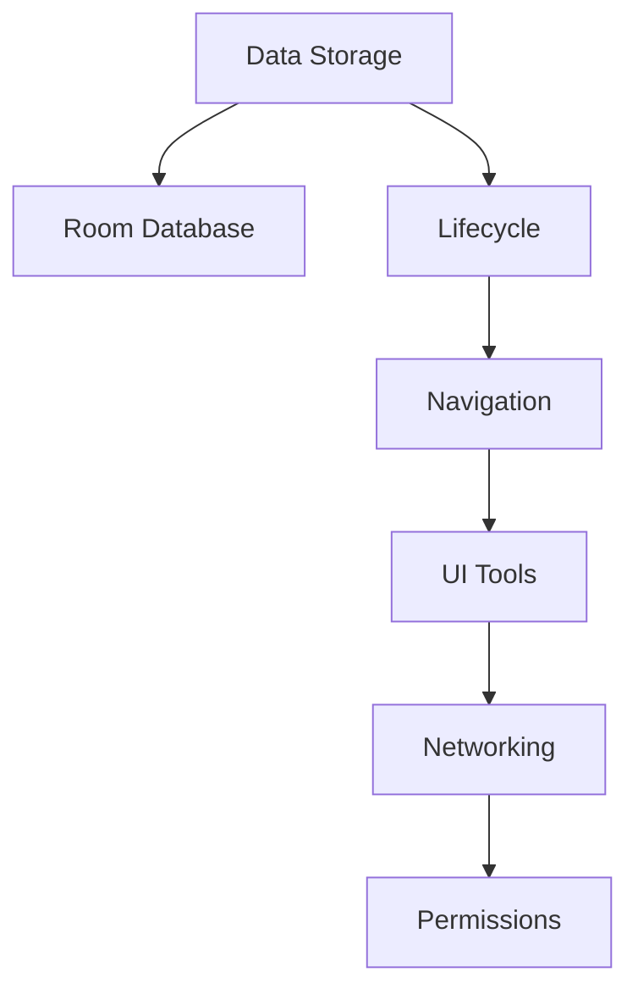

                 

# Android Jetpack组件应用

## 1. 背景介绍

Android Jetpack是谷歌推出的一组强大的库和工具，旨在帮助开发者构建更好的Android应用。Jetpack组件是一组可重用的模块化库，它们提供了一组工具和框架，可以帮助开发者更轻松地构建高效、安全、可维护的应用程序。Jetpack组件覆盖了各种常见的应用程序需求，如数据存储、导航、UI工具、网络请求、权限管理等。本文将详细介绍Android Jetpack组件的应用，包括其核心概念、使用方法和实践经验。

## 2. 核心概念与联系

### 2.1 核心概念概述

Android Jetpack组件是一组可重用的库和工具，可以帮助开发者更轻松地构建高效、安全、可维护的Android应用程序。Jetpack组件覆盖了各种常见的应用程序需求，如数据存储、导航、UI工具、网络请求、权限管理等。其主要包括以下几个组件：

- **Data：** 数据存储和数据库管理。
- **Lifecycle：** 组件生命周期管理。
- **Navigation：** 导航和路由管理。
- **UI：** 用户界面和视图工具。
- **Network：** 网络请求和连接管理。
- **Permission：** 权限管理。

这些组件之间相互关联，形成一个完整的生态系统，帮助开发者构建稳定、高性能的应用程序。

### 2.2 核心概念原理和架构的 Mermaid 流程图



这个流程图展示了Android Jetpack组件的基本结构。Data组件通过Room Database提供数据存储和数据库管理；Lifecycle组件通过Activity和Fragment生命周期管理功能帮助开发者处理应用状态；Navigation组件通过NavGraph和Navigator提供导航和路由管理；UI组件通过ViewModel和LifecycleOwner提供视图和UI工具；Network组件通过Retrofit和HttpUrlConnection提供网络请求和连接管理；Permission组件通过PermissionsResultActivity提供权限管理。

## 3. 核心算法原理 & 具体操作步骤

### 3.1 算法原理概述

Android Jetpack组件的核心算法原理是通过组件化设计和模块化封装，帮助开发者构建高效、可维护的应用程序。其设计原则包括：

- **组件化设计：** 将应用程序拆分为独立的组件，每个组件负责特定的功能，使应用程序更易于理解和维护。
- **模块化封装：** 将各个组件封装为独立的库，方便开发者复用和扩展。
- **解耦设计：** 将组件之间的依赖关系降至最低，提高应用程序的灵活性和可扩展性。
- **用户中心设计：** 以用户为中心，关注用户的使用体验和交互效果。

### 3.2 算法步骤详解

Android Jetpack组件的应用步骤包括以下几个关键步骤：

1. **集成Jetpack：** 在项目中集成Android Jetpack库和依赖。
2. **选择组件：** 根据应用程序需求选择所需的Jetpack组件。
3. **实现组件：** 按照组件文档实现组件功能。
4. **测试组件：** 对组件进行测试，确保其正常工作。
5. **发布组件：** 将组件打包并发布到应用程序中。

### 3.3 算法优缺点

Android Jetpack组件的优点包括：

- **易用性：** 提供了易用的API和文档，使开发者可以快速上手。
- **高效性：** 提供了高效的算法和工具，使应用程序运行更加流畅。
- **可维护性：** 提供了模块化的设计，使应用程序更易于维护和扩展。

缺点包括：

- **学习曲线：** 需要一定的学习曲线，开发者需要花费时间了解各个组件的功能和使用方法。
- **性能影响：** 某些组件的性能可能会影响应用程序的整体性能，需要开发者进行调优。
- **依赖管理：** 需要开发者自己管理依赖，避免依赖冲突和版本问题。

### 3.4 算法应用领域

Android Jetpack组件广泛应用于各种类型的Android应用程序，包括但不限于：

- **社交媒体应用：** 提供消息、评论、分享等功能。
- **电子商务应用：** 提供购物车、订单管理、支付等功能。
- **健康应用：** 提供健康监测、饮食管理、运动记录等功能。
- **教育应用：** 提供学习计划、笔记管理、作业提交等功能。

## 4. 数学模型和公式 & 详细讲解 & 举例说明

### 4.1 数学模型构建

Android Jetpack组件的应用通常不需要复杂的数学模型，其主要依赖于组件提供的API和工具。但是，某些组件（如NavGraph）可能涉及到图论和路径算法，可以通过数学模型进行分析和优化。

### 4.2 公式推导过程

以NavGraph为例，NavGraph中的路径算法可以通过Dijkstra算法进行优化。Dijkstra算法是一种单源最短路径算法，可以用于计算两个节点之间的最短路径。在NavGraph中，可以通过计算节点之间的最短路径来确定导航的最优路径。

### 4.3 案例分析与讲解

假设我们正在开发一个导航应用，用户需要从起点导航到终点。可以使用NavGraph和Dijkstra算法来计算最短路径。具体步骤如下：

1. 将起点和终点添加到NavGraph中。
2. 在NavGraph中定义导航节点和路径。
3. 使用Dijkstra算法计算最短路径。
4. 根据最短路径进行导航。

## 5. 项目实践：代码实例和详细解释说明

### 5.1 开发环境搭建

在开始Android Jetpack组件的实践之前，需要确保开发环境已经搭建好。具体步骤如下：

1. 安装Android Studio，并确保已经配置好SDK和模拟器。
2. 创建一个新的Android项目，选择Empty Activity模板。
3. 在项目的build.gradle文件中添加依赖，例如：

```gradle
dependencies {
    implementation 'com.google.android.material:material:1.4.0'
    implementation 'androidx.lifecycle:lifecycle-runtime-ktx:2.5.0'
    implementation 'androidx.lifecycle:lifecycle-viewmodel-ktx:2.5.0'
    implementation 'androidx.navigation:navigation-fragment-ktx:2.4.0'
    implementation 'androidx.navigation:navigation-fragment-compat:2.4.0'
    implementation 'androidx.navigation:navigation-ui-ktx:2.4.0'
}
```

### 5.2 源代码详细实现

以下是一个使用NavGraph的示例代码，演示如何在Activity中导航到另一个Activity：

```java
import androidx.appcompat.app.AppCompatActivity;
import androidx.navigation.NavController;
import androidx.navigation.Navigation;
import androidx.navigation.ui.AppCompatNavigationUI;
import androidx.navigation.ui.NavigationUI;
import android.os.Bundle;
import androidx.appcompat.widget.Toolbar;
import androidx.appcompat.app.AppCompatActivity;

public class MainActivity extends AppCompatActivity {
    @Override
    protected void onCreate(Bundle savedInstanceState) {
        super.onCreate(savedInstanceState);
        setContentView(R.layout.activity_main);
        
        Toolbar toolbar = findViewById(R.id.toolbar);
        setSupportActionBar(toolbar);
        
        NavController navController = Navigation.findNavController(this, R.id.nav_host_fragment);
        
        AppCompatNavigationUI.setupActionBarWithNavController(this, navController);
        AppCompatNavigationUI.setupNavigationView(this, navController);
        
        // 导航到另一个Activity
        NavDestination destination = navController.getGraph().findDestinationById(R.id.action_main_to_second);
        if (destination != null) {
            AppCompatNavigationUI.navigateUpAndPop(this, destination, false);
        }
    }
}
```

### 5.3 代码解读与分析

以上代码演示了如何使用NavController进行导航。NavController是NavGraph的核心组件，它提供了对NavGraph的访问和管理。在Activity中，可以通过NavController获取NavGraph，并使用它来导航到另一个Activity或Fragment。

### 5.4 运行结果展示

运行以上代码，将展示一个带有导航菜单的Activity。点击导航菜单上的按钮，可以导航到另一个Activity。

## 6. 实际应用场景

Android Jetpack组件广泛应用于各种类型的Android应用程序，以下是几个实际应用场景：

### 6.1 社交媒体应用

社交媒体应用通常需要提供消息、评论、分享等功能。可以使用Room Database来存储用户数据和消息数据，使用Navigation来管理用户界面的导航，使用Retrofit来处理网络请求。

### 6.2 电子商务应用

电子商务应用通常需要提供购物车、订单管理、支付等功能。可以使用Room Database来存储订单数据，使用Navigation来管理用户界面的导航，使用Retrofit来处理网络请求。

### 6.3 健康应用

健康应用通常需要提供健康监测、饮食管理、运动记录等功能。可以使用Room Database来存储健康数据，使用Navigation来管理用户界面的导航，使用Retrofit来处理网络请求。

### 6.4 教育应用

教育应用通常需要提供学习计划、笔记管理、作业提交等功能。可以使用Room Database来存储学习数据，使用Navigation来管理用户界面的导航，使用Retrofit来处理网络请求。

## 7. 工具和资源推荐

### 7.1 学习资源推荐

为了帮助开发者掌握Android Jetpack组件的应用，以下是一些推荐的资源：

- Android Jetpack官方文档：Android Jetpack官方文档提供了详细的组件介绍和使用指南。
- Android Jetpack实战教程：Android Jetpack实战教程提供了丰富的案例和实践经验。
- Android Jetpack开源项目：Android Jetpack开源项目提供了丰富的组件和插件。

### 7.2 开发工具推荐

Android Jetpack组件需要依赖于Android Studio和Gradle进行开发和构建。以下是一些推荐的开发工具：

- Android Studio：Android Studio是官方推荐的开发工具，提供了强大的IDE功能和调试工具。
- Gradle：Gradle是Android Studio的构建工具，提供了灵活的依赖管理和构建配置。

### 7.3 相关论文推荐

Android Jetpack组件的应用涉及到了多种技术和工具，以下是一些相关的论文推荐：

- Android Jetpack组件设计原理：探讨了Android Jetpack组件的设计原理和实现机制。
- Android Jetpack组件性能优化：探讨了Android Jetpack组件的性能优化和调优方法。
- Android Jetpack组件开发实践：探讨了Android Jetpack组件的开发实践和最佳实践。

## 8. 总结：未来发展趋势与挑战

### 8.1 研究成果总结

Android Jetpack组件在Android开发中已经得到了广泛的应用，通过组件化设计和模块化封装，使应用程序更易于理解和维护。组件化的思想已经成为Android开发的标准。

### 8.2 未来发展趋势

未来Android Jetpack组件将有以下发展趋势：

- **更多组件：** 随着应用程序需求的不断变化，Android Jetpack组件将不断扩展和丰富。
- **跨平台支持：** Android Jetpack组件将逐步支持跨平台开发，如Web和iOS。
- **人工智能支持：** Android Jetpack组件将支持人工智能和机器学习技术，提升应用程序的智能化水平。

### 8.3 面临的挑战

Android Jetpack组件在发展过程中也面临着一些挑战：

- **学习曲线：** 组件数量众多，开发者需要花费大量时间学习和掌握各个组件。
- **性能问题：** 组件的性能问题可能影响应用程序的整体性能，需要开发者进行优化。
- **依赖管理：** 开发者需要自己管理组件的依赖，避免依赖冲突和版本问题。

### 8.4 研究展望

未来Android Jetpack组件的研究方向包括：

- **组件化设计：** 进一步完善组件化设计，使应用程序更易于理解和维护。
- **性能优化：** 优化组件的性能和资源消耗，提高应用程序的运行效率。
- **跨平台支持：** 支持跨平台开发，使Android Jetpack组件在更多平台上得到应用。

## 9. 附录：常见问题与解答

**Q1: 如何集成Android Jetpack组件？**

A: 在项目的build.gradle文件中添加依赖即可，例如：

```gradle
dependencies {
    implementation 'com.google.android.material:material:1.4.0'
    implementation 'androidx.lifecycle:lifecycle-runtime-ktx:2.5.0'
    implementation 'androidx.lifecycle:lifecycle-viewmodel-ktx:2.5.0'
    implementation 'androidx.navigation:navigation-fragment-ktx:2.4.0'
    implementation 'androidx.navigation:navigation-fragment-compat:2.4.0'
    implementation 'androidx.navigation:navigation-ui-ktx:2.4.0'
}
```

**Q2: 如何使用NavGraph进行导航？**

A: 在Activity中获取NavController，然后使用它来导航到另一个Activity或Fragment。例如：

```java
NavController navController = Navigation.findNavController(this, R.id.nav_host_fragment);
NavDestination destination = navController.getGraph().findDestinationById(R.id.action_main_to_second);
AppCompatNavigationUI.navigateUpAndPop(this, destination, false);
```

**Q3: 如何使用Room Database进行数据存储？**

A: 在AndroidManifest.xml文件中添加Room数据库的访问权限，然后在代码中创建Room数据库和数据表。例如：

```java
 RoomDatabase.Builder<MyDatabase> builder = Room.databaseBuilder(context, MyDatabase.class, "my_database");
  builder.allowMainThreadQueries();
  MyDatabase db = builder.build();
  MyDao myDao = db.myDao();
  myDao.insert(myObject);
```

**Q4: 如何使用PermissionsResultActivity进行权限管理？**

A: 在Activity中处理权限请求的结果，例如：

```java
@Override
public void onRequestPermissionsResult(int requestCode, @NonNull String[] permissions, @NonNull int[] grantResults) {
    super.onRequestPermissionsResult(requestCode, permissions, grantResults);
    PermissionsResultActivity.onRequestPermissionsResult(requestCode, permissions, grantResults);
}
```

**Q5: 如何使用UI工具进行用户界面设计？**

A: 使用ViewModel和LifecycleOwner进行视图和UI工具的设计，例如：

```java
ViewModelProvider.Factory factory = new ViewModelProvider.Factory() {
    @Override
    public <T> T create(Class<T> modelClass) {
        return ViewModelProviders.of(this, new ViewModelProvider.NewInstanceFactory()).get(modelClass);
    }
};
viewModel = ViewModelProviders.of(this, factory).get(MyViewModel.class);
```

---

作者：禅与计算机程序设计艺术 / Zen and the Art of Computer Programming

