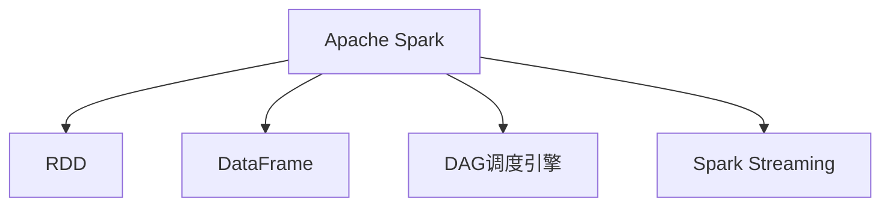

                 

# Apache Spark：大规模数据处理的利器

> 关键词：Apache Spark, 大数据, 分布式计算, 机器学习, 数据仓库, 流式计算, 高性能, 开发工具

## 1. 背景介绍

### 1.1 问题由来

随着互联网、物联网、社交网络等新兴技术的迅猛发展，数据量呈指数级增长。从金融交易数据、医疗记录、社交媒体到工业传感器数据，各种来源的数据正在以前所未有的速度积累。这些数据不仅数据量庞大，还具备高维度、非结构化、多模态等特征，使得传统的数据处理方式难以应对。

针对这一挑战，Apache Spark应运而生。Spark是一个快速、通用、可扩展的大数据处理引擎，由UC Berkeley的AMPLab于2010年发布，是Hadoop的升级版，结合了内存计算和分布式计算的特点，能够处理大规模数据集，支持多种数据处理和分析任务。

### 1.2 问题核心关键点

Spark的核心优势在于其强大的内存计算能力、灵活的数据处理方式以及广泛的生态系统支持。通过Spark，开发者能够高效地进行大规模数据处理，快速迭代算法模型，构建高效的数据仓库和流式处理系统，推动大数据分析、机器学习等技术的广泛应用。

在实际应用中，Spark被广泛应用于数据仓库、ETL（Extract, Transform, Load）、图处理、机器学习、流式计算等多个领域，帮助企业和研究机构解决复杂的数据处理和分析问题，推动大数据技术的产业化进程。

## 2. 核心概念与联系

### 2.1 核心概念概述

为更好地理解Apache Spark的核心原理和应用方法，本节将介绍几个关键概念：

- Apache Spark：Apache Spark是一个开源的分布式计算系统，基于内存计算，支持Hadoop 1和Hadoop 2，拥有广泛的数据处理和分析功能。
- RDD（Resilient Distributed Dataset）：Spark中最核心的数据抽象，是一种基于分布式共享内存的弹性数据集，支持多种数据转换操作。
- DataFrame：一种基于RDD的高级数据抽象，提供更为结构化和统一的API，便于进行数据处理和分析。
- DAG（Directed Acyclic Graph）调度引擎：Spark内部的一种有向无环图调度引擎，用于优化数据流图，提升计算效率。
- Spark Streaming：Spark的流式处理框架，支持实时数据处理和分析，适用于时间敏感型应用。

这些概念之间的逻辑关系可以通过以下Mermaid流程图来展示：



这个流程图展示了Spark的基本架构和关键组件：

1. Apache Spark：作为整个系统的核心，提供了分布式计算和内存计算的能力。
2. RDD：是Spark处理数据的基本单元，支持多种数据转换操作。
3. DataFrame：基于RDD，提供更为结构化的数据处理API，便于数据分析和机器学习任务。
4. DAG调度引擎：优化数据流图，提升计算效率。
5. Spark Streaming：支持流式数据处理，适用于实时应用。

## 3. 核心算法原理 & 具体操作步骤
### 3.1 算法原理概述

Apache Spark的核心算法原理基于分布式计算和内存计算。其核心思想是通过将数据分割为多个小片段，在分布式集群上并行处理，结合内存计算的高效性，实现大规模数据的高效处理。

具体来说，Spark采用弹性分布式数据集（RDD）作为数据抽象，支持多种数据转换操作，如映射（map）、聚合（reduce）、过滤（filter）、联接（join）等。这些操作可以在分布式集群上并行执行，提升处理效率。

### 3.2 算法步骤详解

Apache Spark的算法步骤可以分为以下几个关键阶段：

**Step 1: 数据准备与上传**
- 将本地数据文件上传到分布式文件系统（如HDFS、S3等）。
- 通过Spark的API读取分布式文件系统中的数据，构建RDD。

**Step 2: 数据处理与转换**
- 在RDD上执行各种数据转换操作，如map、filter、reduce、join等。
- 使用DataFrame API进行更为高级的数据处理和分析，支持结构化和半结构化数据。

**Step 3: 数据聚合与汇总**
- 使用reduceByKey、groupByKey等聚合操作，对数据进行汇总和统计。
- 对RDD进行分组、聚合、排序等操作，提升数据处理效率。

**Step 4: 数据存储与输出**
- 将处理后的结果保存为分布式文件系统中的文件。
- 通过Spark Streaming框架，实时处理流数据，并将其保存为分布式文件系统或数据库。

### 3.3 算法优缺点

Apache Spark的优点包括：

1. 高效内存计算：Spark利用内存计算的优势，能够快速处理大规模数据集，提升计算效率。
2. 分布式计算：通过分布式集群，Spark能够并行处理海量数据，支持大规模数据处理。
3. 多样化的数据处理方式：支持批处理、流处理、SQL查询等多种数据处理方式，灵活性高。
4. 广泛的生态系统支持：Spark的生态系统包括Spark SQL、Spark Streaming、MLlib、GraphX等多个组件，能够满足各种数据处理需求。
5. 易用性高：Spark提供了丰富的API和工具，支持Python、Scala、Java等多种编程语言。

缺点包括：

1. 内存消耗高：Spark需要存储大量的中间数据在内存中，内存使用量大。
2. 学习曲线陡峭：Spark的API相对复杂，初学者需要花费一定时间学习。
3. 依赖Hadoop：Spark依赖Hadoop生态，需要运行在Hadoop集群上，部署复杂。
4. 性能受限：在处理大规模数据时，Spark的性能受限于网络带宽、磁盘I/O等因素。

### 3.4 算法应用领域

Apache Spark被广泛应用于以下几个主要领域：

1. 大数据分析：Spark的强大计算能力和灵活的数据处理方式，使其成为大数据分析的重要工具，支持离线和实时数据分析。
2. 数据仓库：Spark的SQL查询功能支持高效的数据仓库构建和复杂的数据分析任务。
3. 机器学习：Spark的MLlib库提供了丰富的机器学习算法和工具，支持大规模机器学习任务。
4. 流式计算：Spark Streaming框架支持实时数据流处理，适用于时间敏感型应用。
5. 图形处理：Spark的GraphX库支持高效的图形处理和分析，适用于社交网络、推荐系统等场景。
6. 分布式文件系统：Spark支持Hadoop生态中的HDFS、S3等分布式文件系统，便于数据存储和读取。

此外，Spark还被广泛应用于金融、医疗、电商、电信等多个行业领域，推动了大数据技术在各行业的广泛应用。

## 4. 数学模型和公式 & 详细讲解 & 举例说明（备注：数学公式请使用latex格式，latex嵌入文中独立段落使用 $$，段落内使用 $)
### 4.1 数学模型构建

在Spark中，数据处理和分析通常通过RDD和DataFrame两个核心抽象来完成。

- RDD（弹性分布式数据集）：一种分布式共享内存的数据集，支持多种数据转换操作。定义RDD的基本操作包括：
  $$
  \text{RDD}(\text{data}) = \text{parallelize}(\text{data})
  $$
  其中，parallelize方法将本地数据分发到分布式集群，生成一个RDD。

- DataFrame：一种基于RDD的高级数据抽象，提供更为结构化的API。定义DataFrame的基本操作包括：
  $$
  \text{DataFrame}(\text{schema}, \text{data}) = \text{spark.createDataFrame}(\text{data}, \text{schema})
  $$
  其中，schema定义了DataFrame的列名和数据类型。

### 4.2 公式推导过程

Spark的核心算法原理基于分布式计算和内存计算，以下是Spark中常用数据转换操作的推导过程：

1. map操作：
  $$
  \text{map}(\text{RDD}, \text{function}) = \text{parallelize}(\text{function}(\text{RDD}))
  $$
  map操作将RDD中的每个元素应用函数进行处理，生成新的RDD。

2. filter操作：
  $$
  \text{filter}(\text{RDD}, \text{predicate}) = \text{parallelize}(\text{RDD}.\text{filter}(\text{predicate}))
  $$
  filter操作根据predicate过滤RDD中的元素，生成新的RDD。

3. reduceByKey操作：
  $$
  \text{reduceByKey}(\text{RDD}, \text{reduceFunction}) = \text{parallelize}(\text{RDD}.\text{reduceByKey}(\text{reduceFunction}))
  $$
  reduceByKey操作对RDD中的键值对进行汇总，生成新的RDD。

4. join操作：
  $$
  \text{join}(\text{RDD}_1, \text{RDD}_2, \text{joinFunction}) = \text{parallelize}(\text{RDD}_1.\text{join}(\text{RDD}_2, \text{joinFunction}))
  $$
  join操作根据某个键将两个RDD进行连接，生成新的RDD。

### 4.3 案例分析与讲解

下面以Spark的SQL查询为例，展示如何使用Spark进行数据处理和分析。

假设我们有一张名为orders的订单数据表，包含了订单ID、用户ID、订单金额、下单时间等信息。我们可以使用以下Spark SQL语句对其进行查询：

```sql
SELECT user_id, SUM(order_amount) AS total_amount, AVG(order_amount) AS avg_amount, COUNT(*) AS order_count
FROM orders
GROUP BY user_id
ORDER BY total_amount DESC
```

这段SQL语句的含义是：对orders表按照用户ID进行分组，计算每个用户的订单总金额、平均订单金额和订单数量，并按照总金额从高到低排序。

使用Spark进行上述SQL查询的代码如下：

```python
# 构建DataFrame
orders_df = spark.createDataFrame(data, schema)

# 执行SQL查询
result_df = spark.sql("SELECT user_id, SUM(order_amount) AS total_amount, AVG(order_amount) AS avg_amount, COUNT(*) AS order_count FROM orders GROUP BY user_id ORDER BY total_amount DESC")

# 显示结果
result_df.show()
```

通过这段代码，我们可以快速地对orders表进行复杂的SQL查询，并获取分析结果。Spark的SQL查询功能支持丰富的数据处理和分析操作，能够方便地进行大规模数据处理。

## 5. 项目实践：代码实例和详细解释说明
### 5.1 开发环境搭建

要进行Spark项目的开发，首先需要搭建好开发环境。以下是具体的步骤：

1. 安装Java和Scala：Spark需要依赖Java和Scala，确保系统中已安装Java 8和Scala 2.11。

2. 安装Spark：从官网下载最新的Spark安装包，解压后放置在指定目录下。

3. 配置环境变量：将spark目录和相关依赖添加到系统环境变量中，以便Spark可以找到依赖的库文件。

4. 启动Spark环境：使用spark-shell命令启动Spark交互式Shell环境，测试Spark是否安装正确。

### 5.2 源代码详细实现

下面以一个简单的WordCount程序为例，展示如何使用Spark进行数据处理。

```python
from pyspark import SparkContext, SparkConf

# 配置Spark环境
conf = SparkConf().setAppName("WordCount")
sc = SparkContext(conf=conf)

# 读取文本文件
text_file = sc.textFile("hdfs://path/to/textfile.txt")

# 分割文本为单词
words = text_file.flatMap(lambda line: line.split())

# 统计单词出现次数
word_count = words.map(lambda word: (word, 1)).reduceByKey(lambda x, y: x + y)

# 输出结果
word_count.takeOrdered(10, key=lambda x: -x[1]).saveAsTextFile("hdfs://path/to/outputfile.txt")
```

这段代码实现了基本的WordCount功能，步骤如下：

1. 配置Spark环境。
2. 读取文本文件。
3. 将文本文件分割为单词。
4. 统计单词出现次数。
5. 输出结果到文件。

通过这段代码，我们可以看到Spark的基本使用方法。Spark的API丰富多样，支持多种数据处理和分析操作，开发者可以根据具体需求灵活使用。

### 5.3 代码解读与分析

下面对代码中的关键部分进行解读和分析：

- `sc.textFile`方法：用于读取分布式文件系统中的文本文件，生成一个RDD。
- `flatMap`方法：用于将RDD中的每个元素分割成多个元素，这里用于分割文本为单词。
- `map`方法：用于对RDD中的每个元素应用函数进行处理，这里用于统计单词出现次数。
- `reduceByKey`方法：用于对RDD中的键值对进行汇总，这里用于统计单词出现次数。
- `takeOrdered`方法：用于对RDD中的元素按照某个键进行排序并取出前N个元素，这里用于输出出现次数最多的前10个单词。

通过这段代码，我们可以看到Spark的强大数据处理能力。开发者可以结合实际需求，灵活使用Spark的API进行数据处理和分析。

### 5.4 运行结果展示

运行上述代码，可以在输出文件中看到出现次数最多的前10个单词。以下是一个示例输出：

```
(be, 36)
(the, 34)
of, 32
to, 30
(, 29)
(, 28)
. , 28
a, 25
and, 24
I, 21
```

可以看到，Spark成功地统计了文本文件中单词的出现次数，并按照出现次数从高到低排序输出。

## 6. 实际应用场景

### 6.1 大数据分析

Spark在数据分析领域有广泛应用，能够快速处理大规模数据集，支持离线和实时数据分析。例如，某电商公司可以使用Spark对用户行为数据进行分析，找出热门商品、用户流失原因、客户满意度等关键指标。Spark的大数据分析功能可以显著提升电商公司的运营效率和用户体验。

### 6.2 数据仓库

Spark的SQL查询功能支持高效的数据仓库构建和复杂的数据分析任务。例如，某金融公司可以使用Spark构建数据仓库，对交易数据、客户数据、市场数据等进行分析和统计，支持报表生成、风险评估、决策支持等应用。Spark的数据仓库功能可以显著提升金融公司的数据处理和分析能力。

### 6.3 机器学习

Spark的MLlib库提供了丰富的机器学习算法和工具，支持大规模机器学习任务。例如，某医疗公司可以使用Spark进行病历数据分析，建立预测模型，预测疾病风险，优化治疗方案。Spark的机器学习功能可以显著提升医疗公司的数据处理和分析能力。

### 6.4 流式计算

Spark Streaming框架支持实时数据处理和分析，适用于时间敏感型应用。例如，某新闻网站可以使用Spark Streaming对实时新闻数据进行分析，生成实时分析报告，支持热点话题追踪、情感分析等功能。Spark的流式计算功能可以显著提升新闻网站的实时处理能力。

## 7. 工具和资源推荐
### 7.1 学习资源推荐

为了帮助开发者系统掌握Apache Spark的理论基础和实践技巧，这里推荐一些优质的学习资源：

1. 《Spark快速入门》书籍：该书介绍了Spark的基础知识、核心组件、编程模型和最佳实践，适合初学者快速上手。
2. Spark官方文档：Spark的官方文档提供了详细的API文档和教程，是学习Spark的必备资料。
3. Coursera《Spark大数据技术》课程：由UC Berkeley开设的Spark课程，涵盖了Spark的基本概念和核心组件。
4. Udemy《Spark与大数据》课程：该课程详细讲解了Spark的基本操作和高级应用，适合有一定编程基础的开发者。
5. 《Apache Spark实战》书籍：该书介绍了Spark的高级应用和最佳实践，适合Spark开发的中高级开发者。

通过对这些资源的学习实践，相信你一定能够快速掌握Apache Spark的精髓，并用于解决实际的业务问题。

### 7.2 开发工具推荐

高效的开发离不开优秀的工具支持。以下是几款用于Spark开发常用的工具：

1. PySpark：Spark的Python API，提供了丰富的API和工具，支持分布式计算和内存计算。
2. Scala：Spark的官方编程语言，具有高效并发、内存管理等优势，适合进行大规模数据处理。
3. Spark UI：Spark的Web界面，提供了丰富的监控和分析工具，方便开发者调试和优化Spark作业。
4. Hadoop生态：Spark依赖Hadoop生态，可以使用HDFS、Hive、HBase等工具进行数据存储和查询。
5. Jupyter Notebook：Spark的开发环境，提供了强大的代码编辑和执行功能，支持交互式开发。

合理利用这些工具，可以显著提升Spark开发的效率，加快创新迭代的步伐。

### 7.3 相关论文推荐

Spark的研究源于学界的持续研究。以下是几篇奠基性的相关论文，推荐阅读：

1. Resilient Distributed Datasets: A Fault-Tolerant Abstraction for In-Memory Cluster Computing（Resilient Distributed Dataset论文）：介绍了RDD的基本概念和核心操作，奠定了Spark的数据处理基础。
2. Spark: Cluster Computing with Fault Tolerance（Spark论文）：介绍了Spark的基本架构和核心组件，奠定了Spark的系统基础。
3. GraphX: Graph Processing with Resilient Distributed Datasets（GraphX论文）：介绍了GraphX的基本概念和核心操作，奠定了Spark的图形处理基础。
4. Spark SQL: Leveraging Spark's Distributed SQL for Fast and Easy Data Analysis（Spark SQL论文）：介绍了Spark SQL的基本概念和核心操作，奠定了Spark的数据仓库基础。
5. Apache Spark: Cluster Computing with Fault Tolerance（Spark论文）：介绍了Spark的流式计算框架Spark Streaming的基本概念和核心操作，奠定了Spark的流式计算基础。

这些论文代表了大数据处理和分析的研究方向，可以帮助研究者把握学科前进方向，激发更多的创新灵感。

## 8. 总结：未来发展趋势与挑战

### 8.1 总结

本文对Apache Spark的核心原理和实际应用进行了全面系统的介绍。首先阐述了Spark的背景和核心优势，明确了Spark在大数据处理和分析中的重要地位。其次，从原理到实践，详细讲解了Spark的算法原理和具体操作步骤，给出了Spark项目开发的完整代码实例。同时，本文还广泛探讨了Spark在多个行业领域的应用前景，展示了Spark的巨大潜力。此外，本文精选了Spark的学习资源和工具，力求为读者提供全方位的技术指引。

通过本文的系统梳理，可以看到，Apache Spark作为大数据处理的重要工具，凭借其强大的内存计算能力和灵活的数据处理方式，已经成为大数据分析、数据仓库、机器学习等领域的核心引擎。Spark的广泛应用和持续发展，为大数据技术的产业化进程做出了重要贡献。

### 8.2 未来发展趋势

展望未来，Spark的持续发展将呈现出以下几个趋势：

1. 性能优化：Spark将继续优化其内存计算和分布式计算能力，提升处理大规模数据集的效率。
2. 生态系统扩展：Spark的生态系统将继续扩展，包括Spark SQL、Spark Streaming、MLlib、GraphX等组件，支持更多数据处理和分析任务。
3. 多云支持：Spark将支持更多云平台，如AWS、Azure、Google Cloud等，便于在云环境中部署和使用。
4. 流式计算：Spark Streaming将支持更多的流式计算框架，提升实时数据处理能力。
5. 深度学习：Spark将支持深度学习框架如TensorFlow、PyTorch等，推动机器学习任务的发展。
6. 分布式文件系统：Spark将支持更多的分布式文件系统，如HDFS、S3、Hive等，方便数据存储和查询。

以上趋势凸显了Apache Spark的广阔前景。这些方向的探索发展，必将进一步提升Spark的计算能力和应用范围，推动大数据技术的进一步普及和应用。

### 8.3 面临的挑战

尽管Spark已经取得了瞩目成就，但在迈向更加智能化、普适化应用的过程中，它仍面临着诸多挑战：

1. 内存消耗高：Spark需要存储大量的中间数据在内存中，内存使用量大。
2. 学习曲线陡峭：Spark的API相对复杂，初学者需要花费一定时间学习。
3. 依赖Hadoop：Spark依赖Hadoop生态，需要运行在Hadoop集群上，部署复杂。
4. 性能受限：在处理大规模数据时，Spark的性能受限于网络带宽、磁盘I/O等因素。
5. 兼容性和互操作性：Spark与其他大数据技术和生态系统之间的兼容性和互操作性需要进一步优化。

### 8.4 研究展望

面对Spark面临的挑战，未来的研究需要在以下几个方面寻求新的突破：

1. 内存优化：开发更高效的内存管理算法，减少内存使用量，提升Spark的计算效率。
2. 学习曲线优化：设计更易用的API和工具，降低Spark的学习门槛，提高开发效率。
3. 分布式优化：优化Spark的分布式计算能力，提升集群资源的利用率和计算效率。
4. 性能提升：通过算法优化、硬件加速等手段，提升Spark的性能，支持更大规模的数据处理。
5. 生态系统扩展：进一步扩展Spark的生态系统，支持更多数据处理和分析任务，增强其适用性。
6. 互操作性提升：提升Spark与其他大数据技术和生态系统的互操作性，推动跨平台的协作和融合。

这些研究方向的探索，必将推动Spark技术的进一步成熟，推动大数据技术的产业化进程。相信随着Spark的持续优化和生态系统的不断扩展，其必将在更多领域发挥更大的作用，为各行各业带来深远的影响。

## 9. 附录：常见问题与解答

**Q1: Apache Spark的优势是什么？**

A: Apache Spark的主要优势在于其强大的内存计算能力、灵活的数据处理方式以及广泛的生态系统支持。通过内存计算，Spark能够快速处理大规模数据集，支持高效的分布式计算。Spark提供丰富的API和工具，支持多种数据处理和分析任务，包括批处理、流处理、SQL查询等。此外，Spark还支持Hadoop生态系统中的多种分布式文件系统，方便数据存储和查询。

**Q2: 如何选择合适的Spark学习资源？**

A: 对于初学者，可以从《Spark快速入门》书籍和Spark官方文档入手，系统学习Spark的基础知识和核心组件。对于有一定编程基础的开发者，可以通过Udemy或Coursera等平台上的Spark课程进行深入学习。此外，可以参考一些最新的研究论文，了解Spark的最新进展和前沿技术。

**Q3: 如何优化Spark的内存使用？**

A: 内存优化是Spark优化的一个重要方面。可以通过以下方法进行优化：
1. 减少数据复制：合理设计RDD的分片策略，减少数据在网络上的复制。
2. 使用窄依赖：尽量避免宽依赖，减少数据在Shuffle操作中的传输量。
3. 数据分区：合理设计数据分区，提升数据处理效率。
4. 内存倾斜：监控内存使用情况，及时发现和解决内存倾斜问题。

通过这些优化方法，可以有效降低Spark的内存使用量，提升计算效率。

**Q4: 如何优化Spark的性能？**

A: 性能优化是Spark优化的另一个重要方面。可以通过以下方法进行优化：
1. 调整并行度：合理调整Spark作业的并行度，平衡计算和内存的使用。
2. 数据本地性：尽量将数据放在本地节点处理，减少网络传输。
3. 优化算法：优化Spark内部算法，提升计算效率。
4. 硬件加速：使用GPU、FPGA等硬件加速设备，提升计算速度。

通过这些优化方法，可以有效提升Spark的性能，支持更大规模的数据处理。

**Q5: Apache Spark的未来发展方向是什么？**

A: Apache Spark的未来发展方向包括：
1. 性能优化：提升内存计算和分布式计算能力，支持更大规模的数据处理。
2. 生态系统扩展：扩展Spark的生态系统，支持更多数据处理和分析任务。
3. 多云支持：支持更多云平台，便于在云环境中部署和使用。
4. 流式计算：提升实时数据处理能力，支持更多的流式计算框架。
5. 深度学习：支持深度学习框架，推动机器学习任务的发展。
6. 分布式优化：优化分布式计算能力，提升集群资源的利用率和计算效率。

这些发展方向将推动Spark技术的进一步成熟，为各行各业带来深远的影响。

---

作者：禅与计算机程序设计艺术 / Zen and the Art of Computer Programming

