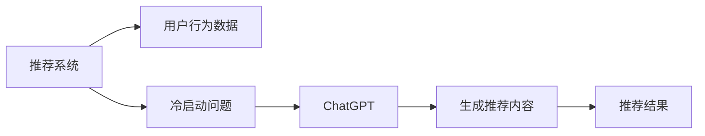

                 

# ChatGPT在推荐系统冷启动场景中的优势

在推荐系统领域，冷启动问题是一个常见的挑战，尤其是在用户数据较少或没有历史行为数据的情况下。传统的推荐系统通常依赖于用户-物品交互记录来训练模型，而冷启动用户往往缺乏这类数据，导致推荐质量低下。为了解决这一问题，研究者们提出了各种冷启动策略，如基于内容的推荐、基于兴趣标签的推荐、基于关联规则的推荐等。然而，这些方法都存在一定的局限性。随着大语言模型和生成对抗网络（GAN）技术的成熟，ChatGPT在冷启动场景中的应用开始崭露头角，展现了其独特的优势。本文将从核心概念、算法原理、操作步骤、应用场景等方面，系统性地探讨ChatGPT在推荐系统冷启动中的潜力，以及其实现原理和注意事项。

## 1. 背景介绍

推荐系统的主要目标是为用户推荐他们可能感兴趣的物品，如商品、内容、服务等。在实际应用中，用户行为数据是推荐算法的核心，通过对用户的历史交互记录进行建模，推荐系统可以预测用户未来的兴趣，从而为其提供个性化推荐。然而，对于新用户（冷启动用户），通常缺乏足够的历史行为数据，导致推荐效果大打折扣。传统推荐系统难以有效处理这种情况。

相比之下，ChatGPT具有独特的优势。ChatGPT基于Transformer结构，采用自回归生成模型，能够生成高质量的自然语言文本，并具备强大的上下文理解能力。本文将介绍ChatGPT在推荐系统冷启动场景中的应用，探讨其如何通过上下文理解能力和生成能力，辅助推荐系统为用户提供高质量推荐。

## 2. 核心概念与联系

### 2.1 核心概念概述

1. **推荐系统**：一种信息过滤系统，通过分析用户行为数据，为用户推荐物品。推荐系统包括基于内容的推荐、协同过滤推荐、混合推荐等多种方法。

2. **冷启动问题**：推荐系统在用户数据较少或没有历史行为数据的情况下，难以准确预测用户兴趣，导致推荐效果不佳。

3. **生成对抗网络（GAN）**：一种生成模型，通过两个神经网络（生成器和判别器）的对抗训练，生成高质量的假数据，用于各种领域，如图像生成、文本生成等。

4. **ChatGPT**：基于大语言模型的文本生成模型，具有强大的自然语言理解和生成能力。

这些概念之间存在紧密联系。ChatGPT通过其强大的自然语言理解和生成能力，在推荐系统的冷启动场景中起到了重要的辅助作用，为传统推荐系统提供了更丰富的用户兴趣信息。

### 2.2 核心概念原理和架构的 Mermaid 流程图(Mermaid 流程节点中不要有括号、逗号等特殊字符)



此流程图展示了ChatGPT在推荐系统冷启动中的应用过程：

1. **用户行为数据**：传统推荐系统依赖于用户的历史行为数据，如浏览记录、点击行为等。
2. **冷启动问题**：对于新用户，推荐系统缺乏足够的行为数据，导致推荐效果较差。
3. **ChatGPT**：通过与新用户进行交互，收集更多的用户兴趣信息，帮助推荐系统更好地理解用户需求。
4. **生成推荐内容**：ChatGPT生成与用户兴趣相关的物品推荐内容，辅助推荐系统进行推荐。
5. **推荐结果**：结合用户行为数据和ChatGPT生成的推荐内容，推荐系统为用户生成高质量的推荐结果。

## 3. 核心算法原理 & 具体操作步骤

### 3.1 算法原理概述

ChatGPT在推荐系统冷启动中的核心原理是通过与用户进行自然语言交互，收集更多的用户兴趣信息。具体而言，ChatGPT通过与用户对话，了解其兴趣偏好、价值观念等，生成与用户兴趣相关的物品推荐内容。这些内容可以包括商品描述、推荐理由、评价等，有助于推荐系统更好地理解用户需求，提高推荐效果。

### 3.2 算法步骤详解

1. **初始化用户模型**：收集用户的基本信息，如年龄、性别、职业等，作为ChatGPT的对话基础。

2. **用户对话交互**：ChatGPT与用户进行自然语言对话，了解其兴趣和需求。例如，用户可能会询问某个品牌的商品推荐，或表达对某种风格内容的偏好。

3. **生成推荐内容**：基于用户对话内容，ChatGPT生成与用户兴趣相关的推荐内容。这些内容可能包括商品描述、推荐理由、评价等，有助于推荐系统更好地理解用户需求。

4. **结合用户行为数据**：将ChatGPT生成的推荐内容与用户的历史行为数据结合，进行综合推荐。

### 3.3 算法优缺点

**优点**：
- **信息丰富**：ChatGPT能够通过自然语言交互，收集更多的用户兴趣信息，帮助推荐系统更好地理解用户需求。
- **灵活性高**：ChatGPT可以生成多样化的推荐内容，适应不同用户的兴趣和需求。
- **实时性**：ChatGPT能够实时生成推荐内容，提高推荐系统的实时性。

**缺点**：
- **成本高**：ChatGPT需要大量的用户对话数据，收集和处理这些数据成本较高。
- **数据质量问题**：ChatGPT生成的推荐内容依赖于用户对话质量，对话质量不佳会影响推荐效果。
- **复杂度高**：ChatGPT生成的推荐内容需要结合用户行为数据进行综合推荐，处理过程复杂。

### 3.4 算法应用领域

ChatGPT在推荐系统冷启动中的应用主要集中在以下几个领域：

1. **电商推荐**：帮助电商网站解决新用户的推荐问题，通过与用户对话，了解其兴趣和需求，生成商品推荐内容。
2. **内容推荐**：为视频、音乐、文章等内容平台提供推荐辅助，了解用户兴趣，生成个性化内容推荐。
3. **服务推荐**：为酒店、旅游、医疗等服务平台提供推荐支持，了解用户需求，生成个性化服务推荐。

## 4. 数学模型和公式 & 详细讲解 & 举例说明

### 4.1 数学模型构建

ChatGPT的推荐模型构建可以简化为以下步骤：

1. **用户模型表示**：将用户基本信息表示为向量形式，例如$\mathbf{u} \in \mathbb{R}^n$。
2. **生成器模型**：使用Transformer模型生成推荐内容，将用户模型和物品模型表示为向量形式，例如$\mathbf{u} \in \mathbb{R}^n$，$\mathbf{i} \in \mathbb{R}^m$。
3. **损失函数**：定义生成器模型的损失函数，例如交叉熵损失函数。

### 4.2 公式推导过程

假设用户模型和物品模型分别为$\mathbf{u}$和$\mathbf{i}$，生成器模型为$\mathbf{g}(\mathbf{u}, \mathbf{i})$。生成器模型的输出为推荐内容的向量表示$\mathbf{c} \in \mathbb{R}^l$，其中$l$为推荐内容的维度。假设推荐内容的真实标签为$\mathbf{y} \in \{0, 1\}$，表示用户是否对推荐内容感兴趣。则生成器模型的损失函数可以表示为：

$$
L(\mathbf{u}, \mathbf{i}) = -\log \sigma(\mathbf{g}(\mathbf{u}, \mathbf{i})^\top \mathbf{y})
$$

其中，$\sigma$为sigmoid函数，$\mathbf{g}(\mathbf{u}, \mathbf{i})^\top$为生成器输出的向量与标签的匹配度。

### 4.3 案例分析与讲解

以电商推荐为例，假设用户询问“推荐一款适合夏天的连衣裙”，ChatGPT生成的推荐内容可能包括“这款连衣裙样式新颖，适合夏季穿着”、“该品牌连衣裙质量可靠，价格合理”等。这些内容可以用于补充用户的历史行为数据，提高推荐系统对用户兴趣的预测准确性。

## 5. 项目实践：代码实例和详细解释说明

### 5.1 开发环境搭建

1. **环境准备**：
   - 安装Python和相关库，如TensorFlow、PyTorch等。
   - 准备预训练的ChatGPT模型和相关数据集。

2. **模型加载**：
   - 使用HuggingFace库加载预训练的ChatGPT模型，例如：
   ```python
   from transformers import TFAutoModelForCausalLM

   model = TFAutoModelForCausalLM.from_pretrained('microsoft/chatgpt-base')
   ```

### 5.2 源代码详细实现

```python
import tensorflow as tf
from transformers import TFAutoModelForCausalLM, AutoTokenizer
import numpy as np

# 加载预训练模型和tokenizer
model = TFAutoModelForCausalLM.from_pretrained('microsoft/chatgpt-base')
tokenizer = AutoTokenizer.from_pretrained('microsoft/chatgpt-base')

# 构建用户输入和提示
user_input = '推荐一款适合夏天的连衣裙'
prompt = f'请为以下用户推荐一款适合夏天的连衣裙：{user_input}\n你可以提供一些建议或推荐理由。'

# 生成推荐内容
tokens = tokenizer(prompt, return_tensors='tf')
input_ids = tokens['input_ids']
attention_mask = tokens['attention_mask']

outputs = model.generate(input_ids=input_ids, attention_mask=attention_mask, max_length=128)
decoded_output = tokenizer.decode(outputs[0], skip_special_tokens=True)

# 提取推荐内容
recommendation = decoded_output.split('\n')[2:]

# 输出推荐内容
print('推荐内容：')
for content in recommendation:
    print(content)
```

### 5.3 代码解读与分析

1. **模型加载**：使用HuggingFace库加载预训练的ChatGPT模型。
2. **用户输入和提示**：构建用户输入和提示信息，使用tokenizer进行分词编码。
3. **生成推荐内容**：将用户输入和提示信息输入到模型中，生成推荐内容。
4. **输出推荐内容**：对生成的推荐内容进行解码，提取推荐内容并输出。

## 6. 实际应用场景

### 6.1 电商推荐

在电商推荐中，ChatGPT可以用于解决新用户的推荐问题。通过与用户对话，收集更多的用户兴趣信息，生成与用户兴趣相关的推荐内容。例如，用户询问“推荐一款适合夏季的连衣裙”，ChatGPT可以生成与用户兴趣相关的推荐内容，如“这款连衣裙样式新颖，适合夏季穿着”、“该品牌连衣裙质量可靠，价格合理”等，辅助推荐系统提供个性化推荐。

### 6.2 内容推荐

在内容推荐中，ChatGPT可以用于生成与用户兴趣相关的推荐内容。例如，用户询问“推荐几部适合夏季观看的电影”，ChatGPT可以生成与用户兴趣相关的推荐内容，如“这部电影情节紧凑，适合夏季观看”、“该电影评分高，评价好”等，辅助推荐系统提供个性化内容推荐。

### 6.3 服务推荐

在服务推荐中，ChatGPT可以用于生成与用户兴趣相关的推荐内容。例如，用户询问“推荐一家夏季旅游目的地”，ChatGPT可以生成与用户兴趣相关的推荐内容，如“该旅游目的地风景优美，夏季气候宜人”、“该旅游目的地评价高，用户满意度高”等，辅助推荐系统提供个性化服务推荐。

## 7. 工具和资源推荐

### 7.1 学习资源推荐

1. **《Transformer from Scratch》**：介绍Transformer模型的原理和实现，适合深入理解ChatGPT的核心技术。
2. **HuggingFace官方文档**：包含大量预训练模型和微调样例，是学习ChatGPT的必备资源。
3. **OpenAI论文集**：包含ChatGPT的最新研究论文，了解最新进展和应用场景。

### 7.2 开发工具推荐

1. **TensorFlow**：深度学习框架，支持ChatGPT的模型训练和推理。
2. **PyTorch**：深度学习框架，支持ChatGPT的模型训练和推理。
3. **Jupyter Notebook**：交互式编程环境，适合进行ChatGPT的开发和调试。

### 7.3 相关论文推荐

1. **"Language Models are Unsupervised Multitask Learners"**：介绍预训练语言模型的原理和应用，为ChatGPT的实现提供理论基础。
2. **"Imagenet Classification with Deep Convolutional Neural Networks"**：介绍深度卷积神经网络在图像分类中的应用，与ChatGPT的图像生成技术有相似之处。

## 8. 总结：未来发展趋势与挑战

### 8.1 研究成果总结

ChatGPT在推荐系统冷启动中的应用展示了其强大的上下文理解和生成能力。通过与用户对话，收集更多的用户兴趣信息，生成与用户兴趣相关的推荐内容，辅助推荐系统提供高质量推荐。然而，ChatGPT的应用也面临一些挑战，如数据收集和处理成本高、数据质量问题等。

### 8.2 未来发展趋势

1. **多模态推荐**：结合视觉、音频等多模态数据，提升推荐系统的表现。
2. **生成式推荐**：通过生成推荐内容，丰富推荐形式和多样化。
3. **个性化推荐**：根据用户行为和兴趣生成个性化推荐，提高推荐系统的精准度。

### 8.3 面临的挑战

1. **数据隐私问题**：用户对话数据可能涉及隐私，需要采取数据保护措施。
2. **数据质量问题**：用户对话质量直接影响ChatGPT的推荐效果。
3. **成本问题**：ChatGPT的应用需要大量用户对话数据，成本较高。

### 8.4 研究展望

未来，ChatGPT在推荐系统中的应用将更加广泛，其在冷启动场景中的潜力将进一步挖掘。同时，ChatGPT将与其他推荐技术结合，形成更加智能化的推荐系统。

## 9. 附录：常见问题与解答

**Q1: ChatGPT在冷启动场景中的优势是什么？**

A: ChatGPT在冷启动场景中的优势在于其强大的上下文理解和生成能力。通过与用户对话，收集更多的用户兴趣信息，生成与用户兴趣相关的推荐内容，辅助推荐系统提供高质量推荐。

**Q2: 如何提高ChatGPT生成的推荐内容的质量？**

A: 提高ChatGPT生成的推荐内容的质量可以从以下几个方面入手：
1. **用户输入**：构建清晰、具体的用户输入，确保ChatGPT生成的推荐内容与用户需求相关。
2. **模型优化**：使用更先进的生成模型和优化算法，提高ChatGPT的生成效果。
3. **数据质量**：提高用户对话数据的质量，减少噪音和不相关内容的影响。

**Q3: ChatGPT在推荐系统中的应用有哪些局限性？**

A: ChatGPT在推荐系统中的应用也存在一些局限性：
1. **数据隐私问题**：用户对话数据可能涉及隐私，需要采取数据保护措施。
2. **数据质量问题**：用户对话质量直接影响ChatGPT的推荐效果。
3. **成本问题**：ChatGPT的应用需要大量用户对话数据，成本较高。

**Q4: ChatGPT在推荐系统中的推荐效果如何评估？**

A: ChatGPT在推荐系统中的推荐效果可以通过以下指标进行评估：
1. **准确率**：评估推荐内容与用户兴趣的匹配度。
2. **相关性**：评估推荐内容的相关性，即与用户输入的匹配度。
3. **用户满意度**：通过用户反馈评估推荐系统的满意度和推荐效果。

**Q5: 未来ChatGPT在推荐系统中的应用有哪些方向？**

A: 未来ChatGPT在推荐系统中的应用方向可能包括：
1. **多模态推荐**：结合视觉、音频等多模态数据，提升推荐系统的表现。
2. **生成式推荐**：通过生成推荐内容，丰富推荐形式和多样化。
3. **个性化推荐**：根据用户行为和兴趣生成个性化推荐，提高推荐系统的精准度。

---

作者：禅与计算机程序设计艺术 / Zen and the Art of Computer Programming

