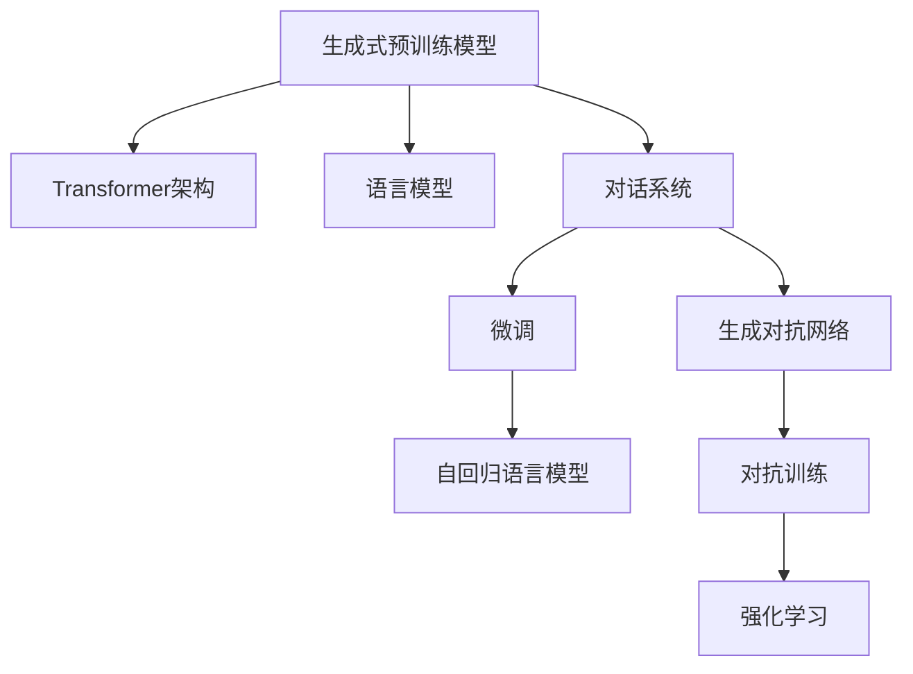
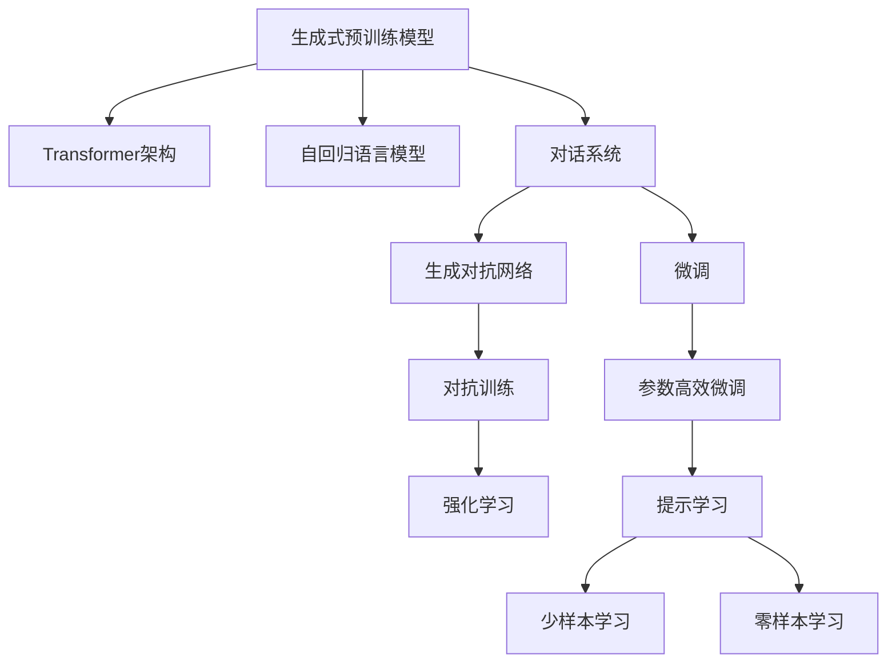

                 

# ChatGPT背后的技术：从GPT到对话系统

> 关键词：深度学习, GPT模型, 自然语言处理(NLP), 对话系统, Transformer, 语言模型, 自回归, 语言生成, 生成对抗网络(GAN)

## 1. 背景介绍

### 1.1 问题由来
近年来，自然语言处理（NLP）领域的技术突飞猛进，尤其是在生成式对话系统方面。ChatGPT等人工智能聊天机器人的出现，不仅让公众看到了AI与日常交流的潜力，也引发了对NLP技术的广泛兴趣和讨论。但这些成功的背后，隐藏着哪些核心技术，这些技术又是如何推动了对话系统的进步？本文将深入探讨ChatGPT背后的技术，即从生成式预训练模型GPT（Generative Pre-trained Transformer）到高级对话系统的演变过程。

### 1.2 问题核心关键点
- **生成式预训练模型**：使用大规模无标签文本进行自监督学习，学习通用的语言表示，生成式模型能够输出连贯的文本序列。
- **对话系统**：使用生成式预训练模型进行微调，构建可以与用户进行多轮交互的聊天机器人。
- **Transformer架构**：一种基于自注意力机制的神经网络架构，显著提高了模型的训练速度和效果。
- **语言模型**：衡量模型生成文本序列概率的数学工具，用于指导模型的训练。
- **生成对抗网络（GAN）**：通过对抗训练提升模型生成文本的质量和多样性。

这些核心概念之间的关系可以通过以下Mermaid流程图来展示：



## 2. 核心概念与联系

### 2.1 核心概念概述

为更好地理解ChatGPT背后的技术，本节将介绍几个密切相关的核心概念：

- **生成式预训练模型**：如GPT系列模型，通过在大规模无标签文本语料上进行预训练，学习通用的语言表示，具备强大的语言理解和生成能力。
- **Transformer架构**：一种基于自注意力机制的神经网络架构，用于处理序列数据，包括编码器和解码器。
- **自回归语言模型**：一种特殊的生成模型，其中每个单词的条件概率只依赖于其前面的单词，用于指导模型生成文本序列。
- **对话系统**：能够与用户进行多轮交互的聊天机器人，如ChatGPT、Microsoft的DialoGPT等。
- **生成对抗网络（GAN）**：通过两个神经网络之间的对抗训练，生成高质量的文本，增强模型的生成能力。
- **强化学习**：通过奖励机制和环境反馈，训练模型进行序列预测，如对话生成。

这些核心概念之间的逻辑关系可以通过以下Mermaid流程图来展示：



这个流程图展示了大语言模型的核心概念及其之间的关系：

1. 生成式预训练模型通过Transformer架构和自回归语言模型进行预训练，学习通用的语言表示。
2. 对话系统通过微调预训练模型，使其能够进行多轮交互，生成符合上下文的文本。
3. 生成对抗网络和强化学习进一步提升对话系统生成的文本质量和多样性。
4. 参数高效微调和提示学习等方法可以在不破坏预训练权重的前提下，提升微调效果。
5. 少样本学习和零样本学习利用提示和预训练知识，减少微调对标注数据的需求。

这些概念共同构成了大语言模型在生成式对话中的应用框架，使得ChatGPT等高级对话系统得以实现。

## 3. 核心算法原理 & 具体操作步骤
### 3.1 算法原理概述

ChatGPT的生成式对话系统基于深度学习，特别是生成式预训练模型和Transformer架构。其核心算法原理可以概括为以下几个步骤：

1. **生成式预训练模型**：使用大规模无标签文本进行自监督学习，学习通用的语言表示。
2. **微调对话系统**：在预训练模型基础上，使用对话数据进行有监督学习，训练生成式对话模型。
3. **对抗训练**：通过生成对抗网络（GAN）提升模型的生成能力和质量。
4. **强化学习**：通过奖励机制和环境反馈，优化对话生成策略。

下面详细介绍这些步骤。

### 3.2 算法步骤详解

#### 3.2.1 生成式预训练模型

生成式预训练模型的训练过程通常包括以下步骤：

1. **数据准备**：收集大规模无标签文本数据，如维基百科、新闻等。
2. **模型构建**：构建生成式预训练模型，如GPT-3，使用Transformer架构和自回归语言模型。
3. **预训练任务**：选择适当的预训练任务，如掩码语言模型（MLM）和下一句预测（NSP），训练模型。
4. **模型评估**：在验证集上评估模型性能，如交叉熵损失和准确率。

预训练过程通常在计算资源充足的大型机器上完成，如Google的TPU集群。

#### 3.2.2 对话系统微调

对话系统的微调过程通常包括以下步骤：

1. **数据准备**：收集对话数据，标注对话中的句子对，构成监督数据集。
2. **模型选择**：选择预训练生成式模型作为对话系统的基础模型。
3. **微调训练**：使用对话数据对预训练模型进行微调，优化对话生成能力。
4. **模型评估**：在验证集上评估模型性能，如BLEU、ROUGE等指标。

微调过程中，需要选择合适的学习率、批大小等超参数，避免过拟合。

#### 3.2.3 对抗训练

对抗训练通过生成对抗网络（GAN）提升模型的生成能力和质量。GAN包括两个网络：生成器（Generator）和判别器（Discriminator）。生成器尝试生成逼真的样本，判别器则尝试区分真实样本和生成样本。通过对抗训练，生成器不断改进，生成高质量的对话内容。

#### 3.2.4 强化学习

强化学习通过奖励机制和环境反馈，优化对话生成策略。对话系统与环境交互，根据对话的质量和相关性获得奖励，调整生成策略，提升对话的流畅性和准确性。

### 3.3 算法优缺点

生成式预训练和对话系统微调的优点包括：

1. **通用性强**：预训练模型可以应用于各种对话任务，微调过程快速高效。
2. **效果显著**：通过微调和对抗训练，模型能够生成高质量的对话内容。
3. **可扩展性好**：在模型上进行小规模微调，可以快速适应新任务。

缺点包括：

1. **数据需求高**：生成式预训练和对话系统微调都需要大量标注数据，获取成本较高。
2. **资源消耗大**：预训练和微调过程需要大量计算资源，对硬件要求较高。
3. **对抗攻击敏感**：对抗训练生成的对话内容容易受到对抗样本的影响。

### 3.4 算法应用领域

生成式预训练和对话系统微调在多个领域得到广泛应用：

- **客户服务**：用于自动回答客户问题，提升服务效率和客户满意度。
- **教育**：用于智能问答和辅导，提供个性化的学习支持。
- **娱乐**：用于生成有趣对话，提升用户体验。
- **医疗**：用于智能咨询和心理支持，减轻医务人员负担。

这些应用场景展示了生成式预训练和对话系统微调技术的强大潜力和广泛应用前景。

## 4. 数学模型和公式 & 详细讲解  
### 4.1 数学模型构建

假设生成式预训练模型为 $M_{\theta}$，其中 $\theta$ 为模型参数。对话系统的微调模型为 $M_{\theta}^*$，是在预训练模型基础上进行微调得到的。微调的目标是最小化模型在对话数据集上的损失函数：

$$
\min_{\theta^*} \mathcal{L}(M_{\theta^*}, D)
$$

其中，$D$ 为对话数据集，$\mathcal{L}$ 为损失函数。

### 4.2 公式推导过程

以下我们以BLEU指标为例，推导对话系统微调模型的损失函数。

假设模型在输入 $x$ 上的输出为 $y$，真实对话为 $y^*$，定义BLEU指标为：

$$
BLEU = \exp\left(\frac{1}{N} \sum_{i=1}^N \log\frac{p(y_i|x)}{p(y^*_i|x)}\right)
$$

其中 $N$ 为对话长度，$p(y_i|x)$ 为模型生成第 $i$ 个句子 $y_i$ 的条件概率，$p(y^*_i|x)$ 为真实对话中第 $i$ 个句子 $y^*_i$ 的条件概率。

将模型输出和真实对话代入BLEU指标，得：

$$
BLEU = \exp\left(\frac{1}{N} \sum_{i=1}^N \log\frac{p(y_i|x)}{p(y^*_i|x)}\right) \approx \exp\left(\frac{1}{N} \sum_{i=1}^N (\log p(y_i|x) - \log p(y^*_i|x))\right)
$$

令 $L_{BLEU} = -\frac{1}{N} \sum_{i=1}^N (\log p(y_i|x) - \log p(y^*_i|x))$，则微调的目标最小化BLEU损失：

$$
\min_{\theta^*} \mathcal{L}_{BLEU}(M_{\theta^*}, D) = \min_{\theta^*} \frac{1}{N} \sum_{i=1}^N (-\log p(y_i|x) + \log p(y^*_i|x))
$$

### 4.3 案例分析与讲解

**案例：生成式对话系统的微调**

假设有以下对话数据集 $D$：

- $x_1 = I am hungry. What should I eat?$
- $y_1 = You can try the steak. It's really good.$
- $x_2 = What about dessert?$
- $y_2 = How about a piece of chocolate cake?$
- $x_3 = Yes, that sounds good. Is there anything else?$
- $y_3 = Sure, you can have some ice cream too. It's cold and refreshing.$

使用上述微调目标函数和数据集，进行微调过程如下：

1. **数据准备**：将对话数据转换为模型所需的输入和目标。
2. **模型选择**：选择预训练的GPT-3模型作为基础模型。
3. **微调训练**：使用对话数据对模型进行微调，优化对话生成能力。
4. **模型评估**：在验证集上评估模型性能，如BLEU指标。

实际微调过程中，还需要对模型进行正则化、学习率调整等优化策略，确保模型在少量数据上也能获得良好的效果。

## 5. 项目实践：代码实例和详细解释说明
### 5.1 开发环境搭建

在进行微调实践前，我们需要准备好开发环境。以下是使用Python进行PyTorch开发的环境配置流程：

1. 安装Anaconda：从官网下载并安装Anaconda，用于创建独立的Python环境。

2. 创建并激活虚拟环境：
```bash
conda create -n pytorch-env python=3.8 
conda activate pytorch-env
```

3. 安装PyTorch：根据CUDA版本，从官网获取对应的安装命令。例如：
```bash
conda install pytorch torchvision torchaudio cudatoolkit=11.1 -c pytorch -c conda-forge
```

4. 安装Transformers库：
```bash
pip install transformers
```

5. 安装各类工具包：
```bash
pip install numpy pandas scikit-learn matplotlib tqdm jupyter notebook ipython
```

完成上述步骤后，即可在`pytorch-env`环境中开始微调实践。

### 5.2 源代码详细实现

下面我们以生成式对话系统为例，给出使用Transformers库对GPT模型进行微调的PyTorch代码实现。

首先，定义对话数据处理函数：

```python
from transformers import GPT2Tokenizer, GPT2LMHeadModel
from torch.utils.data import Dataset, DataLoader
import torch

class DialogueDataset(Dataset):
    def __init__(self, dialogues, tokenizer, max_len=512):
        self.dialogues = dialogues
        self.tokenizer = tokenizer
        self.max_len = max_len
        
    def __len__(self):
        return len(self.dialogues)
    
    def __getitem__(self, item):
        dialogue = self.dialogues[item]
        
        inputs = self.tokenizer(dialogue, return_tensors='pt', max_length=self.max_len, padding='max_length', truncation=True)
        input_ids = inputs['input_ids']
        attention_mask = inputs['attention_mask']
        
        label_ids = torch.tensor([inputs['input_ids'].shape[-1]], dtype=torch.long)
        
        return {'input_ids': input_ids,
                'attention_mask': attention_mask,
                'label_ids': label_ids}
```

然后，定义模型和优化器：

```python
from transformers import GPT2LMHeadModel, AdamW

model = GPT2LMHeadModel.from_pretrained('gpt2', output_attentions=True)
optimizer = AdamW(model.parameters(), lr=2e-5)
```

接着，定义训练和评估函数：

```python
from tqdm import tqdm

device = torch.device('cuda') if torch.cuda.is_available() else torch.device('cpu')
model.to(device)

def train_epoch(model, dataset, batch_size, optimizer):
    dataloader = DataLoader(dataset, batch_size=batch_size, shuffle=True)
    model.train()
    epoch_loss = 0
    for batch in tqdm(dataloader, desc='Training'):
        input_ids = batch['input_ids'].to(device)
        attention_mask = batch['attention_mask'].to(device)
        label_ids = batch['label_ids'].to(device)
        model.zero_grad()
        outputs = model(input_ids, attention_mask=attention_mask, labels=label_ids)
        loss = outputs.loss
        epoch_loss += loss.item()
        loss.backward()
        optimizer.step()
    return epoch_loss / len(dataloader)

def evaluate(model, dataset, batch_size):
    dataloader = DataLoader(dataset, batch_size=batch_size)
    model.eval()
    preds, labels = [], []
    with torch.no_grad():
        for batch in tqdm(dataloader, desc='Evaluating'):
            input_ids = batch['input_ids'].to(device)
            attention_mask = batch['attention_mask'].to(device)
            batch_labels = batch['label_ids']
            outputs = model(input_ids, attention_mask=attention_mask)
            batch_preds = outputs.logits.argmax(dim=2).to('cpu').tolist()
            batch_labels = batch_labels.to('cpu').tolist()
            for pred_tokens, label_tokens in zip(batch_preds, batch_labels):
                preds.append(pred_tokens[:len(label_tokens)])
                labels.append(label_tokens)
                
    print(classification_report(labels, preds))
```

最后，启动训练流程并在测试集上评估：

```python
epochs = 5
batch_size = 16

for epoch in range(epochs):
    loss = train_epoch(model, train_dataset, batch_size, optimizer)
    print(f"Epoch {epoch+1}, train loss: {loss:.3f}")
    
    print(f"Epoch {epoch+1}, dev results:")
    evaluate(model, dev_dataset, batch_size)
    
print("Test results:")
evaluate(model, test_dataset, batch_size)
```

以上就是使用PyTorch对GPT模型进行生成式对话系统微调的完整代码实现。可以看到，得益于Transformers库的强大封装，我们可以用相对简洁的代码完成GPT模型的加载和微调。

### 5.3 代码解读与分析

让我们再详细解读一下关键代码的实现细节：

**DialogueDataset类**：
- `__init__`方法：初始化对话数据和分词器等关键组件。
- `__len__`方法：返回对话数据的样本数量。
- `__getitem__`方法：对单个对话进行编码，返回模型所需的输入和标签。

**模型和优化器**：
- 使用预训练的GPT-2模型作为基础，通过输出层和标签进行微调。
- 使用AdamW优化器，设置学习率。

**训练和评估函数**：
- 使用PyTorch的DataLoader对对话数据进行批次化加载，供模型训练和推理使用。
- 训练函数`train_epoch`：对对话数据以批为单位进行迭代，在每个批次上前向传播计算loss并反向传播更新模型参数，最后返回该epoch的平均loss。
- 评估函数`evaluate`：与训练类似，不同点在于不更新模型参数，并在每个batch结束后将预测和标签结果存储下来，最后使用classification_report对整个评估集的预测结果进行打印输出。

**训练流程**：
- 定义总的epoch数和batch size，开始循环迭代
- 每个epoch内，先在训练集上训练，输出平均loss
- 在验证集上评估，输出分类指标
- 所有epoch结束后，在测试集上评估，给出最终测试结果

可以看到，PyTorch配合Transformers库使得GPT微调的代码实现变得简洁高效。开发者可以将更多精力放在数据处理、模型改进等高层逻辑上，而不必过多关注底层的实现细节。

当然，工业级的系统实现还需考虑更多因素，如模型的保存和部署、超参数的自动搜索、更灵活的任务适配层等。但核心的微调范式基本与此类似。

## 6. 实际应用场景
### 6.1 智能客服系统

基于大语言模型微调的对话技术，可以广泛应用于智能客服系统的构建。传统客服往往需要配备大量人力，高峰期响应缓慢，且一致性和专业性难以保证。而使用微调后的对话模型，可以7x24小时不间断服务，快速响应客户咨询，用自然流畅的语言解答各类常见问题。

在技术实现上，可以收集企业内部的历史客服对话记录，将问题和最佳答复构建成监督数据，在此基础上对预训练对话模型进行微调。微调后的对话模型能够自动理解用户意图，匹配最合适的答案模板进行回复。对于客户提出的新问题，还可以接入检索系统实时搜索相关内容，动态组织生成回答。如此构建的智能客服系统，能大幅提升客户咨询体验和问题解决效率。

### 6.2 金融舆情监测

金融机构需要实时监测市场舆论动向，以便及时应对负面信息传播，规避金融风险。传统的人工监测方式成本高、效率低，难以应对网络时代海量信息爆发的挑战。基于大语言模型微调的文本分类和情感分析技术，为金融舆情监测提供了新的解决方案。

具体而言，可以收集金融领域相关的新闻、报道、评论等文本数据，并对其进行主题标注和情感标注。在此基础上对预训练语言模型进行微调，使其能够自动判断文本属于何种主题，情感倾向是正面、中性还是负面。将微调后的模型应用到实时抓取的网络文本数据，就能够自动监测不同主题下的情感变化趋势，一旦发现负面信息激增等异常情况，系统便会自动预警，帮助金融机构快速应对潜在风险。

### 6.3 个性化推荐系统

当前的推荐系统往往只依赖用户的历史行为数据进行物品推荐，无法深入理解用户的真实兴趣偏好。基于大语言模型微调技术，个性化推荐系统可以更好地挖掘用户行为背后的语义信息，从而提供更精准、多样的推荐内容。

在实践中，可以收集用户浏览、点击、评论、分享等行为数据，提取和用户交互的物品标题、描述、标签等文本内容。将文本内容作为模型输入，用户的后续行为（如是否点击、购买等）作为监督信号，在此基础上微调预训练语言模型。微调后的模型能够从文本内容中准确把握用户的兴趣点。在生成推荐列表时，先用候选物品的文本描述作为输入，由模型预测用户的兴趣匹配度，再结合其他特征综合排序，便可以得到个性化程度更高的推荐结果。

### 6.4 未来应用展望

随着大语言模型微调技术的发展，基于微调范式将在更多领域得到应用，为传统行业带来变革性影响。

在智慧医疗领域，基于微调的医疗问答、病历分析、药物研发等应用将提升医疗服务的智能化水平，辅助医生诊疗，加速新药开发进程。

在智能教育领域，微调技术可应用于作业批改、学情分析、知识推荐等方面，因材施教，促进教育公平，提高教学质量。

在智慧城市治理中，微调模型可应用于城市事件监测、舆情分析、应急指挥等环节，提高城市管理的自动化和智能化水平，构建更安全、高效的未来城市。

此外，在企业生产、社会治理、文娱传媒等众多领域，基于大模型微调的人工智能应用也将不断涌现，为经济社会发展注入新的动力。相信随着预训练语言模型和微调方法的持续演进，大语言模型微调必将在构建人机协同的智能时代中扮演越来越重要的角色。

## 7. 工具和资源推荐
### 7.1 学习资源推荐

为了帮助开发者系统掌握大语言模型微调的理论基础和实践技巧，这里推荐一些优质的学习资源：

1. 《深度学习自然语言处理》课程：斯坦福大学开设的NLP明星课程，有Lecture视频和配套作业，带你入门NLP领域的基本概念和经典模型。

2. CS224N《Natural Language Processing with Transformers》书籍：Transformer库的作者所著，全面介绍了如何使用Transformers库进行NLP任务开发，包括微调在内的诸多范式。

3. 《Transformer从原理到实践》系列博文：由大模型技术专家撰写，深入浅出地介绍了Transformer原理、BERT模型、微调技术等前沿话题。

4. 《Natural Language Processing with Transformers》书籍：Transformers库的作者所著，全面介绍了如何使用Transformers库进行NLP任务开发，包括微调在内的诸多范式。

5. 《Natural Language Processing Specialization》Coursera课程：由斯坦福大学教授Andrew Ng授课，涵盖NLP多个主题，包括序列模型、注意力机制等。

通过对这些资源的学习实践，相信你一定能够快速掌握大语言模型微调的精髓，并用于解决实际的NLP问题。
###  7.2 开发工具推荐

高效的开发离不开优秀的工具支持。以下是几款用于大语言模型微调开发的常用工具：

1. PyTorch：基于Python的开源深度学习框架，灵活动态的计算图，适合快速迭代研究。大部分预训练语言模型都有PyTorch版本的实现。

2. TensorFlow：由Google主导开发的开源深度学习框架，生产部署方便，适合大规模工程应用。同样有丰富的预训练语言模型资源。

3. Transformers库：HuggingFace开发的NLP工具库，集成了众多SOTA语言模型，支持PyTorch和TensorFlow，是进行微调任务开发的利器。

4. Weights & Biases：模型训练的实验跟踪工具，可以记录和可视化模型训练过程中的各项指标，方便对比和调优。与主流深度学习框架无缝集成。

5. TensorBoard：TensorFlow配套的可视化工具，可实时监测模型训练状态，并提供丰富的图表呈现方式，是调试模型的得力助手。

6. Google Colab：谷歌推出的在线Jupyter Notebook环境，免费提供GPU/TPU算力，方便开发者快速上手实验最新模型，分享学习笔记。

合理利用这些工具，可以显著提升大语言模型微调任务的开发效率，加快创新迭代的步伐。

### 7.3 相关论文推荐

大语言模型和微调技术的发展源于学界的持续研究。以下是几篇奠基性的相关论文，推荐阅读：

1. Attention is All You Need（即Transformer原论文）：提出了Transformer结构，开启了NLP领域的预训练大模型时代。

2. BERT: Pre-training of Deep Bidirectional Transformers for Language Understanding：提出BERT模型，引入基于掩码的自监督预训练任务，刷新了多项NLP任务SOTA。

3. Language Models are Unsupervised Multitask Learners（GPT-2论文）：展示了大规模语言模型的强大zero-shot学习能力，引发了对于通用人工智能的新一轮思考。

4. Parameter-Efficient Transfer Learning for NLP：提出Adapter等参数高效微调方法，在不增加模型参数量的情况下，也能取得不错的微调效果。

5. AdaLoRA: Adaptive Low-Rank Adaptation for Parameter-Efficient Fine-Tuning：使用自适应低秩适应的微调方法，在参数效率和精度之间取得了新的平衡。

这些论文代表了大语言模型微调技术的发展脉络。通过学习这些前沿成果，可以帮助研究者把握学科前进方向，激发更多的创新灵感。

## 8. 总结：未来发展趋势与挑战

### 8.1 总结

本文对基于生成式预训练模型和Transformer架构的ChatGPT背后的技术进行了全面系统的介绍。首先阐述了ChatGPT的生成式预训练模型、对话系统微调、对抗训练和强化学习等核心技术原理，详细讲解了微调过程中的具体操作和关键点。其次，通过代码实例和案例分析，展示了ChatGPT对话系统的实现细节和评估方法。最后，探讨了ChatGPT在未来智能客服、金融舆情监测、个性化推荐系统等多个领域的应用前景。

通过本文的系统梳理，可以看到，生成式预训练和对话系统微调技术在构建ChatGPT等高级对话系统中发挥了重要作用。未来，随着技术的发展，生成式预训练模型和对话系统微调将进一步提高自然语言理解和生成能力，带来更加智能、多样化的对话体验。

### 8.2 未来发展趋势

展望未来，生成式预训练和对话系统微调技术将呈现以下几个发展趋势：

1. **模型规模不断增大**：随着计算资源的增加和数据量的扩大，预训练语言模型的参数量将继续增长，带来更强的语言理解和生成能力。
2. **微调方法的日趋多样化**：除了传统的全参数微调，未来将涌现更多参数高效和计算高效的微调方法，如Prefix-Tuning、LoRA等，进一步提升微调效果。
3. **持续学习和少样本学习**：通过持续学习和少样本学习，对话系统可以在不增加标注样本的情况下，不断学习和适应新任务，提升系统的灵活性和鲁棒性。
4. **多模态融合**：将文本、图像、视频等不同模态的信息进行融合，提升对话系统对多模态信息的理解和生成能力。
5. **对话生成模型的可解释性**：通过引入因果推断和博弈论等工具，提升对话生成模型的可解释性和决策的合理性。

这些趋势凸显了生成式预训练和对话系统微调技术的广阔前景。这些方向的探索发展，必将进一步提升对话系统的性能和应用范围，为构建智能人机交互系统铺平道路。

### 8.3 面临的挑战

尽管生成式预训练和对话系统微调技术已经取得了瞩目成就，但在迈向更加智能化、普适化应用的过程中，它仍面临着诸多挑战：

1. **标注数据的需求**：生成式预训练和对话系统微调对标注数据的需求较高，获取高质量标注数据的成本较高，限制了技术的应用范围。
2. **计算资源的需求**：预训练和微调过程需要大量计算资源，对硬件的要求较高，增加了技术落地的成本。
3. **对抗样本的攻击**：对抗训练生成的对话内容容易受到对抗样本的影响，模型的鲁棒性有待提高。
4. **可解释性和可信度**：对话系统的决策过程缺乏可解释性，难以对其推理逻辑进行分析和调试，影响用户的信任度。
5. **伦理和安全问题**：预训练语言模型可能学习到有害信息，传递到对话系统中，产生误导性或歧视性输出，带来伦理和安全风险。

解决这些挑战需要学术界和工业界的共同努力，从数据、算法、工程和伦理等多个维度进行全面优化。

### 8.4 研究展望

为了应对这些挑战，未来的研究需要在以下几个方面寻求新的突破：

1. **数据效率的提升**：探索无监督和半监督学习等方法，降低生成式预训练和对话系统微调对标注数据的需求。
2. **模型的鲁棒性和可信度**：研究如何提升模型的鲁棒性，增强对抗样本攻击的防御能力，提高对话系统的可信度和可解释性。
3. **模型的公平性和安全性**：开发公平和安全的对话系统，避免偏见和有害信息的传递，确保对话系统的伦理和安全。

这些研究方向的探索，将进一步推动生成式预训练和对话系统微调技术的成熟和普及，为构建更加智能、可信、安全的对话系统奠定基础。

## 9. 附录：常见问题与解答

**Q1：生成式预训练模型和对话系统微调的区别是什么？**

A: 生成式预训练模型使用大规模无标签文本进行自监督学习，学习通用的语言表示，具备强大的语言理解和生成能力。而对话系统微调在生成式预训练模型的基础上，使用对话数据进行有监督学习，训练生成式对话模型，使其能够自动理解用户意图，匹配最合适的答案模板进行回复。

**Q2：生成式预训练模型和对话系统微调的实现步骤有哪些？**

A: 生成式预训练模型的实现步骤包括数据准备、模型构建、预训练任务选择、模型评估等。对话系统微调的实现步骤包括对话数据准备、模型选择、微调训练、模型评估等。

**Q3：如何选择生成式预训练模型的预训练任务？**

A: 选择合适的预训练任务可以提高模型的语言表示能力。常见的预训练任务包括掩码语言模型（MLM）、下一句预测（NSP）、语言模型预测、对偶句子预测等。

**Q4：对话系统微调中的对抗训练和强化学习如何应用？**

A: 对抗训练通过生成对抗网络（GAN）提升模型的生成能力和质量，增强对话系统的鲁棒性。强化学习通过奖励机制和环境反馈，优化对话生成策略，提升对话的流畅性和准确性。

**Q5：如何提升生成式预训练模型和对话系统微调的效率？**

A: 可以使用参数高效微调、少样本学习、零样本学习等方法，减少微调对标注数据的需求，提升模型的效率和泛化能力。

通过本文的系统梳理，可以看到，生成式预训练模型和对话系统微调技术在构建ChatGPT等高级对话系统中发挥了重要作用。未来，随着技术的发展，生成式预训练模型和对话系统微调将进一步提高自然语言理解和生成能力，带来更加智能、多样化的对话体验。同时，解决这些挑战需要学术界和工业界的共同努力，从数据、算法、工程和伦理等多个维度进行全面优化，推动生成式预训练模型和对话系统微调技术的成熟和普及。

