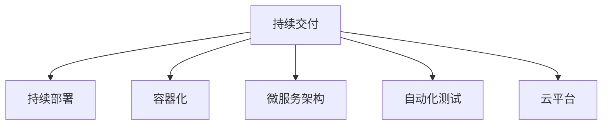

                 

# DevOps 实践指南更新：持续交付和部署的最新技术

> 关键词：DevOps, 持续交付(CI/CD), 容器化(Docker), 自动化部署, 微服务架构, 自动化测试, 云平台

## 1. 背景介绍

### 1.1 问题由来
DevOps（Development and Operations）是指将软件开发（Development）与信息技术运维（Operations）相结合的实践和理念，目标是缩短软件交付周期，提升开发效率，确保系统稳定性。近年来，DevOps在业界大放异彩，成为推动企业数字化转型的重要引擎。

随着数字化转型的不断深入，企业在业务复杂度、用户需求变化速度和IT系统的可靠性要求上都在不断提高，这对DevOps实践提出了更高的要求。如何更高效地实现持续交付和部署，提升DevOps的自动化水平，成为DevOps从业者关注的焦点。

### 1.2 问题核心关键点
DevOps的核心目标是通过持续交付和部署，快速响应用户需求，提升软件交付的效率和质量，确保系统的高可用性和稳定性。其中，持续交付（Continuous Delivery）和持续部署（Continuous Deployment）是DevOps实践的两大关键。持续交付强调在每个版本发布前都能自动化地进行构建、测试和部署，确保质量；持续部署则进一步强调自动化发布到生产环境，减少人为操作和错误。

在实践过程中，DevOps还涉及自动化测试、代码审查、配置管理、监控告警等多个环节。如何整合这些环节，实现DevOps的高效自动化，是DevOps成功实施的关键。

### 1.3 问题研究意义
深入研究DevOps的最新技术，对提升软件开发效率、优化软件发布流程、降低运维成本、提高系统可靠性具有重要意义：

1. 提高开发效率：自动化测试、持续集成、自动化部署等技术，能够减少手动操作，提升开发效率。
2. 提升软件质量：持续集成和自动化测试能够及时发现和修复问题，提升软件质量。
3. 降低运维成本：自动化部署和配置管理能够减少人为操作，降低运维成本。
4. 确保系统稳定性：持续交付和持续部署能够快速响应业务变化，确保系统的高可用性和稳定性。

## 2. 核心概念与联系

### 2.1 核心概念概述

为了更好地理解DevOps的最新技术，本节将介绍几个密切相关的核心概念：

- 持续交付（Continuous Delivery）：指通过自动化流程，确保软件在每个版本发布前都能经过构建、测试、打包等环节，且可以随时部署到生产环境。
- 持续部署（Continuous Deployment）：指在持续交付的基础上，进一步自动化地将软件部署到生产环境。
- 容器化（Containerization）：通过将应用打包到容器（如Docker）中，实现跨平台、易于部署和管理的特性。
- 微服务架构（Microservices Architecture）：将应用拆分成一组小型、独立的服务，便于独立部署和扩展。
- 自动化测试（Automated Testing）：通过脚本或工具自动执行测试用例，提高测试效率和覆盖率。
- 云平台（Cloud Platform）：提供基础设施即服务（IaaS）、平台即服务（PaaS）、软件即服务（SaaS）等云服务，支持DevOps自动化部署和运维。

这些核心概念之间的逻辑关系可以通过以下Mermaid流程图来展示：



这个流程图展示出DevOps的核心概念及其之间的关系：

1. 持续交付是基础，通过自动化流程确保软件质量。
2. 持续部署在此基础上进一步自动化发布到生产环境。
3. 容器化和微服务架构为持续交付和部署提供了技术基础。
4. 自动化测试为软件质量提供了保障。
5. 云平台提供了必要的技术支撑和资源。

这些概念共同构成了DevOps的完整实践体系，通过自动化和集成，提升软件开发和运维的效率和质量。

## 3. 核心算法原理 & 具体操作步骤
### 3.1 算法原理概述

DevOps的持续交付和部署主要依赖于自动化流程和技术。其核心思想是：通过集成开发环境（IDE）、版本控制系统、持续集成工具、自动化测试框架、自动化部署工具等，构建连续的自动化流水线，实现软件的自动化构建、测试、部署和运维。

形式化地，假设软件开发流程为 $T$，包括编码、构建、测试、部署等环节，持续交付和部署的自动化流程可以表示为：

$$
F(T) = \mathop{\arg\min}_{T} \left\{ C + T \right\}
$$

其中 $C$ 为代码变更的频率和复杂度，$T$ 为自动化流程的执行时间。持续交付和部署的目标是找到最优的 $T$，使得在满足软件质量要求的前提下，最小化 $C$ 和 $T$。

### 3.2 算法步骤详解

DevOps的持续交付和部署一般包括以下几个关键步骤：

**Step 1: 配置自动化工具链**
- 选择适合的持续集成工具（如Jenkins、GitLab CI/CD、Travis CI等）。
- 安装自动化测试工具（如JUnit、Selenium、Pytest等）。
- 配置版本控制（如Git、SVN等）。
- 使用容器化技术（如Docker）管理应用和服务。

**Step 2: 设计自动化流程**
- 构建自动化流水线，包括代码提交、自动化测试、构建、部署等环节。
- 设计自动化测试策略，包括单元测试、集成测试、性能测试等。
- 配置自动化部署策略，定义发布流程和部署目标环境。
- 配置自动化监控和告警，实时监测系统状态。

**Step 3: 执行自动化流程**
- 将代码提交到版本控制系统，触发持续集成流程。
- 自动化测试工具对代码进行测试，并生成测试报告。
- 持续集成工具基于测试结果和配置文件，构建应用包并部署到指定环境。
- 持续集成工具监测部署状态，在部署失败时发出告警。

**Step 4: 持续改进**
- 根据自动化流程的执行结果，优化和调整自动化策略。
- 收集系统运行日志和监控数据，分析问题并进行改进。
- 定期回顾和优化自动化流程，提升系统可靠性和性能。

### 3.3 算法优缺点

持续交付和部署的自动化流程具有以下优点：
1. 提高开发效率：自动化流程减少了手动操作，提升了开发和测试效率。
2. 提升软件质量：自动化测试能够及时发现和修复问题，提升软件质量。
3. 降低运维成本：自动化部署和配置管理减少了人为操作，降低了运维成本。
4. 确保系统稳定性：持续交付和持续部署能够快速响应业务变化，确保系统的高可用性和稳定性。

同时，该方法也存在一定的局限性：
1. 初始配置复杂：需要选择合适的工具链和设计自动化流程，需要较高的技术门槛。
2. 依赖工具稳定性：自动化流程依赖于各种工具的稳定性，工具的任何问题都可能导致流程中断。
3. 配置和维护成本高：自动化流程需要定期维护和优化，成本较高。
4. 缺乏灵活性：自动化流程的严格性和预定义性，限制了灵活应对突发问题的能力。

尽管存在这些局限性，但就目前而言，持续交付和部署的自动化流程仍是DevOps实现的基础和核心，是提升软件交付效率和质量的关键。未来相关研究的重点在于如何进一步降低配置和维护成本，提高自动化流程的灵活性和鲁棒性。

### 3.4 算法应用领域

持续交付和部署的自动化流程，在软件开发和IT运维中得到了广泛应用，具体包括：

- 软件开发：持续集成、自动化测试、持续交付等技术，加速了软件开发流程，提高了软件质量。
- IT运维：持续部署、配置管理、监控告警等技术，提升了系统可靠性和运维效率。
- 企业数字化转型：通过DevOps技术，企业能够更快速地响应市场变化，提升竞争力。
- 云计算：云计算平台提供了自动化部署和运维服务，支持DevOps自动化流程的实现。

除了上述这些领域，DevOps技术还在更多场景中得到了应用，如智能制造、智慧城市、金融科技等，为各行各业带来了变革性影响。随着DevOps技术的不断演进，相信其在推动数字化转型的进程中将会发挥更大的作用。

## 4. 数学模型和公式 & 详细讲解  
### 4.1 数学模型构建

本节将使用数学语言对持续交付和部署的自动化流程进行更加严格的刻画。

假设软件开发流程为 $T$，包括编码、构建、测试、部署等环节，持续交付和部署的自动化流程可以表示为：

$$
F(T) = \mathop{\arg\min}_{T} \left\{ C + T \right\}
$$

其中 $C$ 为代码变更的频率和复杂度，$T$ 为自动化流程的执行时间。持续交付和部署的目标是找到最优的 $T$，使得在满足软件质量要求的前提下，最小化 $C$ 和 $T$。

在实践中，我们通常使用基于梯度的优化算法（如SGD、Adam等）来近似求解上述最优化问题。设 $\eta$ 为学习率，则参数的更新公式为：

$$
T \leftarrow T - \eta \nabla_{T}\mathcal{L}(T) - \eta\lambda T
$$

其中 $\nabla_{T}\mathcal{L}(T)$ 为损失函数对参数 $T$ 的梯度，可通过反向传播算法高效计算。

### 4.2 公式推导过程

以下我们以持续交付为例，推导自动化流程的最小化损失函数及其梯度的计算公式。

假设软件开发流程 $T$ 包含 $n$ 个环节，每个环节的执行时间为 $t_i$，则总执行时间为 $T = \sum_{i=1}^n t_i$。对于持续交付流程，需要确保每个环节都能自动执行，且不出现失败。定义每个环节的执行时间 $t_i$ 和错误率 $p_i$，则总执行时间 $T$ 可以表示为：

$$
T = \sum_{i=1}^n t_i
$$

持续交付的目标是使总执行时间最小化，即：

$$
\mathcal{L}(T) = \sum_{i=1}^n (1-p_i)t_i
$$

其中 $(1-p_i)$ 表示环节不出现错误的情况下的时间贡献。

根据链式法则，损失函数对时间 $t_i$ 的梯度为：

$$
\frac{\partial \mathcal{L}(T)}{\partial t_i} = (1-p_i) - p_i\frac{\partial T}{\partial t_i}
$$

在得到损失函数的梯度后，即可带入时间更新公式，完成持续交付流程的迭代优化。重复上述过程直至收敛，最终得到最优的持续交付流程时间 $T^*$。

## 5. 项目实践：代码实例和详细解释说明
### 5.1 开发环境搭建

在进行持续交付和部署的实践前，我们需要准备好开发环境。以下是使用Python进行Jenkins的开发环境配置流程：

1. 安装Jenkins：从官网下载并安装Jenkins，配置系统环境和启动脚本。
2. 安装Python和必要的第三方库：Jenkins支持多种编程语言，需要安装Python和相关库。
3. 安装Docker：Jenkins支持Docker容器化部署，需要安装Docker并配置环境变量。
4. 配置Jenkins Pipeline：通过Jenkins Pipeline插件，定义自动化流程的各个阶段和步骤。

完成上述步骤后，即可在Jenkins上构建持续交付和部署的自动化流程。

### 5.2 源代码详细实现

下面我们以持续集成和自动化测试为例，给出使用Jenkins Pipeline进行持续交付的PyTorch代码实现。

首先，定义持续集成和自动化测试的Pipeline脚本：

```python
pipeline {
    agent any

    stages {
        stage('Build') {
            steps {
                sh 'python -m venv venv'
                sh 'source venv/bin/activate'
                sh 'pip install torch torchvision torchaudio'
                sh 'python your_script.py'
            }
        }

        stage('Test') {
            steps {
                sh 'python -m venv venv'
                sh 'source venv/bin/activate'
                sh 'pip install torch torchvision torchaudio'
                sh 'python your_script.py'
                sh 'pytest your_script.py'
            }
        }
    }
}
```

然后，在Jenkins上创建Pipeline并指定Pipeline脚本，启动Pipeline运行：

```python
pipeline {
    agent any

    stages {
        stage('Build') {
            steps {
                sh 'python -m venv venv'
                sh 'source venv/bin/activate'
                sh 'pip install torch torchvision torchaudio'
                sh 'python your_script.py'
            }
        }

        stage('Test') {
            steps {
                sh 'python -m venv venv'
                sh 'source venv/bin/activate'
                sh 'pip install torch torchvision torchaudio'
                sh 'python your_script.py'
                sh 'pytest your_script.py'
            }
        }
    }
}
```

接下来，在Jenkins上添加代码变更、持续集成、自动化测试和持续部署等各个阶段的任务，构建完整的持续交付和部署流程：

```python
pipeline {
    agent any

    stages {
        stage('Build') {
            steps {
                sh 'python -m venv venv'
                sh 'source venv/bin/activate'
                sh 'pip install torch torchvision torchaudio'
                sh 'python your_script.py'
            }
        }

        stage('Test') {
            steps {
                sh 'python -m venv venv'
                sh 'source venv/bin/activate'
                sh 'pip install torch torchvision torchaudio'
                sh 'python your_script.py'
                sh 'pytest your_script.py'
            }
        }

        stage('Deploy') {
            steps {
                sh 'python -m venv venv'
                sh 'source venv/bin/activate'
                sh 'pip install torch torchvision torchaudio'
                sh 'python your_script.py'
                sh 'your_script.py --deploy'
            }
        }
    }
}
```

这样，一个完整的持续交付和部署的自动化流程就构建完成了。开发者可以将其部署到Jenkins上，通过Jenkins的Web界面进行管理，实时监测流程状态。

### 5.3 代码解读与分析

让我们再详细解读一下关键代码的实现细节：

**Pipeline定义**：
- Jenkins Pipeline是一种Jenkins专用的脚本语言，用于定义自动化流程。
- `pipeline { ... }`：定义Pipeline脚本，可以跨多个Jenkins节点运行。
- `agent any`：定义一个通用代理，可用于任何节点。
- `stages { ... }`：定义多个阶段，每个阶段代表一个自动化流程的环节。

**阶段定义**：
- `stage('Build') { ... }`：定义构建阶段，执行安装依赖和运行脚本。
- `stage('Test') { ... }`：定义测试阶段，执行单元测试。
- `stage('Deploy') { ... }`：定义部署阶段，执行部署脚本。

**步骤定义**：
- `steps { ... }`：定义每个阶段的具体步骤。
- `sh`：执行Shell命令，可以实现多种系统操作。
- `pip install torch torchvision torchaudio`：安装依赖库。
- `python your_script.py`：运行Python脚本。
- `pytest your_script.py`：执行单元测试。
- `your_script.py --deploy`：执行部署脚本。

**Pipeline脚本**：
- Jenkins Pipeline脚本通过简洁的语法，定义了持续交付和部署的自动化流程。
- 通过配置Jenkins Pipeline，可以轻松实现持续集成、自动化测试和持续部署。
- Jenkins Pipeline还提供丰富的插件支持，可以方便地集成其他工具和系统，提升自动化流程的灵活性和可扩展性。

## 6. 实际应用场景
### 6.1 智能制造

持续交付和部署的自动化流程，在智能制造中得到了广泛应用。传统制造业的生产流程往往复杂且繁琐，通过自动化流程，可以显著提升生产效率和产品质量。

具体而言，可以构建自动化流水线，涵盖产品设计、仿真测试、制造执行、品质检验等环节。每个环节通过持续集成和自动化测试，及时发现和修复问题，确保生产流程的顺利进行。对于制造执行和品质检验环节，可以集成机器人系统和传感器数据，实现智能化的生产监控和质量控制。

### 6.2 智慧城市

持续交付和部署的自动化流程，在智慧城市治理中也有着重要的应用。智慧城市的各个系统和服务，如交通管理、公共安全、能源调度等，往往需要快速响应外部环境的变化。

通过持续交付和部署，可以构建高效的智慧城市服务平台，涵盖数据采集、实时分析、决策支持等环节。每个环节通过持续集成和自动化测试，确保系统的高可用性和稳定性。对于实时分析和决策支持环节，可以集成物联网设备数据和实时交通监控数据，实现智慧城市的高效运行。

### 6.3 金融科技

持续交付和部署的自动化流程，在金融科技领域也得到了广泛应用。金融行业的业务需求变化快，对系统的稳定性、安全性和实时性要求高。

通过持续交付和部署，可以构建高效的金融科技平台，涵盖交易清算、风险控制、客户服务等功能。每个环节通过持续集成和自动化测试，确保系统的准确性和可靠性。对于交易清算和风险控制环节，可以集成实时数据和算法模型，实现高效的交易处理和风险预警。

### 6.4 未来应用展望

随着数字化转型的不断深入，持续交付和部署的自动化流程将在更多领域得到应用，为各行各业带来变革性影响。

在智慧医疗领域，通过持续交付和部署，可以快速响应临床需求，提升医疗服务的智能化水平。在智慧教育领域，通过持续交付和部署，可以构建个性化学习平台，提供优质的教育资源。在智能交通领域，通过持续交付和部署，可以实现智能交通管理，提升交通系统的效率和安全性。

此外，在企业生产、社会治理、文娱传媒等众多领域，持续交付和部署的自动化流程也将不断涌现，为各行各业带来新的技术突破。相信随着技术的日益成熟，持续交付和部署将成为数字化转型的重要引擎，推动各个行业的数字化转型进程。

## 7. 工具和资源推荐
### 7.1 学习资源推荐

为了帮助开发者系统掌握持续交付和部署的最新技术，这里推荐一些优质的学习资源：

1. Jenkins官方文档：Jenkins的官方文档详细介绍了Jenkins Pipeline和Jenkinsfile的使用方法，是学习持续交付和部署的必备资料。

2. DevOps实践指南：这是一本系统介绍DevOps实践的书籍，涵盖了持续交付、持续部署、自动化测试等各个环节，适合初学者入门。

3. 《持续交付：构建高质量软件的重要实践》（Continuous Delivery: Reliable Software Releases through Build, Test, and Deployment Automation）：这是一本经典的持续交付书籍，介绍了持续交付的核心理念和技术细节。

4. Kubernetes官方文档：Kubernetes是现代云计算和DevOps实践中的重要工具，其官方文档详细介绍了Kubernetes的各个组件和功能。

5. GitLab CI/CD：GitLab是DevOps领域的领先平台，其CI/CD功能非常强大，提供丰富的持续交付和部署工具。

通过对这些资源的学习实践，相信你一定能够快速掌握持续交付和部署的核心技术，并用于解决实际的DevOps问题。

### 7.2 开发工具推荐

高效的开发离不开优秀的工具支持。以下是几款用于持续交付和部署开发的常用工具：

1. Jenkins：开源的持续集成和持续部署平台，支持多种编程语言和工具，是持续交付和部署的主流工具。

2. GitLab CI/CD：GitLab提供的持续集成和持续部署功能，支持复杂的流水线设计和自动化测试。

3. Docker：容器化技术，通过将应用打包到容器中，实现跨平台、易于部署和管理的特性。

4. Kubernetes：开源的容器编排系统，支持自动部署、扩展和管理容器化应用。

5. Ansible：自动化配置管理工具，支持多节点管理和自动化任务执行。

6. Terraform：云资源管理工具，支持快速创建和管理云基础设施。

合理利用这些工具，可以显著提升持续交付和部署的开发效率，加快创新迭代的步伐。

### 7.3 相关论文推荐

持续交付和部署的自动化流程，在学术界和工业界得到了广泛的研究和应用。以下是几篇奠基性的相关论文，推荐阅读：

1. 《CI: Continuous Integration of Software Development》：介绍了持续集成的基本概念和实现方法。

2. 《The Right Shrinkage》：讨论了持续集成中的问题和方法，提出了“持续集成是软件开发的关键实践”。

3. 《Fine-Grained Pipeline Model for Automated DevOps Pipeline Management》：提出了一种细粒度的Pipeline模型，用于自动化DevOps流程的管理。

4. 《Continuous Delivery: Building a Monolithic Pipeline to Improve Release Frequency》：介绍了持续交付的基本实践和工具，提出了构建高效Pipeline的方法。

5. 《The Art of Building Continuous Integration: A practical guide to successful CI adoption》：提供了持续集成实践的指南，帮助开发者成功实施持续集成。

这些论文代表了大规模自动化交付和部署的研究方向，通过学习这些前沿成果，可以帮助研究者把握学科前进方向，激发更多的创新灵感。

## 8. 总结：未来发展趋势与挑战
### 8.1 总结

本文对持续交付和部署的自动化流程进行了全面系统的介绍。首先阐述了持续交付和部署的核心目标和实现方式，明确了自动化流程在提升软件开发效率和质量方面的独特价值。其次，从原理到实践，详细讲解了持续交付和部署的数学模型和关键步骤，给出了持续交付的完整代码实例。同时，本文还广泛探讨了持续交付和部署在智能制造、智慧城市、金融科技等多个行业领域的应用前景，展示了自动化流程的巨大潜力。此外，本文精选了持续交付和部署的各类学习资源，力求为读者提供全方位的技术指引。

通过本文的系统梳理，可以看到，持续交付和部署的自动化流程正在成为软件开发和IT运维的标配，极大地提升了软件开发和运维的效率和质量。随着持续交付和部署技术的不断演进，相信其在推动数字化转型的进程中将会发挥更大的作用。

### 8.2 未来发展趋势

展望未来，持续交付和部署的自动化流程将呈现以下几个发展趋势：

1. 自动化程度持续提高：持续交付和部署的自动化流程将进一步集成更多工具和技术，实现更全面的自动化管理。

2. 云原生生态不断成熟：持续交付和部署将更多地依赖云原生技术，如Kubernetes、Docker、GitLab等，实现更高效、更灵活的自动化流程。

3. 自动化测试覆盖面扩大：自动化测试将覆盖更多环节，包括单元测试、集成测试、端到端测试等，提升软件质量。

4. 容器化部署日益普及：容器化技术将更多地应用于持续交付和部署，提升应用的可移植性和部署效率。

5. 持续交付和持续部署融合：持续交付和持续部署将更紧密地融合，实现更高效的自动化流程。

以上趋势凸显了持续交付和部署的自动化流程的广阔前景。这些方向的探索发展，必将进一步提升软件开发和运维的效率和质量，为各行各业带来更多的技术红利。

### 8.3 面临的挑战

尽管持续交付和部署的自动化流程已经取得了显著进展，但在迈向更加智能化、普适化应用的过程中，仍面临着诸多挑战：

1. 工具链的复杂性：持续交付和部署的自动化流程依赖于多种工具的集成和协同，工具链的复杂性成为一大难题。

2. 自动化测试的覆盖率：虽然自动化测试已经取得一定的进展，但测试覆盖率仍有待提升，难以完全替代人工测试。

3. 自动化流程的维护成本：自动化流程的维护和优化需要持续投入，成本较高。

4. 系统集成和兼容性问题：不同工具和系统之间的集成和兼容性问题，成为持续交付和部署的瓶颈。

5. 安全性和可靠性问题：自动化流程涉及的各个环节需要严格的安全性和可靠性保障，防止系统漏洞和安全事故。

6. 技术依赖度高：持续交付和部署的自动化流程依赖于各种工具的稳定性和可靠性，工具的任何问题都可能导致流程中断。

正视持续交付和部署面临的这些挑战，积极应对并寻求突破，将是其走向成熟的关键。相信随着技术的发展和优化，这些挑战终将一一被克服，持续交付和部署将成为软件开发和运维的重要保障。

### 8.4 研究展望

面对持续交付和部署面临的挑战，未来的研究需要在以下几个方面寻求新的突破：

1. 构建统一的持续交付平台：设计统一的持续交付平台，整合多种工具和技术，实现更全面、更高效的自动化管理。

2. 探索自动化测试的新方法：研究更高效的自动化测试方法，提升测试覆盖率和测试效率。

3. 优化自动化流程的维护成本：设计自动化流程的监控和优化机制，降低维护成本。

4. 提高系统集成和兼容性：开发更好的系统集成和兼容性技术，解决不同工具和系统之间的兼容性问题。

5. 强化自动化流程的安全性和可靠性：设计更安全、更可靠的系统架构和流程，确保系统的稳定性和安全性。

6. 探索云原生技术的融合应用：研究云原生技术在持续交付和部署中的应用，提升系统的可扩展性和弹性。

这些研究方向将引领持续交付和部署技术的不断进步，为数字化转型带来新的技术红利。面向未来，持续交付和部署技术还将与其他人工智能技术、大数据技术、区块链技术等进行更深入的融合，共同推动数字化转型的深入发展。总之，持续交付和部署技术需要在持续创新中不断提升其自动化水平，为各个行业的数字化转型提供坚实的技术保障。

## 9. 附录：常见问题与解答

**Q1：持续交付和部署如何与DevOps结合？**

A: 持续交付和部署是DevOps实现的重要组成部分，通过自动化流程和工具链的集成，实现快速的软件交付和系统部署。持续交付和部署需要与DevOps的其他环节，如持续集成、代码审查、配置管理、监控告警等进行紧密协作，确保整个开发和运维流程的自动化和高效化。

**Q2：持续交付和部署是否适用于所有类型的软件项目？**

A: 持续交付和部署的自动化流程，通常适用于代码库规模较大、变更频繁、业务需求复杂的软件项目。对于小型项目或需求相对稳定的项目，持续交付和部署的价值可能不明显。但对于中大型项目，持续交付和部署能够显著提升开发效率和软件质量。

**Q3：持续交付和部署的自动化流程如何设计？**

A: 持续交付和部署的自动化流程设计需要考虑以下几个关键点：
1. 自动化流程的阶段划分：根据软件项目的开发流程，合理划分持续交付和部署的各个阶段。
2. 自动化流程的工具链选择：选择合适的持续集成、自动化测试、容器化、部署等工具，并配置相应的参数和脚本。
3. 自动化流程的持续优化：定期回顾和优化自动化流程，提升流程的稳定性和效率。

**Q4：持续交付和部署的自动化流程如何提升开发效率？**

A: 持续交付和部署的自动化流程通过自动化测试和持续集成，及时发现和修复代码问题，减少手动操作，提升开发效率。通过持续交付，可以快速响应业务需求，缩短软件发布周期。通过持续部署，可以实现更频繁、更可靠的软件发布，提升软件交付的速度和质量。

**Q5：持续交付和部署的自动化流程如何提升软件质量？**

A: 持续交付和部署的自动化流程通过自动化测试和持续集成，及时发现和修复代码问题，减少手动操作，提升软件质量。通过持续交付，可以实现更频繁、更可靠的软件发布，减少手动操作和人为错误，提升软件质量。通过持续部署，可以实现更严格的部署监控和测试，确保软件的高可用性和稳定性。

通过以上详细解读，相信你对持续交付和部署的自动化流程有了更全面的了解。持续交付和部署技术将继续在各行各业中发挥重要作用，推动数字化转型的不断深入。

---

作者：禅与计算机程序设计艺术 / Zen and the Art of Computer Programming

