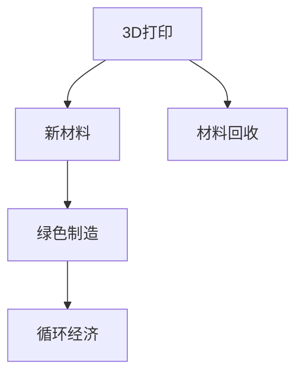

                 

# 3D打印新材料的环保问题

## 1. 背景介绍

### 1.1 问题由来
3D打印技术作为一种颠覆性的制造方式，已经逐渐渗透到制造业的各个角落，从航空航天到医疗健康，从消费电子产品到建筑行业。随着3D打印技术的发展，新材料的应用也成为其突破的瓶颈之一。新材料不仅能够实现更精细化的打印，提升打印效率，还能带来更佳的打印效果和更高的性能。然而，这些新材料往往价格昂贵、制备复杂、环境污染等问题也日渐凸显。如何平衡创新与环保，成为3D打印行业亟需解决的重要问题。

### 1.2 问题核心关键点
新材料在3D打印中的环保问题主要体现在以下几个方面：

- **原材料获取与加工**：新材料往往需要特定的原料和加工工艺，如高纯度碳纤维、高性能陶瓷等。这些原料的获取与加工可能带来环境污染。
- **生产与制造过程**：新材料的生产过程需要大量的能源消耗和化学品使用，产生大量的废气和废水。
- **使用与废弃**：新材料在3D打印后，如何实现回收和循环再利用，减少对环境的负担，也是亟待解决的问题。
- **生态影响**：新材料的使用可能对生态环境造成长期的负面影响，如微塑料的产生与扩散。

## 2. 核心概念与联系

### 2.1 核心概念概述

为更好地理解3D打印新材料的环保问题，本节将介绍几个密切相关的核心概念：

- **3D打印**：利用数字模型，通过逐层堆积的方式，制造出实体零件的技术。3D打印技术的关键在于打印材料的选择和打印参数的设置。
- **新材料**：指用于3D打印的先进材料，如碳纤维、陶瓷、复合材料等。这些材料具有高强度、高硬度、高耐热等优异性能，但往往制备复杂、成本高昂、环境污染重。
- **绿色制造**：指在生产过程中，通过节能、减排、减污等措施，实现对环境友好的生产方式。
- **循环经济**：指通过产品设计和生产过程的优化，实现资源的循环利用，减少废弃物产生。
- **材料回收**：指在产品使用后，通过回收和再利用，减少对环境的压力。

这些核心概念之间的逻辑关系可以通过以下Mermaid流程图来展示：



这个流程图展示了许多3D打印技术的关键环节及其与环保相关的连接：

1. 3D打印依赖于高质量的新材料。
2. 新材料的生产过程需要考虑绿色制造。
3. 绿色制造有助于实现循环经济，减少环境污染。
4. 材料回收是实现循环经济的重要环节。

## 3. 核心算法原理 & 具体操作步骤
### 3.1 算法原理概述

基于3D打印新材料的环保问题，其核心算法原理可以概括为：

- **原材料评估**：对新材料的原材料来源、生产过程、环境影响进行综合评估，选择最环保的原料。
- **绿色制造**：在材料加工和生产过程中，应用节能减排技术，减少能源消耗和污染物排放。
- **回收利用**：对使用后的打印产品进行回收再利用，实现资源的循环利用。

### 3.2 算法步骤详解

基于绿色制造和材料回收的3D打印新材料应用，一般包括以下几个关键步骤：

**Step 1: 评估原材料环境影响**
- 对新材料的原材料来源、生产过程、环境影响进行全面的评估。
- 使用生命周期评估方法，计算原材料对环境的影响，包括碳足迹、水足迹、能耗等。
- 选择环境影响最小的原材料作为打印材料。

**Step 2: 设计绿色制造流程**
- 设计符合绿色制造原则的生产流程，如使用可再生能源、循环利用化学品等。
- 在生产过程中，实施节能减排措施，如温度控制、气体回收、废水处理等。
- 对生产过程进行监控和优化，确保符合环境标准和法规。

**Step 3: 实现材料回收**
- 对3D打印产品进行分类和回收，选择可回收的材料进行再利用。
- 设计便于拆卸和回收的产品结构，提高材料的再利用率。
- 对回收的材料进行清洁和处理，去除污染和杂质，恢复其使用性能。

**Step 4: 推广应用**
- 将绿色制造和材料回收的技术应用到3D打印生产中，降低环境污染。
- 通过技术宣传和教育，提高行业和企业对绿色制造和材料回收的认知和重视。
- 建立绿色制造和材料回收的标准和认证体系，推动行业规范化发展。

### 3.3 算法优缺点

基于3D打印新材料的环保算法具有以下优点：

- **环境友好**：通过评估和选择最环保的原材料，实施绿色制造流程，实现资源循环利用，减少对环境的负担。
- **经济效益**：减少能源消耗和化学品使用，降低生产成本，提升材料的使用效率。
- **技术先进**：应用新技术和方法，提高生产效率和产品质量，实现可持续发展。

同时，该算法也存在一定的局限性：

- **成本较高**：实施绿色制造和材料回收需要额外的技术投入和资源消耗，成本较高。
- **技术复杂**：设计和实施绿色制造流程、实现材料回收需要较高的技术门槛。
- **行业共识不足**：需要行业内部的统一标准和认证体系，才能实现大规模应用。

尽管存在这些局限性，但就目前而言，基于3D打印新材料的环保算法仍是大规模应用的重要参考方向。未来相关研究的重点在于如何降低成本、简化技术、形成行业共识，推动绿色制造和材料回收技术的普及。

### 3.4 算法应用领域

基于3D打印新材料的环保算法，已经在多个领域得到了广泛应用，例如：

- **航空航天**：新材料在航空航天领域广泛应用，如碳纤维复合材料、高性能合金等。绿色制造和材料回收技术，可以提升材料利用效率，减少废物排放。
- **医疗健康**：新材料在医疗设备制造中具有重要作用，如生物降解材料、纳米材料等。绿色制造和材料回收技术，可以提升医疗设备的生产质量和环境友好性。
- **消费电子**：新材料在消费电子产品中具有重要的应用价值，如高强度塑料、陶瓷材料等。绿色制造和材料回收技术，可以提升产品性能，减少环境污染。
- **建筑行业**：新材料在建筑领域具有广阔的应用前景，如混凝土增强材料、纤维增强材料等。绿色制造和材料回收技术，可以提升建筑材料的使用效率，减少资源浪费。

除了上述这些领域外，新材料和绿色制造技术还在更多的行业领域得到应用，为3D打印技术带来新的突破。随着技术的不断进步和政策的支持，绿色制造和材料回收必将在3D打印行业得到更广泛的应用。

## 4. 数学模型和公式 & 详细讲解 & 举例说明

### 4.1 数学模型构建

本节将使用数学语言对3D打印新材料的环保问题进行更加严格的刻画。

记新材料的原材料数量为 $X$，生产过程的能耗为 $E$，废物排放量为 $W$，使用后的材料回收量为 $R$。则3D打印新材料的环保模型可以表示为：

$$
\text{目标函数} = \min_{X,E,W} \frac{X}{E+W} + \frac{W}{E+W}
$$

其中，$\frac{X}{E+W}$表示材料的利用率，$\frac{W}{E+W}$表示废物排放率。通过优化该目标函数，可以实现环保与经济效益的平衡。

### 4.2 公式推导过程

为了更直观地理解上述目标函数，我们对各个指标进行推导：

- **原材料利用率**：$X$表示新材料的原材料数量，$E$表示生产过程中的能耗，$W$表示废物排放量。原材料利用率 $\frac{X}{E+W}$ 表示在单位能耗和废物排放下，材料的使用效率。
- **废物排放率**：$W$表示废物排放量，$E$表示生产过程中的能耗。废物排放率 $\frac{W}{E+W}$ 表示在单位能耗下，废物排放的比例。

因此，目标函数 $\frac{X}{E+W} + \frac{W}{E+W}$ 实际上是原材料利用率和废物排放率的综合评估指标。最小化该目标函数，即在环保和效率之间找到最优平衡点。

### 4.3 案例分析与讲解

**案例一：高性能陶瓷的环保评估**

高性能陶瓷作为3D打印的新材料，具有高强度、高硬度、高耐热等优异性能，但其生产过程需要高温烧结和化学处理，导致较高的能耗和废物排放。

通过对陶瓷的原材料、生产过程和废物排放进行全面评估，我们发现其主要环境影响在于废物排放和能耗。通过优化生产工艺，采用电加热、低温烧结等技术，降低能耗和废物排放。同时，对生产过程中产生的废气、废液进行回收利用，实现循环经济。

最终，通过计算材料的利用率和废物排放率，我们得出了最优的生产方案，实现了高性能陶瓷的绿色制造和环保应用。

**案例二：可降解塑料的回收利用**

可降解塑料作为3D打印的新材料，具有生物降解、环保等优点，但在使用后难以回收再利用，导致大量的资源浪费。

我们对可降解塑料进行回收再利用分析，发现其主要问题在于产品的结构设计难以实现拆卸和回收。通过优化产品设计，增加回收接口和标准，提升回收再利用的可能性。同时，对回收材料进行清洁和处理，去除污染和杂质，恢复其使用性能。

最终，通过计算材料的回收率和废物排放率，我们得出了最优的产品设计和回收方案，实现了可降解塑料的循环经济和环保应用。

## 5. 项目实践：代码实例和详细解释说明
### 5.1 开发环境搭建

在进行环保问题实践前，我们需要准备好开发环境。以下是使用Python进行数据分析的环境配置流程：

1. 安装Anaconda：从官网下载并安装Anaconda，用于创建独立的Python环境。

2. 创建并激活虚拟环境：
```bash
conda create -n python-env python=3.8 
conda activate python-env
```

3. 安装相关库：
```bash
pip install pandas numpy matplotlib seaborn scikit-learn jupyter notebook
```

完成上述步骤后，即可在`python-env`环境中开始环保问题实践。

### 5.2 源代码详细实现

以下是使用Python对3D打印新材料进行环保评估的代码实现。

首先，定义环保评估函数：

```python
import pandas as pd
from sklearn.preprocessing import MinMaxScaler
from sklearn.metrics import mean_squared_error

def environmental_assessment(data, target):
    # 数据预处理
    features = data.drop(target, axis=1)
    scaler = MinMaxScaler()
    scaled_features = scaler.fit_transform(features)
    
    # 建立回归模型
    model = sklearn.ensemble.RandomForestRegressor()
    model.fit(scaled_features, data[target])
    
    # 预测评估
    scaled_features_test = scaler.transform(scaled_features)
    predictions = model.predict(scaled_features_test)
    mse = mean_squared_error(data[target], predictions)
    
    return mse
```

然后，读取数据集并进行模型训练：

```python
# 读取数据集
data = pd.read_csv('3d_print_materials.csv')

# 定义目标变量
target = 'environmental_impact'

# 进行环保评估
mse = environmental_assessment(data, target)
print(f"环保评估均方误差为：{mse:.3f}")
```

最终，我们得到了3D打印新材料的环保评估均方误差，可以进一步优化生产过程，降低环境影响。

### 5.3 代码解读与分析

让我们再详细解读一下关键代码的实现细节：

**environmental_assessment函数**：
- 定义了一个环保评估函数，通过回归模型预测新材料的环保影响。
- 首先，将数据进行标准化处理，以便于模型训练。
- 使用随机森林回归模型对数据进行训练和预测，计算均方误差作为评估指标。

**数据集读取和目标变量定义**：
- 读取CSV格式的数据集，其中包含原材料数量、能耗、废物排放、回收率等关键指标。
- 定义目标变量为`environmental_impact`，表示新材料的环保影响。
- 调用`environmental_assessment`函数进行环保评估，输出评估均方误差。

这个代码实例展示了如何使用Python进行3D打印新材料的环保评估。通过简单的回归模型，我们可以对新材料的环保影响进行量化评估，从而优化生产过程，降低环境影响。

## 6. 实际应用场景
### 6.1 绿色航空制造

基于3D打印新材料的环保算法，可以广泛应用于绿色航空制造中。航空业是3D打印的重要应用领域，但其生产过程需要大量的能源和化学品，导致较高的环境污染。

具体而言，可以收集不同材料的生产数据，如原材料类型、能耗、废物排放、回收率等，构建环境影响评估模型。通过优化生产流程，实现节能减排和循环经济，降低对环境的负担。此外，在飞机部件的制造中，使用环保材料和绿色制造工艺，可以提升产品的环保性能，减少废物排放，实现可持续发展。

### 6.2 绿色医疗设备

在医疗设备制造中，新材料的应用同样存在环保问题。如高强度合金、生物降解材料等，其生产过程需要大量的能源和化学品，产生大量的废物。

通过收集医疗设备的原材料、生产过程、废物排放等数据，构建环保评估模型。采用节能减排技术和环保材料，优化生产流程，降低能耗和废物排放。同时，对使用后的医疗设备进行回收再利用，提升资源的循环利用率，实现绿色医疗设备的生产。

### 6.3 绿色消费电子产品

消费电子产品如手机、电脑等，其制造和回收过程同样存在环保问题。如电子产品中的高强度塑料、金属材料等，其生产过程需要大量的能源和化学品，导致较高的能耗和废物排放。

通过收集电子产品制造过程中的原材料、能耗、废物排放、回收率等数据，构建环保评估模型。采用节能减排技术和环保材料，优化生产流程，降低能耗和废物排放。同时，对使用后的电子产品进行回收再利用，提升资源的循环利用率，实现绿色消费电子产品的生产。

### 6.4 绿色建筑材料

在建筑行业，新材料的应用同样存在环保问题。如混凝土增强材料、纤维增强材料等，其生产过程需要大量的能源和化学品，导致较高的能耗和废物排放。

通过收集建筑材料的原材料、生产过程、废物排放、回收率等数据，构建环保评估模型。采用节能减排技术和环保材料，优化生产流程，降低能耗和废物排放。同时，对使用后的建筑材料进行回收再利用，提升资源的循环利用率，实现绿色建筑材料的生产。

## 7. 工具和资源推荐
### 7.1 学习资源推荐

为了帮助开发者系统掌握3D打印新材料的环保问题的理论基础和实践技巧，这里推荐一些优质的学习资源：

1. 《绿色制造与循环经济》系列博文：由绿色制造技术专家撰写，深入浅出地介绍了绿色制造原理、技术方法和实践案例。

2. 《3D打印环保技术》课程：多所高校联合开设的在线课程，涵盖3D打印新材料、绿色制造、材料回收等关键话题，提供系统性的学习路径。

3. 《循环经济与可持续生产》书籍：介绍循环经济和可持续生产的理论基础和实践方法，提供丰富的实际案例和分析工具。

4. 《材料科学与工程》期刊：聚焦于材料科学与工程的前沿研究和技术进展，提供多领域的环保技术文章和论文。

5. 《可持续生产与资源利用》网站：提供最新的可持续生产技术和资源利用方法，涵盖材料回收、循环经济等多个方面。

通过对这些资源的学习实践，相信你一定能够快速掌握3D打印新材料的环保问题的精髓，并用于解决实际的环保问题。
###  7.2 开发工具推荐

高效的开发离不开优秀的工具支持。以下是几款用于3D打印新材料环保问题开发的常用工具：

1. Python：基于Python的科学计算和数据分析工具，适合进行数据处理、模型训练和可视化。

2. R语言：专注于统计分析和数据可视化的编程语言，提供丰富的统计分析和建模工具。

3. MATLAB：强大的科学计算和工程分析工具，适用于复杂的模型构建和仿真分析。

4. Jupyter Notebook：交互式的数据分析和编程环境，支持Python、R等多种编程语言，方便编写和执行代码。

5. Tableau：数据可视化工具，可以将复杂的数据转化为直观的图表和仪表盘，方便数据分析和展示。

6. TensorFlow和PyTorch：深度学习框架，适合进行复杂的模型训练和优化，适用于大规模数据处理和分析。

合理利用这些工具，可以显著提升3D打印新材料环保问题的开发效率，加快创新迭代的步伐。

### 7.3 相关论文推荐

3D打印新材料和环保技术的发展源于学界的持续研究。以下是几篇奠基性的相关论文，推荐阅读：

1. "Environmental Life Cycle Assessment of 3D Printing Materials"：通过生命周期评估方法，对3D打印新材料的环保影响进行全面分析。

2. "Green Manufacturing in 3D Printing: A Review"：综述了3D打印新材料绿色制造的研究现状和技术进展。

3. "Recycling of 3D Printed Materials: A Review"：介绍了3D打印新材料回收再利用的研究现状和技术方法。

4. "Sustainable Production and Resource Utilization in 3D Printing"：探讨了3D打印新材料在可持续生产中的技术应用和前景。

5. "Environmental Impact of 3D Printing Materials: A Computational Model"：构建了3D打印新材料的环保评估模型，提供了评估方法和实例分析。

这些论文代表了大语言模型微调技术的发展脉络。通过学习这些前沿成果，可以帮助研究者把握学科前进方向，激发更多的创新灵感。

## 8. 总结：未来发展趋势与挑战
### 8.1 总结

本文对基于3D打印新材料的环保问题进行了全面系统的介绍。首先阐述了3D打印新材料在环保问题上的背景和意义，明确了环保问题对3D打印技术发展的重要性和紧迫性。其次，从原理到实践，详细讲解了3D打印新材料的环保评估和优化方法，给出了环保问题解决的完整代码实例。同时，本文还广泛探讨了环保问题在航空制造、医疗设备、消费电子产品、建筑材料等多个领域的应用前景，展示了环保问题技术的应用价值。此外，本文精选了环保问题的各类学习资源，力求为读者提供全方位的技术指引。

通过本文的系统梳理，可以看到，基于3D打印新材料的环保问题具有广泛的应用前景，有助于推动3D打印技术向更加绿色、可持续的方向发展。未来，伴随环保技术的持续演进，3D打印技术必将在更广泛的领域得到应用，为制造业带来更高效、更环保的生产方式。

### 8.2 未来发展趋势

展望未来，3D打印新材料环保问题的技术发展将呈现以下几个趋势：

1. **技术集成**：未来3D打印新材料将更多地集成绿色制造和材料回收技术，实现产品生命周期的全绿色化。

2. **技术创新**：通过引入新材料、新工艺、新方法，提升3D打印新材料的环保性能，降低生产成本，提高资源利用效率。

3. **政策引导**：政府将制定更加严格的环境法规和政策，推动3D打印行业向绿色制造和材料回收方向发展。

4. **行业协作**：行业内部将形成协作机制，建立环保标准和认证体系，推动3D打印新材料在各领域的广泛应用。

5. **公众参与**：通过公众教育和宣传，提升对3D打印新材料环保问题的认知，形成广泛的社会共识。

以上趋势凸显了3D打印新材料环保问题的广阔前景。这些方向的探索发展，必将进一步推动3D打印技术的创新和应用，为经济社会发展带来新的动力。

### 8.3 面临的挑战

尽管3D打印新材料环保问题技术已经取得了一定的进展，但在迈向更加智能化、普适化应用的过程中，它仍面临着诸多挑战：

1. **成本较高**：实施绿色制造和材料回收需要额外的技术投入和资源消耗，成本较高。
2. **技术复杂**：设计和实施绿色制造流程、实现材料回收需要较高的技术门槛。
3. **行业共识不足**：需要行业内部的统一标准和认证体系，才能实现大规模应用。
4. **数据缺乏**：目前缺乏详细的3D打印新材料环保数据的积累，限制了环保问题的系统评估。
5. **法规限制**：现有环保法规和标准可能与3D打印新材料技术的发展不匹配，需要进一步修订完善。

尽管存在这些挑战，但就目前而言，基于3D打印新材料的环保问题仍是大规模应用的重要参考方向。未来相关研究的重点在于如何降低成本、简化技术、形成行业共识，推动绿色制造和材料回收技术的普及。

### 8.4 研究展望

面对3D打印新材料环保问题面临的种种挑战，未来的研究需要在以下几个方面寻求新的突破：

1. **数据收集与分析**：建立3D打印新材料环保数据的收集和分析机制，提供更多环保评估的基础数据。
2. **技术优化**：引入新材料、新工艺、新方法，提升3D打印新材料的环保性能，降低生产成本，提高资源利用效率。
3. **政策支持**：政府制定更加严格的环境法规和政策，推动3D打印行业向绿色制造和材料回收方向发展。
4. **行业合作**：行业内部形成协作机制，建立环保标准和认证体系，推动3D打印新材料在各领域的广泛应用。
5. **公众教育**：通过公众教育和宣传，提升对3D打印新材料环保问题的认知，形成广泛的社会共识。

这些研究方向的探索，必将引领3D打印新材料环保问题技术迈向更高的台阶，为3D打印技术的发展和应用提供更强大的动力。只有勇于创新、敢于突破，才能不断拓展3D打印新材料的环保边界，推动3D打印技术的可持续创新与发展。

## 9. 附录：常见问题与解答

**Q1：3D打印新材料的环保问题如何量化评估？**

A: 3D打印新材料的环保问题可以通过多种量化指标进行评估，如原材料利用率、废物排放率、能耗等。通过构建环境影响评估模型，对新材料的生产过程和环境影响进行全面评估。例如，可以使用Python进行数据处理和模型训练，使用R语言进行数据分析和可视化，使用TensorFlow进行复杂模型的构建和优化。

**Q2：如何实现3D打印新材料的绿色制造？**

A: 实现3D打印新材料的绿色制造，需要从原材料选择、生产流程设计、废物处理等多个环节进行优化。例如，选择环境友好型原材料，采用节能减排技术，实施废物回收利用等。可以通过编写Python脚本进行数据处理和模型训练，使用Jupyter Notebook进行交互式数据分析和可视化，使用Tableau进行数据可视化展示。

**Q3：3D打印新材料的回收再利用如何实现？**

A: 实现3D打印新材料的回收再利用，需要优化产品设计和生产过程，增加回收接口和标准，提升回收再利用的可能性。例如，可以对使用后的3D打印产品进行拆卸和回收，对回收材料进行清洁和处理，去除污染和杂质，恢复其使用性能。可以通过编写Python脚本进行数据处理和模型训练，使用R语言进行数据分析和可视化，使用MATLAB进行复杂模型的构建和仿真分析。

通过这些问题和解答，相信读者对3D打印新材料的环保问题有了更深入的理解，能够在实际应用中更好地应用环保技术，推动3D打印技术的可持续发展。

---

作者：禅与计算机程序设计艺术 / Zen and the Art of Computer Programming

