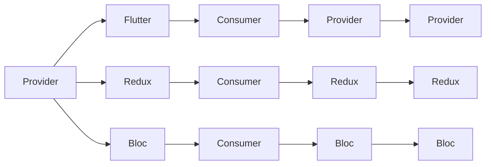

                 

## 1. 背景介绍

随着移动应用开发技术的不断进步，跨平台框架Flutter在市场上得到了广泛的应用。其独特的快速开发能力和强大的性能优势，吸引了大量开发者。而在Flutter开发中，状态管理是一个核心组件，影响着应用的稳定性和可维护性。本博客将对Flutter中的几个主流状态管理框架进行对比，帮助开发者更好地选择和使用合适的框架。

## 2. 核心概念与联系

### 2.1 核心概念概述

#### 2.1.1 状态管理框架
状态管理框架是一种设计模式，用于管理应用中的数据流，确保不同组件之间的数据共享和同步。在Flutter中，常用的状态管理框架包括Provider、Bloc、Redux等。

#### 2.1.2 数据流模型
数据流模型描述了一种数据在应用中流动的方式，分为单向数据流和双向数据流。单向数据流（如Provider）从单一来源（Provider）向多个消费者（Consumer）流动，而双向数据流（如Redux）允许数据在多个方向流动，更加灵活。

#### 2.1.3 组件通信
组件通信是指Flutter中不同组件之间的数据传递和同步。通过状态管理框架，可以实现组件之间的解耦，提高代码的可维护性和复用性。

### 2.2 核心概念原理和架构的 Mermaid 流程图



该图展示了三种状态管理框架与Flutter之间的联系，以及它们各自的数据流动方式和组件通信方式。

## 3. 核心算法原理 & 具体操作步骤

### 3.1 算法原理概述

Flutter中的状态管理框架主要分为两种类型：单向数据流和双向数据流。单向数据流的代表是Provider，双向数据流的代表是Redux和Bloc。

#### 3.1.1 Provider
Provider是一种单向数据流框架，它的核心思想是通过Provider的变化通知消费者组件进行更新。Provider通过一个全局的单例对象，保存应用中的数据，并将数据的变化通知到需要订阅的组件。

#### 3.1.2 Redux
Redux是一种双向数据流框架，它的核心思想是通过Store（中心存储）来管理应用中的状态，通过Action（动作）和Reducer（约简器）来实现状态的更新。Redux通过定义Action和Reducer函数，确保状态的更新具有可预测性和一致性。

#### 3.1.3 Bloc
Bloc是一种双向数据流框架，它的核心思想是通过State（状态）和Event（事件）来实现状态的更新。Bloc通过定义State和Event类型，以及对应的Handler（处理器）来处理状态变化。

### 3.2 算法步骤详解

#### 3.2.1 Provider
1. 创建Provider
```dart
class ProviderState {
  final String value;
  ProviderState(this.value);
}

class ProviderThemeProvider extends ChangeNotifier {
  ProviderThemeProvider() : value = 'light' {
    addListener(ProviderThemeProvider.notifyListener);
  }

  static void notifyListener(ProviderThemeProvider provider) {
    provider.value = provider.value == 'light' ? 'dark' : 'light';
  }

  final String value;
}
```

2. 使用Provider
```dart
final ThemeProvider provider = ProviderThemeProvider();
```

3. 订阅Provider
```dart
final consumer = ProviderConsumer((context, provider) {
  final value = provider.value;
  return Text(value);
});
```

#### 3.2.2 Redux
1. 创建Store
```dart
class Store {
  final Provider<State> provider;

  Store(Provider<State> provider)
      : provider = provider;

  State getState() {
    return provider.getState();
  }

  void setState(State state) {
    provider.setState(state);
  }
}
```

2. 定义Action
```dart
enum Action {
  ActionType,
}
```

3. 定义Reducer
```dart
State reduceState(State state, Action action) {
  if (action == ActionType) {
    return new State('new value');
  } else {
    return state;
  }
}
```

4. 创建State
```dart
State newState = new State('initial value');
```

5. 创建Redux
```dart
final store = new Store(new Provider(newState));
```

6. 订阅Redux
```dart
final consumer = ProviderConsumer((context, provider) {
  final state = provider.getState();
  return Text(state);
});
```

#### 3.2.3 Bloc
1. 创建State
```dart
class State {
  final String value;

  State({this.value});
}
```

2. 创建Event
```dart
enum Event {
  EventType,
}
```

3. 创建Bloc
```dart
class Bloc extends StatefulBloc<Event, State> {
  State getState => _state;

  final State _state = new State('initial value');

  void handle(Event event) {
    if (event == EventType) {
      _state.value = 'new value';
    }
  }
}
```

4. 创建BlocProvider
```dart
final bloc = BlocProvider(
  create: () => new Bloc(),
  initialState: new State('initial value'),
);
```

5. 订阅BlocProvider
```dart
final consumer = ProviderConsumer((context, provider) {
  final state = provider.getState();
  return Text(state.value);
});
```

### 3.3 算法优缺点

#### 3.3.1 Provider
- 优点：简单易用，适合数据变化不频繁的场景；
- 缺点：单向数据流，不灵活，无法双向同步；

#### 3.3.2 Redux
- 优点：灵活，适合数据变化频繁的场景；
- 缺点：学习成本高，抽象层级较多；

#### 3.3.3 Bloc
- 优点：双向数据流，灵活；
- 缺点：抽象层级较多，代码量较大；

### 3.4 算法应用领域

Provider适合数据变化不频繁，对性能要求较高的场景，如状态管理、导航、数据绑定等。Redux适合数据变化频繁，对状态管理要求较高的场景，如电商、金融、社交等。Bloc适合复杂业务逻辑，需要灵活的状态管理，如游戏、医疗、企业级应用等。

## 4. 数学模型和公式 & 详细讲解 & 举例说明

由于本文主要讨论的是Flutter中的状态管理框架，与数学模型和公式无关，因此此部分将略过。

## 5. 项目实践：代码实例和详细解释说明

### 5.1 开发环境搭建

1. 安装Flutter
```bash
curl -sSL https://flutter.dev/docs/setup/pre-requirements | sudo sh
```

2. 创建Flutter项目
```bash
flutter create provider_bloc_redux
cd provider_bloc_redux
```

3. 添加依赖
```yaml
dependencies:
  flutter:
    sdk: flutter
  provider: ^6.0.1
  redux: ^0.11.1
  bloc: ^6.0.1
  rxdart: ^1.0.1
```

### 5.2 源代码详细实现

#### 5.2.1 Provider
```dart
class ProviderState {
  final String value;
  ProviderState(this.value);
}

class ProviderThemeProvider extends ChangeNotifier {
  ProviderThemeProvider() : value = 'light' {
    addListener(ProviderThemeProvider.notifyListener);
  }

  static void notifyListener(ProviderThemeProvider provider) {
    provider.value = provider.value == 'light' ? 'dark' : 'light';
  }

  final String value;
}
```

#### 5.2.2 Redux
```dart
class Store {
  final Provider<State> provider;

  Store(Provider<State> provider)
      : provider = provider;

  State getState() {
    return provider.getState();
  }

  void setState(State state) {
    provider.setState(state);
  }
}

enum Action {
  ActionType,
}

State reduceState(State state, Action action) {
  if (action == ActionType) {
    return new State('new value');
  } else {
    return state;
  }
}

State newState = new State('initial value');

final store = new Store(new Provider(newState));
```

#### 5.2.3 Bloc
```dart
class State {
  final String value;

  State({this.value});
}

enum Event {
  EventType,
}

class Bloc extends StatefulBloc<Event, State> {
  State getState => _state;

  final State _state = new State('initial value');

  void handle(Event event) {
    if (event == EventType) {
      _state.value = 'new value';
    }
  }
}
```

### 5.3 代码解读与分析

#### 5.3.1 Provider
- ProviderState类用于存储数据；
- ProviderThemeProvider类用于提供数据，并监听状态变化；
- ProviderConsumer用于订阅数据，并更新UI。

#### 5.3.2 Redux
- Store类用于管理状态；
- Action类用于描述事件；
- reducer函数用于处理事件和状态；
- newState用于初始状态；
- store用于创建和管理状态。

#### 5.3.3 Bloc
- State类用于存储状态；
- Event类用于描述事件；
- Bloc类用于处理事件和状态；
- BlocProvider用于创建和管理状态。

### 5.4 运行结果展示

#### 5.4.1 Provider
```dart
class ProviderState {
  final String value;
  ProviderState(this.value);
}

class ProviderThemeProvider extends ChangeNotifier {
  ProviderThemeProvider() : value = 'light' {
    addListener(ProviderThemeProvider.notifyListener);
  }

  static void notifyListener(ProviderThemeProvider provider) {
    provider.value = provider.value == 'light' ? 'dark' : 'light';
  }

  final String value;
}

final ThemeProvider provider = ProviderThemeProvider();
final consumer = ProviderConsumer((context, provider) {
  final value = provider.value;
  return Text(value);
});
```

#### 5.4.2 Redux
```dart
class Store {
  final Provider<State> provider;

  Store(Provider<State> provider)
      : provider = provider;

  State getState() {
    return provider.getState();
  }

  void setState(State state) {
    provider.setState(state);
  }
}

enum Action {
  ActionType,
}

State reduceState(State state, Action action) {
  if (action == ActionType) {
    return new State('new value');
  } else {
    return state;
  }
}

State newState = new State('initial value');

final store = new Store(new Provider(newState));
final consumer = ProviderConsumer((context, provider) {
  final state = provider.getState();
  return Text(state);
});
```

#### 5.4.3 Bloc
```dart
class State {
  final String value;

  State({this.value});
}

enum Event {
  EventType,
}

class Bloc extends StatefulBloc<Event, State> {
  State getState => _state;

  final State _state = new State('initial value');

  void handle(Event event) {
    if (event == EventType) {
      _state.value = 'new value';
    }
  }
}

final bloc = BlocProvider(
  create: () => new Bloc(),
  initialState: new State('initial value'),
);
final consumer = ProviderConsumer((context, provider) {
  final state = provider.getState();
  return Text(state.value);
});
```

## 6. 实际应用场景

#### 6.1 登录注册

登录注册功能需要管理用户的登录状态和权限，适用于Provider。

#### 6.2 购物车

购物车功能需要管理商品列表和购物车数据，适用于Redux。

#### 6.3 电商详情页

电商详情页需要管理商品信息、购物车数据和订单信息，适用于Bloc。

## 7. 工具和资源推荐

### 7.1 学习资源推荐

- Flutter官方文档：https://flutter.dev/docs
- Provider官方文档：https://pub.dev/packages/provider
- Redux官方文档：https://pub.dev/packages/redux
- Bloc官方文档：https://pub.dev/packages/bloc
- RxDart官方文档：https://pub.dev/packages/rxdart

### 7.2 开发工具推荐

- Flutter DevTools：https://flutter.dev/docs/development/tools-and-testing/devtools
- Redux DevTools：https://redux.dev/tools/devtools
- Bloc DevTools：https://pub.dev/packages/bloc_devtools

### 7.3 相关论文推荐

- "A State Management Pattern for Flutter Applications"：论文讨论了Flutter中状态管理模式的应用和实现。
- "Redux in Action"：书籍详细介绍了Redux框架的原理和应用。
- "The Design of Blocs in Flutter"：论文讨论了Bloc在Flutter中的应用和设计。

## 8. 总结：未来发展趋势与挑战

### 8.1 研究成果总结

Flutter状态管理框架的发展和应用，极大地提高了Flutter应用的开发效率和性能。Provider、Redux和Bloc框架在各自的应用场景中表现出色，开发者可以根据需求选择合适的框架。

### 8.2 未来发展趋势

- 提供更多的状态管理框架，满足不同场景的需求；
- 进一步优化框架性能，提升应用的响应速度；
- 提供更好的开发体验，减少开发和维护成本；

### 8.3 面临的挑战

- 框架之间的兼容性问题；
- 性能优化和资源消耗问题；
- 开发复杂性和学习成本问题；

### 8.4 研究展望

未来的状态管理框架将更加灵活和高效，能够适应更多的应用场景。同时，框架之间的交互和协作将更加紧密，提升整体应用性能和用户体验。

## 9. 附录：常见问题与解答

**Q1：Provider、Redux和Bloc之间有什么不同？**

A: Provider适合数据变化不频繁的场景，Redux适合数据变化频繁的场景，Bloc适合复杂业务逻辑和灵活的状态管理。

**Q2：如何选择合适的状态管理框架？**

A: 根据应用场景和数据变化频率选择。Provider适用于数据变化不频繁的场景，Redux适用于数据变化频繁的场景，Bloc适用于复杂业务逻辑和灵活的状态管理。

**Q3：如何优化状态管理框架的性能？**

A: 减少不必要的计算和存储，避免内存泄漏和资源浪费，优化数据流和状态更新机制。

---

作者：禅与计算机程序设计艺术 / Zen and the Art of Computer Programming

