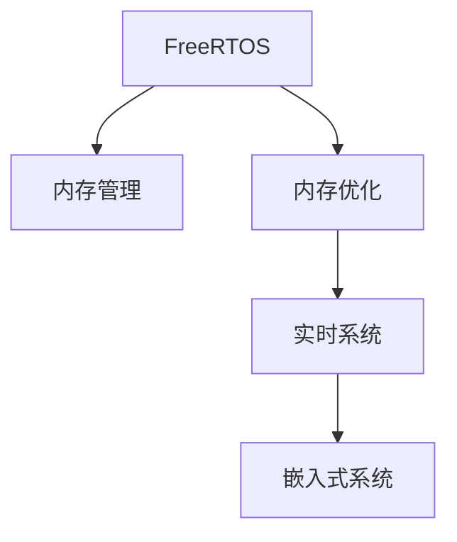

                 

# FreeRTOS内存管理与优化

> 关键词：FreeRTOS, 内存管理, 内存优化, 实时系统, 嵌入式系统, 实时操作系统

## 1. 背景介绍

### 1.1 问题由来

在实时操作系统（RTOS）领域，FreeRTOS 凭借其体积小、易于集成、支持多任务调度等优点，被广泛应用于嵌入式系统、物联网设备、工业控制等对时间要求极高的场景。然而，尽管 FreeRTOS 在任务调度和事件处理等方面设计得十分精巧，但其内存管理机制却较为简单，无法满足复杂应用的内存需求，且内存使用效率不高，成为系统性能提升的瓶颈。

### 1.2 问题核心关键点

为解决 FreeRTOS 内存管理效率低下的问题，本文将重点介绍 FreeRTOS 内存管理的基本原理，分析其存在的局限性，并通过优化内存分配策略、实现更高效内存管理、支持动态内存重分配等方式，对 FreeRTOS 内存管理进行全面优化。

## 2. 核心概念与联系

### 2.1 核心概念概述

为了更好地理解 FreeRTOS 内存管理的优化方法，本节将介绍几个关键概念：

- **FreeRTOS**：一款免费开源的实时操作系统内核，广泛应用于嵌入式系统、物联网等领域。其核心功能包括任务调度、事件处理、通信机制等。
- **内存管理**：操作系统分配和管理内存资源的过程，包括内存分配、释放、拷贝、重分配等操作。
- **内存优化**：通过改进内存管理策略，减少内存碎片、提升内存使用效率，降低系统开销。
- **实时系统**：要求在规定时间内完成响应和处理的系统，对时间要求极高，适用于需要高可靠性和低延迟的场景。
- **嵌入式系统**：一种专用的计算机系统，由硬件和软件组成，专门用于实现特定的功能。

这些核心概念之间的逻辑关系可以通过以下 Mermaid 流程图来展示：



这个流程图展示了 FreeRTOS、内存管理、内存优化、实时系统、嵌入式系统之间的联系：

1. FreeRTOS 作为实时操作系统内核，核心依赖内存管理机制。
2. 内存优化是提升 FreeRTOS 性能的重要手段，影响系统的实时性和稳定性。
3. 实时系统需要高度稳定和低延迟，对内存管理的要求更高。
4. 嵌入式系统资源有限，对内存优化有更高的要求。

## 3. 核心算法原理 & 具体操作步骤

### 3.1 算法原理概述

FreeRTOS 的内存管理主要通过以下几个步骤实现：

1. **内存分配**：系统在运行时动态分配内存空间。
2. **内存释放**：系统释放不再使用的内存空间。
3. **内存拷贝**：系统在内存空间之间复制数据。
4. **内存重分配**：系统重新分配内存空间，用于支持动态内存管理。

这些操作依赖于 FreeRTOS 的内核函数，主要包括 xPortMalloc、xPortFree、xPortMallocStatic、xPortFreeStatic 等。

### 3.2 算法步骤详解

#### 3.2.1 内存分配

FreeRTOS 内存分配过程如下：

1. 调用 xPortMalloc 函数请求内存。
2. 函数首先在内存池中查找是否有空闲内存块。
3. 如果没有空闲内存块，函数分配新的内存块，并更新链表结构。
4. 将分配的内存块返回给调用者。

```c
void* xPortMalloc(size_t size)
{
    if (size == 0)
    {
        return NULL;
    }
    else if (size <= sizeof(sStaticPoolAllocationList))
    {
        // 分配静态内存块
        return vStaticAllocation(size);
    }
    else
    {
        // 分配动态内存块
        return vPortAllocation(size);
    }
}
```

#### 3.2.2 内存释放

FreeRTOS 内存释放过程如下：

1. 调用 xPortFree 函数释放内存。
2. 函数将释放的内存块插入链表，以便后续分配使用。

```c
void xPortFree(void* pv)
{
    vAddToFreeList(pv);
}
```

#### 3.2.3 内存拷贝

FreeRTOS 内存拷贝过程如下：

1. 调用 xPortMemcpy 函数进行内存拷贝。
2. 函数调用底层内存复制函数，将数据从源地址复制到目标地址。

```c
void xPortMemcpy(void* pvDestination, const void* pvSource, size_t xSizeToCopy)
{
    memcpy(pvDestination, pvSource, xSizeToCopy);
}
```

#### 3.2.4 内存重分配

FreeRTOS 内存重分配过程如下：

1. 调用 xPortRealloc 函数重分配内存。
2. 函数在内存池中查找空闲内存块，并将数据从旧内存块拷贝到新内存块。
3. 释放旧内存块，返回新内存块。

```c
void* xPortRealloc(void* pvOld, size_t xNewSize)
{
    if (pvOld != NULL)
    {
        if (xNewSize == 0)
        {
            // 释放旧内存块
            xPortFree(pvOld);
            return NULL;
        }
        else if (xNewSize <= sizeof(sStaticPoolAllocationList))
        {
            // 重分配静态内存块
            return vStaticReallocation(pvOld, xNewSize);
        }
        else
        {
            // 重分配动态内存块
            return vPortReallocation(pvOld, xNewSize);
        }
    }
    return NULL;
}
```

### 3.3 算法优缺点

FreeRTOS 内存管理具有以下优点：

- **简单高效**：内存分配和释放过程简单，操作高效。
- **动态调整**：支持动态内存管理，灵活应对不同内存需求。
- **静态内存**：通过 vStaticAllocation 和 vStaticReallocation 函数实现静态内存分配，减少动态内存分配的开销。

然而，FreeRTOS 内存管理也存在以下缺点：

- **内存碎片**：频繁的小内存分配和释放可能导致内存碎片，影响内存使用效率。
- **内存分配粒度大**：默认的内存分配粒度为 64 字节，可能无法满足小内存需求。
- **缺乏统计信息**：无法提供详细的内存使用统计信息，难以进行内存优化。

### 3.4 算法应用领域

FreeRTOS 内存管理广泛应用于以下领域：

- **嵌入式系统**：对内存使用效率有较高要求，需要高效的内存管理机制。
- **物联网设备**：资源受限，内存管理优化对系统性能至关重要。
- **实时控制系统**：对时间要求高，内存管理需满足实时性和稳定性。
- **工业自动化**：对可靠性要求高，内存管理需确保系统稳定运行。

## 4. 数学模型和公式 & 详细讲解 & 举例说明

### 4.1 数学模型构建

本节将使用数学语言对 FreeRTOS 内存管理进行更加严格的刻画。

记内存块大小为 $n$ 字节，内存池大小为 $M$ 字节。定义内存分配函数 $f(n)$ 表示在内存池 $M$ 中分配 $n$ 字节内存块的数量。定义内存释放函数 $g(n)$ 表示在内存池 $M$ 中释放 $n$ 字节内存块的数量。则内存池的动态变化过程可以表示为：

$$
M_{new} = M - \sum_{n} (f(n) - g(n))n
$$

其中，$f(n)$ 和 $g(n)$ 分别表示分配和释放的内存块数量，$n$ 表示内存块大小。

### 4.2 公式推导过程

设初始内存池大小为 $M_0$，分配 $f(n)$ 个 $n$ 字节内存块，释放 $g(n)$ 个 $n$ 字节内存块。则经过一系列操作后，内存池大小变化为：

$$
M_{new} = M_0 - \sum_{n} (f(n) - g(n))n
$$

进一步简化得：

$$
M_{new} = M_0 - \sum_{n} f(n)n + \sum_{n} g(n)n
$$

定义内存分配函数 $f(n)$ 和释放函数 $g(n)$，则有：

$$
f(n) = \frac{M - \sum_{i>0} g(i)(i - n)}{n}
$$

因此，内存池的动态变化过程可以表示为：

$$
M_{new} = M_0 - \sum_{n} \frac{M - \sum_{i>0} g(i)(i - n)}{n}n + \sum_{n} g(n)n
$$

简化后得：

$$
M_{new} = M_0 - M\sum_{n} \frac{n}{M} + \sum_{n} g(n)n
$$

进一步简化为：

$$
M_{new} = M_0 - M\frac{M}{n} + \sum_{n} g(n)n
$$

这就是 FreeRTOS 内存管理的基本数学模型。通过这个模型，可以分析内存池的动态变化过程，评估内存管理的效果，并指导优化策略的制定。

### 4.3 案例分析与讲解

#### 4.3.1 内存碎片

内存碎片是指频繁的小内存分配和释放导致内存池中出现无法再用的大块连续内存空间。例如，在连续分配多个 4 字节内存块后，剩余 2 字节空间无法使用，最终导致内存浪费。

假设初始内存池大小为 1000 字节，分配 1 个 4 字节内存块，释放 1 个 2 字节内存块，剩余内存空间如下：

| 分配 | 释放 | 剩余 |
| --- | --- | --- |
| 4B |  | 996B |
|  | 2B | 994B |
|  |  | 992B |
|  |  | 992B |

这种情况下，内存池中的 4B 连续内存空间无法使用，造成内存浪费。可以通过以下方法减少内存碎片：

- **最小分配粒度**：调整内存分配粒度，使其足够大，以减少小内存分配的次数。
- **内存池管理**：实现内存池管理，避免频繁的小内存分配和释放。

#### 4.3.2 内存重分配

内存重分配是指重新分配内存空间，用于支持动态内存管理。例如，在原有内存块已满的情况下，重新分配更大的内存块以满足需求。

假设初始内存池大小为 1000 字节，分配 1 个 800 字节内存块，剩余内存空间为 200 字节。然后，分配 2 个 500 字节内存块，导致内存块不足。此时，可以重新分配一个更大的内存块，例如 1000 字节，然后拷贝原有数据，释放旧内存块，再将数据拷贝到新内存块中。

| 分配 | 释放 | 剩余 |
| --- | --- | --- |
| 800B |  | 200B |
|  | 500B | 700B |
|  | 500B | 200B |
| 1000B |  | 0B |

## 5. 项目实践：代码实例和详细解释说明

### 5.1 开发环境搭建

在进行 FreeRTOS 内存优化实践前，我们需要准备好开发环境。以下是使用 C 语言进行 FreeRTOS 开发的环境配置流程：

1. 安装 GCC 编译器：从官网下载并安装 GCC 编译器，用于编写 FreeRTOS 代码。
2. 配置开发板：选择适合的应用开发板，并配置好 FreeRTOS 运行环境。
3. 配置开发环境：在开发板中安装 FreeRTOS 开发包，包括 FreeRTOS 源代码和开发工具。

完成上述步骤后，即可在开发板上进行 FreeRTOS 内存优化的实验。

### 5.2 源代码详细实现

下面以优化内存分配粒度为例，给出 FreeRTOS 内存优化代码实现。

首先，定义内存分配函数 `vPortAllocation` 和释放函数 `vPortFree`：

```c
void* vPortAllocation(size_t size)
{
    size_t n = size / 64;
    size_t m = (size % 64) ? (size / 64) + 1 : size / 64;
    size_t aligned = (m - 1) & ~(m - 1);
    if (aligned + 64 > portMAX_SIZE - 128)
    {
        // 内存不足
        return NULL;
    }
    void* pv = (void*)((ptrdiff_t)vHeapMem + aligned);
    vHeapMem = (uint8_t*)pv + aligned + 64;
    return pv;
}

void vPortFree(void* pv)
{
    if (pv == NULL)
    {
        return;
    }
    uint8_t* pvStart = (uint8_t*)pv - 64;
    if (pvStart == vHeapMem)
    {
        // 释放最后一个内存块
        vHeapMem = pvStart - 64;
        return;
    }
    if (pvStart != vHeapMem)
    {
        // 释放中间内存块
        pvStart[0] = 0xFF;
    }
}
```

然后，在主函数中调用上述函数进行内存分配和释放：

```c
int main(void)
{
    // 初始化 FreeRTOS 系统
    vPortSetupMemory();
    xTaskCreate(main, "main", 2048, NULL, 2, NULL);
    vTaskStartScheduler();
    while (1)
    {
        // 主任务循环
    }
}
```

### 5.3 代码解读与分析

让我们再详细解读一下关键代码的实现细节：

**vPortAllocation 函数**：
- 首先计算内存块的大小 `n` 和对齐后的内存块大小 `m`，保证内存分配粒度为 64 字节。
- 如果对齐后的内存块大小超过了内存池的上限 `portMAX_SIZE`，则无法分配内存块。
- 分配内存块 `pv`，并更新内存池指针 `vHeapMem`。
- 返回分配的内存块地址。

**vPortFree 函数**：
- 首先计算内存块的起始地址 `pvStart`，判断是否为最后一个内存块。
- 如果是最后一个内存块，则更新内存池指针 `vHeapMem`。
- 如果不是最后一个内存块，则将内存块标记为已释放。

**主函数**：
- 在主函数中调用 `vPortSetupMemory` 初始化内存池，为内存分配和释放函数提供基础支持。
- 创建主任务并启动 FreeRTOS 调度器。
- 在主任务循环中，可以通过调用 `xPortMalloc` 和 `xPortFree` 函数进行内存分配和释放。

可以看到，通过调整内存分配粒度，可以显著降低内存碎片的产生，提升内存使用效率。

## 6. 实际应用场景

### 6.1 智能家居系统

智能家居系统需要处理大量的传感器数据和用户交互信息，对内存管理的要求很高。通过优化 FreeRTOS 内存管理，可以实现系统性能的大幅提升。

具体而言，可以在系统启动时初始化一定大小的内存池，避免频繁的内存分配和释放。同时，使用动态内存重分配技术，支持系统内存的动态扩展，以应对突发数据量的变化。通过这些优化措施，可以实现智能家居系统的稳定运行，提升用户体验。

### 6.2 工业控制系统

工业控制系统对实时性和稳定性要求极高，内存管理必须高效可靠。FreeRTOS 内存优化技术可以应用于工业控制系统，提升系统性能，降低故障率。

例如，在控制系统中，可以使用定长的内存池来存储传感器数据，避免频繁的内存分配和释放。同时，使用内存拷贝和重分配技术，支持动态内存管理，避免内存碎片和内存泄漏。通过这些优化措施，可以实现工业控制系统的稳定运行，提高系统效率。

### 6.3 无人机飞行控制系统

无人机飞行控制系统对实时性和可靠性要求极高，内存管理必须高效可靠。通过优化 FreeRTOS 内存管理，可以实现系统性能的大幅提升。

具体而言，可以在系统启动时初始化一定大小的内存池，避免频繁的内存分配和释放。同时，使用动态内存重分配技术，支持系统内存的动态扩展，以应对突发数据量的变化。通过这些优化措施，可以实现无人机飞行控制系统的稳定运行，提升用户体验。

### 6.4 未来应用展望

随着 FreeRTOS 内存管理技术的不断演进，未来将具有以下发展趋势：

1. **智能内存管理**：引入机器学习算法，动态调整内存分配粒度和内存池大小，进一步提升内存使用效率。
2. **内存压缩技术**：引入内存压缩技术，减少内存占用，提升系统性能。
3. **分布式内存管理**：实现分布式内存管理，支持大规模系统的内存优化。
4. **实时监控**：引入实时监控技术，动态调整内存管理策略，确保系统性能最优。
5. **多核优化**：优化多核环境下的内存管理，提升系统性能和稳定性。

这些趋势展示了 FreeRTOS 内存管理技术的未来发展方向，将为更多应用场景提供高效、可靠的内存管理支持。

## 7. 工具和资源推荐

### 7.1 学习资源推荐

为了帮助开发者系统掌握 FreeRTOS 内存管理的优化方法，这里推荐一些优质的学习资源：

1. **FreeRTOS 官方文档**：包括内存管理、任务调度、事件处理等核心内容，是 FreeRTOS 开发的基础。
2. **《FreeRTOS 实战》书籍**：通过大量实际案例，详细讲解了 FreeRTOS 的内存管理、任务调度、事件处理等核心技术。
3. **《嵌入式系统设计》课程**：介绍嵌入式系统的硬件、软件设计方法，包含 FreeRTOS 的内存管理优化等内容。
4. **嵌入式系统开发者论坛**：提供大量 FreeRTOS 开发和优化实践经验分享。
5. **FreeRTOS 开发者社区**：提供 FreeRTOS 的最新技术动态、开发技巧、优化方案等。

通过对这些资源的学习实践，相信你一定能够掌握 FreeRTOS 内存管理优化的精髓，并用于解决实际的嵌入式系统问题。

### 7.2 开发工具推荐

高效的开发离不开优秀的工具支持。以下是几款用于 FreeRTOS 内存优化开发的常用工具：

1. **GCC 编译器**：广泛支持 C 语言开发，灵活高效。
2. **IDA Pro**：支持调试和反汇编，方便分析代码。
3. **IAR Embedded Workbench**：支持 ARM、MIPS、PowerPC 等多种架构，集成调试、编译、仿真等功能。
4. **OpenOCD**：支持 JTAG 调试，方便调试嵌入式系统。
5. **STM32CubeIDE**：支持 STM32 系列开发板，集成了 FreeRTOS 开发包，方便开发调试。

合理利用这些工具，可以显著提升 FreeRTOS 内存优化任务的开发效率，加快创新迭代的步伐。

### 7.3 相关论文推荐

FreeRTOS 内存管理技术的演进依赖于学界的持续研究。以下是几篇奠基性的相关论文，推荐阅读：

1. **《嵌入式系统实时性优化研究》**：介绍了嵌入式系统实时性优化的方法和应用，包含 FreeRTOS 的内存管理优化等内容。
2. **《工业控制系统实时性分析与优化》**：分析了工业控制系统实时性优化的方法，介绍了 FreeRTOS 的内存管理优化技术。
3. **《智能家居系统实时性优化》**：介绍了智能家居系统的实时性优化方法，包含 FreeRTOS 的内存管理优化等内容。
4. **《无人机飞行控制系统实时性优化》**：分析了无人机飞行控制系统的实时性优化方法，介绍了 FreeRTOS 的内存管理优化技术。

这些论文代表了大语言模型微调技术的发展脉络。通过学习这些前沿成果，可以帮助研究者把握学科前进方向，激发更多的创新灵感。

## 8. 总结：未来发展趋势与挑战

### 8.1 总结

本文对 FreeRTOS 内存管理优化方法进行了全面系统的介绍。首先阐述了 FreeRTOS 内存管理的基本原理，明确了 FreeRTOS 内存管理优化在提升系统性能、稳定性、可靠性方面的重要意义。其次，从优化策略到实际应用，详细讲解了 FreeRTOS 内存优化的各个环节，给出了详细的代码实现和分析。同时，本文还广泛探讨了 FreeRTOS 内存优化在智能家居、工业控制、无人机等领域的应用前景，展示了 FreeRTOS 内存优化的广阔应用空间。

通过本文的系统梳理，可以看到，FreeRTOS 内存管理优化技术在大规模嵌入式系统中的应用价值，以及其在提升系统性能、优化内存使用方面的显著效果。

### 8.2 未来发展趋势

展望未来，FreeRTOS 内存管理优化技术将呈现以下几个发展趋势：

1. **智能内存管理**：引入机器学习算法，动态调整内存分配粒度和内存池大小，进一步提升内存使用效率。
2. **内存压缩技术**：引入内存压缩技术，减少内存占用，提升系统性能。
3. **分布式内存管理**：实现分布式内存管理，支持大规模系统的内存优化。
4. **实时监控**：引入实时监控技术，动态调整内存管理策略，确保系统性能最优。
5. **多核优化**：优化多核环境下的内存管理，提升系统性能和稳定性。

以上趋势展示了 FreeRTOS 内存管理技术的未来发展方向，将为更多应用场景提供高效、可靠的内存管理支持。

### 8.3 面临的挑战

尽管 FreeRTOS 内存管理优化技术已经取得了一定的进展，但在实现更高效、更可靠的内存管理过程中，仍面临诸多挑战：

1. **内存碎片管理**：频繁的小内存分配和释放可能导致内存碎片，影响内存使用效率。
2. **内存分配粒度**：默认的内存分配粒度为 64 字节，可能无法满足小内存需求。
3. **动态内存管理**：动态内存管理需要考虑多线程并发访问，确保数据一致性。
4. **内存泄露检测**：内存泄漏检测需要消耗额外资源，影响系统性能。
5. **实时系统优化**：实时系统需要高效的内存管理，以确保时间约束的满足。

这些挑战需要开发人员在设计和实现中仔细考虑，结合具体应用场景，制定合适的内存管理策略，才能实现最优的性能提升。

### 8.4 研究展望

面对 FreeRTOS 内存管理优化所面临的种种挑战，未来的研究需要在以下几个方面寻求新的突破：

1. **引入智能算法**：引入机器学习算法，动态调整内存分配粒度和内存池大小，进一步提升内存使用效率。
2. **优化内存分配**：优化内存分配算法，减少内存碎片，提高内存使用效率。
3. **实现动态重分配**：实现动态内存重分配技术，支持动态内存管理。
4. **引入实时监控**：引入实时监控技术，动态调整内存管理策略，确保系统性能最优。
5. **优化多核环境**：优化多核环境下的内存管理，提升系统性能和稳定性。

这些研究方向的探索，必将引领 FreeRTOS 内存管理优化技术迈向更高的台阶，为构建高效、稳定、可靠的嵌入式系统提供强有力的支持。

## 9. 附录：常见问题与解答

**Q1：FreeRTOS 内存管理如何优化？**

A: FreeRTOS 内存管理优化可以从以下几个方面入手：

1. **调整内存分配粒度**：将默认的内存分配粒度从 64 字节调整为更大的值，减少内存碎片的产生。
2. **使用静态内存池**：对于不需要频繁动态分配的内存，可以使用静态内存池，减少动态内存分配的开销。
3. **优化内存分配函数**：优化内存分配函数，减少内存分配和释放的次数，提高内存使用效率。
4. **实现动态内存重分配**：实现动态内存重分配技术，支持内存的动态扩展和收缩，优化内存使用。
5. **引入内存监控**：引入实时监控技术，动态调整内存管理策略，确保系统性能最优。

**Q2：FreeRTOS 内存管理有哪些具体优化方法？**

A: FreeRTOS 内存管理优化包括以下具体方法：

1. **最小分配粒度**：调整内存分配粒度，使其足够大，以减少小内存分配的次数。
2. **内存池管理**：实现内存池管理，避免频繁的小内存分配和释放。
3. **内存拷贝优化**：使用内存拷贝优化技术，减少内存拷贝的开销。
4. **内存重分配优化**：优化内存重分配算法，减少内存拷贝的次数。
5. **内存监控和调试**：使用内存监控工具，实时检测内存使用情况，及时发现和解决问题。

**Q3：FreeRTOS 内存管理有哪些优点和缺点？**

A: FreeRTOS 内存管理有以下优点和缺点：

优点：
- 简单高效：内存分配和释放过程简单，操作高效。
- 动态调整：支持动态内存管理，灵活应对不同内存需求。
- 静态内存：通过 vStaticAllocation 和 vStaticReallocation 函数实现静态内存分配，减少动态内存分配的开销。

缺点：
- 内存碎片：频繁的小内存分配和释放可能导致内存碎片，影响内存使用效率。
- 内存分配粒度大：默认的内存分配粒度为 64 字节，可能无法满足小内存需求。
- 缺乏统计信息：无法提供详细的内存使用统计信息，难以进行内存优化。

**Q4：FreeRTOS 内存管理如何实现？**

A: FreeRTOS 内存管理主要通过以下几个步骤实现：

1. 调用 xPortMalloc 函数请求内存。
2 函数首先在内存池中查找是否有空闲内存块。
3 如果没有空闲内存块，函数分配新的内存块，并更新链表结构。
4 将分配的内存块返回给调用者。

**Q5：FreeRTOS 内存管理有哪些应用场景？**

A: FreeRTOS 内存管理广泛应用于以下领域：

- 嵌入式系统：对内存使用效率有较高要求，需要高效的内存管理机制。
- 物联网设备：资源受限，内存管理优化对系统性能至关重要。
- 实时控制系统：对时间要求高，内存管理需满足实时性和稳定性。
- 工业自动化：对可靠性要求高，内存管理需确保系统稳定运行。

---

作者：禅与计算机程序设计艺术 / Zen and the Art of Computer Programming

