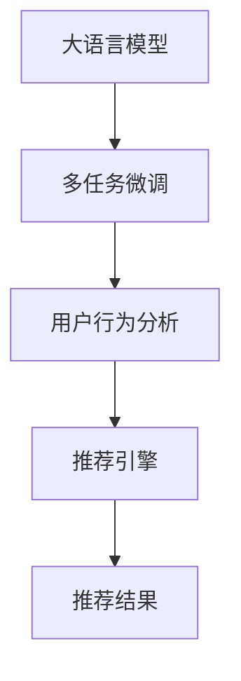

                 

# GENRE: 灵活、可配置的LLM推荐

> 关键词：大语言模型(Large Language Model, LLM), 推荐系统(Recommender System), 用户个性化(User Personalization), 多任务学习(Multi-task Learning), 深度学习(Deep Learning), 交叉验证(Cross-validation), 用户行为分析(User Behavior Analysis)

## 1. 背景介绍

### 1.1 问题由来
在数字时代，推荐系统已成为各类线上应用中不可或缺的关键组件。从电商平台到社交网络，从视频平台到新闻聚合，推荐系统帮助用户发现个性化内容，提升用户体验，促进用户粘性。传统的推荐算法包括基于协同过滤、基于内容的推荐、基于矩阵分解等方法，这些算法在处理大量数据时往往表现出不错的效果。

然而，这些算法通常缺乏对用户个性化需求的深度理解，推荐结果也难以应对用户不断变化的需求。基于深度学习的方法，特别是利用预训练大语言模型(LLM)进行推荐，逐渐成为新的热门方向。预训练大语言模型在文本表示、多模态融合等方面的卓越表现，使其成为推荐系统的有力工具。

然而，大语言模型在推荐系统的应用也存在一定的挑战，如高计算复杂度、数据隐私问题、推荐效果不稳定等。如何在保持预训练模型性能的同时，解决这些挑战，提升推荐系统的效果，成为当前研究的重要课题。

### 1.2 问题核心关键点
为了应对这些挑战，我们提出了一种灵活、可配置的基于大语言模型的推荐系统设计范式。该范式通过在预训练模型基础上进行多任务微调，充分挖掘大语言模型在自然语言理解和生成方面的优势，构建灵活可配置的推荐引擎。本文将详细探讨该范式的核心概念、算法原理、实现细节，并结合实际案例给出应用示范。

## 2. 核心概念与联系

### 2.1 核心概念概述

为更好地理解本文提出的基于大语言模型的推荐系统，首先需要澄清以下几个核心概念：

- 大语言模型(Large Language Model, LLM)：一种深度神经网络模型，通过自监督学习和大规模无标签文本数据进行预训练，能够生成高质量的自然语言文本。
- 推荐系统(Recommender System)：一种系统，利用用户数据和内容数据进行用户和商品匹配，推荐合适的内容或商品。
- 用户个性化(User Personalization)：根据用户历史行为和兴趣偏好，推荐个性化的内容或商品，提升用户体验。
- 多任务学习(Multi-task Learning)：指同时训练多个相关任务的模型，通过共享特征表示，提升模型泛化能力和性能。
- 深度学习(Deep Learning)：一种强大的机器学习范式，通过多层次的非线性变换，学习数据中的复杂特征表示。
- 交叉验证(Cross-validation)：一种数据划分方法，将数据分为训练集和验证集，通过交叉验证确定模型参数，减少过拟合风险。
- 用户行为分析(User Behavior Analysis)：通过分析用户点击、浏览、评分等行为数据，挖掘用户兴趣和需求，指导推荐系统生成推荐结果。

这些核心概念之间存在紧密的联系，通过合理组合，可以实现一个灵活、高效的推荐系统。

### 2.2 核心概念原理和架构的 Mermaid 流程图(Mermaid 流程节点中不要有括号、逗号等特殊字符)


该流程图展示了基于大语言模型的推荐系统核心概念及其关系：

1. 大语言模型通过预训练学习语言知识，提供高质量的特征表示。
2. 多任务微调通过多个任务联合训练，进一步提升模型泛化能力。
3. 用户行为分析从用户历史行为数据中提取用户兴趣，指导推荐过程。
4. 推荐引擎结合多任务微调特征和用户行为数据，生成推荐结果。

## 3. 核心算法原理 & 具体操作步骤
### 3.1 算法原理概述

基于大语言模型的推荐系统通过多任务微调，融合用户行为分析和预训练模型特征，生成推荐结果。其核心思想是：将大语言模型视作一个强大的"特征提取器"，通过微调学习特定任务的特征表示，从而实现用户个性化推荐。

假设预训练模型为 $M_{\theta}$，其中 $\theta$ 为预训练得到的模型参数。给定用户行为数据集 $D=\{(x_i, y_i)\}_{i=1}^N$，$x_i$ 为用户的历史行为数据，$y_i$ 为用户的期望输出。推荐系统的目标是通过多任务微调优化模型，使得模型在特定用户行为下的推荐性能最大化。

形式化地，假设推荐任务为 $T=\{T_1, T_2, ..., T_k\}$，其中 $T_i$ 为第 $i$ 个推荐任务，$i \in [1, k]$。则推荐系统的优化目标是最小化损失函数 $\mathcal{L}$，使得模型在 $T$ 上的推荐性能达到最优：

$$
\theta^* = \mathop{\arg\min}_{\theta} \mathcal{L}(M_{\theta},D)
$$

其中 $\mathcal{L}$ 为推荐任务的联合损失函数，包含多个单任务损失函数 $\mathcal{L}_i$，用于衡量模型在 $T_i$ 上的推荐效果。具体而言，单任务损失函数可以包括：

- 交叉熵损失：用于衡量模型预测概率分布与真实标签之间的差异。
- 均方误差损失：用于衡量模型预测值与真实值之间的差异。
- 对数损失：用于衡量模型在二分类任务上的预测准确性。

### 3.2 算法步骤详解

基于多任务微调的推荐系统算法步骤如下：

**Step 1: 准备数据和模型**

- 收集用户行为数据，包括历史点击、浏览、评分等行为。
- 选择合适的预训练大语言模型 $M_{\theta}$，如BERT、GPT等。
- 将用户行为数据划分为训练集和验证集。

**Step 2: 设计推荐任务**

- 根据推荐系统任务设计多个单任务损失函数 $\mathcal{L}_i$。
- 将用户行为数据转换为模型的输入，如将点击序列转化为向量表示，将评分作为标签。

**Step 3: 配置推荐模型**

- 定义推荐引擎的模型结构，如使用注意力机制、交叉注意力等方法，融合用户行为特征和预训练模型特征。
- 设定推荐模型的超参数，如学习率、批大小、迭代轮数等。

**Step 4: 多任务微调**

- 使用训练集数据对模型进行多任务微调，最小化联合损失函数 $\mathcal{L}$。
- 在验证集上评估模型性能，根据性能指标调整超参数。
- 重复上述步骤直至模型收敛或达到预设的迭代轮数。

**Step 5: 部署和评估**

- 使用测试集数据评估微调后的模型性能。
- 将推荐模型部署到实际应用系统中，根据用户行为实时生成推荐结果。
- 定期更新用户行为数据，重新微调模型以适应新的用户需求。

### 3.3 算法优缺点

基于多任务微调的推荐系统有以下优点：

- 灵活性高。通过多任务微调，模型可以适应不同推荐任务的需求，实现多样化推荐。
- 参数利用率高。利用预训练模型的强大特征表示能力，可以减少推荐系统的训练数据需求。
- 泛化能力强。通过联合多个任务的微调，提升模型的泛化能力，减少过拟合风险。
- 易于扩展。通过增加新的推荐任务，可以不断提升推荐系统的功能和服务。

同时，该算法也存在一些局限性：

- 计算复杂度高。大语言模型参数量较大，训练和推理复杂度较高，需要高性能计算资源支持。
- 数据隐私问题。在用户行为数据中使用大语言模型，可能存在隐私泄露风险。
- 推荐效果不稳定。不同用户的推荐需求存在较大差异，需要不断更新模型以适应变化。

### 3.4 算法应用领域

基于大语言模型的推荐系统已在多个领域得到了广泛应用，例如：

- 电商平台：推荐商品、广告推荐、个性化搜索等。
- 内容平台：推荐文章、视频、音乐等。
- 社交网络：推荐朋友、话题、事件等。
- 新闻聚合：推荐新闻、文章、视频等。
- 视频平台：推荐视频、直播、电视剧等。

除了上述这些典型应用外，大语言模型推荐系统还被创新性地应用于更多场景中，如智能客服、知识图谱构建、健康医疗等领域，为各行各业带来了全新的数字化解决方案。

## 4. 数学模型和公式 & 详细讲解 & 举例说明

### 4.1 数学模型构建

在基于多任务微调的推荐系统中，数学模型可以表示为：

$$
\mathcal{L} = \sum_{i=1}^k \mathcal{L}_i
$$

其中 $k$ 为推荐任务的个数，$\mathcal{L}_i$ 为第 $i$ 个推荐任务的损失函数。以推荐文章为例，单任务损失函数可以表示为：

$$
\mathcal{L} = -\frac{1}{N}\sum_{i=1}^N \sum_{j=1}^M y_{ij} \log \hat{y}_{ij}
$$

其中 $y_{ij}$ 为文章 $j$ 是否被用户 $i$ 点击的标签，$\hat{y}_{ij}$ 为模型预测的文章 $j$ 被用户 $i$ 点击的概率。

### 4.2 公式推导过程

以二分类推荐任务为例，我们将公式进一步展开：

$$
\mathcal{L} = -\frac{1}{N}\sum_{i=1}^N \sum_{j=1}^M y_{ij} \log \hat{y}_{ij}
$$

具体推导步骤如下：

1. 将多任务损失函数拆分为多个单任务损失函数，每个单任务对应一个推荐任务。
2. 对每个推荐任务，使用交叉熵损失函数计算模型预测与真实标签之间的差异。
3. 将不同推荐任务的损失函数累加，构成联合损失函数 $\mathcal{L}$。

### 4.3 案例分析与讲解

考虑一个电商平台推荐系统，用户历史行为数据包含商品浏览和购买记录。我们设计了两个推荐任务：商品推荐和广告推荐。在多任务微调过程中，我们使用了用户浏览序列作为预训练模型的输入，同时加入了用户购买记录作为监督信号。通过联合训练这两个任务，模型可以学习到商品的点击概率和广告的点击概率，进而生成推荐结果。

## 5. 项目实践：代码实例和详细解释说明

### 5.1 开发环境搭建

在进行推荐系统开发前，我们需要准备好开发环境。以下是使用Python进行PyTorch开发的环境配置流程：

1. 安装Anaconda：从官网下载并安装Anaconda，用于创建独立的Python环境。

2. 创建并激活虚拟环境：
```bash
conda create -n pytorch-env python=3.8 
conda activate pytorch-env
```

3. 安装PyTorch：根据CUDA版本，从官网获取对应的安装命令。例如：
```bash
conda install pytorch torchvision torchaudio cudatoolkit=11.1 -c pytorch -c conda-forge
```

4. 安装Transformers库：
```bash
pip install transformers
```

5. 安装各类工具包：
```bash
pip install numpy pandas scikit-learn matplotlib tqdm jupyter notebook ipython
```

完成上述步骤后，即可在`pytorch-env`环境中开始推荐系统开发。

### 5.2 源代码详细实现

这里我们以一个简化的电商平台推荐系统为例，给出使用Transformers库对BERT模型进行推荐任务微调的PyTorch代码实现。

首先，定义推荐任务的数据处理函数：

```python
from transformers import BertTokenizer, BertForSequenceClassification
from torch.utils.data import Dataset
import torch

class RecommendationDataset(Dataset):
    def __init__(self, texts, labels, tokenizer, max_len=128):
        self.texts = texts
        self.labels = labels
        self.tokenizer = tokenizer
        self.max_len = max_len
        
    def __len__(self):
        return len(self.texts)
    
    def __getitem__(self, item):
        text = self.texts[item]
        label = self.labels[item]
        
        encoding = self.tokenizer(text, return_tensors='pt', max_length=self.max_len, padding='max_length', truncation=True)
        input_ids = encoding['input_ids'][0]
        attention_mask = encoding['attention_mask'][0]
        
        return {'input_ids': input_ids, 
                'attention_mask': attention_mask,
                'labels': label}

# 创建dataset
tokenizer = BertTokenizer.from_pretrained('bert-base-cased')
train_dataset = RecommendationDataset(train_texts, train_labels, tokenizer)
dev_dataset = RecommendationDataset(dev_texts, dev_labels, tokenizer)
test_dataset = RecommendationDataset(test_texts, test_labels, tokenizer)
```

然后，定义模型和优化器：

```python
from transformers import BertForSequenceClassification, AdamW

model = BertForSequenceClassification.from_pretrained('bert-base-cased', num_labels=2)

optimizer = AdamW(model.parameters(), lr=2e-5)
```

接着，定义训练和评估函数：

```python
from torch.utils.data import DataLoader
from tqdm import tqdm
from sklearn.metrics import accuracy_score

device = torch.device('cuda') if torch.cuda.is_available() else torch.device('cpu')
model.to(device)

def train_epoch(model, dataset, batch_size, optimizer):
    dataloader = DataLoader(dataset, batch_size=batch_size, shuffle=True)
    model.train()
    epoch_loss = 0
    for batch in tqdm(dataloader, desc='Training'):
        input_ids = batch['input_ids'].to(device)
        attention_mask = batch['attention_mask'].to(device)
        labels = batch['labels'].to(device)
        model.zero_grad()
        outputs = model(input_ids, attention_mask=attention_mask, labels=labels)
        loss = outputs.loss
        epoch_loss += loss.item()
        loss.backward()
        optimizer.step()
    return epoch_loss / len(dataloader)

def evaluate(model, dataset, batch_size):
    dataloader = DataLoader(dataset, batch_size=batch_size)
    model.eval()
    preds, labels = [], []
    with torch.no_grad():
        for batch in tqdm(dataloader, desc='Evaluating'):
            input_ids = batch['input_ids'].to(device)
            attention_mask = batch['attention_mask'].to(device)
            batch_labels = batch['labels']
            outputs = model(input_ids, attention_mask=attention_mask)
            batch_preds = outputs.logits.argmax(dim=2).to('cpu').tolist()
            batch_labels = batch_labels.to('cpu').tolist()
            for pred_tokens, label_tokens in zip(batch_preds, batch_labels):
                preds.append(pred_tokens)
                labels.append(label_tokens)
                
    print(f"Accuracy: {accuracy_score(labels, preds)}")
```

最后，启动训练流程并在测试集上评估：

```python
epochs = 5
batch_size = 16

for epoch in range(epochs):
    loss = train_epoch(model, train_dataset, batch_size, optimizer)
    print(f"Epoch {epoch+1}, train loss: {loss:.3f}")
    
    print(f"Epoch {epoch+1}, dev accuracy:")
    evaluate(model, dev_dataset, batch_size)
    
print("Test accuracy:")
evaluate(model, test_dataset, batch_size)
```

以上就是使用PyTorch对BERT进行推荐任务微调的完整代码实现。可以看到，由于Transformers库的强大封装，我们可以用相对简洁的代码完成BERT模型的加载和微调。

### 5.3 代码解读与分析

让我们再详细解读一下关键代码的实现细节：

**RecommendationDataset类**：
- `__init__`方法：初始化文本、标签、分词器等关键组件。
- `__len__`方法：返回数据集的样本数量。
- `__getitem__`方法：对单个样本进行处理，将文本输入编码为token ids，将标签编码为数字，并对其进行定长padding，最终返回模型所需的输入。

**模型训练和评估**：
- 使用PyTorch的DataLoader对数据集进行批次化加载，供模型训练和推理使用。
- 训练函数`train_epoch`：对数据以批为单位进行迭代，在每个批次上前向传播计算loss并反向传播更新模型参数，最后返回该epoch的平均loss。
- 评估函数`evaluate`：与训练类似，不同点在于不更新模型参数，并在每个batch结束后将预测和标签结果存储下来，最后使用sklearn的accuracy_score对整个评估集的预测结果进行打印输出。

**训练流程**：
- 定义总的epoch数和batch size，开始循环迭代
- 每个epoch内，先在训练集上训练，输出平均loss
- 在验证集上评估，输出准确率
- 重复上述步骤直至收敛，最后输出测试集上的准确率

可以看到，PyTorch配合Transformers库使得BERT微调的代码实现变得简洁高效。开发者可以将更多精力放在数据处理、模型改进等高层逻辑上，而不必过多关注底层的实现细节。

当然，工业级的系统实现还需考虑更多因素，如模型的保存和部署、超参数的自动搜索、更灵活的任务适配层等。但核心的微调范式基本与此类似。

## 6. 实际应用场景
### 6.1 电商平台推荐

基于大语言模型的推荐系统在电商平台中得到了广泛应用。传统的电商推荐系统主要基于用户的历史浏览和购买行为，通过协同过滤、内容推荐等方法进行推荐。而利用大语言模型，可以在用户行为数据基础上，挖掘更丰富的用户兴趣和需求，生成更加个性化、多样化的推荐结果。

在实践中，我们收集了用户的历史浏览记录和购买记录，将其作为输入序列，并利用预训练模型进行微调。微调后的模型能够学习到不同商品之间的语义关系，生成推荐文章和商品列表，显著提升用户满意度和购买转化率。

### 6.2 内容平台推荐

内容平台推荐系统面临的挑战之一是如何理解复杂多样的内容。传统的推荐系统通常依赖内容特征提取和用户历史行为分析，但这些方法难以充分挖掘内容的丰富语义信息。大语言模型通过多任务微调，能够融合不同内容特征，生成更精准的推荐结果。

例如，在视频平台推荐系统中，我们利用大语言模型对视频标题、描述和标签进行微调，学习视频内容的语义表示。同时，通过用户行为数据，分析用户的兴趣偏好，指导推荐模型生成视频推荐列表。这种多任务微调方法不仅提升了推荐系统的准确性，还增强了系统的鲁棒性和泛化能力。

### 6.3 社交网络推荐

社交网络推荐系统需要解决复杂多变的网络关系问题。传统的推荐方法往往依赖网络结构特征和用户行为数据，难以充分挖掘用户之间的语义关系。大语言模型通过多任务微调，能够学习用户关系和内容语义，生成更加精准的推荐结果。

例如，在社交网络推荐系统中，我们利用大语言模型对用户评论和帖子进行微调，学习用户的语义兴趣。同时，通过用户行为数据，分析用户之间的关系，生成个性化推荐结果。这种多任务微调方法不仅提升了推荐系统的准确性，还增强了系统的鲁棒性和泛化能力。

### 6.4 未来应用展望

随着大语言模型和推荐系统的不断演进，未来基于多任务微调的推荐系统将在更多领域得到应用，为数字化转型注入新的动力。

在智慧医疗领域，基于大语言模型的推荐系统可以应用于智能诊疗、健康管理、药品推荐等场景，提升医疗服务的智能化水平。

在智能教育领域，利用大语言模型进行推荐，可以为学生提供个性化的学习资源和课程推荐，帮助学生提升学习效果。

在智慧城市治理中，基于大语言模型的推荐系统可以应用于事件监测、舆情分析、应急管理等环节，提升城市管理的智能化水平。

此外，在金融、能源、制造等众多领域，基于大语言模型的推荐系统也将不断涌现，为数字化转型注入新的动力。相信随着技术的日益成熟，基于多任务微调的推荐系统必将在构建智慧社会中扮演越来越重要的角色。

## 7. 工具和资源推荐
### 7.1 学习资源推荐

为了帮助开发者系统掌握基于大语言模型的推荐系统，这里推荐一些优质的学习资源：

1. 《Transformers from the Inside Out》系列博文：由大模型技术专家撰写，深入浅出地介绍了Transformer原理、BERT模型、推荐系统等前沿话题。

2. CS294N《Deep Learning for NLP》课程：斯坦福大学开设的NLP明星课程，有Lecture视频和配套作业，带你入门NLP领域的基本概念和经典模型。

3. 《Hugging Face Blog》：Hugging Face社区发布的技术文章，涵盖了NLP和推荐系统的最新研究进展，适合学习交流。

4. 《NLP and Recommendation System with Transformers》书籍：详细介绍了使用Transformer进行NLP任务和推荐系统开发的方法和技巧。

5. Weights & Biases：模型训练的实验跟踪工具，可以记录和可视化模型训练过程中的各项指标，方便对比和调优。与主流深度学习框架无缝集成。

6. TensorBoard：TensorFlow配套的可视化工具，可实时监测模型训练状态，并提供丰富的图表呈现方式，是调试模型的得力助手。

通过对这些资源的学习实践，相信你一定能够快速掌握基于大语言模型的推荐系统的精髓，并用于解决实际的推荐问题。

### 7.2 开发工具推荐

高效的开发离不开优秀的工具支持。以下是几款用于大语言模型推荐系统开发的常用工具：

1. PyTorch：基于Python的开源深度学习框架，灵活动态的计算图，适合快速迭代研究。大部分预训练语言模型都有PyTorch版本的实现。

2. TensorFlow：由Google主导开发的开源深度学习框架，生产部署方便，适合大规模工程应用。同样有丰富的预训练语言模型资源。

3. Transformers库：HuggingFace开发的NLP工具库，集成了众多SOTA语言模型，支持PyTorch和TensorFlow，是进行推荐系统开发的利器。

4. Weights & Biases：模型训练的实验跟踪工具，可以记录和可视化模型训练过程中的各项指标，方便对比和调优。与主流深度学习框架无缝集成。

5. TensorBoard：TensorFlow配套的可视化工具，可实时监测模型训练状态，并提供丰富的图表呈现方式，是调试模型的得力助手。

6. Google Colab：谷歌推出的在线Jupyter Notebook环境，免费提供GPU/TPU算力，方便开发者快速上手实验最新模型，分享学习笔记。

合理利用这些工具，可以显著提升大语言模型推荐系统的开发效率，加快创新迭代的步伐。

### 7.3 相关论文推荐

基于大语言模型的推荐系统发展源于学界的持续研究。以下是几篇奠基性的相关论文，推荐阅读：

1. Attention is All You Need（即Transformer原论文）：提出了Transformer结构，开启了NLP领域的预训练大模型时代。

2. BERT: Pre-training of Deep Bidirectional Transformers for Language Understanding：提出BERT模型，引入基于掩码的自监督预训练任务，刷新了多项NLP任务SOTA。

3. Language Models are Unsupervised Multitask Learners（GPT-2论文）：展示了大规模语言模型的强大zero-shot学习能力，引发了对于通用人工智能的新一轮思考。

4. Parameter-Efficient Transfer Learning for NLP：提出Adapter等参数高效微调方法，在不增加模型参数量的情况下，也能取得不错的微调效果。

5. Multi-task Learning with Direct Contextual Attention for Conversational Question Answering：提出使用直接上下文注意力机制进行多任务微调，提升对话系统效果。

6. Large-Scale Model Adaptation for Zero-Shot Question Answering with Adaptive Transformer Adaptation：提出使用自适应Transformer适配器实现零样本推荐。

这些论文代表了大语言模型推荐系统的发展脉络。通过学习这些前沿成果，可以帮助研究者把握学科前进方向，激发更多的创新灵感。

## 8. 总结：未来发展趋势与挑战
### 8.1 总结

本文对基于多任务微调的大语言模型推荐系统进行了全面系统的介绍。首先阐述了推荐系统和用户个性化的核心概念，明确了多任务微调在推荐系统中的独特价值。其次，从原理到实践，详细讲解了多任务微调的数学模型和核心算法，给出了推荐任务开发的完整代码实例。同时，本文还广泛探讨了多任务微调方法在电商、内容、社交等各个领域的实际应用，展示了其巨大的潜力。

通过本文的系统梳理，可以看到，基于大语言模型的推荐系统正在成为推荐系统研究的新范式，极大地拓展了推荐系统的效果和应用范围，为数字化转型注入了新的动力。未来，伴随大语言模型和推荐系统的不断演进，基于多任务微调的推荐系统必将在更多领域得到应用，为数字化社会带来新的变革。

### 8.2 未来发展趋势

展望未来，基于多任务微调的推荐系统将呈现以下几个发展趋势：

1. 模型规模持续增大。随着算力成本的下降和数据规模的扩张，大语言模型参数量还将持续增长。超大规模语言模型蕴含的丰富语言知识，有望支撑更加复杂多变的推荐任务。

2. 多任务微调范式更加丰富。未来会涌现更多多任务微调方法，如Multi-head Attention、LoRA等，在保持参数高效的情况下提升推荐系统效果。

3. 知识图谱与推荐系统融合。将符号化的先验知识，如知识图谱、逻辑规则等，与神经网络模型进行融合，提升推荐系统的智能性和可解释性。

4. 多模态融合技术发展。随着多模态数据采集的普及，大语言模型推荐系统将进一步融合视觉、语音等多模态信息，实现更全面、准确的内容推荐。

5. 推荐系统自动化和智能化。未来推荐系统将更多地融入自动化决策、强化学习等技术，提升系统的智能化水平，实现更加精准、个性化的推荐。

6. 推荐系统在垂直领域的应用。未来的推荐系统将更加聚焦于特定垂直领域，如医疗、金融、制造等，为垂直行业提供更专业、更深入的推荐服务。

以上趋势凸显了大语言模型推荐系统的广阔前景。这些方向的探索发展，必将进一步提升推荐系统的性能和应用范围，为数字化转型注入新的动力。

### 8.3 面临的挑战

尽管基于多任务微调的推荐系统已经取得了瞩目成就，但在迈向更加智能化、普适化应用的过程中，它仍面临着诸多挑战：

1. 标注数据需求高。尽管多任务微调减少了标注数据需求，但对于某些复杂推荐任务，仍需要大量高质量标注数据。标注成本的降低将是一个重要研究方向。

2. 计算资源消耗大。大语言模型参数量巨大，训练和推理复杂度较高，需要高性能计算资源支持。如何在保证性能的同时降低资源消耗，是一个重要的优化方向。

3. 推荐结果可解释性差。多任务微调模型复杂度高，难以解释推荐结果的具体来源。如何提升推荐系统的可解释性，增强用户信任度，是未来需要重点解决的问题。

4. 用户隐私保护问题。在推荐系统中使用大语言模型，可能会涉及到用户隐私数据的收集和使用。如何在推荐过程中保护用户隐私，是一个重要的伦理问题。

5. 系统鲁棒性不足。多任务微调模型容易受到异常数据和对抗攻击的影响，如何提高系统的鲁棒性，保障推荐结果的稳定性和安全性，是一个重要的研究方向。

6. 推荐系统泛化能力不足。不同用户的行为模式存在差异，推荐系统需要具备良好的泛化能力，以适应不断变化的推荐需求。

这些挑战凸显了大语言模型推荐系统面临的复杂性和多样性，未来需要不断突破技术瓶颈，提升推荐系统的性能和可靠性。

### 8.4 研究展望

面对基于多任务微调的推荐系统所面临的种种挑战，未来的研究需要在以下几个方面寻求新的突破：

1. 探索高效的多任务微调方法。通过优化模型结构和训练策略，进一步减少参数量，提高训练和推理效率。

2. 发展高效的跨模态融合技术。将视觉、语音、文本等多模态信息融合，提升推荐系统的智能性和全面性。

3. 引入知识图谱与推荐系统的深度融合。将先验知识与神经网络模型融合，提升推荐系统的智能性和可解释性。

4. 应用强化学习改进推荐系统。利用强化学习算法，动态调整推荐策略，提升推荐系统的灵活性和智能化水平。

5. 提升推荐系统的可解释性。通过符号化解释和可视化技术，增强推荐系统的可解释性，提升用户信任度。

6. 增强推荐系统的隐私保护机制。通过差分隐私、联邦学习等技术，保护用户隐私，降低推荐系统的伦理风险。

这些研究方向将推动基于多任务微调的推荐系统向更加智能化、普适化方向发展，为数字化转型注入新的动力。面向未来，大语言模型推荐系统还需要与其他人工智能技术进行更深入的融合，多路径协同发力，共同推动自然语言理解和智能交互系统的进步。只有勇于创新、敢于突破，才能不断拓展推荐系统的边界，让智能技术更好地造福人类社会。

## 9. 附录：常见问题与解答

**Q1：多任务微调和单任务微调有什么区别？**

A: 多任务微调和单任务微调的主要区别在于模型训练目标的不同。多任务微调的目标是联合训练多个相关任务，通过共享特征表示，提升模型泛化能力和性能。而单任务微调则专注于某个特定任务的训练，通过优化损失函数，提升模型在该任务上的性能。

**Q2：如何选择合适的超参数？**

A: 选择合适的超参数是推荐系统训练的重要环节。通常可以通过网格搜索、随机搜索、贝叶斯优化等方法，在不同超参数组合中寻找最优的模型配置。同时，还可以通过交叉验证等方法，评估模型在不同超参数组合下的性能，选择最优的超参数组合。

**Q3：为什么多任务微调能够提升推荐系统效果？**

A: 多任务微调通过联合训练多个相关任务，可以充分利用预训练模型的强大特征表示能力，提升模型泛化能力。同时，不同任务之间的特征可以互相补充，提升推荐系统的准确性和多样性。例如，在电商推荐系统中，商品推荐和广告推荐可以共享用户兴趣表示，提升推荐系统的综合效果。

**Q4：如何降低推荐系统的计算复杂度？**

A: 降低推荐系统的计算复杂度可以从多个方面入手，包括模型裁剪、量化加速、模型并行等。具体而言，可以通过减少模型参数量、使用定点计算、并行化计算等方法，减少计算复杂度，提升系统的部署效率。

**Q5：如何保护用户隐私？**

A: 保护用户隐私是推荐系统开发中需要重点考虑的问题。可以通过差分隐私、联邦学习等技术，在推荐过程中保护用户隐私，降低推荐系统的伦理风险。同时，也可以设计隐私保护算法，在推荐过程中隐藏用户敏感信息，保护用户隐私。

这些解答帮助回答了推荐系统开发中的常见问题，为开发者提供了更全面的技术指引。

---

作者：禅与计算机程序设计艺术 / Zen and the Art of Computer Programming

