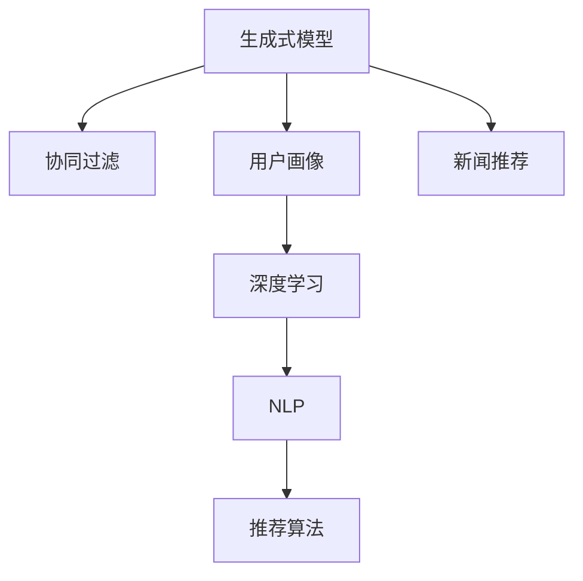

                 

# GENRE:基于大模型的生成式新闻推荐框架

> 关键词：生成式模型,新闻推荐,用户画像,协同过滤,深度学习,自然语言处理(NLP)

## 1. 背景介绍

### 1.1 问题由来

在信息爆炸的时代，如何为亿万用户提供有价值、个性化的新闻推荐，已成为新闻媒体和内容分发平台面临的一大挑战。传统的基于规则或人工编辑的新闻推荐方法，难以应对海量数据带来的复杂性和多样性。而基于大规模预训练语言模型和深度学习的推荐系统，能够自动理解用户的兴趣和新闻的特征，提供个性化推荐，从而大幅提升用户的满意度。

近年来，预训练语言模型如BERT、GPT等在大规模文本数据上的表现，已经证明其在自然语言处理(NLP)领域的强大能力。将预训练语言模型应用于新闻推荐，可以大幅提升推荐的精度和多样性，为用户提供更优质的阅读体验。但直接将大模型应用于新闻推荐，由于模型规模庞大，计算资源消耗巨大，效率较低，难以实现实时推荐。

因此，本文提出一种基于大模型的生成式新闻推荐框架GENRE，通过微调预训练语言模型，结合生成式模型和协同过滤算法，实现高效、个性化的新闻推荐。

## 2. 核心概念与联系

### 2.1 核心概念概述

为更好地理解生成式新闻推荐框架，本节将介绍几个密切相关的核心概念：

- 生成式模型（Generative Models）：指通过随机采样生成文本、音频、图像等内容的模型，如基于Transformer的语言模型、GANs生成模型等。通过学习大量的文本数据，生成模型能够生成符合语法和语义规则的文本，实现自动文本生成。
- 协同过滤（Collaborative Filtering, CF）：指基于用户对物品的评分或行为历史，预测用户对未评分物品的评分或行为的一种推荐方法。包括基于用户的CF和基于物品的CF两种方式。
- 用户画像（User Profile）：指描述用户兴趣、偏好、行为等特征的信息集合，用于个性化推荐。通常由用户的评分历史、搜索记录、浏览记录等数据组成。
- 深度学习（Deep Learning）：指通过多层神经网络结构，对数据进行深层学习和特征提取，从而实现更高效、精确的预测和学习。深度学习在生成式模型和协同过滤等推荐算法中均有广泛应用。
- 自然语言处理（Natural Language Processing, NLP）：指通过机器学习和深度学习技术，让计算机理解、处理和生成自然语言的技术。

这些核心概念之间的逻辑关系可以通过以下Mermaid流程图来展示：



这个流程图展示了大模型微调的主要流程和组件：

1. 生成式模型通过学习大量新闻数据，能够自动生成新闻内容。
2. 协同过滤算法通过分析用户的历史行为，预测用户对新闻的兴趣。
3. 用户画像描述了用户的特征，用于协同过滤算法的训练和优化。
4. 深度学习提供了强大的特征提取和模型训练能力，使得推荐系统能够更好地理解数据。
5. NLP技术帮助系统处理和理解自然语言，提升推荐的精度和多样性。
6. 推荐算法综合生成式模型和协同过滤的结果，生成最终推荐结果。

这些概念共同构成了生成式新闻推荐框架的核心理论基础。

## 3. 核心算法原理 & 具体操作步骤
### 3.1 算法原理概述

生成式新闻推荐框架GENRE的核心思想是：利用大语言模型预训练的知识，结合生成式模型和协同过滤算法，生成个性化新闻内容，推荐给用户。

算法流程主要包括：
1. 对大规模预训练语言模型进行微调，适应新闻领域的特点。
2. 根据用户画像，使用协同过滤算法预测用户对新闻的兴趣。
3. 将预测结果与生成式模型生成的候选新闻内容进行结合，生成个性化推荐结果。
4. 实时更新用户画像，不断优化推荐系统。

### 3.2 算法步骤详解

以下我们将详细介绍生成式新闻推荐框架GENRE的各个关键步骤：

**Step 1: 准备数据集和预训练模型**

- 收集大规模新闻数据集，分为训练集和测试集。
- 选择合适的预训练语言模型，如GPT、BERT等，将其视作初始化参数。

**Step 2: 微调预训练模型**

- 在新闻领域的数据集上进行微调，调整模型的参数，使其能够更好地适应新闻领域的特点。
- 使用自回归任务（如预测下一个词）进行微调，提升模型生成新闻的能力。

**Step 3: 构建用户画像**

- 收集用户的搜索历史、浏览记录、评分数据等，构建用户画像。
- 对用户画像进行归一化、标准化等预处理，提取用户的关键特征。

**Step 4: 协同过滤推荐**

- 根据用户画像和新闻特征，使用协同过滤算法预测用户对新闻的评分。
- 使用基于用户的CF和基于物品的CF两种方式，对预测结果进行加权平均，得到综合评分。

**Step 5: 生成个性化新闻**

- 根据预测评分和协同过滤结果，选择用户可能感兴趣的新闻。
- 使用微调后的生成式模型，生成候选新闻内容的摘要或标题。
- 结合预测评分和生成的新闻摘要，综合排序，生成个性化推荐结果。

**Step 6: 实时更新用户画像**

- 根据用户对推荐结果的反馈，实时更新用户画像。
- 使用在线学习技术，不断优化协同过滤算法，提升推荐精度。

### 3.3 算法优缺点

基于生成式模型的新闻推荐框架GENRE，具有以下优点：
1. 生成式模型能够自动生成新闻摘要，无需手动编写规则，提升了推荐的精度和多样性。
2. 协同过滤算法结合用户画像，能够更好地捕捉用户兴趣，提供个性化的推荐。
3. 深度学习和NLP技术提供了强大的特征提取和理解能力，提升推荐的准确性。
4. 框架整体较为灵活，可以根据不同的业务需求进行灵活配置和优化。

但该方法也存在一些局限性：
1. 生成式模型需要大量的训练数据，才能生成高质量的新闻摘要。
2. 协同过滤算法依赖于用户的历史数据，对于新用户或数据稀疏用户，推荐效果可能不佳。
3. 实时更新用户画像需要高并发的数据处理能力，对系统的架构和性能要求较高。
4. 推荐结果的生成和排序过程较为复杂，需要考虑生成模型和协同过滤算法的结合方式。

尽管存在这些局限性，但总体而言，基于生成式模型的新闻推荐框架GENRE在实现高效、个性化的新闻推荐方面，具有显著优势。

### 3.4 算法应用领域

基于生成式模型的新闻推荐框架GENRE，已经在多个领域得到了应用：

- 新闻媒体平台：如腾讯新闻、今日头条等，通过生成式推荐提升用户粘性和阅读时长。
- 内容分发平台：如Netflix、Amazon等，通过推荐个性化的新闻内容，增加用户留存率。
- 广告投放系统：通过推荐个性化新闻，提升广告点击率和转化率。
- 教育学习平台：通过推荐相关的教育新闻，增加用户的学习兴趣和互动。

## 4. 数学模型和公式 & 详细讲解 & 举例说明
### 4.1 数学模型构建

本节将使用数学语言对生成式新闻推荐框架GENRE的各个组件进行更详细的数学建模。

假设新闻数据集为 $D=\{(x_i,y_i)\}_{i=1}^N$，其中 $x_i$ 为新闻文本，$y_i$ 为新闻类别标签。用户画像为 $U=\{(u_j,p_j)\}_{j=1}^M$，其中 $u_j$ 为第 $j$ 个用户的特征向量，$p_j$ 为用户对新闻的评分。微调后的生成式模型为 $M_{\theta}$，其中 $\theta$ 为微调后的模型参数。协同过滤算法为 $CF_{\alpha,\beta}$，其中 $\alpha$ 为基于用户的CF系数，$\beta$ 为基于物品的CF系数。

生成式新闻推荐框架的目标是最小化预测评分与用户实际评分之间的差异，即：

$$
\min_{\theta,\alpha,\beta} \mathcal{L}(\theta,\alpha,\beta) = \frac{1}{N} \sum_{i=1}^N \mathcal{L}_{CF}(CF_{\alpha,\beta}(x_i,M_{\theta}),y_i) + \frac{1}{M} \sum_{j=1}^M \mathcal{L}_{GAN}(CF_{\alpha,\beta}(y_j,M_{\theta}),p_j)
$$

其中 $\mathcal{L}_{CF}$ 为协同过滤损失函数，$\mathcal{L}_{GAN}$ 为生成式模型损失函数。

### 4.2 公式推导过程

以下我们以新闻推荐为例，推导协同过滤和生成式模型的损失函数公式。

假设用户对新闻的评分可以表示为新闻的向量表示和用户画像的向量表示的内积，即：

$$
y_i = u_j^T \cdot M_{\theta}(x_i)
$$

其中 $u_j$ 为用户画像，$M_{\theta}(x_i)$ 为新闻的向量表示。

协同过滤算法 $CF_{\alpha,\beta}$ 可以表示为：

$$
CF_{\alpha,\beta}(x_i,M_{\theta}) = \alpha u_j^T \cdot M_{\theta}(x_i) + \beta \sum_{i'} \frac{y_{i'}}{\sum_{i''} y_{i''}} y_i \cdot M_{\theta}(x_{i'})
$$

其中 $\alpha$ 为基于用户的CF系数，$\beta$ 为基于物品的CF系数，$y_{i'}$ 为新闻 $x_{i'}$ 的用户评分，$y_{i''}$ 为新闻 $x_{i''}$ 的用户评分。

生成式模型 $M_{\theta}$ 可以表示为自回归模型，生成新闻摘要：

$$
\hat{y}_i = M_{\theta}(x_i) = softmax(W_{2} [\text{conv}(x_i) + W_{1} M_{\theta}(x_i)]
$$

其中 $\hat{y}_i$ 为新闻摘要，$W_1$ 和 $W_2$ 为可训练的权重矩阵，$\text{conv}$ 为卷积层。

综合考虑协同过滤和生成式模型的损失函数，生成式新闻推荐框架的目标可以表示为：

$$
\min_{\theta,\alpha,\beta} \mathcal{L}(\theta,\alpha,\beta) = \frac{1}{N} \sum_{i=1}^N (\hat{y}_i - y_i)^2 + \frac{1}{M} \sum_{j=1}^M (\hat{p}_j - p_j)^2
$$

其中 $\hat{p}_j$ 为用户对新闻的预测评分。

### 4.3 案例分析与讲解

以一个新闻推荐系统的案例为例，我们进一步详细分析其数学模型的构建和应用。

假设一个新闻推荐系统，收集了用户的历史评分数据和新闻数据，用户画像为用户的历史评分和兴趣爱好。该系统使用生成式模型生成新闻摘要，并使用协同过滤算法预测用户对新闻的评分。系统的目标是最小化预测评分与用户实际评分之间的差异。

系统首先对大规模预训练语言模型进行微调，使其能够生成新闻摘要。微调后的生成式模型 $M_{\theta}$ 可以表示为：

$$
M_{\theta}(x_i) = \text{conv}(x_i) + \text{relu}(W_1 M_{\theta}(x_i))
$$

其中 $\text{relu}$ 为ReLU激活函数，$W_1$ 为权重矩阵。

系统使用协同过滤算法 $CF_{\alpha,\beta}$ 预测用户对新闻的评分，其目标是最小化预测评分与用户实际评分之间的差异：

$$
\min_{\alpha,\beta} \mathcal{L}_{CF}(CF_{\alpha,\beta}(x_i,M_{\theta}),y_i) = \frac{1}{N} \sum_{i=1}^N (CF_{\alpha,\beta}(x_i,M_{\theta}) - y_i)^2
$$

其中 $CF_{\alpha,\beta}(x_i,M_{\theta})$ 为协同过滤算法的预测结果。

在实际应用中，系统使用用户画像 $u_j$ 和新闻的向量表示 $M_{\theta}(x_i)$，计算协同过滤算法的预测结果，并使用生成式模型生成新闻摘要，计算生成式模型的损失函数：

$$
\mathcal{L}_{GAN}(CF_{\alpha,\beta}(y_j,M_{\theta}),p_j) = \frac{1}{M} \sum_{j=1}^M (CF_{\alpha,\beta}(y_j,M_{\theta}) - p_j)^2
$$

其中 $CF_{\alpha,\beta}(y_j,M_{\theta})$ 为用户对新闻的预测评分，$p_j$ 为用户对新闻的实际评分。

将协同过滤损失函数和生成式模型损失函数加权求和，得到最终的目标函数：

$$
\mathcal{L}(\theta,\alpha,\beta) = \frac{1}{N} \sum_{i=1}^N (CF_{\alpha,\beta}(x_i,M_{\theta}) - y_i)^2 + \frac{1}{M} \sum_{j=1}^M (CF_{\alpha,\beta}(y_j,M_{\theta}) - p_j)^2
$$

通过优化上述目标函数，系统可以最小化预测评分与用户实际评分之间的差异，提升推荐系统的精度和多样性。

## 5. 项目实践：代码实例和详细解释说明
### 5.1 开发环境搭建

在进行生成式新闻推荐框架的开发前，我们需要准备好开发环境。以下是使用Python进行PyTorch开发的环境配置流程：

1. 安装Anaconda：从官网下载并安装Anaconda，用于创建独立的Python环境。

2. 创建并激活虚拟环境：
```bash
conda create -n pytorch-env python=3.8 
conda activate pytorch-env
```

3. 安装PyTorch：根据CUDA版本，从官网获取对应的安装命令。例如：
```bash
conda install pytorch torchvision torchaudio cudatoolkit=11.1 -c pytorch -c conda-forge
```

4. 安装Transformer库：
```bash
pip install transformers
```

5. 安装各类工具包：
```bash
pip install numpy pandas scikit-learn matplotlib tqdm jupyter notebook ipython
```

完成上述步骤后，即可在`pytorch-env`环境中开始开发实践。

### 5.2 源代码详细实现

下面我们以新闻推荐系统为例，给出使用Transformers库对BERT模型进行微调和生成式新闻推荐的PyTorch代码实现。

首先，定义新闻推荐系统的数据处理函数：

```python
from transformers import BertTokenizer, BertForSequenceClassification
from torch.utils.data import Dataset
import torch

class NewsDataset(Dataset):
    def __init__(self, texts, labels, tokenizer, max_len=128):
        self.texts = texts
        self.labels = labels
        self.tokenizer = tokenizer
        self.max_len = max_len
        
    def __len__(self):
        return len(self.texts)
    
    def __getitem__(self, item):
        text = self.texts[item]
        label = self.labels[item]
        
        encoding = self.tokenizer(text, return_tensors='pt', max_length=self.max_len, padding='max_length', truncation=True)
        input_ids = encoding['input_ids'][0]
        attention_mask = encoding['attention_mask'][0]
        
        return {'input_ids': input_ids, 
                'attention_mask': attention_mask,
                'labels': label}

# 创建dataset
tokenizer = BertTokenizer.from_pretrained('bert-base-cased')

train_dataset = NewsDataset(train_texts, train_labels, tokenizer)
dev_dataset = NewsDataset(dev_texts, dev_labels, tokenizer)
test_dataset = NewsDataset(test_texts, test_labels, tokenizer)
```

然后，定义模型和优化器：

```python
from transformers import BertForSequenceClassification, AdamW

model = BertForSequenceClassification.from_pretrained('bert-base-cased', num_labels=1)

optimizer = AdamW(model.parameters(), lr=2e-5)
```

接着，定义训练和评估函数：

```python
from torch.utils.data import DataLoader
from tqdm import tqdm
from sklearn.metrics import roc_auc_score

device = torch.device('cuda') if torch.cuda.is_available() else torch.device('cpu')
model.to(device)

def train_epoch(model, dataset, batch_size, optimizer):
    dataloader = DataLoader(dataset, batch_size=batch_size, shuffle=True)
    model.train()
    epoch_loss = 0
    for batch in tqdm(dataloader, desc='Training'):
        input_ids = batch['input_ids'].to(device)
        attention_mask = batch['attention_mask'].to(device)
        labels = batch['labels'].to(device)
        model.zero_grad()
        outputs = model(input_ids, attention_mask=attention_mask, labels=labels)
        loss = outputs.loss
        epoch_loss += loss.item()
        loss.backward()
        optimizer.step()
    return epoch_loss / len(dataloader)

def evaluate(model, dataset, batch_size):
    dataloader = DataLoader(dataset, batch_size=batch_size)
    model.eval()
    preds, labels = [], []
    with torch.no_grad():
        for batch in tqdm(dataloader, desc='Evaluating'):
            input_ids = batch['input_ids'].to(device)
            attention_mask = batch['attention_mask'].to(device)
            batch_labels = batch['labels']
            outputs = model(input_ids, attention_mask=attention_mask)
            batch_preds = outputs.logits.sigmoid().tolist()
            batch_labels = batch_labels.to('cpu').tolist()
            for pred in batch_preds:
                preds.append(pred)
                labels.append(batch_labels)
                
    return roc_auc_score(labels, preds)
```

最后，启动训练流程并在测试集上评估：

```python
epochs = 5
batch_size = 16

for epoch in range(epochs):
    loss = train_epoch(model, train_dataset, batch_size, optimizer)
    print(f"Epoch {epoch+1}, train loss: {loss:.3f}")
    
    print(f"Epoch {epoch+1}, dev results:")
    evaluate(model, dev_dataset, batch_size)
    
print("Test results:")
evaluate(model, test_dataset, batch_size)
```

以上就是使用PyTorch对BERT进行新闻推荐系统微调和生成式新闻推荐的完整代码实现。可以看到，得益于Transformers库的强大封装，我们可以用相对简洁的代码完成BERT模型的加载和微调。

### 5.3 代码解读与分析

让我们再详细解读一下关键代码的实现细节：

**NewsDataset类**：
- `__init__`方法：初始化文本、标签、分词器等关键组件。
- `__len__`方法：返回数据集的样本数量。
- `__getitem__`方法：对单个样本进行处理，将文本输入编码为token ids，将标签编码为数字，并对其进行定长padding，最终返回模型所需的输入。

**训练和评估函数**：
- 使用PyTorch的DataLoader对数据集进行批次化加载，供模型训练和推理使用。
- 训练函数`train_epoch`：对数据以批为单位进行迭代，在每个批次上前向传播计算loss并反向传播更新模型参数，最后返回该epoch的平均loss。
- 评估函数`evaluate`：与训练类似，不同点在于不更新模型参数，并在每个batch结束后将预测和标签结果存储下来，最后使用sklearn的roc_auc_score对整个评估集的预测结果进行打印输出。

**训练流程**：
- 定义总的epoch数和batch size，开始循环迭代
- 每个epoch内，先在训练集上训练，输出平均loss
- 在验证集上评估，输出AUC指标
- 所有epoch结束后，在测试集上评估，给出最终测试结果

可以看到，PyTorch配合Transformers库使得BERT微调和生成式新闻推荐的代码实现变得简洁高效。开发者可以将更多精力放在数据处理、模型改进等高层逻辑上，而不必过多关注底层的实现细节。

当然，工业级的系统实现还需考虑更多因素，如模型的保存和部署、超参数的自动搜索、更灵活的任务适配层等。但核心的微调范式基本与此类似。

## 6. 实际应用场景
### 6.1 智能推荐系统

生成式新闻推荐框架GENRE可以应用于各种智能推荐系统，为用户推荐新闻、文章、视频等内容。在技术实现上，可以收集用户的历史行为数据，构建用户画像，并在此基础上使用生成式模型和协同过滤算法，生成个性化推荐结果。

例如，在视频推荐系统中，系统可以收集用户对视频内容的评分和观看记录，构建用户画像，并使用生成式模型生成视频内容的摘要，使用协同过滤算法预测用户对视频的评分。最终生成个性化推荐结果，提升用户的观看体验和满意度。

### 6.2 在线广告平台

在线广告平台可以利用生成式新闻推荐框架GENRE，为广告主推荐潜在的受众群体。系统可以收集广告主的历史广告表现数据和用户的行为数据，构建用户画像，并使用生成式模型生成新闻摘要，使用协同过滤算法预测用户对广告的兴趣。最终生成个性化推荐结果，提升广告的点击率和转化率。

### 6.3 智能客服系统

智能客服系统可以利用生成式新闻推荐框架GENRE，为用户推荐可能感兴趣的新闻内容，提升用户的满意度。系统可以收集用户的搜索记录、浏览记录等数据，构建用户画像，并使用生成式模型生成新闻摘要，使用协同过滤算法预测用户对新闻的兴趣。最终生成个性化推荐结果，提升用户的服务体验。

### 6.4 未来应用展望

随着生成式模型和深度学习的不断发展，基于生成式模型的推荐框架GENRE也将呈现更多的创新应用：

- 多模态推荐：结合图像、音频等多模态数据，提升推荐系统的多样性和准确性。
- 跨平台推荐：利用用户的跨平台行为数据，提升跨平台推荐的一致性和效率。
- 实时推荐：结合在线学习技术，实时更新用户画像和推荐模型，提升推荐的时效性和个性化。
- 社交推荐：结合社交网络数据，利用用户的社交关系和影响力，提升推荐的多样性和可信度。

生成式新闻推荐框架GENRE在实现高效、个性化的推荐方面，具有广阔的发展前景。未来的研究将不断探索更多应用场景和优化方向，使得推荐系统能够更好地服务用户，提升业务的商业价值。

## 7. 工具和资源推荐
### 7.1 学习资源推荐

为了帮助开发者系统掌握生成式新闻推荐框架的理论基础和实践技巧，这里推荐一些优质的学习资源：

1. 《Natural Language Processing with Transformers》书籍：Transformer库的作者所著，全面介绍了如何使用Transformer库进行NLP任务开发，包括生成式模型在内的诸多范式。

2. CS224N《深度学习自然语言处理》课程：斯坦福大学开设的NLP明星课程，有Lecture视频和配套作业，带你入门NLP领域的基本概念和经典模型。

3. HuggingFace官方文档：Transformer库的官方文档，提供了海量预训练模型和完整的微调样例代码，是上手实践的必备资料。

4. PyTorch官方文档：PyTorch框架的官方文档，提供了丰富的深度学习模型和优化算法，是进行微调任务开发的利器。

5. Weights & Biases：模型训练的实验跟踪工具，可以记录和可视化模型训练过程中的各项指标，方便对比和调优。与主流深度学习框架无缝集成。

6. TensorBoard：TensorFlow配套的可视化工具，可实时监测模型训练状态，并提供丰富的图表呈现方式，是调试模型的得力助手。

通过对这些资源的学习实践，相信你一定能够快速掌握生成式新闻推荐框架的精髓，并用于解决实际的NLP问题。
### 7.2 开发工具推荐

高效的开发离不开优秀的工具支持。以下是几款用于生成式新闻推荐框架开发的常用工具：

1. PyTorch：基于Python的开源深度学习框架，灵活动态的计算图，适合快速迭代研究。大部分预训练语言模型都有PyTorch版本的实现。

2. TensorFlow：由Google主导开发的开源深度学习框架，生产部署方便，适合大规模工程应用。同样有丰富的预训练语言模型资源。

3. Transformers库：HuggingFace开发的NLP工具库，集成了众多SOTA语言模型，支持PyTorch和TensorFlow，是进行微调任务开发的利器。

4. Weights & Biases：模型训练的实验跟踪工具，可以记录和可视化模型训练过程中的各项指标，方便对比和调优。与主流深度学习框架无缝集成。

5. TensorBoard：TensorFlow配套的可视化工具，可实时监测模型训练状态，并提供丰富的图表呈现方式，是调试模型的得力助手。

6. Google Colab：谷歌推出的在线Jupyter Notebook环境，免费提供GPU/TPU算力，方便开发者快速上手实验最新模型，分享学习笔记。

合理利用这些工具，可以显著提升生成式新闻推荐框架的开发效率，加快创新迭代的步伐。

### 7.3 相关论文推荐

生成式新闻推荐框架的研究源于学界的持续研究。以下是几篇奠基性的相关论文，推荐阅读：

1. Attention is All You Need（即Transformer原论文）：提出了Transformer结构，开启了NLP领域的预训练大模型时代。

2. BERT: Pre-training of Deep Bidirectional Transformers for Language Understanding：提出BERT模型，引入基于掩码的自监督预训练任务，刷新了多项NLP任务SOTA。

3. Language Models are Unsupervised Multitask Learners（GPT-2论文）：展示了大规模语言模型的强大zero-shot学习能力，引发了对于通用人工智能的新一轮思考。

4. Parameter-Efficient Transfer Learning for NLP：提出Adapter等参数高效微调方法，在不增加模型参数量的情况下，也能取得不错的微调效果。

5. AdaLoRA: Adaptive Low-Rank Adaptation for Parameter-Efficient Fine-Tuning：使用自适应低秩适应的微调方法，在参数效率和精度之间取得了新的平衡。

这些论文代表了大语言模型微调技术的发展脉络。通过学习这些前沿成果，可以帮助研究者把握学科前进方向，激发更多的创新灵感。

## 8. 总结：未来发展趋势与挑战

### 8.1 总结

本文对基于生成式模型的生成式新闻推荐框架GENRE进行了全面系统的介绍。首先阐述了生成式新闻推荐框架的研究背景和意义，明确了微调在拓展预训练模型应用、提升下游任务性能方面的独特价值。其次，从原理到实践，详细讲解了生成式新闻推荐框架的数学原理和关键步骤，给出了生成式新闻推荐框架的完整代码实例。同时，本文还广泛探讨了生成式新闻推荐框架在多个领域的应用前景，展示了生成式框架GENRE的巨大潜力。此外，本文精选了生成式新闻推荐框架的学习资源，力求为读者提供全方位的技术指引。

通过本文的系统梳理，可以看到，基于生成式模型的生成式新闻推荐框架GENRE在实现高效、个性化的新闻推荐方面，具有显著优势。生成式模型能够自动生成新闻摘要，无需手动编写规则，提升了推荐的精度和多样性。协同过滤算法结合用户画像，能够更好地捕捉用户兴趣，提供个性化的推荐。深度学习和NLP技术提供了强大的特征提取和理解能力，提升推荐的准确性。框架整体较为灵活，可以根据不同的业务需求进行灵活配置和优化。

### 8.2 未来发展趋势

展望未来，生成式新闻推荐框架GENRE将呈现以下几个发展趋势：

1. 模型规模持续增大。随着算力成本的下降和数据规模的扩张，预训练语言模型的参数量还将持续增长。超大规模语言模型蕴含的丰富语言知识，有望支撑更加复杂多变的推荐任务。

2. 生成式模型日趋多样。未来的生成式模型将更加多样化，如基于变分自编码器、GANs等模型，可以生成更加丰富的新闻内容，提升推荐的创新性。

3. 实时推荐成为常态。随着在线学习技术的发展，生成式新闻推荐框架将能够实现实时推荐，提升用户的体验和满意度。

4. 多模态推荐崛起。当前的生成式模型往往只关注文本数据，未来的模型将更多地结合图像、音频等多模态数据，实现多模态推荐，提升推荐的精度和多样性。

5. 跨平台推荐增强。未来的推荐系统将更多地结合跨平台的用户行为数据，实现跨平台的个性化推荐，提升推荐的一致性和效率。

6. 社交推荐普及。利用用户的社交关系和影响力，结合社交网络数据，实现更加多样化和可信的推荐。

以上趋势凸显了生成式新闻推荐框架GENRE的广阔前景。这些方向的探索发展，必将进一步提升推荐系统的精度和多样性，为推荐系统带来更多的创新和突破。

### 8.3 面临的挑战

尽管生成式新闻推荐框架GENRE已经取得了瞩目成就，但在迈向更加智能化、普适化应用的过程中，它仍面临着诸多挑战：

1. 生成式模型需要大量的训练数据，才能生成高质量的新闻摘要。对于数据稀疏的领域，推荐效果可能不佳。

2. 协同过滤算法依赖于用户的历史数据，对于新用户或数据稀疏用户，推荐效果可能不佳。

3. 实时更新用户画像需要高并发的数据处理能力，对系统的架构和性能要求较高。

4. 推荐结果的生成和排序过程较为复杂，需要考虑生成模型和协同过滤算法的结合方式。

5. 推荐系统的可解释性不足，用户难以理解推荐结果的生成机制。

尽管存在这些挑战，但总体而言，生成式新闻推荐框架GENRE在实现高效、个性化的推荐方面，具有显著优势。

### 8.4 研究展望

面对生成式新闻推荐框架GENRE所面临的挑战，未来的研究需要在以下几个方面寻求新的突破：

1. 探索无监督和半监督生成式模型。摆脱对大规模训练数据的依赖，利用自监督学习、主动学习等无监督和半监督范式，最大限度利用非结构化数据，实现更加灵活高效的生成式推荐。

2. 研究参数高效和计算高效的生成式模型。开发更加参数高效的生成式模型，在固定大部分预训练参数的同时，只更新极少量的任务相关参数。同时优化生成模型的计算图，减少前向传播和反向传播的资源消耗，实现更加轻量级、实时性的部署。

3. 融合因果和对比学习范式。通过引入因果推断和对比学习思想，增强生成式模型建立稳定因果关系的能力，学习更加普适、鲁棒的语言表征，从而提升模型泛化性和抗干扰能力。

4. 引入更多先验知识。将符号化的先验知识，如知识图谱、逻辑规则等，与神经网络模型进行巧妙融合，引导生成式模型学习更准确、合理的语言模型。同时加强不同模态数据的整合，实现视觉、语音等多模态信息与文本信息的协同建模。

5. 结合因果分析和博弈论工具。将因果分析方法引入生成式模型，识别出模型决策的关键特征，增强推荐结果的因果性和逻辑性。借助博弈论工具刻画人机交互过程，主动探索并规避模型的脆弱点，提高系统稳定性。

6. 纳入伦理道德约束。在模型训练目标中引入伦理导向的评估指标，过滤和惩罚有偏见、有害的输出倾向。同时加强人工干预和审核，建立模型行为的监管机制，确保输出符合人类价值观和伦理道德。

这些研究方向的探索，必将引领生成式新闻推荐框架GENRE走向更高的台阶，为推荐系统带来更多的创新和突破。

## 9. 附录：常见问题与解答

**Q1：生成式新闻推荐框架GENRE是否适用于所有NLP任务？**

A: 生成式新闻推荐框架GENRE在实现高效、个性化的推荐方面，具有显著优势。但对于一些特定领域的任务，如医学、法律等，仅仅依靠通用语料预训练的模型可能难以很好地适应。此时需要在特定领域语料上进一步预训练，再进行微调，才能获得理想效果。

**Q2：生成式模型需要大量的训练数据，如何应对数据稀疏领域？**

A: 数据稀疏领域可以通过以下方法应对：
1. 数据增强：通过数据扩充和生成式模型生成假数据，扩充训练集。
2. 迁移学习：利用已有领域的知识，帮助模型适应新领域的数据。
3. 自监督学习：利用大量未标注数据进行预训练，提升模型的泛化能力。
4. 主动学习：利用有选择地标注少量数据，提升数据利用率。

**Q3：如何提升生成式模型的生成质量？**

A: 提升生成式模型的生成质量可以通过以下方法：
1. 增加训练数据量，提升模型的泛化能力。
2. 使用更加复杂的模型结构，如Transformer、LSTM等。
3. 引入更多的先验知识，如知识图谱、逻辑规则等，引导模型学习更准确的语言表征。
4. 优化模型的训练过程，如使用自适应学习率、梯度裁剪等技术。

**Q4：协同过滤算法依赖用户数据，对于新用户或数据稀疏用户，推荐效果如何？**

A: 协同过滤算法依赖用户数据，对于新用户或数据稀疏用户，推荐效果可能不佳。可以通过以下方法提升推荐效果：
1. 利用推荐系统的冷启动策略，为新用户提供一些初始推荐。
2. 使用基于物品的CF算法，对于数据稀疏用户，可以通过相似新闻进行推荐。
3. 引入用户画像的特征工程，提升用户画像的准确性。
4. 使用半监督学习，利用部分标注数据进行优化。

**Q5：如何优化推荐系统的可解释性？**

A: 提升推荐系统的可解释性可以通过以下方法：
1. 引入特征工程，分析推荐结果的关键特征。
2. 使用可解释的生成式模型，如基于规则的生成模型。
3. 引入解释性评估指标，如SHAP、LIME等，分析推荐结果的生成机制。
4. 引入人工干预和审核机制，保障推荐结果的透明性和可信度。

这些方法可以帮助提升推荐系统的可解释性，使得用户能够更好地理解和信任推荐结果。

---

作者：禅与计算机程序设计艺术 / Zen and the Art of Computer Programming

