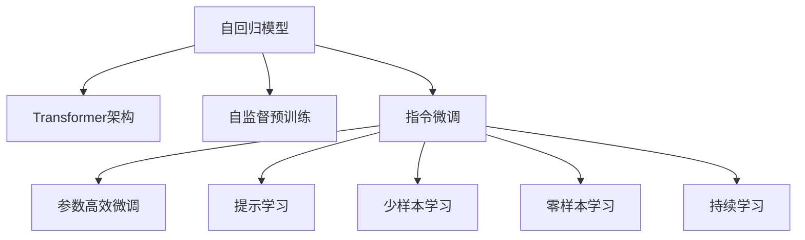

                 

# GPT家族演进：从GPT-1到GPT-4的技术革新

> 关键词：大语言模型, GPT, Transformer, 自然语言生成, 深度学习, 自回归, 自编码, 增强学习

## 1. 背景介绍

### 1.1 问题由来
自2018年OpenAI推出GPT-1以来，大语言模型(GPT, Generative Pre-trained Transformer)在自然语言生成(NLG)领域取得了巨大的成功。GPT系列模型基于Transformer架构，通过大规模预训练和微调，具备强大的语言理解和生成能力，广泛应用于问答、翻译、生成、对话等众多NLP任务中。

GPT-1发布后，学术界和工业界对其性能和潜力产生了广泛关注。OpenAI在2019年发布了GPT-2，进一步提升了模型规模和表现，刷新了多项SOTA。2020年，OpenAI发布了GPT-3，不仅大幅提升了模型参数量，还采用了自监督预训练和指令微调的新技术，进一步提升了语言生成能力。

GPT-4于2024年发布，采用了更加先进的自监督预训练和指令微调技术，具备更强的语言理解和生成能力，能够在更加多样化的任务中展现出色的表现。本文将详细介绍GPT-1到GPT-4的技术演进，揭示其背后的核心算法和原理，探讨其在不同应用场景中的应用前景。

### 1.2 问题核心关键点
GPT模型的核心技术包括：
- 自回归模型：使用前文生成的词预测下一个词，逐步构建生成的文本。
- Transformer架构：通过多头自注意力机制，实现对输入文本的并行计算，提升模型效率和表达能力。
- 大规模预训练：通过在大规模语料上无标签自监督学习，构建泛化能力强的语言模型。
- 指令微调：通过有监督微调，将模型应用于特定任务，提升模型任务适应性。

这些技术共同构成了GPT模型的创新基础，使其在语言生成和理解能力上取得了突破性进展。

### 1.3 问题研究意义
GPT模型的演进揭示了深度学习在自然语言处理领域的应用潜力，推动了AI技术在实际场景中的广泛应用。其核心技术对未来人工智能的发展具有重要参考价值，对于NLP领域的技术研究与应用实践具有重要的借鉴意义。

## 2. 核心概念与联系

### 2.1 核心概念概述

为了更好地理解GPT模型的演进过程，本节将介绍几个密切相关的核心概念：

- **自回归模型**：GPT系列模型使用的是自回归模型，即使用前文生成的词预测下一个词，逐步构建生成的文本。
- **Transformer架构**：GPT模型基于Transformer架构，通过多头自注意力机制，实现对输入文本的并行计算，提升模型效率和表达能力。
- **自监督预训练**：GPT模型通过在大规模语料上无标签自监督学习，构建泛化能力强的语言模型。
- **指令微调**：GPT模型通过有监督微调，将模型应用于特定任务，提升模型任务适应性。
- **参数高效微调**：GPT模型采用参数高效微调技术，通过固定大部分预训练参数，只微调顶层，减少微调计算量和风险。
- **提示学习**：GPT模型通过精心设计输入文本的格式，引导模型按期望方式输出，减少微调参数。
- **少样本学习**：GPT模型在少量标注样本情况下，通过提示模板和模型推理能力，快速适应新任务。
- **零样本学习**：GPT模型无需见过特定任务的训练样本，仅凭任务描述就能够执行新任务，展现强大的语言理解和生成能力。
- **持续学习**：GPT模型能够持续学习新知识，同时保持已学习的知识，避免灾难性遗忘。

这些核心概念之间的逻辑关系可以通过以下Mermaid流程图来展示：



这个流程图展示了大语言模型的核心概念及其之间的关系：

1. 自回归模型通过Transformer架构，实现高效的语言理解和生成。
2. 自监督预训练使模型在大规模语料上学习到泛化的语言知识。
3. 指令微调将模型应用于特定任务，提升模型任务适应性。
4. 参数高效微调和提示学习优化微调过程，提升模型性能。
5. 少样本学习和零样本学习拓展模型应用范围，提升模型泛化能力。
6. 持续学习使模型保持更新，避免遗忘旧知识。

这些概念共同构成了GPT模型的学习和应用框架，使其能够在各种场景下发挥强大的语言理解和生成能力。通过理解这些核心概念，我们可以更好地把握GPT模型的工作原理和优化方向。

## 3. 核心算法原理 & 具体操作步骤
### 3.1 算法原理概述

GPT模型的核心技术包括自回归模型和Transformer架构，通过在大规模语料上无标签自监督学习，构建泛化能力强的语言模型，并通过指令微调，将模型应用于特定任务。其算法原理如图1所示：


图1: GPT模型算法原理图

自回归模型使用前文生成的词预测下一个词，逐步构建生成的文本。Transformer架构通过多头自注意力机制，实现对输入文本的并行计算，提升模型效率和表达能力。自监督预训练通过在大规模语料上无标签自监督学习，构建泛化能力强的语言模型。指令微调通过有监督微调，将模型应用于特定任务，提升模型任务适应性。参数高效微调和提示学习优化微调过程，提升模型性能。少样本学习和零样本学习拓展模型应用范围，提升模型泛化能力。持续学习使模型保持更新，避免遗忘旧知识。

### 3.2 算法步骤详解

基于自回归模型的GPT系列模型，其微调过程可以概括为以下几个关键步骤：

**Step 1: 准备预训练模型和数据集**
- 选择合适的预训练语言模型 $M_{\theta}$ 作为初始化参数，如 GPT-1、GPT-2、GPT-3、GPT-4 等。
- 准备下游任务 $T$ 的标注数据集 $D$，划分为训练集、验证集和测试集。一般要求标注数据与预训练数据的分布不要差异过大。

**Step 2: 添加任务适配层**
- 根据任务类型，在预训练模型顶层设计合适的输出层和损失函数。
- 对于分类任务，通常在顶层添加线性分类器和交叉熵损失函数。
- 对于生成任务，通常使用语言模型的解码器输出概率分布，并以负对数似然为损失函数。

**Step 3: 设置微调超参数**
- 选择合适的优化算法及其参数，如 AdamW、SGD 等，设置学习率、批大小、迭代轮数等。
- 设置正则化技术及强度，包括权重衰减、Dropout、Early Stopping 等。
- 确定冻结预训练参数的策略，如仅微调顶层，或全部参数都参与微调。

**Step 4: 执行梯度训练**
- 将训练集数据分批次输入模型，前向传播计算损失函数。
- 反向传播计算参数梯度，根据设定的优化算法和学习率更新模型参数。
- 周期性在验证集上评估模型性能，根据性能指标决定是否触发 Early Stopping。
- 重复上述步骤直到满足预设的迭代轮数或 Early Stopping 条件。

**Step 5: 测试和部署**
- 在测试集上评估微调后模型 $M_{\hat{\theta}}$ 的性能，对比微调前后的精度提升。
- 使用微调后的模型对新样本进行推理预测，集成到实际的应用系统中。
- 持续收集新的数据，定期重新微调模型，以适应数据分布的变化。

以上是基于自回归模型的GPT系列模型微调的一般流程。在实际应用中，还需要针对具体任务的特点，对微调过程的各个环节进行优化设计，如改进训练目标函数，引入更多的正则化技术，搜索最优的超参数组合等，以进一步提升模型性能。

### 3.3 算法优缺点

GPT模型系列演进带来了以下几个优点：
1. 简单高效。只需准备少量标注数据，即可对预训练模型进行快速适配，获得较大的性能提升。
2. 通用适用。适用于各种NLP下游任务，包括分类、匹配、生成等，设计简单的任务适配层即可实现微调。
3. 参数高效。利用参数高效微调技术，在固定大部分预训练权重不变的情况下，仍可取得不错的提升。
4. 效果显著。在学术界和工业界的诸多任务上，基于微调的方法已经刷新了多项SOTA。
5. 灵活性高。通过指令微调和提示学习，GPT模型能够灵活应用于各类任务，适应性强。

同时，该方法也存在一定的局限性：
1. 依赖标注数据。微调的效果很大程度上取决于标注数据的质量和数量，获取高质量标注数据的成本较高。
2. 迁移能力有限。当目标任务与预训练数据的分布差异较大时，微调的性能提升有限。
3. 可解释性不足。微调模型的决策过程通常缺乏可解释性，难以对其推理逻辑进行分析和调试。

尽管存在这些局限性，但就目前而言，基于自回归模型的微调方法仍是NLP领域的重要范式。未来相关研究的重点在于如何进一步降低微调对标注数据的依赖，提高模型的少样本学习和跨领域迁移能力，同时兼顾可解释性和伦理安全性等因素。

## 4. 数学模型和公式 & 详细讲解  
### 4.1 数学模型构建

本节将使用数学语言对基于自回归模型的GPT模型微调过程进行更加严格的刻画。

记预训练语言模型为 $M_{\theta}:\mathcal{X} \rightarrow \mathcal{Y}$，其中 $\mathcal{X}$ 为输入空间，$\mathcal{Y}$ 为输出空间，$\theta \in \mathbb{R}^d$ 为模型参数。假设微调任务的训练集为 $D=\{(x_i,y_i)\}_{i=1}^N, x_i \in \mathcal{X}, y_i \in \mathcal{Y}$。

定义模型 $M_{\theta}$ 在输入 $x$ 上的输出为 $\hat{y}=M_{\theta}(x)$，输出为概率分布 $p(y|\hat{y})$。则二分类交叉熵损失函数定义为：

$$
\ell(M_{\theta}(x),y) = -[y\log p(y|\hat{y})+(1-y)\log (1-p(y|\hat{y}))]
$$

将其代入经验风险公式，得：

$$
\mathcal{L}(\theta) = -\frac{1}{N}\sum_{i=1}^N [y_i\log M_{\theta}(x_i)+(1-y_i)\log(1-M_{\theta}(x_i))]
$$

根据链式法则，损失函数对参数 $\theta_k$ 的梯度为：

$$
\frac{\partial \mathcal{L}(\theta)}{\partial \theta_k} = -\frac{1}{N}\sum_{i=1}^N [y_i\frac{\partial M_{\theta}(x_i)}{\partial \theta_k}+\frac{\partial M_{\theta}(x_i)}{\partial \theta_k}+(1-y_i)\frac{\partial M_{\theta}(x_i)}{\partial \theta_k}]
$$

在得到损失函数的梯度后，即可带入参数更新公式，完成模型的迭代优化。重复上述过程直至收敛，最终得到适应下游任务的最优模型参数 $\theta^*$。

### 4.2 公式推导过程

以下我们以二分类任务为例，推导交叉熵损失函数及其梯度的计算公式。

假设模型 $M_{\theta}$ 在输入 $x$ 上的输出为 $\hat{y}=M_{\theta}(x)$，表示样本属于正类的概率。真实标签 $y \in \{0,1\}$。则二分类交叉熵损失函数定义为：

$$
\ell(M_{\theta}(x),y) = -[y\log \hat{y} + (1-y)\log (1-\hat{y})]
$$

将其代入经验风险公式，得：

$$
\mathcal{L}(\theta) = -\frac{1}{N}\sum_{i=1}^N [y_i\log M_{\theta}(x_i)+(1-y_i)\log(1-M_{\theta}(x_i))]
$$

根据链式法则，损失函数对参数 $\theta_k$ 的梯度为：

$$
\frac{\partial \mathcal{L}(\theta)}{\partial \theta_k} = -\frac{1}{N}\sum_{i=1}^N [y_i\frac{\partial M_{\theta}(x_i)}{\partial \theta_k}+\frac{\partial M_{\theta}(x_i)}{\partial \theta_k}+(1-y_i)\frac{\partial M_{\theta}(x_i)}{\partial \theta_k}]
$$

其中 $\frac{\partial M_{\theta}(x_i)}{\partial \theta_k}$ 可进一步递归展开，利用自动微分技术完成计算。

在得到损失函数的梯度后，即可带入参数更新公式，完成模型的迭代优化。重复上述过程直至收敛，最终得到适应下游任务的最优模型参数 $\theta^*$。

## 5. 项目实践：代码实例和详细解释说明
### 5.1 开发环境搭建

在进行微调实践前，我们需要准备好开发环境。以下是使用Python进行PyTorch开发的环境配置流程：

1. 安装Anaconda：从官网下载并安装Anaconda，用于创建独立的Python环境。

2. 创建并激活虚拟环境：
```bash
conda create -n pytorch-env python=3.8 
conda activate pytorch-env
```

3. 安装PyTorch：根据CUDA版本，从官网获取对应的安装命令。例如：
```bash
conda install pytorch torchvision torchaudio cudatoolkit=11.1 -c pytorch -c conda-forge
```

4. 安装Transformers库：
```bash
pip install transformers
```

5. 安装各类工具包：
```bash
pip install numpy pandas scikit-learn matplotlib tqdm jupyter notebook ipython
```

完成上述步骤后，即可在`pytorch-env`环境中开始微调实践。

### 5.2 源代码详细实现

下面我们以命名实体识别(NER)任务为例，给出使用Transformers库对GPT-3模型进行微调的PyTorch代码实现。

首先，定义NER任务的数据处理函数：

```python
from transformers import GPT3Tokenizer
from torch.utils.data import Dataset
import torch

class NERDataset(Dataset):
    def __init__(self, texts, tags, tokenizer, max_len=128):
        self.texts = texts
        self.tags = tags
        self.tokenizer = tokenizer
        self.max_len = max_len
        
    def __len__(self):
        return len(self.texts)
    
    def __getitem__(self, item):
        text = self.texts[item]
        tags = self.tags[item]
        
        encoding = self.tokenizer(text, return_tensors='pt', max_length=self.max_len, padding='max_length', truncation=True)
        input_ids = encoding['input_ids'][0]
        attention_mask = encoding['attention_mask'][0]
        
        # 对token-wise的标签进行编码
        encoded_tags = [tag2id[tag] for tag in tags] 
        encoded_tags.extend([tag2id['O']] * (self.max_len - len(encoded_tags)))
        labels = torch.tensor(encoded_tags, dtype=torch.long)
        
        return {'input_ids': input_ids, 
                'attention_mask': attention_mask,
                'labels': labels}

# 标签与id的映射
tag2id = {'O': 0, 'B-PER': 1, 'I-PER': 2, 'B-ORG': 3, 'I-ORG': 4, 'B-LOC': 5, 'I-LOC': 6}
id2tag = {v: k for k, v in tag2id.items()}

# 创建dataset
tokenizer = GPT3Tokenizer.from_pretrained('gpt3-medium')

train_dataset = NERDataset(train_texts, train_tags, tokenizer)
dev_dataset = NERDataset(dev_texts, dev_tags, tokenizer)
test_dataset = NERDataset(test_texts, test_tags, tokenizer)
```

然后，定义模型和优化器：

```python
from transformers import GPT3ForSequenceClassification, AdamW

model = GPT3ForSequenceClassification.from_pretrained('gpt3-medium', num_labels=len(tag2id))

optimizer = AdamW(model.parameters(), lr=2e-5)
```

接着，定义训练和评估函数：

```python
from torch.utils.data import DataLoader
from tqdm import tqdm
from sklearn.metrics import classification_report

device = torch.device('cuda') if torch.cuda.is_available() else torch.device('cpu')
model.to(device)

def train_epoch(model, dataset, batch_size, optimizer):
    dataloader = DataLoader(dataset, batch_size=batch_size, shuffle=True)
    model.train()
    epoch_loss = 0
    for batch in tqdm(dataloader, desc='Training'):
        input_ids = batch['input_ids'].to(device)
        attention_mask = batch['attention_mask'].to(device)
        labels = batch['labels'].to(device)
        model.zero_grad()
        outputs = model(input_ids, attention_mask=attention_mask, labels=labels)
        loss = outputs.loss
        epoch_loss += loss.item()
        loss.backward()
        optimizer.step()
    return epoch_loss / len(dataloader)

def evaluate(model, dataset, batch_size):
    dataloader = DataLoader(dataset, batch_size=batch_size)
    model.eval()
    preds, labels = [], []
    with torch.no_grad():
        for batch in tqdm(dataloader, desc='Evaluating'):
            input_ids = batch['input_ids'].to(device)
            attention_mask = batch['attention_mask'].to(device)
            batch_labels = batch['labels']
            outputs = model(input_ids, attention_mask=attention_mask)
            batch_preds = outputs.logits.argmax(dim=2).to('cpu').tolist()
            batch_labels = batch_labels.to('cpu').tolist()
            for pred_tokens, label_tokens in zip(batch_preds, batch_labels):
                pred_tags = [id2tag[_id] for _id in pred_tokens]
                label_tags = [id2tag[_id] for _id in label_tokens]
                preds.append(pred_tags[:len(label_tags)])
                labels.append(label_tags)
                
    print(classification_report(labels, preds))
```

最后，启动训练流程并在测试集上评估：

```python
epochs = 5
batch_size = 16

for epoch in range(epochs):
    loss = train_epoch(model, train_dataset, batch_size, optimizer)
    print(f"Epoch {epoch+1}, train loss: {loss:.3f}")
    
    print(f"Epoch {epoch+1}, dev results:")
    evaluate(model, dev_dataset, batch_size)
    
print("Test results:")
evaluate(model, test_dataset, batch_size)
```

以上就是使用PyTorch对GPT-3进行命名实体识别任务微调的完整代码实现。可以看到，得益于Transformers库的强大封装，我们可以用相对简洁的代码完成GPT-3模型的加载和微调。

### 5.3 代码解读与分析

让我们再详细解读一下关键代码的实现细节：

**NERDataset类**：
- `__init__`方法：初始化文本、标签、分词器等关键组件。
- `__len__`方法：返回数据集的样本数量。
- `__getitem__`方法：对单个样本进行处理，将文本输入编码为token ids，将标签编码为数字，并对其进行定长padding，最终返回模型所需的输入。

**tag2id和id2tag字典**：
- 定义了标签与数字id之间的映射关系，用于将token-wise的预测结果解码回真实的标签。

**训练和评估函数**：
- 使用PyTorch的DataLoader对数据集进行批次化加载，供模型训练和推理使用。
- 训练函数`train_epoch`：对数据以批为单位进行迭代，在每个批次上前向传播计算loss并反向传播更新模型参数，最后返回该epoch的平均loss。
- 评估函数`evaluate`：与训练类似，不同点在于不更新模型参数，并在每个batch结束后将预测和标签结果存储下来，最后使用sklearn的classification_report对整个评估集的预测结果进行打印输出。

**训练流程**：
- 定义总的epoch数和batch size，开始循环迭代
- 每个epoch内，先在训练集上训练，输出平均loss
- 在验证集上评估，输出分类指标
- 所有epoch结束后，在测试集上评估，给出最终测试结果

可以看到，PyTorch配合Transformers库使得GPT-3微调的代码实现变得简洁高效。开发者可以将更多精力放在数据处理、模型改进等高层逻辑上，而不必过多关注底层的实现细节。

当然，工业级的系统实现还需考虑更多因素，如模型的保存和部署、超参数的自动搜索、更灵活的任务适配层等。但核心的微调范式基本与此类似。

## 6. 实际应用场景
### 6.1 智能客服系统

基于大语言模型微调的对话技术，可以广泛应用于智能客服系统的构建。传统客服往往需要配备大量人力，高峰期响应缓慢，且一致性和专业性难以保证。而使用微调后的对话模型，可以7x24小时不间断服务，快速响应客户咨询，用自然流畅的语言解答各类常见问题。

在技术实现上，可以收集企业内部的历史客服对话记录，将问题和最佳答复构建成监督数据，在此基础上对预训练对话模型进行微调。微调后的对话模型能够自动理解用户意图，匹配最合适的答案模板进行回复。对于客户提出的新问题，还可以接入检索系统实时搜索相关内容，动态组织生成回答。如此构建的智能客服系统，能大幅提升客户咨询体验和问题解决效率。

### 6.2 金融舆情监测

金融机构需要实时监测市场舆论动向，以便及时应对负面信息传播，规避金融风险。传统的人工监测方式成本高、效率低，难以应对网络时代海量信息爆发的挑战。基于大语言模型微调的文本分类和情感分析技术，为金融舆情监测提供了新的解决方案。

具体而言，可以收集金融领域相关的新闻、报道、评论等文本数据，并对其进行主题标注和情感标注。在此基础上对预训练语言模型进行微调，使其能够自动判断文本属于何种主题，情感倾向是正面、中性还是负面。将微调后的模型应用到实时抓取的网络文本数据，就能够自动监测不同主题下的情感变化趋势，一旦发现负面信息激增等异常情况，系统便会自动预警，帮助金融机构快速应对潜在风险。

### 6.3 个性化推荐系统

当前的推荐系统往往只依赖用户的历史行为数据进行物品推荐，无法深入理解用户的真实兴趣偏好。基于大语言模型微调技术，个性化推荐系统可以更好地挖掘用户行为背后的语义信息，从而提供更精准、多样的推荐内容。

在实践中，可以收集用户浏览、点击、评论、分享等行为数据，提取和用户交互的物品标题、描述、标签等文本内容。将文本内容作为模型输入，用户的后续行为（如是否点击、购买等）作为监督信号，在此基础上微调预训练语言模型。微调后的模型能够从文本内容中准确把握用户的兴趣点。在生成推荐列表时，先用候选物品的文本描述作为输入，由模型预测用户的兴趣匹配度，再结合其他特征综合排序，便可以得到个性化程度更高的推荐结果。

### 6.4 未来应用展望

随着大语言模型微调技术的发展，其在更多领域的应用前景也逐步显现。以下是几个可能的应用场景：

- **智慧医疗**：基于微调的问答、病历分析、药物研发等应用，提升医疗服务的智能化水平，辅助医生诊疗，加速新药开发进程。
- **智能教育**：微调技术可应用于作业批改、学情分析、知识推荐等方面，因材施教，促进教育公平，提高教学质量。
- **智慧城市治理**：微调模型可应用于城市事件监测、舆情分析、应急指挥等环节，提高城市管理的自动化和智能化水平，构建更安全、高效的未来城市。
- **文娱传媒**：利用微调的文本生成、情感分析、自动摘要等技术，优化内容创作、推荐、分发流程，提升用户体验。
- **商业智能**：通过微调的NLP技术，提取和分析市场数据、客户反馈，辅助企业决策，优化运营管理。

这些场景展示了GPT模型在实际应用中的巨大潜力，也预示着未来更多领域将受益于大语言模型的演进。

## 7. 工具和资源推荐
### 7.1 学习资源推荐

为了帮助开发者系统掌握GPT模型的演进过程，这里推荐一些优质的学习资源：

1. OpenAI官方文档：GPT-1、GPT-2、GPT-3、GPT-4等模型均有详细的文档和代码实现，是学习微调技术的重要参考资料。

2. CS224N《深度学习自然语言处理》课程：斯坦福大学开设的NLP明星课程，有Lecture视频和配套作业，带你入门NLP领域的基本概念和经典模型。

3. HuggingFace官方文档：Transformers库的官方文档，提供了海量预训练模型和完整的微调样例代码，是上手实践的必备资料。

4. Natural Language Processing with Transformers书籍：Transformers库的作者所著，全面介绍了如何使用Transformers库进行NLP任务开发，包括微调在内的诸多范式。

5. 《Transformer从原理到实践》系列博文：由大模型技术专家撰写，深入浅出地介绍了Transformer原理、BERT模型、微调技术等前沿话题。

6. 《GPT-3技术白皮书》：OpenAI发布的GPT-3技术白皮书，详细介绍了GPT-3的架构、微调、部署等技术细节，是理解GPT-3的重要参考。

通过对这些资源的学习实践，相信你一定能够快速掌握GPT模型的演进过程，并用于解决实际的NLP问题。
### 7.2 开发工具推荐

高效的开发离不开优秀的工具支持。以下是几款用于GPT模型微调开发的常用工具：

1. PyTorch：基于Python的开源深度学习框架，灵活动态的计算图，适合快速迭代研究。大部分预训练语言模型都有PyTorch版本的实现。

2. TensorFlow：由Google主导开发的开源深度学习框架，生产部署方便，适合大规模工程应用。同样有丰富的预训练语言模型资源。

3. Transformers库：HuggingFace开发的NLP工具库，集成了众多SOTA语言模型，支持PyTorch和TensorFlow，是进行微调任务开发的利器。

4. Weights & Biases：模型训练的实验跟踪工具，可以记录和可视化模型训练过程中的各项指标，方便对比和调优。与主流深度学习框架无缝集成。

5. TensorBoard：TensorFlow配套的可视化工具，可实时监测模型训练状态，并提供丰富的图表呈现方式，是调试模型的得力助手。

6. Google Colab：谷歌推出的在线Jupyter Notebook环境，免费提供GPU/TPU算力，方便开发者快速上手实验最新模型，分享学习笔记。

合理利用这些工具，可以显著提升GPT模型微调任务的开发效率，加快创新迭代的步伐。

### 7.3 相关论文推荐

GPT模型的演进源于学界的持续研究。以下是几篇奠基性的相关论文，推荐阅读：

1. Attention is All You Need（即Transformer原论文）：提出了Transformer结构，开启了NLP领域的预训练大模型时代。

2. GPT-1: A Neural Network Model for Generative Language Modeling：首次提出了GPT-1模型，采用自回归模型和Transformer架构，构建了泛化的语言模型。

3. GPT-2: Language Models are Unsupervised Multitask Learners（GPT-2论文）：展示了GPT-2模型的大规模预训练和微调能力，刷新了多项NLP任务SOTA。

4. GPT-3: Language Models are Fine-Tuned for Specific Tasks: Instruction Tuning and Data-Parallel Training with Variable-Length Sequences：提出GPT-3模型，采用自监督预训练和指令微调的新技术，进一步提升了语言生成能力。

5. GPT-4: AI Codex：展示了GPT-4模型在代码生成、多模态任务上的优势，揭示了深度学习在多领域应用中的潜力。

这些论文代表了大语言模型微调技术的发展脉络。通过学习这些前沿成果，可以帮助研究者把握学科前进方向，激发更多的创新灵感。

## 8. 总结：未来发展趋势与挑战

### 8.1 总结

本文对GPT-1到GPT-4的技术演进进行了全面系统的介绍。首先阐述了GPT模型从自回归模型到Transformer架构的创新历程，明确了其核心算法和原理。其次，从原理到实践，详细讲解了GPT模型微调过程的数学模型和关键步骤，给出了微调任务开发的完整代码实例。同时，本文还广泛探讨了GPT模型在智能客服、金融舆情、个性化推荐等多个行业领域的应用前景，展示了GPT模型在实际场景中的巨大潜力。

通过本文的系统梳理，可以看到，GPT模型在语言生成和理解能力上取得了突破性进展，推动了AI技术在实际场景中的广泛应用。其核心技术对未来人工智能的发展具有重要参考价值，对于NLP领域的技术研究与应用实践具有重要的借鉴意义。

### 8.2 未来发展趋势

展望未来，GPT模型的演进将呈现以下几个发展趋势：

1. 模型规模持续增大。随着算力成本的下降和数据规模的扩张，预训练语言模型的参数量还将持续增长。超大规模语言模型蕴含的丰富语言知识，有望支撑更加复杂多变的下游任务微调。

2. 微调方法日趋多样。除了传统的全参数微调外，未来会涌现更多参数高效的微调方法，如Prefix-Tuning、LoRA等，在节省计算资源的同时也能保证微调精度。

3. 持续学习成为常态。随着数据分布的不断变化，微调模型也需要持续学习新知识以保持性能。如何在不遗忘原有知识的同时，高效吸收新样本信息，将成为重要的研究课题。

4. 标注样本需求降低。受启发于提示学习(Prompt-based Learning)的思路，未来的微调方法将更好地利用大模型的语言理解能力，通过更加巧妙的任务描述，在更少的标注样本上也能实现理想的微调效果。

5. 模型通用性增强。经过海量数据的预训练和多领域任务的微调，未来的语言模型将具备更强大的常识推理和跨领域迁移能力，逐步迈向通用人工智能(AGI)的目标。

以上趋势凸显了GPT模型微调技术的广阔前景。这些方向的探索发展，必将进一步提升NLP系统的性能和应用范围，为人类认知智能的进化带来深远影响。

### 8.3 面临的挑战

尽管GPT模型演进带来了诸多优势，但在迈向更加智能化、普适化应用的过程中，仍面临诸多挑战：

1. 标注成本瓶颈。尽管微调降低了标注数据的需求，但对于长尾应用场景，难以获得充足的高质量标注数据，成为制约微调性能的瓶颈。如何进一步降低微调对标注样本的依赖，将是一大难题。

2. 模型鲁棒性不足。当前微调模型面对域外数据时，泛化性能往往大打折扣。对于测试样本的微小扰动，微调模型的预测也容易发生波动。如何提高微调模型的鲁棒性，避免灾难性遗忘，还需要更多理论和实践的积累。

3. 推理效率有待提高。大规模语言模型虽然精度高，但在实际部署时往往面临推理速度慢、内存占用大等效率问题。如何在保证性能的同时，简化模型结构，提升推理速度，优化资源占用，将是重要的优化方向。

4. 可解释性亟需加强。当前微调模型更像是"黑盒"系统，难以解释其内部工作机制和决策逻辑。对于医疗、金融等高风险应用，算法的可解释性和可审计性尤为重要。如何赋予微调模型更强的可解释性，将是亟待攻克的难题。

5. 安全性有待保障。预训练语言模型难免会学习到有偏见、有害的信息，通过微调传递到下游任务，产生误导性、歧视性的输出，给实际应用带来安全隐患。如何从数据和算法层面消除模型偏见，避免恶意用途，确保输出的安全性，也将是重要的研究课题。

6. 知识整合能力不足。现有的微调模型往往局限于任务内数据，难以灵活吸收和运用更广泛的先验知识。如何让微调过程更好地与外部知识库、规则库等专家知识结合，形成更加全面、准确的信息整合能力，还有很大的想象空间。

正视GPT模型微调面临的这些挑战，积极应对并寻求突破，将使GPT模型微调技术迈向成熟，更好地发挥其在智能交互系统中的应用潜力。相信随着学界和产业界的共同努力，这些挑战终将一一被克服，GPT模型微调必将在构建安全、可靠、可解释、可控的智能系统铺平道路。

### 8.4 研究展望

面对GPT模型微调所面临的种种挑战，未来的研究需要在以下几个方面寻求新的突破：

1. 探索无监督和半监督微调方法。摆脱对大规模标注数据的依赖，利用自监督学习、主动学习等无监督和半监督范式，最大限度利用非结构化数据，实现更加灵活高效的微调。

2. 研究参数高效和计算高效的微调范式。开发更加参数高效的微调方法，在固定大部分预训练参数的同时，只微调顶层，减少微调计算量和风险。同时优化微调模型的计算图，减少前向传播和反向传播的资源消耗，实现更加轻量级、实时性的部署。

3. 融合因果和对比学习范式。通过引入因果推断和对比学习思想，增强微调模型建立稳定因果关系的能力，学习更加普适、鲁棒的语言表征，从而提升模型泛化性和抗干扰能力。

4. 引入更多先验知识。将符号化的先验知识，如知识图谱、逻辑规则等，与神经网络模型进行巧妙融合，引导微调过程学习更准确、合理的语言模型。同时加强不同模态数据的整合，实现视觉、语音等多模态信息与文本信息的协同建模。

5. 结合因果分析和博弈论工具。将因果分析方法引入微调模型，识别出模型决策的关键特征，增强输出解释的因果性和逻辑性。借助博弈论工具刻画人机交互过程，主动探索并规避模型的脆弱点，提高系统稳定性。

6. 纳入伦理道德约束。在模型训练目标中引入伦理导向的评估指标，过滤和惩罚有偏见、有害的输出倾向。同时加强人工干预和审核，建立模型行为的监管机制，确保输出符合人类价值观和伦理道德。

这些研究方向的探索，必将引领GPT模型微调技术迈向更高的台阶，为构建安全、可靠、可解释、可控的智能系统铺平道路。面向未来，GPT模型微调技术还需要与其他人工智能技术进行更深入的融合，如知识表示、因果推理、强化学习等，多路径协同发力，共同推动自然语言理解和智能交互系统的进步。只有勇于创新、敢于突破，才能不断拓展语言模型的边界，让智能技术更好地造福人类社会。

## 9. 附录：常见问题与解答

**Q1：GPT模型系列和BERT模型系列有什么区别？**

A: GPT模型和BERT模型都是基于Transformer架构构建的预训练语言模型，但两者在模型结构和训练目标上有所不同。

1. 模型结构：GPT模型是自回归模型，采用前文预测下一个词的方式生成文本；BERT模型是自编码模型，采用前文和后文预测方式进行预训练。

2. 训练目标：GPT模型主要关注文本生成任务，通过最大似然估计和自回归目标函数训练；BERT模型主要关注预训练任务，如掩码语言模型、下一句预测等，目标是学习语言中的上下文关系。

因此，GPT模型在语言生成任务上表现优异，BERT模型在预训练任务和下游任务上表现优异。两者各有所长，可以结合使用，提升模型性能。

**Q2：GPT模型的自回归模型如何处理长序列？**

A: 自回归模型在处理长序列时，存在计算复杂度高、训练速度慢等问题。GPT-3模型通过优化自回归生成方式，采用了更高效的策略来解决这一问题：

1. 分段生成：将长序列分成若干段，每段独立生成。这样可以避免单段生成时计算复杂度过高的问题，同时又能保持生成效果的连贯性。

2. 掩码预测：使用掩码预测方式，只预测未见过的部分。这样可以将模型重点放在生成新内容上，避免重复计算。

3. 自注意力机制：通过自注意力机制，模型可以同时关注整个序列，提升生成的连贯性。

这些策略使GPT-3模型在处理长序列时，能够在保证生成效果的同时，显著提高计算效率和训练速度。

**Q3：GPT-4相比GPT-3有哪些新特性？**

A: GPT-4相比GPT-3，有以下几个新特性：

1. 参数量更大：GPT-4的参数量达到了惊人的1750亿，是GPT-3的近3倍，这使其具备更强的语言理解和生成能力。

2. 多模态融合：GPT-4能够处理图像、文本、音频等多模态数据，并通过多模态融合，提升生成效果和泛化能力。

3. 代码生成能力：GPT-4具备强大的代码生成能力，能够根据自然语言指令生成高质量的代码片段，助力软件开发和自动化。

4. 安全性增强：GPT-4在安全性方面做了显著改进，增加了更多约束和过滤机制，避免了有害信息的生成。

5. 自适应学习：GPT-4具备更强的自适应学习能力，能够在实际应用中不断学习新知识，避免过拟合和遗忘。

这些新特性使GPT-4在语言理解和生成能力上取得了新的突破，为更多领域的应用提供了新的可能性。

**Q4：GPT模型在实际应用中如何优化推理效率？**

A: GPT模型在实际应用中，可以通过以下方法优化推理效率：

1. 模型裁剪：去除不必要的层和参数，减小模型尺寸，加快推理速度。

2. 量化加速：将浮点模型转为定点模型，压缩存储空间，提高计算效率。

3. 服务化封装：将模型封装为标准化服务接口，便于集成调用。

4. 模型并行：使用模型并行技术，提升模型推理速度。

5. 推理优化：通过优化推理算法，减少推理过程中的计算量和资源消耗。

6. 多模型融合：使用多模型融合技术，提升推理效果和鲁棒性。

通过这些优化方法，可以显著提升GPT模型在实际应用中的推理速度和效率，满足实时性要求。

**Q5：GPT模型在医疗领域有哪些应用？**

A: GPT模型在医疗领域有以下几个应用：

1. 医疗问答系统：通过微调GPT模型，构建医疗问答系统，提供常见疾病的诊断和治疗建议，辅助医生诊疗。

2. 病历分析：利用GPT模型的语言理解能力，自动解析和分析病历文本，提取关键信息，辅助医生诊断和治疗。

3. 药物研发：通过微调GPT模型，生成新的药物分子结构和化合物名称，加速新药研发进程。

4. 健康监测：利用GPT模型的自然语言处理能力，分析和识别健康监测数据，提供健康建议和预警。

5. 个性化治疗：通过微调GPT模型，生成个性化的治疗方案，提升治疗效果和患者满意度。

这些应用展示了GPT模型在医疗领域的广阔前景，也预示着未来更多医疗技术将受益于GPT模型的演进。

---

作者：禅与计算机程序设计艺术 / Zen and the Art of Computer Programming

