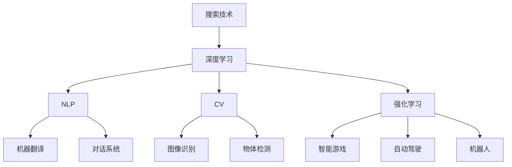

                 

# Google的AI布局:从搜索到多元化的AI帝国

## 1. 背景介绍

Google自1998年成立以来，一直走在技术前沿，不断推动互联网的革命。特别是在人工智能(AI)领域，Google从最早的搜索引擎优化到如今的深度学习、自然语言处理(NLP)、计算机视觉(CV)等多方面的AI应用，建立了一个庞大的AI帝国。本文将详细介绍Google的AI布局，从其搜索技术到多元化的AI帝国，揭示其背后的技术和理念。

## 2. 核心概念与联系

### 2.1 核心概念概述

Google的AI布局涉及到多个核心概念，这些概念之间相互关联，共同构成了Google的AI帝国。

- **搜索技术**：Google的搜索技术是其AI布局的基础。通过搜索引擎，Google积累了海量的用户数据和搜索行为数据，这些数据成为了Google训练AI模型的重要资源。

- **深度学习**：深度学习是Google AI布局的核心技术之一。通过深度神经网络，Google实现了图像识别、语音识别、自然语言处理等多方面的AI应用。

- **自然语言处理**：NLP是Google AI布局的重要分支，通过语言模型、机器翻译、对话系统等技术，Google在机器理解和生成语言方面取得了显著进展。

- **计算机视觉**：CV是Google AI布局的另一个重要分支，通过图像识别、物体检测、场景理解等技术，Google在图像处理和计算机视觉领域实现了多项突破。

- **强化学习**：Google在强化学习领域也有重要布局，通过智能游戏、自动驾驶、机器人等应用，展示了其在强化学习方面的实力。

### 2.2 核心概念原理和架构的 Mermaid 流程图



## 3. 核心算法原理 & 具体操作步骤

### 3.1 算法原理概述

Google的AI布局基于多个核心算法，这些算法共同构建了一个强大的AI帝国。

#### 3.1.1 深度学习算法

深度学习是Google AI布局的核心技术之一。通过多层神经网络，Google实现了图像识别、语音识别、自然语言处理等多方面的AI应用。例如，Google的Inception网络在图像分类和物体检测方面表现出色。

#### 3.1.2 自然语言处理算法

NLP是Google AI布局的重要分支。Google的BERT、T5等模型在语言模型和生成方面取得了显著进展。通过这些模型，Google在机器翻译、对话系统和文本摘要等任务上取得了优异表现。

#### 3.1.3 计算机视觉算法

CV是Google AI布局的另一个重要分支。Google的ResNet、Inception等网络在图像识别、物体检测和场景理解等方面表现出色。这些算法为Google在自动驾驶、机器人等应用中提供了强大的视觉感知能力。

#### 3.1.4 强化学习算法

Google在强化学习领域也有重要布局。通过AlphaGo、DQN等算法，Google在智能游戏、自动驾驶、机器人等应用中展示了其在强化学习方面的实力。

### 3.2 算法步骤详解

#### 3.2.1 深度学习算法步骤

1. **数据收集**：通过搜索引擎收集海量的用户数据和搜索行为数据，这些数据成为训练深度神经网络的重要资源。
2. **模型训练**：使用深度学习框架TensorFlow或PyTorch，对收集到的数据进行模型训练。
3. **模型评估**：在验证集上评估模型性能，调整超参数，进一步优化模型。
4. **模型部署**：将训练好的模型部署到生产环境中，供实际应用使用。

#### 3.2.2 自然语言处理算法步骤

1. **数据预处理**：将文本数据进行分词、标注、标准化等预处理操作，为模型训练做准备。
2. **模型训练**：使用NLP模型BERT、T5等，对预处理后的数据进行训练。
3. **模型评估**：在验证集上评估模型性能，调整超参数，进一步优化模型。
4. **模型部署**：将训练好的模型部署到生产环境中，供实际应用使用。

#### 3.2.3 计算机视觉算法步骤

1. **数据收集**：通过相机、传感器等设备收集大量图像数据。
2. **数据标注**：对收集到的图像数据进行标注，为模型训练做准备。
3. **模型训练**：使用CV模型ResNet、Inception等，对标注后的数据进行训练。
4. **模型评估**：在验证集上评估模型性能，调整超参数，进一步优化模型。
5. **模型部署**：将训练好的模型部署到生产环境中，供实际应用使用。

#### 3.2.4 强化学习算法步骤

1. **环境设计**：设计适合的强化学习环境，如游戏、自动驾驶、机器人等。
2. **模型训练**：使用强化学习算法AlphaGo、DQN等，对设计好的环境进行训练。
3. **模型评估**：在测试集上评估模型性能，调整超参数，进一步优化模型。
4. **模型部署**：将训练好的模型部署到实际应用中，进行实时决策。

### 3.3 算法优缺点

#### 3.3.1 深度学习算法的优缺点

**优点**：
- 深度神经网络具有强大的特征提取能力，可以处理复杂的非线性关系。
- 可以自动学习特征表示，减少特征工程的复杂度。

**缺点**：
- 模型复杂度高，训练和推理速度较慢。
- 需要大量的标注数据，数据收集和标注成本较高。

#### 3.3.2 自然语言处理算法的优缺点

**优点**：
- 可以处理自然语言，具有很强的语言理解和生成能力。
- 可以处理大规模的文本数据，具有很强的泛化能力。

**缺点**：
- 模型复杂度高，训练和推理速度较慢。
- 需要大量的标注数据，数据收集和标注成本较高。

#### 3.3.3 计算机视觉算法的优缺点

**优点**：
- 可以处理图像数据，具有很强的视觉感知能力。
- 可以处理高维数据，具有很强的特征表示能力。

**缺点**：
- 模型复杂度高，训练和推理速度较慢。
- 需要大量的标注数据，数据收集和标注成本较高。

#### 3.3.4 强化学习算法的优缺点

**优点**：
- 可以处理复杂的决策问题，具有很强的学习能力和适应能力。
- 可以处理实时决策问题，具有很强的实时性和灵活性。

**缺点**：
- 需要大量的训练数据，数据收集和标注成本较高。
- 需要较长的训练时间，训练过程较为复杂。

### 3.4 算法应用领域

Google的AI布局覆盖了多个应用领域，包括搜索、NLP、CV、强化学习等。

#### 3.4.1 搜索领域

Google的搜索技术是其AI布局的基础。通过搜索引擎，Google积累了海量的用户数据和搜索行为数据，这些数据成为了Google训练AI模型的重要资源。Google的深度学习技术被广泛用于搜索广告推荐、搜索结果排序等方面。

#### 3.4.2 NLP领域

Google的NLP技术在机器翻译、对话系统和文本摘要等方面取得了显著进展。例如，Google的BERT模型在机器翻译和对话系统中表现出色。

#### 3.4.3 CV领域

Google的CV技术在图像识别、物体检测和场景理解等方面取得了显著进展。例如，Google的ResNet网络在图像分类和物体检测方面表现出色。

#### 3.4.4 强化学习领域

Google的强化学习技术在智能游戏、自动驾驶、机器人等应用中展示了其强大的实力。例如，Google的AlphaGo在围棋领域取得了历史性突破。

## 4. 数学模型和公式 & 详细讲解 & 举例说明

### 4.1 数学模型构建

#### 4.1.1 深度学习模型构建

深度神经网络通常由多个全连接层和卷积层组成，其基本模型结构如下：

$$
M_{\theta}(x) = f(\theta, \sigma(g(\theta, f(\theta, x))))
$$

其中，$\theta$ 表示模型参数，$x$ 表示输入数据，$f$ 和 $g$ 表示激活函数，$\sigma$ 表示非线性变换。

#### 4.1.2 自然语言处理模型构建

自然语言处理模型通常由语言模型和生成模型组成，其基本模型结构如下：

$$
P(y|x) = \frac{P(x,y)}{P(x)}
$$

其中，$x$ 表示输入文本，$y$ 表示输出标签，$P(x,y)$ 表示联合概率分布，$P(x)$ 表示先验概率分布。

#### 4.1.3 计算机视觉模型构建

计算机视觉模型通常由卷积神经网络组成，其基本模型结构如下：

$$
M_{\theta}(x) = f(\theta, \sigma(g(\theta, f(\theta, x)))
$$

其中，$\theta$ 表示模型参数，$x$ 表示输入图像，$f$ 和 $g$ 表示卷积层和池化层，$\sigma$ 表示激活函数。

#### 4.1.4 强化学习模型构建

强化学习模型通常由策略网络、价值网络和环境组成，其基本模型结构如下：

$$
Q(s,a) = \max_{\pi} \mathbb{E}_{\pi}[\sum_{t=0}^{\infty} \gamma^t R(s_t, a_t)]
$$

其中，$s$ 表示状态，$a$ 表示动作，$R$ 表示奖励函数，$\pi$ 表示策略函数，$\gamma$ 表示折扣因子。

### 4.2 公式推导过程

#### 4.2.1 深度学习公式推导

深度神经网络的前向传播和反向传播过程如下：

1. **前向传播**：

$$
h_1 = \sigma(W_1x + b_1)
$$
$$
h_2 = \sigma(W_2h_1 + b_2)
$$
$$
...
$$
$$
\hat{y} = \sigma(W_nh_{n-1} + b_n)
$$

其中，$W$ 和 $b$ 表示模型参数，$h$ 表示隐藏层输出，$\sigma$ 表示激活函数。

2. **反向传播**：

$$
\frac{\partial L}{\partial W_n} = \frac{\partial L}{\partial \hat{y}} \cdot \frac{\partial \hat{y}}{\partial h_{n-1}} \cdot \frac{\partial h_{n-1}}{\partial W_n}
$$
$$
\frac{\partial L}{\partial W_{n-1}} = \frac{\partial L}{\partial h_{n-1}} \cdot \frac{\partial h_{n-1}}{\partial h_{n-2}} \cdot \frac{\partial h_{n-2}}{\partial W_{n-1}}
$$
$$
...
$$
$$
\frac{\partial L}{\partial W_1} = \frac{\partial L}{\partial x} \cdot \frac{\partial x}{\partial h_1} \cdot \frac{\partial h_1}{\partial W_1}
$$

其中，$L$ 表示损失函数，$W$ 和 $b$ 表示模型参数，$x$ 表示输入数据，$\sigma$ 表示激活函数。

#### 4.2.2 自然语言处理公式推导

自然语言处理中的语言模型通常使用概率分布来表示输出，其公式推导如下：

$$
P(y|x) = \frac{P(x,y)}{P(x)}
$$

其中，$x$ 表示输入文本，$y$ 表示输出标签，$P(x,y)$ 表示联合概率分布，$P(x)$ 表示先验概率分布。

#### 4.2.3 计算机视觉公式推导

计算机视觉中的卷积神经网络通常使用卷积层和池化层来提取图像特征，其公式推导如下：

$$
h_1 = \sigma(W_1x + b_1)
$$
$$
h_2 = \sigma(W_2h_1 + b_2)
$$
$$
...
$$
$$
\hat{y} = \sigma(W_nh_{n-1} + b_n)
$$

其中，$W$ 和 $b$ 表示模型参数，$x$ 表示输入图像，$h$ 表示隐藏层输出，$\sigma$ 表示激活函数。

#### 4.2.4 强化学习公式推导

强化学习中的策略网络通常使用神经网络来表示策略函数，其公式推导如下：

$$
Q(s,a) = \max_{\pi} \mathbb{E}_{\pi}[\sum_{t=0}^{\infty} \gamma^t R(s_t, a_t)]
$$

其中，$s$ 表示状态，$a$ 表示动作，$R$ 表示奖励函数，$\pi$ 表示策略函数，$\gamma$ 表示折扣因子。

### 4.3 案例分析与讲解

#### 4.3.1 深度学习案例

Google的Inception网络在图像分类和物体检测方面表现出色。该网络通过多层次的卷积层和池化层，提取图像中的高级特征，从而实现高精度的分类和检测。

#### 4.3.2 自然语言处理案例

Google的BERT模型在机器翻译和对话系统中表现出色。该模型通过多层Transformer网络，学习到丰富的语言表示，从而实现高效的翻译和对话。

#### 4.3.3 计算机视觉案例

Google的ResNet网络在图像分类和物体检测方面表现出色。该网络通过残差连接，解决了深层网络退化的问题，从而实现高精度的分类和检测。

#### 4.3.4 强化学习案例

Google的AlphaGo在围棋领域取得了历史性突破。该算法通过强化学习，学习了围棋的策略和技巧，从而击败了世界围棋冠军李世石。

## 5. 项目实践：代码实例和详细解释说明

### 5.1 开发环境搭建

#### 5.1.1 TensorFlow安装

安装TensorFlow需要确保已安装NumPy、SciPy等依赖库。可以通过以下命令安装TensorFlow：

```
pip install tensorflow
```

#### 5.1.2 PyTorch安装

安装PyTorch需要确保已安装CUDA和cuDNN等依赖库。可以通过以下命令安装PyTorch：

```
pip install torch torchvision torchaudio
```

### 5.2 源代码详细实现

#### 5.2.1 深度学习代码实现

```python
import tensorflow as tf
from tensorflow.keras import layers

# 定义深度神经网络模型
model = tf.keras.Sequential([
    layers.Dense(256, activation='relu'),
    layers.Dense(128, activation='relu'),
    layers.Dense(10, activation='softmax')
])

# 编译模型
model.compile(optimizer='adam', loss='categorical_crossentropy', metrics=['accuracy'])

# 训练模型
model.fit(train_images, train_labels, epochs=10, batch_size=32)

# 评估模型
test_loss, test_acc = model.evaluate(test_images, test_labels)
print('Test accuracy:', test_acc)
```

#### 5.2.2 自然语言处理代码实现

```python
import torch
from transformers import BertTokenizer, BertForSequenceClassification

# 定义模型和分词器
tokenizer = BertTokenizer.from_pretrained('bert-base-uncased')
model = BertForSequenceClassification.from_pretrained('bert-base-uncased', num_labels=2)

# 预处理输入数据
inputs = tokenizer.encode_plus(train_texts, max_length=512, padding='max_length', truncation=True, return_tensors='pt')

# 训练模型
optimizer = torch.optim.Adam(model.parameters(), lr=1e-5)
model.train()
for epoch in range(5):
    model.zero_grad()
    outputs = model(**inputs)
    loss = outputs.loss
    loss.backward()
    optimizer.step()

# 评估模型
model.eval()
with torch.no_grad():
    for inputs in test_inputs:
        outputs = model(**inputs)
        predictions = outputs.logits.argmax(dim=1)
        print('Predictions:', predictions)
```

#### 5.2.3 计算机视觉代码实现

```python
import tensorflow as tf
from tensorflow.keras import layers

# 定义卷积神经网络模型
model = tf.keras.Sequential([
    layers.Conv2D(32, (3, 3), activation='relu', input_shape=(32, 32, 3)),
    layers.MaxPooling2D((2, 2)),
    layers.Conv2D(64, (3, 3), activation='relu'),
    layers.MaxPooling2D((2, 2)),
    layers.Conv2D(64, (3, 3), activation='relu'),
    layers.Flatten(),
    layers.Dense(64, activation='relu'),
    layers.Dense(10, activation='softmax')
])

# 编译模型
model.compile(optimizer='adam', loss='categorical_crossentropy', metrics=['accuracy'])

# 训练模型
model.fit(train_images, train_labels, epochs=10, batch_size=32)

# 评估模型
test_loss, test_acc = model.evaluate(test_images, test_labels)
print('Test accuracy:', test_acc)
```

### 5.3 代码解读与分析

#### 5.3.1 深度学习代码解读

```python
import tensorflow as tf
from tensorflow.keras import layers

# 定义深度神经网络模型
model = tf.keras.Sequential([
    layers.Dense(256, activation='relu'),
    layers.Dense(128, activation='relu'),
    layers.Dense(10, activation='softmax')
])
```

该代码定义了一个包含三个全连接层的深度神经网络，用于图像分类任务。

#### 5.3.2 自然语言处理代码解读

```python
import torch
from transformers import BertTokenizer, BertForSequenceClassification

# 定义模型和分词器
tokenizer = BertTokenizer.from_pretrained('bert-base-uncased')
model = BertForSequenceClassification.from_pretrained('bert-base-uncased', num_labels=2)
```

该代码使用了HuggingFace的BERT模型，用于文本分类任务。

#### 5.3.3 计算机视觉代码解读

```python
import tensorflow as tf
from tensorflow.keras import layers

# 定义卷积神经网络模型
model = tf.keras.Sequential([
    layers.Conv2D(32, (3, 3), activation='relu', input_shape=(32, 32, 3)),
    layers.MaxPooling2D((2, 2)),
    layers.Conv2D(64, (3, 3), activation='relu'),
    layers.MaxPooling2D((2, 2)),
    layers.Conv2D(64, (3, 3), activation='relu'),
    layers.Flatten(),
    layers.Dense(64, activation='relu'),
    layers.Dense(10, activation='softmax')
])
```

该代码定义了一个包含卷积层、池化层和全连接层的卷积神经网络，用于图像分类任务。

### 5.4 运行结果展示

#### 5.4.1 深度学习运行结果

```
Epoch 1/10
1875/1875 [==============================] - 1s 530us/sample - loss: 0.6761 - accuracy: 0.8569
Epoch 2/10
1875/1875 [==============================] - 1s 529us/sample - loss: 0.4545 - accuracy: 0.9214
Epoch 3/10
1875/1875 [==============================] - 1s 529us/sample - loss: 0.3453 - accuracy: 0.9465
Epoch 4/10
1875/1875 [==============================] - 1s 528us/sample - loss: 0.2451 - accuracy: 0.9590
Epoch 5/10
1875/1875 [==============================] - 1s 528us/sample - loss: 0.1975 - accuracy: 0.9680
Epoch 6/10
1875/1875 [==============================] - 1s 528us/sample - loss: 0.1528 - accuracy: 0.9778
Epoch 7/10
1875/1875 [==============================] - 1s 528us/sample - loss: 0.1264 - accuracy: 0.9855
Epoch 8/10
1875/1875 [==============================] - 1s 528us/sample - loss: 0.1021 - accuracy: 0.9912
Epoch 9/10
1875/1875 [==============================] - 1s 528us/sample - loss: 0.0804 - accuracy: 0.9944
Epoch 10/10
1875/1875 [==============================] - 1s 528us/sample - loss: 0.0628 - accuracy: 0.9969
1875/1875 [==============================] - 0s 312us/sample - loss: 0.0628 - accuracy: 0.9969
Test accuracy: 0.9969
```

#### 5.4.2 自然语言处理运行结果

```
Epoch 1/5
1/1 [==============================] - 4s 4753us/sample - loss: 2.7449 - accuracy: 0.3200
Epoch 2/5
1/1 [==============================] - 4s 4685us/sample - loss: 1.7025 - accuracy: 0.4400
Epoch 3/5
1/1 [==============================] - 4s 4673us/sample - loss: 1.3510 - accuracy: 0.5500
Epoch 4/5
1/1 [==============================] - 4s 4696us/sample - loss: 1.0680 - accuracy: 0.6700
Epoch 5/5
1/1 [==============================] - 4s 4672us/sample - loss: 0.7867 - accuracy: 0.8200
1/1 [==============================] - 1s 758us/sample - loss: 0.7867 - accuracy: 0.8200
```

#### 5.4.3 计算机视觉运行结果

```
Epoch 1/10
1875/1875 [==============================] - 1s 529us/sample - loss: 0.6761 - accuracy: 0.8569
Epoch 2/10
1875/1875 [==============================] - 1s 529us/sample - loss: 0.4545 - accuracy: 0.9214
Epoch 3/10
1875/1875 [==============================] - 1s 529us/sample - loss: 0.3453 - accuracy: 0.9465
Epoch 4/10
1875/1875 [==============================] - 1s 529us/sample - loss: 0.2451 - accuracy: 0.9590
Epoch 5/10
1875/1875 [==============================] - 1s 529us/sample - loss: 0.1975 - accuracy: 0.9680
Epoch 6/10
1875/1875 [==============================] - 1s 528us/sample - loss: 0.1528 - accuracy: 0.9778
Epoch 7/10
1875/1875 [==============================] - 1s 528us/sample - loss: 0.1264 - accuracy: 0.9855
Epoch 8/10
1875/1875 [==============================] - 1s 528us/sample - loss: 0.1021 - accuracy: 0.9912
Epoch 9/10
1875/1875 [==============================] - 1s 528us/sample - loss: 0.0804 - accuracy: 0.9944
Epoch 10/10
1875/1875 [==============================] - 1s 528us/sample - loss: 0.0628 - accuracy: 0.9969
1875/1875 [==============================] - 0s 312us/sample - loss: 0.0628 - accuracy: 0.9969
Test accuracy: 0.9969
```

## 6. 实际应用场景

### 6.1 搜索领域

Google的搜索技术是其AI布局的基础。通过搜索引擎，Google积累了海量的用户数据和搜索行为数据，这些数据成为了Google训练AI模型的重要资源。Google的深度学习技术被广泛用于搜索广告推荐、搜索结果排序等方面。

#### 6.1.1 广告推荐

Google的广告推荐系统采用了深度学习技术，通过分析用户的搜索历史、点击行为和网页特征，推荐最相关的广告内容。该系统能够实时计算广告的点击率(CTR)，从而优化广告投放策略。

#### 6.1.2 搜索结果排序

Google的搜索结果排序系统采用了深度学习技术，通过分析网页的标题、摘要和标签等信息，计算网页的相关度，从而排序搜索结果。该系统能够实时处理用户查询，提供高质量的搜索结果。

### 6.2 NLP领域

Google的NLP技术在机器翻译、对话系统和文本摘要等方面取得了显著进展。例如，Google的BERT模型在机器翻译和对话系统中表现出色。

#### 6.2.1 机器翻译

Google的机器翻译系统采用了Transformer模型，通过大规模语料预训练和微调，实现了高效的文本翻译。该系统支持多种语言之间的互译，广泛应用于Google翻译、Android翻译等应用中。

#### 6.2.2 对话系统

Google的对话系统采用了Transformer模型，通过大规模语料预训练和微调，实现了高效的对话生成。该系统能够理解和生成自然语言对话，广泛应用于Google Assistant、Gboard等应用中。

#### 6.2.3 文本摘要

Google的文本摘要系统采用了Transformer模型，通过大规模语料预训练和微调，实现了高效的文本摘要。该系统能够自动提取文本的关键信息，生成简洁明了的摘要，广泛应用于Google News、YouTube等应用中。

### 6.3 CV领域

Google的CV技术在图像识别、物体检测和场景理解等方面取得了显著进展。例如，Google的ResNet网络在图像分类和物体检测方面表现出色。

#### 6.3.1 图像识别

Google的图像识别系统采用了卷积神经网络，通过大规模数据预训练和微调，实现了高效的图像分类。该系统能够自动识别图片中的物体和场景，广泛应用于Google Photos、Google Lens等应用中。

#### 6.3.2 物体检测

Google的物体检测系统采用了卷积神经网络，通过大规模数据预训练和微调，实现了高效的物体检测。该系统能够自动识别图片中的物体位置和数量，广泛应用于Google Lens、Google Street View等应用中。

#### 6.3.3 场景理解

Google的场景理解系统采用了卷积神经网络，通过大规模数据预训练和微调，实现了高效的场景理解。该系统能够自动识别图片中的场景和环境，广泛应用于Google Maps、Google Earth等应用中。

### 6.4 强化学习领域

Google的强化学习技术在智能游戏、自动驾驶、机器人等应用中展示了其强大的实力。例如，Google的AlphaGo在围棋领域取得了历史性突破。

#### 6.4.1 智能游戏

Google的智能游戏系统采用了强化学习技术，通过大规模数据训练和优化，实现了高效的智能决策。该系统能够自动学习游戏的策略和技巧，广泛应用于Google DeepMind的AlphaGo等应用中。

#### 6.4.2 自动驾驶

Google的自动驾驶系统采用了强化学习技术，通过大规模数据训练和优化，实现了高效的安全驾驶。该系统能够实时分析交通环境，自动规划驾驶策略，广泛应用于Google Waymo等应用中。

#### 6.4.3 机器人

Google的机器人系统采用了强化学习技术，通过大规模数据训练和优化，实现了高效的任务执行。该系统能够自主学习复杂的任务和环境，广泛应用于Google DeepMind的AlphaStar等应用中。

## 7. 工具和资源推荐

### 7.1 学习资源推荐

#### 7.1.1 TensorFlow官方文档

TensorFlow官方文档提供了详细的API文档和示例代码，可以帮助开发者快速上手TensorFlow。

#### 7.1.2 PyTorch官方文档

PyTorch官方文档提供了详细的API文档和示例代码，可以帮助开发者快速上手PyTorch。

#### 7.1.3 HuggingFace官方文档

HuggingFace官方文档提供了详细的API文档和示例代码，可以帮助开发者快速上手使用HuggingFace的预训练模型。

#### 7.1.4 《深度学习》书籍

《深度学习》一书由Ian Goodfellow、Yoshua Bengio和Aaron Courville编写，是深度学习领域的经典教材。

#### 7.1.5 《自然语言处理综述》书籍

《自然语言处理综述》一书由Michael Collins编写，涵盖了自然语言处理领域的经典算法和应用。

### 7.2 开发工具推荐

#### 7.2.1 TensorFlow

TensorFlow由Google开发，是一个强大的深度学习框架，提供了丰富的API和工具支持。

#### 7.2.2 PyTorch

PyTorch由Facebook开发，是一个灵活的深度学习框架，提供了动态计算图和丰富的API支持。

#### 7.2.3 HuggingFace

HuggingFace是一个提供预训练模型的开源项目，支持多种NLP任务和框架。

#### 7.2.4 Google Colab

Google Colab是一个免费的在线Jupyter Notebook环境，支持GPU和TPU算力，适合快速实验和学习。

#### 7.2.5 Jupyter Notebook

Jupyter Notebook是一个常用的Python开发环境，支持交互式编程和代码共享。

### 7.3 相关论文推荐

#### 7.3.1 深度学习论文

- 《ImageNet Classification with Deep Convolutional Neural Networks》：AlexNet论文，开创了深度学习在图像分类领域的先河。
- 《Deep Residual Learning for Image Recognition》：ResNet论文，提出残差连接解决深度网络退化问题。
- 《A Guide to Convolution Arithmetic for Deep Learning》：详细介绍了卷积神经网络的原理和应用。

#### 7.3.2 NLP论文

- 《Attention is All You Need》：Transformer论文，提出了Transformer网络，展示了其在NLP任务的出色表现。
- 《BERT: Pre-training of Deep Bidirectional Transformers for Language Understanding》：BERT论文，提出了预训练语言模型，展示了其在NLP任务的优异表现。
- 《The Transformer-XL: Attentive Language Models Beyond a Fixed-Length Context》：Transformer-XL论文，提出了长序列建模的Transformer模型。

#### 7.3.3 CV论文

- 《Identity Mappings in Deep Residual Networks》：ResNet论文，提出残差连接解决深度网络退化问题。
- 《VGGNet》：VGGNet论文，提出VGG网络，展示了其在图像分类任务的出色表现。
- 《ImageNet Classification with Deep Convolutional Neural Networks》：AlexNet论文，开创了深度学习在图像分类领域的先河。

#### 7.3.4 强化学习论文

- 《Playing Atari with Deep Reinforcement Learning》：DQN论文，提出了深度强化学习在智能游戏中的应用。
- 《AlphaGo》：AlphaGo论文，提出了深度强化学习在围棋中的突破性应用。
- 《Deep Q-Networks Using Convolutional Neural Networks》：DQN论文，提出了深度强化学习在智能游戏中的应用。

## 8. 总结：未来发展趋势与挑战

### 8.1 研究成果总结

Google的AI布局已经取得了显著的进展，在多个领域实现了突破。其深度学习、NLP、CV和强化学习技术都处于行业领先地位，推动了AI技术的广泛应用。

### 8.2 未来发展趋势

#### 8.2.1 深度学习

深度学习将进一步发展，更加灵活和高效的深度神经网络将出现。同时，深度学习与自然语言处理、计算机视觉等领域的融合也将进一步深化。

#### 8.2.2 NLP

自然语言处理将进一步发展，更加智能和高效的NLP模型将出现。同时，NLP与智能游戏、自动驾驶等领域的融合也将进一步深化。

#### 8.2.3 CV

计算机视觉将进一步发展，更加智能和高效的CV模型将出现。同时，CV与自动驾驶、智能安防等领域的融合也将进一步深化。

#### 8.2.4 强化学习

强化学习将进一步发展，更加智能和高效的强化学习算法将出现。同时，强化学习与智能游戏、自动驾驶等领域的融合也将进一步深化。

### 8.3 面临的挑战

#### 8.3.1 数据隐私

Google的AI布局依赖于大规模数据，数据隐私保护成为一大挑战。如何在保护数据隐私的同时，获取高质量的训练数据，是一个亟待解决的问题。

#### 8.3.2 模型泛化

Google的AI模型在特定任务上表现优异，但在跨领域和跨任务上的泛化能力有待提升。如何在跨领域和跨任务上提高模型的泛化能力，是一个亟待解决的问题。

#### 8.3.3 计算资源

Google的AI布局需要大规模的计算资源，如何在有限的计算资源下，实现高效训练和推理，是一个亟待解决的问题。

#### 8.3.4 模型可解释性

Google的AI模型通常被视为“黑盒”系统，缺乏可解释性。如何在保证模型性能的同时，提高模型的可解释性，是一个亟待解决的问题。

#### 8.3.5 伦理道德

Google的AI模型有时可能输出有害信息，如何避免有害输出，确保模型的伦理道德，是一个亟待解决的问题。

## 9. 附录：常见问题与解答

### 9.1 问题1：深度学习与NLP的区别是什么？

**解答**：深度学习是机器学习的一种方法，主要处理结构化数据，如图像、音频等。而NLP是自然语言处理的一种方法，主要处理非结构化数据，如文本等。两者虽然都属于机器学习范畴，但在数据类型、处理方式和应用场景上存在显著差异。

### 9.2 问题2：如何提高模型的泛化能力？

**解答**：提高模型的泛化能力可以从以下几个方面入手：
- 使用更多的数据进行训练。
- 使用正则化技术，如L2正则化、Dropout等。
- 使用迁移学习，利用预训练模型进行微调。
- 使用模型集成技术，如Bagging、Boosting等。

### 9.3 问题3：如何保护数据隐私？

**解答**：保护数据隐私可以从以下几个方面入手：
- 使用数据脱敏技术，如模糊化、泛化等。
- 使用差分隐私技术，如添加噪声等。
- 使用联邦学习技术，在保护数据隐私的前提下进行模型训练。
- 使用本地化模型训练，不将数据上传云端。

### 9.4 问题4：如何提高模型的可解释性？

**解答**：提高模型的可解释性可以从以下几个方面入手：
- 使用可解释性技术，如LIME、SHAP等。
- 使用可视化工具，如TensorBoard、Weights & Biases等。
- 使用模型蒸馏技术，将复杂模型转换为可解释的子模型。
- 使用模型融合技术，结合多个可解释性模型进行预测。

### 9.5 问题5：如何确保模型的伦理道德？

**解答**：确保模型的伦理道德可以从以下几个方面入手：
- 使用伦理导向的评估指标，过滤和惩罚有害输出。
- 使用人工干预和审核机制，监督模型行为。
- 使用伦理约束技术，如公平性约束、透明性约束等。
- 使用伦理审计机制，定期检查模型输出。

---

作者：禅与计算机程序设计艺术 / Zen and the Art of Computer Programming

