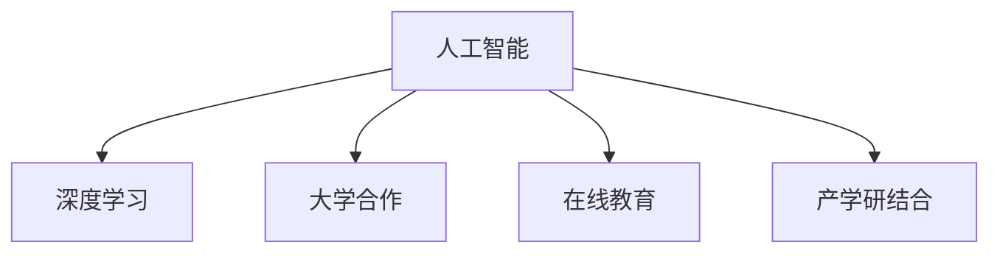

                 

# Google的AI教育布局:大学合作和在线教育

## 1. 背景介绍

近年来，人工智能(AI)技术迅速发展，成为推动社会进步的重要力量。然而，AI教育的普及和人才的培养仍面临诸多挑战。Google作为全球领先的科技公司，一直以来致力于推动AI教育的发展，通过与各大高校合作和在线教育平台，打造了一条贯穿大学教育全链条的教育布局，旨在培养更多AI领域的人才。

### 1.1 问题由来

AI技术应用广泛，从医疗、金融到智能制造，每个领域都需要大量具备AI技能的专业人才。然而，当前AI教育体系存在诸多问题，如课程内容更新滞后、师资力量不足、实践机会有限等，阻碍了AI人才的培养。

### 1.2 问题核心关键点

Google的AI教育布局核心在于以下几个关键点：
- **大学合作**：与全球顶尖大学合作，提供先进的AI课程和研究平台，培养高质量的AI人才。
- **在线教育**：通过Google的在线教育平台，提供大规模、灵活的AI课程和项目，打破地域和时间限制，让更多人有机会学习AI知识。
- **产业对接**：与企业合作，提供实习和就业机会，促进产学研结合，提升AI教育的实用性。

## 2. 核心概念与联系

### 2.1 核心概念概述

为更好地理解Google的AI教育布局，本节将介绍几个密切相关的核心概念：

- **人工智能(AI)**：使用计算机和数据科学技术，赋予机器智能能力，能够模拟、延伸和扩展人类智能。
- **深度学习(Deep Learning)**：基于神经网络的机器学习方法，能够处理大规模复杂数据，自动发现数据中的模式和规律。
- **大学合作**：与顶尖大学合作，共享科研资源，联合培养AI人才。
- **在线教育**：通过网络平台，提供灵活、大规模的教育资源，让更多人接受高质量教育。
- **产学研结合**：企业与学术界、研究机构的合作，促进科研成果向实际应用转化。

这些概念之间的逻辑关系可以通过以下Mermaid流程图来展示：



这个流程图展示了大语言模型的核心概念及其之间的关系：

1. 人工智能是深度学习和其它AI技术的总称，大学合作和在线教育是AI教育的两种主要方式。
2. 产学研结合是AI教育与工业界的桥梁，通过联合培养和应用实践，提升AI人才的实际能力。

## 3. 核心算法原理 & 具体操作步骤
### 3.1 算法原理概述

Google的AI教育布局，主要通过与大学和在线教育平台的深度合作，提供高质量的AI课程和实践机会，培养AI人才。核心算法原理包括以下几个方面：

1. **课程设计**：基于最新的AI研究成果和应用实践，设计高质量、实战导向的课程内容。
2. **联合培养**：与全球顶尖大学合作，提供科研资源和导师指导，联合培养高素质的AI人才。
3. **实践机会**：通过与企业的深度合作，提供实习和就业机会，将理论与实践结合，提升学生应用能力。
4. **在线教育**：通过Google的在线教育平台，提供大规模、灵活的教育资源，让更多人能够接受高质量AI教育。

### 3.2 算法步骤详解

Google的AI教育布局步骤主要包括：

**Step 1: 选择合作大学**
- 根据AI教育需求，选择全球顶尖的大学，如斯坦福大学、麻省理工学院、清华大学等。
- 建立合作关系，提供科研资金、设备和导师资源，联合培养AI人才。

**Step 2: 设计课程内容**
- 与大学联合设计课程，包括深度学习、机器视觉、自然语言处理、强化学习等AI核心课程。
- 设计实验和项目，结合真实应用场景，提升学生实践能力。

**Step 3: 提供在线资源**
- 通过Google的在线教育平台，提供免费的AI课程、实验教程和项目案例。
- 利用Google Cloud Platform和TensorFlow等工具，提供丰富的AI开发环境。

**Step 4: 提供实践机会**
- 与企业合作，提供AI实习和就业机会，将学生引入实际应用场景，提升应用能力。
- 建立产业对接平台，帮助学生和企业对接，促进产学研结合。

**Step 5: 评估和反馈**
- 通过在线教育平台收集学生反馈，优化课程和资源。
- 定期评估AI教育效果，提升课程质量和实际应用能力。

### 3.3 算法优缺点

Google的AI教育布局主要优点包括：
1. **高质量资源**：与顶尖大学合作，提供高质量的AI课程和科研资源，提升教育质量。
2. **大规模覆盖**：通过在线教育平台，打破地域限制，提供大规模、灵活的教育资源。
3. **产学研结合**：与企业合作，提供实习和就业机会，提升学生应用能力，促进产学研结合。
4. **持续改进**：通过收集学生反馈，定期评估教育效果，持续改进课程和资源。

同时，该布局也存在一些缺点：
1. **课程更新缓慢**：大学课程设计周期较长，可能无法跟上AI领域的快速变化。
2. **师资力量不足**：顶尖大学师资力量有限，无法大规模培养AI人才。
3. **线上教育效果不佳**：在线课程缺乏面对面交流，可能影响学生学习效果。
4. **企业对接困难**：企业对接平台可能存在信息不对称，学生和企业对接难度较大。

尽管存在这些局限，但就目前而言，Google的AI教育布局已成为AI教育的重要范式，为AI人才的培养和产业对接提供了有力支持。

### 3.4 算法应用领域

Google的AI教育布局，主要应用于以下几个领域：

1. **AI本科教育**：通过与大学合作，提供高质量的AI本科课程，培养AI领域的基础人才。
2. **AI研究生教育**：与大学联合设计高层次AI课程，培养AI领域的高端人才。
3. **AI在线教育**：通过Google在线教育平台，提供大规模、灵活的AI课程，普及AI知识。
4. **AI实习就业**：与企业合作，提供实习和就业机会，提升学生实际应用能力。

## 4. 数学模型和公式 & 详细讲解 & 举例说明

### 4.1 数学模型构建

在AI教育布局中，课程设计、评估和反馈都需要用到数学模型。以下是几个核心数学模型：

1. **课程效果评估模型**：评估AI课程的教育效果，包括知识掌握情况和应用能力。
2. **学生反馈模型**：收集学生对课程和资源的反馈，用于课程改进和优化。
3. **学生实习效果评估模型**：评估学生在企业实习期间的表现和应用能力。

### 4.2 公式推导过程

以课程效果评估模型为例，设 $x_i$ 为第 $i$ 个学生的知识掌握情况，$y_i$ 为应用能力，$w_i$ 为权重。则评估模型为：

$$
\mathcal{E} = \sum_{i=1}^N w_i f(x_i, y_i)
$$

其中 $f(x_i, y_i)$ 为评估函数，可以是知识掌握情况和应用能力的加权平均，也可以是对应用能力的单独评估。

### 4.3 案例分析与讲解

假设某大学提供深度学习课程，学生成绩和项目评分分别如下：

| 学生编号 | 知识掌握情况 | 应用能力 | 权重 |
| --------- | ------------ | -------- | ---- |
| 1         | 90           | 85       | 0.7  |
| 2         | 80           | 95       | 0.3  |
| ...       | ...          | ...      | ...  |

则课程效果评估为：

$$
\mathcal{E} = 0.7 \times 90 + 0.3 \times 80 + \cdots
$$

其中权重 $w_i$ 反映了不同维度的重要性和评估标准。

## 5. 项目实践：代码实例和详细解释说明
### 5.1 开发环境搭建

在进行AI教育布局的实践时，我们需要准备好开发环境。以下是使用Python进行Google Cloud AI教育的开发环境配置流程：

1. 安装Anaconda：从官网下载并安装Anaconda，用于创建独立的Python环境。

2. 创建并激活虚拟环境：
```bash
conda create -n ai-env python=3.8 
conda activate ai-env
```

3. 安装必要的Python库：
```bash
pip install google-cloud-aiplatform google-cloud-translate
```

4. 设置Google Cloud SDK环境变量：
```bash
export GOOGLE_APPLICATION_CREDENTIALS=/path/to/your/service-account-key.json
```

5. 初始化Google Cloud SDK：
```bash
gcloud init
```

完成上述步骤后，即可在`ai-env`环境中开始AI教育的项目实践。

### 5.2 源代码详细实现

下面我们以AI本科教育为例，给出使用Google Cloud AI教育的PyTorch代码实现。

首先，定义学生信息类：

```python
class Student:
    def __init__(self, name, knowledge, ability):
        self.name = name
        self.knowledge = knowledge
        self.ability = ability
```

然后，定义课程评估函数：

```python
def course_evaluation(student):
    return student.knowledge * 0.7 + student.ability * 0.3
```

接着，定义学生列表和课程评分：

```python
students = [
    Student('Alice', 90, 85),
    Student('Bob', 80, 95),
    ...
]
scores = [course_evaluation(s) for s in students]
```

最后，输出课程效果评估：

```python
total_score = sum(scores)
print(f"Course Evaluation: {total_score / len(scores):.2f}")
```

以上就是使用PyTorch对AI本科教育进行评估的完整代码实现。可以看到，利用Python和Google Cloud SDK，可以方便地实现AI教育的量化评估。

### 5.3 代码解读与分析

让我们再详细解读一下关键代码的实现细节：

**Student类**：
- `__init__`方法：初始化学生姓名、知识掌握情况和应用能力。

**course_evaluation函数**：
- 定义评估函数，将知识掌握情况和应用能力按照权重进行加权平均。

**学生列表和课程评分**：
- 使用列表推导式，对每个学生进行评估，生成评分列表。

**输出课程效果评估**：
- 计算平均评分，输出课程效果评估结果。

可以看到，利用Python和Google Cloud SDK，可以方便地实现AI教育的量化评估。开发者可以将更多精力放在课程设计、评估指标等高层逻辑上，而不必过多关注底层的实现细节。

当然，工业级的系统实现还需考虑更多因素，如学生信息管理、课程动态更新等。但核心的教育评估思路基本与此类似。

## 6. 实际应用场景
### 6.1 智能制造

Google的AI教育布局，在智能制造领域也有着广泛应用。智能制造要求生产过程中高度自动化、智能化，需要大量具备AI能力的工程师。通过Google的AI教育布局，可以培养具备AI知识的工程师，提升智能制造的智能化水平，减少人工干预，提高生产效率。

具体而言，可以与大学合作，开设AI在智能制造中的相关课程，如基于机器学习的故障诊断、预测维护、质量控制等。通过在线教育平台，普及AI知识，吸引更多学生进入智能制造领域。同时，与企业合作，提供实习和就业机会，促进学生将所学知识应用于实际生产中。

### 6.2 智慧医疗

AI在医疗领域的应用越来越广泛，如医学影像分析、疾病预测、个性化治疗等。然而，医疗领域专业性强，对AI工程师的需求量巨大。Google的AI教育布局，可以为医疗领域培养具备AI知识的专业人才，提升医疗服务的智能化水平。

具体而言，可以与医学类大学合作，开设AI在医学中的应用课程，如基于深度学习的医学影像分析、自然语言处理在病历分析中的应用等。通过在线教育平台，普及AI知识，吸引更多学生进入医疗领域。同时，与医院合作，提供实习和就业机会，促进学生将所学知识应用于医疗实践中。

### 6.3 智慧交通

智能交通系统需要大量的AI工程师进行数据分析和系统开发。Google的AI教育布局，可以为交通领域培养具备AI知识的专业人才，提升交通系统的智能化水平，优化交通管理和出行体验。

具体而言，可以与交通类大学合作，开设AI在交通中的应用课程，如基于深度学习的交通流量预测、自动驾驶技术等。通过在线教育平台，普及AI知识，吸引更多学生进入交通领域。同时，与交通管理部门合作，提供实习和就业机会，促进学生将所学知识应用于交通实践中。

## 7. 工具和资源推荐
### 7.1 学习资源推荐

为了帮助开发者系统掌握AI教育布局的理论基础和实践技巧，这里推荐一些优质的学习资源：

1. Google Cloud AI教育的官方文档：提供了完整的AI教育框架和教程，涵盖课程设计、评估、实践等多个方面，是入门学习的绝佳资源。

2. Coursera的AI课程：由Google和顶尖大学联合开设的AI课程，内容丰富，涵盖从基础到高级的AI知识，适合不同层次的学习者。

3. TensorFlow的官方文档：提供了完整的TensorFlow学习资料，包括TensorFlow的API使用、深度学习模型构建等，适合学习深度学习技术。

4. AI for Everyone的课程：由Google与密歇根大学联合开设的入门级AI课程，通俗易懂，适合零基础的学习者。

5. Deep Learning with PyTorch的书籍：由Google大牛撰写的PyTorch深度学习书籍，详细讲解了PyTorch的使用和深度学习模型构建，适合深入学习。

通过对这些资源的学习实践，相信你一定能够快速掌握AI教育的精髓，并用于解决实际的AI问题。

### 7.2 开发工具推荐

高效的开发离不开优秀的工具支持。以下是几款用于AI教育布局开发的常用工具：

1. Google Cloud Platform：Google云平台，提供丰富的AI开发环境，包括TensorFlow、Cloud AI Platform等，是进行AI教育布局开发的必备工具。

2. Jupyter Notebook：Jupyter Notebook是一个交互式编程环境，可以方便地进行代码编写和数据可视化，适合AI教育布局的实践和研究。

3. Colab：Google Colab是一个在线Jupyter Notebook环境，提供免费的GPU算力，方便开发者快速实验最新模型。

4. TensorBoard：TensorBoard是TensorFlow配套的可视化工具，可实时监测模型训练状态，提供丰富的图表呈现方式，是调试模型的得力助手。

5. Google Cloud AI Platform：Google云AI平台，提供大规模分布式训练和推理服务，适合处理大规模AI教育任务。

合理利用这些工具，可以显著提升AI教育布局的开发效率，加快创新迭代的步伐。

### 7.3 相关论文推荐

AI教育布局的发展源于学界的持续研究。以下是几篇奠基性的相关论文，推荐阅读：

1. How to Teach AI: Overview of AI Education and Training Approaches：介绍AI教育的多种方法和手段，帮助开发者选择最适合的教育方式。

2. AI for Everyone: Learning from the TensorFlow and Google Experience：总结了Google在AI教育方面的经验，提供实用的教学建议。

3. Deep Learning Specialization by Andrew Ng：Andrew Ng教授的深度学习课程，涵盖深度学习基础、卷积神经网络、循环神经网络等内容，适合深入学习。

4. Advances in Artificial Intelligence Education：综述了AI教育的研究进展，包括课程设计、教学方法、评估工具等，提供丰富的学术资源。

这些论文代表了大语言模型微调技术的发展脉络。通过学习这些前沿成果，可以帮助研究者把握学科前进方向，激发更多的创新灵感。

## 8. 总结：未来发展趋势与挑战
### 8.1 总结

本文对Google的AI教育布局进行了全面系统的介绍。首先阐述了AI教育布局的背景和意义，明确了大学合作和在线教育在AI教育中的核心地位。其次，从原理到实践，详细讲解了AI教育布局的数学模型和操作步骤，给出了AI教育布局的完整代码实例。同时，本文还广泛探讨了AI教育布局在智能制造、智慧医疗、智慧交通等多个领域的应用前景，展示了AI教育布局的巨大潜力。此外，本文精选了AI教育布局的相关学习资源，力求为开发者提供全方位的技术指引。

通过本文的系统梳理，可以看到，Google的AI教育布局正在成为AI教育的重要范式，极大地拓展了AI教育的范围和深度，为AI人才的培养和应用提供了有力支持。相信随着AI技术的不断发展，AI教育布局必将在更多的领域中发挥作用，推动AI技术的普及和应用。

### 8.2 未来发展趋势

展望未来，Google的AI教育布局将呈现以下几个发展趋势：

1. **课程内容更新**：AI领域的快速发展，要求课程内容不断更新，引入最新的AI研究成果和应用实践，提升课程的实用性和前沿性。

2. **全球化合作**：与全球顶尖大学和研究机构合作，共同开发高质量的AI课程和科研资源，提升AI教育的国际化水平。

3. **在线教育普及**：通过Google的在线教育平台，提供大规模、灵活的教育资源，打破地域限制，让更多人接受高质量AI教育。

4. **产学研结合深化**：与更多企业合作，提供实习和就业机会，促进产学研结合，提升学生的实际应用能力。

5. **AI教育自动化**：引入自动化教学工具和AI技术，提升AI教育的智能化水平，降低教学成本，提高教学效率。

以上趋势凸显了Google的AI教育布局的广阔前景。这些方向的探索发展，必将进一步提升AI教育的质量和覆盖面，为AI人才的培养和应用提供更多支持。

### 8.3 面临的挑战

尽管Google的AI教育布局已经取得了瞩目成就，但在迈向更加智能化、普适化应用的过程中，它仍面临着诸多挑战：

1. **课程更新难度**：大学课程设计周期较长，可能无法跟上AI领域的快速变化。如何动态调整课程内容，引入最新的AI研究成果，仍是一个难题。

2. **师资力量不足**：顶尖大学师资力量有限，难以大规模培养AI人才。如何通过在线教育平台，提升师资力量，优化教学效果，仍需持续努力。

3. **线上教育效果不佳**：在线课程缺乏面对面交流，可能影响学生学习效果。如何提升在线教育的互动性和沉浸感，仍是一个挑战。

4. **企业对接困难**：企业对接平台可能存在信息不对称，学生和企业对接难度较大。如何建立更高效的企业对接机制，促进学生就业，仍需进一步优化。

尽管存在这些挑战，但就目前而言，Google的AI教育布局已成为AI教育的重要范式，为AI人才的培养和应用提供了有力支持。

### 8.4 研究展望

面向未来，Google的AI教育布局需要在以下几个方面寻求新的突破：

1. **课程内容更新**：引入自动化和AI技术，动态调整课程内容，引入最新的AI研究成果和应用实践。

2. **在线教育改进**：提升在线教育的互动性和沉浸感，引入虚拟现实、增强现实等技术，提升学习效果。

3. **师资力量提升**：通过在线教育平台，吸引全球顶级师资，优化教学效果。

4. **企业对接优化**：建立更高效的企业对接机制，帮助学生快速找到合适的实习和就业机会。

这些研究方向的探索，必将引领Google的AI教育布局迈向更高的台阶，为AI人才的培养和应用提供更多支持。相信随着学界和产业界的共同努力，这些挑战终将一一被克服，Google的AI教育布局必将在构建人机协同的智能时代中扮演越来越重要的角色。

## 9. 附录：常见问题与解答

**Q1：Google的AI教育布局是否适用于所有AI领域？**

A: Google的AI教育布局主要聚焦于通用AI教育，涵盖深度学习、机器视觉、自然语言处理、强化学习等多个领域。然而，对于一些特定领域，如生物信息学、金融科技等，需要进一步开发特定领域的AI教育课程。

**Q2：AI教育布局中如何引入企业资源？**

A: Google的AI教育布局中，企业资源可以通过合作项目、实习计划、就业机会等多种方式引入。例如，与企业合作开发实际应用项目，邀请企业专家进行讲座和指导，建立企业对接平台等。

**Q3：如何评估AI教育的效果？**

A: AI教育效果的评估可以通过多种方式进行，包括课程效果的数学模型评估、学生反馈的问卷调查、实习效果的绩效评估等。综合考虑多个维度的评估指标，可以全面衡量AI教育的效果。

**Q4：AI教育布局中如何提升师资力量？**

A: 通过在线教育平台，可以邀请全球顶尖的AI专家和教授进行课程设计和指导。同时，也可以建立师资培训机制，提升现有教师的AI技能和教学能力。

**Q5：AI教育布局中如何提高在线教育的互动性？**

A: 引入虚拟现实、增强现实等技术，提升在线教育的互动性和沉浸感。同时，可以通过在线讨论、实时问答等方式，增加师生之间的互动和交流。

---

作者：禅与计算机程序设计艺术 / Zen and the Art of Computer Programming

