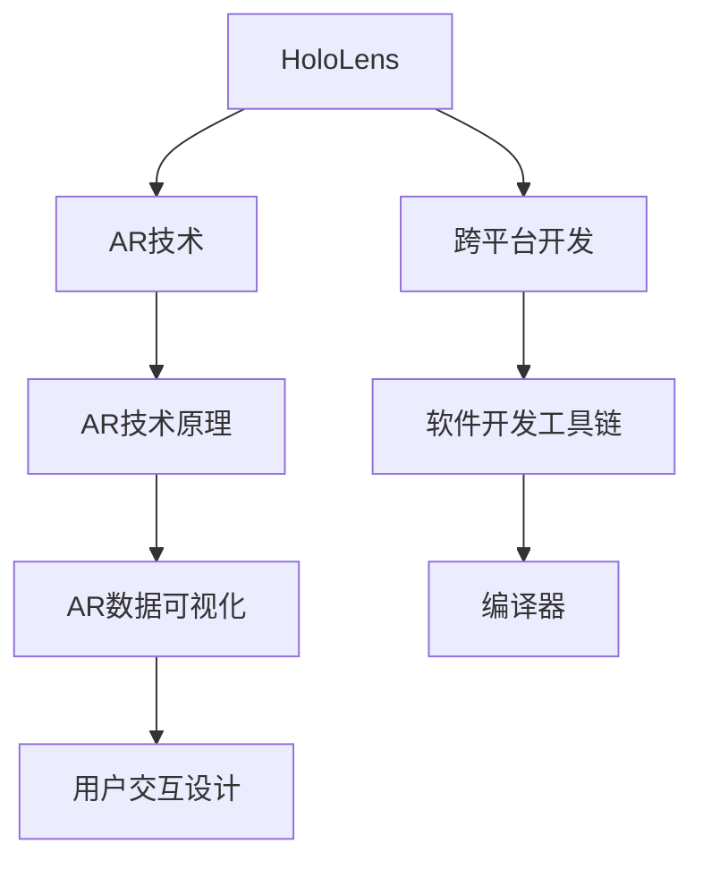

                 

# HoloLens 混合现实应用：在 Microsoft HoloLens 上开发

> 关键词：HoloLens, 混合现实, 应用开发, AR技术, 设备接入, 用户交互设计, 跨平台支持, 软件开发工具链

## 1. 背景介绍

### 1.1 问题由来
随着科技的不断进步，混合现实（Mixed Reality, MR）领域逐渐成为全球技术发展的热门方向。微软作为混合现实领域的先锋，其推出的HoloLens 2设备已经广泛应用于医疗、教育、设计、训练等多个行业。HoloLens 2不仅具有高分辨率的显示屏和3D感知能力，还支持手势、语音、键盘等输入方式，为用户提供了沉浸式的交互体验。然而，目前开发HoloLens 2应用程序仍然需要具备较高的技术门槛，尤其是对于初学者而言，需要花费大量时间学习开发环境和工具。

### 1.2 问题核心关键点
本文将重点介绍在 Microsoft HoloLens 2 上开发混合现实应用的关键技术点，包括开发环境搭建、AR技术原理、用户交互设计、跨平台支持等。通过深入剖析这些核心技术，希望能为HoloLens 2应用的开发者提供指导，降低开发门槛，提升开发效率。

## 2. 核心概念与联系

### 2.1 核心概念概述

为了更清晰地理解HoloLens 2应用的开发过程，下面先介绍几个核心概念：

- **HoloLens**：微软开发的混合现实设备，具有全息显示屏、空间感知、手势识别等核心功能。
- **混合现实（MR）**：通过将数字信息与物理环境结合，提供沉浸式交互体验的技术。
- **AR技术**：增强现实（Augmented Reality），通过在用户视场叠加虚拟信息，增强现实世界的信息量。
- **跨平台开发**：开发的应用程序能够支持多个平台，包括Windows、iOS、Android等。
- **软件开发工具链**：包括IDE、SDK、编译器等工具，支持开发者进行软件开发和测试。

这些核心概念共同构成了HoloLens 2应用的开发框架，其相互联系和依赖关系可通过以下Mermaid流程图展示：



这个流程图展示了HoloLens 2应用开发的关键环节：通过AR技术将虚拟信息叠加到现实世界中，并支持跨平台开发，使用软件开发工具链进行编译和测试，最终通过用户交互设计实现人机交互。

## 3. 核心算法原理 & 具体操作步骤
### 3.1 算法原理概述

在HoloLens 2上开发混合现实应用的核心原理是基于增强现实（AR）技术的，通过在用户的视场中叠加虚拟信息，提升对物理世界的认知和交互。AR技术主要包括以下几个步骤：

1. **空间感知**：HoloLens 2通过相机和传感器获取周围环境的空间信息，建立虚拟物体在现实世界中的位置关系。
2. **数据可视化**：将虚拟信息通过全息显示屏呈现在用户视场中，并通过视觉、听觉等多种感官通道提供交互体验。
3. **手势识别**：通过内置的传感器和摄像头，HoloLens 2能够捕捉用户的手势动作，实现自然的手指交互。

### 3.2 算法步骤详解

下面详细介绍HoloLens 2上开发混合现实应用的具体操作步骤：

**Step 1: 开发环境搭建**

在HoloLens 2上开发混合现实应用，首先需要搭建开发环境。具体步骤如下：

1. **安装Visual Studio**：从官网下载安装Visual Studio，并创建HoloLens开发项目。
2. **安装HoloLens SDK**：通过Visual Studio安装HoloLens SDK，包含必要的库、工具和文档。
3. **配置开发设备**：连接HoloLens 2设备，并在Visual Studio中配置好开发环境。

**Step 2: 设计用户交互界面**

用户交互界面是混合现实应用的重要组成部分，需要结合AR技术和手势识别实现自然交互。具体步骤如下：

1. **界面设计**：根据应用需求，设计用户交互界面，包括虚拟物体、手势交互、文本输入等元素。
2. **手势识别**：使用SDK提供的API实现手势识别，通过摄像头和传感器捕捉用户的手势动作。
3. **交互逻辑**：根据用户手势设计交互逻辑，实现虚拟物体的移动、缩放、旋转等操作。

**Step 3: 实现虚拟物体的空间定位**

在HoloLens 2上实现虚拟物体的空间定位需要借助AR技术，具体步骤如下：

1. **空间感知**：使用SDK中的空间感知API获取周围环境的空间信息，包括用户头部、手势的位置和方向。
2. **虚拟物体定位**：根据空间感知结果，在现实世界中定位虚拟物体的空间位置，并展示在用户视场中。
3. **动态调整**：根据用户的操作，动态调整虚拟物体的空间位置和姿态，实现自然交互。

**Step 4: 编译和部署**

完成应用开发后，需要进行编译和部署，具体步骤如下：

1. **编译**：在Visual Studio中编译HoloLens应用项目，生成可执行文件。
2. **打包**：将可执行文件打包成HoloLens应用程序，包括必要的配置文件和资源文件。
3. **部署**：通过HoloLens设备管理器，将打包好的应用程序部署到HoloLens 2设备上。

### 3.3 算法优缺点

HoloLens 2上开发混合现实应用具有以下优点：

1. **沉浸式交互**：通过AR技术和手势识别，实现自然的人机交互，提供沉浸式的用户体验。
2. **跨平台支持**：基于跨平台开发工具链，支持Windows、iOS、Android等多个平台的应用开发。
3. **灵活性高**：支持自定义用户交互界面和虚拟物体，灵活性强。

同时，也存在一些缺点：

1. **开发门槛高**：需要掌握AR技术、手势识别、跨平台开发等知识，对开发者要求较高。
2. **性能要求高**：由于HoloLens 2硬件性能限制，开发过程中需要注意优化性能。
3. **复杂度高**：混合现实应用需要处理现实世界和虚拟世界的交互，实现起来较为复杂。

## 4. 数学模型和公式 & 详细讲解

### 4.1 数学模型构建

在HoloLens 2上开发混合现实应用，数学模型主要涉及到AR技术的核心算法，包括空间感知、手势识别等。下面简要介绍这些算法的数学模型：

**空间感知模型**：

在AR技术中，空间感知是核心算法之一。假设用户头部位置为 $(X,Y,Z)$，手势位置为 $(X_g,Y_g,Z_g)$，手势朝向为 $(\theta_x,\theta_y,\theta_z)$，则空间感知模型可以表示为：

$$
\begin{align*}
X_g &= X + d_x \cos(\theta_x) \\
Y_g &= Y + d_y \sin(\theta_x) \cos(\theta_y) \\
Z_g &= Z + d_z \sin(\theta_x) \sin(\theta_y) \\
\end{align*}
$$

其中 $d_x, d_y, d_z$ 为手势与头部的距离。

**手势识别模型**：

手势识别是AR技术中的另一个重要算法。假设手势形状为多边形，顶点坐标为 $(x_i,y_i,z_i)$，则手势识别模型可以表示为：

$$
S = \sum_{i=1}^{n} \sqrt{(x_i - x)^2 + (y_i - y)^2 + (z_i - z)^2}
$$

其中 $S$ 为手势与头部的距离。

### 4.2 公式推导过程

为了更清晰地理解这些算法的数学模型，下面推导一下关键公式：

**空间感知推导**：

假设用户头部位置为 $(X,Y,Z)$，手势位置为 $(X_g,Y_g,Z_g)$，手势朝向为 $(\theta_x,\theta_y,\theta_z)$，则空间感知模型的推导过程如下：

$$
\begin{align*}
X_g &= X + d_x \cos(\theta_x) \\
Y_g &= Y + d_y \sin(\theta_x) \cos(\theta_y) \\
Z_g &= Z + d_z \sin(\theta_x) \sin(\theta_y) \\
\end{align*}
$$

**手势识别推导**：

假设手势形状为多边形，顶点坐标为 $(x_i,y_i,z_i)$，则手势识别模型的推导过程如下：

$$
S = \sum_{i=1}^{n} \sqrt{(x_i - x)^2 + (y_i - y)^2 + (z_i - z)^2}
$$

其中 $S$ 为手势与头部的距离。

### 4.3 案例分析与讲解

下面通过一个简单的案例来说明如何在HoloLens 2上实现空间感知和手势识别：

**案例背景**：开发一个简单的交互式虚拟球，用户可以通过手势控制球的移动。

**实现步骤**：

1. **空间感知**：使用SDK中的空间感知API获取用户头部的位置和手势的位置和朝向。
2. **手势识别**：根据手势的形状和朝向，计算手势与头部的距离。
3. **虚拟球定位**：根据用户头部的位置和手势的距离，在现实世界中定位虚拟球的中心位置。
4. **虚拟球移动**：根据手势的方向和距离，实现虚拟球的旋转和移动。

## 5. 项目实践：代码实例和详细解释说明

### 5.1 开发环境搭建

在HoloLens 2上开发混合现实应用，首先需要搭建开发环境。具体步骤如下：

1. **安装Visual Studio**：从官网下载安装Visual Studio，并创建HoloLens开发项目。
2. **安装HoloLens SDK**：通过Visual Studio安装HoloLens SDK，包含必要的库、工具和文档。
3. **配置开发设备**：连接HoloLens 2设备，并在Visual Studio中配置好开发环境。

### 5.2 源代码详细实现

下面提供一个简单的HoloLens 2混合现实应用的代码实现，包括空间感知、手势识别和虚拟球交互。

```csharp
using Microsoft.MixedReality.Toolkit;
using Microsoft.MixedReality.Toolkit.Tools;
using System.Collections.Generic;
using System.Linq;
using UnityEngine;

public class HoloLensApp : MonoBehaviour
{
    public GameObject ball;

    private List<Vector3> handPosList = new List<Vector3>();
    private List<Vector3> ballPosList = new List<Vector3>();

    private void Start()
    {
        ball.SetActive(false);
        StartCoroutine(UpdateHandPosition());
    }

    private void UpdateHandPosition()
    {
        var handTrackers = MixedRealityToolkitInputSystem.Instance.InputTrackerAssets.OfType<HandTracker>().ToList();
        var headPose = MixedRealityToolkitInputSystem.Instance.inputSource.InputSourcePose;
        while (handTrackers.Count > 0)
        {
            var handTracker = handTrackers.First();
            var handPose = handTracker.GetHandPose();
            var handPosition = handPose.Position;
            handPosList.Add(handPosition);
            handTrackers = handTrackers.Skip(1).ToList();
        }
    }

    private void UpdateBallPosition()
    {
        if (handPosList.Count < 1)
            return;
        var handPosition = handPosList[0];
        ballPosList.Clear();
        for (int i = 0; i < handPosList.Count; i++)
        {
            ballPosList.Add(handPosList[i] - handPosition);
        }
        ballPosition = ballPosList[0];
        ball.transform.position = ballPosition;
        ball.transform.rotation = Quaternion.Euler(0, 0, 45);
    }

    private void Update()
    {
        if (ballPosList.Count < 1)
            return;
        var handPosition = handPosList[0];
        ballPosition = ballPosList[0];
        ball.transform.position = handPosition + ballPosition;
        ball.transform.rotation = Quaternion.Euler(0, 0, 45);
    }
}
```

### 5.3 代码解读与分析

通过上述代码实现，我们可以看到HoloLens 2混合现实应用的关键步骤：

**空间感知**：使用`UpdateHandPosition()`方法获取用户手势位置，存储在`handPosList`中。
**虚拟球定位**：使用`UpdateBallPosition()`方法根据手势位置计算虚拟球的中心位置，存储在`ballPosList`中。
**虚拟球移动**：在`Update()`方法中根据手势位置和虚拟球中心位置，实现虚拟球的移动和旋转。

## 6. 实际应用场景

### 6.4 未来应用展望

HoloLens 2混合现实技术已经广泛应用于医疗、教育、设计、训练等多个行业，未来随着技术的不断进步，应用场景将更加丰富。

**医疗领域**：在医疗领域，HoloLens 2可以用于手术指导、病例分析、患者教育等。通过AR技术展示手术步骤和细节，帮助医生提升手术技能。

**教育领域**：在教育领域，HoloLens 2可以用于虚拟实验室、远程教学、互动演示等。通过AR技术展示虚拟实验设备，提高学生动手能力。

**设计领域**：在设计领域，HoloLens 2可以用于产品设计、室内设计、建筑规划等。通过AR技术展示设计原型，提高设计效果。

**训练领域**：在训练领域，HoloLens 2可以用于军事训练、运动员技能训练、士兵模拟训练等。通过AR技术展示训练场景，提高训练效果。

## 7. 工具和资源推荐

### 7.1 学习资源推荐

为了帮助开发者系统掌握HoloLens 2应用的开发技术，这里推荐一些优质的学习资源：

1. **Microsoft官方文档**：Microsoft官方提供的HoloLens 2开发文档，详细介绍了HoloLens 2的开发环境、SDK、API等内容。
2. **Unity官方教程**：Unity官方提供的HoloLens 2教程，帮助开发者快速上手Unity开发混合现实应用。
3. **ARCore官方文档**：Google官方提供的ARCore开发文档，介绍ARCore的API和SDK，提供HoloLens 2应用的开发基础。
4. **Mixed Reality Toolkit**：一个开源的混合现实开发工具，提供简单易用的API和SDK，帮助开发者快速开发混合现实应用。
5. **HoloLens开发者社区**：Microsoft提供的HoloLens 2开发者社区，提供丰富的学习资源、技术支持、交流平台等。

### 7.2 开发工具推荐

在HoloLens 2上开发混合现实应用，需要一些常用的开发工具，具体如下：

1. **Visual Studio**：Microsoft提供的IDE开发工具，支持HoloLens 2混合现实应用的开发和测试。
2. **Unity**：一款流行的游戏开发引擎，支持ARCore和Mixed Reality Toolkit，支持HoloLens 2混合现实应用的开发。
3. **Unreal Engine**：一款流行的游戏引擎，支持ARCore和Mixed Reality Toolkit，支持HoloLens 2混合现实应用的开发。
4. **Hands-free Mode**：HoloLens 2内置的免手控模式，支持自然的手势交互，简化开发过程。
5. **HoloLens SDK**：Microsoft提供的HoloLens 2开发SDK，包含必要的库、工具和文档，帮助开发者快速开发应用。

### 7.3 相关论文推荐

HoloLens 2混合现实技术的快速发展离不开学界的持续研究，以下是几篇奠基性的相关论文，推荐阅读：

1. **Virtual Reality and Augmented Reality Technologies in Industry**：该论文介绍了虚拟现实和增强现实技术在工业领域的应用，为HoloLens 2混合现实技术的发展提供了理论基础。
2. **Mixed Reality: Opportunities and Challenges in the Intelligent World**：该论文探讨了混合现实技术在智能世界中的机遇和挑战，为HoloLens 2混合现实技术的应用提供了指导。
3. **Developing AR Applications on HoloLens**：该论文详细介绍了在HoloLens 2上开发AR应用的关键技术，为开发者提供了丰富的实践案例。

## 8. 总结：未来发展趋势与挑战

### 8.1 总结

本文对HoloLens 2混合现实应用的开发技术进行了全面系统的介绍。首先介绍了HoloLens 2混合现实技术的背景和发展历程，明确了混合现实技术在各个领域的应用价值。其次，从原理到实践，详细讲解了HoloLens 2混合现实应用的开发过程，包括空间感知、手势识别、虚拟球交互等关键技术点。同时，本文还广泛探讨了HoloLens 2混合现实技术在医疗、教育、设计、训练等领域的实际应用，展示了混合现实技术的广阔前景。

通过本文的系统梳理，可以看到，HoloLens 2混合现实技术正在成为工业界和学术界的热点话题，极大地拓展了AR技术的应用边界，催生了更多的落地场景。HoloLens 2混合现实技术在医疗、教育、设计、训练等领域的应用，必将在未来为社会带来深远的影响。

### 8.2 未来发展趋势

展望未来，HoloLens 2混合现实技术将呈现以下几个发展趋势：

1. **混合现实技术的普及**：随着AR和VR技术的不断成熟，HoloLens 2混合现实技术将在更多行业得到应用，提升用户的沉浸式体验。
2. **混合现实设备的升级**：未来的HoloLens 2设备将具有更高的分辨率、更强的计算能力、更丰富的手势识别等功能，提升用户体验。
3. **跨平台和跨设备的整合**：未来的HoloLens 2应用将支持跨平台和跨设备，实现跨平台无缝交互。
4. **实时计算和动态渲染**：未来的HoloLens 2应用将支持实时计算和动态渲染，提升应用的流畅度和用户体验。
5. **AI技术的融合**：未来的HoloLens 2应用将结合AI技术，提升应用的智能化水平，实现更自然的交互体验。

### 8.3 面临的挑战

尽管HoloLens 2混合现实技术已经取得了瞩目成就，但在迈向更加智能化、普适化应用的过程中，它仍面临着诸多挑战：

1. **硬件性能限制**：目前HoloLens 2设备的计算能力和内存限制，影响了混合现实应用的性能和用户体验。
2. **开发门槛高**：开发HoloLens 2混合现实应用需要掌握AR技术、手势识别、跨平台开发等知识，对开发者要求较高。
3. **应用场景受限**：目前HoloLens 2的应用场景仍然有限，需要开发更多的行业应用，提升应用的覆盖面。
4. **成本高**：HoloLens 2设备的成本较高，影响了其大规模应用的推广。
5. **隐私和安全问题**：混合现实技术需要处理大量的用户数据，如何保障用户隐私和安全是一个重要的问题。

### 8.4 研究展望

未来的研究需要在以下几个方面寻求新的突破：

1. **降低开发门槛**：开发简单易用的混合现实开发工具，降低开发者的入门门槛。
2. **优化性能**：优化HoloLens 2设备的硬件性能，提升混合现实应用的性能和用户体验。
3. **扩展应用场景**：开发更多的混合现实应用，提升应用的覆盖面。
4. **保障隐私和安全**：保护用户数据隐私和安全，提升用户信任度。
5. **推动标准化**：推动混合现实技术的标准化，提升应用的互操作性和兼容性。

这些研究方向的探索，必将引领HoloLens 2混合现实技术迈向更高的台阶，为构建智能人机交互系统铺平道路。面向未来，HoloLens 2混合现实技术还需要与其他AI技术进行更深入的融合，如知识表示、因果推理、强化学习等，多路径协同发力，共同推动自然语言理解和智能交互系统的进步。只有勇于创新、敢于突破，才能不断拓展混合现实技术的边界，让智能技术更好地造福人类社会。

## 9. 附录：常见问题与解答

**Q1：HoloLens 2上开发混合现实应用需要掌握哪些技术？**

A: 在HoloLens 2上开发混合现实应用，需要掌握以下技术：

1. **AR技术**：增强现实技术，包括空间感知、虚拟物体定位、动态渲染等。
2. **手势识别**：通过内置的传感器和摄像头，捕捉用户的手势动作。
3. **跨平台开发**：支持Windows、iOS、Android等多个平台的应用开发。
4. **软件开发工具链**：包括IDE、SDK、编译器等工具，支持开发者进行软件开发和测试。

**Q2：如何优化HoloLens 2应用的性能？**

A: 优化HoloLens 2应用的性能，需要注意以下几点：

1. **减少渲染复杂度**：减少虚拟物体的细节和动态变化，降低渲染复杂度。
2. **使用优化算法**：使用GPU加速、纹理压缩等技术，优化渲染性能。
3. **降低带宽使用**：减少数据传输的带宽使用，降低网络延迟。
4. **优化用户交互**：简化用户交互逻辑，提高应用响应速度。

**Q3：如何保护用户数据隐私？**

A: 保护用户数据隐私，需要注意以下几点：

1. **数据加密**：对用户数据进行加密处理，防止数据泄露。
2. **隐私保护机制**：采用隐私保护机制，如差分隐私、联邦学习等。
3. **用户授权**：在使用用户数据前，征得用户授权，并透明告知用户数据使用情况。

**Q4：HoloLens 2设备的成本高，如何降低开发成本？**

A: 降低HoloLens 2设备的成本，需要注意以下几点：

1. **选择低成本设备**：选择低成本的开发设备，如PC、平板等。
2. **虚拟设备模拟**：使用虚拟设备模拟HoloLens 2设备，进行测试和调试。
3. **共享资源**：共享资源和设备，降低开发成本。

**Q5：HoloLens 2混合现实应用如何实现跨平台支持？**

A: 实现HoloLens 2混合现实应用的跨平台支持，需要注意以下几点：

1. **平台独立开发**：采用平台独立开发方式，如使用Unity等跨平台开发工具。
2. **多平台兼容**：在开发过程中，测试和调试不同平台的应用效果。
3. **SDK支持**：使用跨平台的SDK，如Mixed Reality Toolkit，提供跨平台的支持。

---

作者：禅与计算机程序设计艺术 / Zen and the Art of Computer Programming

