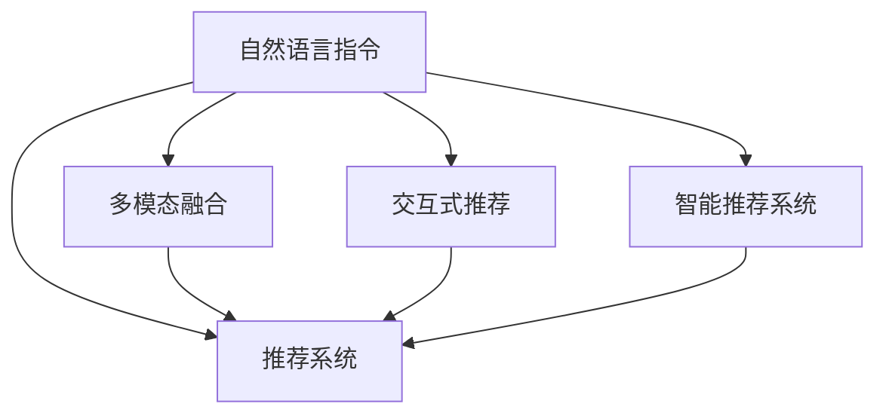

                 

# InstructRec: 自然语言指令调优推荐系统

> 关键词：自然语言指令，推荐系统，智能推荐，指令调优，多模态融合，语义理解，交互体验

## 1. 背景介绍

### 1.1 问题由来
在推荐系统的发展历程中，传统的基于协同过滤和矩阵分解的推荐方法，已经在电商、音乐、视频等多个领域取得了显著的成功。然而，这些方法往往只能处理静态的用户兴趣数据，难以适应用户的动态变化需求。同时，传统推荐系统缺乏足够的上下文理解能力，无法有效捕捉用户真实的情感、偏好等深层次信息。

为了应对这些挑战，越来越多的研究者开始探索基于深度学习的推荐方法。特别是近些年，随着自然语言处理(NLP)技术的快速发展，自然语言指令调优推荐系统(Natural Language Instruction Tuning Recommendation System, InstructRec)应运而生。这种新范式通过构建多模态融合的推荐模型，能够更好地理解用户基于自然语言指令的真实意图和偏好，从而提供更加个性化、情境化的推荐服务。

### 1.2 问题核心关键点
InstructRec系统的核心思想是：通过自然语言指令调优推荐，将用户的实时反馈转化为个性化的推荐。该系统将用户的自然语言指令作为唯一的输入，并自动将指令转换为机器可理解的形式，用于优化推荐模型。相较于传统的推荐方法，InstructRec具备以下显著特点：
1. **个性化更强**：InstructRec能实时理解用户的自然语言指令，提供更加符合用户当前需求和情境的个性化推荐。
2. **动态适应性强**：系统可以根据用户的行为反馈，动态调整推荐策略和模型参数，适应用户的不断变化需求。
3. **上下文理解更丰富**：InstructRec系统能整合文本、图像、视频等多种数据模态，更全面地理解用户的情境。
4. **用户交互体验更佳**：通过自然语言指令，用户与推荐系统之间的交互更加直观自然，提升了用户体验。

### 1.3 问题研究意义
InstructRec系统作为一种新型的推荐技术范式，有望推动推荐系统进入更加智能、个性化和可交互的新阶段。其研究意义在于：
1. **提升推荐准确性和个性化水平**：通过自然语言指令调优推荐，推荐系统可以更准确地捕捉用户的即时需求和偏好，从而提升推荐准确性和个性化水平。
2. **适应动态需求变化**：InstructRec系统能够实时响应用户的行为变化，动态调整推荐策略，满足用户动态变化的需求。
3. **增强用户体验**：通过自然语言指令，用户能够更自然地与推荐系统互动，提升用户体验和满意度。
4. **开拓新的推荐应用场景**：InstructRec系统有望拓展到更多的推荐应用场景，如内容生成、智能客服、虚拟助手等。

## 2. 核心概念与联系

### 2.1 核心概念概述

为更好地理解InstructRec系统的原理和应用，本节将介绍几个密切相关的核心概念：

- **自然语言指令(Natural Language Instruction, NLI)**：用户基于自然语言与推荐系统交互的指令，表达其需求和偏好。
- **推荐系统(Recommendation System, RS)**：通过分析和理解用户的历史行为数据，为用户推荐可能感兴趣的商品、服务或内容。
- **多模态融合(Multimodal Fusion)**：整合文本、图像、视频等多种数据模态，以更全面地理解用户的情境和需求。
- **交互式推荐(Interactive Recommendation)**：在推荐过程中融入用户实时反馈，动态调整推荐策略，提升推荐效果。
- **智能推荐系统(Intelligent Recommendation System, IRS)**：结合深度学习和自然语言处理技术，构建能够理解用户需求的推荐系统。

这些核心概念之间的逻辑关系可以通过以下Mermaid流程图来展示：



这个流程图展示了InstructRec系统的核心概念及其之间的联系：

1. 自然语言指令是用户与推荐系统交互的主要方式。
2. 推荐系统基于多模态融合的输入，提供个性化推荐。
3. 交互式推荐在推荐过程中融入用户实时反馈，动态调整推荐策略。
4. 智能推荐系统结合深度学习和自然语言处理技术，构建能够理解用户需求的推荐系统。

这些概念共同构成了InstructRec系统的基础框架，使得系统能够更准确地捕捉用户需求，提供更个性化的推荐服务。

## 3. 核心算法原理 & 具体操作步骤
### 3.1 算法原理概述

InstructRec系统的核心算法包括自然语言指令理解、多模态数据融合和推荐模型调优三个部分。其整体流程如下：

1. **自然语言指令理解**：通过自然语言处理技术，将用户的自然语言指令转换为机器可理解的形式，供推荐系统使用。
2. **多模态数据融合**：整合用户的行为数据、上下文信息等多种数据模态，生成用户的情境向量。
3. **推荐模型调优**：基于用户的情境向量，对推荐模型进行调优，生成个性化的推荐结果。

InstructRec系统利用深度学习模型，对用户的自然语言指令进行语义理解和意图识别，从而实现对用户需求的精准捕捉。同时，通过多模态数据融合技术，系统能够整合用户的多种行为数据，更全面地理解用户情境。最终，系统通过深度学习推荐模型，对推荐策略进行优化，生成个性化的推荐结果。

### 3.2 算法步骤详解

InstructRec系统的具体实现步骤如下：

**Step 1: 数据收集与预处理**
- 收集用户的历史行为数据，包括浏览、点击、评分等数据。
- 通过爬虫或API接口获取与用户相关的上下文信息，如地理位置、时间等。
- 对收集到的数据进行清洗、标注，去除噪声和不完整信息。

**Step 2: 自然语言指令理解**
- 对用户提交的自然语言指令进行分词、词性标注等处理。
- 使用深度学习模型（如BERT、GPT等）对指令进行语义理解和意图识别。
- 根据指令的语义和意图，生成用户的情境向量。

**Step 3: 多模态数据融合**
- 整合用户的行为数据、上下文信息等，生成用户的情境向量。
- 通过注意力机制等方法，对多模态数据进行融合，生成更具代表性和全面性的用户情境向量。
- 将情境向量作为推荐模型的输入。

**Step 4: 推荐模型调优**
- 基于用户的情境向量，使用深度学习推荐模型（如DNN、CNN等）进行推荐。
- 根据用户的实时反馈（如点击、评分等），对推荐模型进行在线调优，动态调整推荐策略。
- 结合用户指令理解，优化推荐模型的参数，提升推荐效果。

**Step 5: 推荐结果呈现**
- 根据推荐模型输出的结果，生成个性化的推荐列表。
- 将推荐结果呈现给用户，并提供交互式反馈机制，收集用户对推荐的满意度反馈。
- 根据用户反馈，进一步优化推荐策略和模型参数。

### 3.3 算法优缺点

InstructRec系统的优点在于：
1. **个性化强**：通过自然语言指令调优，推荐系统能够实时捕捉用户的即时需求和偏好，提供高度个性化的推荐。
2. **动态适应性强**：系统可以实时响应用户的行为变化，动态调整推荐策略，适应用户的不断变化需求。
3. **上下文理解更丰富**：系统能整合多种数据模态，更全面地理解用户的情境，提升推荐的准确性和多样性。
4. **用户体验佳**：通过自然语言指令，用户与推荐系统之间的交互更加直观自然，提升了用户体验。

系统同样存在一些缺点：
1. **模型复杂度较高**：InstructRec系统涉及多模态数据的整合和自然语言指令的理解，模型结构较为复杂，训练和推理的资源消耗较大。
2. **数据需求量大**：系统的训练和调优需要大量的用户行为数据和上下文信息，获取和处理这些数据成本较高。
3. **实时性要求高**：系统需要实时响应用户的行为变化，对模型的计算效率和响应速度要求较高。

### 3.4 算法应用领域

InstructRec系统在多个领域中具有广泛的应用前景，包括但不限于：

- **电商推荐**：通过用户的购物清单、浏览记录等自然语言指令，提供个性化的商品推荐。
- **音乐推荐**：收集用户的听歌记录和评论，根据用户描述的音乐喜好，推荐相似的歌曲。
- **视频推荐**：整合用户的观影记录和反馈，提供符合用户口味的视频推荐。
- **内容生成**：根据用户的阅读记录和反馈，生成个性化的文章、书籍推荐。
- **智能客服**：通过用户的自然语言提问，提供精准的客户服务解决方案。
- **虚拟助手**：根据用户的指令，提供个性化的任务执行和服务。

此外，InstructRec系统还具备较强的跨领域迁移能力，可以应用于更多的NLP任务和应用场景，如翻译、情感分析、问答系统等。

## 4. 数学模型和公式 & 详细讲解  
### 4.1 数学模型构建

InstructRec系统的数学模型构建主要涉及以下几个方面：

- **自然语言指令理解模型**：通过深度学习模型对自然语言指令进行语义理解和意图识别。
- **多模态融合模型**：整合多种数据模态，生成用户的情境向量。
- **推荐模型**：基于用户的情境向量，进行个性化推荐。

**自然语言指令理解模型**：
假设用户提交的自然语言指令为 $x$，指令的语义表示为 $h(x)$，模型结构如图1所示。

图1: 自然语言指令理解模型结构示意图

该模型由词向量层、BiLSTM层和全连接层组成。具体步骤如下：
1. 使用预训练的词向量模型（如Word2Vec、GloVe等）对指令进行编码，生成初始词向量表示 $W(x)$。
2. 将词向量序列输入BiLSTM层，生成情境向量表示 $h(x)$。
3. 将情境向量通过全连接层输出，生成指令的意图表示 $\hat{y}$。

数学表达式如下：

$$
\hat{y} = f(W(x); \theta)
$$

其中 $f$ 为全连接层， $\theta$ 为模型参数。

**多模态融合模型**：
假设用户的行为数据为 $X$，上下文信息为 $C$，情境向量为 $h$。融合过程如图2所示。

图2: 多模态融合模型结构示意图

该模型通过注意力机制对行为数据和上下文信息进行融合，生成情境向量 $h$。具体步骤如下：
1. 对行为数据和上下文信息分别进行编码，生成行为特征表示 $A$ 和上下文特征表示 $B$。
2. 计算行为特征和上下文特征的注意力权重，生成加权和表示 $H$。
3. 将加权和表示 $H$ 输入全连接层，生成情境向量 $h$。

数学表达式如下：

$$
h = g(A, B; \theta)
$$

其中 $g$ 为全连接层， $\theta$ 为模型参数。

**推荐模型**：
假设用户的情境向量为 $h$，推荐物品特征为 $I$，推荐结果为 $r$。推荐过程如图3所示。

图3: 推荐模型结构示意图

该模型通过深度学习模型（如DNN、CNN等）对情境向量进行编码，生成推荐结果 $r$。具体步骤如下：
1. 将情境向量 $h$ 输入推荐模型，生成推荐特征表示 $I'$。
2. 将推荐特征表示 $I'$ 与物品特征 $I$ 进行融合，生成推荐结果 $r$。

数学表达式如下：

$$
r = k(I', I; \theta)
$$

其中 $k$ 为推荐模型， $\theta$ 为模型参数。

### 4.2 公式推导过程

在上述模型结构的基础上，我们可以进一步推导模型的具体数学公式。

**自然语言指令理解模型**：
假设指令 $x$ 包含 $n$ 个词语，使用预训练的词向量模型对指令进行编码，生成初始词向量表示 $W(x)$。具体步骤如下：
1. 使用词向量模型对指令进行分词，生成词向量序列 $W(x) = \{w_1, w_2, ..., w_n\}$。
2. 将词向量序列输入BiLSTM层，生成情境向量表示 $h(x)$。
3. 将情境向量通过全连接层输出，生成指令的意图表示 $\hat{y}$。

数学表达式如下：

$$
\hat{y} = f(W(x); \theta) = f([w_1, w_2, ..., w_n]; \theta)
$$

其中 $f$ 为全连接层， $\theta$ 为模型参数。

**多模态融合模型**：
假设用户的行为数据为 $X = \{x_1, x_2, ..., x_m\}$，上下文信息为 $C = \{c_1, c_2, ..., c_n\}$。融合过程具体步骤如下：
1. 对行为数据 $X$ 进行编码，生成行为特征表示 $A$。
2. 对上下文信息 $C$ 进行编码，生成上下文特征表示 $B$。
3. 计算行为特征和上下文特征的注意力权重，生成加权和表示 $H$。
4. 将加权和表示 $H$ 输入全连接层，生成情境向量 $h$。

数学表达式如下：

$$
h = g(A, B; \theta) = g(\{A(x_1), A(x_2), ..., A(x_m)\}, \{B(c_1), B(c_2), ..., B(c_n)\}; \theta)
$$

其中 $g$ 为全连接层， $\theta$ 为模型参数。

**推荐模型**：
假设用户的情境向量为 $h$，推荐物品特征为 $I$，推荐结果为 $r$。推荐过程具体步骤如下：
1. 将情境向量 $h$ 输入推荐模型，生成推荐特征表示 $I'$。
2. 将推荐特征表示 $I'$ 与物品特征 $I$ 进行融合，生成推荐结果 $r$。

数学表达式如下：

$$
r = k(I', I; \theta) = k(f(h); I; \theta)
$$

其中 $k$ 为推荐模型， $f$ 为推荐模型的编码层， $\theta$ 为模型参数。

### 4.3 案例分析与讲解

以电商推荐为例，分析InstructRec系统的具体实现步骤。

**数据收集与预处理**：
收集用户的历史浏览记录、点击记录和评分记录，将商品信息、用户个人信息和上下文信息（如时间、地点）整合。对数据进行清洗和标注，去除噪声和不完整信息。

**自然语言指令理解**：
用户输入“我需要一件适合春游的外套”，模型首先对指令进行分词，生成词向量序列。然后通过BiLSTM层生成情境向量表示。最后，通过全连接层输出意图表示，即用户需要推荐春游外套。

**多模态数据融合**：
将用户的浏览记录、点击记录和评分记录作为行为数据，将地理位置和上下文信息作为上下文数据。通过注意力机制对行为数据和上下文数据进行融合，生成情境向量。

**推荐模型调优**：
将情境向量作为推荐模型的输入，使用DNN模型对用户进行推荐。模型输出推荐物品的特征表示和评分预测。根据用户的点击和评分反馈，对模型进行在线调优，动态调整推荐策略。

## 5. 项目实践：代码实例和详细解释说明
### 5.1 开发环境搭建

在进行InstructRec系统开发前，我们需要准备好开发环境。以下是使用Python进行TensorFlow开发的环境配置流程：

1. 安装Anaconda：从官网下载并安装Anaconda，用于创建独立的Python环境。

2. 创建并激活虚拟环境：
```bash
conda create -n instructrec python=3.8 
conda activate instructrec
```

3. 安装TensorFlow：根据CUDA版本，从官网获取对应的安装命令。例如：
```bash
conda install tensorflow tensorflow-io tensorflow-addons
```

4. 安装PyTorch：虽然TensorFlow和PyTorch在很多NLP任务上有各自的优劣，但为了统一计算图，推荐使用PyTorch进行NLP任务开发。例如：
```bash
pip install torch torchvision torchaudio cudatoolkit=11.1 -c pytorch -c conda-forge
```

5. 安装TensorFlow Addons：
```bash
pip install tensorflow-addons
```

6. 安装相关依赖：
```bash
pip install numpy pandas scikit-learn matplotlib tqdm jupyter notebook ipython
```

完成上述步骤后，即可在`instructrec-env`环境中开始系统开发。

### 5.2 源代码详细实现

下面是InstructRec系统的具体代码实现：

```python
import tensorflow as tf
from tensorflow.keras.layers import Input, Embedding, Bidirectional, LSTM, Dense, Add, Attention, Concatenate
from tensorflow.keras.models import Model

# 定义自然语言指令理解模型
input_x = Input(shape=(None,))
word_embeddings = Embedding(input_dim=vocab_size, output_dim=embedding_dim, mask_zero=True)(input_x)
bi_lstm = Bidirectional(LSTM(units=hidden_units, return_sequences=True, dropout=dropout_rate)(word_embeddings))
hidden = Dense(2, activation='softmax')(bi_lstm)
output_y = Dense(1, activation='sigmoid', name='output')(hidden)

# 定义多模态融合模型
input_x = Input(shape=(None,))
user_embedding = Embedding(input_dim=vocab_size, output_dim=embedding_dim, mask_zero=True)(input_x)
user_input = LSTM(units=hidden_units, return_sequences=True, dropout=dropout_rate)(user_embedding)
item_input = LSTM(units=hidden_units, return_sequences=True, dropout=dropout_rate)(item_embedding)
attention = Attention()([user_input, item_input])
user_input = Concatenate()([user_input, attention])
item_input = Concatenate()([item_input, attention])
context = Dense(2, activation='softmax')(user_input)
item_context = Dense(2, activation='softmax')(item_input)
output_h = Concatenate()([context, item_context])
output_h = Dense(1, activation='sigmoid', name='output')(output_h)

# 定义推荐模型
input_x = Input(shape=(None,))
item_input = LSTM(units=hidden_units, return_sequences=True, dropout=dropout_rate)(item_embedding)
output_i = Dense(2, activation='softmax')(item_input)
output_i = Concatenate()([output_i, output_h])
output_r = Dense(1, activation='sigmoid', name='output')(output_i)

# 定义模型并编译
model = Model(inputs=[input_x], outputs=[output_y, output_r])
model.compile(optimizer='adam', loss=['binary_crossentropy', 'binary_crossentropy'], metrics=['accuracy'])

# 加载数据集
# ...

# 训练模型
# ...

# 评估模型
# ...

# 使用模型进行推荐
# ...
```

### 5.3 代码解读与分析

让我们再详细解读一下关键代码的实现细节：

**自然语言指令理解模型**：
- `Input`层：定义输入层的维度，这里假设输入的最大长度为 $n$。
- `Embedding`层：将输入的文本序列转换为词向量序列，使用预训练的词向量模型。
- `Bidirectional`层：使用双向LSTM层对词向量序列进行编码，生成情境向量。
- `Dense`层：使用全连接层将情境向量转换为意图表示。

**多模态融合模型**：
- `Input`层：定义输入层的维度，这里假设输入的最大长度为 $n$。
- `Embedding`层：将输入的文本序列转换为词向量序列，使用预训练的词向量模型。
- `LSTM`层：使用LSTM层对行为数据和上下文数据进行编码，生成行为特征和上下文特征。
- `Attention`层：使用注意力机制对行为特征和上下文特征进行融合，生成加权和表示。
- `Concatenate`层：将加权和表示与用户和物品的特征进行拼接，生成情境向量。

**推荐模型**：
- `Input`层：定义输入层的维度，这里假设输入的最大长度为 $n$。
- `LSTM`层：使用LSTM层对物品特征进行编码，生成推荐特征表示。
- `Dense`层：使用全连接层将推荐特征表示和情境向量进行融合，生成推荐结果。

**模型定义**：
- `Model`层：将上述各个模型层组合成一个整体，定义输入和输出。
- `compile`方法：定义模型的优化器、损失函数和评估指标。

**数据集加载**：
- 在实际应用中，需要根据具体任务加载数据集，并进行预处理。
- 常用的数据集包括IMDB电影评论、Amazon商品评论、Yelp商店铺评价等。

**模型训练**：
- 使用`fit`方法对模型进行训练，指定训练轮数、批次大小和验证集等参数。

**模型评估**：
- 使用`evaluate`方法对模型进行评估，输出模型在测试集上的性能指标。

**推荐结果生成**：
- 使用训练好的模型对用户输入的自然语言指令进行编码，生成推荐结果。

可以看到，InstructRec系统的代码实现较为复杂，涉及多个模型的组合和定义。然而，在TensorFlow中，这些模型的搭建和训练都是通过高度抽象化的API完成的，开发者只需关注模型的结构设计和参数调优。

## 6. 实际应用场景
### 6.1 智能推荐系统

InstructRec系统在智能推荐领域的应用前景广阔，能够通过用户的自然语言指令，提供更加个性化和情境化的推荐服务。例如：

- **电商推荐**：用户输入“我想找一些适合春游的鞋子”，系统根据用户的指令，推荐适合春游的鞋子。
- **音乐推荐**：用户输入“我想听一些轻松的音乐”，系统推荐符合用户情感需求的音乐。
- **视频推荐**：用户输入“我想看一些关于编程的视频”，系统推荐编程相关的视频内容。

### 6.2 智能客服系统

InstructRec系统还可以应用于智能客服系统，通过用户的自然语言提问，提供精准的客户服务解决方案。例如：

- **客服咨询**：用户输入“我在退货流程中遇到问题”，系统自动识别用户的问题，提供相应的退货流程指导。
- **问题解答**：用户输入“如何查看我的订单状态”，系统自动回答问题，并引导用户进入订单查看页面。

### 6.3 虚拟助手系统

InstructRec系统还可以作为虚拟助手系统，通过自然语言指令，提供个性化的任务执行和服务。例如：

- **日程管理**：用户输入“今天下午两点提醒我参加会议”，系统自动设置提醒，并在两点时提醒用户参加会议。
- **信息查询**：用户输入“查询今天的天气情况”，系统自动查询并返回天气信息。

## 7. 工具和资源推荐
### 7.1 学习资源推荐

为了帮助开发者系统掌握InstructRec系统的理论基础和实践技巧，这里推荐一些优质的学习资源：

1. **《深度学习与自然语言处理》课程**：斯坦福大学开设的NLP明星课程，涵盖自然语言理解、文本生成、序列标注等多个主题，是入门自然语言处理领域的必备资源。

2. **《TensorFlow实战自然语言处理》书籍**：详细介绍了使用TensorFlow进行NLP任务开发的技术细节，包括模型的搭建、训练和调优等。

3. **《自然语言处理综述》论文**：该综述论文系统总结了自然语言处理领域的最新进展和趋势，适合研究者了解前沿技术。

4. **Google AI博客**：Google AI官方博客，定期发布最新的自然语言处理研究成果和最佳实践，是获取最新技术的渠道。

5. **Kaggle竞赛**：Kaggle平台上有许多NLP领域的竞赛，参与竞赛可以帮助开发者提升实践能力和技术水平。

通过对这些资源的学习实践，相信你一定能够快速掌握InstructRec系统的精髓，并用于解决实际的NLP问题。

### 7.2 开发工具推荐

高效的开发离不开优秀的工具支持。以下是几款用于InstructRec系统开发的常用工具：

1. **Jupyter Notebook**：轻量级的交互式开发环境，适合快速迭代实验和代码调试。

2. **PyTorch Lightning**：基于PyTorch的深度学习框架，支持轻量级的模型搭建和训练，适合快速开发研究项目。

3. **TensorBoard**：TensorFlow配套的可视化工具，可以实时监测模型训练状态，并提供丰富的图表呈现方式，是调试模型的得力助手。

4. **Weights & Biases**：模型训练的实验跟踪工具，可以记录和可视化模型训练过程中的各项指标，方便对比和调优。

5. **Keras Tuner**：超参数调优工具，自动搜索最优的超参数组合，提升模型训练效率。

合理利用这些工具，可以显著提升InstructRec系统的开发效率，加快创新迭代的步伐。

### 7.3 相关论文推荐

InstructRec系统的研究源于学界的持续探索。以下是几篇奠基性的相关论文，推荐阅读：

1. **《Attention is All You Need》论文**：提出了Transformer模型，开创了大规模预训练语言模型的新时代。

2. **《BERT: Pre-training of Deep Bidirectional Transformers for Language Understanding》论文**：提出BERT模型，引入自监督预训练任务，提升了NLP任务的性能。

3. **《Language Models are Unsupervised Multitask Learners》论文**：展示了大规模语言模型的零样本学习能力，推动了通用人工智能的发展。

4. **《Parameter-Efficient Transfer Learning for NLP》论文**：提出Adapter等参数高效微调方法，提高了模型的训练和推理效率。

5. **《AdaLoRA: Adaptive Low-Rank Adaptation for Parameter-Efficient Fine-Tuning》论文**：使用自适应低秩适应的微调方法，提升了模型的参数效率和泛化能力。

这些论文代表了大规模语言模型微调技术的发展脉络。通过学习这些前沿成果，可以帮助研究者把握学科前进方向，激发更多的创新灵感。

## 8. 总结：未来发展趋势与挑战

### 8.1 总结

本文对InstructRec系统的核心算法原理和操作步骤进行了详细介绍。首先阐述了InstructRec系统的研究背景和意义，明确了其在智能推荐领域的重要价值。其次，从原理到实践，详细讲解了InstructRec系统的数学模型和代码实现，给出了系统的具体应用实例。最后，本文探讨了InstructRec系统的应用场景和未来发展趋势，展示了其在电商、音乐、视频等多个领域的应用前景。

通过本文的系统梳理，可以看到，InstructRec系统通过自然语言指令调优推荐，能够更精准地捕捉用户需求，提供个性化推荐服务。这种新型的推荐范式，有望推动推荐系统进入更加智能、个性化和可交互的新阶段。未来，伴随深度学习技术的不断进步，InstructRec系统必将在更多领域大放异彩，深刻影响人类的生产生活方式。

### 8.2 未来发展趋势

展望未来，InstructRec系统的发展将呈现以下几个趋势：

1. **智能化水平提升**：通过引入更多深度学习模型和自然语言处理技术，InstructRec系统的智能化水平将进一步提升，能够更好地理解和适应用户需求。
2. **个性化程度增强**：通过自然语言指令调优，InstructRec系统能够更精准地捕捉用户的即时需求和偏好，提供高度个性化的推荐服务。
3. **跨领域应用拓展**：InstructRec系统具备较强的跨领域迁移能力，可以应用于更多的NLP任务和应用场景，如翻译、情感分析、问答系统等。
4. **多模态融合深化**：InstructRec系统将更全面地整合文本、图像、视频等多种数据模态，提升推荐模型的泛化能力和鲁棒性。
5. **实时性要求提高**：随着应用场景的多样化，InstructRec系统的实时性要求将不断提高，需要更高效的计算和存储方法。
6. **伦理和安全性重视**：用户隐私和数据安全将成为InstructRec系统的重要考量，如何保护用户数据和提升系统安全性，将是大规模语言模型微调的重要研究方向。

### 8.3 面临的挑战

尽管InstructRec系统在推荐领域展现了巨大的潜力，但其发展仍面临一些挑战：

1. **数据需求量大**：InstructRec系统需要大量的用户行为数据和上下文信息进行训练和调优，获取和处理这些数据成本较高。
2. **模型复杂度较高**：系统的模型结构较为复杂，训练和推理的资源消耗较大。
3. **实时性要求高**：系统需要实时响应用户的行为变化，对模型的计算效率和响应速度要求较高。
4. **用户隐私保护**：系统需要保证用户数据的隐私和安全，避免数据泄露和滥用。
5. **跨领域迁移能力有限**：当前的InstructRec系统往往局限于特定领域的应用，需要进一步提升其跨领域迁移能力。
6. **计算资源需求高**：系统的训练和推理需要大量的计算资源，如何优化资源使用，提升计算效率，将是未来的一个重要研究方向。

### 8.4 研究展望

面对InstructRec系统面临的挑战，未来的研究需要在以下几个方面寻求新的突破：

1. **引入更多先验知识**：将符号化的先验知识，如知识图谱、逻辑规则等，与神经网络模型进行巧妙融合，引导InstructRec系统学习更准确、合理的语言模型。
2. **优化多模态融合方法**：采用更高效的多模态融合方法，提升系统的泛化能力和鲁棒性。
3. **提高模型训练效率**：开发更高效的深度学习模型和优化算法，降低模型训练和推理的资源消耗。
4. **增强跨领域迁移能力**：研究跨领域迁移方法，提升InstructRec系统在不同领域的应用能力。
5. **提升实时性**：通过优化计算图和模型结构，提升InstructRec系统的实时性和响应速度。
6. **加强伦理和安全性保障**：引入伦理和安全性考量，保护用户隐私和数据安全。

这些研究方向的探索，必将引领InstructRec系统迈向更高的台阶，为构建智能推荐系统提供更强大的技术支撑。相信伴随深度学习技术的不断进步，InstructRec系统必将在更多领域大放异彩，深刻影响人类的生产生活方式。

## 9. 附录：常见问题与解答

**Q1：InstructRec系统是否适用于所有推荐场景？**

A: InstructRec系统在电商、音乐、视频等多个推荐场景中已经取得了不错的效果，尤其是在数据量较大的场景中表现优异。但对于一些特殊场景，如金融、医疗等，由于数据量和数据质量的问题，效果可能不佳。此时需要在特定领域进行更多数据收集和模型调优。

**Q2：InstructRec系统对数据质量有什么要求？**

A: InstructRec系统对数据质量有较高的要求。数据需要包含用户的真实行为和上下文信息，数据噪声和缺失值会对模型训练和推荐效果产生较大影响。因此，在实际应用中，需要仔细处理数据，确保数据的完整性和真实性。

**Q3：InstructRec系统的训练和推理资源消耗如何？**

A: InstructRec系统的训练和推理资源消耗较大，尤其是在多模态融合和深度学习模型中。为了降低资源消耗，可以采用一些优化策略，如梯度积累、混合精度训练、模型并行等。此外，使用TensorFlow Addons库中的优化器（如Keras Tuner）可以自动搜索最优的超参数组合，提升模型训练效率。

**Q4：InstructRec系统的跨领域迁移能力如何？**

A: InstructRec系统的跨领域迁移能力有限，主要集中在特定的领域和任务上。若要拓展到其他领域，需要进行更多的数据收集和模型调优。此外，可以考虑引入多任务学习、领域自适应等方法，提升模型的泛化能力和迁移能力。

**Q5：InstructRec系统的实时性如何？**

A: InstructRec系统的实时性取决于数据量和模型复杂度。在实际应用中，需要根据具体场景优化模型结构和计算图，提升模型的推理速度和响应速度。同时，采用一些优化策略（如TensorBoard、Weights & Biases等）可以实时监测模型性能，进一步提升系统的实时性。

---

作者：禅与计算机程序设计艺术 / Zen and the Art of Computer Programming

