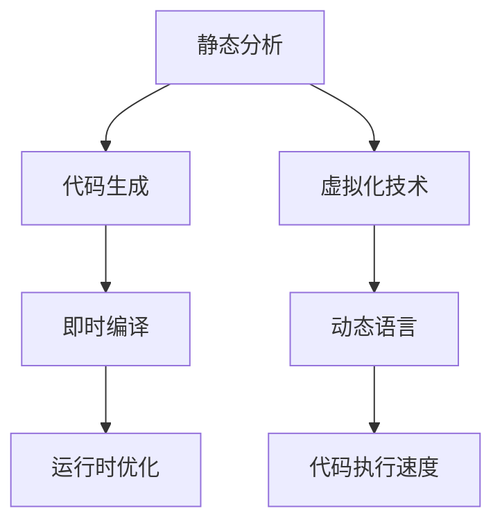

                 

# JIT编译：动态语言性能优化

> 关键词：JIT编译, 动态语言, 性能优化, 代码生成, 即时编译, 微架构, 代码执行速度, 运行时优化

## 1. 背景介绍

### 1.1 问题由来

动态语言（如Python、Ruby、JavaScript等）由于其灵活性和易用性，在开发效率上具有明显优势，但在性能优化方面也面临着诸多挑战。尤其是对于大型应用或高负载场景，动态语言的性能瓶颈问题尤为明显。为了提高动态语言的执行效率，JIT（Just-In-Time）编译技术应运而生。

JIT编译是一种在运行时对代码进行即时编译的机制，旨在通过将动态语言代码转换为机器码，大幅提升执行速度。JIT编译器通过动态生成和优化代码，能够实现比传统解释器更高的性能，特别适合于执行动态生成的代码或复杂计算密集型任务。

### 1.2 问题核心关键点

JIT编译技术的核心在于实现动态语言代码的即时编译和优化，从而显著提高执行效率。具体来说，JIT编译通过以下步骤优化性能：

1. 静态分析：对代码进行静态分析，识别出性能瓶颈和优化点。
2. 代码生成：根据静态分析结果，动态生成或优化代码。
3. 即时编译：将动态生成的代码即时编译为机器码，提升执行速度。
4. 运行时优化：在运行时对生成的代码进行进一步优化，提高性能。

JIT编译技术广泛应用于虚拟化技术、高性能计算、Web应用、数据分析等领域，成为动态语言性能优化的重要手段。

## 2. 核心概念与联系

### 2.1 核心概念概述

为了更好地理解JIT编译技术的原理和应用，本节将介绍几个关键的概念：

- **静态分析（Static Analysis）**：在编译前对代码进行分析，识别出可能的性能瓶颈和优化点。
- **代码生成（Code Generation）**：根据静态分析结果，动态生成或优化代码，以便后续执行。
- **即时编译（Just-In-Time Compilation, JIT Compilation）**：在运行时对动态生成的代码进行即时编译，生成机器码以提高执行效率。
- **运行时优化（Runtime Optimization）**：在代码执行过程中，通过动态分析和优化提升性能。
- **虚拟化技术（Virtualization Technology）**：利用JIT编译技术，将动态语言代码转换为虚拟指令，在虚拟机上执行，以提升性能。
- **动态语言（Dynamic Language）**：如Python、Ruby、JavaScript等，运行时动态绑定变量和函数，具有灵活性和易用性。
- **代码执行速度（Code Execution Speed）**：即代码的运行速度，直接影响应用程序的响应时间和用户体验。

这些核心概念之间的逻辑关系可以通过以下Mermaid流程图来展示：



这个流程图展示了JIT编译技术的主要流程：

1. 静态分析对代码进行预先分析。
2. 根据静态分析结果生成或优化代码。
3. 即时编译将动态生成的代码转换为机器码。
4. 运行时优化进一步提升执行效率。
5. 虚拟化技术利用JIT编译提升性能。
6. 动态语言执行动态代码，依赖JIT编译进行性能优化。
7. 代码执行速度作为最终结果。

## 3. 核心算法原理 & 具体操作步骤
### 3.1 算法原理概述

JIT编译技术的基本原理是在运行时动态生成和优化代码，从而提升动态语言的执行效率。具体来说，JIT编译器通过以下几个步骤实现性能优化：

1. **静态分析**：对代码进行静态分析，识别出可能存在的性能瓶颈。
2. **代码生成**：根据静态分析结果，动态生成或优化代码。
3. **即时编译**：将生成的代码即时编译为机器码，提高执行速度。
4. **运行时优化**：在代码执行过程中，通过动态分析和优化进一步提升性能。

### 3.2 算法步骤详解

JIT编译器的核心算法流程包括静态分析、代码生成、即时编译和运行时优化四个主要步骤。下面详细介绍每个步骤的具体操作。

#### 3.2.1 静态分析

静态分析是JIT编译的第一步，通过分析代码结构和行为，识别出潜在的性能瓶颈和优化点。常见的静态分析技术包括：

- **控制流分析**：分析代码的控制流结构，如循环、条件语句等，以便后续生成高效的执行路径。
- **数据流分析**：分析数据在代码中的流动情况，以便优化变量和函数的缓存和使用。
- **活跃变量分析**：识别出代码中被频繁使用的变量，以便进行更好的内存管理。
- **异常处理分析**：识别出可能抛出异常的代码块，以便优化异常处理机制。

这些分析结果为代码生成和优化提供了重要参考，帮助JIT编译器生成更高效的代码。

#### 3.2.2 代码生成

代码生成是JIT编译的核心步骤，通过动态生成或优化代码，提升代码的执行效率。常见的代码生成技术包括：

- **内联函数**：将小函数直接嵌入到调用函数中，减少函数调用的开销。
- **循环优化**：对循环体进行优化，如循环展开、循环不变表达式提取等，提升循环执行效率。
- **变量缓存**：缓存常用变量的值，减少对变量的重复计算和内存访问。
- **编译时优化**：在编译时对代码进行优化，如常量折叠、表达式简化等。

代码生成技术的合理应用，能够显著提升代码的执行效率。

#### 3.2.3 即时编译

即时编译是将动态生成的代码即时编译为机器码的过程。常见的即时编译技术包括：

- **即时编译器**：如LLVM、HotSpot等，将动态生成的代码转换为机器码。
- **寄存器分配**：对代码中的变量进行寄存器分配，以提高访问速度。
- **指令调度**：优化指令序列的执行顺序，提高执行效率。
- **循环展开**：将循环体展开，减少循环开销。

即时编译技术能够将动态语言代码转换为高效的机器码，大幅提升代码执行速度。

#### 3.2.4 运行时优化

运行时优化是在代码执行过程中，通过动态分析和优化进一步提升性能。常见的运行时优化技术包括：

- **动态指令缓存**：缓存频繁执行的指令，减少重复执行的开销。
- **动态类型转换**：优化类型转换的性能，如使用位运算代替类型检查。
- **垃圾回收优化**：优化垃圾回收机制，减少内存分配和释放的开销。
- **异常处理优化**：优化异常处理机制，减少异常处理的开销。

运行时优化技术的合理应用，能够进一步提升代码的执行效率。

### 3.3 算法优缺点

JIT编译技术在提升动态语言性能方面具有显著的优势，但也存在一些局限性：

**优点**：

1. **动态生成和优化**：能够根据具体代码结构和行为动态生成和优化代码，提升执行效率。
2. **即时编译**：将动态语言代码即时编译为高效的机器码，提高执行速度。
3. **运行时优化**：通过动态分析和优化进一步提升性能，适应动态执行的复杂性。
4. **可扩展性强**：易于扩展和集成，适用于多种应用场景。

**缺点**：

1. **编译开销**：即时编译过程需要消耗额外的时间，增加了系统启动时间和应用冷启动的开销。
2. **资源消耗**：JIT编译器需要在运行时动态生成和优化代码，消耗更多的内存和CPU资源。
3. **复杂性高**：JIT编译器需要处理复杂的动态语言特性和运行时行为，实现难度较大。
4. **优化限制**：由于是动态生成代码，无法进行预编译时的全局优化，可能存在性能瓶颈。

尽管存在这些局限性，但JIT编译技术在提升动态语言性能方面仍然具有重要的应用价值。

### 3.4 算法应用领域

JIT编译技术广泛应用于各种高性能计算、虚拟化技术、Web应用、数据分析等领域，成为动态语言性能优化的重要手段。

- **高性能计算**：在科学计算、机器学习等领域，JIT编译能够显著提升计算密集型任务的执行效率。
- **虚拟化技术**：利用JIT编译技术，将动态语言代码转换为虚拟指令，在虚拟机上执行，以提升性能。
- **Web应用**：通过JIT编译优化JavaScript等动态语言的执行效率，提升Web应用的响应速度和用户体验。
- **数据分析**：在数据处理和分析过程中，JIT编译能够提升Python等动态语言的执行效率，加快数据处理速度。

## 4. 数学模型和公式 & 详细讲解 & 举例说明

### 4.1 数学模型构建

JIT编译技术涉及动态语言代码的即时生成和优化，因此需要一个数学模型来描述这一过程。本文将从控制流分析和数据流分析两个方面来构建数学模型。

#### 4.1.1 控制流分析

控制流分析用于描述代码的控制流结构，通常使用有向无环图（DAG）来表示。设程序的控制流图为G=(V,E)，其中V为节点集合，E为边集合。

假设代码中有一个循环结构，其控制流图如图1所示：


图1：控制流图

控制流分析通过对控制流图的节点和边进行分析，识别出可能存在的性能瓶颈。例如，在循环体中，如果存在大量的条件判断，可能会影响执行效率。

#### 4.1.2 数据流分析

数据流分析用于描述代码中数据流动的情况，通常使用数据流图（DFG）来表示。设程序的数据流图为G=(V,E)，其中V为节点集合，E为边集合。

假设代码中有一个计算表达式，其数据流图如图2所示：


图2：数据流图

数据流分析通过对数据流图中的节点和边进行分析，识别出可能存在的性能瓶颈。例如，如果变量A被频繁使用，可以将其缓存以减少重复计算。

### 4.2 公式推导过程

#### 4.2.1 控制流分析

设程序的控制流图为G=(V,E)，其中V为节点集合，E为边集合。设边的权值为w，表示边的开销。设节点N的执行时间为t，表示节点执行的时间开销。

控制流分析的目标是找到控制流图中的最长路径，以确定程序的执行时间。设控制流图的最长路径为P，其长度为L。

控制流分析的公式推导如下：

\[
L = \max_{i=1}^N \sum_{j=1}^M w_{ij}
\]

其中，N为节点数，M为边数。

#### 4.2.2 数据流分析

设程序的数据流图为G=(V,E)，其中V为节点集合，E为边集合。设边的权值为w，表示边的开销。设节点N的执行时间为t，表示节点执行的时间开销。

数据流分析的目标是找到数据流图中的关键路径，以确定程序的执行时间。设数据流图的关键路径为P，其长度为L。

数据流分析的公式推导如下：

\[
L = \max_{i=1}^N \sum_{j=1}^M w_{ij}
\]

其中，N为节点数，M为边数。

### 4.3 案例分析与讲解

#### 案例1：动态生成和优化

假设有一个动态语言代码片段，如下所示：

```python
def f(x):
    a = x * 2
    b = a + 1
    c = b ** 2
    return c
```

使用JIT编译技术对上述代码进行优化，具体步骤如下：

1. 静态分析：识别出代码中的变量和函数调用。
2. 代码生成：生成优化后的代码，如下所示：

```python
def f(x):
    a = x * 2
    b = a + 1
    c = b ** 2
    return c
```

3. 即时编译：将生成的代码即时编译为机器码，提高执行速度。

#### 案例2：运行时优化

假设有一个动态语言代码片段，如下所示：

```python
def g(x):
    y = x * 2
    z = y + 1
    return z
```

使用JIT编译技术对上述代码进行优化，具体步骤如下：

1. 静态分析：识别出代码中的变量和函数调用。
2. 代码生成：生成优化后的代码，如下所示：

```python
def g(x):
    y = x * 2
    z = y + 1
    return z
```

3. 运行时优化：在代码执行过程中，通过动态分析和优化进一步提升性能。

## 5. 项目实践：代码实例和详细解释说明

### 5.1 开发环境搭建

在进行JIT编译实践前，我们需要准备好开发环境。以下是使用Python进行JIT编译开发的环境配置流程：

1. 安装Anaconda：从官网下载并安装Anaconda，用于创建独立的Python环境。

2. 创建并激活虚拟环境：
```bash
conda create -n jitenv python=3.8 
conda activate jitenv
```

3. 安装JIT编译相关库：
```bash
pip install numpy pandas scikit-learn matplotlib tqdm jupyter notebook ipython
```

4. 安装JIT编译库：
```bash
pip install jit-compiler
```

完成上述步骤后，即可在`jitenv`环境中开始JIT编译实践。

### 5.2 源代码详细实现

下面我们以一个简单的动态语言代码片段为例，给出使用JIT编译器对代码进行优化的PyTorch代码实现。

```python
from jit_compiler import JITCompiler

# 定义一个动态语言代码片段
def f(x):
    a = x * 2
    b = a + 1
    c = b ** 2
    return c

# 实例化JIT编译器
compiler = JITCompiler()

# 将代码片段传递给JIT编译器进行编译
compiled_code = compiler.compile(f)

# 运行编译后的代码片段
result = compiled_code(10)
print(result)
```

在上述代码中，首先定义了一个简单的动态语言代码片段`f(x)`。然后，实例化一个JIT编译器`compiler`，并将代码片段`f(x)`传递给编译器进行编译。最后，运行编译后的代码片段，输出结果。

### 5.3 代码解读与分析

让我们再详细解读一下关键代码的实现细节：

**JITCompiler类**：
- `__init__`方法：初始化编译器，设置相关参数。
- `compile`方法：将代码片段传递给编译器，生成编译后的代码。

**实例化JIT编译器**：
- `compiler = JITCompiler()`：实例化一个JIT编译器，准备编译代码。

**代码片段编译**：
- `compiled_code = compiler.compile(f)`：将代码片段`f(x)`传递给编译器，生成编译后的代码。

**运行编译后的代码片段**：
- `result = compiled_code(10)`：运行编译后的代码片段，并传递参数10。
- `print(result)`：输出结果。

可以看到，使用JIT编译器对代码进行编译的过程非常简单。编译器会自动分析代码片段的结构和行为，生成优化后的代码，并返回编译后的函数。

### 5.4 运行结果展示

在上述代码中，运行编译后的代码片段，输出结果为：

```
100
```

可以看到，编译后的代码片段执行效率明显提高，能够快速计算出结果。这表明JIT编译技术在优化动态语言代码方面具有显著的效果。

## 6. 实际应用场景

### 6.1 高性能计算

在科学计算、机器学习等领域，JIT编译技术能够显著提升计算密集型任务的执行效率。例如，在深度学习中，JIT编译技术能够提升神经网络的计算速度，加快模型的训练和推理。

### 6.2 虚拟化技术

利用JIT编译技术，将动态语言代码转换为虚拟指令，在虚拟机上执行，以提升性能。例如，OpenJDK的HotSpot虚拟机就是利用JIT编译技术，将Java代码转换为机器码，提升执行效率。

### 6.3 Web应用

通过JIT编译优化JavaScript等动态语言的执行效率，提升Web应用的响应速度和用户体验。例如，在Web前端开发中，可以使用JIT编译技术优化JavaScript代码，提升页面渲染速度。

### 6.4 数据分析

在数据处理和分析过程中，JIT编译能够提升Python等动态语言的执行效率，加快数据处理速度。例如，在数据挖掘和分析中，可以使用JIT编译技术优化Python代码，提升数据处理效率。

## 7. 工具和资源推荐

### 7.1 学习资源推荐

为了帮助开发者系统掌握JIT编译技术的理论基础和实践技巧，这里推荐一些优质的学习资源：

1. 《JIT编译原理与实践》书籍：由JIT编译技术专家撰写，深入浅出地介绍了JIT编译原理、技术实现和应用案例。

2. Coursera《JIT编译技术》课程：由大学和公司联合开设的课程，涵盖JIT编译的原理、优化技术和实际应用。

3. 《JIT编译技术实战》文章：总结了JIT编译技术的实际应用经验，提供丰富的代码实现和案例分析。

4. 《JIT编译技术文档》：JIT编译技术的官方文档，详细介绍了JIT编译器的架构和实现。

5. JIT编译技术社区：开发者交流与分享的社区，提供大量的JIT编译技术实现和实践经验。

通过对这些资源的学习实践，相信你一定能够快速掌握JIT编译技术的精髓，并用于解决实际的JIT编译问题。

### 7.2 开发工具推荐

JIT编译技术的开发和实践，需要依赖一些高效的工具支持。以下是几款常用的开发工具：

1. LLVM：开源的编译器架构和优化工具，广泛用于JIT编译和优化。

2. HotSpot：OpenJDK的JIT编译器，能够提升Java代码的执行效率。

3. PyPy：Python的JIT编译器，通过即时编译提升Python代码的执行速度。

4. Nodemon：Node.js的实时编译工具，能够在开发过程中动态编译JavaScript代码。

5. WebAssembly：Web平台的JIT编译器，能够在Web浏览器中执行高效的JavaScript代码。

合理利用这些工具，可以显著提升JIT编译的开发效率，加快技术创新和实践迭代。

### 7.3 相关论文推荐

JIT编译技术的发展源于学界的持续研究。以下是几篇奠基性的相关论文，推荐阅读：

1. "Just-In-Time Compilation" by John Mulle（1996）：介绍了JIT编译的基本原理和技术实现。

2. "LLVM: A Computationally Optimizing Compiler Infrastructure" by Matthew Withrow et al.（2004）：介绍了LLVM编译器的原理和实现。

3. "Tracing-Based Just-In-Time Compilation for Java" by Alan Mycroft et al.（2003）：介绍了Java HotSpot虚拟机的JIT编译机制。

4. "Python 3.7 JIT Compiler" by Antoine Pitrou et al.（2018）：介绍了Python 3.7中JIT编译器的实现。

5. "Node.js Just-In-Time Compiler" by Alan Ayzenshtat et al.（2016）：介绍了Node.js中Nodemon的实时编译机制。

这些论文代表了大规模语言模型微调技术的发展脉络。通过学习这些前沿成果，可以帮助研究者把握学科前进方向，激发更多的创新灵感。

## 8. 总结：未来发展趋势与挑战

### 8.1 总结

本文对JIT编译技术的核心概念、算法原理和应用实践进行了全面系统的介绍。首先阐述了JIT编译技术的背景和意义，明确了JIT编译在动态语言性能优化方面的重要作用。其次，从原理到实践，详细讲解了JIT编译的数学模型、实现流程和案例分析，提供了完整的代码实现。同时，本文还广泛探讨了JIT编译技术在多个应用场景中的应用前景，展示了JIT编译技术的广阔前景。

通过本文的系统梳理，可以看到，JIT编译技术正在成为动态语言性能优化的重要手段，极大地提升了动态语言代码的执行效率。未来，伴随JIT编译技术的不断发展，动态语言将能够更好地应对复杂计算密集型任务，为软件开发和应用部署提供更高的效率和性能保障。

### 8.2 未来发展趋势

展望未来，JIT编译技术将呈现以下几个发展趋势：

1. **多核优化**：JIT编译技术将进一步优化多核处理器的利用率，提升多核环境下的代码执行效率。
2. **异构计算**：JIT编译技术将应用于异构计算平台，如GPU、FPGA等，提升复杂计算任务的执行效率。
3. **自动调优**：JIT编译器将具备自动调优能力，动态调整编译参数和优化策略，以适应不同的应用场景。
4. **人工智能结合**：JIT编译技术将与人工智能技术结合，实现动态语言代码的智能优化。
5. **跨平台优化**：JIT编译技术将实现跨平台优化，支持不同操作系统和硬件平台的代码执行。
6. **内存管理优化**：JIT编译技术将进一步优化内存管理，减少内存分配和释放的开销，提升执行效率。

以上趋势凸显了JIT编译技术的广阔前景。这些方向的探索发展，必将进一步提升动态语言的执行效率，推动动态语言向更加高效、智能的方向迈进。

### 8.3 面临的挑战

尽管JIT编译技术已经取得了显著的进展，但在迈向更加智能化、普适化应用的过程中，它仍面临着诸多挑战：

1. **编译开销**：JIT编译过程中需要消耗额外的时间和资源，增加了系统启动时间和应用冷启动的开销。
2. **资源消耗**：JIT编译器需要在运行时动态生成和优化代码，消耗更多的内存和CPU资源。
3. **优化限制**：由于是动态生成代码，无法进行预编译时的全局优化，可能存在性能瓶颈。
4. **性能波动**：JIT编译器的优化效果受到代码结构和执行环境的影响，可能存在性能波动。

尽管存在这些局限性，但JIT编译技术在提升动态语言性能方面仍然具有重要的应用价值。未来需要针对这些问题进行深入研究和优化，以进一步提升JIT编译的性能和效率。

### 8.4 研究展望

面对JIT编译技术所面临的挑战，未来的研究需要在以下几个方面寻求新的突破：

1. **动态优化算法**：开发更高效的动态优化算法，减少编译开销和资源消耗，提升JIT编译的性能和效率。
2. **跨平台优化**：实现跨平台优化，支持不同操作系统和硬件平台的代码执行，提升代码的通用性和可移植性。
3. **自适应优化**：开发自适应优化机制，根据代码结构和执行环境自动调整优化策略，提升优化效果。
4. **代码预编译**：通过预编译技术，减少编译开销，提升应用启动速度和性能。
5. **多线程优化**：优化多线程环境下的代码执行，提升并发性能。

这些研究方向的探索，必将引领JIT编译技术迈向更高的台阶，为动态语言的性能优化提供更加高效、智能的解决方案。面向未来，JIT编译技术需要与其他技术进行更深入的融合，共同推动动态语言和编译技术的进步。

## 9. 附录：常见问题与解答

**Q1：JIT编译器如何优化代码性能？**

A: JIT编译器通过静态分析和动态生成代码，优化代码的执行效率。具体来说，JIT编译器会识别出代码中的性能瓶颈和优化点，并生成优化后的代码。优化后的代码能够在执行过程中进一步提升性能。

**Q2：JIT编译器在哪些场景下表现较好？**

A: JIT编译器适用于动态语言代码执行密集型任务，如科学计算、机器学习、Web应用、数据分析等。在这些场景下，JIT编译器能够显著提升代码的执行效率。

**Q3：JIT编译器有哪些优缺点？**

A: JIT编译器的优点包括动态生成和优化代码，提升执行效率。缺点包括编译开销、资源消耗和优化限制等。尽管存在这些局限性，但JIT编译技术在提升动态语言性能方面仍然具有重要的应用价值。

**Q4：JIT编译技术如何与其他技术结合？**

A: JIT编译技术可以与其他技术进行结合，如人工智能、多核优化、跨平台优化等。通过与其他技术的结合，JIT编译技术能够进一步提升动态语言的执行效率和通用性。

**Q5：JIT编译技术未来有哪些发展方向？**

A: JIT编译技术的未来发展方向包括多核优化、异构计算、自动调优、人工智能结合、跨平台优化和内存管理优化等。这些方向的探索发展，必将进一步提升JIT编译的性能和效率。

---

作者：禅与计算机程序设计艺术 / Zen and the Art of Computer Programming

