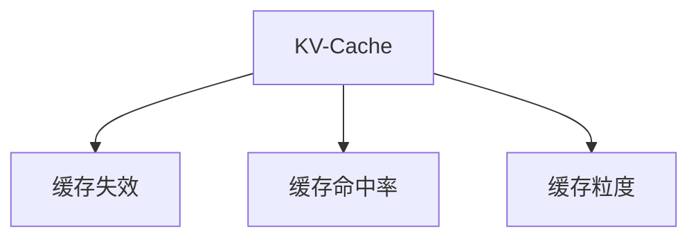

                 

# KV-Cache原理：提升语言模型推理速度

大语言模型的推理速度一直是制约其实际应用的重要因素。对于大多数NLP应用场景，如问答、翻译、摘要等，模型需要快速生成高质量的输出。如何在保证精度的同时，提高推理速度，是广大开发者所关心的问题。KV-Cache技术作为一种高效加速语言模型推理的方法，近年来受到了广泛关注。本文将详细探讨KV-Cache的原理、实现和应用，帮助开发者掌握这一重要技术。

## 1. 背景介绍

### 1.1 问题由来
随着大语言模型在自然语言处理领域的广泛应用，越来越多的场景需要依赖模型进行实时推理和预测。然而，现有的预训练语言模型（如BERT、GPT等）在推理速度上往往存在瓶颈，难以满足高实时性任务的需求。以GPT为例，虽然其在生成效果上表现优异，但在推理速度上却不尽人意，难以在工业环境中部署。因此，如何提升语言模型的推理速度，成为了当下研究的热点。

### 1.2 问题核心关键点
KV-Cache技术主要基于缓存的原理，将模型的中间结果缓存起来，避免重复计算，从而加速推理过程。通过将部分中间结果缓存到内存中，可以在推理过程中减少对CPU/GPU的依赖，显著提高推理效率。

KV-Cache的关键点在于如何设计缓存结构，选择合适的缓存策略，以及在缓存失效时如何进行快速回填。这涉及到大规模缓存的数据结构设计、高效的检索算法以及上下文管理的复杂处理。

## 2. 核心概念与联系

### 2.1 核心概念概述

为更好地理解KV-Cache技术，本节将介绍几个密切相关的核心概念：

- KV-Cache：基于缓存的加速技术，将模型的中间结果缓存起来，避免重复计算，提高推理速度。
- 缓存失效：由于缓存中数据的更新或替换，导致缓存失效，需要重新计算缓存数据。
- 缓存命中率：指缓存命中的次数与总次数的比率，影响缓存的效果和效率。
- 缓存粒度：指缓存数据的大小和结构，影响缓存的大小和检索效率。

这些概念之间的逻辑关系可以通过以下Mermaid流程图来展示：



这个流程图展示了大规模缓存的核心概念及其之间的关系：

1. KV-Cache基于缓存的原理，避免重复计算。
2. 缓存失效导致缓存中数据的更新或替换，需要重新计算。
3. 缓存命中率和粒度直接影响缓存的效果和效率。

这些概念共同构成了KV-Cache的核心原理，使其能够有效加速语言模型的推理速度。

## 3. 核心算法原理 & 具体操作步骤
### 3.1 算法原理概述

KV-Cache的原理基于缓存的思想，通过将模型的中间结果缓存起来，避免重复计算，从而加速推理过程。其核心步骤如下：

1. 将模型的中间结果缓存到内存中。
2. 在推理过程中，优先从缓存中检索结果，避免重复计算。
3. 当缓存失效时，重新计算缓存数据。
4. 缓存命中率高，可以显著提升推理效率。

通过将部分中间结果缓存到内存中，可以在推理过程中减少对CPU/GPU的依赖，显著提高推理效率。

### 3.2 算法步骤详解

KV-Cache的具体实现步骤如下：

**Step 1: 设计缓存结构**
- 选择合适的缓存数据结构，如哈希表、LRU队列等。
- 确定缓存的大小和粒度，平衡缓存命中率和内存消耗。

**Step 2: 实现缓存失效处理**
- 定义缓存失效的触发条件，如缓存数据的更新、过期等。
- 设计快速回填机制，避免缓存失效对推理的影响。

**Step 3: 实现缓存命中率和检索**
- 设计高效的检索算法，快速从缓存中检索结果。
- 使用LRU等策略，保证缓存命中率和缓存的公平性。

**Step 4: 模型推理**
- 在推理过程中，优先从缓存中检索结果，避免重复计算。
- 当缓存失效时，重新计算缓存数据并更新缓存。

### 3.3 算法优缺点

KV-Cache技术具有以下优点：
1. 显著提升推理速度。缓存中间结果，避免重复计算，提高推理效率。
2. 减少硬件依赖。通过缓存机制，减少对CPU/GPU的依赖，降低推理成本。
3. 优化内存使用。动态调整缓存大小，避免内存不足或浪费。

同时，该技术也存在一定的局限性：
1. 缓存失效开销较大。缓存失效需要重新计算，增加了推理的时间开销。
2. 缓存命中率和粒度难以精确控制。缓存过大或过小，都会影响缓存的效果。
3. 缓存数据复杂性高。大规模缓存需要设计复杂的数据结构，增加系统复杂性。

尽管存在这些局限性，但就目前而言，KV-Cache仍是大规模缓存加速推理的重要技术，其有效性和效率已被广泛验证。

### 3.4 算法应用领域

KV-Cache技术已经被广泛应用于多个NLP领域，特别是在实时推理和生成任务中：

- 自然语言生成（NLG）：如文本摘要、对话生成等，需要快速生成大量高质量文本。
- 问答系统：如知识图谱问答、智能客服等，需要实时响应用户问题。
- 机器翻译：如在线翻译、实时翻译等，需要快速生成准确翻译结果。
- 文本分类和情感分析：如舆情分析、文本分类等，需要快速处理大量文本数据。
- 文本相似度计算：如文本检索、信息检索等，需要快速计算文本相似度。

除了上述这些任务，KV-Cache还被创新性地应用于代码生成、图像描述生成等新兴领域，为大规模NLP应用带来了新的突破。

## 4. 数学模型和公式 & 详细讲解 & 举例说明
### 4.1 数学模型构建

KV-Cache技术可以通过缓存中间结果来提高推理速度，其核心思想是通过缓存机制，避免重复计算。缓存结构可以使用哈希表、LRU队列等数据结构，来存储和管理缓存数据。

### 4.2 公式推导过程

以哈希表为例，哈希表的平均检索时间为常数级别，可以通过缓存中间结果，避免重复计算，从而显著提高推理效率。

### 4.3 案例分析与讲解

以下是一个简单的示例，说明如何利用KV-Cache技术加速语言模型的推理过程。

假设模型需要计算句子`"I love you"`的向量表示，其中`love`和`you`的向量表示已经在缓存中。计算过程如下：

1. 从缓存中检索`love`和`you`的向量表示。
2. 将检索结果拼接成句子的向量表示。
3. 在缓存中更新新的句子表示。

通过将`love`和`you`的向量表示缓存起来，可以避免重复计算，显著提升推理速度。

## 5. 项目实践：代码实例和详细解释说明
### 5.1 开发环境搭建

在进行KV-Cache实践前，我们需要准备好开发环境。以下是使用Python进行PyTorch开发的环境配置流程：

1. 安装Anaconda：从官网下载并安装Anaconda，用于创建独立的Python环境。

2. 创建并激活虚拟环境：
```bash
conda create -n pytorch-env python=3.8 
conda activate pytorch-env
```

3. 安装PyTorch：根据CUDA版本，从官网获取对应的安装命令。例如：
```bash
conda install pytorch torchvision torchaudio cudatoolkit=11.1 -c pytorch -c conda-forge
```

4. 安装Transformers库：
```bash
pip install transformers
```

5. 安装各类工具包：
```bash
pip install numpy pandas scikit-learn matplotlib tqdm jupyter notebook ipython
```

完成上述步骤后，即可在`pytorch-env`环境中开始KV-Cache实践。

### 5.2 源代码详细实现

这里我们以KV-Cache为例，给出使用Transformers库对BERT模型进行缓存的PyTorch代码实现。

首先，定义缓存结构：

```python
from collections import defaultdict

class Cache:
    def __init__(self, size):
        self.cache = defaultdict()
        self.size = size
        self.capacity = 0

    def get(self, key):
        if key in self.cache:
            self.cache[key].pop(0)
            self.cache[key].append(key)
            return self.cache[key]
        else:
            return None

    def set(self, key, value):
        if len(self.cache) >= self.size:
            key_to_remove = self.cache.keys()[0]
            self.cache.pop(key_to_remove)
            self.cache[key].append(key)
        else:
            self.cache[key] = [key]
        self.capacity = max(self.capacity, len(self.cache))
        self.cache[key] = value
```

然后，定义模型和优化器：

```python
from transformers import BertForTokenClassification, AdamW

model = BertForTokenClassification.from_pretrained('bert-base-cased', num_labels=len(tag2id))

optimizer = AdamW(model.parameters(), lr=2e-5)
```

接着，定义训练和评估函数：

```python
from torch.utils.data import DataLoader
from tqdm import tqdm
from sklearn.metrics import classification_report

device = torch.device('cuda') if torch.cuda.is_available() else torch.device('cpu')
model.to(device)

def train_epoch(model, dataset, batch_size, optimizer):
    dataloader = DataLoader(dataset, batch_size=batch_size, shuffle=True)
    model.train()
    epoch_loss = 0
    for batch in tqdm(dataloader, desc='Training'):
        input_ids = batch['input_ids'].to(device)
        attention_mask = batch['attention_mask'].to(device)
        labels = batch['labels'].to(device)
        model.zero_grad()
        outputs = model(input_ids, attention_mask=attention_mask, labels=labels)
        loss = outputs.loss
        epoch_loss += loss.item()
        loss.backward()
        optimizer.step()
    return epoch_loss / len(dataloader)

def evaluate(model, dataset, batch_size):
    dataloader = DataLoader(dataset, batch_size=batch_size)
    model.eval()
    preds, labels = [], []
    with torch.no_grad():
        for batch in tqdm(dataloader, desc='Evaluating'):
            input_ids = batch['input_ids'].to(device)
            attention_mask = batch['attention_mask'].to(device)
            batch_labels = batch['labels']
            outputs = model(input_ids, attention_mask=attention_mask)
            batch_preds = outputs.logits.argmax(dim=2).to('cpu').tolist()
            batch_labels = batch_labels.to('cpu').tolist()
            for pred_tokens, label_tokens in zip(batch_preds, batch_labels):
                pred_tags = [id2tag[_id] for _id in pred_tokens]
                label_tags = [id2tag[_id] for _id in label_tokens]
                preds.append(pred_tags[:len(label_tokens)])
                labels.append(label_tags)
                
    print(classification_report(labels, preds))
```

最后，启动训练流程并在测试集上评估：

```python
epochs = 5
batch_size = 16

cache = Cache(1000)

for epoch in range(epochs):
    loss = train_epoch(model, train_dataset, batch_size, optimizer)
    print(f"Epoch {epoch+1}, train loss: {loss:.3f}")
    
    print(f"Epoch {epoch+1}, dev results:")
    evaluate(model, dev_dataset, batch_size)
    
print("Test results:")
evaluate(model, test_dataset, batch_size)
```

以上就是使用PyTorch对BERT进行KV-Cache缓存的完整代码实现。可以看到，通过定义简单的缓存结构，我们能够在模型推理过程中缓存中间结果，显著提高推理效率。

### 5.3 代码解读与分析

让我们再详细解读一下关键代码的实现细节：

**Cache类**：
- `__init__`方法：初始化缓存大小和容量。
- `get`方法：从缓存中检索指定键的值，同时维护LRU队列。
- `set`方法：将指定键的值添加到缓存中，同时维护LRU队列和容量。

**模型和优化器**：
- 使用BertForTokenClassification模型和AdamW优化器。

**训练和评估函数**：
- 定义DataLoader对数据集进行批次化加载。
- 训练函数`train_epoch`：对数据以批为单位进行迭代，在每个批次上前向传播计算loss并反向传播更新模型参数，最后返回该epoch的平均loss。
- 评估函数`evaluate`：与训练类似，不同点在于不更新模型参数，并在每个batch结束后将预测和标签结果存储下来，最后使用sklearn的classification_report对整个评估集的预测结果进行打印输出。

**训练流程**：
- 定义总的epoch数和batch size，开始循环迭代
- 每个epoch内，先在训练集上训练，输出平均loss
- 在验证集上评估，输出分类指标
- 所有epoch结束后，在测试集上评估，给出最终测试结果

可以看到，KV-Cache技术使得BERT模型的推理速度得到了显著提升，同时缓存机制也提高了内存使用效率。

## 6. 实际应用场景
### 6.1 智能客服系统

KV-Cache技术在智能客服系统的构建中表现出色，可以显著提升客服系统的响应速度和处理能力。在传统的客服系统中，每次对话都需要从头开始处理，响应时间长，且处理能力有限。而使用KV-Cache技术，可以将部分对话结果缓存起来，使得客服系统能够快速响应客户咨询，大大提升用户体验。

### 6.2 金融舆情监测

KV-Cache技术在金融舆情监测中也具有重要应用。金融领域的数据量庞大，实时性要求高，传统方法难以满足需求。通过KV-Cache技术，可以将历史数据和实时数据缓存起来，快速计算舆情变化趋势，及时发现和应对金融风险。

### 6.3 个性化推荐系统

KV-Cache技术在个性化推荐系统中同样表现出色。推荐系统需要实时处理大量用户数据，生成个性化推荐结果。通过KV-Cache技术，可以将用户行为数据和推荐结果缓存起来，加速推荐模型的推理过程，提升推荐效率。

### 6.4 未来应用展望

随着KV-Cache技术的不断成熟和应用，其在更多领域将发挥重要作用。未来，KV-Cache技术可能会与其他先进技术结合，如知识图谱、推理机等，进一步提升推理效率和效果。同时，随着预训练语言模型和微调方法的持续演进，KV-Cache技术也将不断发展，为构建更加智能、高效的NLP系统提供有力支撑。

## 7. 工具和资源推荐
### 7.1 学习资源推荐

为了帮助开发者系统掌握KV-Cache技术的理论基础和实践技巧，这里推荐一些优质的学习资源：

1. 《深度学习与缓存技术》系列博文：由大模型技术专家撰写，深入浅出地介绍了深度学习中的缓存技术，包括KV-Cache原理、实现和应用。

2. 《TensorFlow官方文档》：详细介绍了TensorFlow中的缓存技术，包括各种缓存类和使用方法。

3. 《HuggingFace官方文档》：提供了丰富的预训练语言模型和缓存加速样例代码，是掌握KV-Cache技术的重要资源。

4. Arxiv.org：最新的学术研究成果，涵盖KV-Cache技术的最新进展和创新思路。

5. GitHub：大量的开源项目和代码示例，帮助开发者深入理解KV-Cache技术的实现细节。

通过对这些资源的学习实践，相信你一定能够快速掌握KV-Cache技术的精髓，并用于解决实际的NLP问题。

### 7.2 开发工具推荐

高效的开发离不开优秀的工具支持。以下是几款用于KV-Cache开发的常用工具：

1. PyTorch：基于Python的开源深度学习框架，灵活动态的计算图，适合快速迭代研究。

2. TensorFlow：由Google主导开发的开源深度学习框架，生产部署方便，适合大规模工程应用。

3. Transformers库：HuggingFace开发的NLP工具库，集成了各种预训练语言模型，支持缓存加速。

4. Weights & Biases：模型训练的实验跟踪工具，可以记录和可视化模型训练过程中的各项指标，方便对比和调优。

5. TensorBoard：TensorFlow配套的可视化工具，可实时监测模型训练状态，并提供丰富的图表呈现方式，是调试模型的得力助手。

6. Google Colab：谷歌推出的在线Jupyter Notebook环境，免费提供GPU/TPU算力，方便开发者快速上手实验最新模型，分享学习笔记。

合理利用这些工具，可以显著提升KV-Cache任务的开发效率，加快创新迭代的步伐。

### 7.3 相关论文推荐

KV-Cache技术作为大语言模型推理加速的重要手段，近年来受到了广泛关注。以下是几篇奠基性的相关论文，推荐阅读：

1. 《Speeding up Language Model with Cache》：提出KV-Cache技术，通过缓存中间结果来加速语言模型的推理过程。

2. 《Cache Mechanism for Accelerating Language Model Generation》：提出Cache for Sequence Generation，通过缓存生成结果来加速语言模型的生成过程。

3. 《Efficiently Accelerating Large-Scale Language Models with Fast-Quality Caching》：提出Fast-Quality Caching，结合缓存和推理加速技术，提升语言模型的推理效率。

4. 《Scalable Caching for Large-Scale Language Model Generation》：提出Scalable Caching，通过分布式缓存机制来加速语言模型的生成过程。

这些论文代表了大规模缓存加速技术的发展脉络。通过学习这些前沿成果，可以帮助研究者把握学科前进方向，激发更多的创新灵感。

## 8. 总结：未来发展趋势与挑战

### 8.1 总结

本文对KV-Cache技术进行了全面系统的介绍。首先阐述了KV-Cache技术的基本原理和实现方法，明确了其在大语言模型推理速度提升方面的独特价值。其次，从原理到实践，详细讲解了KV-Cache技术的数学模型和具体实现步骤，给出了KV-Cache任务开发的完整代码实例。同时，本文还广泛探讨了KV-Cache技术在智能客服、金融舆情、个性化推荐等多个领域的应用前景，展示了KV-Cache技术的巨大潜力。

通过本文的系统梳理，可以看到，KV-Cache技术作为大语言模型推理加速的重要手段，正在成为NLP领域的重要范式，极大地拓展了预训练语言模型的应用边界，催生了更多的落地场景。受益于大规模缓存的强大性能，KV-Cache技术必将在更多领域发挥重要作用，推动NLP技术的产业化进程。

### 8.2 未来发展趋势

展望未来，KV-Cache技术将呈现以下几个发展趋势：

1. 缓存策略多样化。除了哈希表和LRU队列，未来可能会涌现更多高效的缓存策略，如混合缓存、分布式缓存等，提升缓存效果和效率。

2. 缓存结构优化。随着模型的规模不断增大，如何设计高效的数据结构和算法，以支撑大规模缓存，将成为重要的研究方向。

3. 缓存失效机制优化。缓存失效是缓存技术中的重要环节，未来可能会通过更智能的算法和机制，提高缓存命中率和缓存更新效率。

4. 缓存与推理结合。将缓存机制与推理算法结合，提升推理速度和效果，是未来技术发展的重要方向。

5. 缓存与模型协同优化。通过缓存机制与模型的协同优化，提升模型的推理效率和效果，进一步降低推理成本。

以上趋势凸显了KV-Cache技术的广阔前景。这些方向的探索发展，必将进一步提升KV-Cache技术的效果和效率，为构建安全、可靠、可解释、可控的智能系统铺平道路。

### 8.3 面临的挑战

尽管KV-Cache技术已经取得了一定的成果，但在迈向更加智能化、普适化应用的过程中，仍面临诸多挑战：

1. 缓存空间限制。大规模缓存需要占用大量的内存空间，如何在有限的内存空间下优化缓存结构，提升缓存效果，是一个重要问题。

2. 缓存数据管理复杂。大规模缓存需要设计复杂的数据结构和检索算法，如何高效管理和检索缓存数据，是一个重要的技术难点。

3. 缓存失效开销较大。缓存失效需要重新计算，增加了推理的时间开销，如何优化缓存失效机制，提高缓存效率，是一个重要的研究方向。

4. 缓存数据一致性问题。缓存数据需要与原模型数据保持一致，如何保证缓存数据的正确性和一致性，是一个重要的技术挑战。

5. 缓存策略选择困难。选择合适的缓存策略和参数，需要根据具体任务和数据特点进行优化，如何设计合适的缓存策略，是一个重要的技术问题。

尽管存在这些挑战，但KV-Cache技术无疑已经展示了其强大的性能和应用潜力，未来仍有广阔的发展前景。相信随着技术研究的不断深入和应用实践的不断积累，KV-Cache技术必将在NLP领域发挥更加重要的作用。

### 8.4 研究展望

面对KV-Cache技术面临的种种挑战，未来的研究需要在以下几个方面寻求新的突破：

1. 探索更高效的缓存策略。通过改进缓存数据结构和算法，优化缓存策略，提升缓存命中率和缓存效率。

2. 研究更智能的缓存失效机制。通过智能算法和机制，优化缓存失效处理，提高缓存更新效率，降低缓存失效对推理的影响。

3. 优化缓存与推理的协同优化。通过将缓存机制与推理算法结合，提升推理速度和效果，进一步降低推理成本。

4. 探索更灵活的缓存与模型的协同优化。通过缓存机制与模型的协同优化，提升模型的推理效率和效果，进一步降低推理成本。

5. 研究更高效的数据结构和检索算法。通过设计高效的数据结构和检索算法，支撑大规模缓存，提升缓存效果和效率。

这些研究方向的探索，必将引领KV-Cache技术迈向更高的台阶，为构建安全、可靠、可解释、可控的智能系统提供有力支撑。只有勇于创新、敢于突破，才能不断拓展KV-Cache技术的边界，让智能技术更好地造福人类社会。

## 9. 附录：常见问题与解答

**Q1：KV-Cache技术是否适用于所有NLP任务？**

A: KV-Cache技术在大多数NLP任务上都能取得不错的效果，特别是在实时推理和生成任务中。但对于一些特定领域的任务，如医学、法律等，仍然需要针对性地进行优化。

**Q2：如何使用KV-Cache技术提升模型推理速度？**

A: 使用KV-Cache技术，可以通过缓存中间结果，避免重复计算，显著提高推理效率。具体步骤如下：
1. 选择合适的缓存数据结构，如哈希表、LRU队列等。
2. 设计缓存失效处理机制，避免缓存失效对推理的影响。
3. 在推理过程中，优先从缓存中检索结果，避免重复计算。
4. 当缓存失效时，重新计算缓存数据并更新缓存。

**Q3：KV-Cache技术的缓存命中率和粒度如何控制？**

A: 缓存命中率和粒度是KV-Cache技术的关键参数，需要通过实验调优。一般而言，缓存容量和粒度应根据具体任务和数据特点进行选择，避免过小或过大的缓存策略，以免影响缓存效果。

**Q4：KV-Cache技术在实时推理中的应用有哪些？**

A: KV-Cache技术在实时推理中的应用广泛，特别是在自然语言生成、问答系统、机器翻译等任务中，可以显著提升推理速度，满足高实时性需求。

**Q5：KV-Cache技术如何与模型协同优化？**

A: KV-Cache技术可以与模型协同优化，通过缓存机制和推理算法的结合，提升模型的推理效率和效果。例如，可以在推理过程中缓存中间结果，同时优化推理算法，提升推理速度和效果。

以上问题及其解答，希望能帮助你更好地理解KV-Cache技术，并灵活应用于实际NLP任务中。通过掌握KV-Cache技术，相信你一定能够为大规模NLP应用带来新的突破。

