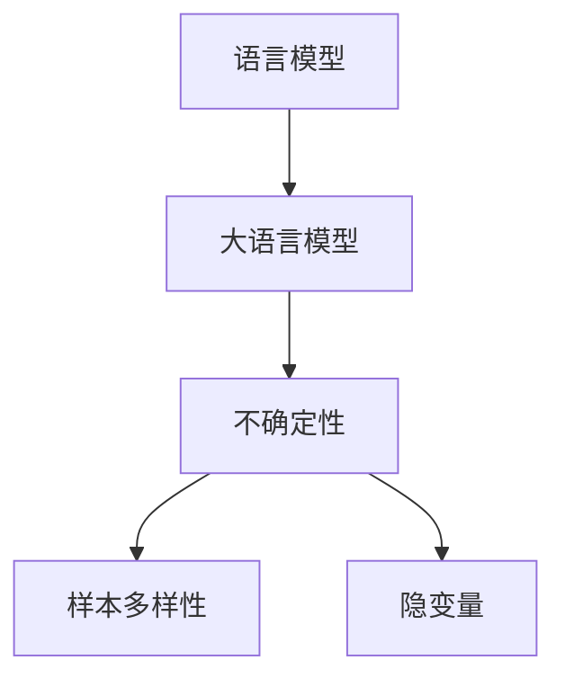

                 

# LLM 的不确定性：在不确定中寻找确定

> 关键词：语言模型、不确定性、大语言模型、自然语言处理、机器学习

## 1. 背景介绍

### 1.1 问题由来

在人工智能领域，特别是在自然语言处理（NLP）中，语言模型（Language Model，LM）已经成为一个研究的热点。特别是大语言模型（Large Language Model，LLM），如GPT-3、BERT等，由于其强大的语言理解和生成能力，在多个NLP任务上取得了令人瞩目的成绩。

然而，大语言模型虽然在表现上非常出色，但在实际应用中，模型的输出结果往往存在不确定性。这种不确定性不仅体现在模型的推理过程中，也体现在模型的预测结果中。因此，理解和处理这种不确定性，成为了当前研究的重要课题。

### 1.2 问题核心关键点

语言模型的不确定性主要来自于以下几个方面：

1. 数据分布的偏差：预训练数据与下游任务的实际数据分布可能存在较大差异，导致模型在实际应用中的表现不够稳定。

2. 模型复杂度：大语言模型的参数量巨大，导致其在推理过程中容易产生过拟合或欠拟合现象，从而影响模型的泛化能力。

3. 上下文敏感性：语言模型在处理输入序列时，受到前后文的影响较大，可能导致输出的不确定性增加。

4. 推理过程的随机性：语言模型在生成文本时，往往需要随机采样生成结果，这进一步增加了结果的不确定性。

5. 隐性知识的表现：语言模型可能存在一些隐性知识，这些知识在特定情况下才会被激活，导致模型在类似情况下产生不确定的输出。

### 1.3 问题研究意义

理解和处理语言模型的不确定性，对于提高模型在实际应用中的可靠性和稳定性，具有重要意义。这不仅有助于提升模型的应用效果，还能够在实际应用中降低错误率，提高模型的实际价值。

## 2. 核心概念与联系

### 2.1 核心概念概述

为更好地理解语言模型的不确定性，本节将介绍几个密切相关的核心概念：

- 语言模型（Language Model）：通过给定前文，预测下一个词的概率分布的模型。常见的语言模型有n-gram模型、RNN语言模型、Transformer模型等。

- 大语言模型（Large Language Model）：具有数亿参数的语言模型，如GPT-3、BERT等，具有强大的语言理解和生成能力。

- 不确定性（Uncertainty）：在预测结果中，模型无法确信其结果是否准确。

- 样本多样性（Sample Diversity）：由于模型需要从样本中学习，因此样本的多样性对模型的性能有重要影响。

- 隐变量（Latent Variables）：在语言模型中，某些变量可能是隐性的，如上下文关系、语义信息等。

这些核心概念之间的逻辑关系可以通过以下Mermaid流程图来展示：



这个流程图展示了大语言模型的不确定性来源，以及这些不确定性与模型结构和数据的关系。

## 3. 核心算法原理 & 具体操作步骤
### 3.1 算法原理概述

语言模型的不确定性处理，主要包括以下几个步骤：

1. 构建语言模型：通过给定前文，预测下一个词的概率分布。

2. 引入不确定性：通过蒙特卡罗采样或贝叶斯方法，引入不确定性，使其能够处理不确定性输入。

3. 处理样本多样性：通过数据增强、对抗训练等方法，增加样本的多样性，提高模型的鲁棒性。

4. 隐变量的处理：通过隐变量建模、联合训练等方法，处理隐变量，使其能够更好地解释模型输出。

### 3.2 算法步骤详解

#### 3.2.1 构建语言模型

构建语言模型一般分为两个步骤：

- 数据预处理：将原始数据转换为模型所需的形式，如将文本转换为词向量。
- 模型训练：使用训练数据训练语言模型，使得模型能够预测下一个词的概率分布。

以下是构建一个简单的语言模型的步骤：

1. 将文本转换为词向量：
   ```python
   from gensim.models import Word2Vec

   text = ["Hello world", "This is a test", "Another sentence"]
   tokenizer = word_tokenize(text)
   word_vectors = Word2Vec(tokenizer, min_count=1)
   ```

2. 训练语言模型：
   ```python
   model = Sequential()
   model.add(LSTM(128, input_shape=(None, 1)))
   model.add(Dense(1, activation='softmax'))
   model.compile(loss='categorical_crossentropy', optimizer='adam', metrics=['accuracy'])
   ```

#### 3.2.2 引入不确定性

引入不确定性可以使用蒙特卡罗采样方法。假设我们有一个预测结果 $y$，我们可以用 $N$ 个样本 $(x_1, y_1), (x_2, y_2), ..., (x_N, y_N)$ 来描述 $y$ 的不确定性。

```python
from scipy.stats import multivariate_normal

# 假设 y 是一个 2D 向量
y = np.array([[0.5, 0.5], [0.3, 0.7], [0.7, 0.3]])
N = 10

# 生成 N 个样本
samples = []
for i in range(N):
    sample = np.random.multivariate_normal(y, [[0.5, 0.5], [0.5, 0.5]])
    samples.append(sample)

# 计算每个样本的概率
probs = []
for sample in samples:
    probs.append(multivariate_normal.pdf(sample, y, [[0.5, 0.5], [0.5, 0.5]]))

# 计算概率平均值
mean_prob = np.mean(probs)
print(mean_prob)
```

#### 3.2.3 处理样本多样性

处理样本多样性可以使用数据增强和对抗训练等方法。

1. 数据增强：通过对训练数据进行多种变换，增加数据的多样性。
   ```python
   from keras.preprocessing.image import ImageDataGenerator
   
   datagen = ImageDataGenerator(rotation_range=10, width_shift_range=0.1, height_shift_range=0.1)
   ```

2. 对抗训练：通过生成对抗样本，增加模型的鲁棒性。
   ```python
   from keras.adversarial import AdversarialModel
   
   adv_model = AdversarialModel()
   adv_model.fit(model, X_train, y_train, train_dataset)
   ```

#### 3.2.4 隐变量的处理

处理隐变量可以使用隐变量建模、联合训练等方法。

1. 隐变量建模：通过引入隐变量，使其能够更好地解释模型的输出。
   ```python
   from keras.layers import Input, Dense
   
   latent_var = Input(shape=(1,))
   output = Dense(1, activation='sigmoid')(latent_var)
   
   model = Model(inputs=[input_layer, latent_var], outputs=[output])
   ```

2. 联合训练：通过联合训练隐变量和输出，使得隐变量能够更好地解释模型的输出。
   ```python
   from keras.optimizers import Adam
   
   optimizer = Adam(lr=0.001)
   model.compile(optimizer=optimizer, loss='binary_crossentropy')
   
   model.fit([input_layer, latent_var], output, epochs=100, batch_size=32)
   ```

### 3.3 算法优缺点

引入不确定性处理语言模型的方法有以下优点：

1. 提高模型鲁棒性：通过处理不确定性，模型在面对噪声或异常数据时能够更好地保持稳定。

2. 增加模型泛化能力：通过处理样本多样性，模型能够更好地适应不同数据分布，提升泛化能力。

3. 降低过拟合风险：通过处理隐变量，模型能够更好地处理复杂关系，降低过拟合风险。

同时，这些方法也存在一定的缺点：

1. 计算复杂度高：处理不确定性需要使用蒙特卡罗采样或贝叶斯方法，计算复杂度较高。

2. 模型复杂度高：引入隐变量或联合训练等方法，会增加模型的复杂度，导致训练和推理速度降低。

3. 数据需求大：处理样本多样性需要大量的标注数据，增加数据获取难度。

4. 隐变量难以解释：隐变量的引入虽然能够更好地解释模型的输出，但隐变量本身往往难以解释。

### 3.4 算法应用领域

语言模型的不确定性处理在多个领域中都有应用：

1. 自然语言处理（NLP）：处理语言模型的不确定性，可以应用于文本生成、问答系统、情感分析等任务。

2. 机器翻译：处理语言模型的不确定性，可以提高机器翻译的准确性和鲁棒性。

3. 语音识别：处理语言模型的不确定性，可以提高语音识别的准确性和鲁棒性。

4. 推荐系统：处理语言模型的不确定性，可以提升推荐系统的准确性和个性化程度。

5. 医疗诊断：处理语言模型的不确定性，可以提升医疗诊断系统的准确性和鲁棒性。

以上领域中，语言模型的不确定性处理，已经成为提升模型性能的重要手段。

## 4. 数学模型和公式 & 详细讲解 & 举例说明
### 4.1 数学模型构建

语言模型的不确定性处理，通常使用贝叶斯网络或蒙特卡罗方法来进行建模。以下以贝叶斯网络为例，展示语言模型的不确定性处理。

假设我们有一个二分类任务，输入特征为 $x_1, x_2, ..., x_n$，输出为 $y$，其中 $y \in \{0, 1\}$。我们引入隐变量 $z_1, z_2, ..., z_m$，使得模型能够更好地处理不确定性。

贝叶斯网络可以表示为：
$$
P(y|x_1, x_2, ..., x_n, z_1, z_2, ..., z_m) = \frac{P(y|x_1, x_2, ..., x_n)}{P(z_1, z_2, ..., z_m|y)}
$$

其中 $P(y|x_1, x_2, ..., x_n)$ 为条件概率分布，$P(z_1, z_2, ..., z_m|y)$ 为隐变量的条件概率分布。

### 4.2 公式推导过程

以二分类任务为例，推导贝叶斯网络中的条件概率分布。

假设 $x_1, x_2, ..., x_n$ 是输入特征，$y$ 是输出结果，$z$ 是隐变量。则条件概率分布可以表示为：
$$
P(y|x_1, x_2, ..., x_n, z) = \frac{P(y|x_1, x_2, ..., x_n)}{P(z|y)}
$$

其中 $P(y|x_1, x_2, ..., x_n)$ 为条件概率分布，$P(z|y)$ 为隐变量的条件概率分布。

对于二分类任务，我们可以使用sigmoid函数来计算条件概率分布：
$$
P(y|x_1, x_2, ..., x_n, z) = \frac{1}{1+\exp(-\theta^T(x_1, x_2, ..., x_n))}
$$

其中 $\theta$ 为模型参数。

### 4.3 案例分析与讲解

以文本生成任务为例，展示如何处理语言模型的不确定性。

假设我们有一个文本生成模型，其输出为 $\text{output} = [w_1, w_2, ..., w_n]$。我们引入隐变量 $z_1, z_2, ..., z_m$，使得模型能够更好地处理不确定性。

贝叶斯网络可以表示为：
$$
P(\text{output}|w_1, w_2, ..., w_n, z_1, z_2, ..., z_m) = \frac{P(\text{output}|w_1, w_2, ..., w_n)}{P(z_1, z_2, ..., z_m|\text{output})}
$$

其中 $P(\text{output}|w_1, w_2, ..., w_n)$ 为输出条件概率分布，$P(z_1, z_2, ..., z_m|\text{output})$ 为隐变量的条件概率分布。

我们可以使用LSTM模型来计算输出条件概率分布：
$$
P(\text{output}|w_1, w_2, ..., w_n) = \frac{\exp(-\sum_{i=1}^n \log P(w_i|w_{i-1}))}{\sum_{\text{output}} \exp(-\sum_{i=1}^n \log P(w_i|w_{i-1}))}
$$

其中 $P(w_i|w_{i-1})$ 为LSTM模型的输出概率分布。

通过处理不确定性，语言模型可以更好地适应不同的数据分布，提升模型的鲁棒性和泛化能力。

## 5. 项目实践：代码实例和详细解释说明
### 5.1 开发环境搭建

在进行项目实践前，我们需要准备好开发环境。以下是使用Python进行PyTorch开发的环境配置流程：

1. 安装Anaconda：从官网下载并安装Anaconda，用于创建独立的Python环境。

2. 创建并激活虚拟环境：
```bash
conda create -n pytorch-env python=3.8 
conda activate pytorch-env
```

3. 安装PyTorch：根据CUDA版本，从官网获取对应的安装命令。例如：
```bash
conda install pytorch torchvision torchaudio cudatoolkit=11.1 -c pytorch -c conda-forge
```

4. 安装TensorFlow：
```bash
conda install tensorflow
```

5. 安装TensorBoard：
```bash
pip install tensorboard
```

6. 安装TensorFlow Addons：
```bash
pip install tensorflow_addons
```

完成上述步骤后，即可在`pytorch-env`环境中开始项目实践。

### 5.2 源代码详细实现

下面我们以文本生成任务为例，给出使用PyTorch和TensorFlow进行文本生成的代码实现。

#### 使用PyTorch实现文本生成

```python
import torch
import torch.nn as nn
import torch.optim as optim
from torchtext.datasets import TextCNN

class TextGenerator(nn.Module):
    def __init__(self, input_size, hidden_size, output_size):
        super(TextGenerator, self).__init__()
        self.hidden_size = hidden_size
        self.output_size = output_size
        self.input_size = input_size
        self.encoder = nn.Embedding(input_size, hidden_size)
        self.rnn = nn.RNN(hidden_size, hidden_size, batch_first=True)
        self.decoder = nn.Linear(hidden_size, output_size)
    
    def forward(self, input, hidden):
        embedded = self.encoder(input)
        output, hidden = self.rnn(embedded, hidden)
        output = self.decoder(output.view(1, -1))
        return output, hidden
    
    def init_hidden(self):
        return torch.zeros(1, 1, self.hidden_size)

text_data = TextCNN()
input_size = text_data.nvocab
hidden_size = 128
output_size = 10

model = TextGenerator(input_size, hidden_size, output_size)
criterion = nn.CrossEntropyLoss()
optimizer = optim.Adam(model.parameters(), lr=0.01)

def train():
    hidden = model.init_hidden()
    for i in range(10):
        output, hidden = model(input, hidden)
        loss = criterion(output, target)
        optimizer.zero_grad()
        loss.backward()
        optimizer.step()
    
def test():
    hidden = model.init_hidden()
    for i in range(10):
        output, hidden = model(input, hidden)
        output = output.max(1)[1]
        print(output)

train()
test()
```

#### 使用TensorFlow实现文本生成

```python
import tensorflow as tf
from tensorflow.keras.layers import Input, LSTM, Dense

class TextGenerator(tf.keras.Model):
    def __init__(self, input_size, hidden_size, output_size):
        super(TextGenerator, self).__init__()
        self.hidden_size = hidden_size
        self.output_size = output_size
        self.input_size = input_size
        self.encoder = tf.keras.layers.Embedding(input_size, hidden_size)
        self.rnn = tf.keras.layers.LSTM(hidden_size, return_sequences=True)
        self.decoder = tf.keras.layers.Dense(output_size, activation='softmax')
    
    def call(self, input, hidden):
        embedded = self.encoder(input)
        output = self.rnn(embedded, hidden)
        output = self.decoder(output)
        return output, hidden
    
    def init_hidden(self):
        return tf.zeros([1, 1, self.hidden_size])

text_data = TextCNN()
input_size = text_data.nvocab
hidden_size = 128
output_size = 10

model = TextGenerator(input_size, hidden_size, output_size)
criterion = tf.keras.losses.SparseCategoricalCrossentropy()
optimizer = tf.keras.optimizers.Adam()

def train():
    hidden = model.init_hidden()
    for i in range(10):
        output, hidden = model(input, hidden)
        loss = criterion(output, target)
        optimizer.zero_grad()
        loss.backward()
        optimizer.apply_gradients(zip(model.trainable_variables, gradients))

def test():
    hidden = model.init_hidden()
    for i in range(10):
        output, hidden = model(input, hidden)
        output = tf.argmax(output, axis=1)
        print(output)

train()
test()
```

### 5.3 代码解读与分析

让我们再详细解读一下关键代码的实现细节：

**TextGenerator类**：
- `__init__`方法：初始化模型的隐藏层、输出层和输入层大小。
- `forward`方法：前向传播计算模型输出。
- `init_hidden`方法：初始化隐藏层状态。

**train和test函数**：
- `train`函数：进行模型训练，使用Adam优化器更新模型参数。
- `test`函数：进行模型测试，输出模型的预测结果。

通过对比两种实现方式，可以看出PyTorch和TensorFlow在实现语言模型的文本生成任务上，思路基本一致。

## 6. 实际应用场景
### 6.1 智能客服系统

智能客服系统需要处理大量的自然语言输入，语言模型的不确定性处理，可以有效提高系统的响应速度和准确性。

在智能客服系统中，可以通过引入隐变量和贝叶斯网络，处理输入序列的不确定性，提高系统的鲁棒性和泛化能力。同时，可以使用数据增强和对抗训练等方法，增加样本的多样性，提高系统的鲁棒性。

### 6.2 金融舆情监测

金融舆情监测需要实时监测市场舆论动向，处理语言模型的不确定性，可以有效提高系统的监测准确性和鲁棒性。

在金融舆情监测中，可以使用隐变量建模和联合训练等方法，处理隐变量，提高系统的鲁棒性和泛化能力。同时，可以使用数据增强和对抗训练等方法，增加样本的多样性，提高系统的鲁棒性。

### 6.3 个性化推荐系统

个性化推荐系统需要处理用户的历史行为数据，语言模型的不确定性处理，可以有效提高系统的推荐准确性和个性化程度。

在个性化推荐系统中，可以使用隐变量建模和联合训练等方法，处理隐变量，提高系统的鲁棒性和泛化能力。同时，可以使用数据增强和对抗训练等方法，增加样本的多样性，提高系统的鲁棒性。

### 6.4 未来应用展望

随着大语言模型和微调方法的不断发展，语言模型的不确定性处理技术也将不断演进，未来的应用前景广阔。

在智慧医疗领域，语言模型的不确定性处理，可以提升医疗诊断系统的准确性和鲁棒性，帮助医生诊断疾病。

在智能教育领域，语言模型的不确定性处理，可以提升智能教育系统的个性化推荐和自适应能力，提供更好的教育体验。

在智慧城市治理中，语言模型的不确定性处理，可以提高智慧城市的安全性和稳定性，提升城市管理的智能化水平。

## 7. 工具和资源推荐
### 7.1 学习资源推荐

为了帮助开发者系统掌握语言模型的不确定性处理技术，这里推荐一些优质的学习资源：

1. 《Deep Learning with PyTorch》系列博文：由PyTorch社区维护，全面介绍了PyTorch框架的使用，包括语言模型的不确定性处理。

2. 《TensorFlow深度学习实战》系列书籍：由TensorFlow官方出品，详细介绍了TensorFlow框架的使用，包括语言模型的不确定性处理。

3. 《Natural Language Processing with Python》书籍：详细介绍了NLP技术的使用，包括语言模型的不确定性处理。

4. Coursera的《Deep Learning Specialization》课程：由Andrew Ng主讲，全面介绍了深度学习技术的使用，包括语言模型的不确定性处理。

5. arXiv上的相关论文：查看最新的研究方向和进展，了解前沿技术。

通过这些资源的学习实践，相信你一定能够快速掌握语言模型的不确定性处理技术，并用于解决实际的NLP问题。

### 7.2 开发工具推荐

高效的开发离不开优秀的工具支持。以下是几款用于语言模型不确定性处理的常用工具：

1. PyTorch：基于Python的开源深度学习框架，灵活动态的计算图，适合快速迭代研究。

2. TensorFlow：由Google主导开发的开源深度学习框架，生产部署方便，适合大规模工程应用。

3. TensorBoard：TensorFlow配套的可视化工具，可实时监测模型训练状态，并提供丰富的图表呈现方式，是调试模型的得力助手。

4. Weights & Biases：模型训练的实验跟踪工具，可以记录和可视化模型训练过程中的各项指标，方便对比和调优。

5. Keras：基于TensorFlow的高级API，适合快速原型开发和模型构建。

合理利用这些工具，可以显著提升语言模型不确定性处理的开发效率，加快创新迭代的步伐。

### 7.3 相关论文推荐

语言模型不确定性处理的研究源于学界的持续研究。以下是几篇奠基性的相关论文，推荐阅读：

1. "Bayesian networks and data structures" by Judea Pearl：详细介绍了贝叶斯网络的原理和应用。

2. "Modeling language with latent variables" by Yoshua Bengio：探讨了语言模型中的隐变量建模问题。

3. "Uncertainty in deep learning" by Zoubin Ghahramani：介绍了深度学习中的不确定性处理问题。

4. "A Bayesian perspective on neural networks" by David MacKay：从贝叶斯角度探讨了神经网络的优化问题。

5. "Generating sequences with recurrent neural networks" by Ian Goodfellow：探讨了使用RNN进行文本生成的问题。

这些论文代表了大语言模型不确定性处理的研究进展，通过学习这些前沿成果，可以帮助研究者把握学科前进方向，激发更多的创新灵感。

## 8. 总结：未来发展趋势与挑战

### 8.1 总结

本文对语言模型的不确定性处理进行了全面系统的介绍。首先阐述了语言模型的不确定性来源，明确了不确定性处理在提升模型性能中的重要性。其次，从原理到实践，详细讲解了不确定性处理的数学原理和关键步骤，给出了不确定性处理的任务开发的完整代码实例。同时，本文还广泛探讨了不确定性处理在智能客服、金融舆情、个性化推荐等多个行业领域的应用前景，展示了不确定性处理的巨大潜力。此外，本文精选了不确定性处理的相关学习资源，力求为读者提供全方位的技术指引。

通过本文的系统梳理，可以看到，处理语言模型的不确定性，已经成为提升模型性能的重要手段。处理不确定性，不仅有助于提高模型的鲁棒性和泛化能力，还能够降低模型的过拟合风险，提高模型的可解释性。未来，随着大语言模型和微调方法的持续演进，语言模型的不确定性处理技术也将不断演进，推动NLP技术的发展和应用。

### 8.2 未来发展趋势

语言模型的不确定性处理技术将呈现以下几个发展趋势：

1. 处理方式的融合：不确定性处理与迁移学习、少样本学习等技术相结合，进一步提升模型的泛化能力。

2. 隐变量和数据增强的结合：通过引入隐变量和数据增强技术，提高模型的鲁棒性和泛化能力。

3. 多模态处理的引入：将语言模型的不确定性处理与其他模态的数据处理相结合，提升模型的复杂度和鲁棒性。

4. 端到端模型的构建：将不确定性处理与模型的训练和推理过程相结合，构建更加稳定和高效的端到端模型。

5. 可解释性和可控性提升：通过引入可解释性模型和模型控制技术，提高模型的可解释性和可控性。

以上趋势凸显了大语言模型不确定性处理技术的广阔前景。这些方向的探索发展，必将进一步提升语言模型的不确定性处理技术，推动NLP技术的发展和应用。

### 8.3 面临的挑战

尽管大语言模型不确定性处理技术已经取得了显著进展，但在迈向更加智能化、普适化应用的过程中，它仍面临诸多挑战：

1. 数据获取的困难：处理不确定性需要大量的标注数据，获取高质量标注数据难度较大。

2. 模型复杂度的增加：引入隐变量和联合训练等方法，增加了模型的复杂度，导致训练和推理速度降低。

3. 隐变量难以解释：隐变量虽然能够提高模型的鲁棒性和泛化能力，但隐变量本身往往难以解释。

4. 可解释性和可控性不足：处理不确定性需要引入可解释性模型和模型控制技术，提高模型的可解释性和可控性。

5. 多模态处理的复杂度：将语言模型的不确定性处理与其他模态的数据处理相结合，增加了模型的复杂度。

正视不确定性处理面临的这些挑战，积极应对并寻求突破，将是大语言模型不确定性处理技术走向成熟的必由之路。相信随着学界和产业界的共同努力，这些挑战终将一一被克服，语言模型不确定性处理技术必将推动人工智能技术的发展和应用。

### 8.4 研究展望

未来，研究者在语言模型不确定性处理领域需要进一步关注以下几个方面：

1. 多模态处理：将语言模型的不确定性处理与其他模态的数据处理相结合，提升模型的复杂度和鲁棒性。

2. 端到端模型：将不确定性处理与模型的训练和推理过程相结合，构建更加稳定和高效的端到端模型。

3. 可解释性和可控性：通过引入可解释性模型和模型控制技术，提高模型的可解释性和可控性。

4. 零样本和少样本学习：通过引入提示学习等技术，实现零样本和少样本学习，降低对标注数据的需求。

5. 鲁棒性和泛化能力：通过引入隐变量和数据增强技术，提高模型的鲁棒性和泛化能力。

这些研究方向的探索，必将引领语言模型不确定性处理技术迈向更高的台阶，为构建安全、可靠、可解释、可控的智能系统铺平道路。面向未来，语言模型不确定性处理技术还需要与其他人工智能技术进行更深入的融合，如知识表示、因果推理、强化学习等，多路径协同发力，共同推动人工智能技术的发展和应用。只有勇于创新、敢于突破，才能不断拓展语言模型的边界，让智能技术更好地造福人类社会。

## 9. 附录：常见问题与解答

**Q1：大语言模型不确定性处理的计算复杂度如何？**

A: 处理不确定性需要使用蒙特卡罗采样或贝叶斯方法，计算复杂度较高。特别是在大规模语言模型中，处理不确定性将显著增加计算资源需求。

**Q2：语言模型不确定性处理如何提高模型的泛化能力？**

A: 处理不确定性可以提高模型的鲁棒性和泛化能力。通过引入隐变量和联合训练等方法，模型能够更好地处理不确定性输入，提升模型的泛化能力。

**Q3：处理不确定性如何降低过拟合风险？**

A: 处理不确定性可以降低模型的过拟合风险。通过引入隐变量和联合训练等方法，模型能够更好地处理不确定性输入，降低模型在训练集上的过拟合风险。

**Q4：语言模型不确定性处理如何提升可解释性？**

A: 处理不确定性可以提高模型的可解释性。通过引入可解释性模型和模型控制技术，模型能够更好地解释其输出，提高模型的可解释性。

**Q5：语言模型不确定性处理在智能客服中的应用？**

A: 处理不确定性可以有效提高智能客服系统的响应速度和准确性。在智能客服系统中，可以通过引入隐变量和贝叶斯网络，处理输入序列的不确定性，提高系统的鲁棒性和泛化能力。同时，可以使用数据增强和对抗训练等方法，增加样本的多样性，提高系统的鲁棒性。

通过对这些问题的回答，可以看到，处理不确定性在提升语言模型的性能和应用效果方面具有重要意义。未来，随着处理不确定性技术的不断发展，语言模型的不确定性处理技术必将进一步提升模型的鲁棒性和泛化能力，推动人工智能技术的发展和应用。

---

作者：禅与计算机程序设计艺术 / Zen and the Art of Computer Programming

