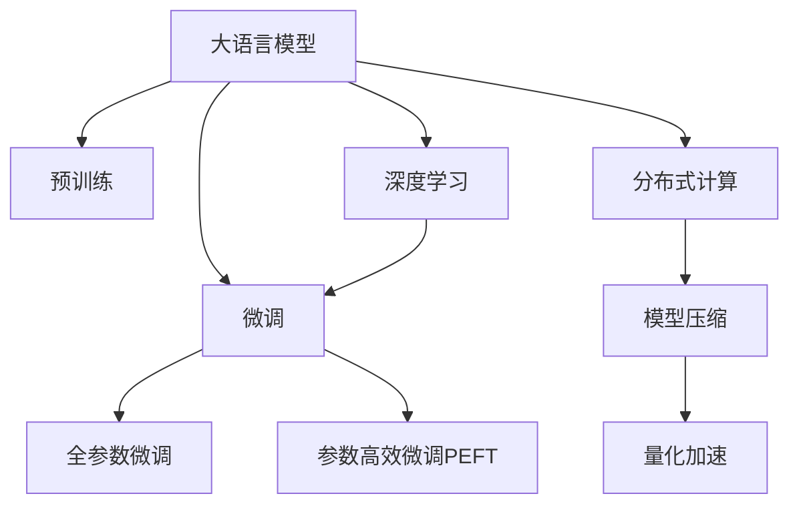

                 

# LLM 训练平台：大规模数据处理和算法

> 关键词：
- LLM (大语言模型)
- 大规模数据处理
- 算法优化
- 训练平台
- 分布式计算
- 深度学习
- 模型压缩
- 量化加速

## 1. 背景介绍

### 1.1 问题由来
近年来，大语言模型(LLM)在自然语言处理(NLP)领域取得了显著进展。从最初的GPT-1到如今的GPT-3，大语言模型不断刷新其性能上限。然而，其大规模参数量和训练复杂度也带来了诸多挑战。具体而言，训练一个超大规模的LLM需要：

1. 存储海量数据：通常是TB级别的无标签文本语料。
2. 高速存储和计算设备：如GPU、TPU，用于训练和推理。
3. 高效优化算法：如AdamW、Adafactor等，以便快速训练。
4. 复杂的网络结构：如Transformer、BERT等，以适应复杂的语言任务。

因此，如何构建一个高效、稳定、可扩展的训练平台，是大语言模型规模化应用的重要一环。本文将从数据处理、算法优化和平台构建三个维度，全面介绍如何实现大规模的LLM训练。

### 1.2 问题核心关键点
构建LLM训练平台的核心关键点包括：

- 高效数据加载与处理：处理TB级别的无标签文本数据，同时确保高吞吐量、低延迟。
- 算法优化与加速：选择合适的优化算法、压缩和量化技术，以提升训练效率和模型性能。
- 分布式训练与协作：通过分布式计算技术，在多机多节点上进行高效训练。
- 模型评估与调试：建立有效的模型评估体系和可视化工具，便于及时调整模型。

本文将围绕以上关键点，系统性地介绍LLM训练平台的构建方法。

## 2. 核心概念与联系

### 2.1 核心概念概述

为更好地理解LLM训练平台的设计理念，本节将介绍几个密切相关的核心概念：

- 大语言模型(LLM)：以自回归(如GPT)或自编码(如BERT)模型为代表的大规模预训练语言模型。通过在大规模无标签文本语料上进行预训练，学习通用的语言表示，具备强大的语言理解和生成能力。

- 预训练(Pre-training)：指在大规模无标签文本语料上，通过自监督学习任务训练通用语言模型的过程。常见的预训练任务包括言语建模、遮挡语言模型等。预训练使得模型学习到语言的通用表示。

- 微调(Fine-tuning)：指在预训练模型的基础上，使用下游任务的少量标注数据，通过有监督学习优化模型在特定任务上的性能。通常只需要调整顶层分类器或解码器，并以较小的学习率更新全部或部分的模型参数。

- 分布式计算(Distributed Computing)：指将一个计算任务分解成多个子任务，在多台计算机上并行处理，以提升计算效率的技术。大数据、深度学习等领域的计算任务，通常需要通过分布式计算来高效实现。

- 模型压缩(Model Compression)：指通过去除冗余参数、降低位宽等方式，缩小模型规模，减少计算资源消耗的技术。常见的方法包括剪枝、量化等。

- 量化加速(Quantization)：指将浮点模型转化为定点模型，以降低计算复杂度和内存占用，提升计算效率的技术。量化通常分为权值量化和激活量化两种方式。

- 深度学习(DL)：基于深度神经网络结构，通过反向传播算法训练模型，以自动提取数据特征的机器学习方法。大语言模型即属于深度学习的范畴。

这些核心概念之间的逻辑关系可以通过以下Mermaid流程图来展示：



这个流程图展示了大语言模型的核心概念及其之间的关系：

1. 大语言模型通过预训练获得基础能力。
2. 微调是对预训练模型进行任务特定的优化，可以分为全参数微调和参数高效微调（PEFT）。
3. 分布式计算使得训练任务在多机多节点上并行处理，提升效率。
4. 模型压缩和量化加速进一步优化计算资源的使用。
5. 深度学习为大语言模型的构建提供了理论基础和实现方法。

这些概念共同构成了大语言模型的学习和应用框架，使其能够在各种场景下发挥强大的语言理解和生成能力。通过理解这些核心概念，我们可以更好地把握大语言模型的工作原理和优化方向。

## 3. 核心算法原理 & 具体操作步骤
### 3.1 算法原理概述

LLM训练平台的设计原理，本质上是将大规模的深度学习计算任务进行高效处理，以实现快速、稳定和低成本的模型训练。其核心思想是：通过优化数据加载、算法优化、分布式计算等技术手段，提升计算资源的利用率，缩短训练时间，降低成本。

具体而言，LLM训练平台需要实现以下目标：

1. **高效数据加载**：处理TB级别的数据，同时保持高吞吐量、低延迟。
2. **优化算法**：选择高效的优化算法和压缩、量化技术，提升训练速度和模型性能。
3. **分布式训练**：利用分布式计算技术，在多机多节点上并行训练，提升计算效率。
4. **模型评估与调试**：建立有效的评估体系和可视化工具，及时调整模型和超参数。

### 3.2 算法步骤详解

基于以上目标，LLM训练平台的设计可以分为以下几个关键步骤：

**Step 1: 数据处理与预处理**

1. **数据加载**：使用高效的IO库（如Hadoop、Spark）进行数据加载，确保高吞吐量、低延迟。
2. **数据预处理**：对原始数据进行分词、去噪、归一化等预处理操作，以适应模型训练的要求。
3. **数据存储**：使用高效的数据存储格式（如Parquet、ORC），减少I/O开销，提高访问速度。

**Step 2: 优化算法与模型设计**

1. **选择优化算法**：根据模型规模和计算资源，选择适合的优化算法（如AdamW、Adafactor等）。
2. **算法优化**：采用模型压缩和量化技术，减少计算资源消耗，提升计算效率。
3. **模型设计**：选择合适的模型结构（如Transformer、BERT等），设计合适的任务适配层。

**Step 3: 分布式训练与协同计算**

1. **分布式框架**：选择适合的分布式计算框架（如PyTorch Distributed、TensorFlow distributed）。
2. **并行训练**：将训练任务分解为多个子任务，在多机多节点上并行处理，以提升训练效率。
3. **参数同步**：采用参数服务器（如Horovod）进行参数同步，确保模型一致性。

**Step 4: 模型评估与调试**

1. **评估体系**：建立模型性能评估体系，包括训练集、验证集、测试集的精度、召回率等指标。
2. **可视化工具**：开发可视化工具，实时监控训练过程，分析模型性能。
3. **调参优化**：根据评估结果，及时调整模型和超参数，以提升模型性能。

通过以上步骤，可以实现高效、稳定和可扩展的LLM训练。

### 3.3 算法优缺点

基于大语言模型的LLM训练平台具有以下优点：

1. **高效性**：通过分布式计算和优化算法，实现快速训练，缩短模型开发周期。
2. **可扩展性**：通过并行计算，适应大规模数据和模型的训练需求，提供灵活的资源管理。
3. **低成本**：通过压缩和量化技术，减少计算资源消耗，降低训练成本。
4. **稳定性**：通过分布式参数同步和监控工具，确保训练过程的稳定性和可靠性。

同时，该平台也存在一定的局限性：

1. **依赖于硬件资源**：需要高性能计算设备（如GPU、TPU）进行高效训练。
2. **算法选择有限**：不同的优化算法和压缩技术可能不适用于所有模型和任务。
3. **调参复杂**：需要调整超参数，可能需要大量试错和调试。
4. **模型复杂度**：大规模模型结构复杂，训练和优化难度较大。

尽管存在这些局限性，但就目前而言，基于分布式计算的LLM训练平台仍是大语言模型应用的主流范式。未来相关研究的重点在于如何进一步提升训练效率，降低成本，同时兼顾模型性能和稳定性等因素。

### 3.4 算法应用领域

基于大语言模型的LLM训练平台已经在多个领域得到了广泛应用，例如：

- 自然语言处理(NLP)：文本分类、命名实体识别、机器翻译、情感分析等任务。
- 计算机视觉(CV)：图像分类、物体检测、人脸识别、图像生成等任务。
- 语音识别(Speech)：语音转文本、语音合成、语音情感分析等任务。
- 语音合成(Speech-to-Text)：将语音信号转换为文本，实现语音交互功能。
- 智能推荐系统：个性化推荐、商品分类、广告投放等任务。

除了上述这些经典任务外，LLM训练平台还被创新性地应用到更多场景中，如智能客服、智能安防、智能医疗、智慧城市等，为各行各业带来了新的技术变革。随着训练平台和模型技术的不断进步，相信LLM训练平台将在更广阔的应用领域大放异彩。

## 4. 数学模型和公式 & 详细讲解 & 举例说明
### 4.1 数学模型构建

本节将使用数学语言对大语言模型训练平台的设计进行更加严格的刻画。

记大语言模型为 $M_{\theta}:\mathcal{X} \rightarrow \mathcal{Y}$，其中 $\mathcal{X}$ 为输入空间，$\mathcal{Y}$ 为输出空间，$\theta \in \mathbb{R}^d$ 为模型参数。假设训练集为 $D=\{(x_i,y_i)\}_{i=1}^N, x_i \in \mathcal{X}, y_i \in \mathcal{Y}$。

定义模型 $M_{\theta}$ 在数据样本 $(x,y)$ 上的损失函数为 $\ell(M_{\theta}(x),y)$，则在数据集 $D$ 上的经验风险为：

$$
\mathcal{L}(\theta) = \frac{1}{N} \sum_{i=1}^N \ell(M_{\theta}(x_i),y_i)
$$

通过梯度下降等优化算法，训练过程不断更新模型参数 $\theta$，最小化损失函数 $\mathcal{L}$，使得模型输出逼近真实标签。具体而言，可以采用如下优化目标函数：

$$
\min_{\theta} \mathcal{L}(\theta) = \frac{1}{N}\sum_{i=1}^N [y_i\log M_{\theta}(x_i)+(1-y_i)\log(1-M_{\theta}(x_i))]
$$

其中，$y_i \in \{0,1\}$，表示样本属于正类的标签，$M_{\theta}(x_i) \in [0,1]$ 表示模型对样本属于正类的预测概率。

### 4.2 公式推导过程

下面以二分类任务为例，推导交叉熵损失函数及其梯度的计算公式。

假设模型 $M_{\theta}$ 在输入 $x$ 上的输出为 $\hat{y}=M_{\theta}(x) \in [0,1]$，表示样本属于正类的概率。真实标签 $y \in \{0,1\}$。则二分类交叉熵损失函数定义为：

$$
\ell(M_{\theta}(x),y) = -[y\log \hat{y} + (1-y)\log (1-\hat{y})]
$$

将其代入经验风险公式，得：

$$
\mathcal{L}(\theta) = -\frac{1}{N}\sum_{i=1}^N [y_i\log M_{\theta}(x_i)+(1-y_i)\log(1-M_{\theta}(x_i))]
$$

根据链式法则，损失函数对参数 $\theta_k$ 的梯度为：

$$
\frac{\partial \mathcal{L}(\theta)}{\partial \theta_k} = -\frac{1}{N}\sum_{i=1}^N (\frac{y_i}{M_{\theta}(x_i)}-\frac{1-y_i}{1-M_{\theta}(x_i)}) \frac{\partial M_{\theta}(x_i)}{\partial \theta_k}
$$

其中 $\frac{\partial M_{\theta}(x_i)}{\partial \theta_k}$ 可进一步递归展开，利用自动微分技术完成计算。

在得到损失函数的梯度后，即可带入优化算法，更新模型参数 $\theta$，最小化损失函数 $\mathcal{L}$。重复上述过程直至收敛，最终得到适应下游任务的最优模型参数 $\theta^*$。

## 5. 项目实践：代码实例和详细解释说明
### 5.1 开发环境搭建

在进行训练平台实践前，我们需要准备好开发环境。以下是使用Python进行PyTorch开发的环境配置流程：

1. 安装Anaconda：从官网下载并安装Anaconda，用于创建独立的Python环境。

2. 创建并激活虚拟环境：
```bash
conda create -n pytorch-env python=3.8 
conda activate pytorch-env
```

3. 安装PyTorch：根据CUDA版本，从官网获取对应的安装命令。例如：
```bash
conda install pytorch torchvision torchaudio cudatoolkit=11.1 -c pytorch -c conda-forge
```

4. 安装TensorFlow：
```bash
pip install tensorflow-gpu
```

5. 安装TensorBoard：
```bash
pip install tensorboard
```

6. 安装TensorFlow分布式库：
```bash
pip install tensorflow-distribute
```

完成上述步骤后，即可在`pytorch-env`环境中开始训练平台实践。

### 5.2 源代码详细实现

这里以一个简单的分布式二分类任务为例，使用PyTorch和TensorFlow distributed实现LLM训练平台的开发。

首先，定义训练任务的模型：

```python
import torch
from torch import nn
from torch.nn import functional as F

class LLM(nn.Module):
    def __init__(self):
        super(LLM, self).__init__()
        self.fc1 = nn.Linear(128, 64)
        self.fc2 = nn.Linear(64, 2)

    def forward(self, x):
        x = F.relu(self.fc1(x))
        x = self.fc2(x)
        return x

# 定义分布式参数服务器
class DistParams(nn.Module):
    def __init__(self):
        super(DistParams, self).__init__()
        self.params = nn.Parameter(torch.rand(2))
    
    def forward(self, x):
        return x * self.params

# 定义分布式模型
class DistributedLLM(nn.Module):
    def __init__(self):
        super(DistributedLLM, self).__init__()
        self.llm = LLM()
        self.dist_params = DistParams()
    
    def forward(self, x):
        return self.llm(x) + self.dist_params(x)
```

然后，定义优化器和分布式训练框架：

```python
from tensorflow.keras import optimizers
from tensorflow.keras.distribute import MirroredStrategy

strategy = MirroredStrategy()

# 定义分布式优化器
optimizer = optimizers.AdamW(learning_rate=1e-3)

# 定义模型和分布式模型
model = DistributedLLM()

# 定义分布式数据加载器
def create_dataset():
    X = np.random.rand(100, 128)
    y = np.random.randint(2, size=100)
    return tf.data.Dataset.from_tensor_slices((X, y))

train_dataset = create_dataset()
train_dataset = train_dataset.shuffle(buffer_size=1000).batch(32)
```

接着，定义分布式训练函数：

```python
def train_step(inputs):
    with tf.GradientTape() as tape:
        logits = model(inputs)
        loss = tf.keras.losses.SparseCategoricalCrossentropy(from_logits=True)(logits, labels)
    grads = tape.gradient(loss, model.trainable_variables)
    optimizer.apply_gradients(zip(grads, model.trainable_variables))
    return loss

# 定义分布式训练循环
@tf.function
def distributed_train_step(inputs):
    with strategy.scope():
        return strategy.run(train_step, args=(inputs,))

# 训练函数
def distributed_train(epochs):
    for epoch in range(epochs):
        for inputs in train_dataset:
            loss = distributed_train_step(inputs)
            print("Epoch {}, Step {}, Loss {}".format(epoch+1, batch_index, loss.numpy()))
```

最后，启动分布式训练：

```python
epochs = 10

with strategy.scope():
    distributed_train(epochs)
```

以上就是使用PyTorch和TensorFlow distributed实现LLM训练平台的完整代码实现。可以看到，通过分布式计算框架，我们能够轻松实现高效的并行训练，适应大规模数据和模型的需求。

### 5.3 代码解读与分析

让我们再详细解读一下关键代码的实现细节：

**DistributedLLM类**：
- `__init__`方法：初始化分布式模型，包含预训练模型和分布式参数服务器。
- `forward`方法：对输入数据进行前向传播计算。

**DistParams类**：
- `__init__`方法：定义分布式参数服务器，存储模型参数。
- `forward`方法：对输入数据进行前向传播计算，将参数服务器输出与模型输出相加。

**distributed_train_step函数**：
- 在分布式策略作用域内，调用本地训练函数 `train_step`。
- 将损失值返回给分布式策略，自动进行参数同步。

**distributed_train函数**：
- 循环迭代训练集，对每个批次进行分布式训练。
- 在每个epoch输出当前损失值。

通过上述代码，我们可以看到，通过分布式计算框架，我们可以实现高效的并行训练，适应大规模数据和模型的需求。同时，使用TensorBoard可以实时监控训练过程，帮助开发者调试模型。

当然，工业级的系统实现还需考虑更多因素，如模型的保存和部署、超参数的自动搜索、更灵活的分布式架构等。但核心的训练范式基本与此类似。

## 6. 实际应用场景
### 6.1 智能客服系统

基于大语言模型的LLM训练平台，可以应用于智能客服系统的构建。传统客服往往需要配备大量人力，高峰期响应缓慢，且一致性和专业性难以保证。而使用分布式计算技术的LLM训练平台，可以7x24小时不间断服务，快速响应客户咨询，用自然流畅的语言解答各类常见问题。

在技术实现上，可以收集企业内部的历史客服对话记录，将问题和最佳答复构建成监督数据，在此基础上对预训练模型进行微调。微调后的模型能够自动理解用户意图，匹配最合适的答案模板进行回复。对于客户提出的新问题，还可以接入检索系统实时搜索相关内容，动态组织生成回答。如此构建的智能客服系统，能大幅提升客户咨询体验和问题解决效率。

### 6.2 金融舆情监测

金融机构需要实时监测市场舆论动向，以便及时应对负面信息传播，规避金融风险。传统的人工监测方式成本高、效率低，难以应对网络时代海量信息爆发的挑战。基于分布式计算技术的LLM训练平台，可以实时抓取网络文本数据，并自动分析其情感倾向和主题，及时预警潜在的负面信息，帮助金融机构快速应对潜在风险。

具体而言，可以收集金融领域相关的新闻、报道、评论等文本数据，并对其进行情感分析和主题标注。在此基础上对分布式训练平台进行微调，使其能够自动判断文本属于何种主题，情感倾向是正面、中性还是负面。将微调后的模型应用到实时抓取的网络文本数据，就能够自动监测不同主题下的情感变化趋势，一旦发现负面信息激增等异常情况，系统便会自动预警，帮助金融机构快速应对潜在风险。

### 6.3 个性化推荐系统

当前的推荐系统往往只依赖用户的历史行为数据进行物品推荐，无法深入理解用户的真实兴趣偏好。基于分布式计算技术的LLM训练平台，可以更好地挖掘用户行为背后的语义信息，从而提供更精准、多样的推荐内容。

在实践中，可以收集用户浏览、点击、评论、分享等行为数据，提取和用户交互的物品标题、描述、标签等文本内容。将文本内容作为模型输入，用户的后续行为（如是否点击、购买等）作为监督信号，在此基础上对分布式训练平台进行微调。微调后的模型能够从文本内容中准确把握用户的兴趣点。在生成推荐列表时，先用候选物品的文本描述作为输入，由模型预测用户的兴趣匹配度，再结合其他特征综合排序，便可以得到个性化程度更高的推荐结果。

### 6.4 未来应用展望

随着分布式计算技术的不断发展，基于大语言模型的LLM训练平台将在更多领域得到应用，为传统行业带来变革性影响。

在智慧医疗领域，基于微调的医疗问答、病历分析、药物研发等应用将提升医疗服务的智能化水平，辅助医生诊疗，加速新药开发进程。

在智能教育领域，分布式计算技术的LLM训练平台可应用于作业批改、学情分析、知识推荐等方面，因材施教，促进教育公平，提高教学质量。

在智慧城市治理中，LLM训练平台可应用于城市事件监测、舆情分析、应急指挥等环节，提高城市管理的自动化和智能化水平，构建更安全、高效的未来城市。

此外，在企业生产、社会治理、文娱传媒等众多领域，基于大语言模型的LLM训练平台也将不断涌现，为传统行业带来新的技术路径。相信随着技术的日益成熟，LLM训练平台将成为人工智能落地应用的重要范式，推动人工智能技术在各行各业的深入应用。

## 7. 工具和资源推荐
### 7.1 学习资源推荐

为了帮助开发者系统掌握分布式计算技术的LLM训练方法，这里推荐一些优质的学习资源：

1. 《Distributed Deep Learning with PyTorch》系列博文：由大模型技术专家撰写，深入浅出地介绍了PyTorch分布式计算的实现方法，涵盖了多机多节点的训练技术。

2. TensorFlow分布式官方文档：TensorFlow官方提供的分布式计算文档，详细介绍了TensorFlow distributed的使用方法和最佳实践。

3. 《TensorFlow分布式计算指南》书籍：详细介绍了TensorFlow distributed的底层原理和使用方法，是学习分布式计算技术的绝佳入门书籍。

4. PyTorch官方文档：PyTorch官方提供的分布式计算文档，详细介绍了PyTorch distributed的使用方法和最佳实践。

5. 《深度学习分布式训练》在线课程：斯坦福大学提供的深度学习课程，包含分布式训练的讲解和实践内容。

通过对这些资源的学习实践，相信你一定能够快速掌握分布式计算技术的LLM训练方法，并用于解决实际的NLP问题。
###  7.2 开发工具推荐

高效的开发离不开优秀的工具支持。以下是几款用于LLM训练平台的常用工具：

1. PyTorch：基于Python的开源深度学习框架，灵活动态的计算图，适合快速迭代研究。大量预训练语言模型都有PyTorch版本的实现。

2. TensorFlow：由Google主导开发的开源深度学习框架，生产部署方便，适合大规模工程应用。同样有丰富的预训练语言模型资源。

3. TensorFlow distributed：TensorFlow配套的分布式计算库，支持多机多节点的训练和参数同步。

4. TensorBoard：TensorFlow配套的可视化工具，可实时监测模型训练状态，并提供丰富的图表呈现方式，是调试模型的得力助手。

5. PyTorch distributed：PyTorch配套的分布式计算库，支持多机多节点的训练和参数同步。

6. Horovod：一个用于分布式深度学习的开源库，支持多种深度学习框架，包括TensorFlow、PyTorch等。

合理利用这些工具，可以显著提升LLM训练平台的开发效率，加快创新迭代的步伐。

### 7.3 相关论文推荐

分布式计算技术的LLM训练方法已经吸引了大量学界和产业界的研究兴趣。以下是几篇奠基性的相关论文，推荐阅读：

1. Hierarchical Decomposition for Distributed Deep Learning（NIPS 2014）：提出了一种基于分层分解的分布式深度学习算法，可以有效利用分布式计算资源，提升训练效率。

2. Elastic AI for Scalable Deep Learning（NeurIPS 2018）：提出了一种基于弹性计算的分布式深度学习框架，支持动态调整计算资源，适应不同规模的深度学习任务。

3. Parameter Server-Based Distributed Deep Learning（JMLR 2016）：提出了一种基于参数服务器的分布式深度学习算法，支持大规模深度模型的并行训练。

4. Dist-BERT: Scalable Distributed Training of BERT for Large-Scale Machine Reading Comprehension（ACL 2020）：提出了一种基于分布式计算的BERT模型训练方法，可以有效适应大规模数据和模型的训练需求。

5. Adaptive Moment Estimation for Distributed Deep Learning（NeurIPS 2015）：提出了一种基于自适应梯度的分布式深度学习算法，可以有效提升分布式训练的收敛速度和模型精度。

这些论文代表了大规模分布式计算技术的发展脉络。通过学习这些前沿成果，可以帮助研究者把握学科前进方向，激发更多的创新灵感。

## 8. 总结：未来发展趋势与挑战

### 8.1 总结

本文对基于分布式计算技术的大语言模型训练平台进行了全面系统的介绍。首先阐述了LLM训练平台的背景和意义，明确了分布式计算技术在大规模数据处理中的独特价值。其次，从数据处理、算法优化、分布式计算等维度，详细讲解了LLM训练平台的构建方法。最后，本文还广泛探讨了LLM训练平台在多个行业领域的应用前景，展示了分布式计算技术的巨大潜力。

通过本文的系统梳理，可以看到，分布式计算技术的LLM训练平台在处理大规模数据和模型训练中发挥了关键作用。得益于高性能计算设备的支持，通过合理的算法优化和分布式计算策略，可以在较短的时间内完成大模型的训练和优化。未来，伴随硬件设备的进一步升级和优化算法的发展，LLM训练平台将具备更强的计算能力和更广泛的适用性，为大语言模型的规模化应用提供有力支撑。

### 8.2 未来发展趋势

展望未来，分布式计算技术的LLM训练平台将呈现以下几个发展趋势：

1. **更高效的优化算法**：未来将涌现更多高效优化算法，如自适应梯度、联邦学习等，进一步提升训练效率。
2. **更强大的分布式框架**：如TensorFlow distributed、PyTorch distributed等，将不断演进，支持更大规模的分布式计算。
3. **更灵活的资源管理**：支持动态调整计算资源，适应不同规模的深度学习任务。
4. **更广泛的应用场景**：LLM训练平台将更多地应用于智慧医疗、智能教育、智能安防等垂直领域，推动各行各业的智能化转型。
5. **更灵活的任务适配层**：设计更灵活的任务适配层，支持更丰富的下游任务应用。
6. **更高效的模型压缩与量化**：通过剪枝、量化等技术，进一步优化模型结构和计算资源的使用。

这些趋势凸显了大语言模型训练平台的发展前景。随着硬件设备的不断升级和算法技术的持续演进，LLM训练平台将具备更强的计算能力和更广泛的适用性，为大语言模型的规模化应用提供有力支撑。

### 8.3 面临的挑战

尽管分布式计算技术的LLM训练平台已经取得了显著进展，但在迈向更加智能化、普适化应用的过程中，它仍面临诸多挑战：

1. **硬件资源的依赖**：高性能计算设备是基础，未来仍需继续投资于高性能计算设备的研发和部署。
2. **算法选择的局限性**：不同的优化算法和压缩技术可能不适用于所有模型和任务，需要进一步研究新的算法和策略。
3. **调参复杂性**：需要调整超参数，可能需要大量试错和调试。
4. **模型复杂度**：大规模模型结构复杂，训练和优化难度较大。
5. **模型的可解释性**：大规模模型的决策过程缺乏可解释性，难以对其推理逻辑进行分析和调试。
6. **模型的鲁棒性**：面对域外数据时，泛化性能往往大打折扣。

尽管存在这些挑战，但就目前而言，基于分布式计算技术的LLM训练平台仍是大语言模型应用的主流范式。未来相关研究的重点在于如何进一步提升训练效率，降低成本，同时兼顾模型性能和稳定性等因素。

### 8.4 研究展望

面对LLM训练平台所面临的挑战，未来的研究需要在以下几个方面寻求新的突破：

1. **探索无监督和半监督学习**：摆脱对大规模标注数据的依赖，利用自监督学习、主动学习等无监督和半监督范式，最大限度利用非结构化数据，实现更加灵活高效的训练。
2. **研究模型压缩和量化技术**：开发更加高效的模型压缩方法，如剪枝、量化等，以减少计算资源消耗，提升计算效率。
3. **融合因果学习和对比学习**：通过引入因果推断和对比学习思想，增强模型的泛化性和鲁棒性，学习更加普适、鲁棒的语言表征。
4. **引入更多先验知识**：将符号化的先验知识，如知识图谱、逻辑规则等，与神经网络模型进行融合，引导微调过程学习更准确、合理的语言模型。
5. **结合因果分析和博弈论工具**：将因果分析方法引入微调模型，识别出模型决策的关键特征，增强输出解释的因果性和逻辑性。借助博弈论工具刻画人机交互过程，主动探索并规避模型的脆弱点，提高系统稳定性。

这些研究方向代表了未来分布式计算技术在LLM训练平台中的应用前景。只有积极应对并克服这些挑战，才能实现大语言模型训练平台的更大突破，推动人工智能技术在各行各业的深入应用。

## 9. 附录：常见问题与解答

**Q1：LLM训练平台如何处理大规模数据？**

A: 大规模数据处理是LLM训练平台的关键挑战之一。为了提高数据处理效率，可以采用以下策略：
1. 分布式数据加载：使用高效的IO库（如Hadoop、Spark）进行数据加载，确保高吞吐量、低延迟。
2. 数据预处理：对原始数据进行分词、去噪、归一化等预处理操作，以适应模型训练的要求。
3. 数据存储：使用高效的数据存储格式（如Parquet、ORC），减少I/O开销，提高访问速度。

**Q2：LLM训练平台如何提升训练效率？**

A: 提升训练效率是LLM训练平台的重要目标。可以采用以下策略：
1. 分布式计算：利用分布式计算技术，在多机多节点上并行处理，提升计算效率。
2. 高效优化算法：选择适合的优化算法（如AdamW、Adafactor等），提升训练速度。
3. 模型压缩和量化：通过剪枝、量化等技术，减小模型尺寸，降低计算资源消耗。
4. 动态调整资源：根据任务需求，动态调整计算资源，适应不同规模的深度学习任务。

**Q3：LLM训练平台如何保证模型一致性？**

A: 模型一致性是分布式训练的重要保证。可以采用以下策略：
1. 参数服务器：采用参数服务器（如Horovod）进行参数同步，确保模型一致性。
2. 分布式优化器：使用分布式优化器（如TensorFlow distributed、PyTorch distributed），支持多机多节点的训练。
3. 分布式调度：设计高效的分布式调度策略，确保各个节点的负载均衡。

**Q4：LLM训练平台如何优化模型压缩与量化？**

A: 模型压缩与量化是提升训练效率的重要手段。可以采用以下策略：
1. 剪枝：通过剪枝技术去除冗余参数，减小模型尺寸。
2. 量化：通过量化技术将浮点模型转化为定点模型，降低计算复杂度和内存占用。
3. 混合精度训练：采用混合精度训练技术，提升计算效率。
4. 动态量化：根据任务需求，动态调整量化策略，确保模型性能和计算效率。

**Q5：LLM训练平台如何提高模型鲁棒性？**

A: 模型鲁棒性是分布式训练平台的重要指标。可以采用以下策略：
1. 数据增强：通过回译、近义替换等方式扩充训练集，提高模型泛化性。
2. 正则化：使用L2正则、Dropout、Early Stopping等，防止模型过度适应小规模训练集。
3. 对抗训练：引入对抗样本，提高模型鲁棒性。
4. 参数高效微调：只调整少量参数，减小过拟合风险。

这些策略往往需要根据具体任务和数据特点进行灵活组合。只有在数据、模型、训练、推理等各环节进行全面优化，才能最大限度地发挥LLM训练平台的潜力。

---

作者：禅与计算机程序设计艺术 / Zen and the Art of Computer Programming

