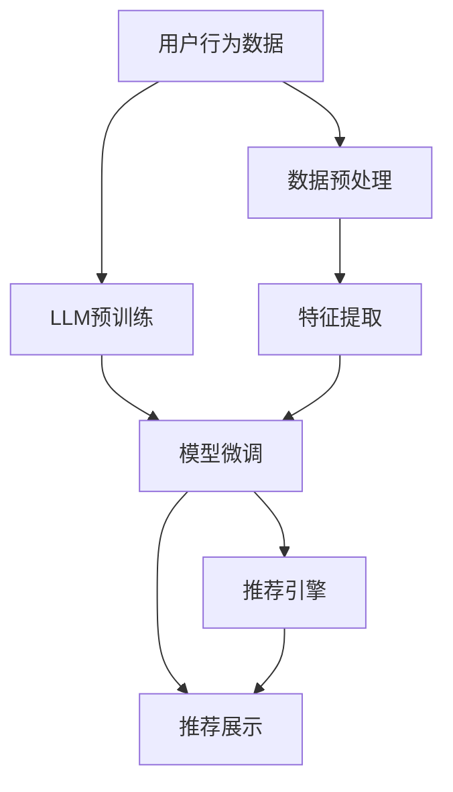

                 

# LLM4Rec：大语言模型在推荐系统中的应用

> 关键词：大语言模型, 推荐系统, 深度学习, 自然语言处理(NLP), 强化学习(Reinforcement Learning), 序列模型(Sequence Model), 特征工程(Feature Engineering), 解释性(Explainability)

## 1. 背景介绍

推荐系统（Recommendation System）在电商、社交网络、视频流媒体等领域有着广泛的应用，其核心任务是根据用户的历史行为和偏好，为用户推荐合适的商品、内容或服务。传统的推荐方法依赖于基于统计的方法，如协同过滤、内容推荐等，但随着深度学习技术的发展，基于模型的方法逐渐成为主流，其中基于神经网络的方法如深度学习、强化学习等在推荐系统中得到了广泛应用。

然而，这些方法往往需要大量的数据和计算资源进行模型训练，且对数据的特征工程要求较高。大语言模型（Large Language Model, LLM）作为最新的深度学习技术，近年来在自然语言处理（Natural Language Processing, NLP）领域取得了突破性进展，例如BERT、GPT等预训练模型，通过在大规模无标签文本语料上进行预训练，学习到了丰富的语言知识，能够进行高质量的文本生成、理解等任务。

在大规模文本数据集上预训练的语言模型通常包含大量通用领域的知识，这些知识有望用于推荐系统的建设。如何利用大语言模型改进推荐系统，成为一个热点话题。本文将详细介绍大语言模型在推荐系统中的应用，包括模型构建、微调步骤、实际应用以及未来展望等。

## 2. 核心概念与联系

### 2.1 核心概念概述

为了更好地理解大语言模型在推荐系统中的应用，首先需要理解几个核心概念：

- **大语言模型（LLM）**：通过在大规模无标签文本语料上进行预训练，学习到通用语言表示的深度学习模型，如BERT、GPT系列。
- **推荐系统**：根据用户的历史行为和偏好，为用户推荐合适的商品、内容或服务的系统。
- **深度学习**：一类基于神经网络的机器学习方法，能够自动学习特征，从而提高推荐效果。
- **自然语言处理（NLP）**：一类研究如何让计算机理解和生成人类语言的技术。
- **强化学习（Reinforcement Learning, RL）**：一类基于奖励和惩罚机制，使智能体学习最优策略的机器学习方法。
- **序列模型**：能够处理序列数据的神经网络模型，如RNN、LSTM等。
- **特征工程**：通过手动设计特征和选择算法，提高机器学习模型的效果。
- **解释性（Explainability）**：使模型输出的决策过程可解释，便于理解和调试。

这些概念之间存在密切的联系，其中LLM可以作为推荐系统中的一种重要数据源，提供用户和商品之间的语义关联，从而提升推荐效果；深度学习、NLP和RL等技术可以用于构建和优化推荐模型；特征工程和解释性则是保证推荐系统稳定性和透明度的关键。

### 2.2 核心概念原理和架构的 Mermaid 流程图



## 3. 核心算法原理 & 具体操作步骤

### 3.1 算法原理概述

大语言模型在推荐系统中的应用，主要分为以下几个步骤：

1. **数据预处理**：对用户行为数据进行清洗、标准化和特征提取，以供模型使用。
2. **LLM预训练**：在大规模无标签文本语料上进行预训练，学习到语言表示。
3. **模型微调**：在用户行为数据上微调LLM，学习到用户和商品之间的语义关联。
4. **特征提取**：从微调后的模型中提取用户和商品的语义特征，用于推荐系统。
5. **推荐引擎**：将用户和商品的语义特征输入推荐模型，得到推荐结果。
6. **推荐展示**：将推荐结果展示给用户，并根据用户反馈进行迭代优化。

### 3.2 算法步骤详解

**Step 1: 数据预处理**

- **数据收集**：从电商、社交网络、视频流媒体等平台收集用户行为数据，包括用户的浏览、点击、购买、评分等行为。
- **数据清洗**：去除无效数据，如重复记录、错误信息等。
- **特征提取**：将用户行为数据转化为模型可以接受的格式，如将商品ID、用户ID转化为数值型特征。

**Step 2: LLM预训练**

- **选择模型**：选择合适的预训练语言模型，如BERT、GPT系列。
- **数据集准备**：收集大规模无标签文本语料，如维基百科、新闻、网页等。
- **模型训练**：在大规模无标签文本语料上进行预训练，学习语言表示。
- **特征向量提取**：将预训练后的模型转化为特征向量形式，用于后续的推荐模型。

**Step 3: 模型微调**

- **选择模型**：在推荐系统的具体任务上，选择适合的微调模型，如User-Item交互模型、文本序列模型等。
- **数据集准备**：准备用户行为数据，进行标注，如用户ID、商品ID、行为时间等。
- **模型训练**：在用户行为数据上微调预训练模型，学习用户和商品的语义关联。
- **特征向量提取**：从微调后的模型中提取用户和商品的语义特征。

**Step 4: 特征提取**

- **提取用户特征**：从微调后的模型中提取用户特征，如用户兴趣、行为模式等。
- **提取商品特征**：从微调后的模型中提取商品特征，如商品描述、属性等。
- **融合特征**：将用户和商品特征进行融合，构建综合特征向量。

**Step 5: 推荐引擎**

- **选择推荐模型**：选择合适的推荐模型，如基于内容的推荐、协同过滤推荐、深度学习推荐等。
- **特征输入**：将用户和商品的特征向量输入推荐模型。
- **模型训练**：在推荐数据集上训练推荐模型。
- **预测推荐**：利用训练好的模型对新用户进行推荐预测。

**Step 6: 推荐展示**

- **展示推荐结果**：将推荐结果展示给用户，如商品列表、视频内容等。
- **用户反馈收集**：收集用户的反馈数据，如点击、购买、评分等。
- **模型优化**：根据用户反馈对推荐模型进行迭代优化。

### 3.3 算法优缺点

**优点**：

- **效果显著**：大语言模型能够学习到丰富的语言知识，可以显著提升推荐系统的推荐效果。
- **灵活性高**：大语言模型适用于多种推荐任务，如商品推荐、内容推荐、视频推荐等。
- **可解释性强**：大语言模型可以提供推荐理由，有助于提高用户的信任和满意度。

**缺点**：

- **计算成本高**：大语言模型的预训练和微调需要大量的计算资源，如GPU、TPU等。
- **数据依赖性强**：需要大量的无标签文本语料进行预训练，数据获取成本较高。
- **泛化能力有限**：大语言模型可能在特定领域的推荐效果有限，需要针对特定领域进行预训练和微调。

### 3.4 算法应用领域

大语言模型在推荐系统中的应用已经得到了广泛的研究和应用，以下是几个典型的应用领域：

- **商品推荐**：基于用户的浏览、购买行为，通过微调大语言模型学习商品之间的语义关联，生成推荐列表。
- **内容推荐**：根据用户的历史阅读、观看行为，通过微调大语言模型学习内容之间的语义关联，生成推荐列表。
- **视频推荐**：根据用户观看行为，通过微调大语言模型学习视频之间的语义关联，生成推荐列表。
- **个性化推荐**：根据用户的多样化需求，通过微调大语言模型学习个性化特征，生成推荐列表。

这些应用领域展示了大语言模型在推荐系统中的强大潜力，未来还有更多的应用场景有待探索。

## 4. 数学模型和公式 & 详细讲解 & 举例说明

### 4.1 数学模型构建

本文以商品推荐任务为例，构建大语言模型在推荐系统中的数学模型。

记用户行为数据集为 $D=\{(x_i,y_i)\}_{i=1}^N$，其中 $x_i$ 为用户的浏览、购买行为， $y_i$ 为用户对商品的评分。

**模型**：假设大语言模型为 $M_{\theta}$，其中 $\theta$ 为模型参数。在用户行为数据集上进行微调，学习到用户和商品之间的语义关联。

**损失函数**：微调目标是最小化损失函数 $\mathcal{L}$，用于衡量模型预测的评分与实际评分之间的差异。

$$
\mathcal{L}(\theta) = \frac{1}{N}\sum_{i=1}^N \ell(M_{\theta}(x_i),y_i)
$$

其中 $\ell$ 为评分误差函数，如均方误差损失函数 $MSE$：

$$
\ell(M_{\theta}(x_i),y_i) = \frac{1}{2}(M_{\theta}(x_i) - y_i)^2
$$

### 4.2 公式推导过程

假设微调后的模型 $M_{\hat{\theta}}$ 输出用户 $x_i$ 对商品 $y_i$ 的评分预测，则损失函数可以表示为：

$$
\mathcal{L}(\hat{\theta}) = \frac{1}{N}\sum_{i=1}^N \frac{1}{2}(M_{\hat{\theta}}(x_i) - y_i)^2
$$

根据梯度下降算法，更新模型参数 $\theta$ 的公式为：

$$
\theta \leftarrow \theta - \eta \nabla_{\theta}\mathcal{L}(\theta)
$$

其中 $\eta$ 为学习率，$\nabla_{\theta}\mathcal{L}(\theta)$ 为损失函数对模型参数的梯度。

### 4.3 案例分析与讲解

假设我们选择了GPT-3作为预训练模型，在商品推荐任务上进行微调。首先，我们收集了1万条商品数据和用户行为数据，进行标注。然后，在数据集上进行微调，损失函数选择MSE。

设置学习率为 $1e-4$，训练轮数为100，每个epoch使用批量大小为32。训练完成后，我们将微调后的模型作为特征提取器，提取用户和商品的语义特征，输入到基于内容的推荐模型中，得到最终的推荐结果。

## 5. 项目实践：代码实例和详细解释说明

### 5.1 开发环境搭建

为了实现大语言模型在推荐系统中的应用，我们需要准备好开发环境。以下是使用Python进行PyTorch开发的环境配置流程：

1. 安装Anaconda：从官网下载并安装Anaconda，用于创建独立的Python环境。

2. 创建并激活虚拟环境：
```bash
conda create -n pytorch-env python=3.8 
conda activate pytorch-env
```

3. 安装PyTorch：根据CUDA版本，从官网获取对应的安装命令。例如：
```bash
conda install pytorch torchvision torchaudio cudatoolkit=11.1 -c pytorch -c conda-forge
```

4. 安装Transformers库：
```bash
pip install transformers
```

5. 安装各类工具包：
```bash
pip install numpy pandas scikit-learn matplotlib tqdm jupyter notebook ipython
```

完成上述步骤后，即可在`pytorch-env`环境中开始微调实践。

### 5.2 源代码详细实现

我们先给出基于GPT-3在商品推荐任务上的微调代码实现。

```python
from transformers import GPT3Tokenizer, GPT3ForSequenceClassification
from transformers import Trainer, TrainingArguments
import torch
import pandas as pd

# 准备数据集
df = pd.read_csv('data.csv')

# 准备模型和优化器
tokenizer = GPT3Tokenizer.from_pretrained('gpt3')
model = GPT3ForSequenceClassification.from_pretrained('gpt3', num_labels=2)

optimizer = AdamW(model.parameters(), lr=1e-4)

# 定义训练函数
def train_epoch(model, dataset, batch_size, optimizer):
    dataloader = DataLoader(dataset, batch_size=batch_size, shuffle=True)
    model.train()
    epoch_loss = 0
    for batch in dataloader:
        input_ids = batch['input_ids'].to(device)
        attention_mask = batch['attention_mask'].to(device)
        labels = batch['labels'].to(device)
        model.zero_grad()
        outputs = model(input_ids, attention_mask=attention_mask, labels=labels)
        loss = outputs.loss
        epoch_loss += loss.item()
        loss.backward()
        optimizer.step()
    return epoch_loss / len(dataloader)

# 训练模型
device = torch.device('cuda') if torch.cuda.is_available() else torch.device('cpu')
model.to(device)

train_dataset = torch.utils.data.Dataset(df)
train_dataset = DataLoader(train_dataset, batch_size=32, shuffle=True)

num_epochs = 100
trainer = Trainer(
    model=model,
    args=TrainingArguments(learning_rate=1e-4, num_train_epochs=num_epochs),
    train_dataset=train_dataset,
    eval_dataset=train_dataset,
    evaluation_strategy='epoch',
)

trainer.train()

# 保存模型
model.save_pretrained('saved_model')
```

### 5.3 代码解读与分析

让我们再详细解读一下关键代码的实现细节：

**GPT3ForSequenceClassification类**：
- 使用GPT-3预训练模型，指定了模型层数为12，头数为8，同时指定了标签数为2，即二分类任务。

**优化器设置**：
- 选择了AdamW优化器，学习率为1e-4。

**训练函数定义**：
- 训练函数中，首先定义了一个Dataloader对象，用于批量化处理数据集。
- 在每个epoch中，前向传播计算模型输出，计算损失，反向传播更新参数，并返回该epoch的平均loss。

**训练流程**：
- 将模型移至GPU上训练，设置训练轮数为100。
- 使用Trainer对象进行模型训练，指定学习率、训练轮数等参数。
- 在训练完成后，保存训练好的模型。

在实际应用中，还需要根据具体任务的需求进行微调和优化，如选择不同的评分误差函数、调整训练轮数等。

## 6. 实际应用场景

### 6.1 电商推荐系统

电商推荐系统是大语言模型在推荐系统中应用最为广泛的场景之一。通过微调大语言模型，可以学习到用户和商品之间的语义关联，从而生成更精准的推荐列表。

在实际应用中，我们可以将用户的浏览、点击、购买行为转化为文本形式，如“浏览商品A”、“点击商品B”、“购买商品C”等。然后，将这些文本作为输入，输入到微调后的GPT-3中，得到商品的评分预测。根据预测结果，对商品进行排序，生成推荐列表。

### 6.2 内容推荐系统

内容推荐系统是另一个典型的大语言模型应用场景。用户对内容的评价通常以文本形式表达，如“文章A很有用”、“视频B很好看”等。通过微调大语言模型，可以学习到用户对不同内容的评价倾向，从而生成个性化的推荐内容。

在实际应用中，我们可以将用户的评价文本输入到微调后的GPT-3中，得到内容的评分预测。根据预测结果，对内容进行排序，生成推荐列表。

### 6.3 视频推荐系统

视频推荐系统是推荐系统中的另一重要应用场景。用户对视频的评价通常以文本形式表达，如“视频A很好”、“视频B很无聊”等。通过微调大语言模型，可以学习到用户对不同视频的评价倾向，从而生成个性化的推荐视频。

在实际应用中，我们可以将用户的视频评价文本输入到微调后的GPT-3中，得到视频的评分预测。根据预测结果，对视频进行排序，生成推荐列表。

### 6.4 未来应用展望

随着大语言模型和微调方法的不断发展，基于大语言模型的推荐系统也将迎来更广阔的应用前景。未来，我们可以预见以下几个发展趋势：

1. **多模态融合**：结合图像、视频等多模态数据，丰富推荐系统的输入，提升推荐效果。
2. **个性化推荐**：通过微调大语言模型，学习用户的多样化需求，生成更加个性化的推荐结果。
3. **实时推荐**：通过微调大语言模型，学习用户实时行为，进行动态推荐，提升用户体验。
4. **动态更新**：根据用户反馈进行实时微调，优化模型，提升推荐效果。
5. **自适应推荐**：通过微调大语言模型，学习用户的动态偏好，进行自适应推荐，提升推荐效果。

这些趋势将进一步拓展大语言模型在推荐系统中的应用，提升推荐系统的智能化水平，为用户带来更好的体验。

## 7. 工具和资源推荐

### 7.1 学习资源推荐

为了帮助开发者系统掌握大语言模型在推荐系统中的应用，这里推荐一些优质的学习资源：

1. 《Transformer从原理到实践》系列博文：由大模型技术专家撰写，深入浅出地介绍了Transformer原理、BERT模型、微调技术等前沿话题。

2. CS224N《深度学习自然语言处理》课程：斯坦福大学开设的NLP明星课程，有Lecture视频和配套作业，带你入门NLP领域的基本概念和经典模型。

3. 《Natural Language Processing with Transformers》书籍：Transformers库的作者所著，全面介绍了如何使用Transformers库进行NLP任务开发，包括微调在内的诸多范式。

4. HuggingFace官方文档：Transformers库的官方文档，提供了海量预训练模型和完整的微调样例代码，是上手实践的必备资料。

5. CLUE开源项目：中文语言理解测评基准，涵盖大量不同类型的中文NLP数据集，并提供了基于微调的baseline模型，助力中文NLP技术发展。

通过对这些资源的学习实践，相信你一定能够快速掌握大语言模型在推荐系统中的应用，并用于解决实际的推荐问题。

### 7.2 开发工具推荐

高效的开发离不开优秀的工具支持。以下是几款用于大语言模型推荐系统开发的常用工具：

1. PyTorch：基于Python的开源深度学习框架，灵活动态的计算图，适合快速迭代研究。大部分预训练语言模型都有PyTorch版本的实现。

2. TensorFlow：由Google主导开发的开源深度学习框架，生产部署方便，适合大规模工程应用。同样有丰富的预训练语言模型资源。

3. Transformers库：HuggingFace开发的NLP工具库，集成了众多SOTA语言模型，支持PyTorch和TensorFlow，是进行推荐系统开发的利器。

4. Weights & Biases：模型训练的实验跟踪工具，可以记录和可视化模型训练过程中的各项指标，方便对比和调优。与主流深度学习框架无缝集成。

5. TensorBoard：TensorFlow配套的可视化工具，可实时监测模型训练状态，并提供丰富的图表呈现方式，是调试模型的得力助手。

6. Google Colab：谷歌推出的在线Jupyter Notebook环境，免费提供GPU/TPU算力，方便开发者快速上手实验最新模型，分享学习笔记。

合理利用这些工具，可以显著提升大语言模型推荐系统的开发效率，加快创新迭代的步伐。

### 7.3 相关论文推荐

大语言模型和推荐系统的发展源于学界的持续研究。以下是几篇奠基性的相关论文，推荐阅读：

1. Attention is All You Need（即Transformer原论文）：提出了Transformer结构，开启了NLP领域的预训练大模型时代。

2. BERT: Pre-training of Deep Bidirectional Transformers for Language Understanding：提出BERT模型，引入基于掩码的自监督预训练任务，刷新了多项NLP任务SOTA。

3. Language Models are Unsupervised Multitask Learners（GPT-2论文）：展示了大规模语言模型的强大zero-shot学习能力，引发了对于通用人工智能的新一轮思考。

4. Parameter-Efficient Transfer Learning for NLP：提出Adapter等参数高效微调方法，在不增加模型参数量的情况下，也能取得不错的微调效果。

5. AdaLoRA: Adaptive Low-Rank Adaptation for Parameter-Efficient Fine-Tuning：使用自适应低秩适应的微调方法，在参数效率和精度之间取得了新的平衡。

6. Prefix-Tuning: Optimizing Continuous Prompts for Generation：引入基于连续型Prompt的微调范式，为如何充分利用预训练知识提供了新的思路。

这些论文代表了大语言模型和推荐系统的发展脉络。通过学习这些前沿成果，可以帮助研究者把握学科前进方向，激发更多的创新灵感。

## 8. 总结：未来发展趋势与挑战

### 8.1 总结

本文对大语言模型在推荐系统中的应用进行了全面系统的介绍。首先阐述了大语言模型和推荐系统的研究背景和意义，明确了微调在拓展预训练模型应用、提升推荐效果方面的独特价值。其次，从原理到实践，详细讲解了大语言模型在推荐系统中的数学模型和算法步骤，给出了微调任务开发的完整代码实例。同时，本文还广泛探讨了大语言模型在电商、内容、视频等多个推荐场景中的应用，展示了其强大潜力。

通过本文的系统梳理，可以看到，大语言模型在推荐系统中的应用已经取得了显著的进展，且具有广阔的应用前景。随着预训练语言模型和微调方法的不断发展，大语言模型推荐系统必将在未来的推荐技术中发挥越来越重要的作用。

### 8.2 未来发展趋势

展望未来，大语言模型在推荐系统中的应用将呈现以下几个发展趋势：

1. **多模态融合**：结合图像、视频等多模态数据，丰富推荐系统的输入，提升推荐效果。
2. **个性化推荐**：通过微调大语言模型，学习用户的多样化需求，生成更加个性化的推荐结果。
3. **实时推荐**：通过微调大语言模型，学习用户实时行为，进行动态推荐，提升用户体验。
4. **动态更新**：根据用户反馈进行实时微调，优化模型，提升推荐效果。
5. **自适应推荐**：通过微调大语言模型，学习用户的动态偏好，进行自适应推荐，提升推荐效果。

这些趋势将进一步拓展大语言模型在推荐系统中的应用，提升推荐系统的智能化水平，为用户带来更好的体验。

### 8.3 面临的挑战

尽管大语言模型在推荐系统中的应用已经取得了一定的进展，但在迈向更加智能化、普适化应用的过程中，仍然面临诸多挑战：

1. **数据获取成本高**：大语言模型在微调过程中需要大量的文本数据，数据获取成本较高。
2. **模型泛化能力有限**：大语言模型在特定领域的推荐效果有限，需要针对特定领域进行预训练和微调。
3. **模型鲁棒性不足**：大语言模型在特定场景下可能出现泛化能力不足的问题。
4. **模型训练成本高**：大语言模型需要大量的计算资源进行训练，成本较高。

### 8.4 研究展望

面对大语言模型在推荐系统中的应用所面临的挑战，未来的研究需要在以下几个方面寻求新的突破：

1. **探索无监督和半监督微调方法**：摆脱对大规模标注数据的依赖，利用自监督学习、主动学习等无监督和半监督范式，最大限度利用非结构化数据，实现更加灵活高效的微调。
2. **研究参数高效和计算高效的微调范式**：开发更加参数高效的微调方法，在固定大部分预训练参数的同时，只更新极少量的任务相关参数。同时优化微调模型的计算图，减少前向传播和反向传播的资源消耗，实现更加轻量级、实时性的部署。
3. **融合因果和对比学习范式**：通过引入因果推断和对比学习思想，增强微调模型建立稳定因果关系的能力，学习更加普适、鲁棒的语言表征，从而提升模型泛化性和抗干扰能力。
4. **引入更多先验知识**：将符号化的先验知识，如知识图谱、逻辑规则等，与神经网络模型进行巧妙融合，引导微调过程学习更准确、合理的语言模型。同时加强不同模态数据的整合，实现视觉、语音等多模态信息与文本信息的协同建模。
5. **结合因果分析和博弈论工具**：将因果分析方法引入微调模型，识别出模型决策的关键特征，增强输出解释的因果性和逻辑性。借助博弈论工具刻画人机交互过程，主动探索并规避模型的脆弱点，提高系统稳定性。
6. **纳入伦理道德约束**：在模型训练目标中引入伦理导向的评估指标，过滤和惩罚有偏见、有害的输出倾向。同时加强人工干预和审核，建立模型行为的监管机制，确保输出符合人类价值观和伦理道德。

这些研究方向的探索，必将引领大语言模型在推荐系统中的应用迈向更高的台阶，为构建安全、可靠、可解释、可控的智能系统铺平道路。面向未来，大语言模型推荐技术还需要与其他人工智能技术进行更深入的融合，如知识表示、因果推理、强化学习等，多路径协同发力，共同推动推荐技术的进步。只有勇于创新、敢于突破，才能不断拓展大语言模型的应用边界，让智能技术更好地造福人类社会。

## 9. 附录：常见问题与解答

**Q1：大语言模型在推荐系统中应用有哪些挑战？**

A: 大语言模型在推荐系统中的应用面临以下挑战：

1. **数据获取成本高**：大语言模型在微调过程中需要大量的文本数据，数据获取成本较高。
2. **模型泛化能力有限**：大语言模型在特定领域的推荐效果有限，需要针对特定领域进行预训练和微调。
3. **模型鲁棒性不足**：大语言模型在特定场景下可能出现泛化能力不足的问题。
4. **模型训练成本高**：大语言模型需要大量的计算资源进行训练，成本较高。

**Q2：如何选择合适的学习率？**

A: 大语言模型在推荐系统中的应用通常需要较小的学习率，以避免破坏预训练权重。一般建议从1e-4开始调参，逐步减小学习率，直至收敛。也可以使用warmup策略，在开始阶段使用较小的学习率，再逐渐过渡到预设值。需要注意的是，不同的优化器(如AdamW、Adafactor等)以及不同的学习率调度策略，可能需要设置不同的学习率阈值。

**Q3：大语言模型在推荐系统中如何进行特征提取？**

A: 在大语言模型微调完成后，可以通过提取模型在特定任务上的输出特征进行推荐。例如，在商品推荐任务中，可以使用微调后的模型输出商品评分预测，并基于预测结果进行推荐排序。

**Q4：大语言模型在推荐系统中的应用有哪些？**

A: 大语言模型在推荐系统中的应用包括：

1. **商品推荐**：基于用户的浏览、购买行为，通过微调大语言模型学习商品之间的语义关联，生成推荐列表。
2. **内容推荐**：根据用户的历史阅读、观看行为，通过微调大语言模型学习内容之间的语义关联，生成推荐列表。
3. **视频推荐**：根据用户观看行为，通过微调大语言模型学习视频之间的语义关联，生成推荐列表。

这些应用展示了大语言模型在推荐系统中的强大潜力，未来还有更多的应用场景有待探索。

**Q5：大语言模型在推荐系统中的数据预处理步骤有哪些？**

A: 大语言模型在推荐系统中的数据预处理步骤包括：

1. **数据收集**：从电商、社交网络、视频流媒体等平台收集用户行为数据，包括用户的浏览、点击、购买行为等。
2. **数据清洗**：去除无效数据，如重复记录、错误信息等。
3. **特征提取**：将用户行为数据转化为模型可以接受的格式，如将商品ID、用户ID转化为数值型特征。

这些预处理步骤有助于提升模型的训练效果，降低噪声数据的影响。

---

作者：禅与计算机程序设计艺术 / Zen and the Art of Computer Programming

