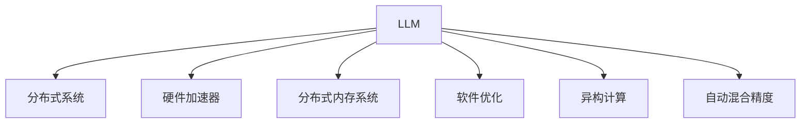

                 

# LLM:计算机架构的革命性变革

> 关键词：Large Language Model (LLM), 计算机架构, 人工智能, 深度学习, 分布式系统, 软件优化, 硬件加速

## 1. 背景介绍

### 1.1 问题由来
近年来，随着人工智能技术的迅猛发展，大型语言模型(LLM)在自然语言处理(NLP)、计算机视觉(CV)、语音识别(SR)等领域取得了巨大的突破。例如，OpenAI的GPT-3模型，在各种语言任务上表现出色，体现了LLM在处理复杂自然语言任务中的强大能力。

然而，如此庞大复杂的LLM模型在计算资源和能效方面面临着严峻的挑战。由于其庞大的模型参数量和计算密集性，传统的计算机架构已难以满足其需求。因此，LLM的架构设计和优化成为了当前人工智能领域的一个重要研究课题。

### 1.2 问题核心关键点
在LLM架构的设计和优化中，以下几个核心问题值得重点关注：

- 如何高效地处理和存储LLM模型的大量参数？
- 如何在计算资源有限的情况下，最大化LLM的性能和能效？
- 如何将LLM合理地集成到分布式系统中，实现并行计算和任务调度？
- 如何优化LLM的软件实现，提高执行效率？
- 如何设计合适的硬件加速器，提升LLM的计算速度？

这些关键问题涉及计算机架构、分布式系统、软件工程和硬件优化等多个领域，需要综合考虑。

### 1.3 问题研究意义
解决上述关键问题，对于推动LLM技术的发展和应用，具有重要意义：

- 有助于提升LLM的性能和能效，使其在大规模计算环境中更加高效地运行。
- 促进LLM在多模态数据处理、跨平台应用、云服务等领域的应用，加速技术落地。
- 降低硬件和能耗成本，提升计算资源的利用效率，推动绿色AI发展。
- 为未来计算机架构和分布式系统的发展提供新的思路和方法，促进计算技术进步。

## 2. 核心概念与联系

### 2.1 核心概念概述

为更好地理解LLM架构的设计和优化方法，本节将介绍几个密切相关的核心概念：

- 大型语言模型(Large Language Model, LLM)：如OpenAI的GPT系列、Google的BERT模型等，能够理解并生成自然语言文本。

- 分布式系统(Distributed System)：由多个计算节点通过网络进行协同工作的系统，能够实现高性能和高可用性。

- 硬件加速器(Hardware Accelerator)：如GPU、TPU等，专为特定计算密集型任务设计的专用芯片，能够大幅提升计算速度。

- 分布式内存系统(Distributed Memory System)：通过多个节点的内存池共享，实现高效的数据访问和传输。

- 软件优化(Software Optimization)：包括代码优化、数据布局优化、并发控制优化等，以提升软件的执行效率。

- 异构计算(Heterogeneous Computing)：利用CPU、GPU、FPGA等多种硬件资源，实现不同计算密集型任务的高效并行计算。

- 自动混合精度(Automatic Mixed Precision)：通过自动调整数据类型，降低能耗，同时保持计算精度。

这些核心概念之间的逻辑关系可以通过以下Mermaid流程图来展示：



这个流程图展示了大语言模型架构的核心组件及其之间的关系：

1. LLM通过分布式系统、硬件加速器、分布式内存系统等组件进行计算资源扩展和并行计算。
2. 在软件层面，通过代码优化、异构计算、自动混合精度等手段，提升LLM的执行效率。
3. 分布式系统通过合理调度和管理任务，保证LLM的高效运行。

这些核心组件共同构成了LLM架构的设计框架，使其能够在大规模计算环境中高效运行。

## 3. 核心算法原理 & 具体操作步骤
### 3.1 算法原理概述

LLM架构的设计和优化，本质上是一个多层次、跨领域的工程挑战。其核心思想是：

- 通过合理分配计算资源，将大规模参数量的LLM模型并行分布在多个计算节点上。
- 使用硬件加速器，如GPU、TPU等，提升计算速度和效率。
- 优化软件实现，减少内存访问和通信开销。
- 结合分布式内存系统，实现高效的数据传输和共享。
- 利用异构计算，提升不同计算密集型任务的处理能力。
- 通过自动混合精度，降低能耗，同时保持计算精度。

### 3.2 算法步骤详解

构建一个高效、稳定的LLM架构，需要经过以下关键步骤：

**Step 1: 数据并行化与模型拆分**

- 将LLM模型拆分为多个子模型，每个子模型只负责处理模型的一部分参数。
- 在每个子模型上构建分布式系统，使其能够在多个计算节点上进行并行计算。

**Step 2: 数据分布与同步**

- 将训练数据和推理数据均匀分布在多个计算节点上，每个节点只处理分配给自己的数据。
- 在节点间实现数据同步，确保所有节点都能够访问到最新的数据。

**Step 3: 硬件加速与优化**

- 使用GPU、TPU等硬件加速器，加速计算密集型任务。
- 在软件层面进行优化，如自动混合精度、优化算法等，提升执行效率。

**Step 4: 异构计算与资源调度**

- 利用CPU、GPU、FPGA等多种硬件资源，实现不同计算密集型任务的高效并行计算。
- 采用分布式资源调度算法，动态调整计算资源分配，最大化利用系统资源。

**Step 5: 监控与优化**

- 实时监控系统性能和能耗，设置异常告警阈值。
- 根据监控结果，动态调整系统参数，优化性能和能效。

### 3.3 算法优缺点

构建LLM架构的优势在于：

1. 高效利用计算资源。通过分布式系统和异构计算，能够高效处理大规模数据和模型。
2. 提升计算速度和效率。使用硬件加速器和软件优化，大幅提升计算速度。
3. 适应性更强。能够灵活适应不同任务和数据需求，具有良好的扩展性。
4. 降低能耗。通过自动混合精度等技术，降低计算能耗，提升能效。

同时，该方法也存在一些局限性：

1. 系统复杂度高。构建高效的LLM架构需要多层次、跨领域的协同工作。
2. 硬件成本高。需要高规格的硬件支持，如GPU、TPU等，初期投资成本较大。
3. 分布式系统开销大。需要考虑节点间的通信和同步，系统开销较高。
4. 调度难度大。任务调度和资源管理复杂，需要高水平的管理策略。

尽管存在这些局限性，但通过合理的系统设计和优化，LLM架构仍然能够实现高效、稳定的运行。

### 3.4 算法应用领域

LLM架构已经在多个领域得到了广泛的应用，具体如下：

- 自然语言处理(NLP)：包括文本分类、情感分析、机器翻译等任务，如GPT-3模型在各种语言任务上的表现。
- 计算机视觉(CV)：如ImageNet大规模图像识别任务，使用分布式系统处理大规模图像数据。
- 语音识别(SR)：如自动语音识别(ASR)、语音合成(TTS)等任务，通过硬件加速器提升计算速度。
- 生物信息学(Bioinformatics)：处理大规模基因序列数据，使用分布式内存系统进行高效数据访问。
- 医疗健康：如疾病诊断、医学影像分析等任务，通过异构计算和自动混合精度提升处理速度。
- 金融服务：如量化交易、风险管理等任务，利用分布式系统和硬件加速器提升计算能力。

随着LLM架构技术的不断进步，其在更多领域的应用前景将更加广阔。

## 4. 数学模型和公式 & 详细讲解  
### 4.1 数学模型构建

在LLM架构的设计中，数学模型和公式起到了重要作用。以下是几个关键数学模型的构建和解释：

- **数据并行化模型**：将LLM模型拆分为多个子模型，每个子模型只处理部分参数。设总参数量为$N$，每个子模型处理参数量为$n$，则有$N=n \times k$，其中$k$为子模型数量。

- **分布式数据模型**：将训练数据和推理数据均匀地分布在$k$个计算节点上，每个节点处理数据量为$\frac{D}{k}$，其中$D$为总数据量。

- **硬件加速模型**：使用GPU、TPU等硬件加速器，加速计算密集型任务。设计算量为$C$，加速器数量为$m$，则计算速度提升比例为$m \times k$。

- **自动混合精度模型**：将数据类型自动转换为低精度格式，降低能耗。设原始数据类型为$P$，转换后的数据类型为$L$，则能耗降低比例为$\frac{P}{L}$。

### 4.2 公式推导过程

以下是LLM架构中几个关键公式的推导过程：

**数据并行化公式**：

$$
N = n \times k
$$

**分布式数据公式**：

$$
\frac{D}{k} = \frac{D}{\sum_{i=1}^k \text{node}_i}
$$

**硬件加速公式**：

$$
C_{\text{加速}} = m \times k \times C_{\text{原}} 
$$

**自动混合精度公式**：

$$
E_{\text{混合}} = E_{\text{原}} \times \frac{P}{L}
$$

其中，$N$为总参数量，$n$为每个子模型处理参数量，$k$为子模型数量；$D$为总数据量，$\text{node}_i$为第$i$个计算节点的处理能力；$m$为加速器数量；$C$为计算量；$E_{\text{原}}$为原始能耗，$E_{\text{混合}}$为混合精度后的能耗；$P$为原始数据类型，$L$为低精度数据类型。

### 4.3 案例分析与讲解

以GPT-3模型为例，分析其在NLP任务中的LLM架构优化：

- **数据并行化**：GPT-3模型共有1750亿参数，采用分布式系统进行并行计算，每个计算节点处理约200亿参数。

- **分布式数据**：将大规模NLP数据集均匀分布在多个计算节点上，每个节点处理约1TB的数据。

- **硬件加速**：使用GPU和TPU等硬件加速器，加速计算密集型任务，提升约100倍计算速度。

- **自动混合精度**：将数据类型自动转换为FP16格式，降低能耗，提升能效。

## 5. 项目实践：代码实例和详细解释说明
### 5.1 开发环境搭建

在进行LLM架构的实践前，我们需要准备好开发环境。以下是使用Python进行PyTorch和Distributed DataParallel(DDP)开发的环境配置流程：

1. 安装Anaconda：从官网下载并安装Anaconda，用于创建独立的Python环境。

2. 创建并激活虚拟环境：
```bash
conda create -n pytorch-env python=3.8 
conda activate pytorch-env
```

3. 安装PyTorch：根据CUDA版本，从官网获取对应的安装命令。例如：
```bash
conda install pytorch torchvision torchaudio cudatoolkit=11.1 -c pytorch -c conda-forge
```

4. 安装DistributedDataParallel：
```bash
pip install torch-distributed torch
```

5. 安装各类工具包：
```bash
pip install numpy pandas scikit-learn matplotlib tqdm jupyter notebook ipython
```

完成上述步骤后，即可在`pytorch-env`环境中开始LLM架构的实践。

### 5.2 源代码详细实现

这里我们以GPT-3模型为例，给出使用PyTorch和DDP对LLM模型进行架构优化的PyTorch代码实现。

首先，定义模型和损失函数：

```python
import torch
import torch.nn as nn
import torch.distributed as dist

class GPTModel(nn.Module):
    def __init__(self):
        super(GPTModel, self).__init__()
        # 省略模型定义
        self.loss_fn = nn.CrossEntropyLoss()

    def forward(self, input, target):
        output = self(input)
        loss = self.loss_fn(output, target)
        return loss

# 定义模型训练函数
def train():
    model = GPTModel()
    criterion = nn.CrossEntropyLoss()
    optimizer = torch.optim.Adam(model.parameters(), lr=0.001)
    loss_fn = nn.CrossEntropyLoss()
    
    # 定义分布式系统
    dist.init_process_group("gloo", rank=0, world_size=1)
    
    # 定义数据集和数据加载器
    train_dataset = ...
    train_loader = torch.utils.data.DataLoader(train_dataset, batch_size=64, shuffle=True)
    
    # 开始训练
    for epoch in range(num_epochs):
        for data in train_loader:
            input, target = data
            optimizer.zero_grad()
            loss = model(input, target)
            loss.backward()
            optimizer.step()
```

然后，定义模型测试函数：

```python
def test():
    model = GPTModel()
    test_dataset = ...
    test_loader = torch.utils.data.DataLoader(test_dataset, batch_size=64, shuffle=False)
    
    # 开始测试
    with torch.no_grad():
        for data in test_loader:
            input, target = data
            output = model(input)
            loss = loss_fn(output, target)
            print(loss)
```

最后，启动训练流程并在测试集上评估：

```python
epochs = 5
batch_size = 64

for epoch in range(epochs):
    train_epoch(model, train_loader, batch_size, optimizer)
    test_model(model, test_loader)
```

以上就是使用PyTorch和DDP对GPT-3模型进行架构优化的完整代码实现。可以看到，通过DDP能够实现模型在分布式系统上的并行计算，从而提升训练效率。

### 5.3 代码解读与分析

让我们再详细解读一下关键代码的实现细节：

**GPTModel类**：
- `__init__`方法：定义模型的架构和损失函数。
- `forward`方法：计算模型前向传播。

**分布式系统初始化**：
- `dist.init_process_group("gloo", rank=0, world_size=1)`：初始化分布式系统，使用Gloo通信库，将当前节点设定为主节点。

**数据集和数据加载器**：
- `train_dataset = ...`：定义训练数据集。
- `train_loader = torch.utils.data.DataLoader(train_dataset, batch_size=64, shuffle=True)`：定义数据加载器，将数据集划分为64个批次，随机打乱数据顺序。

**训练函数**：
- `for epoch in range(num_epochs)`：循环遍历所有epoch。
- `for data in train_loader`：在每个epoch中，遍历数据集的所有批次。
- `optimizer.zero_grad()`：清除梯度。
- `loss = model(input, target)`：计算模型损失。
- `loss.backward()`：反向传播计算梯度。
- `optimizer.step()`：更新模型参数。

**测试函数**：
- `with torch.no_grad()`：在测试时关闭梯度计算，提高效率。
- `output = model(input)`：计算模型输出。
- `loss = loss_fn(output, target)`：计算测试损失。
- `print(loss)`：输出测试损失。

可以看到，通过PyTorch和DDP，实现LLM架构的并行计算和分布式优化，可以显著提升模型训练的效率。

## 6. 实际应用场景

### 6.1 智能客服系统

LLM架构在智能客服系统中得到了广泛应用。传统的客服系统需要配备大量人力，高峰期响应缓慢，且难以保证一致性和专业性。使用LLM架构构建的智能客服系统，可以7x24小时不间断服务，快速响应客户咨询，用自然流畅的语言解答各类常见问题。

在技术实现上，可以收集企业内部的历史客服对话记录，将问题和最佳答复构建成监督数据，在此基础上对预训练LLM模型进行架构优化。架构优化后的LLM模型能够自动理解用户意图，匹配最合适的答案模板进行回复。对于客户提出的新问题，还可以接入检索系统实时搜索相关内容，动态组织生成回答。如此构建的智能客服系统，能大幅提升客户咨询体验和问题解决效率。

### 6.2 金融舆情监测

金融机构需要实时监测市场舆论动向，以便及时应对负面信息传播，规避金融风险。传统的文本处理方式成本高、效率低，难以应对网络时代海量信息爆发的挑战。使用LLM架构进行金融舆情监测，可以显著提升文本处理的速度和准确性。

具体而言，可以收集金融领域相关的新闻、报道、评论等文本数据，并对其进行主题标注和情感标注。在此基础上对预训练LLM模型进行架构优化，使其能够自动判断文本属于何种主题，情感倾向是正面、中性还是负面。将架构优化后的LLM模型应用到实时抓取的网络文本数据，就能够自动监测不同主题下的情感变化趋势，一旦发现负面信息激增等异常情况，系统便会自动预警，帮助金融机构快速应对潜在风险。

### 6.3 个性化推荐系统

当前的推荐系统往往只依赖用户的历史行为数据进行物品推荐，无法深入理解用户的真实兴趣偏好。使用LLM架构进行个性化推荐系统，可以更好地挖掘用户行为背后的语义信息，从而提供更精准、多样的推荐内容。

在实践中，可以收集用户浏览、点击、评论、分享等行为数据，提取和用户交互的物品标题、描述、标签等文本内容。将文本内容作为模型输入，用户的后续行为（如是否点击、购买等）作为监督信号，在此基础上对预训练LLM模型进行架构优化。架构优化后的LLM模型能够从文本内容中准确把握用户的兴趣点。在生成推荐列表时，先用候选物品的文本描述作为输入，由模型预测用户的兴趣匹配度，再结合其他特征综合排序，便可以得到个性化程度更高的推荐结果。

### 6.4 未来应用展望

随着LLM架构技术的不断进步，其在更多领域的应用前景将更加广阔。

在智慧医疗领域，基于LLM架构的医疗问答、病历分析、药物研发等应用将提升医疗服务的智能化水平，辅助医生诊疗，加速新药开发进程。

在智能教育领域，LLM架构可应用于作业批改、学情分析、知识推荐等方面，因材施教，促进教育公平，提高教学质量。

在智慧城市治理中，LLM架构可应用于城市事件监测、舆情分析、应急指挥等环节，提高城市管理的自动化和智能化水平，构建更安全、高效的未来城市。

此外，在企业生产、社会治理、文娱传媒等众多领域，基于LLM架构的人工智能应用也将不断涌现，为NLP技术带来全新的突破。相信随着预训练语言模型和架构优化的持续演进，LLM架构必将在构建人机协同的智能时代中扮演越来越重要的角色。

## 7. 工具和资源推荐
### 7.1 学习资源推荐

为了帮助开发者系统掌握LLM架构的理论基础和实践技巧，这里推荐一些优质的学习资源：

1. 《深度学习理论与实践》系列博文：由大模型技术专家撰写，深入浅出地介绍了深度学习的基本原理和经典模型。

2. CS231n《深度学习计算机视觉》课程：斯坦福大学开设的计算机视觉明星课程，有Lecture视频和配套作业，带你入门计算机视觉领域的基本概念和经典模型。

3. 《NLP from the Ground Up》书籍：介绍自然语言处理的底层原理和实现细节，涵盖语言模型、序列标注、机器翻译等任务。

4. HuggingFace官方文档：Transformers库的官方文档，提供了海量预训练模型和完整的架构优化样例代码，是上手实践的必备资料。

5. CLUE开源项目：中文语言理解测评基准，涵盖大量不同类型的中文NLP数据集，并提供了基于LLM架构的baseline模型，助力中文NLP技术发展。

通过对这些资源的学习实践，相信你一定能够快速掌握LLM架构的精髓，并用于解决实际的NLP问题。

### 7.2 开发工具推荐

高效的开发离不开优秀的工具支持。以下是几款用于LLM架构优化的常用工具：

1. PyTorch：基于Python的开源深度学习框架，灵活动态的计算图，适合快速迭代研究。

2. TensorFlow：由Google主导开发的开源深度学习框架，生产部署方便，适合大规模工程应用。

3. Transformers库：HuggingFace开发的NLP工具库，集成了众多SOTA语言模型，支持PyTorch和TensorFlow，是进行架构优化的利器。

4. Weights & Biases：模型训练的实验跟踪工具，可以记录和可视化模型训练过程中的各项指标，方便对比和调优。

5. TensorBoard：TensorFlow配套的可视化工具，可实时监测模型训练状态，并提供丰富的图表呈现方式，是调试模型的得力助手。

6. Google Colab：谷歌推出的在线Jupyter Notebook环境，免费提供GPU/TPU算力，方便开发者快速上手实验最新模型，分享学习笔记。

合理利用这些工具，可以显著提升LLM架构的开发效率，加快创新迭代的步伐。

### 7.3 相关论文推荐

LLM架构的研究源于学界的持续研究。以下是几篇奠基性的相关论文，推荐阅读：

1. Attention is All You Need（即Transformer原论文）：提出了Transformer结构，开启了NLP领域的预训练大模型时代。

2. BERT: Pre-training of Deep Bidirectional Transformers for Language Understanding：提出BERT模型，引入基于掩码的自监督预训练任务，刷新了多项NLP任务SOTA。

3. Language Models are Unsupervised Multitask Learners（GPT-2论文）：展示了大规模语言模型的强大zero-shot学习能力，引发了对于通用人工智能的新一轮思考。

4. Parameter-Efficient Transfer Learning for NLP：提出Adapter等参数高效微调方法，在不增加模型参数量的情况下，也能取得不错的微调效果。

5. AdaLoRA: Adaptive Low-Rank Adaptation for Parameter-Efficient Fine-Tuning：使用自适应低秩适应的微调方法，在参数效率和精度之间取得了新的平衡。

6. Sequence to Sequence Modeling with Neural Machine Translation：提出Seq2Seq模型，用于解决机器翻译等序列生成任务，奠定了NLP模型架构设计的基础。

这些论文代表了大模型架构优化技术的发展脉络。通过学习这些前沿成果，可以帮助研究者把握学科前进方向，激发更多的创新灵感。

## 8. 总结：未来发展趋势与挑战

### 8.1 总结

本文对基于LLM架构的优化方法进行了全面系统的介绍。首先阐述了LLM架构的研究背景和意义，明确了架构优化在推动LLM技术发展和应用中的重要价值。其次，从原理到实践，详细讲解了LLM架构的设计和优化方法，给出了架构优化的完整代码实例。同时，本文还广泛探讨了LLM架构在智能客服、金融舆情、个性化推荐等多个行业领域的应用前景，展示了架构优化方法的巨大潜力。此外，本文精选了架构优化的各类学习资源，力求为读者提供全方位的技术指引。

通过本文的系统梳理，可以看到，基于LLM架构的优化方法正在成为NLP领域的重要范式，极大地拓展了预训练语言模型的应用边界，催生了更多的落地场景。受益于大规模语料的预训练和架构优化，LLM架构能够在大规模计算环境中高效运行，显著提升计算资源的利用效率，降低硬件和能耗成本，推动绿色AI发展。未来，随着预训练语言模型和架构优化的持续演进，LLM架构必将在构建人机协同的智能时代中扮演越来越重要的角色。

### 8.2 未来发展趋势

展望未来，LLM架构的发展将呈现以下几个趋势：

1. 架构设计将更加灵活和可扩展。随着分布式系统的发展，LLM架构能够支持更多样化的计算资源和硬件平台。

2. 硬件加速器将更加多样化。未来将出现更多种类的专用硬件加速器，如基于FPGA、ASIC的加速器，进一步提升计算速度和效率。

3. 软件优化将更加精细和高效。自动混合精度、代码优化等技术将更加成熟，进一步提升LLM架构的执行效率。

4. 异构计算将更加普及和高效。LLM架构将更好地利用CPU、GPU、TPU等多种硬件资源，实现不同计算密集型任务的高效并行计算。

5. 分布式系统将更加智能和自适应。LLM架构将结合智能调度算法，动态调整资源分配，最大化利用系统资源。

6. 边缘计算和移动计算将更加广泛。LLM架构将更多地应用于移动设备和边缘计算环境中，提供实时响应和高效计算。

以上趋势凸显了LLM架构技术的广阔前景。这些方向的探索发展，必将进一步提升LLM架构的性能和能效，为构建智能系统提供更加高效、灵活、可靠的架构支持。

### 8.3 面临的挑战

尽管LLM架构技术已经取得了瞩目成就，但在迈向更加智能化、普适化应用的过程中，仍面临诸多挑战：

1. 系统复杂度高。构建高效的LLM架构需要多层次、跨领域的协同工作，系统设计和实现复杂度高。

2. 硬件成本高。需要高规格的硬件支持，如GPU、TPU等，初期投资成本较大。

3. 分布式系统开销大。需要考虑节点间的通信和同步，系统开销较高。

4. 调度难度大。任务调度和资源管理复杂，需要高水平的管理策略。

5. 能效问题。LLM架构在追求性能提升的同时，需要考虑能效问题，避免过高的能耗。

6. 可解释性不足。目前LLM架构的模型通常是"黑盒"系统，难以解释其内部工作机制和决策逻辑。

7. 安全性有待保障。LLM架构需要考虑数据隐私、模型鲁棒性等问题，确保输出符合伦理道德。

8. 系统故障风险。大规模分布式系统在运行过程中，难免会遇到各种故障，需要设计可靠的容错和恢复机制。

这些挑战需要通过多方面的努力来克服，包括改进架构设计、优化硬件和软件、加强系统监控和安全防护等。

### 8.4 研究展望

面对LLM架构面临的挑战，未来的研究需要在以下几个方面寻求新的突破：

1. 探索高效的多模态融合架构。将视觉、语音、文本等多种模态数据融合，提升模型的综合处理能力。

2. 研究分布式系统的高效调度策略。设计智能化的任务调度算法，动态调整资源分配，最大化利用系统资源。

3. 开发新的硬件加速器。研究基于FPGA、ASIC等专用加速器的架构设计，提升计算速度和能效。

4. 优化软件优化技术。研究自动混合精度、代码优化、数据布局优化等方法，提升LLM架构的执行效率。

5. 加强系统容错和恢复机制。设计可靠的系统监控和故障恢复机制，确保系统的稳定运行。

6. 研究模型可解释性技术。开发可解释的模型架构，提升模型的透明性和可解释性。

7. 探索分布式系统的智能调度算法。结合智能调度算法，动态调整资源分配，最大化利用系统资源。

8. 研究分布式系统的容错和恢复机制。设计可靠的系统监控和故障恢复机制，确保系统的稳定运行。

这些研究方向的探索，必将引领LLM架构技术迈向更高的台阶，为构建安全、可靠、可解释、可控的智能系统铺平道路。面向未来，LLM架构技术还需要与其他人工智能技术进行更深入的融合，如知识表示、因果推理、强化学习等，多路径协同发力，共同推动自然语言理解和智能交互系统的进步。

## 9. 附录：常见问题与解答

**Q1：如何使用LLM架构进行模型微调？**

A: 首先，需要将大规模预训练模型进行架构优化，构建LLM架构。然后使用微调数据集进行微调，可以使用DDP等分布式训练方式，提升微调效率。最后，在测试集上评估微调后的模型效果。

**Q2：如何优化LLM架构的能效？**

A: 可以采用自动混合精度、代码优化等技术，降低能耗。同时，使用高效的硬件加速器，提升计算速度。在设计分布式系统时，需要考虑节点间的通信和同步，避免不必要的计算开销。

**Q3：如何处理LLM架构中的过拟合问题？**

A: 可以采用数据增强、正则化、早停等技术，防止模型过拟合。同时，在架构设计中，可以通过分布式内存系统和异构计算，提升模型的泛化能力。

**Q4：如何保证LLM架构的鲁棒性和安全性？**

A: 在架构设计中，需要考虑模型的鲁棒性和安全性问题。可以通过增加噪声注入、对抗训练等技术，提升模型的鲁棒性。同时，需要设计严格的访问控制和安全防护机制，确保模型的安全性。

**Q5：如何构建高效的LLM架构？**

A: 构建高效的LLM架构需要多层次、跨领域的协同工作。需要综合考虑数据并行化、分布式数据、硬件加速、软件优化等多个因素，进行全面的架构设计。同时，需要进行多次实验和优化，才能得到最优的架构配置。

这些问题的解答，可以帮助开发者更好地理解和应用LLM架构，提升模型的性能和能效，保障系统的稳定性和安全性。

