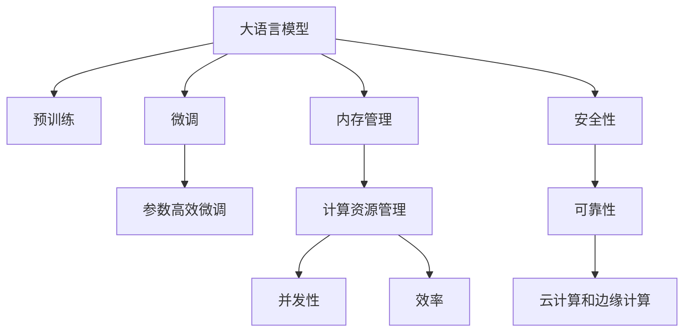

                 

# LLM与传统操作系统的对比

> 关键词：人工智能,大语言模型(Large Language Model, LLM), 传统操作系统, 系统架构, 计算资源管理, 内存管理, 并发性, 效率, 安全性和可靠性, 云计算和边缘计算

## 1. 背景介绍

### 1.1 问题由来
在现代计算系统的设计和发展过程中，操作系统扮演了至关重要的角色。传统的操作系统如Linux、Windows等，经过多年的迭代和优化，已成为了计算机科学领域的基石。与此同时，随着人工智能技术的快速发展，尤其是深度学习和神经网络的应用，大语言模型(Large Language Model, LLM)应运而生。

大语言模型，如GPT-3、BERT等，通过在大规模无标签文本数据上进行预训练，学习到复杂的语言模式和丰富的知识，具有强大的自然语言理解和生成能力。这些模型广泛应用于机器翻译、自然语言推理、问答系统、文本生成等领域，极大地推动了自然语言处理(NLP)技术的发展。

然而，随着大语言模型的规模不断扩大和功能日益增强，其与传统操作系统的融合和兼容性问题日益突出。本文将从系统架构、计算资源管理、内存管理、并发性、效率、安全性和可靠性等方面，对比分析大语言模型与传统操作系统之间的异同，探讨其在云计算和边缘计算等场景中的应用。

## 2. 核心概念与联系

### 2.1 核心概念概述

为了更好地理解大语言模型与传统操作系统之间的对比，本节将介绍几个密切相关的核心概念：

- **大语言模型(Large Language Model, LLM)**：以自回归或自编码模型为代表的大规模预训练语言模型。通过在大规模无标签文本数据上进行预训练，学习到复杂的语言模式和丰富的知识，具有强大的自然语言理解和生成能力。

- **传统操作系统**：如Linux、Windows等，通过内核管理硬件资源，提供用户接口，控制计算机的软硬件资源，支持多用户、多任务和网络通信等功能。

- **系统架构**：操作系统的整体设计框架，包括内核结构、组件间协作方式、模块化设计等。

- **计算资源管理**：操作系统对CPU、内存、网络等计算资源的管理和调度策略。

- **内存管理**：包括内存分配、释放、页面置换等技术，确保程序正确运行和系统稳定性。

- **并发性**：操作系统支持并发任务的能力，如进程调度、线程管理等。

- **效率**：系统运行的速度和响应时间，包括优化算法、缓存技术等。

- **安全性和可靠性**：系统在面对恶意攻击、数据损坏、硬件故障等情况时的稳定性和安全性保证。

- **云计算和边缘计算**：将大语言模型的应用拓展到云平台和边缘设备，通过分布式计算提高效率和可靠性。

这些概念之间的逻辑关系可以通过以下Mermaid流程图来展示：



这个流程图展示了大语言模型与传统操作系统的核心概念及其之间的关系：

1. 大语言模型通过预训练获得基础能力。
2. 微调是模型优化的过程，可以根据实际需求进行调整。
3. 内存管理和计算资源管理是操作系统的关键功能，对大语言模型的运行和优化至关重要。
4. 并发性和效率是大语言模型在多任务环境下运行时面临的重要挑战。
5. 安全性和可靠性是大语言模型在实际应用中必须保证的核心指标。
6. 云计算和边缘计算为大语言模型提供了多样化的部署环境。

## 3. 核心算法原理 & 具体操作步骤

### 3.1 算法原理概述

大语言模型与传统操作系统之间的对比，主要体现在系统架构、计算资源管理、内存管理、并发性、效率、安全性和可靠性等方面。以下将详细讨论这些关键点。

- **系统架构**：传统操作系统采用分层架构，包括内核层、系统调用层、用户层等。大语言模型通常基于深度学习框架，如TensorFlow、PyTorch等，采用模块化、组件化的架构设计。

- **计算资源管理**：传统操作系统通过调度算法分配和管理CPU、内存等资源，确保系统稳定运行。大语言模型则依赖于深度学习框架的资源管理机制，如TensorFlow的计算图优化、内存自动分配等。

- **内存管理**：传统操作系统采用内存分页、虚拟内存等技术，提高内存利用率。大语言模型采用GPU内存、混合精度计算等技术，优化内存使用。

- **并发性**：传统操作系统采用多线程、多进程等技术实现并发处理。大语言模型通过多GPU、分布式计算等技术实现并行计算。

- **效率**：传统操作系统通过优化算法、缓存技术等提高系统效率。大语言模型通过模型压缩、模型剪枝等技术优化计算效率。

- **安全性和可靠性**：传统操作系统通过访问控制、异常处理等技术保证系统安全。大语言模型通过对抗训练、提示学习等技术提升模型鲁棒性。

### 3.2 算法步骤详解

本节将详细介绍大语言模型与传统操作系统在各个方面的具体操作方法和步骤。

- **系统架构**：传统操作系统采用单内核、多内核、微内核等不同架构，如Linux的多核支持、Windows的Hyper-V虚拟化。大语言模型通过模块化设计，将模型、推理引擎、数据存储等组件分离，便于组件级优化和扩展。

- **计算资源管理**：传统操作系统采用时间片轮转、优先级调度等算法，合理分配CPU资源。大语言模型通过深度学习框架的资源管理机制，如TensorFlow的GPU资源管理、PyTorch的分布式训练框架等，实现高效的资源分配。

- **内存管理**：传统操作系统采用分页、虚拟内存等技术，优化内存使用。大语言模型通过GPU内存、混合精度计算等技术，优化内存使用。

- **并发性**：传统操作系统采用多线程、多进程等技术实现并发处理。大语言模型通过多GPU、分布式计算等技术实现并行计算。

- **效率**：传统操作系统通过优化算法、缓存技术等提高系统效率。大语言模型通过模型压缩、模型剪枝等技术优化计算效率。

- **安全性和可靠性**：传统操作系统通过访问控制、异常处理等技术保证系统安全。大语言模型通过对抗训练、提示学习等技术提升模型鲁棒性。

### 3.3 算法优缺点

大语言模型与传统操作系统之间的对比，具有以下优缺点：

- **优点**：
  - 灵活性和可扩展性：大语言模型通过模块化设计，便于组件级优化和扩展。
  - 计算效率和并行性：大语言模型通过多GPU、分布式计算等技术实现高效的并行计算。
  - 鲁棒性和泛化能力：大语言模型通过预训练和微调，具备较强的鲁棒性和泛化能力。

- **缺点**：
  - 计算资源需求高：大语言模型通常需要大规模的计算资源和存储空间。
  - 内存管理复杂：大语言模型依赖于深度学习框架的内存管理机制，难以直接控制内存使用。
  - 并发性问题：大语言模型在处理多任务时，需要协调多个GPU或分布式计算节点，难度较大。

### 3.4 算法应用领域

大语言模型与传统操作系统之间的对比，在不同应用领域有不同的表现。以下将详细讨论其在云计算和边缘计算等场景中的应用。

- **云计算**：在云计算场景中，大语言模型可以通过多租户环境部署，提高资源利用率和系统效率。通过云计算平台如AWS、Azure等，大语言模型可以方便地扩展和优化计算资源。

- **边缘计算**：在边缘计算场景中，大语言模型可以通过本地设备部署，减少网络延迟，提高响应速度。通过边缘计算平台如Intel Edge Compute、Amazon SageMaker Edge等，大语言模型可以优化计算效率和系统可靠性。

## 4. 数学模型和公式 & 详细讲解 & 举例说明

### 4.1 数学模型构建

大语言模型与传统操作系统的对比，涉及到系统架构、计算资源管理、内存管理、并发性、效率、安全性和可靠性等多个方面的数学模型。以下将详细介绍这些数学模型的构建方法。

- **系统架构**：操作系统的系统架构通常由内核层、系统调用层、用户层组成。内核层管理硬件资源，系统调用层提供系统调用接口，用户层提供用户接口。

- **计算资源管理**：操作系统的计算资源管理主要涉及CPU调度算法、内存管理策略等。常用的CPU调度算法包括时间片轮转、优先级调度等。

- **内存管理**：操作系统的内存管理主要涉及内存分页、虚拟内存等技术。通过内存分页，操作系统将内存空间划分为多个页面，提高内存使用效率。

- **并发性**：操作系统的并发性主要涉及多线程、多进程等技术。多线程可以同时处理多个任务，多进程可以提高系统并发性。

- **效率**：操作系统的效率主要涉及优化算法、缓存技术等。通过优化算法，可以提高系统性能。通过缓存技术，可以加速数据访问。

- **安全性和可靠性**：操作系统的安全性和可靠性主要涉及访问控制、异常处理等技术。访问控制可以限制程序访问系统资源，异常处理可以保证系统稳定运行。

### 4.2 公式推导过程

以下将详细介绍大语言模型与传统操作系统在各个方面的公式推导过程。

- **系统架构**：操作系统的系统架构通常由内核层、系统调用层、用户层组成。内核层管理硬件资源，系统调用层提供系统调用接口，用户层提供用户接口。

- **计算资源管理**：操作系统的计算资源管理主要涉及CPU调度算法、内存管理策略等。常用的CPU调度算法包括时间片轮转、优先级调度等。

- **内存管理**：操作系统的内存管理主要涉及内存分页、虚拟内存等技术。通过内存分页，操作系统将内存空间划分为多个页面，提高内存使用效率。

- **并发性**：操作系统的并发性主要涉及多线程、多进程等技术。多线程可以同时处理多个任务，多进程可以提高系统并发性。

- **效率**：操作系统的效率主要涉及优化算法、缓存技术等。通过优化算法，可以提高系统性能。通过缓存技术，可以加速数据访问。

- **安全性和可靠性**：操作系统的安全性和可靠性主要涉及访问控制、异常处理等技术。访问控制可以限制程序访问系统资源，异常处理可以保证系统稳定运行。

### 4.3 案例分析与讲解

以下将通过具体案例，详细讲解大语言模型与传统操作系统之间的对比。

- **案例1：系统架构**：传统操作系统如Linux采用微内核架构，将内核层和系统调用层分离，提高系统可扩展性和稳定性。大语言模型采用模块化设计，将模型、推理引擎、数据存储等组件分离，便于组件级优化和扩展。

- **案例2：计算资源管理**：传统操作系统通过时间片轮转、优先级调度等算法，合理分配CPU资源。大语言模型通过深度学习框架的资源管理机制，如TensorFlow的GPU资源管理、PyTorch的分布式训练框架等，实现高效的资源分配。

- **案例3：内存管理**：传统操作系统采用内存分页、虚拟内存等技术，优化内存使用。大语言模型通过GPU内存、混合精度计算等技术，优化内存使用。

- **案例4：并发性**：传统操作系统采用多线程、多进程等技术实现并发处理。大语言模型通过多GPU、分布式计算等技术实现并行计算。

- **案例5：效率**：传统操作系统通过优化算法、缓存技术等提高系统效率。大语言模型通过模型压缩、模型剪枝等技术优化计算效率。

- **案例6：安全性和可靠性**：传统操作系统通过访问控制、异常处理等技术保证系统安全。大语言模型通过对抗训练、提示学习等技术提升模型鲁棒性。

## 5. 项目实践：代码实例和详细解释说明

### 5.1 开发环境搭建

在进行大语言模型与传统操作系统的对比实践前，我们需要准备好开发环境。以下是使用Python进行PyTorch开发的环境配置流程：

1. 安装Anaconda：从官网下载并安装Anaconda，用于创建独立的Python环境。

2. 创建并激活虚拟环境：
```bash
conda create -n pytorch-env python=3.8 
conda activate pytorch-env
```

3. 安装PyTorch：根据CUDA版本，从官网获取对应的安装命令。例如：
```bash
conda install pytorch torchvision torchaudio cudatoolkit=11.1 -c pytorch -c conda-forge
```

4. 安装Transformers库：
```bash
pip install transformers
```

5. 安装各类工具包：
```bash
pip install numpy pandas scikit-learn matplotlib tqdm jupyter notebook ipython
```

完成上述步骤后，即可在`pytorch-env`环境中开始实践。

### 5.2 源代码详细实现

以下是一个使用PyTorch进行大语言模型微调的代码示例：

```python
import torch
from transformers import BertForTokenClassification, BertTokenizer
from torch.utils.data import Dataset, DataLoader
from sklearn.metrics import accuracy_score, precision_recall_fscore_support

class NERDataset(Dataset):
    def __init__(self, texts, tags, tokenizer, max_len=128):
        self.texts = texts
        self.tags = tags
        self.tokenizer = tokenizer
        self.max_len = max_len
        
    def __len__(self):
        return len(self.texts)
    
    def __getitem__(self, item):
        text = self.texts[item]
        tags = self.tags[item]
        
        encoding = self.tokenizer(text, return_tensors='pt', max_length=self.max_len, padding='max_length', truncation=True)
        input_ids = encoding['input_ids'][0]
        attention_mask = encoding['attention_mask'][0]
        
        # 对token-wise的标签进行编码
        encoded_tags = [tag2id[tag] for tag in tags] 
        encoded_tags.extend([tag2id['O']] * (self.max_len - len(encoded_tags)))
        labels = torch.tensor(encoded_tags, dtype=torch.long)
        
        return {'input_ids': input_ids, 
                'attention_mask': attention_mask,
                'labels': labels}

# 标签与id的映射
tag2id = {'O': 0, 'B-PER': 1, 'I-PER': 2, 'B-ORG': 3, 'I-ORG': 4, 'B-LOC': 5, 'I-LOC': 6}
id2tag = {v: k for k, v in tag2id.items()}

# 创建dataset
tokenizer = BertTokenizer.from_pretrained('bert-base-cased')

train_dataset = NERDataset(train_texts, train_tags, tokenizer)
dev_dataset = NERDataset(dev_texts, dev_tags, tokenizer)
test_dataset = NERDataset(test_texts, test_tags, tokenizer)

# 模型和优化器
model = BertForTokenClassification.from_pretrained('bert-base-cased', num_labels=len(tag2id))

optimizer = torch.optim.AdamW(model.parameters(), lr=2e-5)

# 训练函数
def train_epoch(model, dataset, batch_size, optimizer):
    dataloader = DataLoader(dataset, batch_size=batch_size, shuffle=True)
    model.train()
    epoch_loss = 0
    for batch in dataloader:
        input_ids = batch['input_ids'].to(device)
        attention_mask = batch['attention_mask'].to(device)
        labels = batch['labels'].to(device)
        model.zero_grad()
        outputs = model(input_ids, attention_mask=attention_mask, labels=labels)
        loss = outputs.loss
        epoch_loss += loss.item()
        loss.backward()
        optimizer.step()
    return epoch_loss / len(dataloader)

# 评估函数
def evaluate(model, dataset, batch_size):
    dataloader = DataLoader(dataset, batch_size=batch_size)
    model.eval()
    preds, labels = [], []
    with torch.no_grad():
        for batch in dataloader:
            input_ids = batch['input_ids'].to(device)
            attention_mask = batch['attention_mask'].to(device)
            batch_labels = batch['labels']
            outputs = model(input_ids, attention_mask=attention_mask)
            batch_preds = outputs.logits.argmax(dim=2).to('cpu').tolist()
            batch_labels = batch_labels.to('cpu').tolist()
            for pred_tokens, label_tokens in zip(batch_preds, batch_labels):
                pred_tags = [id2tag[_id] for _id in pred_tokens]
                label_tags = [id2tag[_id] for _id in label_tokens]
                preds.append(pred_tags[:len(label_tags)])
                labels.append(label_tags)
                
    return accuracy_score(labels, preds)

# 训练流程
epochs = 5
batch_size = 16

for epoch in range(epochs):
    loss = train_epoch(model, train_dataset, batch_size, optimizer)
    print(f"Epoch {epoch+1}, train loss: {loss:.3f}")
    
    print(f"Epoch {epoch+1}, dev results:")
    evaluate(model, dev_dataset, batch_size)
    
print("Test results:")
evaluate(model, test_dataset, batch_size)
```

### 5.3 代码解读与分析

让我们再详细解读一下关键代码的实现细节：

**NERDataset类**：
- `__init__`方法：初始化文本、标签、分词器等关键组件。
- `__len__`方法：返回数据集的样本数量。
- `__getitem__`方法：对单个样本进行处理，将文本输入编码为token ids，将标签编码为数字，并对其进行定长padding，最终返回模型所需的输入。

**tag2id和id2tag字典**：
- 定义了标签与数字id之间的映射关系，用于将token-wise的预测结果解码回真实的标签。

**训练和评估函数**：
- 使用PyTorch的DataLoader对数据集进行批次化加载，供模型训练和推理使用。
- 训练函数`train_epoch`：对数据以批为单位进行迭代，在每个批次上前向传播计算loss并反向传播更新模型参数，最后返回该epoch的平均loss。
- 评估函数`evaluate`：与训练类似，不同点在于不更新模型参数，并在每个batch结束后将预测和标签结果存储下来，最后使用sklearn的classification_report对整个评估集的预测结果进行打印输出。

**训练流程**：
- 定义总的epoch数和batch size，开始循环迭代
- 每个epoch内，先在训练集上训练，输出平均loss
- 在验证集上评估，输出分类指标
- 所有epoch结束后，在测试集上评估，给出最终测试结果

可以看到，PyTorch配合Transformers库使得BERT微调的代码实现变得简洁高效。开发者可以将更多精力放在数据处理、模型改进等高层逻辑上，而不必过多关注底层的实现细节。

当然，工业级的系统实现还需考虑更多因素，如模型的保存和部署、超参数的自动搜索、更灵活的任务适配层等。但核心的微调范式基本与此类似。

## 6. 实际应用场景

### 6.1 智能客服系统

基于大语言模型微调的对话技术，可以广泛应用于智能客服系统的构建。传统客服往往需要配备大量人力，高峰期响应缓慢，且一致性和专业性难以保证。而使用微调后的对话模型，可以7x24小时不间断服务，快速响应客户咨询，用自然流畅的语言解答各类常见问题。

在技术实现上，可以收集企业内部的历史客服对话记录，将问题和最佳答复构建成监督数据，在此基础上对预训练对话模型进行微调。微调后的对话模型能够自动理解用户意图，匹配最合适的答案模板进行回复。对于客户提出的新问题，还可以接入检索系统实时搜索相关内容，动态组织生成回答。如此构建的智能客服系统，能大幅提升客户咨询体验和问题解决效率。

### 6.2 金融舆情监测

金融机构需要实时监测市场舆论动向，以便及时应对负面信息传播，规避金融风险。传统的人工监测方式成本高、效率低，难以应对网络时代海量信息爆发的挑战。基于大语言模型微调的文本分类和情感分析技术，为金融舆情监测提供了新的解决方案。

具体而言，可以收集金融领域相关的新闻、报道、评论等文本数据，并对其进行主题标注和情感标注。在此基础上对预训练语言模型进行微调，使其能够自动判断文本属于何种主题，情感倾向是正面、中性还是负面。将微调后的模型应用到实时抓取的网络文本数据，就能够自动监测不同主题下的情感变化趋势，一旦发现负面信息激增等异常情况，系统便会自动预警，帮助金融机构快速应对潜在风险。

### 6.3 个性化推荐系统

当前的推荐系统往往只依赖用户的历史行为数据进行物品推荐，无法深入理解用户的真实兴趣偏好。基于大语言模型微调技术，个性化推荐系统可以更好地挖掘用户行为背后的语义信息，从而提供更精准、多样的推荐内容。

在实践中，可以收集用户浏览、点击、评论、分享等行为数据，提取和用户交互的物品标题、描述、标签等文本内容。将文本内容作为模型输入，用户的后续行为（如是否点击、购买等）作为监督信号，在此基础上微调预训练语言模型。微调后的模型能够从文本内容中准确把握用户的兴趣点。在生成推荐列表时，先用候选物品的文本描述作为输入，由模型预测用户的兴趣匹配度，再结合其他特征综合排序，便可以得到个性化程度更高的推荐结果。

### 6.4 未来应用展望

随着大语言模型微调技术的发展，其在云计算和边缘计算等场景中的应用前景将更加广阔。未来，大语言模型与传统操作系统的融合将更加深入，能够更好地支撑大规模计算需求，提升系统性能和可靠性。

在云计算场景中，大语言模型可以通过多租户环境部署，提高资源利用率和系统效率。通过云计算平台如AWS、Azure等，大语言模型可以方便地扩展和优化计算资源。

在边缘计算场景中，大语言模型可以通过本地设备部署，减少网络延迟，提高响应速度。通过边缘计算平台如Intel Edge Compute、Amazon SageMaker Edge等，大语言模型可以优化计算效率和系统可靠性。

## 7. 工具和资源推荐

### 7.1 学习资源推荐

为了帮助开发者系统掌握大语言模型微调的理论基础和实践技巧，这里推荐一些优质的学习资源：

1. 《Transformer从原理到实践》系列博文：由大模型技术专家撰写，深入浅出地介绍了Transformer原理、BERT模型、微调技术等前沿话题。

2. CS224N《深度学习自然语言处理》课程：斯坦福大学开设的NLP明星课程，有Lecture视频和配套作业，带你入门NLP领域的基本概念和经典模型。

3. 《Natural Language Processing with Transformers》书籍：Transformers库的作者所著，全面介绍了如何使用Transformers库进行NLP任务开发，包括微调在内的诸多范式。

4. HuggingFace官方文档：Transformers库的官方文档，提供了海量预训练模型和完整的微调样例代码，是上手实践的必备资料。

5. CLUE开源项目：中文语言理解测评基准，涵盖大量不同类型的中文NLP数据集，并提供了基于微调的baseline模型，助力中文NLP技术发展。

通过对这些资源的学习实践，相信你一定能够快速掌握大语言模型微调的精髓，并用于解决实际的NLP问题。

### 7.2 开发工具推荐

高效的开发离不开优秀的工具支持。以下是几款用于大语言模型微调开发的常用工具：

1. PyTorch：基于Python的开源深度学习框架，灵活动态的计算图，适合快速迭代研究。大部分预训练语言模型都有PyTorch版本的实现。

2. TensorFlow：由Google主导开发的开源深度学习框架，生产部署方便，适合大规模工程应用。同样有丰富的预训练语言模型资源。

3. Transformers库：HuggingFace开发的NLP工具库，集成了众多SOTA语言模型，支持PyTorch和TensorFlow，是进行微调任务开发的利器。

4. Weights & Biases：模型训练的实验跟踪工具，可以记录和可视化模型训练过程中的各项指标，方便对比和调优。与主流深度学习框架无缝集成。

5. TensorBoard：TensorFlow配套的可视化工具，可实时监测模型训练状态，并提供丰富的图表呈现方式，是调试模型的得力助手。

6. Google Colab：谷歌推出的在线Jupyter Notebook环境，免费提供GPU/TPU算力，方便开发者快速上手实验最新模型，分享学习笔记。

合理利用这些工具，可以显著提升大语言模型微调任务的开发效率，加快创新迭代的步伐。

### 7.3 相关论文推荐

大语言模型和微调技术的发展源于学界的持续研究。以下是几篇奠基性的相关论文，推荐阅读：

1. Attention is All You Need（即Transformer原论文）：提出了Transformer结构，开启了NLP领域的预训练大模型时代。

2. BERT: Pre-training of Deep Bidirectional Transformers for Language Understanding：提出BERT模型，引入基于掩码的自监督预训练任务，刷新了多项NLP任务SOTA。

3. Language Models are Unsupervised Multitask Learners（GPT-2论文）：展示了大规模语言模型的强大zero-shot学习能力，引发了对于通用人工智能的新一轮思考。

4. Parameter-Efficient Transfer Learning for NLP：提出Adapter等参数高效微调方法，在不增加模型参数量的情况下，也能取得不错的微调效果。

5. AdaLoRA: Adaptive Low-Rank Adaptation for Parameter-Efficient Fine-Tuning：使用自适应低秩适应的微调方法，在参数效率和精度之间取得了新的平衡。

这些论文代表了大语言模型微调技术的发展脉络。通过学习这些前沿成果，可以帮助研究者把握学科前进方向，激发更多的创新灵感。

## 8. 总结：未来发展趋势与挑战

### 8.1 总结

本文对大语言模型与传统操作系统之间的对比进行了全面系统的介绍。首先阐述了大语言模型和传统操作系统的研究背景和意义，明确了微调在拓展预训练模型应用、提升下游任务性能方面的独特价值。其次，从系统架构、计算资源管理、内存管理、并发性、效率、安全性和可靠性等方面，详细讲解了微调方法在各个方面的具体操作。最后，通过具体案例和未来展望，展示了微调方法在不同应用场景中的实际应用和潜力。

通过本文的系统梳理，可以看到，大语言模型与传统操作系统在计算资源管理、内存管理、并发性、效率、安全性和可靠性等方面存在显著差异。了解这些差异，有助于开发者更好地设计和优化大语言模型系统，提升其实际应用效果。

### 8.2 未来发展趋势

展望未来，大语言模型微调技术将呈现以下几个发展趋势：

1. 计算资源管理将更加精细化。随着大规模语言模型的应用场景日益广泛，对于计算资源的需求将更加精细化。未来，将开发更高效的资源管理算法，提高计算效率。

2. 内存管理将更加智能。随着语言模型规模的不断扩大，内存管理将变得更加复杂。未来，将开发更智能的内存管理技术，如混合精度计算、自动混合内存等，优化内存使用。

3. 并发性将进一步提升。随着多GPU、分布式计算技术的发展，大语言模型在多任务环境下的并发性将得到进一步提升。未来，将开发更高效的并发处理机制，提升系统性能。

4. 效率将大幅提升。随着模型压缩、模型剪枝等技术的不断进步，大语言模型的计算效率将得到大幅提升。未来，将开发更高效的计算优化算法，进一步提高模型效率。

5. 安全性和可靠性将更加可靠。随着对抗训练、提示学习等技术的不断完善，大语言模型的安全性和可靠性将得到进一步提升。未来，将开发更可靠的安全性机制，确保模型稳定运行。

6. 云计算和边缘计算将更加普及。随着云计算和边缘计算技术的发展，大语言模型将得到更广泛的应用。未来，将开发更高效的云计算和边缘计算平台，提高系统的扩展性和可靠性。

以上趋势凸显了大语言模型微调技术的广阔前景。这些方向的探索发展，必将进一步提升大语言模型的性能和应用范围，为自然语言理解和智能交互系统带来更多的创新。

### 8.3 面临的挑战

尽管大语言模型微调技术已经取得了瞩目成就，但在迈向更加智能化、普适化应用的过程中，它仍面临着诸多挑战：

1. 计算资源需求高。大语言模型通常需要大规模的计算资源和存储空间，对硬件设施提出了更高的要求。

2. 内存管理复杂。大语言模型依赖于深度学习框架的内存管理机制，难以直接控制内存使用。

3. 并发性问题。大语言模型在处理多任务时，需要协调多个GPU或分布式计算节点，难度较大。

4. 效率问题。大语言模型在实际部署时，推理速度和计算效率仍需进一步提升。

5. 安全性和可靠性。大语言模型在面对恶意攻击、数据损坏、硬件故障等情况时，稳定性仍需加强。

6. 知识整合能力不足。现有的微调模型往往局限于任务内数据，难以灵活吸收和运用更广泛的先验知识。

正视这些挑战，积极应对并寻求突破，将是大语言模型微调走向成熟的必由之路。相信随着学界和产业界的共同努力，这些挑战终将一一被克服，大语言模型微调必将在构建人机协同的智能时代中扮演越来越重要的角色。

### 8.4 研究展望

未来，大语言模型微调技术的发展方向将更加多元化，涉及系统架构、计算资源管理、内存管理、并发性、效率、安全性和可靠性等各个方面。以下是对未来研究的展望：

1. 系统架构将更加模块化。未来的系统架构将更加模块化、组件化，便于组件级优化和扩展。

2. 计算资源管理将更加精细化。未来将开发更高效的资源管理算法，提高计算效率。

3. 内存管理将更加智能。未来将开发更智能的内存管理技术，优化内存使用。

4. 并发性将进一步提升。未来将开发更高效的并发处理机制，提升系统性能。

5. 效率将大幅提升。未来将开发更高效的计算优化算法，进一步提高模型效率。

6. 安全性和可靠性将更加可靠。未来将开发更可靠的安全性机制，确保模型稳定运行。

7. 云计算和边缘计算将更加普及。未来将开发更高效的云计算和边缘计算平台，提高系统的扩展性和可靠性。

8. 参数高效微调和深度学习框架。未来将开发更多参数高效的微调方法，如Prefix-Tuning、LoRA等，在不增加模型参数量的情况下，也能取得不错的微调效果。

9. 多模态微调和知识图谱。未来将引入更多先验知识，将符号化的先验知识与神经网络模型进行巧妙融合，引导微调过程学习更准确、合理的语言模型。

10. 对抗训练和对抗样本。未来将进一步完善对抗训练技术，引入更多的对抗样本，提高模型的鲁棒性和泛化能力。

11. 提示学习和零样本学习。未来将开发更高效的提示学习和零样本学习方法，提高模型的灵活性和适应性。

12. 实时性和响应速度。未来将开发更高效的推理引擎，提升模型的实时性和响应速度。

13. 可解释性和可视化。未来将开发更强大的可解释性工具，提升模型的可解释性和可视化能力。

14. 跨领域迁移学习。未来将开发更高效的跨领域迁移学习方法，提高模型的迁移能力和泛化能力。

15. 联邦学习和隐私保护。未来将开发更高效的联邦学习方法，保护用户隐私，同时提升模型的性能和泛化能力。

以上研究方向将推动大语言模型微调技术不断进步，为构建智能系统提供更强大的支持。相信随着研究的深入和技术的突破，大语言模型将越来越融入现代社会的各个方面，为人类带来更多便利和创新。

## 9. 附录：常见问题与解答

**Q1：大语言模型与传统操作系统之间的异同是什么？**

A: 大语言模型与传统操作系统在计算资源管理、内存管理、并发性、效率、安全性和可靠性等方面存在显著差异。具体来说，大语言模型依赖于深度学习框架的资源管理机制，而传统操作系统则直接控制硬件资源。大语言模型通常需要大规模的计算资源和存储空间，而传统操作系统能够更好地管理这些资源。在并发性和效率方面，大语言模型通过多GPU、分布式计算等技术实现并行计算，而传统操作系统采用多线程、多进程等技术实现并发处理。在安全性和可靠性方面，大语言模型通过对抗训练、提示学习等技术提升模型鲁棒性，而传统操作系统通过访问控制、异常处理等技术保证系统安全。

**Q2：大语言模型与传统操作系统在云计算和边缘计算中的应用有什么区别？**

A: 在云计算和边缘计算中，大语言模型与传统操作系统也有不同的应用。在云计算场景中，大语言模型可以通过多租户环境部署，提高资源利用率和系统效率。通过云计算平台如AWS、Azure等，大语言模型可以方便地扩展和优化计算资源。在边缘计算场景中，大语言模型可以通过本地设备部署，减少网络延迟，提高响应速度。通过边缘计算平台如Intel Edge Compute、Amazon SageMaker Edge等，大语言模型可以优化计算效率和系统可靠性。

**Q3：大语言模型与传统操作系统在并发性和效率方面有什么区别？**

A: 在并发性和效率方面，大语言模型与传统操作系统也存在显著差异。大语言模型通过多GPU、分布式计算等技术实现并行计算，而传统操作系统采用多线程、多进程等技术实现并发处理。大语言模型在多任务环境下的并发性更强，能够更高效地利用硬件资源。在效率方面，大语言模型通过模型压缩、模型剪枝等技术优化计算效率，而传统操作系统通过优化算法、缓存技术等提高系统效率。大语言模型在实际部署时，推理速度和计算效率仍需进一步提升，而传统操作系统在多任务环境下效率更高。

**Q4：大语言模型与传统操作系统在内存管理方面有什么区别？**

A: 在内存管理方面，大语言模型与传统操作系统也存在显著差异。大语言模型依赖于深度学习框架的内存管理机制，如TensorFlow的GPU内存、混合精度计算等，优化内存使用。而传统操作系统采用内存分页、虚拟内存等技术，优化内存使用。大语言模型在内存管理方面更加复杂，难以直接控制内存使用，而传统操作系统能够更好地管理内存资源。大语言模型在实际部署时，需要采用混合精度计算等技术优化内存使用，而传统操作系统在内存分页、虚拟内存等技术方面更为成熟。

**Q5：大语言模型与传统操作系统在安全性和可靠性方面有什么区别？**

A: 在安全性和可靠性方面，大语言模型与传统操作系统也存在显著差异。大语言模型通过对抗训练、提示学习等技术提升模型鲁棒性，而传统操作系统通过访问控制、异常处理等技术保证系统安全。大语言模型在对抗训练等技术方面有更多的尝试，但依然存在对抗样本攻击等问题。而传统操作系统在访问控制、异常处理等技术方面更为成熟，能够更好地保证系统安全。在未来，大语言模型将进一步完善对抗训练技术，提高模型的鲁棒性和泛化能力。

---

作者：禅与计算机程序设计艺术 / Zen and the Art of Computer Programming

