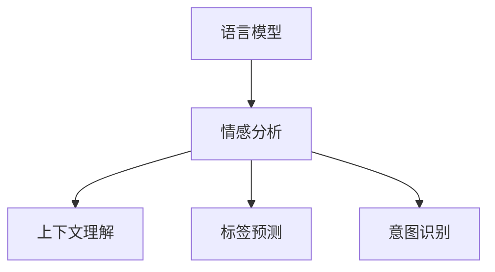

                 

# LLM在情感分析中的应用：理解用户反馈

> 关键词：情感分析,自然语言处理(NLP),语言模型,深度学习,上下文理解,标签预测,意图识别

## 1. 背景介绍

在当今数字化时代，社交媒体、在线评论和客户反馈等用户生成的文本数据日益增多，情感分析(Natural Language Processing, NLP)成为了一项至关重要的任务。通过分析这些文本数据，企业可以更好地理解用户的情感倾向、需求和反馈，从而优化产品和服务，提升用户体验，驱动业务增长。情感分析广泛应用于市场研究、品牌管理、客户服务、社交媒体监测等领域，是NLP技术的重要应用之一。

### 1.1 情感分析概述

情感分析主要分为两种类型：

- **基于规则的方法**：通过定义一组情感词汇和情感规则，对文本中的情感词汇进行识别和计算，从而得出情感倾向。这类方法通常依赖于领域知识和规则的精细调整。
- **基于机器学习的方法**：通过标记的数据集训练模型，使得模型能够自动学习文本中的情感信息，并应用于新的未标记数据。这种方法能够自动捕捉更复杂的情感表达方式，但需要大量的标注数据来训练模型。

近年来，随着深度学习和大规模预训练语言模型的发展，基于机器学习的情感分析方法取得了显著进展。其中，使用Transformer架构的预训练语言模型（如BERT、GPT等）在情感分析任务中展现出了强大的能力，能够处理复杂的上下文关系和长文本，提升模型的泛化能力和表现。

## 2. 核心概念与联系

### 2.1 核心概念概述

为更好地理解LLM在情感分析中的应用，本节将介绍几个密切相关的核心概念：

- **语言模型(Language Model)**：通过预测文本中下一个词汇的概率分布，来学习文本的统计特性。常用的语言模型包括n-gram模型、RNN语言模型、Transformer语言模型等。
- **情感分析(Sentiment Analysis)**：分析文本中的情感倾向，分为极性判断和情感强度判断。可以用于正面、负面或中性情感的分类，以及情感极性的强度预测。
- **上下文理解(Contextual Understanding)**：理解和分析文本中的上下文关系，包括情感词汇的语义变化、隐含情感等，提升情感分析的准确性。
- **标签预测(Label Prediction)**：根据文本中的情感信息，预测情感标签。
- **意图识别(Intent Recognition)**：理解用户文本的意图，判断用户的真实需求和情感。

这些概念之间的逻辑关系可以通过以下Mermaid流程图来展示：



这个流程图展示了一组核心概念之间的关联性：

1. 语言模型提供文本的统计特性，是情感分析的基础。
2. 情感分析通过识别文本中的情感词汇和语义关系，进行情感倾向和强度的判断。
3. 上下文理解帮助情感分析更好地理解文本中的隐含情感和语义变化。
4. 标签预测根据情感信息输出情感分类或强度。
5. 意图识别从用户的意图出发，更准确地理解情感。

## 3. 核心算法原理 & 具体操作步骤

### 3.1 算法原理概述

基于大语言模型（LLM）的情感分析，通过将预训练语言模型作为特征提取器，利用下游任务的标注数据进行微调，学习文本的情感表达和分类。核心思想是：将预训练语言模型看作一个强大的"情感识别器"，通过微调使得模型在特定任务上具备情感分类和强度预测的能力。

假设预训练语言模型为 $M_{\theta}$，其中 $\theta$ 为预训练得到的模型参数。给定情感分析任务的标注数据集 $D=\{(x_i, y_i)\}_{i=1}^N$，其中 $x_i$ 为输入文本，$y_i$ 为情感标签。微调的目标是找到新的模型参数 $\hat{\theta}$，使得：

$$
\hat{\theta}=\mathop{\arg\min}_{\theta} \mathcal{L}(M_{\theta},D)
$$

其中 $\mathcal{L}$ 为针对情感分析任务设计的损失函数，通常为交叉熵损失。

### 3.2 算法步骤详解

基于LLM的情感分析微调一般包括以下关键步骤：

**Step 1: 准备预训练模型和数据集**
- 选择合适的预训练语言模型 $M_{\theta}$，如BERT、GPT等。
- 准备情感分析任务的标注数据集 $D$，划分为训练集、验证集和测试集。通常标注数据集应覆盖正面、负面和中性情感，平衡标签分布。

**Step 2: 添加任务适配层**
- 在预训练模型的顶层添加分类器或解码器，用于情感标签的预测。
- 对于情感分类任务，通常在顶层添加线性分类器和交叉熵损失函数。
- 对于情感强度预测任务，使用回归器，如MSE损失函数。

**Step 3: 设置微调超参数**
- 选择合适的优化算法及其参数，如AdamW、SGD等，设置学习率、批大小、迭代轮数等。
- 设置正则化技术及强度，包括权重衰减、Dropout、Early Stopping等。
- 确定冻结预训练参数的策略，如仅微调顶层，或全部参数都参与微调。

**Step 4: 执行梯度训练**
- 将训练集数据分批次输入模型，前向传播计算损失函数。
- 反向传播计算参数梯度，根据设定的优化算法和学习率更新模型参数。
- 周期性在验证集上评估模型性能，根据性能指标决定是否触发 Early Stopping。
- 重复上述步骤直到满足预设的迭代轮数或 Early Stopping 条件。

**Step 5: 测试和部署**
- 在测试集上评估微调后模型 $M_{\hat{\theta}}$ 的性能，对比微调前后的精度提升。
- 使用微调后的模型对新样本进行推理预测，集成到实际的应用系统中。

### 3.3 算法优缺点

基于LLM的情感分析微调方法具有以下优点：
1. 高效性。利用预训练语言模型的知识，通过少量标注数据即可完成微调，降低开发成本。
2. 泛化能力强。预训练语言模型具备广泛的语义知识，能在多种情感分析任务上取得优异表现。
3. 可解释性强。通过上下文理解，可以部分解释模型的决策逻辑，提升可信度。
4. 适用范围广。适用于多种情感分析任务，如情感分类、情感强度预测、意图识别等。

同时，该方法也存在以下局限性：
1. 依赖标注数据。微调的效果很大程度上取决于标注数据的质量和数量，获取高质量标注数据的成本较高。
2. 预训练模型偏见。预训练模型可能带有偏见，影响微调后的情感分析结果。
3. 上下文理解困难。上下文理解涉及复杂的语义变化和隐含情感，对模型的要求较高。
4. 模型复杂度高。大语言模型的参数量庞大，对硬件资源要求较高。

尽管存在这些局限性，但就目前而言，基于LLM的情感分析微调方法仍是大规模情感分析任务的主流范式。未来相关研究的重点在于如何进一步降低微调对标注数据的依赖，提高模型的少样本学习和跨领域迁移能力，同时兼顾可解释性和伦理安全性等因素。

### 3.4 算法应用领域

基于LLM的情感分析方法在多个领域得到了广泛应用，例如：

- **社交媒体监测**：通过分析用户在社交媒体上的情感表达，帮助企业洞察市场趋势和品牌舆情。
- **客户满意度分析**：分析客户反馈和评论，了解客户对产品或服务的满意度。
- **舆情管理**：监测新闻报道和论坛讨论，及时发现和应对负面舆情。
- **产品评论分析**：分析产品评论，了解产品的优缺点和用户需求。
- **情感广告投放**：分析广告内容，判断广告的情感倾向，优化广告投放策略。

除了上述这些经典应用外，基于LLM的情感分析技术还在更多场景中得到创新性应用，如情感驱动的推荐系统、情感导向的内容生成等，为NLP技术带来了新的突破。

## 4. 数学模型和公式 & 详细讲解 & 举例说明

### 4.1 数学模型构建

本节将使用数学语言对基于LLM的情感分析过程进行更加严格的刻画。

假设情感分析任务为二分类任务，输入文本 $x$ 的情感标签为 $y \in \{0, 1\}$。模型 $M_{\theta}$ 的输出为 $\hat{y}=M_{\theta}(x) \in [0,1]$，表示模型预测文本属于正面的概率。

定义模型 $M_{\theta}$ 在输入 $x$ 上的损失函数为 $\ell(M_{\theta}(x),y)$，则在数据集 $D$ 上的经验风险为：

$$
\mathcal{L}(\theta) = \frac{1}{N} \sum_{i=1}^N \ell(M_{\theta}(x_i),y_i)
$$

微调的优化目标是最小化经验风险，即找到最优参数：

$$
\theta^* = \mathop{\arg\min}_{\theta} \mathcal{L}(\theta)
$$

在实践中，我们通常使用基于梯度的优化算法（如SGD、Adam等）来近似求解上述最优化问题。设 $\eta$ 为学习率，$\lambda$ 为正则化系数，则参数的更新公式为：

$$
\theta \leftarrow \theta - \eta \nabla_{\theta}\mathcal{L}(\theta) - \eta\lambda\theta
$$

其中 $\nabla_{\theta}\mathcal{L}(\theta)$ 为损失函数对参数 $\theta$ 的梯度，可通过反向传播算法高效计算。

### 4.2 公式推导过程

以下我们以情感分类任务为例，推导交叉熵损失函数及其梯度的计算公式。

假设模型 $M_{\theta}$ 在输入 $x$ 上的输出为 $\hat{y}=M_{\theta}(x) \in [0,1]$，表示样本属于正类的概率。真实标签 $y \in \{0,1\}$。则二分类交叉熵损失函数定义为：

$$
\ell(M_{\theta}(x),y) = -[y\log \hat{y} + (1-y)\log (1-\hat{y})]
$$

将其代入经验风险公式，得：

$$
\mathcal{L}(\theta) = -\frac{1}{N}\sum_{i=1}^N [y_i\log M_{\theta}(x_i)+(1-y_i)\log(1-M_{\theta}(x_i))]
$$

根据链式法则，损失函数对参数 $\theta_k$ 的梯度为：

$$
\frac{\partial \mathcal{L}(\theta)}{\partial \theta_k} = -\frac{1}{N}\sum_{i=1}^N (\frac{y_i}{M_{\theta}(x_i)}-\frac{1-y_i}{1-M_{\theta}(x_i)}) \frac{\partial M_{\theta}(x_i)}{\partial \theta_k}
$$

其中 $\frac{\partial M_{\theta}(x_i)}{\partial \theta_k}$ 可进一步递归展开，利用自动微分技术完成计算。

在得到损失函数的梯度后，即可带入参数更新公式，完成模型的迭代优化。重复上述过程直至收敛，最终得到适应下游任务的最优模型参数 $\theta^*$。

## 5. 项目实践：代码实例和详细解释说明

### 5.1 开发环境搭建

在进行情感分析实践前，我们需要准备好开发环境。以下是使用Python进行PyTorch开发的环境配置流程：

1. 安装Anaconda：从官网下载并安装Anaconda，用于创建独立的Python环境。

2. 创建并激活虚拟环境：
```bash
conda create -n pytorch-env python=3.8 
conda activate pytorch-env
```

3. 安装PyTorch：根据CUDA版本，从官网获取对应的安装命令。例如：
```bash
conda install pytorch torchvision torchaudio cudatoolkit=11.1 -c pytorch -c conda-forge
```

4. 安装Transformers库：
```bash
pip install transformers
```

5. 安装各类工具包：
```bash
pip install numpy pandas scikit-learn matplotlib tqdm jupyter notebook ipython
```

完成上述步骤后，即可在`pytorch-env`环境中开始情感分析实践。

### 5.2 源代码详细实现

下面我们以情感分类任务为例，给出使用Transformers库对BERT模型进行情感分类的PyTorch代码实现。

首先，定义情感分类任务的数据处理函数：

```python
from transformers import BertTokenizer
from torch.utils.data import Dataset
import torch

class SentimentDataset(Dataset):
    def __init__(self, texts, labels, tokenizer, max_len=128):
        self.texts = texts
        self.labels = labels
        self.tokenizer = tokenizer
        self.max_len = max_len
        
    def __len__(self):
        return len(self.texts)
    
    def __getitem__(self, item):
        text = self.texts[item]
        label = self.labels[item]
        
        encoding = self.tokenizer(text, return_tensors='pt', max_length=self.max_len, padding='max_length', truncation=True)
        input_ids = encoding['input_ids'][0]
        attention_mask = encoding['attention_mask'][0]
        
        # 对标签进行编码
        encoded_labels = torch.tensor(label, dtype=torch.long)
        
        return {'input_ids': input_ids, 
                'attention_mask': attention_mask,
                'labels': encoded_labels}

# 标签和id的映射
label2id = {'negative': 0, 'positive': 1}
id2label = {v: k for k, v in label2id.items()}

# 创建dataset
tokenizer = BertTokenizer.from_pretrained('bert-base-cased')

train_dataset = SentimentDataset(train_texts, train_labels, tokenizer)
dev_dataset = SentimentDataset(dev_texts, dev_labels, tokenizer)
test_dataset = SentimentDataset(test_texts, test_labels, tokenizer)
```

然后，定义模型和优化器：

```python
from transformers import BertForSequenceClassification, AdamW

model = BertForSequenceClassification.from_pretrained('bert-base-cased', num_labels=2)

optimizer = AdamW(model.parameters(), lr=2e-5)
```

接着，定义训练和评估函数：

```python
from torch.utils.data import DataLoader
from tqdm import tqdm
from sklearn.metrics import classification_report

device = torch.device('cuda') if torch.cuda.is_available() else torch.device('cpu')
model.to(device)

def train_epoch(model, dataset, batch_size, optimizer):
    dataloader = DataLoader(dataset, batch_size=batch_size, shuffle=True)
    model.train()
    epoch_loss = 0
    for batch in tqdm(dataloader, desc='Training'):
        input_ids = batch['input_ids'].to(device)
        attention_mask = batch['attention_mask'].to(device)
        labels = batch['labels'].to(device)
        model.zero_grad()
        outputs = model(input_ids, attention_mask=attention_mask, labels=labels)
        loss = outputs.loss
        epoch_loss += loss.item()
        loss.backward()
        optimizer.step()
    return epoch_loss / len(dataloader)

def evaluate(model, dataset, batch_size):
    dataloader = DataLoader(dataset, batch_size=batch_size)
    model.eval()
    preds, labels = [], []
    with torch.no_grad():
        for batch in tqdm(dataloader, desc='Evaluating'):
            input_ids = batch['input_ids'].to(device)
            attention_mask = batch['attention_mask'].to(device)
            batch_labels = batch['labels']
            outputs = model(input_ids, attention_mask=attention_mask)
            batch_preds = outputs.logits.argmax(dim=1).to('cpu').tolist()
            batch_labels = batch_labels.to('cpu').tolist()
            for pred, label in zip(batch_preds, batch_labels):
                preds.append(pred)
                labels.append(label)
                
    print(classification_report(labels, preds))
```

最后，启动训练流程并在测试集上评估：

```python
epochs = 5
batch_size = 16

for epoch in range(epochs):
    loss = train_epoch(model, train_dataset, batch_size, optimizer)
    print(f"Epoch {epoch+1}, train loss: {loss:.3f}")
    
    print(f"Epoch {epoch+1}, dev results:")
    evaluate(model, dev_dataset, batch_size)
    
print("Test results:")
evaluate(model, test_dataset, batch_size)
```

以上就是使用PyTorch对BERT进行情感分类任务微调的完整代码实现。可以看到，得益于Transformers库的强大封装，我们可以用相对简洁的代码完成BERT模型的加载和微调。

### 5.3 代码解读与分析

让我们再详细解读一下关键代码的实现细节：

**SentimentDataset类**：
- `__init__`方法：初始化文本、标签、分词器等关键组件。
- `__len__`方法：返回数据集的样本数量。
- `__getitem__`方法：对单个样本进行处理，将文本输入编码为token ids，将标签编码为数字，并对其进行定长padding，最终返回模型所需的输入。

**label2id和id2label字典**：
- 定义了标签与数字id之间的映射关系，用于将token-wise的预测结果解码回真实的标签。

**训练和评估函数**：
- 使用PyTorch的DataLoader对数据集进行批次化加载，供模型训练和推理使用。
- 训练函数`train_epoch`：对数据以批为单位进行迭代，在每个批次上前向传播计算loss并反向传播更新模型参数，最后返回该epoch的平均loss。
- 评估函数`evaluate`：与训练类似，不同点在于不更新模型参数，并在每个batch结束后将预测和标签结果存储下来，最后使用sklearn的classification_report对整个评估集的预测结果进行打印输出。

**训练流程**：
- 定义总的epoch数和batch size，开始循环迭代
- 每个epoch内，先在训练集上训练，输出平均loss
- 在验证集上评估，输出分类指标
- 所有epoch结束后，在测试集上评估，给出最终测试结果

可以看到，PyTorch配合Transformers库使得BERT微调的代码实现变得简洁高效。开发者可以将更多精力放在数据处理、模型改进等高层逻辑上，而不必过多关注底层的实现细节。

当然，工业级的系统实现还需考虑更多因素，如模型的保存和部署、超参数的自动搜索、更灵活的任务适配层等。但核心的微调范式基本与此类似。

## 6. 实际应用场景

### 6.1 社交媒体情感监测

社交媒体上的用户情感是企业了解市场趋势、品牌声誉和客户需求的重要数据源。通过情感分析，企业可以实时监测社交媒体上的情感变化，及时调整营销策略，提升客户满意度。

具体而言，可以采集各大社交媒体平台上的用户评论、推文等文本数据，使用预训练语言模型进行情感分类和强度预测。通过情感分析的结果，可以判断不同品牌的情感倾向，监测品牌舆情，评估广告效果。此外，情感分析还可以用于舆情预警，及时发现负面舆情，避免危机发生。

### 6.2 客户服务情感分析

在客户服务场景中，情感分析可以帮助企业了解客户的情感倾向，从而提供更符合客户需求的服务。例如，在客服系统中，通过分析用户的咨询、投诉等文本数据，可以判断用户的情绪状态，及时提供相应的解决方案，提升客户体验。

具体而言，企业可以在客户服务系统中集成情感分析模块，对用户的咨询文本进行情感分类。通过分析情感倾向，自动分类和路由不同情感的咨询，提供更精准的解答和处理策略。例如，对于负面情绪的用户咨询，系统可以优先分配给经验丰富的客服人员进行处理，提升解决问题的效率和质量。

### 6.3 广告效果评估

在广告投放过程中，情感分析可以帮助企业评估广告的情感效果，优化广告投放策略。例如，对于电商广告，通过情感分析可以判断广告的情感倾向，评估用户对广告的正面或负面反应。

具体而言，企业可以采集用户的广告评论、评分等文本数据，使用情感分析模型进行情感分类。通过情感分析的结果，可以判断不同广告的情感效果，优化广告的创意和投放策略，提升广告的转化率。

### 6.4 未来应用展望

随着情感分析技术的不断进步，基于LLM的情感分析方法将有更广泛的应用前景：

- **多模态情感分析**：结合文本、图像、视频等多模态数据，全面理解用户的情感和需求。例如，通过分析视频中的表情和语音，结合文本评论，可以更准确地判断用户的情感状态。
- **实时情感分析**：利用流式处理技术，对实时生成的文本数据进行情感分析，提供即时的情感反馈。例如，通过分析新闻评论和社交媒体推文，实时监测市场舆情变化。
- **情感驱动的推荐系统**：利用情感分析的结果，优化推荐系统的推荐策略。例如，通过分析用户的情感倾向，推荐用户可能感兴趣的产品或内容，提升用户满意度。
- **情感导向的内容生成**：利用情感分析的结果，生成符合用户情感倾向的文本内容。例如，通过分析用户的情感反馈，生成定制化的产品描述和广告文案。

未来，随着LLM和情感分析技术的不断进步，情感分析方法将更加全面、精准，成为企业了解用户需求、优化产品和服务的重要工具。

## 7. 工具和资源推荐

### 7.1 学习资源推荐

为了帮助开发者系统掌握大语言模型微调的理论基础和实践技巧，这里推荐一些优质的学习资源：

1. 《Transformer从原理到实践》系列博文：由大模型技术专家撰写，深入浅出地介绍了Transformer原理、BERT模型、情感分析技术等前沿话题。

2. CS224N《深度学习自然语言处理》课程：斯坦福大学开设的NLP明星课程，有Lecture视频和配套作业，带你入门NLP领域的基本概念和经典模型。

3. 《Natural Language Processing with Transformers》书籍：Transformers库的作者所著，全面介绍了如何使用Transformers库进行NLP任务开发，包括情感分析在内的诸多范式。

4. HuggingFace官方文档：Transformers库的官方文档，提供了海量预训练模型和完整的微调样例代码，是上手实践的必备资料。

5. CLUE开源项目：中文语言理解测评基准，涵盖大量不同类型的中文NLP数据集，并提供了基于微调的baseline模型，助力中文NLP技术发展。

通过对这些资源的学习实践，相信你一定能够快速掌握大语言模型在情感分析中的应用，并用于解决实际的NLP问题。

### 7.2 开发工具推荐

高效的开发离不开优秀的工具支持。以下是几款用于大语言模型情感分析开发的常用工具：

1. PyTorch：基于Python的开源深度学习框架，灵活动态的计算图，适合快速迭代研究。大部分预训练语言模型都有PyTorch版本的实现。

2. TensorFlow：由Google主导开发的开源深度学习框架，生产部署方便，适合大规模工程应用。同样有丰富的预训练语言模型资源。

3. Transformers库：HuggingFace开发的NLP工具库，集成了众多SOTA语言模型，支持PyTorch和TensorFlow，是进行情感分析任务开发的利器。

4. Weights & Biases：模型训练的实验跟踪工具，可以记录和可视化模型训练过程中的各项指标，方便对比和调优。与主流深度学习框架无缝集成。

5. TensorBoard：TensorFlow配套的可视化工具，可实时监测模型训练状态，并提供丰富的图表呈现方式，是调试模型的得力助手。

6. Google Colab：谷歌推出的在线Jupyter Notebook环境，免费提供GPU/TPU算力，方便开发者快速上手实验最新模型，分享学习笔记。

合理利用这些工具，可以显著提升大语言模型情感分析任务的开发效率，加快创新迭代的步伐。

### 7.3 相关论文推荐

大语言模型和情感分析的发展源于学界的持续研究。以下是几篇奠基性的相关论文，推荐阅读：

1. Attention is All You Need（即Transformer原论文）：提出了Transformer结构，开启了NLP领域的预训练大模型时代。

2. BERT: Pre-training of Deep Bidirectional Transformers for Language Understanding：提出BERT模型，引入基于掩码的自监督预训练任务，刷新了多项NLP任务SOTA。

3. Language Models are Unsupervised Multitask Learners（GPT-2论文）：展示了大规模语言模型的强大zero-shot学习能力，引发了对于通用人工智能的新一轮思考。

4. Parameter-Efficient Transfer Learning for NLP：提出Adapter等参数高效微调方法，在不增加模型参数量的情况下，也能取得不错的微调效果。

5. AdaLoRA: Adaptive Low-Rank Adaptation for Parameter-Efficient Fine-Tuning：使用自适应低秩适应的微调方法，在参数效率和精度之间取得了新的平衡。

6. Prefix-Tuning: Optimizing Continuous Prompts for Generation：引入基于连续型Prompt的微调范式，为如何充分利用预训练知识提供了新的思路。

这些论文代表了大语言模型和情感分析的发展脉络。通过学习这些前沿成果，可以帮助研究者把握学科前进方向，激发更多的创新灵感。

## 8. 总结：未来发展趋势与挑战

### 8.1 总结

本文对基于大语言模型的情感分析方法进行了全面系统的介绍。首先阐述了情感分析的研究背景和意义，明确了LLM在情感分析中的应用价值。其次，从原理到实践，详细讲解了基于LLM的情感分析微调过程，给出了情感分类任务的完整代码实现。同时，本文还广泛探讨了情感分析方法在社交媒体监测、客户服务、广告效果评估等实际应用场景中的应用，展示了LLM在情感分析中的强大能力。此外，本文精选了情感分析技术的各类学习资源，力求为读者提供全方位的技术指引。

通过本文的系统梳理，可以看到，基于大语言模型的情感分析方法在情感分析领域具有广阔的应用前景。LLM通过微调能够适应各种情感分析任务，并提供高精度的情感分类和强度预测。未来，伴随LLM和情感分析技术的不断进步，情感分析方法必将在更多领域得到应用，为企业的数字化转型升级提供新的技术路径。

### 8.2 未来发展趋势

展望未来，基于LLM的情感分析技术将呈现以下几个发展趋势：

1. **多模态情感分析**：结合文本、图像、视频等多模态数据，全面理解用户的情感和需求。例如，通过分析视频中的表情和语音，结合文本评论，可以更准确地判断用户的情感状态。
2. **实时情感分析**：利用流式处理技术，对实时生成的文本数据进行情感分析，提供即时的情感反馈。例如，通过分析新闻评论和社交媒体推文，实时监测市场舆情变化。
3. **情感驱动的推荐系统**：利用情感分析的结果，优化推荐系统的推荐策略。例如，通过分析用户的情感倾向，推荐用户可能感兴趣的产品或内容，提升用户满意度。
4. **情感导向的内容生成**：利用情感分析的结果，生成符合用户情感倾向的文本内容。例如，通过分析用户的情感反馈，生成定制化的产品描述和广告文案。
5. **持续学习和适应用户需求**：利用用户的历史情感数据，持续学习用户的情感变化趋势，提供个性化的情感分析服务。例如，通过分析用户的情感历史数据，预测用户的未来情感倾向，提供个性化的情感分析结果。

以上趋势凸显了LLM在情感分析中的广泛应用前景。这些方向的探索发展，必将进一步提升情感分析系统的性能和用户体验，为企业的数字化转型升级提供新的技术路径。

### 8.3 面临的挑战

尽管基于LLM的情感分析技术已经取得了显著进展，但在迈向更加智能化、普适化应用的过程中，仍面临诸多挑战：

1. **标注数据依赖**：情感分析依赖于标注数据的质量和数量，获取高质量标注数据的成本较高。如何进一步降低微调对标注数据的依赖，将是一大难题。
2. **上下文理解困难**：情感分析涉及复杂的语义变化和隐含情感，对模型的要求较高。如何提高模型的上下文理解能力，使其更好地处理复杂的情感表达，还需要更多研究和实践的积累。
3. **模型复杂度高**：大语言模型的参数量庞大，对硬件资源要求较高。如何在保证性能的同时，减小模型复杂度，提升推理效率，优化资源占用，将是重要的优化方向。
4. **隐私和伦理问题**：情感分析涉及用户隐私和敏感信息，如何确保用户数据的安全和隐私保护，避免误导性输出，确保模型的公平性和公正性，将是需要持续关注的问题。
5. **模型泛化能力不足**：LLM在特定领域的情感分析效果往往不如通用领域的模型。如何提高LLM在不同领域的泛化能力，使其更好地适应不同领域的情感分析任务，还需要进一步研究。

尽管存在这些挑战，但LLM在情感分析领域的广阔前景不容忽视。通过不断优化模型架构和微调方法，提升模型的上下文理解能力和泛化能力，结合多模态数据和多任务学习，LLM必将在情感分析领域大放异彩。

### 8.4 研究展望

未来，基于LLM的情感分析研究需要在以下几个方面寻求新的突破：

1. **无监督和半监督学习**：探索无监督和半监督学习范式，利用自监督学习、主动学习等技术，最小化标注数据的需求，提升模型的泛化能力。
2. **参数高效微调**：开发更加参数高效的微调方法，如Adapter、LoRA等，在不增加模型参数量的情况下，提升情感分析的精度。
3. **因果推理**：引入因果推理技术，增强情感分析模型对情感变化的原因和机制的解释能力，提升模型的鲁棒性和可解释性。
4. **多任务学习**：利用多任务学习技术，提升情感分析模型的泛化能力，使其能够同时处理多种情感分析任务。
5. **情感驱动的生成**：结合情感分析的结果，生成符合用户情感倾向的文本内容，提供个性化的情感生成服务。

这些研究方向将进一步拓展LLM在情感分析中的应用场景，提升情感分析系统的性能和用户体验，推动情感分析技术的持续进步。

## 9. 附录：常见问题与解答

**Q1：为什么在大模型微调过程中需要选择合适的学习率？**

A: 在大模型微调过程中，学习率的选择非常关键。如果学习率过大，可能会导致模型过拟合，训练过程不稳定；如果学习率过小，则训练过程可能会过慢，甚至无法收敛。一般来说，可以选择一个较小的初始学习率，并根据实际情况逐步调整。在实际应用中，通常建议从1e-5开始调参，逐步减小学习率，直至收敛。

**Q2：在情感分析任务中，如何缓解过拟合问题？**

A: 过拟合是情感分析面临的主要挑战之一。为了缓解过拟合问题，可以采用以下方法：

1. **数据增强**：通过对训练样本进行扩充，如回译、近义替换等，增加训练集的多样性。
2. **正则化技术**：使用L2正则化、Dropout等技术，防止模型过拟合。
3. **模型简化**：通过剪枝、量化等技术，减小模型复杂度，提高泛化能力。
4. **早停策略**：在验证集上监控模型性能，一旦性能不再提升，立即停止训练。

这些方法可以结合使用，以最大限度地减少过拟合风险，提升情感分析模型的泛化能力。

**Q3：情感分析任务的损失函数如何选择？**

A: 在情感分析任务中，常用的损失函数包括交叉熵损失、二元交叉熵损失等。对于二分类任务，交叉熵损失是最常用的选择。对于多分类任务，可以使用多类交叉熵损失。在实际应用中，选择损失函数需要根据具体任务和数据特点进行灵活调整。

**Q4：如何评估情感分析模型的性能？**

A: 情感分析模型的性能评估通常使用准确率、召回率、F1-score等指标。在测试集上评估模型的预测结果与真实标签的匹配程度，计算这些指标来评估模型的性能。此外，还可以使用混淆矩阵、ROC曲线等工具进行更详细的分析和比较。

**Q5：如何在情感分析中利用上下文理解？**

A: 上下文理解在情感分析中扮演重要角色，能够帮助模型更好地理解文本中的隐含情感和语义变化。在模型设计时，可以引入上下文感知机制，如Transformer中的自注意力机制，捕捉文本中的局部和全局上下文信息。在训练过程中，可以使用带上下文信息的样本进行训练，提升模型的上下文理解能力。

通过以上问答，可以看到，情感分析在大语言模型中的应用具有广阔的前景和深远的意义。未来，伴随技术不断进步，LLM必将在更多领域发挥重要作用，推动人工智能技术的持续发展。

---

作者：禅与计算机程序设计艺术 / Zen and the Art of Computer Programming

