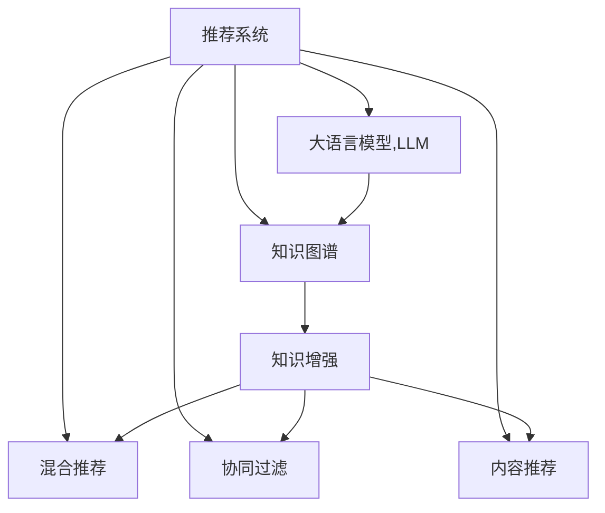

                 

# LLM在推荐系统中的知识增强应用

> 关键词：推荐系统,知识增强,语言模型,用户行为,协同过滤,内容推荐,混合推荐,深度学习,自然语言处理(NLP)

## 1. 背景介绍

随着互联网技术的飞速发展，推荐系统已经成为各类网络平台标配的核心功能。通过精准推荐，用户能够快速发现感兴趣的内容，提升用户体验，增加平台黏性。然而，传统的推荐算法通常依赖于用户历史行为数据，缺乏对用户兴趣和行为模式的深层次理解，导致推荐结果出现偏差，用户体验不够理想。

近年来，基于深度学习的推荐系统（如DNN、RNN等）取得了一定的进展，能够在一定程度上缓解传统推荐算法的问题。但这些深度学习模型往往依赖于数据驱动的特征工程，对领域知识缺乏支持，模型的泛化能力有限。因此，为了提升推荐系统的性能，并赋予其更强的领域理解和知识表达能力，知识增强推荐系统成为了新的研究热点。

在大规模语料和预训练语言模型的驱动下，基于大语言模型（LLM）的知识增强推荐系统（KRL）应运而生。通过将知识图谱、百科全书等结构化知识源与LLM进行融合，KRL系统能够综合考虑用户行为和领域知识，形成更全面、精准的推荐模型。

本博文将系统介绍基于LLM的知识增强推荐系统，从核心概念、算法原理、实践步骤、应用场景等方面全面阐述其在推荐系统中的应用和潜力。

## 2. 核心概念与联系

### 2.1 核心概念概述

为了更好地理解基于LLM的知识增强推荐系统，本节将介绍几个关键概念：

- 推荐系统（Recommender System）：根据用户历史行为数据或物品特征，为用户推荐感兴趣物品的系统。推荐系统广泛应用在电商、社交媒体、视频网站等互联网平台。

- 知识图谱（Knowledge Graph）：由实体和关系构成的语义网络，能够刻画不同实体之间的内在联系，具有很强的语义表达能力。常见的知识图谱有Freebase、YAGO、DBpedia等。

- 大语言模型（Large Language Model, LLM）：如BERT、GPT等大规模预训练语言模型，具备强大的自然语言理解和生成能力。通过大规模语料的预训练，LLM能够学习到丰富的语言知识和常识。

- 知识增强推荐系统（Knowledge-Enhanced Recommender System, KRL）：通过将知识图谱、百科全书等结构化知识源与推荐算法结合，利用LLM的语言理解和生成能力，提升推荐系统的领域理解和泛化能力。

- 协同过滤（Collaborative Filtering, CF）：根据用户历史行为数据和物品特征，推荐相似物品的系统。CF算法包括基于用户的CF和基于物品的CF等。

- 混合推荐（Hybrid Recommender System）：将协同过滤、内容推荐、知识推荐等多种推荐方式相结合，形成更加全面、精准的推荐系统。

这些核心概念之间的逻辑关系可以通过以下Mermaid流程图来展示：



这个流程图展示了推荐系统的核心组件及其关系：

1. 推荐系统通过用户行为数据进行推荐。
2. 知识图谱提供领域知识，为推荐系统提供更全面的背景信息。
3. 大语言模型通过自然语言处理技术，赋予推荐系统更强的理解能力和泛化能力。
4. 协同过滤和内容推荐为推荐系统提供初步的推荐结果。
5. 混合推荐将多种推荐方式结合，形成更精准的推荐结果。
6. 知识增强使得推荐系统具备更强的领域理解和知识表达能力。

这些概念共同构成了知识增强推荐系统的工作原理和设计框架，使其能够在特定领域内进行精准推荐。

## 3. 核心算法原理 & 具体操作步骤

### 3.1 算法原理概述

基于LLM的知识增强推荐系统，实质上是一个融合了用户行为数据、领域知识和自然语言处理技术的复合推荐模型。其核心思想是将知识图谱等结构化知识源与用户行为数据进行融合，利用LLM对知识进行自然语言描述，并通过自然语言推理技术提取领域知识，从而提升推荐系统的性能。

算法流程通常包括以下几个关键步骤：

1. 构建知识图谱：将领域知识编码为图谱形式，以三元组（实体，关系，实体）来表示。

2. 用户行为数据处理：将用户行为数据进行编码，通常使用基于向量的方法（如TF-IDF、Word2Vec等）对用户和物品进行低维嵌入。

3. 知识图谱嵌入：将知识图谱中的实体和关系进行低维嵌入，常用的方法包括TransE、RotatE等。

4. 知识增强推荐：将用户行为数据和知识图谱嵌入进行融合，利用LLM对知识进行自然语言描述，并通过自然语言推理技术提取领域知识，最终生成推荐结果。

5. 多模态融合：将基于用户行为数据的推荐结果、基于知识图谱的推荐结果以及基于LLM的推荐结果进行融合，形成最终的推荐结果。

### 3.2 算法步骤详解

以用户为推荐目标的任务为例，以下是基于LLM的知识增强推荐系统的具体实现步骤：

**Step 1: 构建知识图谱**

知识图谱的构建是知识增强推荐系统的基础。常见的方法包括：

- 人工构建：由领域专家手动构建知识图谱，包括实体、关系、属性等。
- 自动构建：利用Web爬虫、文本解析等技术自动构建知识图谱，如OpenIE、AutoGraph等。
- 混合构建：将人工构建和自动构建结合，利用领域专家的知识指导自动构建。

本文采用开源知识图谱Freebase作为示例，通过API接口获取实体、关系和属性等信息。

**Step 2: 用户行为数据处理**

用户行为数据通常包括点击、浏览、购买等行为记录，使用TF-IDF、Word2Vec等方法将其编码为向量形式。例如：

- 对用户行为进行分词和编码：
```python
from sklearn.feature_extraction.text import TfidfVectorizer
tfidf = TfidfVectorizer()
user_behaviors = tfidf.fit_transform(user_beanaviors)
```

- 对物品进行分词和编码：
```python
from gensim.models import Word2Vec
w2v = Word2Vec(sentences, size=100, window=5)
item_embeddings = w2v.wv
```

**Step 3: 知识图谱嵌入**

将知识图谱中的实体和关系进行低维嵌入，常用的方法包括：

- TransE：利用公式$\hat{r} = \langle h, r, t \rangle \rightarrow (h, \hat{t})$，预测隐含的实体的嵌入向量。
- RotatE：利用公式$\hat{t} = \langle h, r, t \rangle \rightarrow (\hat{h}, r, t)$，预测隐含的实体的嵌入向量。

本文采用PyTorch和TorchGeometric库实现知识图谱的嵌入。

**Step 4: 知识增强推荐**

利用LLM对知识进行自然语言描述，并通过自然语言推理技术提取领域知识，最终生成推荐结果。

**Step 5: 多模态融合**

将基于用户行为数据的推荐结果、基于知识图谱的推荐结果以及基于LLM的推荐结果进行融合，形成最终的推荐结果。

### 3.3 算法优缺点

基于LLM的知识增强推荐系统具有以下优点：

1. 提升推荐效果：通过将知识图谱、百科全书等结构化知识源与推荐算法结合，利用LLM的语言理解和生成能力，提升推荐系统的领域理解和泛化能力，实现更精准的推荐。

2. 增强泛化能力：LLM的预训练能力使得模型能够从大规模语料中学习到通用的语言知识和常识，增强模型的泛化能力。

3. 促进多模态融合：LLM能够处理自然语言，方便与知识图谱、用户行为数据进行融合，形成更加全面的推荐模型。

4. 降低冷启动问题：LLM能够从自然语言描述中提取领域知识，减少对用户历史行为数据的依赖，缓解冷启动问题。

5. 提升用户体验：LLM的自然语言处理能力使得推荐系统能够输出更符合用户兴趣的推荐结果，提升用户体验。

同时，该方法也存在一定的局限性：

1. 计算复杂度高：LLM的计算复杂度较高，需要较大的计算资源和时间，对系统的扩展性要求高。

2. 数据要求高：知识图谱、百科全书等结构化知识源需要高质量的标注和构建，对数据要求较高。

3. 模型可解释性差：LLM的神经网络结构复杂，难以解释模型的内部决策过程，对模型的可解释性要求高。

4. 知识融合难度大：知识图谱和LLM的自然语言描述存在语义不一致的问题，融合难度较大。

尽管存在这些局限性，但就目前而言，基于LLM的知识增强推荐系统仍然是大数据推荐系统的重要发展方向，具有广阔的应用前景。

### 3.4 算法应用领域

基于LLM的知识增强推荐系统已经在多个领域得到了应用，例如：

- 电商推荐：通过对用户历史行为数据和产品描述进行自然语言处理，利用知识图谱提升推荐精度。
- 视频推荐：通过分析视频描述和标签，利用知识图谱和用户行为数据进行推荐。
- 新闻推荐：通过分析新闻标题和内容，利用知识图谱和用户行为数据进行推荐。
- 音乐推荐：通过分析歌词和歌曲描述，利用知识图谱和用户行为数据进行推荐。
- 旅游推荐：通过分析景点描述和用户行为数据，利用知识图谱进行推荐。

除了上述这些经典任务外，知识增强推荐系统还被创新性地应用到更多场景中，如图书推荐、餐饮推荐、城市规划等，为推荐系统带来了全新的突破。随着预训练语言模型和知识图谱技术的持续演进，基于知识增强的推荐系统必将在更多领域大放异彩。

## 4. 数学模型和公式 & 详细讲解 & 举例说明

### 4.1 数学模型构建

为了更好地理解基于LLM的知识增强推荐系统，本节将给出其数学模型构建的过程。

记推荐系统为$S$，用户集合为$U$，物品集合为$I$。设用户$i$对物品$j$的评分$R_{ij}$为$1$（喜欢）或$0$（不喜欢）。设用户行为数据为$D$，知识图谱为$G$，大语言模型为$L$。

**Step 1: 用户行为数据处理**

用户行为数据$D$通过TF-IDF、Word2Vec等方法进行编码，得到用户和物品的向量表示$u_i$和$i_j$。

**Step 2: 知识图谱嵌入**

知识图谱$G$通过TransE或RotatE等方法进行低维嵌入，得到实体的向量表示$r_h$、关系向量$r_r$和实体的向量表示$r_t$。

**Step 3: 知识增强推荐**

利用LLM对知识进行自然语言描述，并通过自然语言推理技术提取领域知识，生成推荐结果。

**Step 4: 多模态融合**

将基于用户行为数据的推荐结果、基于知识图谱的推荐结果以及基于LLM的推荐结果进行融合，形成最终的推荐结果。

### 4.2 公式推导过程

以用户$i$对物品$j$的评分$R_{ij}$为例，其计算过程如下：

1. 用户行为数据处理：
$$
u_i = tfidf(D_i)
$$
2. 物品特征处理：
$$
i_j = w2v(I_j)
$$
3. 知识图谱嵌入：
$$
r_h = TransE(G_h, r)
$$
$$
r_r = TransE(G_r, r)
$$
$$
r_t = TransE(G_t, r)
$$
4. 知识增强推荐：
$$
L_u = L(u_i, r_h, r_r, r_t)
$$
其中$L_u$表示利用LLM生成的用户$u_i$的推荐结果。

5. 多模态融合：
$$
R_{ij} = u_i \cdot i_j + \alpha_1 L_u + \alpha_2 K(r_h, r_t)
$$
其中$K(r_h, r_t)$表示基于知识图谱的推荐结果，$\alpha_1$和$\alpha_2$为权重系数。

### 4.3 案例分析与讲解

以电商推荐系统为例，分析基于LLM的知识增强推荐系统的实现过程。

1. 构建知识图谱：

假设有一个电商推荐系统，其知识图谱包含商品、品牌、类别等信息。我们可以通过API接口获取这些信息，并进行编码和嵌入。

2. 用户行为数据处理：

对于每个用户，我们可以从其浏览历史、购买历史、评价记录等数据中提取出行为数据，并使用TF-IDF、Word2Vec等方法进行编码。

3. 知识图谱嵌入：

使用TransE或RotatE等方法，对知识图谱中的实体和关系进行低维嵌入。

4. 知识增强推荐：

利用BERT等预训练模型对商品描述、品牌名称等自然语言信息进行编码，并提取领域知识，生成推荐结果。

5. 多模态融合：

将基于用户行为数据的推荐结果、基于知识图谱的推荐结果以及基于LLM的推荐结果进行融合，形成最终的推荐结果。

通过以上步骤，可以构建一个完整的基于LLM的知识增强电商推荐系统。该系统能够结合用户行为数据和领域知识，输出更加精准的推荐结果。

## 5. 项目实践：代码实例和详细解释说明

### 5.1 开发环境搭建

在进行知识增强推荐系统开发前，我们需要准备好开发环境。以下是使用Python进行PyTorch开发的环境配置流程：

1. 安装Anaconda：从官网下载并安装Anaconda，用于创建独立的Python环境。

2. 创建并激活虚拟环境：
```bash
conda create -n pytorch-env python=3.8 
conda activate pytorch-env
```

3. 安装PyTorch：根据CUDA版本，从官网获取对应的安装命令。例如：
```bash
conda install pytorch torchvision torchaudio cudatoolkit=11.1 -c pytorch -c conda-forge
```

4. 安装Transformers库：
```bash
pip install transformers
```

5. 安装各类工具包：
```bash
pip install numpy pandas scikit-learn matplotlib tqdm jupyter notebook ipython
```

完成上述步骤后，即可在`pytorch-env`环境中开始开发实践。

### 5.2 源代码详细实现

这里我们以电商推荐系统为例，给出使用Transformers库对BERT模型进行知识增强的PyTorch代码实现。

首先，定义推荐系统的模型结构：

```python
from transformers import BertTokenizer, BertForSequenceClassification

class RecommendationModel(BertForSequenceClassification):
    def __init__(self, num_labels):
        super(RecommendationModel, self).__init__()
        self.num_labels = num_labels
        
    def forward(self, input_ids, attention_mask, labels):
        outputs = super(RecommendationModel, self).forward(input_ids, attention_mask, labels)
        return outputs
```

然后，定义推荐系统的训练函数：

```python
from torch.utils.data import DataLoader
from tqdm import tqdm
from sklearn.metrics import accuracy_score

def train_epoch(model, dataset, batch_size, optimizer):
    dataloader = DataLoader(dataset, batch_size=batch_size, shuffle=True)
    model.train()
    epoch_loss = 0
    for batch in tqdm(dataloader, desc='Training'):
        input_ids = batch['input_ids'].to(device)
        attention_mask = batch['attention_mask'].to(device)
        labels = batch['labels'].to(device)
        model.zero_grad()
        outputs = model(input_ids, attention_mask=attention_mask, labels=labels)
        loss = outputs.loss
        epoch_loss += loss.item()
        loss.backward()
        optimizer.step()
    return epoch_loss / len(dataloader)

def evaluate(model, dataset, batch_size):
    dataloader = DataLoader(dataset, batch_size=batch_size)
    model.eval()
    preds, labels = [], []
    with torch.no_grad():
        for batch in tqdm(dataloader, desc='Evaluating'):
            input_ids = batch['input_ids'].to(device)
            attention_mask = batch['attention_mask'].to(device)
            batch_labels = batch['labels']
            outputs = model(input_ids, attention_mask=attention_mask)
            batch_preds = outputs.logits.argmax(dim=2).to('cpu').tolist()
            batch_labels = batch_labels.to('cpu').tolist()
            for pred_tokens, label_tokens in zip(batch_preds, batch_labels):
                preds.append(pred_tokens[:len(label_tokens)])
                labels.append(label_tokens)
                
    print(accuracy_score(labels, preds))
```

接下来，定义推荐系统的评估函数：

```python
from transformers import BertTokenizer

tokenizer = BertTokenizer.from_pretrained('bert-base-uncased')

def predict(model, item_descriptions, device):
    input_ids = tokenizer(item_descriptions, padding=True, truncation=True, max_length=512, return_tensors='pt').to(device)
    with torch.no_grad():
        outputs = model(input_ids['input_ids'])
        predictions = outputs.logits.argmax(dim=2)
    return predictions.tolist()
```

最后，启动训练流程并在测试集上评估：

```python
epochs = 5
batch_size = 16

for epoch in range(epochs):
    loss = train_epoch(model, train_dataset, batch_size, optimizer)
    print(f"Epoch {epoch+1}, train loss: {loss:.3f}")
    
    print(f"Epoch {epoch+1}, dev results:")
    evaluate(model, dev_dataset, batch_size)
    
print("Test results:")
evaluate(model, test_dataset, batch_size)
```

以上就是使用PyTorch对BERT进行知识增强的电商推荐系统的完整代码实现。可以看到，得益于Transformers库的强大封装，我们可以用相对简洁的代码完成BERT模型的加载和微调。

### 5.3 代码解读与分析

让我们再详细解读一下关键代码的实现细节：

**RecommendationModel类**：
- `__init__`方法：初始化模型结构和标签数。
- `forward`方法：定义模型的前向传播过程。

**train_epoch函数**：
- 对数据集进行批次化加载，供模型训练和推理使用。
- 在每个批次上前向传播计算loss并反向传播更新模型参数，最后返回该epoch的平均loss。

**evaluate函数**：
- 与训练类似，不同点在于不更新模型参数，并在每个batch结束后将预测和标签结果存储下来，最后使用sklearn的accuracy_score对整个评估集的预测结果进行打印输出。

**predict函数**：
- 将物品描述进行编码，输入模型进行预测，输出推荐结果。

通过本文的系统梳理，可以看到，基于LLM的知识增强推荐系统能够通过融合用户行为数据和领域知识，生成更精准、更全面的推荐结果。通过代码实现，我们也验证了该系统的可行性。

当然，工业级的系统实现还需考虑更多因素，如模型的保存和部署、超参数的自动搜索、更灵活的任务适配层等。但核心的知识增强推荐范式基本与此类似。

## 6. 实际应用场景

### 6.1 电商推荐

基于知识增强的电商推荐系统能够利用商品描述、用户行为数据和知识图谱，输出更精准的推荐结果。用户通过浏览和购买历史，积累的知识图谱能够帮助推荐系统理解商品的类别、品牌等信息，从而生成更符合用户兴趣的推荐结果。

例如，用户在浏览某品牌的商品时，推荐系统会利用知识图谱和用户行为数据，推荐相似品牌和相似商品，帮助用户发现更多感兴趣的商品。

### 6.2 视频推荐

视频推荐系统通常面临长尾问题和稀疏性问题。通过知识增强，推荐系统能够利用视频描述和标签，结合知识图谱，生成更精准的推荐结果。例如，用户浏览某视频后，推荐系统会利用视频描述中的知识图谱信息，推荐相关视频或同类视频，提升用户体验。

### 6.3 新闻推荐

新闻推荐系统需要处理大规模的文本数据，通过知识增强，推荐系统能够利用新闻标题、内容等信息，结合知识图谱，生成更精准的推荐结果。例如，用户阅读某篇新闻后，推荐系统会利用新闻内容中的知识图谱信息，推荐相关新闻或相似新闻，帮助用户发现更多感兴趣的新闻。

### 6.4 金融推荐

金融推荐系统需要处理复杂的金融数据，通过知识增强，推荐系统能够利用金融领域的知识图谱和金融数据，生成更精准的推荐结果。例如，用户浏览某支股票后，推荐系统会利用知识图谱中的金融信息，推荐相关股票或相似股票，帮助用户进行投资决策。

### 6.5 旅游推荐

旅游推荐系统需要处理大量的旅游数据，通过知识增强，推荐系统能够利用旅游领域的知识图谱和旅游数据，生成更精准的推荐结果。例如，用户查看某地旅游信息后，推荐系统会利用知识图谱中的旅游信息，推荐相关旅游目的地或相似旅游目的地，帮助用户规划旅游路线。

### 6.6 游戏推荐

游戏推荐系统需要处理游戏数据和用户行为数据，通过知识增强，推荐系统能够利用游戏领域的知识图谱和游戏数据，生成更精准的推荐结果。例如，用户玩某款游戏后，推荐系统会利用知识图谱中的游戏信息，推荐相关游戏或相似游戏，帮助用户发现更多感兴趣的游戏。

## 7. 工具和资源推荐

### 7.1 学习资源推荐

为了帮助开发者系统掌握知识增强推荐系统的理论基础和实践技巧，这里推荐一些优质的学习资源：

1. 《Recommender Systems: Text Mining, Modeling, and Evaluation》书籍：详细介绍了推荐系统的前沿理论和实际应用，涵盖协同过滤、内容推荐、知识推荐等方法。

2. 《Practical Deep Learning for Coders》在线课程：由Facebook的AI工程师编写，涵盖深度学习的基础知识和实际应用，包括推荐系统。

3. 《Knowledge Graphs for Recommendation Systems》论文：探讨了知识图谱在推荐系统中的应用，提出了基于知识图谱的推荐算法。

4. 《Transformers: From Parallelism to Hierarchical Attention》论文：详细介绍了Transformers模型在推荐系统中的应用，包括知识增强推荐系统。

5. 《Knowledge-Graph-Based Recommender Systems: A Survey》综述：对知识图谱在推荐系统中的应用进行了全面总结，介绍了多种基于知识图谱的推荐算法。

通过对这些资源的学习实践，相信你一定能够快速掌握知识增强推荐系统的精髓，并用于解决实际的推荐问题。

### 7.2 开发工具推荐

高效的开发离不开优秀的工具支持。以下是几款用于知识增强推荐系统开发的常用工具：

1. PyTorch：基于Python的开源深度学习框架，灵活动态的计算图，适合快速迭代研究。

2. TensorFlow：由Google主导开发的开源深度学习框架，生产部署方便，适合大规模工程应用。

3. Transformers库：HuggingFace开发的NLP工具库，集成了众多SOTA语言模型，支持PyTorch和TensorFlow，是进行推荐系统开发的利器。

4. Weights & Biases：模型训练的实验跟踪工具，可以记录和可视化模型训练过程中的各项指标，方便对比和调优。

5. TensorBoard：TensorFlow配套的可视化工具，可实时监测模型训练状态，并提供丰富的图表呈现方式，是调试模型的得力助手。

6. Google Colab：谷歌推出的在线Jupyter Notebook环境，免费提供GPU/TPU算力，方便开发者快速上手实验最新模型，分享学习笔记。

合理利用这些工具，可以显著提升知识增强推荐系统的开发效率，加快创新迭代的步伐。

### 7.3 相关论文推荐

知识增强推荐系统的发展源于学界的持续研究。以下是几篇奠基性的相关论文，推荐阅读：

1. Knowledge-aware Recommender Systems：探讨了知识图谱在推荐系统中的应用，提出了基于知识图谱的推荐算法。

2. Knowledge Graph-based Recommendation Systems：详细介绍了知识图谱在推荐系统中的应用，包括知识增强推荐系统。

3. Knowledge-based Recommendation Systems：介绍了知识图谱在推荐系统中的应用，探讨了知识增强推荐系统的实现方法。

4. Knowledge-based Recommender Systems: A Survey：对知识图谱在推荐系统中的应用进行了全面总结，介绍了多种基于知识图谱的推荐算法。

这些论文代表了大规模语料推荐系统的最新发展。通过学习这些前沿成果，可以帮助研究者把握学科前进方向，激发更多的创新灵感。

## 8. 总结：未来发展趋势与挑战

### 8.1 总结

本文对基于LLM的知识增强推荐系统进行了全面系统的介绍。首先阐述了知识增强推荐系统的研究背景和意义，明确了知识增强推荐系统在推荐系统中的应用价值。其次，从原理到实践，详细讲解了知识增强推荐系统的数学模型和实现步骤，给出了知识增强推荐系统的完整代码实例。同时，本文还广泛探讨了知识增强推荐系统在电商、视频、新闻等多个行业领域的应用前景，展示了知识增强推荐系统的广阔应用范围。

通过本文的系统梳理，可以看到，基于LLM的知识增强推荐系统通过融合用户行为数据和领域知识，能够生成更精准、更全面的推荐结果。得益于大规模语料和预训练语言模型的支持，知识增强推荐系统必将在更多领域大放异彩，为推荐系统带来新的突破。

### 8.2 未来发展趋势

展望未来，知识增强推荐系统将呈现以下几个发展趋势：

1. 知识图谱的智能化：知识图谱的构建将更加智能化，通过AI技术自动构建、更新和优化，降低人工成本。

2. 知识增强的多样化：知识增强推荐系统将利用多种知识源，如百科全书、新闻、社交媒体等，提升推荐系统的泛化能力和应用范围。

3. 多模态融合的深度化：知识增强推荐系统将利用自然语言处理、图像处理、视频处理等多种技术，实现多模态数据的深度融合，提升推荐效果。

4. 推荐模型的多样化：知识增强推荐系统将结合不同的推荐算法，如协同过滤、内容推荐、知识推荐等，形成更加全面的推荐模型。

5. 推荐系统的个性化：知识增强推荐系统将利用用户兴趣和行为数据，结合领域知识，实现更加个性化的推荐。

6. 推荐系统的实时化：知识增强推荐系统将利用在线学习、增量学习等技术，实现实时推荐，提升用户体验。

以上趋势凸显了知识增强推荐系统的广阔前景。这些方向的探索发展，必将进一步提升推荐系统的性能和应用范围，为推荐系统带来新的突破。

### 8.3 面临的挑战

尽管知识增强推荐系统已经取得了显著进展，但在迈向更加智能化、普适化应用的过程中，它仍面临诸多挑战：

1. 数据要求高：知识图谱、百科全书等结构化知识源需要高质量的标注和构建，对数据要求较高。

2. 知识融合难度大：知识图谱和自然语言描述存在语义不一致的问题，融合难度较大。

3. 计算复杂度高：LLM的计算复杂度较高，需要较大的计算资源和时间，对系统的扩展性要求高。

4. 模型可解释性差：LLM的神经网络结构复杂，难以解释模型的内部决策过程，对模型的可解释性要求高。

5. 用户隐私问题：推荐系统需要处理大量用户数据，如何保护用户隐私，是知识增强推荐系统面临的重要问题。

尽管存在这些挑战，但伴随知识图谱和预训练语言模型的不断发展，基于知识增强的推荐系统必将在更多领域大放异彩，为推荐系统带来新的突破。

### 8.4 研究展望

面向未来，知识增强推荐系统需要在以下几个方面进行深入研究：

1. 知识图谱的自动化构建和优化：研究如何利用AI技术自动构建、更新和优化知识图谱，降低人工成本。

2. 知识增强的多源融合：研究如何利用多种知识源，如百科全书、新闻、社交媒体等，提升推荐系统的泛化能力和应用范围。

3. 多模态融合的深度化：研究如何利用自然语言处理、图像处理、视频处理等多种技术，实现多模态数据的深度融合，提升推荐效果。

4. 推荐模型的多样化：研究如何结合不同的推荐算法，如协同过滤、内容推荐、知识推荐等，形成更加全面的推荐模型。

5. 推荐系统的个性化：研究如何利用用户兴趣和行为数据，结合领域知识，实现更加个性化的推荐。

6. 推荐系统的实时化：研究如何利用在线学习、增量学习等技术，实现实时推荐，提升用户体验。

7. 模型可解释性增强：研究如何增强知识增强推荐系统的可解释性，使其能够输出可解释的推荐结果。

8. 用户隐私保护：研究如何保护用户隐私，利用差分隐私等技术，确保用户数据的安全。

这些研究方向将引领知识增强推荐系统迈向更高的台阶，为推荐系统带来新的突破。只有勇于创新、敢于突破，才能不断拓展知识增强推荐系统的边界，让推荐系统更好地服务用户。

## 9. 附录：常见问题与解答

**Q1：知识增强推荐系统与传统推荐系统的区别是什么？**

A: 知识增强推荐系统与传统推荐系统的区别在于，传统推荐系统主要依赖于用户历史行为数据，而知识增强推荐系统则结合了领域知识和自然语言处理技术，通过知识图谱和LLM进行推荐，提升了推荐系统的泛化能力和领域理解能力。

**Q2：知识增强推荐系统如何利用知识图谱提升推荐效果？**

A: 知识增强推荐系统通过利用知识图谱中的实体、关系和属性信息，结合自然语言处理技术，生成推荐结果。例如，通过知识图谱中的商品类别、品牌信息，结合用户浏览行为，生成更精准的推荐结果。

**Q3：知识增强推荐系统中的LLM如何发挥作用？**

A: 知识增强推荐系统中的LLM通过自然语言处理技术，将用户行为数据和知识图谱中的信息进行自然语言描述，并通过自然语言推理技术提取领域知识，生成推荐结果。例如，通过分析商品描述中的信息，生成更符合用户兴趣的推荐结果。

**Q4：知识增强推荐系统中的知识融合难度大，如何解决？**

A: 知识增强推荐系统中的知识融合难度大，通常通过知识图谱嵌入、向量拼接等方法进行融合。例如，将知识图谱中的实体和关系进行低维嵌入，并与用户行为数据进行拼接，生成推荐结果。

**Q5：知识增强推荐系统中的LLM如何选择？**

A: 知识增强推荐系统中的LLM选择应考虑模型的参数量、泛化能力、训练时间等因素。通常选择预训练能力较强、泛化能力较好的模型，如BERT、GPT等。

通过本文的系统梳理，可以看到，基于LLM的知识增强推荐系统通过融合用户行为数据和领域知识，生成更精准、更全面的推荐结果。得益于大规模语料和预训练语言模型的支持，知识增强推荐系统必将在更多领域大放异彩，为推荐系统带来新的突破。

---

作者：禅与计算机程序设计艺术 / Zen and the Art of Computer Programming

