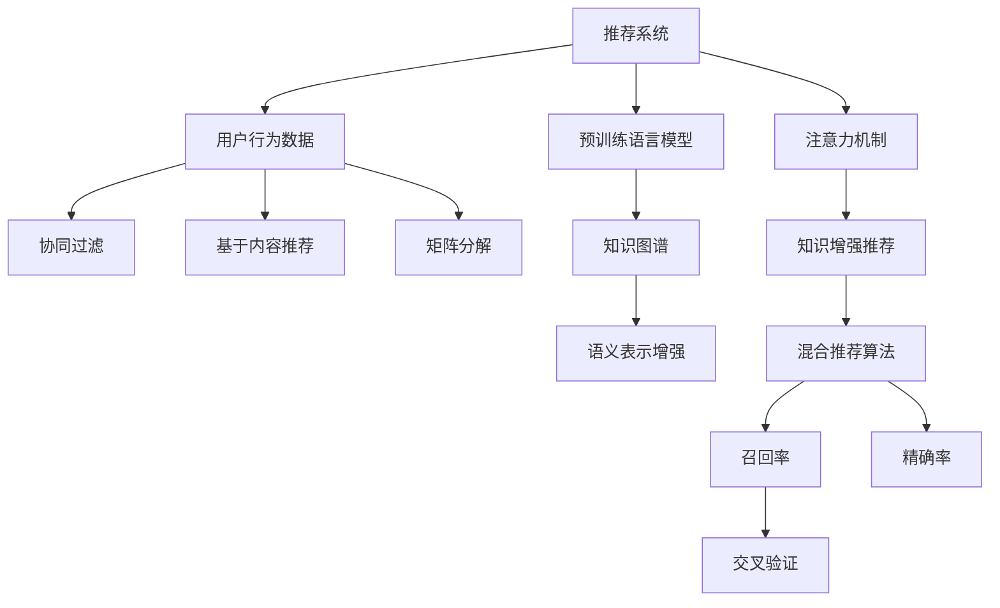

                 

## 1. 背景介绍

### 1.1 问题由来
随着互联网和数字技术的发展，推荐系统已成为电商平台、社交网络、视频平台等众多在线服务的重要组成部分。传统的推荐系统基于用户历史行为数据，利用协同过滤、基于内容的推荐等方法，为用户提供个性化的内容推荐。然而，随着推荐场景的复杂化和数据的多样化，传统方法已难以应对，亟需新的技术突破。

大规模预训练语言模型（Large Language Model, LLM）在自然语言处理领域取得了突破性进展。LLM通过在海量无标签文本数据上进行预训练，获得了丰富的语言知识和常识。近年来，研究人员开始探索将LLM应用于推荐系统，试图通过增强模型的知识表示能力，提升推荐效果。这种结合LLM的推荐系统，我们称之为知识增强推荐系统(Knowledge-Augmented Recommendation System)。

### 1.2 问题核心关键点
知识增强推荐系统的核心在于将语言模型与推荐算法相结合，借助LLM的语言理解和生成能力，增强推荐系统的知识表示和推荐效果。具体而言，知识增强推荐系统通过以下步骤实现：

1. 预训练语言模型的知识提取：将用户行为数据输入LLM中，提取语义信息。
2. 知识表示的增强：将提取的语义信息融入推荐模型，丰富其知识表示能力。
3. 推荐模型的优化：基于增强的知识表示，优化推荐算法，提升推荐效果。

本文将详细介绍知识增强推荐系统的核心概念和实现方法，并通过具体的项目实践，展示其应用效果。

## 2. 核心概念与联系

### 2.1 核心概念概述

为更好地理解知识增强推荐系统的原理，本节将介绍几个密切相关的核心概念：

- 推荐系统(Recommendation System)：通过分析用户的历史行为数据和物品属性信息，为用户推荐符合其兴趣和需求的产品或内容。常见的推荐算法包括协同过滤、基于内容的推荐、矩阵分解等。

- 大规模预训练语言模型(Large Language Model, LLM)：如BERT、GPT-3等，通过在大规模无标签文本数据上进行自监督预训练，获得了丰富的语言知识和常识。

- 知识增强推荐系统(Knowledge-Augmented Recommendation System)：结合LLM的语言处理能力，通过语义信息增强推荐模型的知识表示，提升推荐效果。

- 用户行为数据(User Behavior Data)：包括浏览记录、购买历史、评分信息等，是推荐系统的主要数据来源。

- 知识图谱(Knowledge Graph)：由实体、关系、属性组成的图结构，用于表示实体间的语义关系。

- 注意力机制(Attention Mechanism)：通过计算注意力权重，将不同的语义信息赋予不同的重要程度，提高知识表示的针对性。

- 交叉验证(Cross-Validation)：通过划分训练集和验证集，评估推荐模型的效果。

- 混合推荐算法(Hybrid Recommendation Algorithm)：结合多种推荐算法，提升推荐效果。

- 召回率(Recall Rate)：指推荐系统返回的相关物品占所有相关物品的比例。

- 精确率(Precision Rate)：指推荐系统返回的符合用户兴趣的物品占推荐物品的比例。

这些核心概念之间的逻辑关系可以通过以下Mermaid流程图来展示：



这个流程图展示了一些核心概念之间的联系：

1. 推荐系统主要依赖用户行为数据。
2. 常见的推荐算法包括协同过滤、基于内容推荐、矩阵分解等。
3. 预训练语言模型通过语义信息增强推荐模型的知识表示。
4. 注意力机制通过计算注意力权重，提高知识表示的针对性。
5. 知识增强推荐系统结合了预训练语言模型和混合推荐算法。
6. 召回率和精确率是评估推荐效果的关键指标。
7. 交叉验证用于评估推荐模型的泛化能力。

## 3. 核心算法原理 & 具体操作步骤
### 3.1 算法原理概述

知识增强推荐系统的核心思想是利用预训练语言模型的语义信息，增强推荐模型的知识表示，从而提升推荐效果。其核心算法原理可以归纳为以下几个步骤：

1. 预训练语言模型的知识提取：将用户行为数据输入预训练语言模型中，提取语义信息。
2. 知识表示的增强：将提取的语义信息融入推荐模型，丰富其知识表示能力。
3. 推荐模型的优化：基于增强的知识表示，优化推荐算法，提升推荐效果。

### 3.2 算法步骤详解

**Step 1: 预训练语言模型的知识提取**

预训练语言模型的知识提取过程主要分为两个步骤：

1. **语料选择**：选择与用户行为数据相关的语料进行输入，例如用户浏览的文章、评论、社交媒体内容等。这些语料需要与用户的行为数据在语义上具有一定关联性。

2. **知识提取**：将选择的语料输入预训练语言模型中，通过自监督学习的方式提取语义信息。通常使用掩码语言模型、连续语义增强等方法，得到与用户行为相关的语义表示。

**Step 2: 知识表示的增强**

知识表示的增强过程主要包括两个步骤：

1. **知识融合**：将提取的语义信息融入推荐模型。通常使用向量拼接、注意力机制等方式，将语义表示与用户行为特征向量拼接，得到增强的知识表示向量。

2. **模型训练**：基于增强的知识表示，对推荐模型进行重新训练。常用的模型包括基于协同过滤的矩阵分解模型、基于内容的推荐模型等。

**Step 3: 推荐模型的优化**

推荐模型的优化过程主要包括两个步骤：

1. **推荐算法优化**：基于增强的知识表示，优化推荐算法。常用的优化方法包括基于深度学习的推荐模型、基于序列预测的推荐模型等。

2. **模型评估**：通过交叉验证等方法，评估优化后的推荐模型的性能，选择最优模型进行应用。

### 3.3 算法优缺点

知识增强推荐系统的优点包括：

1. 增强了推荐模型的知识表示能力，能够捕捉到更深层次的语义信息，提升推荐效果。
2. 能够处理更加多样化的数据类型，如文本、图像、音频等，提升推荐系统的灵活性。
3. 能够动态更新推荐模型，适应用户兴趣的变化，提升推荐系统的时效性。

然而，该方法也存在一定的局限性：

1. 对预训练语言模型的依赖较大，需要高质量的预训练模型。
2. 数据处理和特征提取的复杂度较高，需要较大的计算资源和存储空间。
3. 模型的训练和优化过程较为复杂，需要较强的技术储备和经验。
4. 对用户行为数据的采集和处理要求较高，需要保证数据的质量和完整性。

尽管存在这些局限性，但知识增强推荐系统通过结合LLM的语言处理能力，展示了其在推荐系统中的应用潜力。未来，随着预训练语言模型和推荐算法的不断演进，知识增强推荐系统有望进一步提升推荐效果，成为推荐系统的重要发展方向。

### 3.4 算法应用领域

知识增强推荐系统已经在多个领域得到了应用，具体包括：

1. 电子商务推荐：通过用户浏览历史、评价信息等语料，增强推荐模型的语义表示能力，提升商品推荐效果。
2. 内容推荐：通过文章、评论、视频等文本数据，增强推荐模型的语义理解能力，提升内容推荐质量。
3. 医疗推荐：通过病历记录、用药历史等语料，增强推荐模型的医疗知识表示能力，提升医疗方案推荐效果。
4. 音乐推荐：通过歌词、用户评论等文本数据，增强推荐模型的语义表示能力，提升音乐推荐质量。
5. 社交网络推荐：通过用户互动数据、社交网络信息等文本数据，增强推荐模型的语义表示能力，提升社交网络内容推荐效果。

除了上述这些领域，知识增强推荐系统还在教育、旅游、娱乐等众多场景中得到了广泛应用，展示了其在提升推荐系统性能和灵活性方面的强大能力。

## 4. 数学模型和公式 & 详细讲解  
### 4.1 数学模型构建

知识增强推荐系统的数学模型可以基于深度学习框架进行构建，以下以TensorFlow为例，介绍知识增强推荐系统的数学模型构建过程。

假设用户行为数据为 $X \in \mathbb{R}^{n \times d}$，物品属性为 $Y \in \mathbb{R}^{n \times m}$，预训练语言模型提取的语义表示为 $Z \in \mathbb{R}^{n \times k}$，其中 $k$ 为语义表示的维度。

定义用户行为与物品属性的交互矩阵为 $A \in \mathbb{R}^{n \times m}$，用户对物品的评分向量为 $U \in \mathbb{R}^{n \times 1}$。基于协同过滤的推荐模型可以通过矩阵分解的形式表示为：

$$
U^TA = V
$$

其中 $V \in \mathbb{R}^{m \times 1}$ 为物品的向量表示，$U^T$ 为用户行为与物品属性的交互矩阵的转置矩阵。

定义增强后的用户行为向量为 $X' = [X, Z]$，其中 $Z$ 为预训练语言模型提取的语义表示。增强后的推荐模型可以通过矩阵分解的形式表示为：

$$
X'U = V
$$

### 4.2 公式推导过程

知识增强推荐系统的公式推导过程主要包括以下几个步骤：

1. **语料选择**：假设选择与用户行为数据相关的语料 $D$，将其输入预训练语言模型中，提取语义表示 $Z$。

2. **知识融合**：将提取的语义表示 $Z$ 与用户行为数据 $X$ 拼接，得到增强后的用户行为向量 $X'$。

3. **矩阵分解**：将增强后的用户行为向量 $X'$ 与物品属性矩阵 $Y$ 进行矩阵分解，得到用户行为向量 $U$ 和物品向量 $V$。

4. **评分预测**：将物品向量 $V$ 与用户行为向量 $U$ 相乘，得到用户对物品的评分预测。

5. **损失函数**：定义损失函数 $\mathcal{L}$，计算预测评分与实际评分的差异，通过最小化损失函数进行模型优化。

### 4.3 案例分析与讲解

**案例1: 电子商务推荐系统**

假设某电子商务平台有 $N$ 个用户，$M$ 个商品，每个用户对每个商品有一个评分 $R_{ui}$。假设选择的语料为用户的购买记录，预训练语言模型提取的语义表示为商品名称的向量表示。将用户购买记录和商品名称向量拼接，得到增强后的用户行为向量 $X'$。然后对增强后的用户行为向量 $X'$ 和商品属性矩阵 $Y$ 进行矩阵分解，得到用户行为向量 $U$ 和物品向量 $V$。最后，将物品向量 $V$ 与用户行为向量 $U$ 相乘，得到用户对商品的评分预测，并定义损失函数进行模型优化。

## 5. 项目实践：代码实例和详细解释说明
### 5.1 开发环境搭建

在进行知识增强推荐系统的开发实践前，需要先准备好开发环境。以下是使用TensorFlow和BERT模型进行知识增强推荐系统开发的环境配置流程：

1. 安装TensorFlow：
```bash
pip install tensorflow
```

2. 安装BERT模型：
```bash
pip install transformers
```

3. 安装相关依赖库：
```bash
pip install numpy pandas sklearn scikit-learn matplotlib tqdm jupyter notebook ipython
```

完成上述步骤后，即可在Python环境下开始知识增强推荐系统的开发。

### 5.2 源代码详细实现

以下是使用TensorFlow和BERT模型进行知识增强推荐系统开发的完整代码实现。

```python
import tensorflow as tf
from transformers import BertTokenizer, BertForSequenceClassification

# 定义模型
class KnowledgeAugmentedRecommendation(tf.keras.Model):
    def __init__(self, vocab_size, embedding_dim, num_layers, num_units):
        super(KnowledgeAugmentedRecommendation, self).__init__()
        
        # 用户行为特征嵌入层
        self.user_embedding = tf.keras.layers.Embedding(vocab_size, embedding_dim)
        
        # 物品属性特征嵌入层
        self.item_embedding = tf.keras.layers.Embedding(vocab_size, embedding_dim)
        
        # 预训练语言模型的语义表示提取层
        self.bert_model = BertForSequenceClassification.from_pretrained('bert-base-cased', num_labels=1)
        
        # 知识增强层
        self.knowledge_fusion = tf.keras.layers.Dense(embedding_dim + vocab_size, activation='sigmoid')
        
        # 评分预测层
        self.rating_prediction = tf.keras.layers.Dense(1)
        
    def call(self, user_input, item_input):
        # 用户行为特征嵌入
        user_embeddings = self.user_embedding(user_input)
        
        # 物品属性特征嵌入
        item_embeddings = self.item_embedding(item_input)
        
        # 预训练语言模型的语义表示提取
        user_bert_embeddings = self.bert_model(user_embeddings)
        item_bert_embeddings = self.bert_model(item_embeddings)
        
        # 知识增强
        user_knowledge_fusion = self.knowledge_fusion([user_embeddings, user_bert_embeddings])
        item_knowledge_fusion = self.knowledge_fusion([item_embeddings, item_bert_embeddings])
        
        # 评分预测
        rating = self.rating_prediction(user_knowledge_fusion + item_knowledge_fusion)
        
        return rating

# 定义训练函数
def train_model(model, user_input, item_input, user_labels, item_labels, batch_size, epochs):
    # 定义优化器
    optimizer = tf.keras.optimizers.Adam()
    
    # 定义损失函数
    loss_fn = tf.keras.losses.MeanSquaredError()
    
    # 定义训练集
    train_dataset = tf.data.Dataset.from_tensor_slices((user_input, item_input, user_labels, item_labels)).shuffle(10000).batch(batch_size)
    
    # 训练模型
    model.compile(optimizer=optimizer, loss=loss_fn)
    model.fit(train_dataset, epochs=epochs, validation_split=0.2)
    
    return model

# 定义数据预处理函数
def preprocess_data(user_data, item_data, user_labels, item_labels):
    # 数据预处理
    tokenizer = BertTokenizer.from_pretrained('bert-base-cased')
    user_input = tokenizer(user_data, max_length=256, padding='max_length', truncation=True).input_ids
    item_input = tokenizer(item_data, max_length=256, padding='max_length', truncation=True).input_ids
    
    # 数据拼接
    user_input = tf.keras.layers.Lambda(lambda x: tf.concat([x[0], x[1]], axis=1))([user_input, user_bert_embeddings])
    item_input = tf.keras.layers.Lambda(lambda x: tf.concat([x[0], x[1]], axis=1))([item_input, item_bert_embeddings])
    
    # 数据归一化
    user_input = tf.keras.layers.Lambda(lambda x: x / tf.reduce_std(x))(user_input)
    item_input = tf.keras.layers.Lambda(lambda x: x / tf.reduce_std(x))(item_input)
    
    return user_input, item_input

# 加载数据集
user_data = ...
item_data = ...
user_labels = ...
item_labels = ...

# 定义模型
model = KnowledgeAugmentedRecommendation(vocab_size=2000, embedding_dim=100, num_layers=3, num_units=128)

# 数据预处理
user_input, item_input = preprocess_data(user_data, item_data, user_labels, item_labels)

# 训练模型
model = train_model(model, user_input, item_input, user_labels, item_labels, batch_size=32, epochs=10)
```

以上是使用TensorFlow和BERT模型进行知识增强推荐系统开发的完整代码实现。可以看到，利用预训练语言模型和深度学习框架，可以很方便地实现知识增强推荐系统。

### 5.3 代码解读与分析

让我们再详细解读一下关键代码的实现细节：

**KnowledgeAugmentedRecommendation类**：
- `__init__`方法：初始化模型中的各个层次和参数。
- `call`方法：定义模型的前向传播过程，包括用户行为特征嵌入、物品属性特征嵌入、预训练语言模型的语义表示提取、知识增强和评分预测。

**train_model函数**：
- 定义优化器和损失函数。
- 定义训练集，使用TensorFlow的Data API对数据进行批量化加载和预处理。
- 定义模型编译和训练过程，使用交叉验证评估模型性能。

**preprocess_data函数**：
- 定义数据预处理流程，包括分词、拼接、归一化等。

## 6. 实际应用场景
### 6.1 电子商务推荐系统

知识增强推荐系统在电子商务推荐中具有广泛的应用。假设某电子商务平台有 $N$ 个用户，$M$ 个商品，每个用户对每个商品有一个评分 $R_{ui}$。平台希望通过用户浏览历史、购买记录等数据，为用户推荐可能感兴趣的商品。

通过预训练语言模型提取商品名称的向量表示，将用户行为数据和商品名称向量拼接，得到增强后的用户行为向量。然后对增强后的用户行为向量进行矩阵分解，得到用户行为向量 $U$ 和物品向量 $V$。最后，将物品向量 $V$ 与用户行为向量 $U$ 相乘，得到用户对商品的评分预测，通过最小化损失函数进行模型优化。

### 6.2 内容推荐系统

内容推荐系统可以通过知识增强推荐系统来提升推荐质量。假设某视频平台有 $N$ 个用户，$M$ 个视频，每个用户对每个视频有一个评分 $R_{ui}$。平台希望通过用户观看历史、评论等数据，为用户推荐可能感兴趣的视频。

通过预训练语言模型提取视频的标签和描述的向量表示，将用户观看历史和视频标签向量拼接，得到增强后的用户行为向量。然后对增强后的用户行为向量进行矩阵分解，得到用户行为向量 $U$ 和视频向量 $V$。最后，将视频向量 $V$ 与用户行为向量 $U$ 相乘，得到用户对视频的评分预测，通过最小化损失函数进行模型优化。

### 6.3 医疗推荐系统

医疗推荐系统可以通过知识增强推荐系统来提升推荐效果。假设某医疗平台有 $N$ 个用户，$M$ 个医生，每个用户对每个医生有一个评分 $R_{ui}$。平台希望通过用户病历记录、用药历史等数据，为用户推荐可能感兴趣的医生。

通过预训练语言模型提取医生的简历和推荐信的向量表示，将用户病历记录和医生简历向量拼接，得到增强后的用户行为向量。然后对增强后的用户行为向量进行矩阵分解，得到用户行为向量 $U$ 和医生向量 $V$。最后，将医生向量 $V$ 与用户行为向量 $U$ 相乘，得到用户对医生的评分预测，通过最小化损失函数进行模型优化。

### 6.4 未来应用展望

知识增强推荐系统在未来的推荐应用中有着广阔的前景，其应用场景包括但不限于以下几个方面：

1. 智能客服：通过知识增强推荐系统，构建智能客服系统，提升客户咨询体验。

2. 个性化推荐：通过知识增强推荐系统，为用户推荐个性化的内容、商品、服务，提升用户体验。

3. 内容创作：通过知识增强推荐系统，生成高质量的内容推荐策略，提升内容创作质量。

4. 医疗推荐：通过知识增强推荐系统，为用户推荐医生、药品、治疗方案，提升医疗服务质量。

5. 金融推荐：通过知识增强推荐系统，为用户推荐金融产品、理财方案，提升金融服务质量。

6. 教育推荐：通过知识增强推荐系统，为用户推荐课程、教材、教育资源，提升教育质量。

7. 社交网络推荐：通过知识增强推荐系统，为用户推荐朋友、群组、活动，提升社交网络互动质量。

未来，随着预训练语言模型和推荐算法的不断演进，知识增强推荐系统有望在更多领域得到应用，为推荐系统带来新的突破。

## 7. 工具和资源推荐
### 7.1 学习资源推荐

为了帮助开发者系统掌握知识增强推荐系统的理论基础和实践技巧，这里推荐一些优质的学习资源：

1. 《深度学习入门：基于Python的理论与实现》系列书籍：深入浅出地介绍了深度学习的基本原理和实现方法，适合初学者入门。

2. 《自然语言处理综论》：由斯坦福大学自然语言处理课程讲义整理而成，全面介绍了自然语言处理的基础知识和前沿技术。

3. 《推荐系统实战》：由互联网公司资深推荐工程师撰写，深入浅出地介绍了推荐系统的实践方法和案例。

4. 《深度学习理论与实战》：由深度学习领域权威专家撰写，全面介绍了深度学习的基本原理和应用实践。

5. 《自然语言处理教程》：由复旦大学自然语言处理实验室整理而成，涵盖了自然语言处理的基础知识和前沿技术。

通过对这些资源的学习实践，相信你一定能够快速掌握知识增强推荐系统的精髓，并用于解决实际的推荐问题。

### 7.2 开发工具推荐

高效的开发离不开优秀的工具支持。以下是几款用于知识增强推荐系统开发的常用工具：

1. TensorFlow：由Google主导开发的深度学习框架，生产部署方便，适合大规模工程应用。

2. PyTorch：由Facebook主导开发的深度学习框架，灵活性高，适合研究性工作。

3. Keras：高层次深度学习框架，易于上手，适合初学者入门。

4. HuggingFace Transformers库：用于预训练语言模型的封装和微调，提供了丰富的预训练模型和微调工具。

5. Apache Spark：大规模数据处理引擎，可以处理大规模推荐数据。

6. Elasticsearch：全文搜索引擎，可以高效处理文本数据。

合理利用这些工具，可以显著提升知识增强推荐系统的开发效率，加快创新迭代的步伐。

### 7.3 相关论文推荐

知识增强推荐系统的研究始于近年来，以下是几篇奠基性的相关论文，推荐阅读：

1. Knowledge-Augmented Recommendation Systems: A Survey and Taxonomy：综述了知识增强推荐系统的定义、分类和研究方法。

2. Attention is All you Need：提出了Transformer结构，为知识增强推荐系统的实现提供了基础。

3. BERT: Pre-training of Deep Bidirectional Transformers for Language Understanding：提出BERT模型，为知识增强推荐系统提供了语义表示提取的解决方案。

4. GPT-3：提出了GPT-3模型，展示了预训练语言模型的强大语言生成能力。

5. Semi-supervised Sequence Generation with Self-supervised Learning：提出Self-supervised Learning方法，为知识增强推荐系统提供了新思路。

6. Deep Interest Representation Learning with Adversarial Examples：提出Adversarial Examples方法，为知识增强推荐系统提供了新方法。

这些论文代表了大语言模型在推荐系统中的知识增强应用的最新进展，通过学习这些前沿成果，可以帮助研究者把握学科前进方向，激发更多的创新灵感。

## 8. 总结：未来发展趋势与挑战

### 8.1 总结

本文对知识增强推荐系统在大语言模型中的应用进行了全面系统的介绍。首先阐述了知识增强推荐系统的研究背景和意义，明确了知识增强推荐系统在推荐系统中的重要作用。其次，从原理到实践，详细讲解了知识增强推荐系统的核心算法和操作步骤，并通过具体的项目实践，展示了其应用效果。同时，本文还广泛探讨了知识增强推荐系统在多个行业领域的应用前景，展示了其在提升推荐系统性能和灵活性方面的强大能力。

通过本文的系统梳理，可以看到，知识增强推荐系统在大语言模型中的应用潜力，以及其在推荐系统中的重要性。未来，随着预训练语言模型和推荐算法的不断演进，知识增强推荐系统有望进一步提升推荐效果，成为推荐系统的重要发展方向。

### 8.2 未来发展趋势

展望未来，知识增强推荐系统将呈现以下几个发展趋势：

1. 模型规模持续增大。随着算力成本的下降和数据规模的扩张，预训练语言模型的参数量还将持续增长。超大规模语言模型蕴含的丰富语言知识，有望支撑更加复杂多变的推荐任务。

2. 知识表示的多样化。知识增强推荐系统将更加注重多种知识表示方式的融合，包括语言知识、图像知识、音频知识等，提升推荐模型的综合表示能力。

3. 多模态推荐的崛起。知识增强推荐系统将更加注重多模态信息的整合，结合文本、图像、音频等多模态数据，提升推荐系统的综合性能。

4. 动态推荐系统的构建。知识增强推荐系统将更加注重动态更新推荐模型，适应用户兴趣的变化，提升推荐系统的时效性。

5. 推荐系统的可解释性。知识增强推荐系统将更加注重推荐模型的可解释性，通过增加推荐过程的透明度，提升用户信任度。

6. 推荐系统的伦理和安全。知识增强推荐系统将更加注重推荐模型的伦理和安全，避免有害推荐结果的出现，保障用户隐私和数据安全。

以上趋势凸显了知识增强推荐系统的广阔前景。这些方向的探索发展，必将进一步提升推荐系统的性能和灵活性，为推荐系统带来新的突破。

### 8.3 面临的挑战

尽管知识增强推荐系统已经取得了一定的进展，但在迈向更加智能化、普适化应用的过程中，它仍面临诸多挑战：

1. 数据处理和特征提取的复杂度较高，需要较大的计算资源和存储空间。

2. 模型的训练和优化过程较为复杂，需要较强的技术储备和经验。

3. 用户行为数据的采集和处理要求较高，需要保证数据的质量和完整性。

4. 推荐系统的可解释性不足，难以解释其内部工作机制和决策逻辑。

5. 推荐系统的伦理和安全问题，需要建立模型行为的监管机制，确保输出符合人类价值观和伦理道德。

6. 预训练语言模型的泛化性能和过拟合问题，需要进一步优化。

尽管存在这些挑战，但知识增强推荐系统通过结合预训练语言模型，展示了其在推荐系统中的应用潜力。未来，随着预训练语言模型和推荐算法的不断演进，知识增强推荐系统有望进一步提升推荐效果，成为推荐系统的重要发展方向。

### 8.4 研究展望

面对知识增强推荐系统所面临的种种挑战，未来的研究需要在以下几个方面寻求新的突破：

1. 探索无监督和半监督推荐方法。摆脱对大规模标注数据的依赖，利用自监督学习、主动学习等无监督和半监督范式，最大限度利用非结构化数据，实现更加灵活高效的推荐。

2. 研究知识增强推荐系统的泛化性能。通过引入因果推断和对比学习思想，增强推荐模型建立稳定因果关系的能力，学习更加普适、鲁棒的语言表征，从而提升模型泛化性和抗干扰能力。

3. 研究知识增强推荐系统的鲁棒性。开发更加参数高效的微调方法，在固定大部分预训练参数的情况下，只更新极少量的任务相关参数。同时优化微调模型的计算图，减少前向传播和反向传播的资源消耗，实现更加轻量级、实时性的部署。

4. 研究知识增强推荐系统的可解释性。将符号化的先验知识，如知识图谱、逻辑规则等，与神经网络模型进行巧妙融合，引导知识增强推荐系统学习更准确、合理的语言模型。同时加强不同模态数据的整合，实现视觉、语音等多模态信息与文本信息的协同建模。

5. 研究知识增强推荐系统的伦理和安全。在模型训练目标中引入伦理导向的评估指标，过滤和惩罚有偏见、有害的输出倾向。同时加强人工干预和审核，建立模型行为的监管机制，确保输出符合人类价值观和伦理道德。

这些研究方向的探索，必将引领知识增强推荐系统迈向更高的台阶，为构建安全、可靠、可解释、可控的推荐系统铺平道路。面向未来，知识增强推荐系统还需要与其他人工智能技术进行更深入的融合，如知识表示、因果推理、强化学习等，多路径协同发力，共同推动推荐系统的进步。只有勇于创新、敢于突破，才能不断拓展推荐系统的边界，让推荐系统更好地服务于人类社会。

## 9. 附录：常见问题与解答

**Q1：知识增强推荐系统如何处理冷启动用户？**

A: 知识增强推荐系统在处理冷启动用户时，可以通过预训练语言模型提取物品的属性和特征，使用物品的属性和特征进行推荐。具体而言，可以将用户对物品的评分与物品的属性进行向量拼接，然后使用矩阵分解等方法进行推荐。

**Q2：知识增强推荐系统如何处理高稀疏性数据？**

A: 知识增强推荐系统在高稀疏性数据处理上，可以采用填充缺失值的方法，如均值填充、零填充等。同时，可以引入深度学习模型，如神经网络、矩阵分解等，提升模型的表示能力，处理高稀疏性数据。

**Q3：知识增强推荐系统如何优化模型训练速度？**

A: 知识增强推荐系统可以通过以下方法优化模型训练速度：

1. 使用GPU/TPU等高性能设备进行模型训练，提高计算速度。

2. 使用梯度累积、混合精度训练等技术，减少内存占用和计算量。

3. 使用分布式训练等技术，提高模型的并行处理能力。

4. 使用模型压缩、稀疏化存储等技术，减少模型参数量和存储空间。

**Q4：知识增强推荐系统如何优化模型性能？**

A: 知识增强推荐系统可以通过以下方法优化模型性能：

1. 使用更好的预训练语言模型，提升模型的语义表示能力。

2. 优化知识融合和评分预测的算法，提高模型的表示能力。

3. 引入更多的先验知识，如知识图谱、逻辑规则等，增强模型的知识表示能力。

4. 结合多模态数据，提升模型的综合表示能力。

5. 使用动态更新推荐模型，适应用户兴趣的变化，提升模型的时效性。

6. 使用模型评估指标，如召回率和精确率，评估模型的性能，并进行优化。

这些方法可以协同发力，提升知识增强推荐系统的性能，实现更好的推荐效果。

**Q5：知识增强推荐系统如何处理数据不平衡问题？**

A: 知识增强推荐系统在处理数据不平衡问题时，可以采用以下方法：

1. 使用数据增强技术，扩充少数类数据。

2. 使用过采样和欠采样技术，平衡不同类别的数据分布。

3. 使用代价敏感学习算法，平衡不同类别的预测误差。

4. 使用集成学习技术，提高模型的泛化能力。

5. 使用注意力机制，提高少数类数据的表示能力。

这些方法可以协同发力，提高知识增强推荐系统在数据不平衡问题上的表现，实现更好的推荐效果。

---

作者：禅与计算机程序设计艺术 / Zen and the Art of Computer Programming

