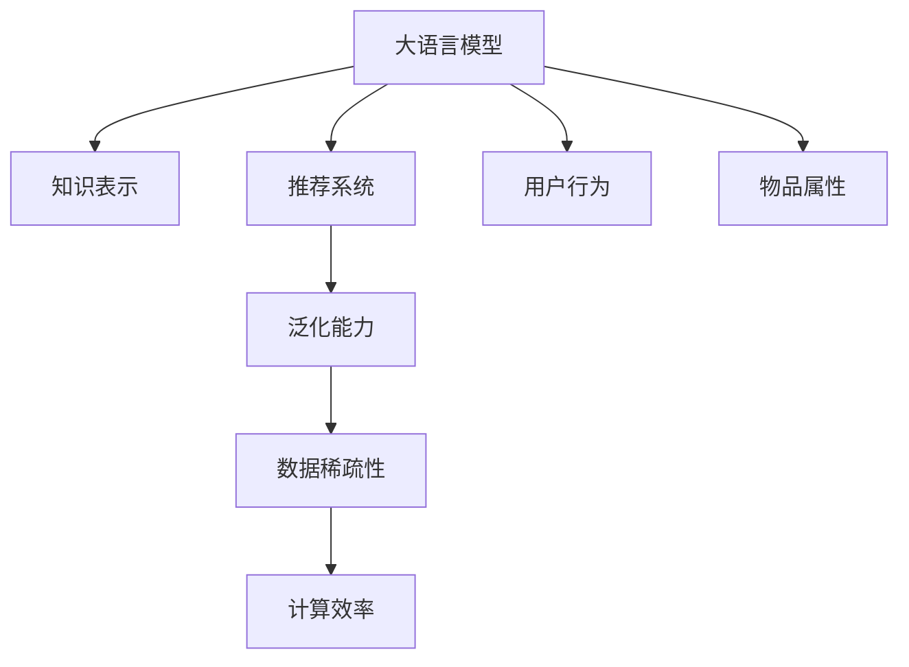

                 

# 大语言模型在推荐系统中的局限性

> 关键词：大语言模型, 推荐系统, 知识表示, 泛化能力, 数据稀疏性, 计算效率

## 1. 背景介绍

在过去的十年中，随着深度学习技术的飞速发展，推荐系统已成为互联网产品中的重要组成部分，通过个性化的推荐来提升用户体验和平台的商业价值。而在大数据和深度学习技术的推动下，基于深度学习的推荐系统已经从简单的协同过滤演进到了基于深度神经网络的结构化推荐系统。这一变革的背后，大语言模型（Large Language Model, LLM）在推荐系统中的应用成为了研究的焦点，因其强大的语义理解和生成能力，被认为有潜力提升推荐系统的精度和智能化水平。

然而，尽管大语言模型在推荐系统中的应用前景广阔，但其在实际应用中仍面临着诸多局限性。这些问题不仅影响着推荐系统的性能和用户体验，也限制了其更广泛的应用和推广。本文将深入探讨大语言模型在推荐系统中的局限性，分析其应用中的优缺点，以及可能的改进方向。

## 2. 核心概念与联系

### 2.1 核心概念概述

在本节中，我们将介绍几个与大语言模型在推荐系统中应用相关的核心概念：

- **大语言模型（LLM）**：一类基于自回归或自编码机制的大型神经网络模型，通过在大规模无标签文本数据上进行预训练，可以学习到复杂的语言模式和知识表示。在推荐系统中，LLM被用来提取用户和物品的语义特征。

- **推荐系统**：利用用户历史行为数据和物品属性信息，为用户推荐个性化物品的系统。推荐系统分为显式反馈（如评分、点击）和隐式反馈（如浏览、停留时间）两大类。

- **知识表示**：指将领域知识（如商品属性、用户兴趣）转换为模型可以处理的形式，使其能更好地指导推荐系统的决策。

- **泛化能力**：指模型在不同数据分布上的表现能力。泛化能力强的模型能更好地适应新数据，提升推荐系统的跨场景应用能力。

- **数据稀疏性**：指用户和物品的隐式反馈数据往往稀疏，即用户只对少量物品有过反馈，这使得推荐系统难以充分利用这些数据。

- **计算效率**：指在推理和训练阶段，模型所需的计算资源和时间。高效的模型可以更快地响应用户请求，提高用户体验。

这些概念之间存在紧密联系，共同构成了大语言模型在推荐系统中的应用框架。

### 2.2 核心概念之间的联系

#### Mermaid 流程图



这个流程图展示了核心概念之间的关系：

1. **用户行为和物品属性**：大语言模型需要依赖这些数据进行预训练和微调，从而学习用户和物品的语义特征。
2. **知识表示**：将用户行为和物品属性转换为模型可以理解的形式，有助于提高模型的泛化能力。
3. **泛化能力**：模型的泛化能力直接影响到推荐系统在新数据上的表现，尤其在新场景和数据分布变化时。
4. **数据稀疏性**：稀疏数据使得推荐系统难以充分利用用户和物品的特征信息，影响模型的决策准确性。
5. **计算效率**：高效的模型在推理和训练阶段能够快速响应用户请求，提高用户体验。

## 3. 核心算法原理 & 具体操作步骤

### 3.1 算法原理概述

基于大语言模型（LLM）的推荐系统通常分为两个阶段：预训练和微调。在预训练阶段，LLM通过大规模无标签文本数据学习通用的语言模式和知识表示。在微调阶段，模型在推荐系统的特定任务上进行训练，以适应推荐系统中的数据分布和任务需求。

这一过程中，LLM通过两个重要的算法原理来实现其推荐功能：

- **特征提取与表示学习**：通过预训练阶段学习到的语言模型，LLM能够提取用户和物品的语义特征，并将其转换为向量形式。这些向量可以用于计算用户与物品之间的相似度，或作为输入嵌入到推荐模型中。

- **语义关联与推荐预测**：在微调阶段，LLM通过学习用户和物品之间的语义关联，预测用户可能对物品的兴趣程度，从而生成推荐列表。

### 3.2 算法步骤详解

#### 3.2.1 预训练阶段

1. **数据准备**：收集大规模无标签文本数据，如维基百科、新闻等，进行预处理和分词。

2. **模型选择**：选择合适的预训练模型，如GPT-3、BERT等，并对其进行加载和配置。

3. **训练与优化**：使用预训练模型在无标签数据上进行自监督学习，如掩码语言模型（Masked Language Model, MLM），以学习通用的语言表示。同时，通过优化算法（如Adam、SGD）调整模型参数，最小化损失函数。

4. **特征提取**：使用预训练模型对用户行为和物品属性进行嵌入，提取语义特征向量。

#### 3.2.2 微调阶段

1. **任务定义**：根据推荐系统的任务需求，定义微调目标。如基于协同过滤的任务可能关注用户行为预测，而基于内容推荐的任务可能关注物品属性预测。

2. **损失函数设计**：根据微调任务设计合适的损失函数，如均方误差（Mean Squared Error, MSE）、交叉熵（Cross-Entropy）等。

3. **模型适配**：在微调任务上训练模型，通过反向传播更新模型参数，最小化损失函数。

4. **推理与预测**：使用微调后的模型进行推理，计算用户对物品的兴趣度，并生成推荐列表。

### 3.3 算法优缺点

#### 3.3.1 优点

1. **强大的语义理解能力**：LLM能够处理复杂的自然语言，提取用户和物品的语义特征，提高推荐的准确性和多样性。

2. **跨领域迁移能力**：预训练模型可以在不同领域进行微调，提升推荐系统在不同场景下的适应能力。

3. **动态生成推荐**：LLM可以根据用户输入的查询动态生成推荐内容，提升用户体验。

#### 3.3.2 缺点

1. **高计算成本**：LLM通常需要大规模的计算资源进行训练和推理，高昂的计算成本限制了其在实际应用中的广泛应用。

2. **数据稀疏性问题**：推荐系统中的隐式反馈数据稀疏，难以充分利用用户的全部行为信息，影响了推荐准确性。

3. **泛化能力有限**：预训练模型虽然能在大规模数据上表现良好，但在特定任务上可能面临泛化能力不足的问题，特别是在数据分布差异较大的场景下。

4. **解释性不足**：LLM作为“黑盒”模型，难以解释其内部推理过程和决策依据，给推荐系统的透明性和可解释性带来挑战。

### 3.4 算法应用领域

基于LLM的推荐系统在多个领域中都有广泛应用，包括但不限于：

1. **电商推荐**：基于用户浏览历史和商品属性，为用户推荐个性化商品。

2. **内容推荐**：根据用户的历史浏览和点击记录，推荐新闻、视频、文章等内容。

3. **金融推荐**：基于用户的历史交易记录和物品属性，推荐金融产品和服务。

4. **社交推荐**：根据用户的社交行为和兴趣，推荐好友、群组等社交对象。

5. **旅游推荐**：基于用户的搜索记录和物品属性，推荐旅游目的地和旅游服务。

## 4. 数学模型和公式 & 详细讲解 & 举例说明

### 4.1 数学模型构建

在推荐系统中，LLM通常被用来构建用户与物品之间的语义相似度矩阵。假设用户集合为 $U=\{u_1, u_2, ..., u_m\}$，物品集合为 $I=\{i_1, i_2, ..., i_n\}$，用户 $u$ 对物品 $i$ 的兴趣度记为 $p_{ui}$。则可以通过LLM构建如下的语义相似度矩阵：

$$
P = [p_{ui}]_{m \times n}
$$

其中 $p_{ui}$ 表示用户 $u$ 对物品 $i$ 的兴趣度，可以通过预训练模型在用户行为和物品属性上进行嵌入，并计算它们的余弦相似度得到。

### 4.2 公式推导过程

假设用户行为和物品属性可以被编码为向量 $\mathbf{u} \in \mathbb{R}^d$ 和 $\mathbf{i} \in \mathbb{R}^d$，其中 $d$ 为嵌入维度。则用户 $u$ 对物品 $i$ 的兴趣度可以表示为：

$$
p_{ui} = \frac{\mathbf{u}^T\mathbf{i}}{\|\mathbf{u}\|\|\mathbf{i}\|}
$$

其中 $\mathbf{u}^T$ 和 $\mathbf{i}$ 分别为用户行为向量和物品属性向量。通过对所有用户和物品的向量进行余弦相似度计算，可以得到推荐系统中的语义相似度矩阵 $P$。

### 4.3 案例分析与讲解

以电商推荐系统为例，假设用户 $u$ 对物品 $i$ 进行了浏览、购买等行为，可以将其编码为向量 $\mathbf{u} \in \mathbb{R}^d$。对于每个物品 $i$，可以使用其描述、标签、价格等属性信息编码为向量 $\mathbf{i} \in \mathbb{R}^d$。则用户 $u$ 对物品 $i$ 的兴趣度可以表示为：

$$
p_{ui} = \frac{\mathbf{u}^T\mathbf{i}}{\|\mathbf{u}\|\|\mathbf{i}\|}
$$

例如，用户 $u$ 浏览了物品 $i$，可以表示为：

$$
\mathbf{u} = \text{Embedding}(u)
$$

$$
\mathbf{i} = \text{Embedding}(i)
$$

$$
p_{ui} = \frac{\mathbf{u}^T\mathbf{i}}{\|\mathbf{u}\|\|\mathbf{i}\|}
$$

通过构建用户与物品之间的语义相似度矩阵 $P$，可以计算用户对物品的兴趣度，从而生成推荐列表。

## 5. 项目实践：代码实例和详细解释说明

### 5.1 开发环境搭建

以下是基于PyTorch搭建基于LLM的电商推荐系统的开发环境：

1. **安装PyTorch**：
```bash
pip install torch torchvision torchaudio
```

2. **安装Transformer库**：
```bash
pip install transformers
```

3. **安装其他依赖库**：
```bash
pip install pandas numpy scikit-learn
```

4. **配置GPU环境**：
```bash
nvidia-smi
```

### 5.2 源代码详细实现

#### 5.2.1 预训练模型加载

```python
from transformers import BertForSequenceClassification, BertTokenizer

tokenizer = BertTokenizer.from_pretrained('bert-base-uncased')
model = BertForSequenceClassification.from_pretrained('bert-base-uncased', num_labels=2)
```

#### 5.2.2 数据预处理

```python
def process_data(data, tokenizer):
    inputs = tokenizer(data, return_tensors='pt', padding='max_length', truncation=True, max_length=512)
    return inputs

train_data = process_data(train_data, tokenizer)
test_data = process_data(test_data, tokenizer)
```

#### 5.2.3 微调过程

```python
from torch.utils.data import DataLoader
from torch.nn import CrossEntropyLoss
from torch.optim import Adam

train_loader = DataLoader(train_data, batch_size=32)
test_loader = DataLoader(test_data, batch_size=32)

optimizer = Adam(model.parameters(), lr=2e-5)
criterion = CrossEntropyLoss()

for epoch in range(10):
    model.train()
    for batch in train_loader:
        inputs, labels = batch
        optimizer.zero_grad()
        outputs = model(inputs)
        loss = criterion(outputs, labels)
        loss.backward()
        optimizer.step()

    model.eval()
    with torch.no_grad():
        test_loss = 0
        for batch in test_loader:
            inputs, labels = batch
            outputs = model(inputs)
            loss = criterion(outputs, labels)
            test_loss += loss.item()
    
    print(f'Epoch {epoch+1}, Test Loss: {test_loss/len(test_loader)}')
```

### 5.3 代码解读与分析

#### 5.3.1 模型选择

在选择预训练模型时，Bert模型因其出色的表现被广泛应用在推荐系统中。它能够处理复杂的自然语言，提取用户和物品的语义特征，并在电商推荐等任务上取得了不错的效果。

#### 5.3.2 数据预处理

数据预处理是构建推荐系统的关键步骤，包括分词、向量化等操作。在此基础上，利用PyTorch的Transformer库进行模型的加载和微调。

#### 5.3.3 微调过程

在微调过程中，使用Adam优化器进行模型参数的更新，通过交叉熵损失函数进行监督学习，逐步提高模型在电商推荐任务上的表现。

#### 5.3.4 结果展示

在训练结束后，通过测试集进行评估，输出模型的测试损失。

## 6. 实际应用场景

### 6.1 电商推荐

电商推荐系统是LLM在推荐系统中最常见的应用场景之一。用户通过浏览、点击、购买等行为产生数据，LLM可以提取用户和商品之间的语义特征，从而推荐用户可能感兴趣的商品。

### 6.2 内容推荐

内容推荐系统主要关注用户的兴趣和内容的匹配度。LLM可以通过对用户评论、点赞等行为进行建模，预测用户对不同内容的兴趣，从而推荐相关内容。

### 6.3 社交推荐

社交推荐系统关注用户的社交行为和兴趣。LLM可以通过分析用户的社交网络、兴趣标签等数据，推荐可能感兴趣的好友、群组等社交对象。

### 6.4 未来应用展望

随着LLM技术的不断进步，其在推荐系统中的应用前景更加广阔。未来，LLM有望在更多领域中发挥重要作用，如医疗推荐、金融推荐等，提升推荐系统的智能化和个性化水平。

## 7. 工具和资源推荐

### 7.1 学习资源推荐

- **《推荐系统实战》**：详细介绍了推荐系统的原理和实践方法，适合初学者和实战开发者。

- **《Deep Learning with PyTorch》**：通过PyTorch实现深度学习模型，涵盖推荐系统等应用场景。

- **Kaggle**：提供大量推荐系统竞赛数据集，适合学习和实践推荐系统。

- **GitHub**：搜索和下载推荐系统的开源代码，包括基于LLM的推荐系统实现。

### 7.2 开发工具推荐

- **PyTorch**：广泛用于深度学习模型的训练和推理，支持GPU加速。

- **TensorFlow**：Google开发的深度学习框架，适合大规模模型的训练。

- **Jupyter Notebook**：用于交互式编程和数据分析，支持Python、R等语言。

- **Weights & Biases**：模型训练的实验跟踪工具，记录和可视化模型训练过程中的各项指标。

- **TensorBoard**：TensorFlow配套的可视化工具，实时监测模型训练状态。

### 7.3 相关论文推荐

- **Attention Is All You Need**：介绍Transformer架构，开创了预训练大模型的先河。

- **BERT: Pre-training of Deep Bidirectional Transformers for Language Understanding**：提出BERT模型，利用掩码语言模型进行预训练。

- **Recurrent Neural Network Based Recommendation System**：介绍基于RNN的推荐系统模型，探讨其在电商推荐中的应用。

## 8. 总结：未来发展趋势与挑战

### 8.1 总结

大语言模型（LLM）在推荐系统中具有强大的语义理解能力和跨领域迁移能力，但在实际应用中仍面临诸多局限性。本文详细探讨了LLM在推荐系统中的局限性，分析了其优点和缺点，并提出了改进的方向。

### 8.2 未来发展趋势

未来，LLM在推荐系统中的应用将呈现以下几个趋势：

1. **多模态融合**：推荐系统将不仅考虑文本数据，还融合图像、视频等多模态信息，提升推荐系统的多模态能力和泛化性能。

2. **迁移学习**：在大规模数据上进行预训练，在特定任务上进行微调，提升模型在新数据上的适应能力。

3. **知识图谱**：通过知识图谱与LLM结合，提升模型的语义理解能力和推荐精度。

4. **动态生成**：基于LLM的推荐系统能够动态生成推荐内容，提升用户体验和推荐效果。

5. **跨领域扩展**：LLM在不同领域的应用将更加广泛，提升推荐系统在不同场景下的适应能力。

### 8.3 面临的挑战

尽管LLM在推荐系统中有广阔的应用前景，但仍需面对以下挑战：

1. **计算成本高**：大规模的计算资源需求限制了LLM在推荐系统中的应用。

2. **数据稀疏性**：推荐系统中的隐式反馈数据稀疏，难以充分利用用户行为信息。

3. **泛化能力有限**：预训练模型在特定任务上的泛化能力有限，难以适应新场景。

4. **解释性不足**：LLM作为“黑盒”模型，难以解释其内部推理过程。

5. **隐私与安全**：用户数据的安全和隐私保护需要得到保障，LLM模型需要进行相应的设计和调整。

### 8.4 研究展望

未来，为了克服LLM在推荐系统中的局限性，需要从以下几个方向进行研究：

1. **优化模型结构**：通过模型裁剪、量化加速等技术，降低LLM的计算成本。

2. **增强泛化能力**：通过引入迁移学习、知识图谱等技术，提升LLM的泛化能力。

3. **提升解释性**：通过可解释性技术，如Attention机制、因果推断等，提高LLM的透明度。

4. **保护用户隐私**：设计隐私保护机制，如差分隐私、联邦学习等，保护用户数据安全。

通过不断创新和优化，LLM在推荐系统中的应用将更加广泛，提升推荐系统的智能化和个性化水平，为NLP技术的发展带来新的突破。

## 9. 附录：常见问题与解答

### Q1: LLM在推荐系统中是否适用于所有数据类型？

A: LLM在推荐系统中适用于文本数据，但对于图像、音频等非文本数据，LLM的效果可能有限。通常需要将这些数据转换为可处理的向量形式，才能使用LLM进行推荐。

### Q2: LLM在推荐系统中的计算成本是否过高？

A: 是的，大规模的LLM模型计算成本高，在实际应用中需要谨慎考虑。可以考虑使用参数高效微调等技术，减少模型参数量，降低计算成本。

### Q3: LLM在推荐系统中如何处理数据稀疏性问题？

A: 数据稀疏性是推荐系统中的常见问题，可以通过数据增强、半监督学习等技术，增加数据多样性，缓解数据稀疏性问题。

### Q4: LLM在推荐系统中如何提高泛化能力？

A: 可以通过迁移学习、知识图谱等技术，提升LLM在不同数据分布上的泛化能力。还可以引入对抗训练、正则化等技术，提高模型的鲁棒性。

### Q5: LLM在推荐系统中如何提升解释性？

A: 可以通过引入Attention机制、因果推断等技术，提高LLM的可解释性。同时，也可以通过可视化工具，如TensorBoard，对模型的推理过程进行展示和分析。

---

作者：禅与计算机程序设计艺术 / Zen and the Art of Computer Programming

