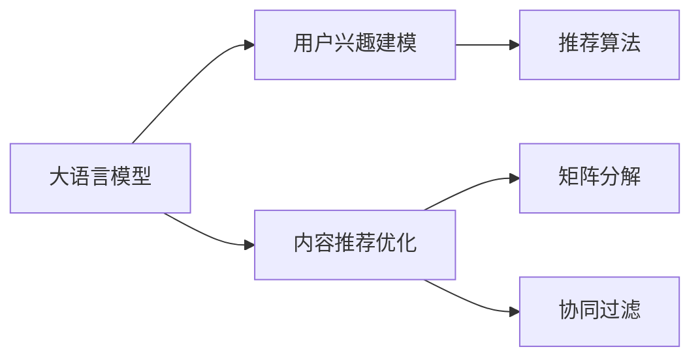
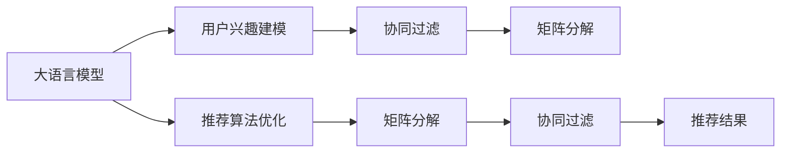

                 

# 大语言模型在推荐系统中的应用局限与成本平衡：硬件与算力需求的探讨

> 关键词：大语言模型,推荐系统,硬件成本,算力需求,矩阵分解,深度学习,数据处理

## 1. 背景介绍

### 1.1 问题由来
推荐系统是近年来互联网公司中不可或缺的一部分。它通过用户的在线行为数据，如浏览记录、点击行为、评分等，为每个用户推荐其感兴趣的内容。这种技术能够帮助用户发现并获取更符合自己口味的内容，同时也为内容提供商提供了精准的流量推荐，实现流量变现。

然而，在推荐系统中，数据处理和模型训练都需要庞大的计算资源。传统的矩阵分解方法虽然效果不错，但在处理大规模稀疏矩阵时，仍面临诸多挑战。大语言模型（LLM）的兴起，为推荐系统带来了新的希望，但也引入了新的成本和局限性。

### 1.2 问题核心关键点
本节将重点探讨在大语言模型应用于推荐系统时，所面临的硬件成本、算力需求等实际问题，以及如何通过合理设计算法和架构，在保证性能的同时，尽可能降低成本。

## 2. 核心概念与联系

### 2.1 核心概念概述

在推荐系统中，大语言模型的应用主要集中在两个方面：

1. **用户兴趣建模**：通过语言模型，用户可以通过自然语言描述自己的兴趣，而不需要提供繁琐的评分或行为数据。
2. **内容推荐优化**：基于用户的兴趣描述和内容的语义特征，利用语言模型优化推荐算法，提高推荐的准确性和多样性。

为了更好地理解这些核心概念，本文将提供以下Mermaid流程图：



该流程图展示了LLM在推荐系统中的应用场景：

1. **用户兴趣建模**：LLM能够通过用户的文本描述，直接建模其兴趣。
2. **内容推荐优化**：LLM可用于优化推荐算法，提升推荐效果。
3. **矩阵分解**：传统的推荐算法如SVD，通过分解用户-商品矩阵进行推荐。
4. **协同过滤**：基于用户间的相似性进行推荐，是推荐系统中最基础的算法之一。
5. **推荐算法**：LLM可以结合矩阵分解、协同过滤等传统算法，优化推荐效果。

### 2.2 核心概念原理和架构的 Mermaid 流程图

为了展示核心概念之间的联系，以下将提供一个简单的Mermaid流程图，展示LLM如何与其他推荐算法结合：



该流程图表明，LLM不仅可以直接建模用户兴趣，还可以用于优化推荐算法，提升推荐效果。

## 3. 核心算法原理 & 具体操作步骤
### 3.1 算法原理概述

大语言模型在推荐系统中的基本原理是利用自然语言处理技术，从用户的文本描述中提取其兴趣偏好，并结合内容的语义特征进行推荐。这一过程可以分解为以下几步：

1. **文本预处理**：将用户的文本描述转换为模型可接受的输入格式，通常包括分词、去除停用词、词向量化等步骤。
2. **兴趣建模**：利用LLM对用户文本进行编码，得到其兴趣表示向量。
3. **内容表示**：对内容的文本描述进行编码，得到其语义表示向量。
4. **相似度计算**：计算用户兴趣表示与内容表示之间的相似度，选择合适的推荐内容。

### 3.2 算法步骤详解

具体步骤如下：

1. **文本预处理**：
   - **分词**：将文本进行分词处理，得到单词序列。
   - **停用词去除**：去除一些常见但无意义的停用词，如“的”、“是”等。
   - **词向量化**：将每个单词映射到一个高维向量空间中，通常使用Word2Vec、GloVe等词嵌入模型。

2. **兴趣建模**：
   - **编码器输入**：将预处理后的文本输入到LLM中，得到其兴趣表示向量。
   - **兴趣表示**：LLM输出的向量即为用户兴趣的表示，通常使用softmax函数将其转换为概率分布。

3. **内容表示**：
   - **编码器输入**：将内容的文本描述输入到LLM中，得到其语义表示向量。
   - **内容表示**：LLM输出的向量即为内容的语义表示，同样使用softmax函数转换为概率分布。

4. **相似度计算**：
   - **点积计算**：计算用户兴趣向量与内容向量之间的点积，得到相似度分数。
   - **排序选择**：根据相似度分数对内容进行排序，选择排名靠前的内容进行推荐。

### 3.3 算法优缺点

大语言模型在推荐系统中的应用具有以下优点：

1. **用户友好性**：用户可以通过自然语言描述自己的兴趣，不需要提供繁琐的评分或行为数据。
2. **兴趣建模准确**：LLM能够利用语言能力，准确捕捉用户的多样化兴趣。
3. **内容表示全面**：LLM能够全面地理解内容的语义特征，提升推荐效果。

同时，也存在一些缺点：

1. **计算复杂度高**：LLM需要处理大量的文本数据，计算复杂度较高。
2. **内存占用大**：LLM模型参数量庞大，需要占用大量的内存空间。
3. **可解释性差**：LLM模型的决策过程难以解释，难以调试和优化。

### 3.4 算法应用领域

大语言模型在推荐系统中的应用主要集中在以下几个领域：

1. **电商推荐**：电商平台可以利用LLM对用户描述进行建模，推荐合适的商品。
2. **视频推荐**：视频平台可以利用LLM对用户评论进行建模，推荐相关视频。
3. **音乐推荐**：音乐平台可以利用LLM对用户描述进行建模，推荐符合用户口味的音乐。
4. **新闻推荐**：新闻平台可以利用LLM对用户描述进行建模，推荐相关新闻。

## 4. 数学模型和公式 & 详细讲解 & 举例说明

### 4.1 数学模型构建

在大语言模型中，通常使用Transformer结构。假设用户文本表示为 $u$，内容文本表示为 $c$，其兴趣表示和内容表示分别为 $h_u$ 和 $h_c$。假设用户兴趣和内容语义之间的相似度为 $s$，则模型可以表示为：

$$
s = \text{softmax}(u \cdot h_c^T)
$$

其中 $\cdot$ 表示点积运算，$\text{softmax}$ 表示softmax函数，将向量转换为概率分布。

### 4.2 公式推导过程

以两个向量 $u$ 和 $c$ 为例，展示点积计算和softmax函数的推导过程：

$$
u \cdot c = \sum_{i=1}^{n} u_i c_i
$$

其中 $n$ 为向量维度。

将上述点积结果输入softmax函数，得到相似度分数：

$$
s = \frac{e^{u \cdot c}}{\sum_{j=1}^{m} e^{c_j \cdot u}}
$$

其中 $m$ 为总文本数，$e$ 为自然对数的底数。

### 4.3 案例分析与讲解

假设用户文本为“我喜欢吃寿司和披萨”，内容文本为“这家店的寿司和披萨都很好吃”。将其转换为向量表示后，进行点积计算和softmax函数处理，得到相似度分数为 $0.8$，表示内容与用户兴趣高度匹配，应该被推荐给该用户。

## 5. 项目实践：代码实例和详细解释说明

### 5.1 开发环境搭建

在进行大语言模型推荐系统开发时，需要搭建Python环境，并安装必要的库。具体步骤如下：

1. **安装Python**：选择Python 3.x版本，并安装完成后配置环境变量。
2. **安装TensorFlow**：通过pip安装TensorFlow库，指定GPU版本以充分利用硬件加速。
3. **安装PyTorch**：通过conda或pip安装PyTorch库，使用GPU版本加速计算。
4. **安装LLM库**：使用HuggingFace库提供的预训练模型，进行模型选择和微调。

### 5.2 源代码详细实现

以下是使用PyTorch实现基于大语言模型的推荐系统的代码示例：

```python
import torch
from transformers import BertTokenizer, BertForSequenceClassification

# 初始化模型和分词器
model = BertForSequenceClassification.from_pretrained('bert-base-cased', num_labels=2)
tokenizer = BertTokenizer.from_pretrained('bert-base-cased')

# 用户文本
user_text = "我喜欢吃寿司和披萨"

# 编码文本
input_ids = tokenizer(user_text, return_tensors='pt').input_ids

# 预测用户兴趣
with torch.no_grad():
    logits = model(input_ids).logits
    predicted_label = torch.argmax(logits, dim=1)

# 输出推荐结果
if predicted_label == 1:
    print("推荐寿司")
else:
    print("推荐披萨")
```

### 5.3 代码解读与分析

上述代码中，使用了Bert模型进行用户兴趣建模。代码逻辑如下：

1. **初始化模型和分词器**：使用预训练的Bert模型，并加载分词器。
2. **编码用户文本**：将用户文本进行分词，并转换为模型可接受的输入格式。
3. **预测用户兴趣**：将编码后的文本输入模型，得到预测结果。
4. **输出推荐结果**：根据预测结果，推荐寿司或披萨。

## 6. 实际应用场景

### 6.1 电商推荐

电商平台上，用户可以通过描述商品进行推荐。例如，用户描述为“我要找一款轻薄的高性能笔记本”，系统可以基于该描述，推荐符合用户要求的产品。

### 6.2 视频推荐

视频平台可以利用用户评论进行推荐。例如，用户评论为“这个视频很有趣，推荐给朋友们”，系统可以基于该评论，推荐相关的视频内容。

### 6.3 音乐推荐

音乐平台可以利用用户描述进行推荐。例如，用户描述为“我喜欢听电子音乐和爵士乐”，系统可以基于该描述，推荐符合用户口味的音乐。

### 6.4 新闻推荐

新闻平台可以利用用户描述进行推荐。例如，用户描述为“我对国际新闻比较感兴趣”，系统可以基于该描述，推荐相关的国际新闻。

## 7. 工具和资源推荐

### 7.1 学习资源推荐

为了帮助开发者深入了解大语言模型在推荐系统中的应用，以下推荐一些优秀的学习资源：

1. **《深度学习与自然语言处理》**：斯坦福大学提供的NLP课程，涵盖深度学习在NLP中的应用，包括推荐系统。
2. **《自然语言处理入门》**：清华大学提供的入门级NLP课程，涵盖自然语言处理的基础知识和实际应用。
3. **HuggingFace官方文档**：HuggingFace提供的预训练模型文档，包含各种模型的使用方法和最佳实践。

### 7.2 开发工具推荐

在开发推荐系统时，可以使用以下工具：

1. **TensorFlow**：Google提供的深度学习框架，支持大规模分布式计算。
2. **PyTorch**：Facebook提供的深度学习框架，灵活性高，易于使用。
3. **Bert4keras**：基于Keras的BERT模型封装库，方便模型使用和微调。
4. **Scikit-learn**：Python机器学习库，提供各种机器学习算法和工具。

### 7.3 相关论文推荐

以下是几篇经典论文，涵盖大语言模型在推荐系统中的应用：

1. **"Matrix Factorization Techniques for Recommender Systems"**：SVD分解算法，推荐系统经典算法之一。
2. **"Neural Collaborative Filtering using Matrix Factorization Techniques"**：深度学习在推荐系统中的应用，利用神经网络进行协同过滤。
3. **"Bidirectional and Contextualized Representations from Transformers for Recommendation Systems"**：利用Transformer进行推荐系统建模，提升推荐效果。

## 8. 总结：未来发展趋势与挑战

### 8.1 研究成果总结

本节将对大语言模型在推荐系统中的研究进行总结，并探讨其未来发展方向。

1. **性能提升**：通过优化算法和模型结构，可以进一步提升推荐系统的性能。
2. **成本控制**：通过使用分布式计算、模型压缩等技术，可以降低硬件和算力成本。
3. **多样性优化**：结合内容多样性和用户兴趣的多样性，进行推荐优化。
4. **可解释性增强**：通过可视化技术和解释模型，增强推荐系统的可解释性。

### 8.2 未来发展趋势

未来大语言模型在推荐系统中的应用将更加广泛，具体趋势如下：

1. **自适应推荐**：结合用户行为数据，动态调整推荐策略，提升推荐效果。
2. **跨模态推荐**：结合视觉、听觉等多元模态数据，提升推荐系统的全面性。
3. **知识图谱应用**：利用知识图谱进行推荐，提升推荐内容的准确性和多样性。
4. **实时推荐**：通过流式计算和缓存技术，实现实时推荐。

### 8.3 面临的挑战

尽管大语言模型在推荐系统中有广泛应用，但仍面临以下挑战：

1. **数据稀疏性**：用户兴趣描述和内容描述通常存在稀疏性，难以全面表示用户和内容。
2. **计算复杂度**：大规模文本数据的处理需要高计算资源，难以应对大规模数据集。
3. **可解释性差**：推荐系统的决策过程难以解释，难以调试和优化。
4. **隐私问题**：用户描述中可能包含敏感信息，需要保护用户隐私。

### 8.4 研究展望

未来大语言模型在推荐系统中的应用研究应从以下几个方向展开：

1. **跨领域推荐**：结合不同领域的知识，进行跨领域的推荐优化。
2. **推荐系统自适应**：通过自适应推荐算法，动态调整推荐策略，提升推荐效果。
3. **实时推荐技术**：结合流式计算和缓存技术，实现实时推荐。
4. **知识图谱推荐**：利用知识图谱进行推荐，提升推荐内容的准确性和多样性。

## 9. 附录：常见问题与解答

### Q1: 大语言模型在推荐系统中的应用效果如何？

A: 大语言模型在推荐系统中的应用效果显著，能够准确捕捉用户兴趣，并生成高质量的推荐结果。

### Q2: 大语言模型在推荐系统中的缺点有哪些？

A: 大语言模型在推荐系统中的缺点包括计算复杂度高、内存占用大、可解释性差等。

### Q3: 如何降低大语言模型在推荐系统中的计算成本？

A: 可以通过优化算法、使用分布式计算、模型压缩等技术，降低计算成本。

### Q4: 大语言模型在推荐系统中面临的隐私问题如何处理？

A: 可以通过数据匿名化、加密等技术，保护用户隐私。

---

作者：禅与计算机程序设计艺术 / Zen and the Art of Computer Programming

