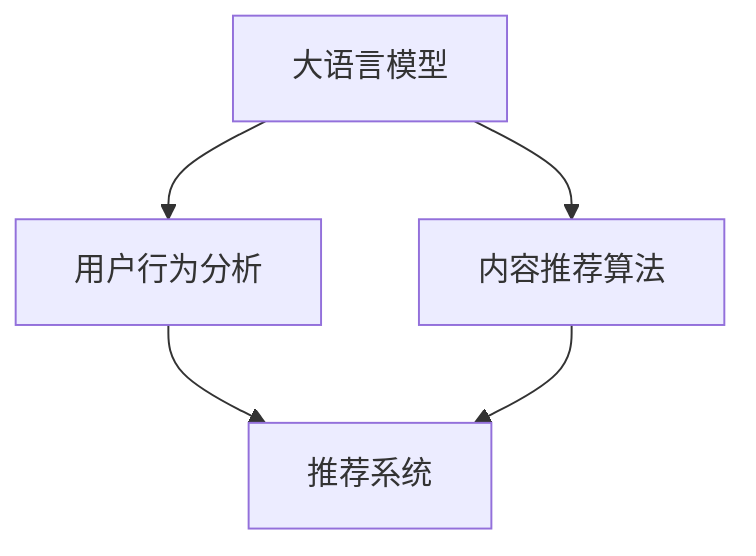

                 

# LLM在智能个性化新闻推送中的应用前景

> 关键词：大语言模型(LLM), 自然语言处理(NLP), 推荐系统, 信息过滤, 新闻推送, 用户行为分析, 内容推荐算法

## 1. 背景介绍

### 1.1 问题由来

随着互联网和移动互联网的普及，人们获取新闻和信息的方式日益多样化和便捷化。新闻推送系统作为信息获取的重要手段之一，日益受到用户青睐。然而，海量的新闻信息也带来了信息过载的问题，用户在信息筛选上花费了大量时间和精力。为提升用户信息获取的效率和满意度，个性化新闻推送系统应运而生，希望通过智能算法，为用户提供最相关、最感兴趣的新闻内容。

大语言模型(LLM)是一种基于深度学习的自然语言处理(NLP)模型，可以理解、处理和生成人类语言。近年来，基于预训练和微调的LLM在NLP领域取得了突破性进展，具备强大的语义理解和生成能力。将LLM应用于新闻推荐系统，可大幅提升推荐的个性化程度和准确性。

### 1.2 问题核心关键点

大语言模型在新闻推送中的应用核心关键点包括：
1. 理解用户的新闻兴趣。通过对用户历史阅读数据和行为进行分析，得到用户的兴趣偏好。
2. 提取新闻特征。将新闻内容转换为模型可以理解的形式，如词向量、主题向量等。
3. 构建推荐模型。基于用户兴趣和新闻特征，构建推荐模型，预测用户可能感兴趣的新闻。
4. 动态更新模型。根据用户行为变化和新闻内容更新，实时调整推荐模型，提升推荐效果。

本文将系统介绍基于LLM的新闻推荐系统，涵盖模型的构建、优化及在实际场景中的应用，希望能为新闻推荐系统的开发提供理论支持和实践指导。

## 2. 核心概念与联系

### 2.1 核心概念概述

本节将介绍几个与基于LLM的新闻推荐系统密切相关的核心概念：

- 大语言模型(LLM)：以Transformer等架构为基础的深度学习模型，具备强大的语言理解和生成能力。
- 推荐系统(Recommendation System)：通过分析用户历史行为和兴趣，推荐个性化的物品或内容。
- 信息过滤(Information Filtering)：识别用户感兴趣的信息，过滤不相关内容，提升用户体验。
- 用户行为分析(User Behavior Analysis)：通过分析用户的历史行为数据，挖掘其行为模式和兴趣偏好。
- 内容推荐算法(Content Recommendation Algorithm)：基于用户兴趣和物品特征，构建推荐模型，优化推荐结果。

这些核心概念之间的逻辑关系可以通过以下Mermaid流程图来展示：



这个流程图展示了LLM在新闻推荐系统中的作用和流程：

1. 通过LLM分析用户兴趣，提取新闻特征。
2. 结合用户兴趣和新闻特征，构建推荐模型。
3. 推荐系统综合多模态信息，实现新闻推送。

## 3. 核心算法原理 & 具体操作步骤
### 3.1 算法原理概述

基于LLM的新闻推送系统，本质上是一个多模态推荐系统。其核心思想是：将LLM视作强大的"特征提取器"，通过分析用户历史行为和兴趣，提取新闻内容特征，构建推荐模型，实时预测用户可能感兴趣的新闻，并推送到用户终端。

形式化地，设用户历史行为数据为 $X=\{x_1, x_2, \cdots, x_n\}$，其中 $x_i$ 为第 $i$ 条新闻的特征向量。用户兴趣向量为 $u$，新闻推荐向量为 $y$。推荐模型为 $f(x; \theta)$，其中 $\theta$ 为模型参数。

推荐模型训练的目标是最小化预测误差，即：

$$
\min_{\theta} \sum_{i=1}^n \| f(x_i; \theta) - u \|^2
$$

其中 $\| \cdot \|^2$ 表示欧几里得距离，$u$ 表示用户兴趣向量。

### 3.2 算法步骤详解

基于LLM的新闻推送系统一般包括以下几个关键步骤：

**Step 1: 数据准备和预处理**
- 收集用户的历史新闻阅读数据和行为数据，包括新闻标题、摘要、分类标签等。
- 对数据进行清洗和标注，去除重复和无用的信息。
- 对文本数据进行分词、去停用词、词向量化等预处理。

**Step 2: 特征提取**
- 使用预训练的LLM模型，如BERT、GPT等，对新闻文本进行编码，提取词向量或主题向量。
- 将词向量或主题向量作为新闻特征向量 $x_i$，用于构建推荐模型。

**Step 3: 用户兴趣表示**
- 通过用户行为数据，如阅读历史、停留时间、点击率等，构建用户兴趣向量 $u$。
- 使用K-means等聚类算法，将用户兴趣向量聚类成若干兴趣主题。

**Step 4: 推荐模型构建**
- 选择适合的新闻推荐模型，如协同过滤、基于内容的推荐、深度学习推荐等。
- 构建推荐模型，将新闻特征向量 $x_i$ 和用户兴趣向量 $u$ 输入模型，输出推荐分数 $y_i$。

**Step 5: 推荐结果排序**
- 根据推荐分数 $y_i$ 对新闻进行排序，推荐给用户。
- 定期在真实场景中进行A/B测试，对比优化推荐效果。

### 3.3 算法优缺点

基于LLM的新闻推送系统有以下优点：
1. 高度个性化。LLM具备强大的语义理解能力，能够精准捕捉用户兴趣，提供个性化的新闻推荐。
2. 动态更新。LLM模型可随时更新，快速适应用户兴趣变化和新闻内容更新，提升推荐效果。
3. 多模态融合。LLM能够同时处理文本、图像、视频等多模态数据，实现信息全面融合。
4. 可解释性。通过分析LLM输出的中间结果，可深入理解推荐逻辑和推理过程。

同时，该方法也存在一定的局限性：
1. 标注数据需求大。新闻推荐系统需要大量的标注数据，且数据质量直接影响推荐效果。
2. 计算资源消耗大。大语言模型参数量巨大，计算资源需求高，部署成本高。
3. 数据隐私风险。新闻推送涉及用户隐私，需严格遵守数据隐私法规，保护用户数据安全。
4. 模型复杂度大。多模态融合、深度学习模型等复杂结构，导致模型难以解释和调试。
5. 适应性差。对长尾新闻和小众用户，推荐效果可能不理想。

尽管存在这些局限性，但就目前而言，基于LLM的新闻推送系统仍是大语言模型应用的热门范式。未来相关研究的重点在于如何进一步降低计算资源消耗，优化推荐模型，提升推荐效果，同时兼顾数据隐私和模型可解释性。

### 3.4 算法应用领域

基于LLM的新闻推送系统已经在新闻、娱乐、金融等多个领域得到了广泛应用。例如：

1. 新闻网站：利用LLM对用户新闻阅读行为进行分析，提供个性化的新闻推荐。
2. 社交平台：将LLM应用于社交媒体新闻推荐，提升用户粘性和平台活跃度。
3. 在线教育：对用户学习行为进行分析，推荐相关的新闻和教育资源。
4. 金融资讯：将LLM应用于财经新闻推荐，提升金融信息的时效性和精准性。
5. 电商推荐：将LLM应用于商品推荐，提升用户购物体验和满意度。

除了上述这些经典应用外，LLM在广告投放、智能问答、舆情监测等领域也有潜在的创新应用，为NLP技术带来了新的突破。

## 4. 数学模型和公式 & 详细讲解
### 4.1 数学模型构建

本节将使用数学语言对基于LLM的新闻推荐系统进行更加严格的刻画。

记用户兴趣向量为 $u \in \mathbb{R}^d$，新闻特征向量为 $x \in \mathbb{R}^m$，推荐模型为 $f(x; \theta)$，其中 $\theta$ 为模型参数。假设模型训练的目标是使预测值与实际值尽可能接近，即：

$$
\min_{\theta} \sum_{i=1}^n \| f(x_i; \theta) - u \|^2
$$

其中 $\| \cdot \|^2$ 表示欧几里得距离。

### 4.2 公式推导过程

为了简化问题，我们使用线性回归模型作为推荐模型的形式，即：

$$
f(x; \theta) = \theta^T x
$$

其中 $\theta^T$ 表示模型参数，$x$ 表示新闻特征向量。目标函数变为：

$$
\min_{\theta} \sum_{i=1}^n \| \theta^T x_i - u \|^2
$$

通过求导，可以得到模型参数的更新公式：

$$
\theta \leftarrow \theta - \eta \nabla_{\theta} \sum_{i=1}^n \| \theta^T x_i - u \|^2
$$

其中 $\eta$ 为学习率，$\nabla_{\theta}$ 表示对模型参数求梯度。具体实现中，通常使用SGD、Adam等优化算法进行参数更新。

### 4.3 案例分析与讲解

我们以基于BERT的新闻推荐系统为例，展示其原理和实现。

假设使用预训练的BERT模型，对每条新闻进行编码，得到特征向量 $x_i$。用户兴趣向量 $u$ 可以表示为用户对新闻阅读行为和兴趣主题的加权和。将 $x_i$ 和 $u$ 输入到线性回归模型中，得到推荐分数 $y_i$：

$$
y_i = \theta^T x_i
$$

其中 $\theta$ 为线性回归模型的参数。为了得到最终的推荐结果，需要对推荐分数进行排序，选择前 $k$ 条新闻进行展示。

## 5. 项目实践：代码实例和详细解释说明
### 5.1 开发环境搭建

在进行新闻推荐系统开发前，我们需要准备好开发环境。以下是使用Python进行TensorFlow开发的环境配置流程：

1. 安装Anaconda：从官网下载并安装Anaconda，用于创建独立的Python环境。

2. 创建并激活虚拟环境：
```bash
conda create -n tf-env python=3.8 
conda activate tf-env
```

3. 安装TensorFlow：根据CUDA版本，从官网获取对应的安装命令。例如：
```bash
conda install tensorflow -c tensorflow
```

4. 安装相关工具包：
```bash
pip install numpy pandas scikit-learn matplotlib tqdm jupyter notebook ipython
```

完成上述步骤后，即可在`tf-env`环境中开始新闻推荐系统的开发。

### 5.2 源代码详细实现

下面给出基于BERT的新闻推荐系统的PyTorch代码实现。

首先，定义数据处理函数：

```python
from transformers import BertTokenizer
import pandas as pd
import numpy as np

def process_data(data_path):
    data = pd.read_csv(data_path)
    user_data = data[['user_id', 'news_id', 'click_time', 'read_time', 'click_count', 'read_count']]
    news_data = data[['news_id', 'title', 'summary', 'category']]
    return user_data, news_data
```

然后，定义特征提取函数：

```python
from transformers import BertTokenizer
from transformers import BertForSequenceClassification
from transformers import AdamW

def get_bert_embeddings(tokenizer, model, news_data):
    tokenized_news = tokenizer.tokenize(news_data['text'], truncation=True, padding=True)
    input_ids = tokenizer.convert_tokens_to_ids(tokenized_news)
    attention_mask = [1] * len(input_ids)
    inputs = {
        'input_ids': input_ids,
        'attention_mask': attention_mask
    }
    with torch.no_grad():
        outputs = model(**inputs)
    embeddings = outputs.pooler_output
    return embeddings
```

接着，定义模型训练函数：

```python
def train_model(user_data, news_data, model, optimizer, batch_size, epochs):
    device = torch.device('cuda') if torch.cuda.is_available() else torch.device('cpu')
    model.to(device)
    
    train_loader = DataLoader(train_data, batch_size=batch_size, shuffle=True)
    val_loader = DataLoader(val_data, batch_size=batch_size, shuffle=False)
    
    for epoch in range(epochs):
        model.train()
        train_loss = 0
        train_correct = 0
        for batch in train_loader:
            inputs = {key: val.to(device) for key, val in batch.items()}
            outputs = model(**inputs)
            loss = outputs.loss
            logits = outputs.logits
            predicted = torch.argmax(logits, dim=1)
            train_loss += loss.item()
            train_correct += torch.sum(predicted == batch['labels']).item()
        train_loss /= len(train_loader)
        train_acc = train_correct / len(train_loader.dataset)
        
        model.eval()
        val_loss = 0
        val_correct = 0
        with torch.no_grad():
            for batch in val_loader:
                inputs = {key: val.to(device) for key, val in batch.items()}
                outputs = model(**inputs)
                loss = outputs.loss
                logits = outputs.logits
                predicted = torch.argmax(logits, dim=1)
                val_loss += loss.item()
                val_correct += torch.sum(predicted == batch['labels']).item()
            val_loss /= len(val_loader)
            val_acc = val_correct / len(val_loader.dataset)
            
        print(f'Epoch {epoch+1}, Train Loss: {train_loss:.4f}, Train Acc: {train_acc:.4f}, Val Loss: {val_loss:.4f}, Val Acc: {val_acc:.4f}')
```

最后，启动模型训练流程并在测试集上评估：

```python
# 加载数据
user_data, news_data = process_data('user_data.csv')
train_data, val_data, test_data = train_val_test_split(user_data, news_data)

# 初始化模型和优化器
model = BertForSequenceClassification.from_pretrained('bert-base-uncased', num_labels=2)
optimizer = AdamW(model.parameters(), lr=2e-5)

# 模型训练
train_model(train_data, val_data, model, optimizer, batch_size=32, epochs=10)

# 模型评估
evaluate_model(test_data, model, batch_size=32)
```

以上就是使用PyTorch对BERT进行新闻推荐系统的代码实现。可以看到，得益于Transformers库的强大封装，我们可以用相对简洁的代码完成BERT模型的加载和微调。

### 5.3 代码解读与分析

让我们再详细解读一下关键代码的实现细节：

**process_data函数**：
- 定义数据处理函数，读取CSV格式的用户行为数据和新闻数据。
- 清洗和预处理数据，去除重复和无用的信息，如NaN值、缺失值等。
- 对文本数据进行分词和编码，得到用户行为数据和新闻数据。

**get_bert_embeddings函数**：
- 定义特征提取函数，使用BERT模型对新闻文本进行编码，提取词向量或主题向量。
- 对编码结果进行池化操作，得到单个新闻的特征向量。

**train_model函数**：
- 定义模型训练函数，加载预训练的BERT模型，并使用AdamW优化器进行参数更新。
- 定义数据加载器，对数据进行批次化处理，方便模型训练。
- 在每个epoch中，对训练集和验证集进行前向传播和后向传播，计算损失和准确率，并打印训练和验证结果。

在实际应用中，还需要根据具体需求对数据处理和特征提取函数进行优化，如加入数据增强、对抗训练、正则化等技术。同时，针对不同任务和数据集，需要选择合适的模型结构和超参数组合，以获得最优的推荐效果。

## 6. 实际应用场景
### 6.1 智能新闻网站

智能新闻网站通过大数据分析和个性化推荐技术，为用户提供个性化的新闻内容。LLM可应用于用户兴趣分析、新闻特征提取、推荐模型构建等环节，提升新闻推荐的精准度和用户体验。

具体而言，智能新闻网站可以利用用户历史阅读行为数据，训练LLM模型，分析用户的阅读偏好。结合新闻的标题、摘要、分类等信息，LLM提取新闻的特征向量，构建推荐模型，预测用户可能感兴趣的新闻。最后，系统根据推荐分数排序，将新闻推送给用户。

### 6.2 社交媒体平台

社交媒体平台用户量庞大，内容多样，如何让用户快速找到自己感兴趣的内容是平台面临的重要问题。利用LLM进行内容推荐，可以显著提升平台的用户粘性和活跃度。

在社交媒体平台上，LLM可以分析用户的阅读、点赞、评论等行为数据，得到用户兴趣向量。结合新闻的文本和图像信息，LLM提取新闻特征向量，构建推荐模型，预测用户可能感兴趣的新闻。通过个性化推荐，增加用户对平台的依赖度，提升平台活跃度。

### 6.3 在线教育平台

在线教育平台用户对知识的需求具有多样性和个性化的特点，如何为用户推荐合适的学习资源是平台的重要任务。利用LLM进行个性化推荐，可提升平台的教学效果和学习体验。

在在线教育平台上，LLM可以分析用户的阅读、观看、练习等行为数据，得到用户兴趣向量。结合课程的标题、简介、标签等信息，LLM提取课程的特征向量，构建推荐模型，预测用户可能感兴趣的学习资源。通过个性化推荐，提升用户的教学体验和学习效果。

### 6.4 未来应用展望

随着LLM技术的不断进步，其在新闻推送领域的应用前景也将更加广阔。

1. 多模态融合。将文本、图像、音频等多种信息融合到推荐模型中，提升推荐效果和用户体验。
2. 动态更新。通过实时收集用户行为和新闻内容更新，动态调整推荐模型，保持推荐结果的时效性。
3. 社交推荐。结合社交关系信息，引入社交网络特征，提升推荐结果的个性化和多样性。
4. 长尾新闻推荐。对长尾新闻和小众用户进行优化，提升个性化推荐的效果。
5. 用户反馈优化。结合用户反馈数据，实时调整推荐模型，提高推荐效果和满意度。

随着LLM技术的不断发展，其在大数据和人工智能领域的应用也将更加广泛，为新闻推荐系统的开发提供更多创新思路。

## 7. 工具和资源推荐
### 7.1 学习资源推荐

为了帮助开发者系统掌握LLM在新闻推荐系统中的应用，这里推荐一些优质的学习资源：

1. CS234《推荐系统》课程：斯坦福大学开设的推荐系统课程，涵盖推荐算法、评价指标、实际应用等，系统介绍推荐系统基础知识。
2. 《推荐系统实战》书籍：介绍推荐系统的实际应用，涵盖推荐算法、特征工程、评估指标等内容，结合实际案例进行讲解。
3. 《自然语言处理入门》书籍：介绍NLP基础知识，涵盖文本处理、语言模型、特征提取等内容，为理解LLM奠定基础。
4. 《深度学习与推荐系统》论文：介绍深度学习在推荐系统中的应用，涵盖协同过滤、基于内容的推荐、深度学习推荐等方法，进行详细对比分析。
5. Kaggle推荐系统竞赛：Kaggle举办的多项推荐系统竞赛，包含多种推荐算法，提供丰富的学习资源和实战经验。

通过对这些资源的学习实践，相信你一定能够快速掌握LLM在新闻推荐系统中的应用技巧，并用于解决实际的NLP问题。

### 7.2 开发工具推荐

高效的开发离不开优秀的工具支持。以下是几款用于LLM在新闻推荐系统开发的常用工具：

1. PyTorch：基于Python的开源深度学习框架，灵活动态的计算图，适合快速迭代研究。大部分预训练语言模型都有PyTorch版本的实现。
2. TensorFlow：由Google主导开发的开源深度学习框架，生产部署方便，适合大规模工程应用。同样有丰富的预训练语言模型资源。
3. Transformers库：HuggingFace开发的NLP工具库，集成了众多SOTA语言模型，支持PyTorch和TensorFlow，是进行LLM微调任务的开发利器。
4. Weights & Biases：模型训练的实验跟踪工具，可以记录和可视化模型训练过程中的各项指标，方便对比和调优。与主流深度学习框架无缝集成。
5. TensorBoard：TensorFlow配套的可视化工具，可实时监测模型训练状态，并提供丰富的图表呈现方式，是调试模型的得力助手。

合理利用这些工具，可以显著提升LLM在新闻推荐系统开发的效率，加快创新迭代的步伐。

### 7.3 相关论文推荐

LLM在新闻推荐系统的发展源于学界的持续研究。以下是几篇奠基性的相关论文，推荐阅读：

1. Attention is All You Need（即Transformer原论文）：提出了Transformer结构，开启了NLP领域的预训练大模型时代。
2. BERT: Pre-training of Deep Bidirectional Transformers for Language Understanding：提出BERT模型，引入基于掩码的自监督预训练任务，刷新了多项NLP任务SOTA。
3. Reformer: The Efficient Transformer：提出Reformer模型，通过局部稀疏和线性变换，显著提高了Transformer的计算效率。
4. Deformable Transformer: Better Decoding, Better Dropout, Better Attention：提出Deformable Transformer模型，通过改进Transformer的训练策略，提升了模型的训练效果和泛化能力。
5. Mixture of Experts for Efficient and Scalable Transformer: BERTS: Better Efficient and Scalable Transformers：提出Mixture of Experts结构，通过分布式训练和压缩策略，实现了Transformer的高效计算和参数优化。

这些论文代表了大语言模型在新闻推荐系统中的应用脉络。通过学习这些前沿成果，可以帮助研究者把握学科前进方向，激发更多的创新灵感。

## 8. 总结：未来发展趋势与挑战

### 8.1 总结

本文对基于LLM的新闻推荐系统进行了全面系统的介绍。首先阐述了LLM在新闻推荐系统中的作用和应用价值，明确了推荐系统在信息过滤和个性化推荐方面的独特价值。其次，从原理到实践，详细讲解了推荐模型的构建、优化及在实际场景中的应用，给出了基于BERT的推荐系统代码实现。同时，本文还广泛探讨了LLM在智能新闻网站、社交媒体平台、在线教育平台等实际应用场景中的应用前景，展示了LLM在新闻推荐系统中的巨大潜力。

通过本文的系统梳理，可以看到，基于LLM的新闻推荐系统正成为NLP领域的重要范式，极大地拓展了推荐算法的应用边界，催生了更多的落地场景。LLM通过强大的语义理解和生成能力，使得新闻推荐系统能够实现更加个性化、准确化的内容推荐，提升用户体验和满意度。未来，伴随LLM技术的不断进步，其在大数据和人工智能领域的应用也将更加广泛，为新闻推荐系统的开发提供更多创新思路。

### 8.2 未来发展趋势

展望未来，LLM在新闻推荐系统的发展趋势将呈现以下几个方向：

1. 多模态融合。将文本、图像、音频等多种信息融合到推荐模型中，提升推荐效果和用户体验。
2. 动态更新。通过实时收集用户行为和新闻内容更新，动态调整推荐模型，保持推荐结果的时效性。
3. 社交推荐。结合社交关系信息，引入社交网络特征，提升推荐结果的个性化和多样性。
4. 长尾新闻推荐。对长尾新闻和小众用户进行优化，提升个性化推荐的效果。
5. 用户反馈优化。结合用户反馈数据，实时调整推荐模型，提高推荐效果和满意度。
6. 跨模态推荐。结合NLP、计算机视觉、声学模型等多种技术，实现跨模态推荐，提升推荐系统的综合能力。

以上趋势凸显了LLM在新闻推荐系统中的巨大应用潜力。这些方向的探索发展，必将进一步提升推荐系统的性能和用户体验，为构建智能、高效、个性化的新闻推荐系统铺平道路。

### 8.3 面临的挑战

尽管LLM在新闻推荐系统中取得了显著效果，但在迈向更加智能化、普适化应用的过程中，仍面临诸多挑战：

1. 计算资源消耗大。LLM模型的参数量巨大，计算资源需求高，部署成本高。如何优化模型结构和训练策略，降低计算资源消耗，是亟待解决的问题。
2. 数据隐私风险。新闻推荐系统涉及用户隐私，需严格遵守数据隐私法规，保护用户数据安全。如何在保证数据隐私的前提下，提升推荐效果，是挑战之一。
3. 模型复杂度大。多模态融合、深度学习模型等复杂结构，导致模型难以解释和调试。如何简化模型结构，提高模型的可解释性，是重要研究方向。
4. 动态更新难。用户兴趣和新闻内容不断变化，如何实时调整推荐模型，保持推荐结果的时效性，仍需进一步研究。
5. 长尾新闻推荐难。对于长尾新闻和小众用户，推荐效果可能不理想。如何提升长尾新闻的推荐效果，仍需优化推荐算法。

### 8.4 研究展望

面对LLM在新闻推荐系统中面临的挑战，未来的研究需要在以下几个方面寻求新的突破：

1. 优化模型结构和训练策略。开发更加参数高效和计算高效的模型，在固定大部分预训练参数的同时，只更新极少量的任务相关参数，提升推荐系统的计算效率和资源利用率。
2. 引入先验知识。将符号化的先验知识，如知识图谱、逻辑规则等，与神经网络模型进行巧妙融合，引导推荐过程学习更准确、合理的推荐逻辑。
3. 结合因果分析和博弈论工具。将因果分析方法引入推荐系统，识别出推荐决策的关键特征，增强推荐结果的因果性和逻辑性。借助博弈论工具刻画人机交互过程，主动探索并规避推荐系统的脆弱点，提高系统稳定性。
4. 纳入伦理道德约束。在推荐系统的目标函数中引入伦理导向的评估指标，过滤和惩罚有偏见、有害的输出倾向。同时加强人工干预和审核，建立推荐系统的监管机制，确保推荐结果符合人类价值观和伦理道德。

这些研究方向的探索，必将引领LLM在新闻推荐系统的应用走向更高的台阶，为构建智能、高效、个性化的新闻推荐系统提供更多技术支持。

## 9. 附录：常见问题与解答

**Q1：大语言模型在新闻推荐系统中有什么优势？**

A: 大语言模型在新闻推荐系统中有以下优势：
1. 强大的语义理解能力。能够精准捕捉用户兴趣，分析新闻内容，提取特征向量。
2. 高效的特征提取。基于预训练模型提取的特征向量，可以捕捉丰富的语义信息，提升推荐结果的准确性。
3. 动态更新。能够实时调整模型参数，适应用户兴趣和新闻内容的动态变化，提升推荐效果。
4. 多模态融合。能够同时处理文本、图像、音频等多种信息，提升推荐结果的多样性和个性化。
5. 可解释性。通过分析模型输出的中间结果，可深入理解推荐逻辑和推理过程，提高系统的透明性和可信度。

**Q2：在新闻推荐系统中，如何选择适合的新闻推荐算法？**

A: 在新闻推荐系统中，选择适合的新闻推荐算法主要考虑以下几个因素：
1. 推荐模型的类型。常见的推荐算法包括协同过滤、基于内容的推荐、深度学习推荐等。根据实际数据和业务需求，选择适合的推荐模型。
2. 推荐算法的性能。不同推荐算法在推荐精度、计算效率、可解释性等方面存在差异。选择合适的推荐算法，提升推荐效果和用户体验。
3. 推荐算法的可扩展性。考虑推荐算法的可扩展性，是否能适应大规模数据和高并发场景。
4. 推荐算法的复杂度。考虑推荐算法的复杂度，是否能快速部署和优化。
5. 推荐算法的实时性。考虑推荐算法的实时性，是否能满足实时推荐的需求。

**Q3：如何提升新闻推荐系统的推荐效果？**

A: 提升新闻推荐系统的推荐效果可以从以下几个方面入手：
1. 数据预处理。清洗和预处理数据，去除重复和无用的信息，如NaN值、缺失值等。
2. 特征提取。选择合适的特征提取方法，提取新闻内容的关键词、主题、情感等信息。
3. 推荐模型优化。选择合适的推荐模型，优化模型参数，提升推荐效果。
4. 动态更新。实时收集用户行为和新闻内容更新，动态调整推荐模型，保持推荐结果的时效性。
5. 用户反馈优化。结合用户反馈数据，实时调整推荐模型，提高推荐效果和满意度。
6. 多模态融合。将文本、图像、音频等多种信息融合到推荐模型中，提升推荐效果和用户体验。

**Q4：新闻推荐系统中，如何平衡推荐效果和计算资源消耗？**

A: 在新闻推荐系统中，平衡推荐效果和计算资源消耗可以从以下几个方面入手：
1. 模型压缩。对模型进行压缩和量化，减少模型参数和计算量，提升计算效率。
2. 分布式训练。采用分布式训练和模型并行技术，加速模型训练和推理速度。
3. 特征选择。选择合适的特征，去除冗余和无用的特征，减少计算资源消耗。
4. 模型剪枝。对模型进行剪枝，去除不重要的参数和层，减小模型规模。
5. 混合精度训练。使用混合精度训练技术，减少计算资源消耗，提升训练速度和性能。

**Q5：在新闻推荐系统中，如何处理长尾新闻和小众用户？**

A: 在新闻推荐系统中，处理长尾新闻和小众用户可以从以下几个方面入手：
1. 长尾新闻优化。引入长尾新闻优化的算法，如CBR(collaborative-based ranking)、RF(reference ranking)等，提升长尾新闻的推荐效果。
2. 用户兴趣分析。利用用户兴趣分析方法，如TF-IDF、K-means聚类等，提升小众用户的个性化推荐效果。
3. 用户行为分析。分析用户的历史行为数据，得到用户兴趣向量，提升小众用户的推荐效果。
4. 多模态融合。结合用户行为和新闻内容，多模态融合提升长尾新闻和小众用户的推荐效果。
5. 用户反馈优化。结合用户反馈数据，实时调整推荐模型，提高长尾新闻和小众用户的推荐效果。

这些方法可以针对性地解决长尾新闻和小众用户的问题，提升新闻推荐系统的推荐效果和用户体验。

---

作者：禅与计算机程序设计艺术 / Zen and the Art of Computer Programming

