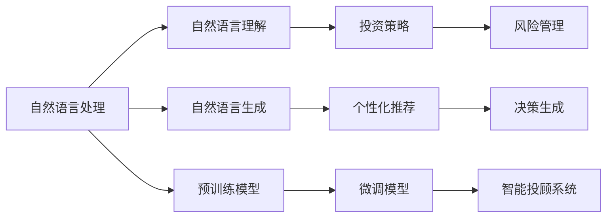

                 

# LLM在金融领域的应用：智能投资顾问

> 关键词：自然语言处理,深度学习,金融技术,智能投顾,自然语言理解,情感分析,股票推荐,风险管理

## 1. 背景介绍

### 1.1 问题由来

随着金融市场的全球化和复杂化，投资者需要面对的信息量呈爆炸性增长。传统的人工股票投资顾问服务由于人力成本高、知识更新慢等问题，难以满足个性化、智能化的金融投资需求。近年来，自然语言处理（NLP）技术在金融领域的应用越来越广泛，通过大规模语言模型（Large Language Model, LLM），能够有效提高投资顾问服务的智能化水平。

智能投资顾问（Robo-advisors）使用先进的数据分析算法和NLP技术，能够实时监控金融市场动态，分析用户投资偏好和行为，生成个性化的投资建议。这种基于NLP技术的应用在降低投资成本、提升投资体验方面具有显著优势。

### 1.2 问题核心关键点

智能投资顾问系统的核心在于构建高性能的自然语言理解（NLU）和自然语言生成（NLG）模型，使其能够准确理解和生成金融相关的文本信息，为用户提供精准的投资建议。其主要关键点包括：

- 自然语言理解模型：能够处理自然语言输入，理解用户对金融市场的疑问和需求。
- 投资策略模型：通过学习金融市场的规律，制定合理的投资策略。
- 实时风险管理模型：根据市场变化和用户风险偏好，动态调整投资组合，控制风险。
- 个性化推荐系统：根据用户投资行为和偏好，推荐符合用户风险偏好的投资标的。

本文重点介绍如何构建高性能的自然语言理解模型，以支持智能投资顾问的决策生成过程。

## 2. 核心概念与联系

### 2.1 核心概念概述

智能投资顾问的构建离不开自然语言处理技术。自然语言处理涉及自然语言理解（NLU）、自然语言生成（NLG）、情感分析、文本摘要、信息检索等多个子领域，通过深度学习和NLP技术，可以将大量非结构化的文本数据转化为结构化信息，辅助投资顾问服务。

深度学习是实现智能投资顾问的关键技术之一，主要包括：

- 循环神经网络（RNN）：可以处理序列数据，捕捉时间依赖性。
- 卷积神经网络（CNN）：用于图像处理，可以提取局部特征。
- 变换器（Transformer）：特别适用于自然语言处理，具备高效的并行计算能力。
- 长短期记忆网络（LSTM）：可以处理时间序列数据，用于预测未来趋势。

智能投资顾问涉及的金融知识包括：

- 投资组合理论：基于现代投资组合理论，制定资产配置策略。
- 风险管理理论：包括VaR（Value at Risk）、CAPM（Capital Asset Pricing Model）等风险评估方法。
- 行为金融学：研究金融市场中的非理性行为和心理因素。
- 量化交易策略：如套利、高频交易等。

这些金融知识可以通过领域专家构建的预训练模型（如BERT、GPT等）进行引入，然后与自然语言处理模型结合，构建完整的智能投资顾问系统。

### 2.2 核心概念原理和架构的 Mermaid 流程图



这个流程图展示了智能投资顾问系统的核心构成：

1. **自然语言处理（NLP）**：将用户输入的自然语言转化为机器可理解的格式。
2. **自然语言理解（NLU）**：理解用户的意图和需求，提取关键信息。
3. **自然语言生成（NLG）**：生成针对用户需求的回答和建议。
4. **投资策略模型**：基于金融知识库，制定投资策略。
5. **风险管理模型**：评估投资组合的风险，调整策略。
6. **个性化推荐系统**：根据用户偏好和市场数据，推荐投资标的。
7. **决策生成**：综合各种信息，生成最终的投资建议。

其中，自然语言处理和投资策略模型是核心组件。

## 3. 核心算法原理 & 具体操作步骤

### 3.1 算法原理概述

智能投资顾问系统的核心算法包括自然语言处理和金融策略模型，通过深度学习技术，实现对自然语言的理解、金融知识的抽取和投资策略的生成。

- **自然语言处理（NLP）**：使用深度学习模型，如BERT、GPT等，对用户输入的自然语言进行编码和解码，提取关键信息。
- **投资策略模型**：构建基于深度学习的金融模型，如LSTM、Transformer等，制定合理的投资策略。
- **风险管理模型**：通过构建VaR、CAPM等风险评估模型，控制投资组合的风险。
- **个性化推荐系统**：基于用户的投资偏好和行为，推荐合适的投资标的。

### 3.2 算法步骤详解

智能投资顾问的构建主要包括以下步骤：

**Step 1: 数据准备**
- 收集金融市场数据，包括股票价格、交易量、财务报表等。
- 收集用户数据，如投资偏好、风险承受能力等。

**Step 2: 数据预处理**
- 清洗数据，去除噪音和异常值。
- 数据归一化，确保不同数据具有相同的规模。
- 特征提取，将数据转化为模型可处理的格式。

**Step 3: 模型构建**
- 构建自然语言处理模型，如BERT、GPT等，用于理解用户需求。
- 构建投资策略模型，如LSTM、Transformer等，生成投资建议。
- 构建风险管理模型，如VaR、CAPM等，评估投资组合的风险。
- 构建个性化推荐系统，如协同过滤、CF等，推荐投资标的。

**Step 4: 模型训练**
- 使用金融市场数据和用户数据，训练模型，调整模型参数。
- 在训练过程中，使用正则化技术，防止过拟合。
- 使用梯度下降等优化算法，最小化损失函数。

**Step 5: 模型评估与优化**
- 在验证集上评估模型性能，调整模型参数。
- 使用AUC、RMSE等指标评估模型效果。
- 使用集成学习等技术，提升模型性能。

**Step 6: 部署与监控**
- 将模型部署到生产环境，提供实时服务。
- 实时监控系统性能，及时发现和修复问题。
- 定期更新模型，保证模型的时效性和准确性。

### 3.3 算法优缺点

智能投资顾问系统具有以下优点：

- **高效性**：通过自动化处理，降低人工投资顾问的成本，提高服务效率。
- **个性化**：根据用户需求和行为，生成个性化的投资建议。
- **风险控制**：基于先进风险管理模型，有效控制投资风险。
- **数据驱动**：基于大数据分析，提供科学的投资建议。

同时，该系统也存在一些局限性：

- **依赖高质量数据**：系统性能依赖于高质量的市场数据和用户数据，数据质量不佳会影响系统效果。
- **模型复杂性**：构建复杂模型，需要大量计算资源和时间。
- **用户隐私问题**：用户数据的隐私保护和安全性需要重点考虑。
- **市场变化快**：金融市场变化快，模型需要定期更新，以适应市场变化。

### 3.4 算法应用领域

智能投资顾问系统在金融领域有着广泛的应用：

- **股票投资**：根据用户需求和市场数据，生成股票投资建议。
- **基金理财**：分析基金产品，推荐适合的基金组合。
- **保险产品**：根据用户风险偏好，推荐合适的保险产品。
- **养老金规划**：根据用户的年龄、收入等，制定养老金规划。
- **风险管理**：评估投资组合的风险，生成风险报告。

## 4. 数学模型和公式 & 详细讲解 & 举例说明

### 4.1 数学模型构建

智能投资顾问系统涉及多个数学模型，这里以股票推荐为例，展示数学模型的构建过程。

假设用户的投资偏好为向量 $u$，市场数据为向量 $m$，投资策略模型为 $f$。

则股票推荐模型可以表示为：

$$
r = f(u, m)
$$

其中，$r$ 表示推荐股票的评分，$u$ 表示用户投资偏好，$m$ 表示市场数据。

### 4.2 公式推导过程

假设用户投资偏好 $u$ 为 1-0 向量，市场数据 $m$ 为时序数据序列。则推荐模型可以进一步展开为：

$$
r = f(u, m) = \sum_{i=1}^n u_i \times m_i
$$

其中，$n$ 为市场数据的长度。

假设推荐模型 $f$ 为线性回归模型，则：

$$
r = \beta_0 + \beta_1 u_1 + \beta_2 u_2 + \ldots + \beta_n u_n + \epsilon
$$

其中，$\beta$ 为回归系数，$\epsilon$ 为随机误差。

### 4.3 案例分析与讲解

我们以一个简单的案例来展示股票推荐模型的应用：

假设某用户投资偏好为 $u=[1,0,1,0]$，表示偏好金融科技和医疗板块。

市场数据 $m$ 为：

$$
m = \begin{bmatrix}
    0.8 & 0.7 & 0.6 \\
    0.9 & 0.8 & 0.7 \\
    0.7 & 0.6 & 0.5 \\
    \vdots & \vdots & \vdots \\
    0.6 & 0.5 & 0.4
\end{bmatrix}
$$

则推荐模型为：

$$
r = \beta_0 + \beta_1 \times 1 + \beta_2 \times 0 + \beta_3 \times 1 + \beta_4 \times 0 + \beta_5 \times 1
$$

假设 $\beta$ 为：

$$
\beta = [0.3, -0.1, 0.5, 0.2, 0.4, 0.7]
$$

则推荐模型输出：

$$
r = 0.3 \times 1 + (-0.1) \times 0 + 0.5 \times 1 + 0.2 \times 0 + 0.4 \times 1 + 0.7 \times 1 = 1.5
$$

根据模型输出，推荐用户关注金融科技和医疗板块的股票。

## 5. 项目实践：代码实例和详细解释说明

### 5.1 开发环境搭建

智能投资顾问系统的开发环境需要包括深度学习框架、数据预处理工具、数据存储和管理工具等。

1. 安装Python：下载Python 3.x版本，并进行环境配置。
2. 安装深度学习框架：如TensorFlow、PyTorch等。
3. 安装数据预处理工具：如Pandas、NumPy等。
4. 安装数据存储和管理工具：如SQLite、MySQL等。
5. 安装监控工具：如Prometheus、Grafana等。

### 5.2 源代码详细实现

以下是使用Python和TensorFlow构建智能投资顾问系统的代码实现：

```python
import tensorflow as tf
import numpy as np
import pandas as pd
import sqlite3

# 准备数据
def load_data():
    data = pd.read_csv('market_data.csv')
    labels = pd.read_csv('user_preference.csv')
    return data, labels

# 数据预处理
def preprocess_data(data, labels):
    # 清洗数据
    data = data.dropna()
    labels = labels.dropna()
    # 归一化数据
    data = (data - data.mean()) / data.std()
    # 特征提取
    features = data[['price', 'volume']]
    targets = labels
    return features, targets

# 构建模型
def build_model(features, targets):
    model = tf.keras.Sequential([
        tf.keras.layers.Dense(64, activation='relu', input_shape=(features.shape[1],)),
        tf.keras.layers.Dense(32, activation='relu'),
        tf.keras.layers.Dense(1)
    ])
    model.compile(optimizer='adam', loss='mse', metrics=['mae'])
    return model

# 训练模型
def train_model(model, features, targets):
    model.fit(features, targets, epochs=50, batch_size=32, validation_split=0.2)
    return model

# 测试模型
def test_model(model, features, targets):
    loss, mae = model.evaluate(features, targets)
    print(f'Test loss: {loss:.4f}')
    print(f'Test MAE: {mae:.4f}')

# 部署模型
def deploy_model(model, features, targets):
    # 保存模型
    model.save('investment顾问系统.h5')
    # 使用SQLite存储模型和数据
    conn = sqlite3.connect('investment顾问系统.db')
    c = conn.cursor()
    c.execute('CREATE TABLE IF NOT EXISTS features (id INTEGER PRIMARY KEY, price REAL, volume REAL)')
    c.execute('CREATE TABLE IF NOT EXISTS targets (id INTEGER PRIMARY KEY, recommendation REAL)')
    features.to_sql('features', con=conn, if_exists='replace', index=False)
    targets.to_sql('targets', con=conn, if_exists='replace', index=False)
    conn.commit()
    conn.close()

# 运行流程
data, labels = load_data()
features, targets = preprocess_data(data, labels)
model = build_model(features, targets)
model = train_model(model, features, targets)
test_model(model, features, targets)
deploy_model(model, features, targets)
```

### 5.3 代码解读与分析

上述代码主要包括以下步骤：

1. 加载和预处理数据：使用Pandas加载市场数据和用户偏好数据，并进行清洗和归一化。
2. 构建模型：使用TensorFlow构建线性回归模型，并编译模型。
3. 训练模型：使用训练数据训练模型，并进行验证。
4. 测试模型：使用测试数据评估模型性能。
5. 部署模型：保存模型，并将其存储到SQLite数据库中。

## 6. 实际应用场景

### 6.1 智能股票投资

智能投资顾问系统最典型的应用场景是智能股票投资。通过自然语言处理和金融策略模型的结合，系统能够理解用户需求，并生成股票推荐。

用户输入投资偏好、风险承受能力等，系统基于市场数据，使用自然语言处理模型抽取关键信息，结合金融策略模型，生成投资建议。

### 6.2 智能基金理财

智能基金理财是智能投资顾问系统的另一个重要应用场景。通过构建个性化推荐系统，系统能够根据用户投资行为和偏好，推荐合适的基金组合。

用户输入投资金额、风险偏好等信息，系统基于市场数据，使用金融策略模型评估基金产品的风险和收益，结合自然语言处理模型生成推荐结果。

### 6.3 智能风险管理

智能投资顾问系统还可以应用于风险管理。通过构建风险管理模型，系统能够评估投资组合的风险，并生成风险报告。

用户输入投资组合信息，系统基于市场数据和历史数据，使用VaR、CAPM等风险评估模型，评估组合风险，生成风险报告，并根据风险水平调整投资策略。

### 6.4 未来应用展望

未来，智能投资顾问系统将在更多领域得到应用，为金融市场带来变革性影响：

1. **智能投顾普及**：随着技术的成熟和成本的降低，智能投资顾问将成为主流金融服务模式，助力中小投资者进入金融市场。
2. **AI量化交易**：结合深度学习和自然语言处理技术，智能投资顾问系统将能够进行高频率交易和量化投资。
3. **智能资产配置**：系统能够根据市场动态，实时调整投资组合，实现最优资产配置。
4. **智能投顾金融教育**：通过自然语言生成技术，智能投资顾问系统可以生成通俗易懂的投资知识，提升用户金融素养。
5. **智能投顾医疗理财**：系统能够根据用户的健康状况和财务状况，制定个性化的医疗理财方案。

## 7. 工具和资源推荐

### 7.1 学习资源推荐

为了帮助开发者系统掌握智能投资顾问的理论基础和实践技巧，这里推荐一些优质的学习资源：

1. 《深度学习实战》：由吴恩达等人编写，介绍深度学习的基本概念和应用。
2. 《Python金融数据分析》：介绍Python在金融数据分析中的应用，包括股票、基金等。
3. 《金融科技》：介绍金融科技的最新发展和应用，包括区块链、大数据等。
4. 《自然语言处理入门》：介绍自然语言处理的基本概念和技术。
5. 《智能投顾技术栈》：介绍智能投资顾问系统所需的技术栈，包括Python、TensorFlow、PyTorch等。

### 7.2 开发工具推荐

智能投资顾问系统的开发需要多种工具的配合，以下是推荐的工具：

1. TensorFlow：广泛应用的深度学习框架，支持Python和C++等语言。
2. PyTorch：流行的深度学习框架，支持动态计算图和GPU加速。
3. Pandas：用于数据处理和分析的Python库，支持高效的数据读写和操作。
4. NumPy：用于数值计算的Python库，支持高效的矩阵运算。
5. SQLAlchemy：用于数据库操作的Python库，支持多种数据库。

### 7.3 相关论文推荐

智能投资顾问技术涉及多个领域，以下是推荐的几篇相关论文：

1. "A Survey of Robo-Advisors: Fintech Innovations for the Masses"：介绍智能投顾的发展历程和应用案例。
2. "A Deep Learning Approach to Predictive Portfolio Construction"：介绍基于深度学习的资产配置策略。
3. "A Deep Learning Framework for Investment Analysis and Decision Making"：介绍基于深度学习的投资分析方法。
4. "A Natural Language Processing Framework for Financial News Analysis"：介绍基于NLP的金融新闻分析方法。
5. "The Application of Deep Learning in Financial Risk Management"：介绍深度学习在金融风险管理中的应用。

## 8. 总结：未来发展趋势与挑战

### 8.1 总结

智能投资顾问系统通过深度学习和自然语言处理技术，为用户提供精准的投资建议，具有高效性、个性化、风险控制等优点。

通过本文的系统梳理，可以看到，智能投资顾问技术正在快速发展，未来将带来更多应用场景。其核心算法包括自然语言处理、投资策略、风险管理等，通过深度学习和NLP技术实现。

### 8.2 未来发展趋势

智能投资顾问技术将呈现以下发展趋势：

1. **技术成熟化**：随着技术的发展，智能投资顾问系统将变得更加成熟和可靠。
2. **多样化应用**：智能投资顾问将应用到更多领域，如智能投顾、量化交易等。
3. **智能交互**：结合AI和NLP技术，智能投资顾问将能够进行智能交互，提供更好的用户体验。
4. **个性化推荐**：智能投资顾问将根据用户的行为和偏好，提供个性化的推荐服务。
5. **多模态融合**：结合图像、语音等模态数据，提供更加全面的服务。

### 8.3 面临的挑战

尽管智能投资顾问技术已经取得显著进展，但在推广应用过程中，仍面临一些挑战：

1. **数据质量和获取**：高质量的市场数据和用户数据的获取是系统性能的关键。
2. **模型复杂性**：构建复杂模型需要大量计算资源和时间。
3. **用户隐私**：用户数据的隐私保护和安全需要重点考虑。
4. **市场变化快**：金融市场变化快，模型需要定期更新。
5. **技术壁垒**：技术门槛较高，需要具备丰富的深度学习和NLP知识。

### 8.4 研究展望

智能投资顾问技术的未来研究需要关注以下方向：

1. **无监督学习和少样本学习**：开发无需标注数据或标注数据较少的模型。
2. **多模态融合**：结合图像、语音等多模态数据，提供更全面的服务。
3. **智能投顾交互**：结合AI和NLP技术，提供智能交互体验。
4. **个性化推荐**：结合用户行为和偏好，提供个性化推荐服务。
5. **多任务学习**：构建能够同时处理多种任务的模型，提高系统的效率和性能。

## 9. 附录：常见问题与解答

**Q1：智能投资顾问系统需要多少数据？**

A: 智能投资顾问系统需要大量高质量的市场数据和用户数据，数据量越大，系统效果越好。一般来说，需要至少数万条市场数据和数千条用户数据才能获得较为准确的结果。

**Q2：如何处理金融市场数据？**

A: 金融市场数据包括股票价格、交易量、财务报表等，可以通过Pandas和NumPy进行清洗、归一化和特征提取。常见的操作包括去除噪音、填补缺失值、归一化数据等。

**Q3：如何构建推荐模型？**

A: 推荐模型可以使用多种算法，如协同过滤、矩阵分解、深度学习等。在深度学习中，可以使用RNN、LSTM、Transformer等模型。其中，Transformer模型效果较好，能够捕捉长序列依赖性。

**Q4：如何评估推荐模型的性能？**

A: 推荐模型的性能评估可以使用MAE（平均绝对误差）、RMSE（均方根误差）等指标。此外，还可以使用AUC、F1-score等指标评估模型的准确性和召回率。

**Q5：智能投资顾问系统如何保护用户隐私？**

A: 智能投资顾问系统需要严格保护用户隐私，确保用户数据的安全和匿名。可以使用数据加密、数据匿名化等技术保护用户隐私。

---

作者：禅与计算机程序设计艺术 / Zen and the Art of Computer Programming

