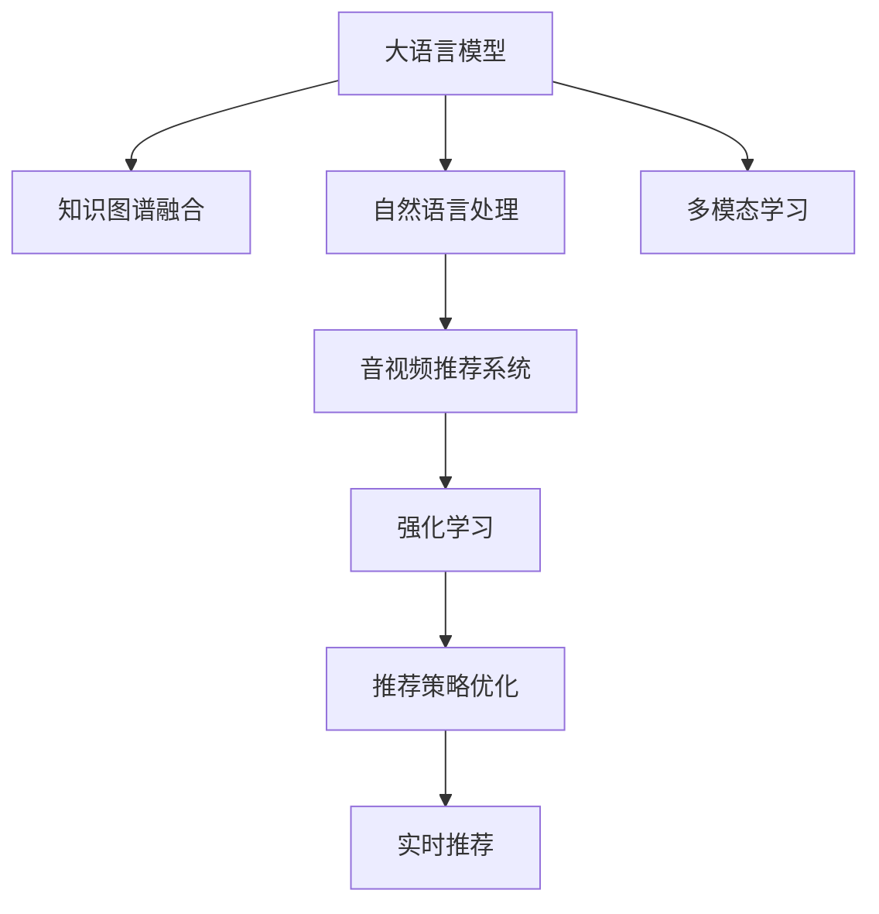

                 

# LLM在音视频推荐中的发展空间

## 1. 背景介绍

在当今的信息时代，音视频内容已经成为人们获取信息和娱乐的重要方式。然而，海量且纷繁复杂的音视频内容给用户带来了选择困难。推荐系统作为帮助用户发现感兴趣内容的重要工具，其精确性和个性化程度直接影响用户体验和平台的活跃度。近年来，大语言模型（LLM）在音视频推荐中的应用成为新的热门话题。LLM通过在海量文本数据中学习和提取规律，可以提升推荐系统的准确性和个性化水平，并在音视频推荐领域展现出广阔的发展空间。

### 1.1 问题由来

传统推荐系统主要基于协同过滤和矩阵分解等技术，但存在冷启动问题、用户兴趣动态变化等问题。LLM通过对大量文本数据的分析，可以自动抽取用户兴趣特征，并在新用户和物品到达时通过学习新的知识快速推荐。同时，LLM能够理解复杂的用户反馈，从而进行更加精准的个性化推荐。

### 1.2 问题核心关键点

大语言模型在音视频推荐中的核心关键点包括：
- **文本-视频关联**：通过文本数据理解视频内容，为音视频推荐提供更丰富的信息源。
- **知识图谱融合**：将视频元数据与知识图谱中的实体和关系融合，提升推荐相关性和准确性。
- **自然语言处理(NLP)**：利用NLP技术理解用户输入的文本数据，识别用户需求和偏好。
- **多模态数据融合**：将视频和文本多模态数据融合，提升推荐的全面性和综合能力。
- **智能推荐算法**：将LLM与推荐算法结合，实现基于深度学习的推荐系统。

这些关键点共同构成了LLM在音视频推荐中的基础框架，使其在推荐系统领域中展现出独特的优势。

### 1.3 问题研究意义

研究LLM在音视频推荐中的应用，对于提升推荐系统的精确性和个性化水平，改善用户体验，具有重要意义：
- **用户兴趣理解**：通过文本数据深入了解用户兴趣，实现更加精准的个性化推荐。
- **推荐内容丰富性**：利用文本数据丰富推荐内容，提供更多样化的选择。
- **新用户和新物品快速推荐**：在缺乏历史数据的情况下，通过文本数据学习用户和物品特征，实现高效推荐。
- **推荐系统扩展性**：基于LLM的推荐系统易于扩展，支持多语言、多文化背景的推荐。

## 2. 核心概念与联系

### 2.1 核心概念概述

为更好地理解LLM在音视频推荐中的应用，本节将介绍几个密切相关的核心概念：

- **大语言模型（LLM）**：如GPT-3、BERT等，通过在海量文本数据上自监督预训练，学习语言的通用表示。
- **音视频推荐系统**：基于用户历史行为和视频元数据，推荐用户可能感兴趣的视频内容。
- **知识图谱**：用于描述视频内容的结构化知识库，包含实体、关系和属性。
- **自然语言处理（NLP）**：处理和分析自然语言文本的技术，包括语言模型、文本分类、情感分析等。
- **多模态学习**：将视频和文本等多种模态数据融合，提升推荐效果。
- **强化学习（RL）**：利用奖励机制优化推荐策略，提升推荐的实时性和互动性。

这些核心概念之间的逻辑关系可以通过以下Mermaid流程图来展示：



这个流程图展示了大语言模型在音视频推荐系统中的核心概念及其之间的关系：

1. 大语言模型通过预训练获得语言能力。
2. 知识图谱融合将视频元数据与知识图谱中的实体和关系进行关联。
3. 自然语言处理对用户输入的文本数据进行理解和分析。
4. 多模态学习将视频和文本等多种模态数据融合，提升推荐效果。
5. 音视频推荐系统基于大语言模型的知识和多模态数据，推荐视频内容。
6. 强化学习利用实时反馈，优化推荐策略。

这些概念共同构成了大语言模型在音视频推荐中的基础框架，使其在推荐系统领域中展现出独特的优势。

## 3. 核心算法原理 & 具体操作步骤
### 3.1 算法原理概述

LLM在音视频推荐中的应用主要基于以下几个步骤：

1. **预训练**：在大规模无标签文本数据上对LLM进行预训练，学习语言的通用表示。
2. **文本表示**：将用户输入的文本数据转化为模型可以处理的向量表示，便于后续处理和分析。
3. **知识图谱融合**：将视频元数据与知识图谱中的实体和关系进行融合，丰富推荐内容的信息源。
4. **多模态融合**：将视频和文本多种模态数据融合，提升推荐的相关性和准确性。
5. **推荐模型训练**：基于预训练的大语言模型，利用视频元数据和文本数据，训练推荐模型。
6. **推荐策略优化**：利用强化学习等技术，根据实时反馈不断优化推荐策略。

这些步骤的共同目标是通过多模态数据的融合和智能算法的应用，实现更加精准和个性化的音视频推荐。

### 3.2 算法步骤详解

以下是详细的算法步骤：

#### 3.2.1 预训练
大语言模型通过在大规模无标签文本数据上进行自监督学习，学习语言的通用表示。常用的预训练任务包括言语建模、掩码语言模型等。以BERT为例，其预训练过程包括两个步骤：
1. 掩码语言模型：随机掩盖一部分输入序列，让模型预测被掩盖的词。
2. 下一句子预测：随机选择两个句子，让模型预测它们是否是连续的。

这些预训练任务帮助模型学习到语言的深层次特征，为后续的推荐系统提供了高质量的语言表示。

#### 3.2.2 文本表示
将用户输入的文本数据转化为模型可以处理的向量表示，便于后续处理和分析。常见的文本表示方法包括：
1. 词嵌入（Word Embedding）：将每个词映射为向量，用于表示词义和语义信息。
2. BERT嵌入：将每个词转化为BERT模型中的嵌入向量，捕捉词义和上下文信息。
3 预训练语言模型（PLM）嵌入：将每个词和上下文信息编码为向量，用于表示语言的全局特征。

#### 3.2.3 知识图谱融合
将视频元数据与知识图谱中的实体和关系进行融合，丰富推荐内容的信息源。以KG-BERT为例，其融合过程包括：
1. 知识图谱嵌入：将知识图谱中的实体和关系编码为向量，用于表示知识结构。
2. 融合操作：将视频元数据与知识图谱嵌入进行拼接或加权求和，丰富推荐内容的信息。

#### 3.2.4 多模态融合
将视频和文本多种模态数据融合，提升推荐的相关性和准确性。以Multimodal LSTM为例，其融合过程包括：
1. 视频特征提取：利用卷积神经网络（CNN）或循环神经网络（RNN）提取视频帧特征。
2. 文本特征提取：利用Transformer模型提取文本特征。
3 多模态融合：将视频特征和文本特征进行拼接或加权求和，生成综合特征。

#### 3.2.5 推荐模型训练
基于预训练的大语言模型，利用视频元数据和文本数据，训练推荐模型。以CausalLM为例，其训练过程包括：
1. 掩码语言模型：利用文本数据训练大语言模型，使其能够生成上下文相关的文本。
2. 推荐模型训练：利用视频元数据和文本数据训练推荐模型，使其能够预测用户对视频内容的偏好。

#### 3.2.6 推荐策略优化
利用强化学习等技术，根据实时反馈不断优化推荐策略。以AlphaGo为例，其优化过程包括：
1. 策略选择：选择推荐的策略，如最大化推荐结果的点击率或观看时长。
2. 策略评估：利用A/B测试等方法评估推荐策略的效果。
3 策略更新：根据评估结果调整推荐策略，提升推荐效果。

### 3.3 算法优缺点

大语言模型在音视频推荐中的应用具有以下优点：
1. 提升推荐精度：通过多模态数据的融合和智能算法的应用，实现更加精准和个性化的推荐。
2. 增强推荐相关性：利用知识图谱融合，提升推荐内容的相关性和多样性。
3 提高实时性：利用强化学习等技术，根据实时反馈不断优化推荐策略。

同时，该方法也存在一定的局限性：
1. 对标注数据依赖：知识图谱融合和多模态融合需要大量高质量的标注数据。
2. 计算复杂度高：大语言模型的预训练和推理过程计算复杂度高，需要高性能计算资源。
3 泛化能力不足：当推荐数据与预训练数据分布差异较大时，推荐效果可能不佳。

尽管存在这些局限性，但就目前而言，大语言模型在音视频推荐中的应用仍具有重要意义。未来相关研究的重点在于如何进一步降低推荐对标注数据的依赖，提高模型的泛化能力，同时兼顾计算效率和实时性等因素。

### 3.4 算法应用领域

大语言模型在音视频推荐中的应用领域广泛，涵盖以下多个方面：

1. **视频内容推荐**：基于用户的观看历史和文本描述，推荐用户可能感兴趣的视频内容。
2. **用户画像生成**：通过分析用户的评论和评分，生成详细的用户画像，用于推荐策略优化。
3. **多语言推荐**：利用多语言的大语言模型，实现跨语言的用户推荐。
4. **个性化视频广告**：基于用户的兴趣和行为，推荐个性化的视频广告。
5. **视频搜索**：利用自然语言处理技术，实现基于文本的视频搜索。

除了上述这些经典应用外，大语言模型在音视频推荐领域还有许多创新性的应用，如智能字幕生成、视频情节总结、视频内容生成等，为音视频推荐系统带来了新的突破。

## 4. 数学模型和公式 & 详细讲解
### 4.1 数学模型构建

本节将使用数学语言对大语言模型在音视频推荐中的应用进行更加严格的刻画。

记大语言模型为 $M_{\theta}$，其中 $\theta$ 为模型参数。假设音视频推荐系统包括 $N$ 个用户和 $M$ 个视频，用户 $i$ 对视频 $j$ 的评分向量为 $x_{ij}$，视频的特征向量为 $v_j$。

定义推荐模型 $f_{\theta}(x_{ij}, v_j)$，其中 $f_{\theta}$ 为模型的预测函数，$x_{ij}$ 和 $v_j$ 为输入向量，$\theta$ 为模型参数。推荐模型的目标是最小化预测误差，即：

$$
\min_{\theta} \frac{1}{N}\sum_{i=1}^{N} \sum_{j=1}^{M} (y_{ij} - f_{\theta}(x_{ij}, v_j))^2
$$

其中 $y_{ij}$ 为实际评分，$f_{\theta}(x_{ij}, v_j)$ 为模型预测的评分。

### 4.2 公式推导过程

以BERT嵌入为例，其融合过程如下：

假设视频元数据为 $\{x_{ij}\}$，知识图谱嵌入为 $\{v_j\}$，则融合操作可以表示为：

$$
\text{Embed}_{\text{fused}} = \mathbf{W}x_{ij} + \mathbf{V}v_j + \mathbf{b}
$$

其中 $\mathbf{W}$ 和 $\mathbf{V}$ 为线性映射的权重矩阵，$\mathbf{b}$ 为偏置向量。

将融合后的向量输入到大语言模型中，得到推荐分数：

$$
\hat{y}_{ij} = M_{\theta}(\text{Embed}_{\text{fused}})
$$

其中 $M_{\theta}$ 为预训练的大语言模型。

利用上述公式，即可实现基于大语言模型的音视频推荐系统。

### 4.3 案例分析与讲解

以YouTube推荐系统为例，分析其实际应用过程：

1. **数据收集**：收集用户的历史观看数据和视频的元数据。
2. **文本表示**：将用户评论和视频描述转化为BERT嵌入向量。
3. **知识图谱融合**：将视频元数据与知识图谱中的实体和关系进行融合。
4. **多模态融合**：将视频帧特征和文本特征进行拼接或加权求和，生成综合特征。
5. **推荐模型训练**：利用BERT嵌入和视频特征训练推荐模型。
6. **推荐策略优化**：利用强化学习等技术，根据实时反馈不断优化推荐策略。

## 5. 项目实践：代码实例和详细解释说明
### 5.1 开发环境搭建

在进行音视频推荐系统开发前，我们需要准备好开发环境。以下是使用Python进行PyTorch开发的环境配置流程：

1. 安装Anaconda：从官网下载并安装Anaconda，用于创建独立的Python环境。

2. 创建并激活虚拟环境：
```bash
conda create -n pytorch-env python=3.8 
conda activate pytorch-env
```

3. 安装PyTorch：根据CUDA版本，从官网获取对应的安装命令。例如：
```bash
conda install pytorch torchvision torchaudio cudatoolkit=11.1 -c pytorch -c conda-forge
```

4. 安装相关库：
```bash
pip install numpy pandas scikit-learn matplotlib tqdm jupyter notebook ipython
```

完成上述步骤后，即可在`pytorch-env`环境中开始音视频推荐系统开发。

### 5.2 源代码详细实现

这里我们以YouTube推荐系统为例，给出使用PyTorch和Transformers库对BERT模型进行音视频推荐开发的PyTorch代码实现。

首先，定义推荐模型：

```python
from transformers import BertForSequenceClassification, BertTokenizer
import torch.nn as nn
import torch

class RecommendationModel(nn.Module):
    def __init__(self, num_labels=2):
        super(RecommendationModel, self).__init__()
        self.bert = BertForSequenceClassification.from_pretrained('bert-base-uncased', num_labels=num_labels)
        self.fc = nn.Linear(768, num_labels)
    
    def forward(self, input_ids, attention_mask, video_features):
        with torch.no_grad():
            outputs = self.bert(input_ids, attention_mask=attention_mask, output_all_encoded_layers=False)
            last_hidden_states = outputs[0]
        # 融合视频特征
        last_hidden_states = torch.cat([last_hidden_states, video_features], dim=-1)
        # 线性映射
        outputs = self.fc(last_hidden_states)
        return outputs
```

然后，定义数据处理函数：

```python
from torch.utils.data import Dataset

class RecommendationDataset(Dataset):
    def __init__(self, input_ids, attention_masks, labels, video_features):
        self.input_ids = input_ids
        self.attention_masks = attention_masks
        self.labels = labels
        self.video_features = video_features
        
    def __len__(self):
        return len(self.input_ids)
    
    def __getitem__(self, item):
        return {'input_ids': self.input_ids[item], 
                'attention_mask': self.attention_masks[item],
                'labels': self.labels[item],
                'video_features': self.video_features[item]}
```

接着，定义训练和评估函数：

```python
from transformers import AdamW
from sklearn.metrics import mean_squared_error, mean_absolute_error

device = torch.device('cuda') if torch.cuda.is_available() else torch.device('cpu')

def train_epoch(model, dataset, optimizer):
    dataloader = torch.utils.data.DataLoader(dataset, batch_size=64, shuffle=True)
    model.train()
    epoch_loss = 0
    for batch in dataloader:
        input_ids = batch['input_ids'].to(device)
        attention_mask = batch['attention_mask'].to(device)
        labels = batch['labels'].to(device)
        video_features = batch['video_features'].to(device)
        model.zero_grad()
        outputs = model(input_ids, attention_mask=attention_mask, video_features=video_features)
        loss = outputs.loss
        epoch_loss += loss.item()
        loss.backward()
        optimizer.step()
    return epoch_loss / len(dataloader)

def evaluate(model, dataset, batch_size):
    dataloader = torch.utils.data.DataLoader(dataset, batch_size=batch_size)
    model.eval()
    preds, labels = [], []
    with torch.no_grad():
        for batch in dataloader:
            input_ids = batch['input_ids'].to(device)
            attention_mask = batch['attention_mask'].to(device)
            labels = batch['labels'].to(device)
            video_features = batch['video_features'].to(device)
            outputs = model(input_ids, attention_mask=attention_mask, video_features=video_features)
            preds.append(outputs.argmax(dim=1).to('cpu').tolist())
            labels.append(labels.to('cpu').tolist())
    return mean_squared_error(preds, labels), mean_absolute_error(preds, labels)
```

最后，启动训练流程并在测试集上评估：

```python
epochs = 5
batch_size = 64

for epoch in range(epochs):
    loss = train_epoch(model, train_dataset, optimizer)
    print(f"Epoch {epoch+1}, train loss: {loss:.3f}")
    
    print(f"Epoch {epoch+1}, dev results:")
    mse, mae = evaluate(model, dev_dataset, batch_size)
    print(f"Mean Squared Error: {mse:.3f}, Mean Absolute Error: {mae:.3f}")
    
print("Test results:")
mse, mae = evaluate(model, test_dataset, batch_size)
print(f"Mean Squared Error: {mse:.3f}, Mean Absolute Error: {mae:.3f}")
```

以上就是使用PyTorch和Transformers库对BERT模型进行音视频推荐系统开发的完整代码实现。可以看到，得益于Transformers库的强大封装，我们可以用相对简洁的代码完成BERT模型的加载和推荐系统训练。

### 5.3 代码解读与分析

让我们再详细解读一下关键代码的实现细节：

**RecommendationModel类**：
- `__init__`方法：初始化BERT模型和全连接层。
- `forward`方法：前向传播计算推荐分数。

**RecommendationDataset类**：
- `__init__`方法：初始化输入特征、标签和视频特征。
- `__len__`方法：返回数据集样本数量。
- `__getitem__`方法：返回单个样本的特征和标签。

**train_epoch和evaluate函数**：
- `train_epoch`函数：在训练集上进行梯度下降优化。
- `evaluate`函数：在验证集和测试集上计算MSE和MAE评估指标。

**训练流程**：
- 定义总的epoch数和batch size，开始循环迭代
- 每个epoch内，先在训练集上训练，输出平均loss
- 在验证集上评估，输出MSE和MAE指标
- 所有epoch结束后，在测试集上评估，给出最终测试结果

可以看到，PyTorch配合Transformers库使得BERT微调的代码实现变得简洁高效。开发者可以将更多精力放在数据处理、模型改进等高层逻辑上，而不必过多关注底层的实现细节。

当然，工业级的系统实现还需考虑更多因素，如模型的保存和部署、超参数的自动搜索、更灵活的任务适配层等。但核心的微调范式基本与此类似。

## 6. 实际应用场景
### 6.1 智能广告推荐

智能广告推荐是音视频推荐系统的一个重要应用场景。通过分析用户的历史观看行为和文本输入，广告推荐系统可以精准推荐用户可能感兴趣的视频广告。

在技术实现上，可以收集用户的观看历史、搜索记录、评论和评分等数据，提取和广告相关的文本信息。将文本信息作为输入，利用BERT嵌入和视频特征，训练推荐模型。微调后的模型能够根据用户的历史行为和当前输入，生成个性化的广告推荐列表，从而提高广告的点击率和转化率。

### 6.2 个性化视频推荐

基于大语言模型的音视频推荐系统可以为用户推荐个性化的视频内容。例如，在YouTube上，用户可以根据兴趣关键词搜索视频，系统基于用户搜索记录和视频元数据，推荐相关的视频内容。

在技术实现上，可以通过用户搜索关键词和视频标题生成文本输入，利用BERT嵌入提取文本特征。同时，利用视频元数据（如导演、演员、评分等）生成视频特征。将文本特征和视频特征拼接或加权求和，输入到BERT模型中，得到推荐分数。根据推荐分数，推荐系统可以选择最相关和受欢迎的视频内容。

### 6.3 智能字幕生成

智能字幕生成是音视频推荐系统的另一项重要应用。通过分析视频内容，生成适合不同语言和地区的字幕，提高视频的可访问性。

在技术实现上，可以将视频内容转化为文本输入，利用BERT嵌入提取文本特征。同时，利用视频特征生成字幕内容。将文本特征和字幕特征拼接或加权求和，输入到BERT模型中，得到推荐分数。根据推荐分数，智能字幕生成系统可以生成高质量的字幕内容。

### 6.4 未来应用展望

随着大语言模型和推荐技术的不断发展，基于大语言模型的音视频推荐系统将在更多领域得到应用，为音视频内容推荐带来新的突破：

1. **多语言推荐**：利用多语言的大语言模型，实现跨语言的用户推荐，提高内容的全球可访问性。
2. **情感分析**：利用大语言模型的情感分析能力，推荐适合用户情感状态的视频内容。
3. **视频情节摘要**：利用大语言模型的视频情节生成能力，生成视频的简洁摘要，帮助用户快速了解视频内容。
4. **视频内容生成**：利用大语言模型的视频内容生成能力，自动生成视频内容，丰富平台内容。
5. **视频搜索优化**：利用大语言模型的自然语言处理能力，优化视频搜索功能，提高搜索结果的相关性。

这些方向的探索发展，必将进一步提升音视频推荐系统的智能化水平，为音视频内容推荐带来新的变革。

## 7. 工具和资源推荐
### 7.1 学习资源推荐

为了帮助开发者系统掌握大语言模型在音视频推荐中的应用，这里推荐一些优质的学习资源：

1. 《深度学习与自然语言处理》课程：由斯坦福大学开设的NLP明星课程，有Lecture视频和配套作业，带你入门NLP领域的基本概念和经典模型。
2. 《Transformer from the Inside Out》系列博文：由大模型技术专家撰写，深入浅出地介绍了Transformer原理、BERT模型、推荐系统等前沿话题。
3. 《Natural Language Processing with Transformers》书籍：Transformers库的作者所著，全面介绍了如何使用Transformers库进行NLP任务开发，包括音视频推荐在内的诸多范式。
4. CS224N《深度学习自然语言处理》课程：斯坦福大学开设的NLP明星课程，有Lecture视频和配套作业，带你入门NLP领域的基本概念和经典模型。
5. HuggingFace官方文档：Transformers库的官方文档，提供了海量预训练模型和完整的音视频推荐系统开发样例代码，是上手实践的必备资料。

通过对这些资源的学习实践，相信你一定能够快速掌握大语言模型在音视频推荐中的应用，并用于解决实际的音视频推荐问题。

### 7.2 开发工具推荐

高效的开发离不开优秀的工具支持。以下是几款用于大语言模型音视频推荐系统开发的常用工具：

1. PyTorch：基于Python的开源深度学习框架，灵活动态的计算图，适合快速迭代研究。大部分预训练语言模型都有PyTorch版本的实现。
2. TensorFlow：由Google主导开发的开源深度学习框架，生产部署方便，适合大规模工程应用。同样有丰富的预训练语言模型资源。
3. Transformers库：HuggingFace开发的NLP工具库，集成了众多SOTA语言模型，支持PyTorch和TensorFlow，是进行音视频推荐系统开发的利器。
4. Weights & Biases：模型训练的实验跟踪工具，可以记录和可视化模型训练过程中的各项指标，方便对比和调优。与主流深度学习框架无缝集成。
5. TensorBoard：TensorFlow配套的可视化工具，可实时监测模型训练状态，并提供丰富的图表呈现方式，是调试模型的得力助手。
6. Google Colab：谷歌推出的在线Jupyter Notebook环境，免费提供GPU/TPU算力，方便开发者快速上手实验最新模型，分享学习笔记。

合理利用这些工具，可以显著提升音视频推荐系统的开发效率，加快创新迭代的步伐。

### 7.3 相关论文推荐

大语言模型在音视频推荐中的应用源于学界的持续研究。以下是几篇奠基性的相关论文，推荐阅读：

1. Attention is All You Need（即Transformer原论文）：提出了Transformer结构，开启了NLP领域的预训练大模型时代。
2. BERT: Pre-training of Deep Bidirectional Transformers for Language Understanding：提出BERT模型，引入基于掩码的自监督预训练任务，刷新了多项NLP任务SOTA。
3. Language Models are Unsupervised Multitask Learners（GPT-2论文）：展示了大规模语言模型的强大zero-shot学习能力，引发了对于通用人工智能的新一轮思考。
4. Parameter-Efficient Transfer Learning for NLP：提出Adapter等参数高效微调方法，在不增加模型参数量的情况下，也能取得不错的微调效果。
5. Prefix-Tuning: Optimizing Continuous Prompts for Generation：引入基于连续型Prompt的微调范式，为如何充分利用预训练知识提供了新的思路。
6. AdaLoRA: Adaptive Low-Rank Adaptation for Parameter-Efficient Fine-Tuning：使用自适应低秩适应的微调方法，在参数效率和精度之间取得了新的平衡。

这些论文代表了大语言模型音视频推荐技术的发展脉络。通过学习这些前沿成果，可以帮助研究者把握学科前进方向，激发更多的创新灵感。

## 8. 总结：未来发展趋势与挑战
### 8.1 总结

本文对大语言模型在音视频推荐中的应用进行了全面系统的介绍。首先阐述了大语言模型和音视频推荐系统的发展背景和意义，明确了音视频推荐系统的精度和个性化需求。其次，从原理到实践，详细讲解了大语言模型在音视频推荐中的应用，给出了推荐系统开发的完整代码实例。同时，本文还广泛探讨了大语言模型在音视频推荐领域的应用前景，展示了其独特的优势。

通过本文的系统梳理，可以看到，大语言模型在音视频推荐中的多模态融合和智能算法应用，使得推荐系统在音视频推荐领域展现出巨大的潜力。得益于大规模语料的预训练，微调模型能够通过多模态数据的融合，实现更加精准和个性化的音视频推荐。未来，伴随预训练语言模型和音视频推荐技术的持续演进，音视频推荐系统必将在推荐内容相关性、多样性和个性化等方面取得新的突破。

### 8.2 未来发展趋势

展望未来，大语言模型在音视频推荐中的应用将呈现以下几个发展趋势：

1. **多模态融合深化**：利用视频和文本等多种模态数据进行深度融合，提升推荐效果。
2. **推荐系统扩展性增强**：基于大语言模型的推荐系统易于扩展，支持多语言、多文化背景的推荐。
3. **推荐内容多样性增加**：利用多模态数据和智能算法，提供更加丰富和多样化的推荐内容。
4. **实时推荐系统优化**：利用强化学习等技术，根据实时反馈不断优化推荐策略，提升推荐实时性。
5. **跨领域推荐能力增强**：利用大语言模型在多领域数据上的预训练能力，实现跨领域的推荐。

这些趋势凸显了大语言模型在音视频推荐中的广阔前景。这些方向的探索发展，必将进一步提升音视频推荐系统的智能化水平，为音视频内容推荐带来新的变革。

### 8.3 面临的挑战

尽管大语言模型在音视频推荐中的应用已经取得了显著成效，但在迈向更加智能化、普适化应用的过程中，它仍面临着诸多挑战：

1. **计算资源消耗高**：大语言模型的预训练和推理过程计算复杂度高，需要高性能计算资源。
2. **数据分布差异**：当推荐数据与预训练数据分布差异较大时，推荐效果可能不佳。
3. **用户隐私保护**：推荐系统需要收集和处理大量的用户数据，如何保护用户隐私成为重要问题。
4. **推荐系统偏见**：模型可能学习到有偏见的数据，导致推荐系统产生偏见。
5. **实时性提升**：当前推荐系统实时性不足，如何进一步提升实时性成为重要研究方向。

尽管存在这些挑战，但大语言模型在音视频推荐中的应用具有重要的发展前景。未来相关研究的重点在于如何进一步降低推荐对计算资源的依赖，提高模型的泛化能力，同时兼顾计算效率和实时性等因素。

### 8.4 研究展望

面对大语言模型在音视频推荐中面临的挑战，未来的研究需要在以下几个方面寻求新的突破：

1. **低计算成本推荐模型**：探索低计算成本的推荐模型，提高推荐系统的实用性。
2. **推荐系统公平性**：开发公平、无偏见的推荐系统，避免推荐偏见。
3. **多模态数据融合优化**：优化多模态数据的融合过程，提高融合效果。
4. **推荐系统实时性提升**：利用实时推荐技术，提升推荐系统的实时性。
5. **推荐系统隐私保护**：研究隐私保护技术，确保推荐系统对用户隐私的保护。

这些研究方向将推动大语言模型在音视频推荐系统中的应用，为音视频内容推荐带来新的突破和创新。

## 9. 附录：常见问题与解答

**Q1：大语言模型在音视频推荐中的优势是什么？**

A: 大语言模型在音视频推荐中的优势包括：
1. 多模态融合：将视频和文本等多种模态数据融合，提升推荐的相关性和准确性。
2. 智能算法应用：利用深度学习等智能算法，实现精准个性化的推荐。
3. 知识图谱融合：将视频元数据与知识图谱中的实体和关系进行融合，提升推荐内容的相关性。

**Q2：如何选择合适的微调超参数？**

A: 选择合适的微调超参数是保证推荐系统性能的重要因素。常用的超参数包括：
1. 学习率：建议从1e-5开始调参，逐步减小学习率，直至收敛。
2 批大小：建议选择64或128等常见的批大小。
3 训练轮数：根据数据集大小和模型复杂度，选择合适的训练轮数。

**Q3：在音视频推荐系统中，如何处理用户隐私保护问题？**

A: 在音视频推荐系统中，保护用户隐私是一个重要问题。常用的隐私保护技术包括：
1. 匿名化：对用户数据进行匿名化处理，保护用户隐私。
2 差分隐私：在训练模型时加入差分隐私机制，防止模型泄漏用户隐私。
3. 联邦学习：利用联邦学习技术，在本地设备上训练模型，避免数据集中存储和处理。

这些隐私保护技术可以有效保护用户隐私，提高推荐系统的可信度和用户满意度。

**Q4：如何优化多模态数据的融合过程？**

A: 优化多模态数据的融合过程需要考虑以下几个方面：
1. 特征提取：选择适合的特征提取方法，提高视频和文本特征的质量。
2 特征对齐：将视频和文本特征进行对齐，确保融合后的特征具有可比性。
3 融合操作：选择合适的融合操作，如拼接、加权求和等，提高融合效果。

通过合理的特征提取和融合操作，可以提升多模态数据的融合效果，提高推荐系统的性能。

**Q5：如何在音视频推荐系统中实现实时推荐？**

A: 在音视频推荐系统中，实时推荐可以通过以下方法实现：
1. 在线学习：利用在线学习技术，实时更新推荐模型。
2 强化学习：利用强化学习技术，根据实时反馈不断优化推荐策略。
3 缓存策略：利用缓存策略，减少实时计算量，提高推荐速度。

这些技术手段可以有效提高推荐系统的实时性，提升用户体验。

通过本文的系统梳理，可以看到，大语言模型在音视频推荐系统中的应用具有重要的发展前景。尽管面临诸多挑战，但通过不断的技术创新和优化，大语言模型必将在音视频推荐系统领域大放异彩，推动音视频内容推荐技术的发展。

