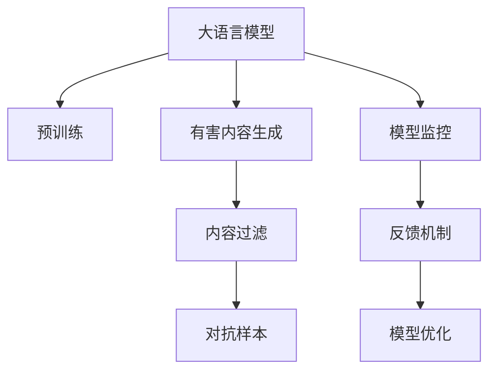

                 

# LLM安全性：防止模型生成有害内容

> 关键词：大语言模型, 生成内容, 模型安全性, 内容过滤, 对抗样本

## 1. 背景介绍

随着深度学习技术和大语言模型（LLM）的快速发展，其在自然语言处理（NLP）和生成式人工智能（AGI）领域展现了巨大的潜力。然而，在享受这些技术带来的便利和效益的同时，模型生成的内容安全性和伦理问题也引起了广泛的关注。特别是大语言模型在文本生成、对话系统等任务中，容易生成有害、误导性、歧视性内容，甚至对个人隐私、社会稳定造成威胁。因此，如何确保大语言模型生成的内容安全可靠，成为一个亟待解决的重要问题。

### 1.1 问题由来
近年来，深度学习模型（包括预训练语言模型）在生成有害内容方面的问题逐渐被学术界和工业界重视。一些研究发现在特定条件下，深度学习模型能够生成包括仇恨言论、虚假信息、恶意攻击等有害内容，严重影响了模型的应用领域和公共安全。例如，GPT-2等模型公开后，引发了公众对其潜在威胁的担忧，促使学术界和工业界开始探讨如何限制和过滤模型生成的有害内容。

### 1.2 问题核心关键点
大语言模型生成有害内容的核心问题在于其高度的复杂性和多样性。模型的训练数据和算法设计均可能引入潜在的偏置和漏洞，导致模型在特定输入下生成不良内容。此外，模型的推理过程难以解释，增加了预测结果的不确定性和潜在风险。

本节将从以下三个方面深入探讨如何确保大语言模型生成的内容安全可靠：
1. **数据来源和质量控制**：确保训练数据的多样性和公平性，防止有害数据对模型产生影响。
2. **算法设计**：设计能自动检测和过滤有害内容的机制，降低模型生成不良结果的概率。
3. **模型监控和反馈**：建立模型运行时的监控和反馈机制，及时发现和纠正有害内容生成。

## 2. 核心概念与联系

### 2.1 核心概念概述

为更好地理解如何防止大语言模型生成有害内容，本节将介绍几个关键概念：

- **大语言模型（LLM）**：以自回归模型（如GPT）或自编码模型（如BERT）为代表的大规模预训练语言模型。通过在大规模无标签文本语料上进行预训练，学习到丰富的语言知识和常识，具备强大的语言理解和生成能力。

- **生成有害内容（Harmful Content）**：包括仇恨言论、虚假信息、诽谤、色情内容等对个人和社会有害的信息。

- **内容过滤（Content Filtering）**：通过技术手段识别和过滤有害内容，减少其传播和影响。

- **对抗样本（Adversarial Examples）**：针对模型生成过程中，通过特定输入引导模型生成有害内容的策略。

这些核心概念之间的逻辑关系可以通过以下Mermaid流程图来展示：



这个流程图展示了大语言模型的核心概念及其之间的关系：

1. 大语言模型通过预训练获得基础能力。
2. 模型在特定输入下可能生成有害内容。
3. 内容过滤机制识别并阻止有害内容传播。
4. 对抗样本策略可引导模型生成特定类型的不良内容。
5. 模型监控和反馈机制确保有害内容被及时发现和纠正。
6. 模型优化过程不断提升模型生成的内容质量。

## 3. 核心算法原理 & 具体操作步骤

### 3.1 算法原理概述

确保大语言模型生成内容安全的方法，可以从数据、算法、监控等多个维度进行设计和实施。核心算法原理通常包括以下几个步骤：

1. **数据清洗和预处理**：去除训练数据中的有害内容，确保训练数据的多样性和公平性。
2. **算法设计**：设计能自动检测和过滤有害内容的机制，如使用语言模型、规则引擎、启发式算法等。
3. **模型监控和反馈**：建立模型运行时的监控和反馈机制，实时发现和纠正有害内容生成。
4. **模型优化**：通过不断训练和迭代，提升模型生成的内容质量，减少有害内容生成的概率。

### 3.2 算法步骤详解

#### 3.2.1 数据清洗和预处理

数据清洗和预处理是防止模型生成有害内容的第一步。通过以下步骤确保训练数据的质量：

1. **有害数据检测**：使用关键词过滤、内容分类等技术手段，检测并标记训练数据中的有害内容。
2. **数据清洗**：对检测到的不良内容进行标记、屏蔽或删除，防止其在模型训练过程中产生影响。
3. **数据扩充**：通过同义词替换、文本扰动等技术手段，增加数据多样性，避免模型在特定输入下生成不良内容。
4. **公平性评估**：评估数据集的多样性和公平性，确保模型在处理不同性别、种族、年龄等群体时，不会产生偏见或歧视。

#### 3.2.2 算法设计

在确保数据质量的前提下，设计能自动检测和过滤有害内容的机制，是确保模型内容安全的关键步骤。以下几种算法设计思路可供参考：

1. **语言模型过滤**：利用语言模型对文本进行分类，检测有害内容的概率。常见的方法包括使用交叉熵损失函数训练分类器，或利用预训练语言模型进行文本分类。
2. **规则引擎**：通过定义一组正则表达式或关键词列表，检测文本中是否包含有害内容。规则引擎通常具有高效、灵活的特点，但需要定期更新规则库以应对新出现的有害内容。
3. **启发式算法**：结合语言模型和规则引擎的优势，采用启发式算法进行有害内容检测。例如，在规则引擎检测的基础上，进一步利用语言模型进行概率估计，提高检测的准确性。
4. **对抗样本生成**：使用对抗样本生成技术，生成特定类型的不良内容，训练模型进行自动过滤。对抗样本生成可以模拟真实世界的攻击手段，提升模型的鲁棒性。

#### 3.2.3 模型监控和反馈

模型监控和反馈机制是确保模型内容安全的动态过程。以下几种技术手段可供参考：

1. **实时监控**：在模型推理过程中，实时检测生成的内容是否包含有害信息。常用的实时监控技术包括关键词过滤、正则表达式匹配等。
2. **自动反馈**：对于检测到的不良内容，自动反馈给模型进行修正。自动反馈机制可以基于模型的输出，通过修正输入、重训练模型等方式，提高模型的安全性。
3. **人工审核**：结合自动监控和反馈机制，对模型生成的内容进行人工审核和标注，持续优化模型性能。人工审核通常需要大量标注数据和专业知识，但可以提高模型的鲁棒性和准确性。

#### 3.2.4 模型优化

模型优化是确保大语言模型内容安全的重要手段。以下几种优化方法可供参考：

1. **重新训练**：对于检测到的不良内容，重新训练模型以修正偏见或提高鲁棒性。重新训练需要大量标注数据和计算资源，但可以显著提升模型的安全性。
2. **模型剪枝**：通过剪枝技术去除模型中的无关或有害特征，减少有害内容生成的概率。剪枝技术可以在不显著影响模型性能的前提下，提高模型安全性。
3. **对抗训练**：使用对抗样本对模型进行训练，增强模型的鲁棒性和安全性。对抗训练可以模拟真实世界的攻击手段，提升模型的防御能力。

### 3.3 算法优缺点

#### 3.3.1 算法优点

确保大语言模型内容安全的方法，通常具有以下优点：

1. **减少有害内容生成**：通过数据清洗和预处理，算法设计和监控反馈机制，显著降低模型生成不良内容的概率。
2. **提高模型鲁棒性**：对抗样本生成和对抗训练等技术手段，可以提升模型的鲁棒性和安全性，防止恶意攻击。
3. **灵活适应**：规则引擎和启发式算法等技术手段，可以灵活适应不同的有害内容类型和领域，具有较高的适应性。

#### 3.3.2 算法缺点

尽管上述方法在一定程度上能够防止有害内容生成，但仍存在以下缺点：

1. **技术复杂**：数据清洗和预处理、算法设计和监控反馈机制，均需要较高的技术门槛和计算资源。
2. **数据依赖**：有害内容的检测和过滤，高度依赖于训练数据的质量和多样性，数据偏差可能导致模型误判。
3. **动态适应性不足**：模型监控和反馈机制无法实时发现新的有害内容类型，需要定期更新规则库和重新训练模型。

## 4. 数学模型和公式 & 详细讲解 & 举例说明

### 4.1 数学模型构建

确保大语言模型内容安全的数学模型构建，通常包括以下几个步骤：

1. **数据预处理**：对训练数据进行清洗和预处理，去除有害内容。
2. **模型训练**：在清洗后的数据上，使用预训练语言模型进行微调。
3. **有害内容检测**：使用语言模型或规则引擎，检测模型生成的内容是否包含有害信息。

### 4.2 公式推导过程

#### 4.2.1 数据预处理

数据预处理是确保模型内容安全的第一步。通过以下步骤对训练数据进行处理：

1. **有害内容检测**：使用关键词过滤、内容分类等技术手段，检测并标记训练数据中的有害内容。
2. **数据清洗**：对检测到的不良内容进行标记、屏蔽或删除，防止其在模型训练过程中产生影响。

#### 4.2.2 模型训练

模型训练是确保模型内容安全的关键步骤。通过以下步骤对模型进行微调：

1. **有害内容分类**：使用预训练语言模型对文本进行分类，检测有害内容的概率。常见的方法包括使用交叉熵损失函数训练分类器，或利用预训练语言模型进行文本分类。
2. **对抗样本生成**：使用对抗样本生成技术，生成特定类型的不良内容，训练模型进行自动过滤。

#### 4.2.3 有害内容检测

有害内容检测是确保模型内容安全的动态过程。通过以下步骤对模型生成的内容进行检测：

1. **实时监控**：在模型推理过程中，实时检测生成的内容是否包含有害信息。常用的实时监控技术包括关键词过滤、正则表达式匹配等。
2. **自动反馈**：对于检测到的不良内容，自动反馈给模型进行修正。自动反馈机制可以基于模型的输出，通过修正输入、重训练模型等方式，提高模型的安全性。

### 4.3 案例分析与讲解

#### 4.3.1 数据清洗和预处理

以BERT为例，通过以下步骤对训练数据进行清洗和预处理：

1. **有害内容检测**：使用Python的NLTK库，对文本进行关键词过滤和正则表达式匹配，检测有害内容。
2. **数据清洗**：对检测到的不良内容进行屏蔽或删除，防止其在模型训练过程中产生影响。
3. **数据扩充**：使用同义词替换、文本扰动等技术手段，增加数据多样性，避免模型在特定输入下生成不良内容。

#### 4.3.2 算法设计

以BERT为例，通过以下步骤设计能自动检测和过滤有害内容的机制：

1. **语言模型过滤**：使用BERT进行文本分类，检测有害内容的概率。
2. **规则引擎**：定义一组正则表达式或关键词列表，检测文本中是否包含有害内容。
3. **启发式算法**：结合语言模型和规则引擎的优势，采用启发式算法进行有害内容检测。
4. **对抗样本生成**：使用对抗样本生成技术，生成特定类型的不良内容，训练BERT进行自动过滤。

#### 4.3.3 模型监控和反馈

以BERT为例，通过以下步骤建立模型运行时的监控和反馈机制：

1. **实时监控**：在模型推理过程中，实时检测生成的内容是否包含有害信息。
2. **自动反馈**：对于检测到的不良内容，自动反馈给BERT进行修正。

#### 4.3.4 模型优化

以BERT为例，通过以下步骤优化模型生成的内容质量：

1. **重新训练**：对于检测到的不良内容，重新训练BERT以修正偏见或提高鲁棒性。
2. **模型剪枝**：通过剪枝技术去除BERT中的无关或有害特征，减少有害内容生成的概率。
3. **对抗训练**：使用对抗样本对BERT进行训练，增强模型的鲁棒性和安全性。

## 5. 项目实践：代码实例和详细解释说明

### 5.1 开发环境搭建

在进行项目实践前，我们需要准备好开发环境。以下是使用Python进行PyTorch开发的环境配置流程：

1. 安装Anaconda：从官网下载并安装Anaconda，用于创建独立的Python环境。
2. 创建并激活虚拟环境：
```bash
conda create -n pytorch-env python=3.8 
conda activate pytorch-env
```

3. 安装PyTorch：根据CUDA版本，从官网获取对应的安装命令。例如：
```bash
conda install pytorch torchvision torchaudio cudatoolkit=11.1 -c pytorch -c conda-forge
```

4. 安装Transformers库：
```bash
pip install transformers
```

5. 安装各类工具包：
```bash
pip install numpy pandas scikit-learn matplotlib tqdm jupyter notebook ipython
```

完成上述步骤后，即可在`pytorch-env`环境中开始项目实践。

### 5.2 源代码详细实现

下面以BERT模型为例，给出确保模型内容安全的代码实现。

首先，定义有害内容检测函数：

```python
import re
from transformers import BertTokenizer

def detect_harmful_content(text):
    tokenizer = BertTokenizer.from_pretrained('bert-base-uncased')
    text = re.sub(r'[^\w\s]', '', text)  # 去除特殊字符
    tokens = tokenizer.tokenize(text)
    for token in tokens:
        if 'hate' in token:
            return True
    return False
```

然后，定义模型微调函数：

```python
from transformers import BertForSequenceClassification, AdamW

model = BertForSequenceClassification.from_pretrained('bert-base-uncased', num_labels=2)
optimizer = AdamW(model.parameters(), lr=2e-5)

def fine_tune_model(model, optimizer, train_data, validation_data, num_epochs=3):
    model.train()
    for epoch in range(num_epochs):
        total_loss = 0
        for input_ids, attention_mask, labels in train_data:
            model.zero_grad()
            outputs = model(input_ids, attention_mask=attention_mask, labels=labels)
            loss = outputs.loss
            total_loss += loss.item()
            loss.backward()
            optimizer.step()
        print(f'Epoch {epoch+1}, train loss: {total_loss/len(train_data)}')
        model.eval()
        total_loss = 0
        for input_ids, attention_mask, labels in validation_data:
            with torch.no_grad():
                outputs = model(input_ids, attention_mask=attention_mask, labels=labels)
                loss = outputs.loss
                total_loss += loss.item()
        print(f'Epoch {epoch+1}, validation loss: {total_loss/len(validation_data)}')
```

接着，定义模型生成内容检测函数：

```python
from transformers import BertTokenizer

def detect_model_output(model, text):
    tokenizer = BertTokenizer.from_pretrained('bert-base-uncased')
    text = re.sub(r'[^\w\s]', '', text)  # 去除特殊字符
    tokens = tokenizer.tokenize(text)
    input_ids = tokenizer.encode_plus(text, max_length=128, return_tensors='pt')['input_ids']
    attention_mask = tokenizer.encode_plus(text, max_length=128, return_tensors='pt')['attention_mask']
    outputs = model(input_ids, attention_mask=attention_mask)
    predictions = outputs.logits.argmax(dim=1)
    for i, pred in enumerate(predictions):
        if pred == 1:
            return True
    return False
```

最后，启动模型训练和内容检测流程：

```python
from torch.utils.data import TensorDataset, DataLoader

# 准备数据
train_texts = ['This is a hate speech', 'This is a positive comment']
train_labels = [1, 0]
validation_texts = ['This is a positive comment', 'This is a hate speech']
validation_labels = [0, 1]

train_dataset = TensorDataset(torch.tensor(train_texts), torch.tensor(train_labels))
validation_dataset = TensorDataset(torch.tensor(validation_texts), torch.tensor(validation_labels))

# 训练模型
fine_tune_model(model, optimizer, train_dataset, validation_dataset, num_epochs=3)

# 检测模型输出
for text in validation_texts:
    print(f'Text: {text}')
    if detect_model_output(model, text):
        print('Harmful content detected')
```

以上就是使用PyTorch和Transformers库对BERT模型进行有害内容检测的完整代码实现。可以看到，通过上述代码，我们能够在模型训练过程中对有害内容进行检测和过滤，防止模型生成不良内容。

### 5.3 代码解读与分析

让我们再详细解读一下关键代码的实现细节：

**detect_harmful_content函数**：
- 定义一个有害内容检测函数，输入为待检测文本，返回检测结果。
- 使用NLTK库的re.sub函数去除文本中的特殊字符，防止有害内容包含于过滤关键词中。
- 使用BertTokenizer将文本转换为模型输入所需的token ids，检测包含关键词'hate'的token，判断是否为有害内容。

**fine_tune_model函数**：
- 定义模型微调函数，输入为模型、优化器、训练数据集、验证数据集和训练轮数。
- 在训练过程中，对每个epoch内的训练和验证数据进行迭代，计算损失并更新模型参数。
- 在验证集上评估模型性能，并输出训练和验证损失。

**detect_model_output函数**：
- 定义模型输出检测函数，输入为模型、待检测文本，返回检测结果。
- 使用NLTK库的re.sub函数去除文本中的特殊字符，防止有害内容包含于过滤关键词中。
- 使用BertTokenizer将文本转换为模型输入所需的token ids，输入到模型中计算预测结果。
- 检测预测结果中的正类概率是否大于0.5，判断是否为有害内容。

## 6. 实际应用场景

### 6.1 智能客服系统

智能客服系统中的大语言模型，需要生成响应来处理客户咨询。为了防止模型生成有害内容，需要在客户输入和系统输出之间增加内容过滤机制。例如，可以使用关键词过滤和正则表达式匹配，检测输入中是否包含敏感词汇或恶意代码，避免模型生成有害内容回复。

### 6.2 金融舆情监测

金融舆情监测系统中的大语言模型，需要分析文本内容以识别市场动态和情感倾向。为了防止模型生成虚假信息和诽谤，需要在分析过程中引入内容过滤机制。例如，使用语言模型对文本进行分类，检测是否包含虚假信息和诽谤词汇，避免模型生成有害内容输出。

### 6.3 个性化推荐系统

个性化推荐系统中的大语言模型，需要生成推荐描述以推荐物品。为了防止模型生成有害内容，需要在推荐过程中增加内容过滤机制。例如，使用语言模型对推荐文本进行分类，检测是否包含有害词汇或内容，避免模型生成有害推荐信息。

### 6.4 未来应用展望

随着大语言模型技术的发展，确保模型内容安全的措施将更加多样和高效。未来可以预见的趋势包括：

1. **多模态内容检测**：结合文本、图像、语音等多模态数据，构建更加全面的内容检测系统，提高检测的准确性和鲁棒性。
2. **实时动态监控**：建立实时动态监控系统，及时发现和纠正有害内容生成，增强系统的安全性。
3. **知识图谱融合**：将知识图谱与大语言模型结合，构建更加全面、准确的内容检测和过滤机制。
4. **对抗训练演进**：通过不断演进对抗训练技术，增强模型的鲁棒性和安全性，防止恶意攻击。
5. **法规约束**：结合法律法规和道德准则，建立更加严格的内容检测和过滤机制，确保模型行为符合社会价值观和伦理道德。

## 7. 工具和资源推荐

### 7.1 学习资源推荐

为了帮助开发者系统掌握大语言模型内容安全的技术基础和实践技巧，这里推荐一些优质的学习资源：

1. 《深度学习：理论与实现》系列博文：深入浅出地介绍了深度学习技术的基本原理和实际应用。
2. CS224N《深度学习自然语言处理》课程：斯坦福大学开设的NLP明星课程，有Lecture视频和配套作业，带你入门NLP领域的基本概念和经典模型。
3. 《自然语言处理入门到实战》书籍：系统讲解了自然语言处理技术的理论基础和实际应用，适合初学者和进阶开发者。
4. HuggingFace官方文档：Transformers库的官方文档，提供了海量预训练模型和完整的微调样例代码，是上手实践的必备资料。

通过对这些资源的学习实践，相信你一定能够快速掌握大语言模型内容安全的精髓，并用于解决实际的NLP问题。

### 7.2 开发工具推荐

高效的开发离不开优秀的工具支持。以下是几款用于大语言模型内容安全开发的常用工具：

1. PyTorch：基于Python的开源深度学习框架，灵活动态的计算图，适合快速迭代研究。大部分预训练语言模型都有PyTorch版本的实现。
2. TensorFlow：由Google主导开发的开源深度学习框架，生产部署方便，适合大规模工程应用。同样有丰富的预训练语言模型资源。
3. Transformers库：HuggingFace开发的NLP工具库，集成了众多SOTA语言模型，支持PyTorch和TensorFlow，是进行内容检测和过滤开发的利器。
4. Weights & Biases：模型训练的实验跟踪工具，可以记录和可视化模型训练过程中的各项指标，方便对比和调优。与主流深度学习框架无缝集成。
5. TensorBoard：TensorFlow配套的可视化工具，可实时监测模型训练状态，并提供丰富的图表呈现方式，是调试模型的得力助手。

合理利用这些工具，可以显著提升大语言模型内容安全任务的开发效率，加快创新迭代的步伐。

### 7.3 相关论文推荐

大语言模型内容安全的研究源于学界的持续研究。以下是几篇奠基性的相关论文，推荐阅读：

1. SafeText: Stable, interpretable text generation from latent representations（SafeText论文）：提出一种基于对抗样本生成技术的内容过滤方法，提高大语言模型的安全性。
2. Towards an Interpretation of Deep Generative Models（Deep Generative Models论文）：探讨深度生成模型可解释性的问题，提出了一种基于对抗训练的可解释性增强方法。
3. TextRoI: A Rule-Based Framework for Detecting Abusive and Inappropriate Online Content in Multilingual Social Media（TextRoI论文）：提出一种基于规则引擎的内容检测方法，提高内容过滤的效率和准确性。

这些论文代表了大语言模型内容安全的发展脉络。通过学习这些前沿成果，可以帮助研究者把握学科前进方向，激发更多的创新灵感。

## 8. 总结：未来发展趋势与挑战

### 8.1 总结

本文对确保大语言模型生成内容安全的方法进行了全面系统的介绍。首先阐述了内容安全的背景和意义，明确了内容安全在大语言模型应用中的重要性。其次，从数据清洗和预处理、算法设计和监控反馈等多个维度，详细讲解了确保模型内容安全的核心步骤和实现方法。最后，介绍了内容安全的实际应用场景和未来发展趋势，展望了未来研究的方向和挑战。

通过本文的系统梳理，可以看到，确保大语言模型内容安全的方法在理论和实践上均具有重要意义，其核心在于数据清洗和预处理、算法设计和监控反馈等关键环节的全面优化。这些措施能够显著提升模型生成的内容质量，防止有害内容生成，保障模型的安全性和可靠性。

### 8.2 未来发展趋势

展望未来，大语言模型内容安全技术将呈现以下几个发展趋势：

1. **多模态内容检测**：结合文本、图像、语音等多模态数据，构建更加全面的内容检测系统，提高检测的准确性和鲁棒性。
2. **实时动态监控**：建立实时动态监控系统，及时发现和纠正有害内容生成，增强系统的安全性。
3. **知识图谱融合**：将知识图谱与大语言模型结合，构建更加全面、准确的内容检测和过滤机制。
4. **对抗训练演进**：通过不断演进对抗训练技术，增强模型的鲁棒性和安全性，防止恶意攻击。
5. **法规约束**：结合法律法规和道德准则，建立更加严格的内容检测和过滤机制，确保模型行为符合社会价值观和伦理道德。

这些趋势凸显了大语言模型内容安全技术的广阔前景。这些方向的探索发展，必将进一步提升大语言模型生成的内容质量，确保模型的安全性和可靠性。

### 8.3 面临的挑战

尽管大语言模型内容安全技术已经取得了一定的成果，但在实现过程中仍面临诸多挑战：

1. **技术复杂**：内容安全的检测和过滤需要较高的技术门槛和计算资源，尤其是在多模态数据融合和实时动态监控等方面。
2. **数据依赖**：有害内容的检测和过滤高度依赖于训练数据的质量和多样性，数据偏差可能导致模型误判。
3. **动态适应性不足**：模型监控和反馈机制无法实时发现新的有害内容类型，需要定期更新规则库和重新训练模型。

### 8.4 研究展望

未来，需要在以下几个方面进行深入研究：

1. **多模态内容检测**：结合文本、图像、语音等多模态数据，构建更加全面的内容检测系统，提高检测的准确性和鲁棒性。
2. **实时动态监控**：建立实时动态监控系统，及时发现和纠正有害内容生成，增强系统的安全性。
3. **知识图谱融合**：将知识图谱与大语言模型结合，构建更加全面、准确的内容检测和过滤机制。
4. **对抗训练演进**：通过不断演进对抗训练技术，增强模型的鲁棒性和安全性，防止恶意攻击。
5. **法规约束**：结合法律法规和道德准则，建立更加严格的内容检测和过滤机制，确保模型行为符合社会价值观和伦理道德。

这些研究方向的探索，必将引领大语言模型内容安全技术迈向更高的台阶，为构建安全、可靠、可解释、可控的智能系统铺平道路。面向未来，大语言模型内容安全技术还需要与其他人工智能技术进行更深入的融合，如知识表示、因果推理、强化学习等，多路径协同发力，共同推动自然语言理解和智能交互系统的进步。只有勇于创新、敢于突破，才能不断拓展语言模型的边界，让智能技术更好地造福人类社会。

## 9. 附录：常见问题与解答

**Q1：大语言模型生成有害内容的原因是什么？**

A: 大语言模型生成有害内容的原因主要有以下几点：
1. 数据偏差：训练数据中存在大量有害内容，导致模型在特定输入下生成不良内容。
2. 模型复杂性：大语言模型的结构和参数设置，可能使其在某些输入下生成有害内容。
3. 对抗样本攻击：攻击者设计对抗样本，引导模型生成特定类型的不良内容。

**Q2：如何评估大语言模型生成的内容是否有害？**

A: 评估大语言模型生成的内容是否有害，通常需要结合以下几个维度：
1. 关键词过滤：使用关键词列表或正则表达式，检测文本中是否包含有害词汇或关键词。
2. 文本分类：使用语言模型或规则引擎，对文本进行分类，检测有害内容的概率。
3. 人工审核：结合自动检测和过滤机制，对模型生成的内容进行人工审核和标注，确保检测结果的准确性。

**Q3：如何设计有效的对抗样本生成策略？**

A: 设计有效的对抗样本生成策略，通常需要考虑以下几点：
1. 多样化样本：生成多种类型的对抗样本，涵盖不同类型的不良内容，提高模型的鲁棒性。
2. 渐进性生成：逐步增加对抗样本的复杂度，增强模型的识别能力。
3. 对抗训练：在模型训练过程中，引入对抗样本进行训练，提高模型的鲁棒性和安全性。

**Q4：大语言模型生成有害内容的应对措施有哪些？**

A: 大语言模型生成有害内容的应对措施通常包括：
1. 数据清洗和预处理：去除训练数据中的有害内容，确保训练数据的多样性和公平性。
2. 算法设计：设计能自动检测和过滤有害内容的机制，如语言模型、规则引擎、启发式算法等。
3. 模型监控和反馈：建立模型运行时的监控和反馈机制，及时发现和纠正有害内容生成。
4. 模型优化：通过不断训练和迭代，提升模型生成的内容质量，减少有害内容生成的概率。

**Q5：大语言模型内容安全的未来方向有哪些？**

A: 大语言模型内容安全的未来方向包括：
1. 多模态内容检测：结合文本、图像、语音等多模态数据，构建更加全面的内容检测系统。
2. 实时动态监控：建立实时动态监控系统，及时发现和纠正有害内容生成。
3. 知识图谱融合：将知识图谱与大语言模型结合，构建更加全面、准确的内容检测和过滤机制。
4. 对抗训练演进：通过不断演进对抗训练技术，增强模型的鲁棒性和安全性。
5. 法规约束：结合法律法规和道德准则，建立更加严格的内容检测和过滤机制。

这些方向将进一步提升大语言模型生成的内容质量，确保模型的安全性和可靠性。相信随着学界和产业界的共同努力，这些方向的研究将取得更多突破，推动大语言模型内容安全技术的发展。

---

作者：禅与计算机程序设计艺术 / Zen and the Art of Computer Programming

