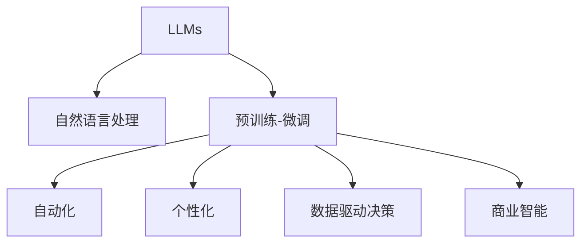

                 

# LLM对传统商业模式的颠覆与创新

## 1. 背景介绍

### 1.1 问题由来
随着人工智能技术的快速发展，大型语言模型(LLMs)在自然语言处理(NLP)领域取得了显著进展。LLMs如GPT-3、BERT等，通过在巨大无标签文本数据上预训练，学习到丰富的语言知识和语义理解能力。这些模型通过微调，可以适应特定任务，如对话、问答、翻译等，提升了NLP应用的效率和效果。

近年来，LLMs在市场营销、客户服务、内容创作等领域展现了巨大的潜力，开始对传统商业模式产生深远影响。例如，通过智能客服、个性化推荐、自动化内容生成等，LLMs正在重新定义许多行业的工作流程和价值链，促使企业重新评估其商业模式和运营策略。

### 1.2 问题核心关键点
LLMs对传统商业模式的影响主要体现在以下几个方面：
- **自动化效率提升**：LLMs能够自动化处理大量重复性任务，如文本生成、客户服务、数据分析等，提高效率，降低人力成本。
- **个性化体验增强**：通过大数据和机器学习技术，LLMs能够提供高度个性化的用户体验，提升客户满意度。
- **运营模式变革**：LLMs的应用推动了从基于产品的模式向基于服务的模式转变，强调用户交互和体验。
- **数据驱动决策**：LLMs能够处理和分析海量数据，帮助企业进行更加科学的决策，优化供应链、产品研发等环节。

### 1.3 问题研究意义
研究LLMs对传统商业模式的颠覆与创新，对于企业领导者、技术开发者、市场分析师等具有重要意义：
- 帮助企业洞察新趋势，发现潜在商机。
- 指导企业进行技术选型和资源投入，实现数字化转型。
- 促进NLP技术在更多领域的应用，推动技术进步。
- 防范潜在风险，如数据隐私、伦理道德等，确保技术应用的安全性。

## 2. 核心概念与联系

### 2.1 核心概念概述

为更好地理解LLMs对传统商业模式的颠覆与创新，本节将介绍几个关键概念：

- **大型语言模型(LLMs)**：通过大规模无标签文本数据的自监督预训练，学习通用语言表示的深度学习模型。如GPT-3、BERT等。

- **自然语言处理(NLP)**：研究计算机如何理解、处理和生成人类语言的技术领域。

- **预训练-微调(Pre-training-Fine-tuning)**：预训练模型通过大量无标签数据学习基础语言知识，微调模型针对特定任务进一步优化，提升性能。

- **自动化**：通过LLMs实现的任务自动化，减少人工干预，提高工作效率。

- **个性化**：基于用户行为和偏好数据，LLMs提供定制化的内容和服务。

- **数据驱动决策**：利用大数据和机器学习技术，LLMs帮助企业进行更科学的决策。

- **商业智能(BI)**：通过分析海量数据，为企业提供决策支持和业务优化建议。

这些概念之间的逻辑关系可以通过以下Mermaid流程图来展示：



这个流程图展示了大语言模型和微调技术在NLP中的应用及其对商业模式的潜在影响。

## 3. 核心算法原理 & 具体操作步骤
### 3.1 算法原理概述

LLMs对传统商业模式的颠覆与创新，核心在于其强大的语言处理能力，能够自动化处理大量重复性任务，提供个性化服务，推动数据驱动的决策。其原理和操作步骤如下：

- **预训练**：通过在无标签文本数据上自监督学习，LLMs学习到通用语言知识。如BERT通过掩码语言模型、GPT通过自回归语言模型。

- **微调**：针对特定任务，通过有标签数据训练微调模型，使其适应具体需求。如问答系统、文本生成、翻译等。

- **自动化**：将微调后的LLMs应用于自动化流程中，如智能客服、自动化文本生成、推荐系统等。

- **个性化**：基于用户行为和偏好数据，LLMs提供个性化服务，提升用户体验。

- **数据驱动决策**：利用LLMs处理和分析海量数据，提供决策支持，优化供应链、产品研发等环节。

### 3.2 算法步骤详解

以下是对LLMs对传统商业模式颠覆与创新的具体操作步骤：

**Step 1: 数据收集与预处理**
- 收集大量无标签和有标签文本数据。
- 对数据进行清洗、标注、分词、归一化等预处理。

**Step 2: 预训练模型选择与适配**
- 选择合适的预训练模型，如GPT-3、BERT等。
- 根据任务需求，对预训练模型进行微调，如添加任务适配层、设置损失函数等。

**Step 3: 自动化流程设计**
- 将微调后的LLMs集成到自动化流程中，如智能客服、自动化内容生成等。
- 设计合理的系统架构和数据流，确保系统稳定性和高效性。

**Step 4: 个性化服务实现**
- 收集用户行为和偏好数据，如浏览历史、购买记录等。
- 利用LLMs分析数据，生成个性化推荐和定制化内容。

**Step 5: 数据驱动决策支持**
- 收集业务数据，如销售、库存、客户反馈等。
- 利用LLMs进行数据分析，提供决策支持，如市场预测、产品优化等。

**Step 6: 监控与优化**
- 实时监控系统性能和用户反馈，发现问题并进行优化。
- 定期更新数据和模型，保持系统的高效性和准确性。

### 3.3 算法优缺点

LLMs在推动商业模式创新的同时，也存在一些局限性：
- **数据依赖**：LLMs需要大量数据进行预训练和微调，数据获取成本较高。
- **技术门槛**：LLMs对技术要求较高，需要一定的机器学习和深度学习背景。
- **隐私与伦理**：LLMs处理大量个人数据，存在隐私和伦理风险。
- **鲁棒性**：LLMs可能对输入数据和噪音敏感，泛化能力有限。

尽管存在这些局限性，LLMs在提高效率、个性化服务、数据驱动决策等方面展现了巨大的潜力，为企业带来深远的商业模式变革。

### 3.4 算法应用领域

LLMs在多个领域的应用，展现了其对传统商业模式的颠覆与创新：

- **市场营销**：利用LLMs进行情感分析、客户细分、广告优化等，提升营销效果。
- **客户服务**：通过智能客服、自动化客服机器人，提升客户满意度，降低运营成本。
- **内容创作**：利用LLMs进行文章生成、剧本创作、音乐创作等，提升内容创作的效率和创意性。
- **金融服务**：通过情感分析、舆情监测、风险评估等，提升金融服务的智能化水平。
- **医疗健康**：利用LLMs进行健康咨询、患者问答、医疗文档分析等，改善医疗服务质量。
- **教育培训**：通过智能辅导、个性化推荐、学习分析等，提升教育培训的效率和效果。

## 4. 数学模型和公式 & 详细讲解 & 举例说明
### 4.1 数学模型构建

在大语言模型的预训练和微调过程中，涉及的数学模型包括自监督损失函数、任务适配层的损失函数、模型的优化算法等。

假设预训练模型为 $M_{\theta}$，任务适配层为 $M_{\phi}$，则任务损失函数可以表示为：

$$
\mathcal{L}(\theta,\phi) = \mathcal{L}_{\text{pre-training}}(\theta) + \mathcal{L}_{\text{task}}(\theta,\phi)
$$

其中 $\mathcal{L}_{\text{pre-training}}$ 为预训练阶段的损失函数，$\mathcal{L}_{\text{task}}$ 为任务适配阶段的损失函数。

### 4.2 公式推导过程

以预训练的BERT模型为例，其在预训练阶段通过掩码语言模型进行训练，损失函数为：

$$
\mathcal{L}_{\text{masked-lm}} = -\frac{1}{N}\sum_{i=1}^N \sum_{j=1}^M -\log P(\hat{y}_{ij}=y_{ij})
$$

其中 $P(\hat{y}_{ij})$ 为模型预测的概率分布。

在微调阶段，针对特定任务（如问答系统），损失函数可以表示为：

$$
\mathcal{L}_{\text{task}} = -\frac{1}{N}\sum_{i=1}^N \log P(\hat{y}_i|x_i)
$$

其中 $P(\hat{y}_i|x_i)$ 为模型在输入 $x_i$ 上的预测概率分布，$\hat{y}_i$ 为模型的输出。

### 4.3 案例分析与讲解

以智能客服系统为例，假设训练数据集为 $\{(x_i, y_i)\}_{i=1}^N$，其中 $x_i$ 为输入的客户问题，$y_i$ 为对应的答案。

在预训练阶段，使用BERT模型进行掩码语言模型的训练，损失函数为：

$$
\mathcal{L}_{\text{pre-training}} = -\frac{1}{N}\sum_{i=1}^N \sum_{j=1}^M -\log P(\hat{y}_{ij}=y_{ij})
$$

在微调阶段，针对智能客服系统，添加任务适配层，使用softmax作为输出层，交叉熵作为损失函数，训练模型：

$$
\mathcal{L}_{\text{task}} = -\frac{1}{N}\sum_{i=1}^N \log P(\hat{y}_i|x_i)
$$

其中 $P(\hat{y}_i|x_i)$ 为模型在输入 $x_i$ 上的预测概率分布，$\hat{y}_i$ 为模型的输出。

## 5. 项目实践：代码实例和详细解释说明
### 5.1 开发环境搭建

在进行LLMs的商业应用开发前，需要准备相应的开发环境。以下是Python环境下进行LLMs开发的基本配置步骤：

1. 安装Python：建议安装Python 3.7及以上版本。
2. 安装PyTorch：`pip install torch`
3. 安装TensorFlow：`pip install tensorflow`
4. 安装LLMs库：如HuggingFace Transformers，`pip install transformers`
5. 安装数据处理库：如Pandas、NumPy，`pip install pandas numpy`
6. 配置开发环境：安装Anaconda，创建虚拟环境，安装必要的依赖库。

### 5.2 源代码详细实现

以下是一个简单的智能客服系统开发示例，使用HuggingFace Transformers库进行BERT模型的微调。

```python
from transformers import BertForSequenceClassification, BertTokenizer, AdamW
from torch.utils.data import DataLoader
from torch import nn, optim

# 数据预处理
tokenizer = BertTokenizer.from_pretrained('bert-base-cased')
train_data = ...
train_labels = ...

# 模型选择与适配
model = BertForSequenceClassification.from_pretrained('bert-base-cased', num_labels=2)
model = model.to(device)

# 优化器与学习率设置
optimizer = AdamW(model.parameters(), lr=1e-5)

# 训练循环
for epoch in range(epochs):
    model.train()
    for batch in train_data:
        inputs = tokenizer(batch['input'], return_tensors='pt').to(device)
        labels = batch['label'].to(device)
        outputs = model(**inputs)
        loss = outputs.loss
        optimizer.zero_grad()
        loss.backward()
        optimizer.step()
```

### 5.3 代码解读与分析

上述代码实现了BERT模型在智能客服系统中的微调。关键点包括：

- **数据预处理**：使用HuggingFace提供的BertTokenizer对文本数据进行分词、编码等预处理。
- **模型适配**：选择BertForSequenceClassification模型，设置输出层为softmax，适配任务为二分类。
- **优化器与学习率**：使用AdamW优化器，设置较小的学习率以避免破坏预训练权重。
- **训练循环**：通过前向传播、反向传播、优化器更新等步骤进行模型训练，每epoch后评估模型性能。

### 5.4 运行结果展示

运行上述代码，可以得到智能客服系统的训练过程和性能评估结果。例如，可以使用以下代码进行模型评估：

```python
from transformers import evaluate
evaluate(model, train_data)
```

这将返回模型的精确度、召回率、F1分数等性能指标，用于评估模型的性能。

## 6. 实际应用场景
### 6.1 智能客服系统

智能客服系统利用LLMs处理客户咨询，提供24小时不间断服务，提升了客户满意度。例如，电商平台可以通过智能客服系统处理常见的客户问题，如退换货、物流查询等，降低了人工客服的压力。

### 6.2 个性化推荐系统

个性化推荐系统利用LLMs分析用户行为数据，推荐符合用户偏好的产品或内容。例如，在线零售平台可以根据用户的浏览历史、购买记录等，生成个性化的商品推荐，提升用户转化率和满意度。

### 6.3 自动化内容生成

LLMs可以用于自动化内容生成，如文章创作、新闻摘要、广告文案等。例如，内容生成平台可以使用LLMs生成高质量的文章，提升内容创作的效率和质量。

### 6.4 市场情感分析

市场情感分析利用LLMs分析社交媒体、新闻评论等，了解市场情绪，帮助企业做出更加科学的决策。例如，通过分析Twitter上的用户评论，可以了解消费者对某产品的情感倾向，指导产品改进。

## 7. 工具和资源推荐
### 7.1 学习资源推荐

为了帮助开发者掌握LLMs的应用技巧，推荐以下学习资源：

1. **HuggingFace官方文档**：提供详细的API文档和样例代码，帮助开发者快速上手。
2. **《Transformer from Scratch》系列教程**：深入浅出地介绍Transformer模型原理和实现，适合初学者和进阶者。
3. **Coursera的《Natural Language Processing with Deep Learning》课程**：由斯坦福大学提供的深度学习在NLP中的经典课程。
4. **《Deep Learning for NLP》书籍**：介绍深度学习在NLP中的应用，涵盖预训练模型和微调技术。
5. **Kaggle竞赛**：参与NLP相关的Kaggle竞赛，实践和提升LLMs的应用能力。

### 7.2 开发工具推荐

以下是几款常用的LLMs开发工具：

1. **Jupyter Notebook**：一个强大的交互式编程环境，适合数据探索和模型调试。
2. **PyTorch Lightning**：基于PyTorch的轻量级框架，适合快速原型设计和模型训练。
3. **TensorFlow**：谷歌提供的深度学习框架，支持分布式训练和模型部署。
4. **HuggingFace Transformers**：基于PyTorch和TensorFlow的NLP工具库，包含众多预训练模型和微调样例。
5. **Weights & Biases**：模型训练的实验跟踪工具，帮助监控和优化模型性能。

### 7.3 相关论文推荐

以下是几篇关键的研究论文，推荐阅读：

1. **Attention is All You Need**：Transformer模型的经典论文，介绍了自注意力机制。
2. **BERT: Pre-training of Deep Bidirectional Transformers for Language Understanding**：BERT模型的原论文，提出了预训练和微调的新范式。
3. **Few-shot Learning with Pre-trained Language Models**：利用预训练语言模型进行少样本学习的论文，探讨了微调方法在少样本任务中的应用。
4. **AdaLoRA: Adaptive Low-Rank Adaptation for Parameter-Efficient Fine-Tuning**：提出了一种参数高效的微调方法，减少了微调所需的计算资源。
5. **Prompt-based Fine-tuning for Low-resource Named Entity Recognition**：介绍了一种基于提示的微调方法，利用预训练语言模型实现少样本命名实体识别。

## 8. 总结：未来发展趋势与挑战
### 8.1 总结

本文探讨了LLMs对传统商业模式的颠覆与创新，从预训练模型、微调技术、自动化流程设计等方面展开。通过实例分析，展示了LLMs在智能客服、个性化推荐、自动化内容生成等方面的应用，指出了其在提升效率、改善用户体验、数据驱动决策等方面的潜力。

### 8.2 未来发展趋势

未来，LLMs在以下几个方面将取得更大进展：

- **模型规模扩大**：随着算力提升和数据获取的便利性，预训练模型的参数规模将进一步增大，语言能力更加丰富。
- **技术日趋成熟**：LLMs的预训练和微调技术将不断优化，提高模型效果，降低应用门槛。
- **应用场景扩展**：LLMs将进入更多行业，如医疗、金融、教育等，推动这些领域的智能化转型。
- **数据驱动决策**：利用LLMs进行大数据分析，提供更加科学的决策支持。
- **伦理与隐私保护**：在数据隐私和伦理方面进行更多探索，确保技术应用的公正性和安全性。

### 8.3 面临的挑战

尽管LLMs带来了诸多商业机遇，但也面临着以下挑战：

- **数据获取难度**：大规模无标签数据和高质量标注数据的获取成本较高。
- **技术复杂性**：预训练和微调过程复杂，需要较高的技术门槛。
- **隐私与安全风险**：处理大量个人数据，存在隐私泄露和伦理道德风险。
- **鲁棒性与泛化能力**：模型对噪音和输入变动的鲁棒性有待提升。

### 8.4 研究展望

未来，LLMs的研究需要进一步关注以下几个方向：

- **少样本学习**：探索更高效、更灵活的少样本学习技术，降低数据依赖。
- **参数高效微调**：开发更多参数高效的微调方法，减少计算资源消耗。
- **多模态融合**：将视觉、语音、文本等多模态信息融合，提升模型的全面理解能力。
- **伦理与安全**：在算法设计中引入伦理导向的评估指标，确保模型行为符合人类价值观。
- **知识图谱与逻辑规则**：结合外部知识库，提升模型的常识推理和逻辑推理能力。

## 9. 附录：常见问题与解答

**Q1: LLMs对传统商业模式的颠覆与创新体现在哪些方面？**

A: LLMs对传统商业模式的颠覆与创新主要体现在以下几个方面：
- 自动化效率提升：LLMs可以自动化处理大量重复性任务，降低人工成本。
- 个性化体验增强：基于用户行为数据，LLMs提供个性化服务，提升用户体验。
- 运营模式变革：LLMs推动从基于产品的模式向基于服务的模式转变。
- 数据驱动决策：利用大数据和机器学习技术，LLMs提供决策支持。

**Q2: LLMs在开发过程中需要注意哪些关键点？**

A: 开发LLMs需要注意以下几个关键点：
- 数据收集与预处理：收集高质量标注数据，对数据进行清洗和归一化。
- 模型选择与适配：选择合适的预训练模型，并根据任务需求进行微调。
- 自动化流程设计：设计合理的系统架构和数据流，确保系统稳定性和高效性。
- 个性化服务实现：收集用户行为数据，利用LLMs生成个性化推荐和内容。
- 数据驱动决策：收集业务数据，利用LLMs进行分析，提供决策支持。

**Q3: LLMs在实际应用中面临哪些挑战？**

A: LLMs在实际应用中面临以下挑战：
- 数据依赖：需要大量高质量标注数据，数据获取成本较高。
- 技术门槛：预训练和微调过程复杂，需要较高的技术门槛。
- 隐私与安全风险：处理大量个人数据，存在隐私泄露和伦理道德风险。
- 鲁棒性与泛化能力：模型对噪音和输入变动的鲁棒性有待提升。

**Q4: 如何提高LLMs的泛化能力？**

A: 提高LLMs的泛化能力可以从以下几个方面入手：
- 数据增强：通过回译、近义替换等方式扩充训练集。
- 正则化：使用L2正则、Dropout等方法避免过拟合。
- 对抗训练：引入对抗样本，提高模型鲁棒性。
- 多任务学习：在微调过程中引入多任务，提升模型的泛化能力。
- 迁移学习：利用已有模型知识，进行跨领域迁移学习。

**Q5: LLMs在多模态融合中的应用前景如何？**

A: LLMs在多模态融合中展现了巨大的潜力，主要体现在以下几个方面：
- 视觉、语音、文本信息的整合：将视觉、语音、文本等多模态信息融合，提升模型的全面理解能力。
- 跨模态匹配：利用LLMs进行跨模态匹配，如语音识别、图像描述等。
- 多模态推荐：结合视觉、文本等信息，提供更全面、更个性化的推荐。

---

作者：禅与计算机程序设计艺术 / Zen and the Art of Computer Programming

