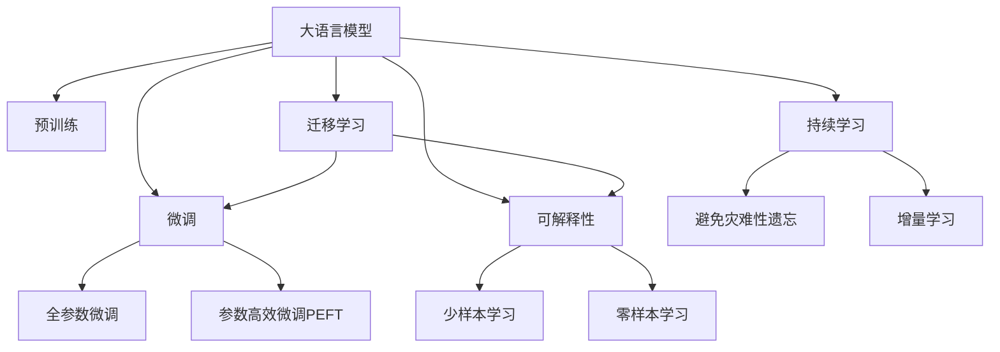

                 

# LLM对传统文本分类的挑战

## 1. 背景介绍

### 1.1 问题由来
近年来，大语言模型（LLM）在自然语言处理（NLP）领域取得了飞速的发展，并在多项任务上刷新了最先进记录。与传统文本分类模型相比，LLM凭借其预训练的庞大语料和先进的自监督学习技巧，显著提升了对文本的语义理解和特征提取能力。然而，大语言模型在文本分类任务上也面临着一些挑战。

### 1.2 问题核心关键点
大语言模型在文本分类上的挑战主要集中在以下几个方面：
1. **预训练数据的多样性**：预训练数据通常包含丰富的语言知识和背景知识，但不同的预训练数据可能具有不同的语言风格和领域特点，导致模型在不同任务上的泛化能力有所不同。
2. **模型复杂性与资源消耗**：大语言模型的参数量通常较大，计算资源消耗高，这对训练、推理和部署带来挑战。
3. **可解释性问题**：大语言模型的决策过程难以解释，难以理解和调试，这对一些关键应用场景（如医疗、法律等）尤为重要。
4. **数据依赖性**：大语言模型的性能依赖于其预训练数据和微调数据的质量，当数据质量较差时，模型的效果可能受到影响。
5. **计算效率**：在大规模数据上训练大语言模型需要较长的训练时间，这对实际应用造成了时间和资源上的限制。

这些挑战使得传统文本分类方法在大规模、复杂和高要求的应用场景中仍然具有不可替代的价值。

## 2. 核心概念与联系

### 2.1 核心概念概述

为更好地理解LLM在文本分类任务中的挑战，本节将介绍几个密切相关的核心概念：

- 大语言模型（LLM）：以自回归模型（如GPT）或自编码模型（如BERT）为代表的大规模预训练语言模型。通过在大规模无标签文本语料上进行预训练，学习通用的语言表示，具备强大的语言理解和生成能力。

- 预训练（Pre-training）：指在大规模无标签文本语料上，通过自监督学习任务训练通用语言模型的过程。常见的预训练任务包括言语建模、掩码语言模型等。

- 微调（Fine-tuning）：指在预训练模型的基础上，使用下游任务的少量标注数据，通过有监督地训练来优化模型在特定任务上的性能。

- 迁移学习（Transfer Learning）：指将一个领域学习到的知识，迁移应用到另一个不同但相关的领域的学习范式。大模型的预训练-微调过程即是一种典型的迁移学习方式。

- 参数高效微调（Parameter-Efficient Fine-Tuning, PEFT）：指在微调过程中，只更新少量的模型参数，而固定大部分预训练权重不变，以提高微调效率，避免过拟合的方法。

- 可解释性（Explainability）：指模型的决策过程可以被理解和解释的程度，这对一些关键应用场景（如医疗、法律等）尤为重要。

- 少样本学习（Few-shot Learning）：指在只有少量标注样本的情况下，模型能够快速适应新任务的学习方法。在大语言模型中，通常通过在输入中提供少量示例来实现，无需更新模型参数。

- 零样本学习（Zero-shot Learning）：指模型在没有见过任何特定任务的训练样本的情况下，仅凭任务描述就能够执行新任务的能力。大语言模型通过预训练获得的广泛知识，使其能够理解任务指令并生成相应输出。

- 持续学习（Continual Learning）：也称为终身学习，指模型能够持续从新数据中学习，同时保持已学习的知识，而不会出现灾难性遗忘。这对于保持大语言模型的时效性和适应性至关重要。

这些核心概念之间的逻辑关系可以通过以下Mermaid流程图来展示：



这个流程图展示了大语言模型的核心概念及其之间的关系：

1. 大语言模型通过预训练获得基础能力。
2. 微调是对预训练模型进行任务特定的优化，可以分为全参数微调和参数高效微调（PEFT）。
3. 可解释性是一种不更新模型参数的方法，可以实现少样本学习和零样本学习。
4. 迁移学习是连接预训练模型与下游任务的桥梁，可以通过微调或可解释性来实现。
5. 持续学习旨在使模型能够不断学习新知识，同时避免遗忘旧知识。

## 3. 核心算法原理 & 具体操作步骤
### 3.1 算法原理概述

基于大语言模型的大规模文本分类任务，通常采用以下步骤：

1. **数据准备**：收集标注数据集，划分为训练集、验证集和测试集。
2. **模型选择**：选择合适的预训练语言模型，如BERT、GPT等。
3. **任务适配**：根据分类任务设计任务适配层，如添加分类器、损失函数等。
4. **微调训练**：在训练集上使用小学习率微调模型，并应用正则化技术防止过拟合。
5. **模型评估**：在验证集上评估模型性能，调整超参数和模型结构。
6. **测试部署**：在测试集上最终评估模型性能，并部署到实际应用中。

大语言模型在文本分类中的主要贡献在于其预训练知识，这使得模型能够更好地理解文本的语义和上下文信息，从而提高分类精度。

### 3.2 算法步骤详解

以下是使用PyTorch和Transformers库对BERT模型进行文本分类任务微调的详细步骤：

1. **数据预处理**：使用BERT分词器将文本转换为模型所需的格式，并进行填充和截断处理。

2. **模型选择**：
```python
from transformers import BertTokenizer, BertForSequenceClassification
tokenizer = BertTokenizer.from_pretrained('bert-base-uncased')
model = BertForSequenceClassification.from_pretrained('bert-base-uncased', num_labels=2)
```

3. **模型训练**：
```python
from torch.utils.data import DataLoader, TensorDataset
import torch
device = torch.device('cuda' if torch.cuda.is_available() else 'cpu')
model.to(device)
optimizer = AdamW(model.parameters(), lr=1e-5)
criterion = torch.nn.CrossEntropyLoss()

def train_epoch(model, data_loader, optimizer, device):
    model.train()
    total_loss = 0
    for batch in data_loader:
        input_ids = batch[0].to(device)
        attention_mask = batch[1].to(device)
        labels = batch[2].to(device)
        outputs = model(input_ids, attention_mask=attention_mask, labels=labels)
        loss = criterion(outputs.logits, labels)
        optimizer.zero_grad()
        loss.backward()
        optimizer.step()
        total_loss += loss.item()
    return total_loss / len(data_loader)

def evaluate(model, data_loader, device):
    model.eval()
    total_preds = []
    total_labels = []
    with torch.no_grad():
        for batch in data_loader:
            input_ids = batch[0].to(device)
            attention_mask = batch[1].to(device)
            labels = batch[2].to(device)
            outputs = model(input_ids, attention_mask=attention_mask)
            logits = outputs.logits
            _, preds = torch.max(logits, dim=1)
            total_preds.append(preds)
            total_labels.append(labels)
    return torch.cat(total_preds), torch.cat(total_labels)
```

4. **模型评估和测试**：
```python
def test(model, data_loader, device):
    model.eval()
    total_preds, total_labels = evaluate(model, data_loader, device)
    return total_preds, total_labels
```

5. **模型部署**：
```python
def deploy(model, data_loader, device):
    model.eval()
    total_preds, total_labels = evaluate(model, data_loader, device)
    return total_preds, total_labels
```

这些步骤展示了使用BERT模型进行文本分类任务微调的基本流程。

### 3.3 算法优缺点

大语言模型在文本分类任务上的主要优点：
1. **强大的语义理解能力**：通过预训练，模型能够理解复杂的文本语义和上下文信息，提高分类精度。
2. **泛化能力**：模型可以从大量语料中学习通用的语言表示，适用于不同领域的文本分类任务。
3. **高效的学习能力**：模型能够快速适应新的任务，只需少量标注数据即可取得不错的效果。

主要缺点：
1. **计算资源消耗大**：大语言模型的参数量较大，计算资源消耗高，训练和推理需要较长时间。
2. **可解释性不足**：模型决策过程难以解释，难以理解和调试。
3. **依赖标注数据**：模型效果依赖于标注数据的质量，当数据质量较差时，模型效果可能受到影响。
4. **过拟合风险**：模型参数量较大，存在一定的过拟合风险，特别是在标注数据较少的情况下。

## 4. 数学模型和公式 & 详细讲解  
### 4.1 数学模型构建

假设预训练语言模型为 $M_{\theta}$，其中 $\theta$ 为预训练得到的模型参数。下游文本分类任务的目标是最大化预测准确率 $P$，即：

$$
P = \max_{y \in \{0, 1\}} P(y|M_{\theta}(x))
$$

其中 $x$ 为输入文本，$y$ 为分类标签。

目标函数可以表示为交叉熵损失：

$$
L = -\sum_{i=1}^{N} \log P(y_i|M_{\theta}(x_i))
$$

其中 $N$ 为训练样本数量，$(x_i, y_i)$ 为第 $i$ 个训练样本。

### 4.2 公式推导过程

以下我们以二分类任务为例，推导交叉熵损失函数及其梯度的计算公式。

假设模型 $M_{\theta}$ 在输入 $x$ 上的输出为 $\hat{y}=M_{\theta}(x) \in [0,1]$，表示样本属于正类的概率。真实标签 $y \in \{0,1\}$。则二分类交叉熵损失函数定义为：

$$
\ell(M_{\theta}(x),y) = -[y\log \hat{y} + (1-y)\log (1-\hat{y})]
$$

将其代入目标函数，得：

$$
L = -\frac{1}{N}\sum_{i=1}^{N} \log P(y_i|M_{\theta}(x_i))
$$

根据链式法则，目标函数对参数 $\theta_k$ 的梯度为：

$$
\frac{\partial L}{\partial \theta_k} = -\frac{1}{N}\sum_{i=1}^{N} \frac{\partial \log P(y_i|M_{\theta}(x_i))}{\partial \theta_k}
$$

其中 $\frac{\partial \log P(y_i|M_{\theta}(x_i))}{\partial \theta_k}$ 可以进一步展开，利用自动微分技术完成计算。

在得到目标函数的梯度后，即可带入参数更新公式，完成模型的迭代优化。

### 4.3 案例分析与讲解

假设我们有一个文本分类任务，标签为正面评论或负面评论。我们收集了1000条训练数据，其中正面评论500条，负面评论500条。我们使用BERT模型进行微调，步骤如下：

1. **数据准备**：将文本数据分为训练集和测试集，使用BERT分词器进行分词处理。
2. **模型选择**：选择BERT模型，并设置分类器为线性分类器。
3. **模型训练**：使用AdamW优化器，设置学习率为1e-5，进行多次迭代。
4. **模型评估**：在测试集上评估模型性能，计算准确率、精确率、召回率和F1分数。
5. **模型部署**：将模型部署到实际应用中，进行文本分类任务。

下面是一个简单的Python代码实现：

```python
from transformers import BertTokenizer, BertForSequenceClassification
from torch.utils.data import DataLoader
import torch
from sklearn.metrics import classification_report

# 1. 数据准备
tokenizer = BertTokenizer.from_pretrained('bert-base-uncased')
train_data = ... # 训练数据
test_data = ... # 测试数据

# 2. 模型选择
model = BertForSequenceClassification.from_pretrained('bert-base-uncased', num_labels=2)

# 3. 模型训练
optimizer = AdamW(model.parameters(), lr=1e-5)
device = torch.device('cuda' if torch.cuda.is_available() else 'cpu')
model.to(device)
criterion = torch.nn.CrossEntropyLoss()

def train_epoch(model, data_loader, optimizer):
    model.train()
    total_loss = 0
    for batch in data_loader:
        input_ids = batch[0].to(device)
        attention_mask = batch[1].to(device)
        labels = batch[2].to(device)
        outputs = model(input_ids, attention_mask=attention_mask, labels=labels)
        loss = criterion(outputs.logits, labels)
        optimizer.zero_grad()
        loss.backward()
        optimizer.step()
        total_loss += loss.item()
    return total_loss / len(data_loader)

def evaluate(model, data_loader):
    model.eval()
    total_preds = []
    total_labels = []
    with torch.no_grad():
        for batch in data_loader:
            input_ids = batch[0].to(device)
            attention_mask = batch[1].to(device)
            labels = batch[2].to(device)
            outputs = model(input_ids, attention_mask=attention_mask)
            logits = outputs.logits
            _, preds = torch.max(logits, dim=1)
            total_preds.append(preds)
            total_labels.append(labels)
    return torch.cat(total_preds), torch.cat(total_labels)

# 4. 模型评估
test_data_loader = DataLoader(test_data, batch_size=16)
total_preds, total_labels = evaluate(model, test_data_loader)
print(classification_report(total_labels, total_preds))

# 5. 模型部署
```

以上代码展示了如何使用BERT模型进行文本分类任务微调的完整流程。

## 5. 项目实践：代码实例和详细解释说明
### 5.1 开发环境搭建

在进行文本分类任务微调前，我们需要准备好开发环境。以下是使用Python进行PyTorch开发的环境配置流程：

1. 安装Anaconda：从官网下载并安装Anaconda，用于创建独立的Python环境。

2. 创建并激活虚拟环境：
```bash
conda create -n pytorch-env python=3.8 
conda activate pytorch-env
```

3. 安装PyTorch：根据CUDA版本，从官网获取对应的安装命令。例如：
```bash
conda install pytorch torchvision torchaudio cudatoolkit=11.1 -c pytorch -c conda-forge
```

4. 安装Transformers库：
```bash
pip install transformers
```

5. 安装各类工具包：
```bash
pip install numpy pandas scikit-learn matplotlib tqdm jupyter notebook ipython
```

完成上述步骤后，即可在`pytorch-env`环境中开始文本分类任务的微调实践。

### 5.2 源代码详细实现

下面以使用BERT模型进行文本分类任务微调为例，给出完整的Python代码实现：

```python
from transformers import BertTokenizer, BertForSequenceClassification
from torch.utils.data import DataLoader, TensorDataset
import torch
from sklearn.metrics import classification_report

# 1. 数据准备
tokenizer = BertTokenizer.from_pretrained('bert-base-uncased')
train_data = ... # 训练数据
test_data = ... # 测试数据

# 2. 模型选择
model = BertForSequenceClassification.from_pretrained('bert-base-uncased', num_labels=2)

# 3. 模型训练
optimizer = AdamW(model.parameters(), lr=1e-5)
device = torch.device('cuda' if torch.cuda.is_available() else 'cpu')
model.to(device)
criterion = torch.nn.CrossEntropyLoss()

def train_epoch(model, data_loader, optimizer):
    model.train()
    total_loss = 0
    for batch in data_loader:
        input_ids = batch[0].to(device)
        attention_mask = batch[1].to(device)
        labels = batch[2].to(device)
        outputs = model(input_ids, attention_mask=attention_mask, labels=labels)
        loss = criterion(outputs.logits, labels)
        optimizer.zero_grad()
        loss.backward()
        optimizer.step()
        total_loss += loss.item()
    return total_loss / len(data_loader)

def evaluate(model, data_loader):
    model.eval()
    total_preds = []
    total_labels = []
    with torch.no_grad():
        for batch in data_loader:
            input_ids = batch[0].to(device)
            attention_mask = batch[1].to(device)
            labels = batch[2].to(device)
            outputs = model(input_ids, attention_mask=attention_mask)
            logits = outputs.logits
            _, preds = torch.max(logits, dim=1)
            total_preds.append(preds)
            total_labels.append(labels)
    return torch.cat(total_preds), torch.cat(total_labels)

# 4. 模型评估
test_data_loader = DataLoader(test_data, batch_size=16)
total_preds, total_labels = evaluate(model, test_data_loader)
print(classification_report(total_labels, total_preds))

# 5. 模型部署
```

## 6. 实际应用场景
### 6.1 智能客服系统

基于大语言模型的文本分类技术，可以广泛应用于智能客服系统的构建。传统客服往往需要配备大量人力，高峰期响应缓慢，且一致性和专业性难以保证。而使用文本分类模型进行意图识别，可以实现7x24小时不间断服务，快速响应客户咨询，用自然流畅的语言解答各类常见问题。

在技术实现上，可以收集企业内部的历史客服对话记录，将问题和最佳答复构建成监督数据，在此基础上对预训练模型进行微调。微调后的模型能够自动理解用户意图，匹配最合适的答案模板进行回复。对于客户提出的新问题，还可以接入检索系统实时搜索相关内容，动态组织生成回答。如此构建的智能客服系统，能大幅提升客户咨询体验和问题解决效率。

### 6.2 金融舆情监测

金融机构需要实时监测市场舆论动向，以便及时应对负面信息传播，规避金融风险。传统的人工监测方式成本高、效率低，难以应对网络时代海量信息爆发的挑战。基于大语言模型的文本分类技术，为金融舆情监测提供了新的解决方案。

具体而言，可以收集金融领域相关的新闻、报道、评论等文本数据，并对其进行主题标注和情感标注。在此基础上对预训练语言模型进行微调，使其能够自动判断文本属于何种主题，情感倾向是正面、中性还是负面。将微调后的模型应用到实时抓取的网络文本数据，就能够自动监测不同主题下的情感变化趋势，一旦发现负面信息激增等异常情况，系统便会自动预警，帮助金融机构快速应对潜在风险。

### 6.3 个性化推荐系统

当前的推荐系统往往只依赖用户的历史行为数据进行物品推荐，无法深入理解用户的真实兴趣偏好。基于大语言模型文本分类技术，个性化推荐系统可以更好地挖掘用户行为背后的语义信息，从而提供更精准、多样的推荐内容。

在实践中，可以收集用户浏览、点击、评论、分享等行为数据，提取和用户交互的物品标题、描述、标签等文本内容。将文本内容作为模型输入，用户的后续行为（如是否点击、购买等）作为监督信号，在此基础上微调预训练语言模型。微调后的模型能够从文本内容中准确把握用户的兴趣点。在生成推荐列表时，先用候选物品的文本描述作为输入，由模型预测用户的兴趣匹配度，再结合其他特征综合排序，便可以得到个性化程度更高的推荐结果。

### 6.4 未来应用展望

随着大语言模型和文本分类技术的不断发展，基于文本分类的大模型微调方法将呈现以下几个发展趋势：

1. **模型规模持续增大**：随着算力成本的下降和数据规模的扩张，预训练语言模型的参数量还将持续增长。超大规模语言模型蕴含的丰富语言知识，有望支撑更加复杂多变的下游任务微调。

2. **文本分类与自然语言处理深度融合**：文本分类技术不仅能够应用于传统的NLP任务，还能够与其他NLP技术如命名实体识别、关系抽取等进行深度融合，提升综合处理能力。

3. **零样本和少样本学习**：在只有少量标注样本的情况下，模型能够快速适应新任务，提高微调效率，降低对标注数据的需求。

4. **多模态融合**：文本分类技术不仅能够处理文本数据，还能够与其他模态数据如图像、语音等进行融合，提升多模态信息处理能力。

5. **智能推荐与个性化服务**：文本分类技术能够与推荐系统结合，通过理解用户兴趣，提供个性化服务，提升用户体验。

6. **安全与隐私保护**：文本分类模型需要关注数据隐私和安全问题，确保模型不会泄露用户隐私，同时保证模型的鲁棒性和公平性。

以上趋势凸显了大语言模型文本分类技术的广阔前景。这些方向的探索发展，必将进一步提升文本分类模型的性能和应用范围，为人工智能技术在各领域的应用提供新的突破。

## 7. 工具和资源推荐
### 7.1 学习资源推荐

为了帮助开发者系统掌握大语言模型在文本分类任务中的应用，这里推荐一些优质的学习资源：

1. 《Transformer从原理到实践》系列博文：由大模型技术专家撰写，深入浅出地介绍了Transformer原理、BERT模型、文本分类任务等前沿话题。

2. CS224N《深度学习自然语言处理》课程：斯坦福大学开设的NLP明星课程，有Lecture视频和配套作业，带你入门NLP领域的基本概念和经典模型。

3. 《Natural Language Processing with Transformers》书籍：Transformers库的作者所著，全面介绍了如何使用Transformers库进行NLP任务开发，包括文本分类在内的诸多范式。

4. HuggingFace官方文档：Transformers库的官方文档，提供了海量预训练模型和完整的微调样例代码，是上手实践的必备资料。

5. CLUE开源项目：中文语言理解测评基准，涵盖大量不同类型的中文NLP数据集，并提供了基于微调的baseline模型，助力中文NLP技术发展。

通过对这些资源的学习实践，相信你一定能够快速掌握大语言模型在文本分类任务中的应用，并用于解决实际的NLP问题。

### 7.2 开发工具推荐

高效的开发离不开优秀的工具支持。以下是几款用于文本分类任务微调开发的常用工具：

1. PyTorch：基于Python的开源深度学习框架，灵活动态的计算图，适合快速迭代研究。大部分预训练语言模型都有PyTorch版本的实现。

2. TensorFlow：由Google主导开发的开源深度学习框架，生产部署方便，适合大规模工程应用。同样有丰富的预训练语言模型资源。

3. Transformers库：HuggingFace开发的NLP工具库，集成了众多SOTA语言模型，支持PyTorch和TensorFlow，是进行文本分类任务微调开发的重要工具。

4. Weights & Biases：模型训练的实验跟踪工具，可以记录和可视化模型训练过程中的各项指标，方便对比和调优。与主流深度学习框架无缝集成。

5. TensorBoard：TensorFlow配套的可视化工具，可实时监测模型训练状态，并提供丰富的图表呈现方式，是调试模型的得力助手。

6. Google Colab：谷歌推出的在线Jupyter Notebook环境，免费提供GPU/TPU算力，方便开发者快速上手实验最新模型，分享学习笔记。

合理利用这些工具，可以显著提升大语言模型在文本分类任务上的开发效率，加快创新迭代的步伐。

### 7.3 相关论文推荐

大语言模型和文本分类技术的发展源于学界的持续研究。以下是几篇奠基性的相关论文，推荐阅读：

1. Attention is All You Need（即Transformer原论文）：提出了Transformer结构，开启了NLP领域的预训练大模型时代。

2. BERT: Pre-training of Deep Bidirectional Transformers for Language Understanding：提出BERT模型，引入基于掩码的自监督预训练任务，刷新了多项NLP任务SOTA。

3. Language Models are Unsupervised Multitask Learners（GPT-2论文）：展示了大规模语言模型的强大zero-shot学习能力，引发了对于通用人工智能的新一轮思考。

4. Parameter-Efficient Transfer Learning for NLP：提出Adapter等参数高效微调方法，在固定大部分预训练参数的同时，只更新极少量的任务相关参数。

5. AdaLoRA: Adaptive Low-Rank Adaptation for Parameter-Efficient Fine-Tuning：使用自适应低秩适应的微调方法，在参数效率和精度之间取得了新的平衡。

6. CLUE: A Large-scale Supervised Pre-training Dataset and Benchmark for Chinese NLP：提出CLUE数据集和基准，涵盖多种中文NLP任务，为中文文本分类提供了数据支持。

这些论文代表了大语言模型在文本分类任务上的研究方向。通过学习这些前沿成果，可以帮助研究者把握学科前进方向，激发更多的创新灵感。

## 8. 总结：未来发展趋势与挑战

### 8.1 总结

本文对基于大语言模型的文本分类任务进行了全面系统的介绍。首先阐述了文本分类任务的背景和挑战，明确了大语言模型在文本分类中的独特价值。其次，从原理到实践，详细讲解了基于大语言模型的文本分类数学模型和关键步骤，给出了微调任务开发的完整代码实例。同时，本文还探讨了文本分类任务在智能客服、金融舆情、个性化推荐等多个领域的应用前景，展示了文本分类技术的重要作用。此外，本文精选了文本分类任务的各类学习资源，力求为读者提供全方位的技术指引。

通过本文的系统梳理，可以看到，基于大语言模型的文本分类方法正在成为NLP领域的重要范式，极大地拓展了预训练语言模型的应用边界，催生了更多的落地场景。受益于大规模语料的预训练，文本分类模型在微调过程中能够更好地理解文本的语义和上下文信息，从而提高分类精度。未来，伴随预训练语言模型和文本分类技术的持续演进，相信文本分类技术必将在更广阔的应用领域大放异彩，深刻影响人类的生产生活方式。

### 8.2 未来发展趋势

展望未来，大语言模型在文本分类任务上的主要发展趋势包括：

1. **模型规模持续增大**：随着算力成本的下降和数据规模的扩张，预训练语言模型的参数量还将持续增长。超大规模语言模型蕴含的丰富语言知识，有望支撑更加复杂多变的下游任务微调。

2. **文本分类与自然语言处理深度融合**：文本分类技术不仅能够应用于传统的NLP任务，还能够与其他NLP技术如命名实体识别、关系抽取等进行深度融合，提升综合处理能力。

3. **零样本和少样本学习**：在只有少量标注样本的情况下，模型能够快速适应新任务，提高微调效率，降低对标注数据的需求。

4. **多模态融合**：文本分类技术不仅能够处理文本数据，还能够与其他模态数据如图像、语音等进行融合，提升多模态信息处理能力。

5. **智能推荐与个性化服务**：文本分类技术能够与推荐系统结合，通过理解用户兴趣，提供个性化服务，提升用户体验。

6. **安全与隐私保护**：文本分类模型需要关注数据隐私和安全问题，确保模型不会泄露用户隐私，同时保证模型的鲁棒性和公平性。

这些趋势凸显了大语言模型在文本分类任务上的广阔前景。这些方向的探索发展，必将进一步提升文本分类模型的性能和应用范围，为人工智能技术在各领域的应用提供新的突破。

### 8.3 面临的挑战

尽管大语言模型在文本分类任务上取得了显著进展，但在迈向更加智能化、普适化应用的过程中，它仍面临着诸多挑战：

1. **标注数据成本高**：大语言模型微调仍需依赖标注数据，而高质量标注数据的获取成本较高，特别是对于长尾应用场景。如何进一步降低对标注数据的依赖，将是未来需要解决的重要问题。

2. **计算资源消耗大**：大语言模型的参数量较大，计算资源消耗高，训练和推理需要较长时间。如何在保证性能的同时，降低计算资源消耗，提高模型部署效率，将是未来的研究方向。

3. **可解释性不足**：大语言模型的决策过程难以解释，难以理解和调试，这对一些关键应用场景（如医疗、法律等）尤为重要。如何赋予文本分类模型更强的可解释性，将是亟待解决的问题。

4. **模型鲁棒性不足**：当目标任务与预训练数据的分布差异较大时，模型的泛化性能可能受到影响。如何在保持泛化性能的同时，提高模型的鲁棒性，将是未来的研究重点。

5. **知识整合能力不足**：现有的文本分类模型往往局限于任务内数据，难以灵活吸收和运用更广泛的先验知识。如何让文本分类过程更好地与外部知识库、规则库等专家知识结合，形成更加全面、准确的信息整合能力，还有很大的想象空间。

6. **数据隐私和安全**：文本分类模型需要关注数据隐私和安全问题，确保模型不会泄露用户隐私，同时保证模型的鲁棒性和公平性。

这些挑战使得文本分类技术在大规模、复杂和高要求的应用场景中仍需不断优化和改进。只有在数据、模型、训练、推理等各环节进行全面优化，才能最大限度地发挥大语言模型在文本分类任务中的潜力。

### 8.4 研究展望

面向未来，文本分类技术需要在以下几个方面进行进一步研究：

1. **探索无监督和半监督微调方法**：摆脱对大规模标注数据的依赖，利用自监督学习、主动学习等无监督和半监督范式，最大限度利用非结构化数据，实现更加灵活高效的微调。

2. **研究参数高效和计算高效的微调范式**：开发更加参数高效的微调方法，在固定大部分预训练参数的同时，只更新极少量的任务相关参数。同时优化微调模型的计算图，减少前向传播和反向传播的资源消耗，实现更加轻量级、实时性的部署。

3. **融合因果和对比学习范式**：通过引入因果推断和对比学习思想，增强文本分类模型建立稳定因果关系的能力，学习更加普适、鲁棒的语言表征，从而提升模型泛化性和抗干扰能力。

4. **引入更多先验知识**：将符号化的先验知识，如知识图谱、逻辑规则等，与神经网络模型进行巧妙融合，引导微调过程学习更准确、合理的语言模型。同时加强不同模态数据的整合，实现视觉、语音等多模态信息与文本信息的协同建模。

5. **结合因果分析和博弈论工具**：将因果分析方法引入文本分类模型，识别出模型决策的关键特征，增强输出解释的因果性和逻辑性。借助博弈论工具刻画人机交互过程，主动探索并规避模型的脆弱点，提高系统稳定性。

6. **纳入伦理道德约束**：在模型训练目标中引入伦理导向的评估指标，过滤和惩罚有偏见、有害的输出倾向。同时加强人工干预和审核，建立模型行为的监管机制，确保输出符合人类价值观和伦理道德。

这些研究方向的研究突破，必将进一步提升文本分类模型的性能和应用范围，为人工智能技术在各领域的应用提供新的突破。相信随着学界和产业界的共同努力，这些挑战终将一一被克服，大语言模型在文本分类任务中将发挥更大的作用，推动NLP技术的不断进步。

