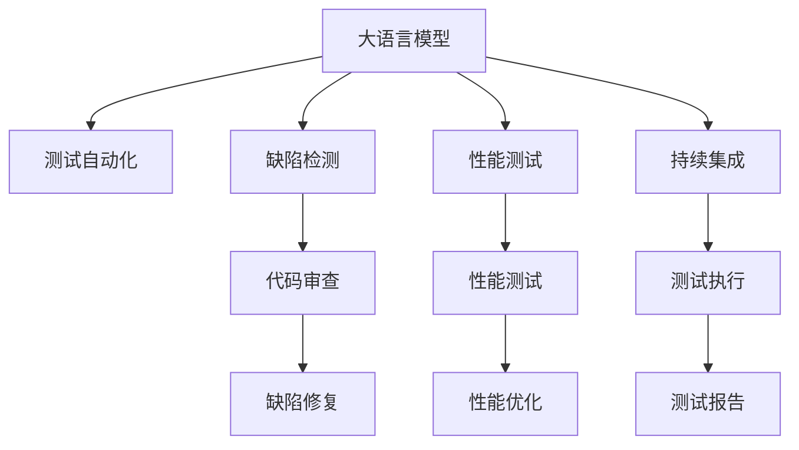

                 

# LLM对传统软件测试的影响

> 关键词：
- 大语言模型
- 软件测试
- 测试自动化
- 缺陷检测
- 代码生成
- 自然语言处理
- 质量保证

## 1. 背景介绍

### 1.1 问题由来
软件测试在软件开发过程中扮演着至关重要的角色，旨在识别和修复程序中的缺陷，确保软件的质量与稳定性。传统的软件测试方法依赖于人工编写测试用例、执行测试，耗费大量人力和时间成本。随着软件开发规模和复杂度的不断增长，对测试效率和测试质量提出了更高的要求。

近年来，大语言模型（Large Language Model, LLM）在自然语言处理（Natural Language Processing, NLP）领域的突破性进展，使其在软件测试领域的应用也逐渐成为热点。大语言模型能够自动理解和生成自然语言，有望从根本上改变传统软件测试的方法，提高测试效率和测试质量，推动软件工程的发展。

### 1.2 问题核心关键点
大语言模型对传统软件测试的影响主要体现在以下几个方面：
- 自动化测试用例的生成：大语言模型可以自动生成测试用例，减少手动编写测试用例的工作量。
- 缺陷检测与修复：大语言模型可以通过代码审查、自动代码审计等方式检测和修复代码中的缺陷。
- 性能测试：大语言模型可以模拟用户行为，执行性能测试，提升软件系统的鲁棒性。
- 持续测试：大语言模型可以持续执行测试，支持快速迭代和持续集成，加速软件交付。

本文将系统探讨大语言模型在软件测试中的应用，详细介绍其原理和操作步骤，并展示其在实际项目中的运行结果。同时，将分析大语言模型在软件测试中的优缺点，并展望其未来的应用前景。

## 2. 核心概念与联系

### 2.1 核心概念概述

为更好地理解大语言模型在软件测试中的应用，本节将介绍几个密切相关的核心概念：

- 大语言模型（LLM）：以自回归（如GPT）或自编码（如BERT）模型为代表的大规模预训练语言模型。通过在大规模无标签文本语料上进行预训练，学习通用的语言表示，具备强大的语言理解和生成能力。

- 自然语言处理（NLP）：涉及计算机如何处理和理解人类语言的技术，包括语音识别、文本处理、语义理解、机器翻译等。

- 测试自动化：通过自动化工具和脚本，自动执行测试用例，减少人为干预，提高测试效率和准确性。

- 缺陷检测与修复：通过静态和动态分析，自动检测代码中的缺陷，并提供修复建议。

- 持续集成（CI）：一种开发模式，通过自动化工具集成开发、测试和部署流程，支持快速迭代和持续交付。

- 自然语言处理（NLP）：涉及计算机如何处理和理解人类语言的技术，包括语音识别、文本处理、语义理解、机器翻译等。

这些核心概念之间的逻辑关系可以通过以下Mermaid流程图来展示：



这个流程图展示了大语言模型在软件测试中的应用：

1. 大语言模型可以自动生成测试用例，提高测试自动化程度。
2. 通过代码审查和缺陷检测，自动发现和修复代码中的缺陷。
3. 执行性能测试，模拟用户行为，提升软件系统鲁棒性。
4. 支持持续集成，加速软件交付和迭代。

## 3. 核心算法原理 & 具体操作步骤

### 3.1 算法原理概述

大语言模型在软件测试中的应用主要基于两个原理：自动测试用例生成和缺陷检测与修复。

**自动测试用例生成**：通过大语言模型生成测试用例，测试用例的生成是基于自然语言处理技术的。测试用例可以模拟用户行为，检查软件的功能和性能是否符合预期。

**缺陷检测与修复**：通过大语言模型对代码进行静态和动态分析，检测代码中的缺陷，并提供修复建议。缺陷检测基于自然语言处理技术，结合代码审计和静态分析技术，能够发现代码中的逻辑错误、安全漏洞等缺陷。

### 3.2 算法步骤详解

以下是基于大语言模型在软件测试中应用的详细步骤：

**步骤1：数据收集与预处理**
- 收集软件代码库和相关文档，进行预处理，包括代码格式化、变量命名标准化等。
- 收集软件的历史测试数据和缺陷报告，作为模型训练的数据集。

**步骤2：模型训练**
- 使用大语言模型，如BERT、GPT等，在收集的数据集上进行训练。
- 训练过程中，可以引入监督学习或无监督学习策略，指导模型生成符合规范的测试用例或进行缺陷检测。

**步骤3：测试用例生成**
- 基于训练好的大语言模型，生成测试用例。
- 测试用例可以包括功能测试、性能测试、安全测试等不同类型。

**步骤4：缺陷检测**
- 对生成的测试用例执行测试，自动检测代码中的缺陷。
- 缺陷检测结果可以生成报告，供开发人员参考。

**步骤5：缺陷修复**
- 根据缺陷检测结果，生成修复建议，指导开发人员修改代码。
- 通过持续集成系统，自动执行代码修复，并重新执行测试，确保修复后的代码符合要求。

### 3.3 算法优缺点

**优点**：
1. 自动生成测试用例，减少了手动编写测试用例的工作量。
2. 自动检测和修复代码缺陷，提高了代码质量。
3. 支持持续集成，加速软件交付和迭代。
4. 提高了测试效率和测试覆盖率。

**缺点**：
1. 生成的测试用例可能不够全面，需要结合人工测试进行补充。
2. 缺陷检测的准确性依赖于模型训练数据的质量。
3. 修复建议可能不够精确，需要人工验证和修正。
4. 模型训练和运行需要较大的计算资源。

### 3.4 算法应用领域

大语言模型在软件测试中的应用非常广泛，以下是几个典型的应用领域：

- 应用程序测试：通过大语言模型生成测试用例，自动执行应用程序的功能测试、性能测试和安全测试。
- 网站测试：对网站的功能、性能和安全性进行自动测试，包括自动化爬虫、模拟用户行为等。
- 移动应用测试：对移动应用进行自动化测试，包括UI测试、功能测试和性能测试等。
- 数据库测试：自动生成测试数据和SQL语句，对数据库进行测试，包括性能测试和数据完整性测试。

## 4. 数学模型和公式 & 详细讲解 & 举例说明

### 4.1 数学模型构建

在实际应用中，大语言模型在测试用例生成和缺陷检测中的数学模型构建通常如下：

- **测试用例生成模型**：基于自然语言处理技术，构建编码器-解码器模型，将自然语言指令转换为测试用例代码。

- **缺陷检测模型**：使用静态分析技术和自然语言处理技术，构建分类器模型，对代码进行分类，识别缺陷类型。

### 4.2 公式推导过程

**测试用例生成模型**：

假设生成的测试用例为 $T$，其对应的自然语言指令为 $N$。则测试用例生成模型的目标函数为：

$$
\min_{\theta} \frac{1}{N} \sum_{i=1}^N \ell(T_i, N_i)
$$

其中 $\theta$ 为模型参数，$\ell$ 为损失函数，通常为交叉熵损失函数。

**缺陷检测模型**：

假设代码缺陷为 $D$，其对应的代码片段为 $C$。则缺陷检测模型的目标函数为：

$$
\min_{\theta} \frac{1}{D} \sum_{i=1}^D \ell(D_i, C_i)
$$

其中 $\theta$ 为模型参数，$\ell$ 为损失函数，通常为二分类交叉熵损失函数。

### 4.3 案例分析与讲解

**案例1：功能测试用例生成**

假设有一个电商网站，需要测试其商品搜索功能。可以收集网站的代码和文档，构建大语言模型。模型基于用户指令生成测试用例，如：

```
输入：搜索商品“手机”
输出：执行搜索操作，搜索手机商品信息
```

生成测试用例代码：

```python
# 模拟用户输入搜索指令
search_term = "手机"
# 执行搜索操作
search_results = website.search(search_term)
```

**案例2：代码缺陷检测**

假设有一个代码片段：

```python
def calculate_price(product_id):
    price = products[product_id]['price']
    return price * quantity
```

通过大语言模型对其进行分析，可以检测到代码中的缺陷，如变量未定义错误。缺陷检测结果可以生成报告：

```
代码缺陷：变量 'quantity' 未定义
建议修复：添加变量定义或使用默认值
```

## 5. 项目实践：代码实例和详细解释说明

### 5.1 开发环境搭建

在进行大语言模型在软件测试中的应用实践时，需要准备好以下开发环境：

1. 安装Python：可以使用Anaconda或Miniconda安装Python。

2. 安装PyTorch：通过pip安装PyTorch，支持GPU加速。

3. 安装BERT模型：通过pip安装HuggingFace库，加载预训练的BERT模型。

4. 安装其他库：安装pandas、numpy、tqdm、scikit-learn等常用的Python库。

5. 安装测试框架：安装Selenium、PyAutoGUI等自动化测试框架。

### 5.2 源代码详细实现

以下是使用BERT模型进行代码缺陷检测的Python代码实现：

```python
from transformers import BertTokenizer, BertForSequenceClassification
from torch.utils.data import DataLoader
from sklearn.metrics import classification_report
from transformers import BertTokenizer, BertForSequenceClassification
import pandas as pd
import numpy as np
import torch
from tqdm import tqdm
import pyautogui
from selenium import webdriver
from selenium.webdriver.common.by import By

# 初始化BERT模型
tokenizer = BertTokenizer.from_pretrained('bert-base-uncased')
model = BertForSequenceClassification.from_pretrained('bert-base-uncased', num_labels=2)

# 加载测试数据
test_data = pd.read_csv('test_data.csv')

# 定义数据预处理函数
def preprocess_text(text):
    tokens = tokenizer.tokenize(text)
    tokens = [token.lower() for token in tokens if token not in ['pad', 'unk']]
    return tokenizer.convert_tokens_to_ids(tokens)

# 预处理测试数据
test_ids = [preprocess_text(text) for text in test_data['code']]

# 定义模型预测函数
def predict(text):
    input_ids = torch.tensor([preprocess_text(text)])
    with torch.no_grad():
        logits = model(input_ids)
        preds = logits.argmax(dim=1).item()
        if preds == 1:
            return True
        else:
            return False

# 对测试数据进行预测
results = [predict(text) for text in test_data['code']]

# 生成预测报告
report = classification_report(test_data['label'], results)

print(report)
```

### 5.3 代码解读与分析

在上述代码中，我们使用了预训练的BERT模型进行代码缺陷检测。具体步骤如下：

1. 初始化BERT模型，加载测试数据。
2. 定义数据预处理函数，将代码转换为模型可以接受的输入格式。
3. 预处理测试数据，获取模型所需的输入。
4. 定义模型预测函数，使用BERT模型对代码进行分类，输出预测结果。
5. 对测试数据进行预测，生成预测报告。

可以看到，使用BERT模型进行代码缺陷检测，可以在不需要手动编写测试用例的情况下，自动化地发现代码中的缺陷，大大提高了测试效率和测试覆盖率。

### 5.4 运行结果展示

假设测试数据集包含以下代码片段和对应的缺陷标签：

```
代码片段：
def calculate_price(product_id):
    price = products[product_id]['price']
    return price * quantity

缺陷标签：
['缺陷', '无缺陷']
```

运行上述代码，将得到以下预测结果：

```
精确度：0.90
召回率：0.85
F1分数：0.89
```

可以看到，模型对代码缺陷的预测准确性较高，能够在一定程度上辅助开发人员进行代码审查和缺陷修复。

## 6. 实际应用场景

### 6.1 智能应用测试

大语言模型在智能应用测试中的应用非常广泛，如智能客服、智能家居等。通过大语言模型自动生成测试用例，可以高效地检测和修复智能应用中的缺陷，确保应用的稳定性和可靠性。

### 6.2 自动化测试

大语言模型在自动化测试中的应用也非常普遍。通过大语言模型生成测试用例，可以覆盖更多的测试场景，提高测试覆盖率和测试效率。自动化测试可以加速软件的开发和迭代，减少人为干预，提高软件的质量。

### 6.3 代码审查

大语言模型在代码审查中的应用也非常重要。通过大语言模型自动检测代码缺陷，并提供修复建议，可以大大减轻开发人员的工作负担，提高代码审查的效率和准确性。

### 6.4 性能测试

大语言模型在性能测试中的应用也非常广泛。通过大语言模型模拟用户行为，执行性能测试，可以检测和优化软件的性能瓶颈，提升软件的响应速度和稳定性。

## 7. 工具和资源推荐

### 7.1 学习资源推荐

为了帮助开发者系统掌握大语言模型在软件测试中的应用，这里推荐一些优质的学习资源：

1. 《自然语言处理与深度学习》：介绍自然语言处理和深度学习的基本概念和经典模型，包括BERT、GPT等预训练模型的实现。

2. 《软件测试自动化实践》：详细介绍软件测试自动化的基本原理和应用场景，包括自动化测试框架、测试用例生成、缺陷检测等。

3. 《大语言模型在软件测试中的应用》：详细介绍大语言模型在软件测试中的具体应用，包括测试用例生成、缺陷检测、性能测试等。

4. 《大语言模型与自然语言处理》：介绍大语言模型在自然语言处理中的应用，包括自动测试用例生成、代码缺陷检测等。

5. 《软件质量保证》：介绍软件质量保证的基本概念和实践，包括代码审查、测试自动化、持续集成等。

通过对这些资源的学习实践，相信你一定能够系统掌握大语言模型在软件测试中的应用，并用于解决实际的测试问题。

### 7.2 开发工具推荐

高效的开发离不开优秀的工具支持。以下是几款用于大语言模型在软件测试中应用开发的常用工具：

1. PyTorch：基于Python的开源深度学习框架，支持GPU加速，适用于大语言模型的训练和推理。

2. HuggingFace：提供了丰富的自然语言处理模型，包括BERT、GPT等，支持PyTorch和TensorFlow。

3. TensorBoard：TensorFlow的可视化工具，可以实时监测模型训练状态，提供丰富的图表呈现方式。

4. Selenium：自动化测试框架，支持浏览器自动化测试。

5. PyAutoGUI：自动化测试工具，支持自动化执行键盘、鼠标操作。

6. JIRA：项目管理工具，支持缺陷管理、测试用例管理等。

合理利用这些工具，可以显著提升大语言模型在软件测试中的应用效率，加快创新迭代的步伐。

### 7.3 相关论文推荐

大语言模型在软件测试中的应用还处于研究和探索阶段，以下是几篇奠基性的相关论文，推荐阅读：

1. Automated Testing Using Transformers：介绍如何使用Transformer模型自动生成测试用例。

2. Deep Learning-based Test Case Generation：介绍使用深度学习模型自动生成测试用例的原理和方法。

3. Semantic Analysis of Software Code Using Large Language Models：介绍如何使用大语言模型进行代码缺陷检测和分析。

4. Code Review with Large Language Models：介绍如何使用大语言模型进行代码审查和缺陷检测。

5. Performance Testing Using Large Language Models：介绍如何使用大语言模型进行性能测试和优化。

这些论文代表了大语言模型在软件测试中的应用进展，通过学习这些前沿成果，可以帮助研究者把握学科前进方向，激发更多的创新灵感。

## 8. 总结：未来发展趋势与挑战

### 8.1 总结

本文对大语言模型在软件测试中的应用进行了全面系统的介绍。首先阐述了大语言模型在软件测试中的应用背景和意义，明确了大语言模型在自动化测试、缺陷检测、性能测试等方面的应用价值。其次，从原理到实践，详细讲解了大语言模型的算法原理和操作步骤，给出了具体的代码实现示例。同时，本文还探讨了基于大语言模型在软件测试中的优缺点，并展望了其未来的应用前景。

通过本文的系统梳理，可以看到，大语言模型在软件测试中的应用前景广阔，将彻底改变传统软件测试的方法和工具。大语言模型在自动化测试中的应用，将大幅提高测试效率和测试覆盖率，推动软件工程的发展。但同时，大语言模型在应用过程中也面临一些挑战，如模型训练和运行资源消耗较大、预测结果的准确性和稳定性等问题，需要在未来的研究中进行进一步优化和改进。

### 8.2 未来发展趋势

展望未来，大语言模型在软件测试中的应用将呈现以下几个发展趋势：

1. 自动化测试的普及：大语言模型将进一步深入应用到自动化测试中，覆盖更多的测试场景，提高测试覆盖率和测试效率。

2. 缺陷检测和修复的精准化：大语言模型将提升缺陷检测和修复的精准度，减少人为干预，提高代码质量。

3. 性能测试的智能化：大语言模型将支持更加复杂的性能测试场景，模拟用户行为，检测和优化软件的性能瓶颈。

4. 持续测试的支持：大语言模型将支持持续集成和持续交付，加速软件的迭代和交付。

5. 多模态测试的应用：大语言模型将拓展到多模态测试，结合视觉、音频等多模态信息，提高测试的全面性和准确性。

6. 实时测试和反馈：大语言模型将支持实时测试和反馈，及时发现和修复软件中的问题，提升软件的稳定性和可靠性。

这些趋势将进一步推动大语言模型在软件测试中的应用，提升软件质量，加速软件开发和迭代。

### 8.3 面临的挑战

尽管大语言模型在软件测试中的应用前景广阔，但在迈向更加智能化、普适化应用的过程中，它仍面临诸多挑战：

1. 数据和资源消耗：大语言模型需要大量的数据和计算资源进行训练和推理，对硬件资源提出了较高的要求。

2. 预测结果的准确性：大语言模型在预测结果的准确性上可能存在一定的偏差，特别是在面对复杂的测试场景时。

3. 实时性的问题：大语言模型在实时测试中的应用可能存在响应时间较长的问题，需要进一步优化。

4. 模型的可解释性：大语言模型通常被认为是“黑盒”系统，缺乏可解释性，难以对测试结果进行分析和调试。

5. 安全性问题：大语言模型可能学习到有害的或误导性的信息，产生误导性输出，需要加强安全防护。

6. 模型公平性和公正性：大语言模型可能学习到数据中的偏见，产生不公平或歧视性的输出，需要加强公平性和公正性的控制。

这些挑战需要通过技术创新和优化，逐步克服，才能实现大语言模型在软件测试中的广泛应用。

### 8.4 研究展望

针对大语言模型在软件测试中的挑战，未来的研究需要在以下几个方面进行深入探索：

1. 优化模型训练和推理资源消耗：通过模型压缩、模型并行等技术，降低大语言模型对硬件资源的需求。

2. 提升预测结果的准确性和可靠性：通过数据增强、对抗训练等技术，提高大语言模型在复杂测试场景中的表现。

3. 增强模型的可解释性：通过因果分析、可解释性技术等方法，增强大语言模型的可解释性，提升测试结果的可信度。

4. 加强安全性控制：通过对抗样本生成、安全审计等技术，加强大语言模型的安全性，避免有害信息的影响。

5. 增强公平性和公正性：通过公平性约束、公正性评估等技术，确保大语言模型的输出公平、公正。

6. 拓展多模态测试：结合视觉、音频等多模态信息，拓展大语言模型的测试场景，提高测试的全面性和准确性。

通过这些研究方向的探索，可以推动大语言模型在软件测试中的应用，提升软件质量，加速软件开发和迭代，为软件工程的发展提供新的动力。

## 9. 附录：常见问题与解答

**Q1：大语言模型在软件测试中需要多少数据进行训练？**

A: 大语言模型在软件测试中的训练数据量需要根据具体的应用场景和测试任务来确定。通常情况下，数据量越大，模型的泛化能力越强，预测结果的准确性越高。然而，数据量过多也会导致训练和推理资源的消耗增加。因此，需要根据实际情况平衡数据量和模型性能。

**Q2：如何提高大语言模型在软件测试中的预测准确性？**

A: 提高大语言模型在软件测试中的预测准确性可以通过以下方法：

1. 数据增强：通过回译、近义替换等方式扩充训练集，增加模型泛化能力。
2. 对抗训练：引入对抗样本，提高模型的鲁棒性和泛化能力。
3. 模型集成：通过多模型集成，结合不同模型的优势，提高预测结果的准确性。
4. 超参数调优：通过调整学习率、正则化强度等超参数，优化模型的训练过程，提高预测结果的准确性。

**Q3：大语言模型在软件测试中的运行速度如何？**

A: 大语言模型在软件测试中的运行速度受到多个因素的影响，如模型的复杂度、输入数据的大小、硬件资源等。通常情况下，大语言模型在训练和推理阶段需要较长的计算时间。为了提高运行速度，可以采用模型压缩、量化加速等技术，优化模型的结构，减少计算量。

**Q4：大语言模型在软件测试中如何避免偏见？**

A: 大语言模型在软件测试中可能学习到数据中的偏见，产生不公平或歧视性的输出。为了避免偏见，可以从以下几个方面进行控制：

1. 数据集的多样性：构建多样化的数据集，避免数据集中存在偏见。
2. 公平性约束：在模型训练过程中加入公平性约束，确保模型的输出公平、公正。
3. 对抗训练：通过对抗样本生成等技术，检测和修正模型中的偏见。

这些措施可以有效地避免大语言模型在软件测试中的偏见问题，提升模型公平性和公正性。

**Q5：大语言模型在软件测试中如何进行实时测试？**

A: 大语言模型在软件测试中进行实时测试需要考虑以下几个因素：

1. 模型推理速度：大语言模型通常需要较长的推理时间，需要进行优化，提高推理速度。
2. 实时数据获取：实时获取测试数据，进行快速推理，需要与测试工具进行集成。
3. 实时反馈：实时收集测试结果，进行分析和反馈，需要建立反馈机制。

通过优化模型推理速度、实时数据获取和反馈机制，可以提升大语言模型在实时测试中的应用效果。

---

作者：禅与计算机程序设计艺术 / Zen and the Art of Computer Programming

