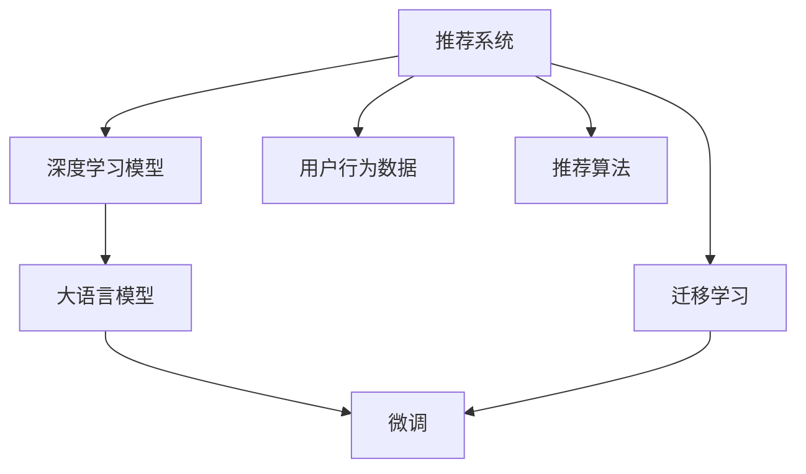

                 

# LLM对推荐系统可扩展性的影响

## 1. 背景介绍

推荐系统是互联网产品中最常见的技术之一，旨在通过分析用户的历史行为和兴趣，为用户推荐最相关的内容，提升用户体验和满意度。近年来，随着深度学习技术的发展，推荐系统已经逐步从基于规则、协同过滤等传统方法，转向使用深度神经网络模型，尤其是大语言模型(LLM)来处理和建模。然而，在实践中，我们发现，尽管LLM在提升推荐系统效果方面有着显著的优势，但在实际应用中，其可扩展性仍面临诸多挑战。本文将系统分析LLM对推荐系统可扩展性的影响，并提出相应的解决方案。

## 2. 核心概念与联系

### 2.1 核心概念概述

为更好地理解LLM在推荐系统中的应用，本节将介绍几个密切相关的核心概念：

- 推荐系统(Recommendation System, RS)：利用用户行为数据，推荐系统能够预测用户可能感兴趣的内容。推荐算法根据用户兴趣与内容的相似性进行排序，最终输出推荐结果。

- 深度学习模型(Deep Learning Model, DLM)：深度学习模型采用多层神经网络结构，通过大数据训练出复杂的特征表示，从而实现复杂的非线性建模。

- 大语言模型(Large Language Model, LLM)：以自回归(如GPT)或自编码(如BERT)模型为代表的大规模预训练语言模型。通过在大规模无标签文本语料上进行预训练，学习通用的语言表示，具备强大的语言理解和生成能力。

- 迁移学习(Transfer Learning)：指将一个领域学习到的知识，迁移应用到另一个不同但相关的领域的学习范式。大模型的预训练-微调过程即是一种典型的迁移学习方式。

- 微调(Fine-tuning)：指在预训练模型的基础上，使用下游任务的少量标注数据，通过有监督学习优化模型在特定任务上的性能。通常只需要调整顶层分类器或解码器，并以较小的学习率更新全部或部分的模型参数。

这些核心概念之间的逻辑关系可以通过以下Mermaid流程图来展示：



这个流程图展示了大语言模型在推荐系统中的角色，以及与推荐系统的核心概念之间的联系：

1. 推荐系统通过深度学习模型进行特征提取和相似度计算，以预测用户感兴趣的内容。
2. 深度学习模型可以通过大语言模型进行预训练，学习通用的语言表示，提升模型性能。
3. 大语言模型可以通过微调技术，针对推荐系统中的特定任务进行优化，进一步提升推荐效果。
4. 迁移学习可以通过预训练-微调的方式，将大语言模型知识迁移到推荐系统任务中。
5. 用户行为数据和推荐算法是推荐系统的两个核心组件，与大语言模型和微调技术紧密关联。

## 3. 核心算法原理 & 具体操作步骤

### 3.1 算法原理概述

LLM在推荐系统中的应用，主要体现在以下几个方面：

1. 特征提取：通过在大规模语料上进行预训练，LLM可以学习到丰富的语言知识，从而提高特征提取的质量和维度。

2. 自然语言处理：LLM可以处理用户的文本输入，理解用户意图，并将用户查询转换为推荐模型可理解的输入格式。

3. 推荐内容生成：LLM可以对推荐结果进行自然语言处理，生成符合用户预期和语言习惯的推荐内容。

4. 多模态融合：LLM可以与视觉、听觉等模态的信息进行融合，提升推荐结果的多样性和准确性。

5. 模型优化：通过微调技术，LLM可以针对推荐系统的特定任务进行优化，提升模型的泛化能力和性能。

### 3.2 算法步骤详解

以下是LLM在推荐系统中应用的详细步骤：

**Step 1: 数据准备**
- 收集用户行为数据，包括浏览历史、点击记录、评分等。
- 收集产品或内容数据，如商品信息、文本描述、图片等。
- 进行数据预处理，包括清洗、去重、填充缺失值等。

**Step 2: 特征工程**
- 使用LLM进行文本预训练，提取文本特征，如TF-IDF、词向量等。
- 将文本特征与用户行为数据进行拼接，形成输入特征向量。
- 使用深度学习模型进行特征映射，提取高维特征表示。

**Step 3: 模型训练**
- 将用户行为数据和特征向量输入推荐模型，训练模型参数。
- 使用微调技术，针对特定任务（如用户推荐、内容推荐、兴趣点推荐等）优化模型。
- 在验证集上评估模型性能，调整超参数。

**Step 4: 推荐服务**
- 对新用户输入的查询进行特征提取和转换。
- 使用微调后的模型进行内容预测和推荐。
- 对推荐结果进行后处理，包括排序、筛选、分页等。

**Step 5: 效果评估**
- 在测试集上评估推荐模型效果，如准确率、召回率、F1值等。
- 收集用户反馈，持续优化推荐策略。

### 3.3 算法优缺点

LLM在推荐系统中的应用，有以下优点：

1. 强大的语言理解能力：LLM可以理解自然语言查询，提升用户输入的准确性和效率。
2. 丰富的语义表示：LLM可以通过预训练学习到丰富的语言知识，提升特征提取的质量和维度。
3. 多模态融合：LLM可以与视觉、听觉等模态的信息进行融合，提升推荐结果的多样性和准确性。
4. 泛化能力：LLM可以在大规模语料上进行预训练，提升模型的泛化能力和鲁棒性。

然而，LLM在推荐系统中的应用也存在一些缺点：

1. 高计算需求：LLM的预训练和微调需要大量的计算资源和时间，尤其是在大规模语料上进行预训练时，计算开销巨大。
2. 内存占用大：LLM的参数量巨大，导致在推理时占用的内存资源较多。
3. 训练时间长：LLM的模型结构复杂，训练时间长，需要精心调参才能得到良好的效果。
4. 泛化效果有限：尽管LLM具有强大的预训练能力，但在特定领域的应用中，其泛化效果可能受到数据分布的影响。

### 3.4 算法应用领域

LLM在推荐系统中的应用，主要包括以下几个方面：

1. 文本推荐：使用LLM对用户评论、商品描述等文本进行预训练和特征提取，提升文本推荐的效果。
2. 自然语言问答：使用LLM对用户查询进行理解，预测用户感兴趣的内容，生成推荐结果。
3. 语音推荐：使用LLM对用户语音输入进行识别和理解，生成语音推荐结果。
4. 视觉推荐：使用LLM对图片内容进行理解，生成视觉推荐结果。
5. 多模态推荐：将视觉、语音、文本等多种模态的信息进行融合，生成更全面、多样化的推荐结果。

此外，LLM还可以与其他推荐技术（如协同过滤、基于规则推荐等）进行结合，提升推荐系统的综合性能。

## 4. 数学模型和公式 & 详细讲解 & 举例说明

### 4.1 数学模型构建

在推荐系统中，LLM通常用于特征提取和自然语言处理。假设我们有一个用户行为数据集 $D=\{(x_i, y_i)\}_{i=1}^N$，其中 $x_i$ 为特征向量，$y_i$ 为推荐标签。定义推荐模型为 $M_{\theta}:\mathcal{X} \rightarrow \mathcal{Y}$，其中 $\mathcal{X}$ 为特征空间，$\mathcal{Y}$ 为推荐标签空间，$\theta \in \mathbb{R}^d$ 为模型参数。

推荐模型的目标是最小化经验风险，即找到最优参数：

$$
\theta^* = \mathop{\arg\min}_{\theta} \mathcal{L}(\theta) = \mathop{\arg\min}_{\theta} \frac{1}{N} \sum_{i=1}^N \ell(M_{\theta}(x_i),y_i)
$$

其中 $\ell$ 为损失函数，通常采用交叉熵损失函数，用于衡量模型预测输出与真实标签之间的差异。

### 4.2 公式推导过程

以用户推荐任务为例，假设我们有一个用户 $u$ 对商品 $i$ 进行了浏览，且对商品 $j$ 进行了购买。定义用户对商品 $i$ 的评分 $r_{u,i} \in [0,1]$，推荐模型 $M_{\theta}$ 在特征向量 $x_u$ 上的预测为 $\hat{r}_{u,i}=M_{\theta}(x_u)$，则交叉熵损失函数为：

$$
\ell(M_{\theta}(x_u),r_{u,i}) = -r_{u,i}\log \hat{r}_{u,i} - (1-r_{u,i})\log (1-\hat{r}_{u,i})
$$

将用户行为数据和特征向量输入模型进行预测，得到预测评分 $\hat{r}_{u,i}$，则推荐模型的损失函数为：

$$
\mathcal{L}(\theta) = \frac{1}{N} \sum_{u,i} \ell(M_{\theta}(x_u),r_{u,i})
$$

在实践中，我们通常使用基于梯度的优化算法（如Adam、SGD等）来近似求解上述最优化问题。设 $\eta$ 为学习率，则参数的更新公式为：

$$
\theta \leftarrow \theta - \eta \nabla_{\theta}\mathcal{L}(\theta)
$$

其中 $\nabla_{\theta}\mathcal{L}(\theta)$ 为损失函数对参数 $\theta$ 的梯度，可通过反向传播算法高效计算。

### 4.3 案例分析与讲解

以文本推荐为例，假设我们有一个新闻推荐系统，可以使用LLM对用户评论和新闻文章进行预训练和特征提取，从而提升推荐效果。具体而言，我们可以按照以下步骤实现：

**Step 1: 数据准备**
- 收集用户评论和新闻文章。
- 清洗数据，去除噪音和重复内容。
- 填充缺失值，保证数据完整性。

**Step 2: 特征工程**
- 使用BERT模型对用户评论和新闻文章进行预训练，提取文本特征。
- 将文本特征与用户行为数据拼接，形成输入特征向量。
- 使用深度学习模型进行特征映射，提取高维特征表示。

**Step 3: 模型训练**
- 将用户行为数据和特征向量输入推荐模型，训练模型参数。
- 使用微调技术，针对用户推荐任务优化模型。
- 在验证集上评估模型性能，调整超参数。

**Step 4: 推荐服务**
- 对新用户输入的查询进行特征提取和转换。
- 使用微调后的模型进行内容预测和推荐。
- 对推荐结果进行后处理，包括排序、筛选、分页等。

**Step 5: 效果评估**
- 在测试集上评估推荐模型效果，如准确率、召回率、F1值等。
- 收集用户反馈，持续优化推荐策略。

## 5. 项目实践：代码实例和详细解释说明

### 5.1 开发环境搭建

在进行推荐系统开发前，我们需要准备好开发环境。以下是使用Python进行PyTorch开发的环境配置流程：

1. 安装Anaconda：从官网下载并安装Anaconda，用于创建独立的Python环境。

2. 创建并激活虚拟环境：
```bash
conda create -n pytorch-env python=3.8 
conda activate pytorch-env
```

3. 安装PyTorch：根据CUDA版本，从官网获取对应的安装命令。例如：
```bash
conda install pytorch torchvision torchaudio cudatoolkit=11.1 -c pytorch -c conda-forge
```

4. 安装Transformers库：
```bash
pip install transformers
```

5. 安装各类工具包：
```bash
pip install numpy pandas scikit-learn matplotlib tqdm jupyter notebook ipython
```

完成上述步骤后，即可在`pytorch-env`环境中开始推荐系统开发。

### 5.2 源代码详细实现

下面我们以文本推荐任务为例，给出使用Transformers库对BERT模型进行推荐系统微调的PyTorch代码实现。

首先，定义推荐任务的数据处理函数：

```python
from transformers import BertTokenizer
from torch.utils.data import Dataset
import torch

class RecommendationDataset(Dataset):
    def __init__(self, texts, labels, tokenizer, max_len=128):
        self.texts = texts
        self.labels = labels
        self.tokenizer = tokenizer
        self.max_len = max_len
        
    def __len__(self):
        return len(self.texts)
    
    def __getitem__(self, item):
        text = self.texts[item]
        label = self.labels[item]
        
        encoding = self.tokenizer(text, return_tensors='pt', max_length=self.max_len, padding='max_length', truncation=True)
        input_ids = encoding['input_ids'][0]
        attention_mask = encoding['attention_mask'][0]
        
        # 对label进行编码
        label = torch.tensor([label], dtype=torch.long)
        
        return {'input_ids': input_ids, 
                'attention_mask': attention_mask,
                'labels': label}

# 标签与id的映射
label2id = {0: 'not_recommend', 1: 'recommend'}
id2label = {v: k for k, v in label2id.items()}

# 创建dataset
tokenizer = BertTokenizer.from_pretrained('bert-base-cased')

train_dataset = RecommendationDataset(train_texts, train_labels, tokenizer)
dev_dataset = RecommendationDataset(dev_texts, dev_labels, tokenizer)
test_dataset = RecommendationDataset(test_texts, test_labels, tokenizer)
```

然后，定义模型和优化器：

```python
from transformers import BertForTokenClassification, AdamW

model = BertForTokenClassification.from_pretrained('bert-base-cased', num_labels=2)

optimizer = AdamW(model.parameters(), lr=2e-5)
```

接着，定义训练和评估函数：

```python
from torch.utils.data import DataLoader
from tqdm import tqdm
from sklearn.metrics import classification_report

device = torch.device('cuda') if torch.cuda.is_available() else torch.device('cpu')
model.to(device)

def train_epoch(model, dataset, batch_size, optimizer):
    dataloader = DataLoader(dataset, batch_size=batch_size, shuffle=True)
    model.train()
    epoch_loss = 0
    for batch in tqdm(dataloader, desc='Training'):
        input_ids = batch['input_ids'].to(device)
        attention_mask = batch['attention_mask'].to(device)
        labels = batch['labels'].to(device)
        model.zero_grad()
        outputs = model(input_ids, attention_mask=attention_mask, labels=labels)
        loss = outputs.loss
        epoch_loss += loss.item()
        loss.backward()
        optimizer.step()
    return epoch_loss / len(dataloader)

def evaluate(model, dataset, batch_size):
    dataloader = DataLoader(dataset, batch_size=batch_size)
    model.eval()
    preds, labels = [], []
    with torch.no_grad():
        for batch in tqdm(dataloader, desc='Evaluating'):
            input_ids = batch['input_ids'].to(device)
            attention_mask = batch['attention_mask'].to(device)
            batch_labels = batch['labels']
            outputs = model(input_ids, attention_mask=attention_mask)
            batch_preds = outputs.logits.argmax(dim=2).to('cpu').tolist()
            batch_labels = batch_labels.to('cpu').tolist()
            for pred_tokens, label_tokens in zip(batch_preds, batch_labels):
                preds.append(pred_tokens[:len(label_tokens)])
                labels.append(label_tokens)
                
    print(classification_report(labels, preds))
```

最后，启动训练流程并在测试集上评估：

```python
epochs = 5
batch_size = 16

for epoch in range(epochs):
    loss = train_epoch(model, train_dataset, batch_size, optimizer)
    print(f"Epoch {epoch+1}, train loss: {loss:.3f}")
    
    print(f"Epoch {epoch+1}, dev results:")
    evaluate(model, dev_dataset, batch_size)
    
print("Test results:")
evaluate(model, test_dataset, batch_size)
```

以上就是使用PyTorch对BERT进行文本推荐任务微调的完整代码实现。可以看到，得益于Transformers库的强大封装，我们可以用相对简洁的代码完成BERT模型的加载和微调。

### 5.3 代码解读与分析

让我们再详细解读一下关键代码的实现细节：

**RecommendationDataset类**：
- `__init__`方法：初始化文本、标签、分词器等关键组件。
- `__len__`方法：返回数据集的样本数量。
- `__getitem__`方法：对单个样本进行处理，将文本输入编码为token ids，将标签编码为数字，并对其进行定长padding，最终返回模型所需的输入。

**label2id和id2label字典**：
- 定义了标签与数字id之间的映射关系，用于将预测结果解码回真实的标签。

**训练和评估函数**：
- 使用PyTorch的DataLoader对数据集进行批次化加载，供模型训练和推理使用。
- 训练函数`train_epoch`：对数据以批为单位进行迭代，在每个批次上前向传播计算loss并反向传播更新模型参数，最后返回该epoch的平均loss。
- 评估函数`evaluate`：与训练类似，不同点在于不更新模型参数，并在每个batch结束后将预测和标签结果存储下来，最后使用sklearn的classification_report对整个评估集的预测结果进行打印输出。

**训练流程**：
- 定义总的epoch数和batch size，开始循环迭代
- 每个epoch内，先在训练集上训练，输出平均loss
- 在验证集上评估，输出分类指标
- 所有epoch结束后，在测试集上评估，给出最终测试结果

可以看到，PyTorch配合Transformers库使得BERT微调的代码实现变得简洁高效。开发者可以将更多精力放在数据处理、模型改进等高层逻辑上，而不必过多关注底层的实现细节。

当然，工业级的系统实现还需考虑更多因素，如模型的保存和部署、超参数的自动搜索、更灵活的任务适配层等。但核心的微调范式基本与此类似。

## 6. 实际应用场景

### 6.1 智能客服系统

智能客服系统是推荐系统在实际应用中的重要场景。智能客服系统能够自动化处理用户咨询，提升客户满意度和服务效率。

在技术实现上，可以使用LLM对用户输入进行理解，预测用户意图，并从知识库中检索出最佳答案。LLM可以处理自然语言输入，理解用户意图，并生成符合用户预期的回答。智能客服系统通过微调后的LLM模型，可以实现更高效、更自然的客户交互。

### 6.2 金融舆情监测

金融舆情监测系统需要实时监测市场舆论动向，及时发现潜在的金融风险。传统的人工监测方式成本高、效率低，难以应对海量信息爆发的挑战。使用LLM进行金融舆情监测，可以提升监测的准确性和时效性。

具体而言，可以收集金融领域相关的新闻、报道、评论等文本数据，并对其进行情感标注。在此基础上对预训练语言模型进行微调，使其能够自动判断文本的情感倾向，从而监测市场舆情变化趋势。微调后的模型可以在实时抓取的网络文本数据上，快速识别负面信息，发出预警，帮助金融机构及时应对风险。

### 6.3 个性化推荐系统

个性化推荐系统是推荐系统的重要应用场景，通过分析用户行为，推荐用户可能感兴趣的内容，提升用户体验和满意度。

在技术实现上，可以使用LLM对用户评论、商品描述等文本进行预训练和特征提取，从而提升推荐效果。LLM可以理解自然语言输入，预测用户兴趣点，生成个性化的推荐结果。个性化推荐系统通过微调后的LLM模型，可以实现更精准、更高效的内容推荐。

### 6.4 未来应用展望

随着LLM技术的发展，其在推荐系统中的应用前景更加广阔。未来，LLM将在以下方面进一步突破：

1. 跨领域迁移：通过微调技术，LLM可以迁移到不同的推荐领域，提升模型的跨领域泛化能力。
2. 多模态融合：LLM可以与视觉、语音等模态的信息进行融合，生成更全面、多样化的推荐结果。
3. 实时推理：通过优化推理算法，LLM可以实现实时推理，提升推荐系统的响应速度。
4. 个性化推荐：通过进一步优化推荐策略，LLM可以生成更加个性化的推荐结果，提升用户满意度。

总之，LLM在推荐系统中的应用将更加深入，提升推荐系统的性能和用户体验，推动AI技术的广泛应用。

## 7. 工具和资源推荐

### 7.1 学习资源推荐

为了帮助开发者系统掌握LLM在推荐系统中的应用，这里推荐一些优质的学习资源：

1. 《推荐系统实战》书籍：详细介绍了推荐系统的理论基础和实际应用，包括LLM在推荐系统中的应用。

2. CS442《推荐系统》课程：由斯坦福大学开设的推荐系统课程，涵盖推荐系统理论、算法和实践，适合深度学习初学者。

3. 《自然语言处理与深度学习》书籍：详细介绍了自然语言处理和深度学习技术，包括LLM在自然语言处理中的应用。

4. Google AI 博客：Google AI团队撰写的关于推荐系统、深度学习、自然语言处理等领域的博客，内容丰富、实用性强。

5. Kaggle竞赛：Kaggle平台上有许多推荐系统相关的竞赛，通过实战练习，可以更深入地理解推荐系统的实现和应用。

通过对这些资源的学习实践，相信你一定能够快速掌握LLM在推荐系统中的应用，并用于解决实际的推荐问题。

### 7.2 开发工具推荐

高效的开发离不开优秀的工具支持。以下是几款用于LLM推荐系统开发的常用工具：

1. PyTorch：基于Python的开源深度学习框架，灵活动态的计算图，适合快速迭代研究。大部分预训练语言模型都有PyTorch版本的实现。

2. TensorFlow：由Google主导开发的开源深度学习框架，生产部署方便，适合大规模工程应用。同样有丰富的预训练语言模型资源。

3. Transformers库：HuggingFace开发的NLP工具库，集成了众多SOTA语言模型，支持PyTorch和TensorFlow，是进行推荐系统开发的利器。

4. Weights & Biases：模型训练的实验跟踪工具，可以记录和可视化模型训练过程中的各项指标，方便对比和调优。与主流深度学习框架无缝集成。

5. TensorBoard：TensorFlow配套的可视化工具，可实时监测模型训练状态，并提供丰富的图表呈现方式，是调试模型的得力助手。

6. Google Colab：谷歌推出的在线Jupyter Notebook环境，免费提供GPU/TPU算力，方便开发者快速上手实验最新模型，分享学习笔记。

合理利用这些工具，可以显著提升LLM推荐系统的开发效率，加快创新迭代的步伐。

### 7.3 相关论文推荐

LLM在推荐系统中的应用，源于学界的持续研究。以下是几篇奠基性的相关论文，推荐阅读：

1. Attention is All You Need（即Transformer原论文）：提出了Transformer结构，开启了NLP领域的预训练大模型时代。

2. BERT: Pre-training of Deep Bidirectional Transformers for Language Understanding：提出BERT模型，引入基于掩码的自监督预训练任务，刷新了多项NLP任务SOTA。

3. Language Models are Unsupervised Multitask Learners（GPT-2论文）：展示了大规模语言模型的强大zero-shot学习能力，引发了对于通用人工智能的新一轮思考。

4. Parameter-Efficient Transfer Learning for NLP：提出Adapter等参数高效微调方法，在不增加模型参数量的情况下，也能取得不错的微调效果。

5. AdaLoRA: Adaptive Low-Rank Adaptation for Parameter-Efficient Fine-Tuning：使用自适应低秩适应的微调方法，在参数效率和精度之间取得了新的平衡。

这些论文代表了大语言模型在推荐系统中的发展脉络。通过学习这些前沿成果，可以帮助研究者把握学科前进方向，激发更多的创新灵感。

## 8. 总结：未来发展趋势与挑战

### 8.1 总结

本文对基于LLM的推荐系统进行了系统分析。首先阐述了LLM在推荐系统中的应用优势和计算瓶颈，明确了LLM对推荐系统可扩展性的影响。其次，从原理到实践，详细讲解了LLM在推荐系统中的应用步骤，给出了推荐系统开发的完整代码实例。同时，本文还广泛探讨了LLM在智能客服、金融舆情、个性化推荐等多个推荐系统应用场景中的作用，展示了LLM技术带来的革命性变化。最后，本文精选了LLM在推荐系统中的学习资源、开发工具和相关论文，力求为读者提供全方位的技术指引。

通过本文的系统梳理，可以看到，LLM在推荐系统中的应用前景广阔，其强大的语言理解和生成能力，使得推荐系统具备了更强的泛化能力和鲁棒性。未来，随着LLM技术的不断发展，推荐系统必将进入更加智能化、个性化和高效化的新阶段，为人类社会带来更多创新价值。

### 8.2 未来发展趋势

展望未来，LLM在推荐系统中的应用将呈现以下几个发展趋势：

1. 泛化能力提升：通过微调技术，LLM可以迁移到不同的推荐领域，提升模型的跨领域泛化能力。
2. 多模态融合：LLM可以与视觉、语音等模态的信息进行融合，生成更全面、多样化的推荐结果。
3. 实时推理：通过优化推理算法，LLM可以实现实时推理，提升推荐系统的响应速度。
4. 个性化推荐：通过进一步优化推荐策略，LLM可以生成更加个性化的推荐结果，提升用户满意度。
5. 跨领域迁移：LLM可以在不同领域之间进行迁移学习，提升模型的泛化能力和应用范围。
6. 轻量化模型：通过参数高效微调等方法，开发更轻量化、高效的LLM推荐模型，以适应资源受限的环境。

以上趋势凸显了LLM在推荐系统中的强大潜力。这些方向的探索发展，必将进一步提升推荐系统的性能和用户体验，推动AI技术的广泛应用。

### 8.3 面临的挑战

尽管LLM在推荐系统中的应用已经取得了显著成果，但在迈向更加智能化、普适化应用的过程中，仍面临诸多挑战：

1. 标注成本高昂：尽管微调可以减少对标注数据的依赖，但对于长尾应用场景，获取高质量标注数据的成本仍然较高。如何进一步降低标注成本，提高模型性能，仍是一个重要挑战。

2. 计算资源需求高：LLM的参数量巨大，训练和推理需要大量的计算资源和时间。如何在保证模型性能的前提下，优化计算资源的使用，是一个亟待解决的问题。

3. 模型鲁棒性不足：LLM面对域外数据时，泛化性能往往受到数据分布的影响。如何提升模型鲁棒性，避免灾难性遗忘，还需要更多理论和实践的积累。

4. 推理速度慢：LLM的推理速度较慢，难以满足实时推荐的需求。如何优化推理算法，提升推荐系统的响应速度，仍是一个重要的研究方向。

5. 可解释性不足：LLM在推荐系统中的应用，往往缺乏解释性。对于医疗、金融等高风险应用，算法的可解释性和可审计性尤为重要。

6. 安全性和隐私保护：LLM模型可能学习到有偏见、有害的信息，通过推荐系统传递到用户，产生误导性、歧视性的输出。如何保障用户隐私和安全，防止恶意用途，仍是一个重要问题。

### 8.4 研究展望

面对LLM在推荐系统应用中面临的挑战，未来的研究需要在以下几个方面寻求新的突破：

1. 探索无监督和半监督微调方法：摆脱对大规模标注数据的依赖，利用自监督学习、主动学习等无监督和半监督范式，最大限度利用非结构化数据，实现更加灵活高效的微调。

2. 研究参数高效和计算高效的微调范式：开发更加参数高效的微调方法，在固定大部分预训练参数的同时，只更新极少量的任务相关参数。同时优化微调模型的计算图，减少前向传播和反向传播的资源消耗，实现更加轻量级、实时性的部署。

3. 引入因果分析和博弈论工具：将因果分析方法引入微调模型，识别出模型决策的关键特征，增强输出解释的因果性和逻辑性。借助博弈论工具刻画人机交互过程，主动探索并规避模型的脆弱点，提高系统稳定性。

4. 纳入伦理道德约束：在模型训练目标中引入伦理导向的评估指标，过滤和惩罚有偏见、有害的输出倾向。同时加强人工干预和审核，建立模型行为的监管机制，确保输出符合人类价值观和伦理道德。

这些研究方向的探索，必将引领LLM在推荐系统中的应用迈向更高的台阶，为推荐系统的智能化、普适化、安全化提供新的技术路径。

## 9. 附录：常见问题与解答

**Q1: LLM在推荐系统中的应用优势是什么？**

A: LLM在推荐系统中的应用优势主要体现在以下几个方面：
1. 强大的语言理解能力：LLM可以理解自然语言查询，提升用户输入的准确性和效率。
2. 丰富的语义表示：LLM可以通过预训练学习到丰富的语言知识，提升特征提取的质量和维度。
3. 多模态融合：LLM可以与视觉、语音等模态的信息进行融合，提升推荐结果的多样性和准确性。
4. 泛化能力：LLM可以在大规模语料上进行预训练，提升模型的泛化能力和鲁棒性。

**Q2: 如何降低LLM在推荐系统中的计算需求？**

A: 降低LLM在推荐系统中的计算需求，可以采用以下方法：
1. 参数高效微调：只更新极少量的任务相关参数，减少计算开销。
2. 混合精度训练：将浮点模型转为定点模型，压缩存储空间，提高计算效率。
3. 模型压缩：通过知识蒸馏、剪枝等方法，压缩模型参数，减小计算资源需求。
4. 分布式训练：将模型训练任务分布到多个节点上，利用多机并行提升训练效率。
5. 模型裁剪：去除不必要的层和参数，减小模型尺寸，加快推理速度。

**Q3: 如何在推荐系统中应用LLM进行个性化推荐？**

A: 在推荐系统中应用LLM进行个性化推荐，可以采用以下方法：
1. 用户行为数据预处理：清洗、去重、填充缺失值，保证数据完整性。
2. 特征工程：使用LLM进行文本预训练，提取文本特征，如TF-IDF、词向量等。
3. 模型训练：将用户行为数据和特征向量输入推荐模型，训练模型参数。
4. 微调：使用微调技术，针对个性化推荐任务优化模型。
5. 推荐服务：对新用户输入的查询进行特征提取和转换，使用微调后的模型进行内容预测和推荐。

**Q4: 如何提高LLM在推荐系统中的模型鲁棒性？**

A: 提高LLM在推荐系统中的模型鲁棒性，可以采用以下方法：
1. 数据增强：通过回译、近义替换等方式扩充训练集，提升模型泛化能力。
2. 对抗训练：引入对抗样本，提高模型鲁棒性。
3. 正则化技术：使用L2正则、Dropout、Early Stopping等避免过拟合。
4. 参数高效微调：只更新少量任务相关参数，减小模型复杂度。
5. 自适应学习率：根据训练进度动态调整学习率，优化模型参数更新。

**Q5: 如何在推荐系统中实现跨领域迁移学习？**

A: 在推荐系统中实现跨领域迁移学习，可以采用以下方法：
1. 多任务学习：在预训练阶段，同时学习多个推荐任务的共同特征，提升跨领域迁移能力。
2. 联合微调：在微调阶段，同时更新多个推荐任务的模型参数，提升模型泛化能力。
3. 元学习：在推荐系统中引入元学习技术，快速迁移不同领域的知识。
4. 自监督学习：利用自监督学习任务，提升模型泛化能力和迁移能力。

通过这些问题和解答，相信你对LLM在推荐系统中的应用有了更深入的理解，并能够更好地应用于实际推荐系统开发中。

---

作者：禅与计算机程序设计艺术 / Zen and the Art of Computer Programming

