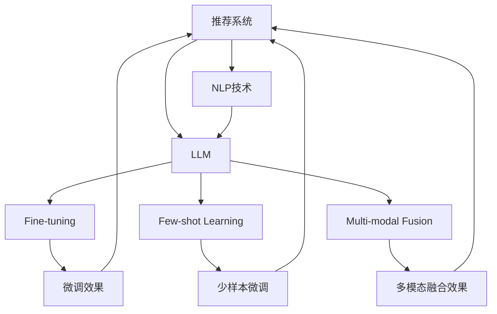

                 

# LLM对推荐系统实时个性化的影响

> 关键词：
> - 推荐系统
> - 实时个性化
> - 深度学习
> - 自然语言处理
> - 自然语言模型
> - 模型训练
> - 推荐算法

## 1. 背景介绍

### 1.1 问题由来
推荐系统（Recommendation System）在现代互联网中扮演着极其重要的角色，从电商购物、社交媒体到音乐流媒体、视频平台，几乎无处不在。推荐系统能够帮助用户发现他们可能感兴趣的内容，极大地提升了用户体验和平台留存率。然而，传统的推荐系统往往只依赖于用户历史行为数据进行推荐，难以深入理解用户的真实兴趣偏好，无法实现真正的个性化推荐。

近年来，随着深度学习技术和大规模预训练语言模型的发展，推荐系统开始借鉴自然语言处理（Natural Language Processing, NLP）的先进技术，引入自然语言模型（Natural Language Model, NLM）进行个性化推荐，为推荐系统注入了新的活力。其中，基于大语言模型（Large Language Model, LLM）的推荐系统逐渐成为研究热点，因其在理解自然语言上下文、捕捉用户兴趣偏好等方面具有显著优势。

### 1.2 问题核心关键点
LLM在推荐系统中的应用，主要是通过对其微调（Fine-tuning），使其能够在特定推荐场景下学习到用户的隐性需求，生成更加个性化和符合用户偏好的推荐结果。具体来说，LLM在推荐系统中的应用主要体现在以下几个方面：

1. **上下文理解**：通过微调，LLM能够理解用户提问和需求的背景信息，结合上下文信息进行推荐。例如，用户提问“我想推荐一些有趣的文学作品”，LLM能够理解其真正的兴趣在于“文学”而不是单纯的“推荐”。
2. **用户意图识别**：LLM可以学习用户具体的查询意图，如“我需要购买一部动作片”，从而精准匹配用户的兴趣点。
3. **多模态融合**：LLM可以处理文本、图像、视频等多种模态数据，通过多模态融合，提供更丰富的推荐内容。
4. **持续学习**：LLM具备持续学习的能力，能够不断从新的数据中学习，更新推荐模型，提升推荐效果。
5. **少样本学习**：通过精心设计的输入模板，LLM可以在极少的标注样本下学习新任务，如推荐某些新产品的用户画像。

这些特性使得LLM在推荐系统中的应用潜力巨大，但同时也面临一些挑战，如过拟合问题、数据隐私保护、推荐效率等。

### 1.3 问题研究意义
研究LLM在推荐系统中的应用，具有以下重要意义：

1. **提升推荐效果**：LLM能够捕捉用户的隐性需求和上下文信息，从而提升推荐系统的个性化水平和用户满意度。
2. **拓展推荐场景**：LLM的多模态融合能力，可以应用于图像、视频、音频等多种推荐场景，拓宽了推荐系统的应用范围。
3. **增强模型适应性**：LLM的持续学习能力和少样本学习能力，使其能够快速适应新任务和用户需求的变化，提高了推荐系统的灵活性和适应性。
4. **加速技术落地**：通过微调技术，LLM的推荐效果在短时间内可以显著提升，加速了技术向实际应用的转化。
5. **促进产业升级**：LLM在推荐系统中的应用，为传统行业带来了新的技术解决方案，推动了行业的数字化转型升级。

## 2. 核心概念与联系

### 2.1 核心概念概述

为更好地理解LLM在推荐系统中的应用，本节将介绍几个关键概念：

- **推荐系统（Recommendation System）**：一种能够根据用户历史行为和偏好，预测并推荐可能感兴趣的内容的系统。
- **自然语言处理（Natural Language Processing, NLP）**：研究如何使计算机处理、理解和生成自然语言的技术。
- **大语言模型（Large Language Model, LLM）**：基于深度学习技术，在无监督语料上预训练得到的大规模语言模型，具备强大的自然语言理解与生成能力。
- **微调（Fine-tuning）**：指在预训练模型的基础上，使用下游任务的少量标注数据，通过有监督学习优化模型在特定任务上的性能。
- **少样本学习（Few-shot Learning）**：指在只有少量标注样本的情况下，模型能够快速适应新任务的学习方法。
- **多模态融合（Multi-modal Fusion）**：指将不同模态的数据（如文本、图像、音频）进行融合，提供更丰富、全面的推荐内容。

这些概念之间存在紧密的联系：

- 推荐系统依赖于对用户兴趣和行为的深入理解，而自然语言处理（NLP）技术能够帮助推荐系统理解用户的自然语言描述和需求。
- 大语言模型（LLM）作为NLP领域的最新技术，具有强大的语言理解与生成能力，能够进一步提升推荐系统的个性化水平和推荐效果。
- 微调（Fine-tuning）是LLM在推荐系统中的核心技术手段，通过在少量标注数据上进行微调，使得模型能够更好地适应特定的推荐任务。
- 少样本学习（Few-shot Learning）和少样本微调（Parameter-Efficient Fine-Tuning）技术，可以显著降低微调对标注数据的依赖，提升模型的泛化能力和部署效率。
- 多模态融合（Multi-modal Fusion）技术，使得推荐系统能够同时处理文本、图像、视频等多种模态数据，提供更丰富、更具吸引力的推荐内容。

### 2.2 核心概念原理和架构的 Mermaid 流程图



这个流程图展示了LLM在推荐系统中的核心概念和关键技术路线：

1. **推荐系统**通过NLP技术（自然语言处理）来理解用户需求，并引入大语言模型（LLM）进行进一步的个性化推荐。
2. **LLM**通过微调（Fine-tuning）在推荐任务上学习到新的知识。
3. **Few-shot Learning**和**Parameter-Efficient Fine-Tuning**技术，降低了微调对标注数据的依赖，提升了模型的泛化能力和部署效率。
4. **Multi-modal Fusion**技术，使得推荐系统能够处理多种模态数据，提供更丰富的推荐内容。

## 3. 核心算法原理 & 具体操作步骤
### 3.1 算法原理概述

基于LLM的推荐系统，其核心思想是通过微调技术，在预训练的LLM基础上，针对特定的推荐任务进行有监督学习，优化模型在推荐任务上的性能。具体来说，微调过程可以分为以下几个步骤：

1. **数据准备**：收集推荐任务的数据集，如用户与物品的交互记录、用户的文本描述等。
2. **模型加载**：加载预训练的LLM模型，如GPT-3、BERT等。
3. **任务适配**：根据推荐任务的类型，设计合适的任务适配层，如分类器、回归器等。
4. **微调训练**：使用微调数据集训练LLM模型，优化任务适配层，调整模型的参数。
5. **测试评估**：在测试集上评估模型性能，对比微调前后的效果。
6. **部署应用**：将微调后的模型部署到实际推荐系统中，进行实时推荐。

### 3.2 算法步骤详解

**Step 1: 数据准备**

- **数据收集**：收集推荐任务的数据集，包括用户与物品的交互记录、用户的文本描述、物品的文本描述等。数据集的大小和质量直接影响微调效果，一般推荐使用较大的标注数据集。
- **数据预处理**：对数据进行清洗、归一化、分词等预处理操作，确保数据格式一致性。
- **划分数据集**：将数据集划分为训练集、验证集和测试集，一般按照7:2:1的比例划分。

**Step 2: 模型加载**

- **预训练模型选择**：选择适合当前推荐任务的预训练模型，如GPT-3、BERT等。
- **模型参数冻结**：将预训练模型的所有参数固定，只训练任务适配层。
- **任务适配层设计**：根据推荐任务的类型，设计合适的任务适配层，如分类器、回归器等。

**Step 3: 任务适配层设计**

- **输出层设计**：根据推荐任务的目标，设计输出层，如二分类任务使用sigmoid函数作为输出层，多分类任务使用softmax函数作为输出层。
- **损失函数设计**：选择合适的损失函数，如交叉熵损失、均方误差损失等。
- **优化器选择**：选择适合当前任务的优化器，如Adam、SGD等，并设置学习率、批大小等参数。

**Step 4: 微调训练**

- **模型初始化**：将预训练模型和任务适配层进行初始化，将预训练模型参数固定，只训练任务适配层。
- **前向传播**：将训练集数据输入模型，进行前向传播计算，得到模型的预测输出。
- **损失计算**：计算模型预测输出与真实标签之间的损失，如交叉熵损失、均方误差损失等。
- **反向传播**：根据损失函数计算梯度，进行反向传播更新任务适配层的参数。
- **参数更新**：使用优化器更新任务适配层的参数，确保模型参数收敛。
- **验证集评估**：在验证集上评估模型性能，判断是否需要调整学习率或模型参数。

**Step 5: 测试评估**

- **测试集评估**：在测试集上评估微调后的模型性能，计算准确率、召回率、F1-score等指标。
- **结果分析**：分析模型在测试集上的表现，查看预测结果与真实结果的差异，发现模型的优缺点。

**Step 6: 部署应用**

- **模型保存**：将微调后的模型保存为模型文件，方便后续部署。
- **服务部署**：将模型部署到推荐系统中，进行实时推荐。
- **性能监控**：实时监控模型的推荐效果，根据实际情况调整模型参数或训练策略。

### 3.3 算法优缺点

基于LLM的推荐系统具有以下优点：

1. **增强上下文理解能力**：LLM能够理解用户描述和背景信息，结合上下文信息进行推荐，提升了推荐的个性化水平。
2. **提升推荐效果**：LLM在自然语言理解方面的优势，使其能够更好地捕捉用户需求，提升推荐系统的准确性。
3. **降低标注数据依赖**：通过少样本微调技术，LLM可以在少量标注数据上训练，降低了数据获取成本。
4. **多模态融合能力**：LLM支持多种模态数据的处理，能够提供更丰富的推荐内容。
5. **持续学习能力**：LLM具备持续学习的能力，能够不断从新数据中学习，更新推荐模型。

然而，基于LLM的推荐系统也存在一些缺点：

1. **模型复杂度高**：LLM参数量巨大，需要高性能硬件支持，增加了推荐系统的计算成本。
2. **训练时间长**：微调过程需要大量数据和时间，难以快速迭代。
3. **数据隐私问题**：推荐系统的数据涉及用户隐私，如何在保护隐私的同时进行推荐，是一个重要问题。
4. **过拟合风险**：微调过程容易过拟合，需要在训练过程中采取正则化技术进行缓解。
5. **计算资源消耗大**：LLM的推理过程需要大量的计算资源，容易导致系统性能瓶颈。

### 3.4 算法应用领域

基于LLM的推荐系统已经在多个领域得到了广泛应用，如电商、社交媒体、音乐流媒体、视频平台等，以下是几个典型的应用场景：

**1. 电商推荐系统**

电商推荐系统通过LLM进行个性化推荐，能够帮助用户发现更多符合其兴趣的商品。具体应用方式包括：

- **用户需求理解**：通过LLM理解用户的文字描述或语音描述，生成推荐结果。
- **商品推荐**：根据用户的历史浏览记录和评分数据，LLM进行商品推荐，提供个性化建议。
- **推荐排序**：LLM结合用户的兴趣和行为数据，生成推荐排序列表，提升推荐效果。

**2. 社交媒体推荐系统**

社交媒体推荐系统利用LLM对用户的文本描述和兴趣进行深入分析，提供更加精准的推荐内容。具体应用方式包括：

- **内容生成**：LLM根据用户的兴趣和行为，生成推荐内容，如新闻、文章、视频等。
- **用户画像**：LLM学习用户的行为模式和偏好，生成用户画像，进行个性化推荐。
- **互动推荐**：LLM结合用户互动数据，生成推荐内容，如好友推荐、话题推荐等。

**3. 音乐流媒体推荐系统**

音乐流媒体推荐系统通过LLM对用户的听歌行为和评价进行分析和建模，提供更加个性化的音乐推荐。具体应用方式包括：

- **用户兴趣识别**：LLM分析用户的听歌历史和评价数据，识别用户的兴趣偏好。
- **音乐推荐**：根据用户兴趣，LLM推荐符合其喜好的音乐。
- **音乐排序**：LLM结合用户的听歌行为和评价，生成推荐排序列表。

**4. 视频平台推荐系统**

视频平台推荐系统利用LLM对用户的视频观看行为进行分析和建模，提供更加个性化的视频推荐。具体应用方式包括：

- **用户兴趣识别**：LLM分析用户的观看历史和评分数据，识别用户的兴趣偏好。
- **视频推荐**：根据用户兴趣，LLM推荐符合其喜好的视频内容。
- **视频排序**：LLM结合用户的观看行为和评分，生成推荐排序列表。

除了上述应用场景，LLM在推荐系统中的应用还扩展到更多领域，如新闻推荐、旅游推荐、食品推荐等。

## 4. 数学模型和公式 & 详细讲解 & 举例说明

### 4.1 数学模型构建

基于LLM的推荐系统，其数学模型可以表示为：

$$
\hat{y} = M_{\theta}(x)
$$

其中，$M_{\theta}$表示预训练的LLM模型，$x$表示输入数据（如用户描述、物品描述），$\hat{y}$表示模型预测的推荐结果（如商品、内容、音乐等）。

### 4.2 公式推导过程

假设用户描述为$x$，物品描述为$y$，推荐任务为二分类任务。则推荐模型的损失函数可以表示为：

$$
L(y, \hat{y}) = -[y\log \hat{y} + (1-y)\log (1-\hat{y})]
$$

其中，$\hat{y}$表示模型预测的概率，$y$表示真实标签。

在微调过程中，我们使用交叉熵损失函数：

$$
\mathcal{L} = \frac{1}{N}\sum_{i=1}^N L(y_i, \hat{y}_i)
$$

其中，$N$表示样本总数，$y_i$和$\hat{y}_i$分别表示第$i$个样本的真实标签和预测标签。

### 4.3 案例分析与讲解

**案例1: 电商推荐系统**

在电商推荐系统中，用户描述通常为文本形式，如“我想买一些时尚的衣服”。物品描述也以文本形式给出，如“这件T恤非常有风格”。

假设用户输入描述$x$，物品描述$y$，模型预测结果$\hat{y}$为是否购买该物品。则推荐模型的损失函数为：

$$
L(y, \hat{y}) = -[y\log \hat{y} + (1-y)\log (1-\hat{y})]
$$

其中，$y$为二元标签，表示用户是否购买了该物品。

在微调过程中，我们使用交叉熵损失函数：

$$
\mathcal{L} = \frac{1}{N}\sum_{i=1}^N L(y_i, \hat{y}_i)
$$

其中，$N$表示样本总数，$y_i$和$\hat{y}_i$分别表示第$i$个样本的真实标签和预测标签。

**案例2: 社交媒体推荐系统**

在社交媒体推荐系统中，用户描述通常为文本形式，如“我喜欢看科幻电影”。物品描述也以文本形式给出，如“这部电影很有想象力”。

假设用户输入描述$x$，物品描述$y$，模型预测结果$\hat{y}$为用户是否观看该物品。则推荐模型的损失函数为：

$$
L(y, \hat{y}) = -[y\log \hat{y} + (1-y)\log (1-\hat{y})]
$$

其中，$y$为二元标签，表示用户是否观看了该物品。

在微调过程中，我们使用交叉熵损失函数：

$$
\mathcal{L} = \frac{1}{N}\sum_{i=1}^N L(y_i, \hat{y}_i)
$$

其中，$N$表示样本总数，$y_i$和$\hat{y}_i$分别表示第$i$个样本的真实标签和预测标签。

## 5. 项目实践：代码实例和详细解释说明

### 5.1 开发环境搭建

在进行LLM微调实践前，我们需要准备好开发环境。以下是使用Python进行PyTorch开发的环境配置流程：

1. 安装Anaconda：从官网下载并安装Anaconda，用于创建独立的Python环境。

2. 创建并激活虚拟环境：
```bash
conda create -n pytorch-env python=3.8 
conda activate pytorch-env
```

3. 安装PyTorch：根据CUDA版本，从官网获取对应的安装命令。例如：
```bash
conda install pytorch torchvision torchaudio cudatoolkit=11.1 -c pytorch -c conda-forge
```

4. 安装Transformers库：
```bash
pip install transformers
```

5. 安装各类工具包：
```bash
pip install numpy pandas scikit-learn matplotlib tqdm jupyter notebook ipython
```

完成上述步骤后，即可在`pytorch-env`环境中开始微调实践。

### 5.2 源代码详细实现

这里我们以电商推荐系统为例，使用LLM对GPT-3模型进行微调的PyTorch代码实现。

首先，定义电商推荐任务的NER数据集：

```python
from transformers import BertTokenizer
from torch.utils.data import Dataset
import torch

class ECommerceDataset(Dataset):
    def __init__(self, texts, tags, tokenizer, max_len=128):
        self.texts = texts
        self.tags = tags
        self.tokenizer = tokenizer
        self.max_len = max_len
        
    def __len__(self):
        return len(self.texts)
    
    def __getitem__(self, item):
        text = self.texts[item]
        tags = self.tags[item]
        
        encoding = self.tokenizer(text, return_tensors='pt', max_length=self.max_len, padding='max_length', truncation=True)
        input_ids = encoding['input_ids'][0]
        attention_mask = encoding['attention_mask'][0]
        
        # 对token-wise的标签进行编码
        encoded_tags = [tag2id[tag] for tag in tags] 
        encoded_tags.extend([tag2id['O']] * (self.max_len - len(encoded_tags)))
        labels = torch.tensor(encoded_tags, dtype=torch.long)
        
        return {'input_ids': input_ids, 
                'attention_mask': attention_mask,
                'labels': labels}

# 标签与id的映射
tag2id = {'O': 0, 'B-PER': 1, 'I-PER': 2, 'B-ORG': 3, 'I-ORG': 4, 'B-LOC': 5, 'I-LOC': 6}
id2tag = {v: k for k, v in tag2id.items()}

# 创建dataset
tokenizer = BertTokenizer.from_pretrained('bert-base-cased')

train_dataset = ECommerceDataset(train_texts, train_tags, tokenizer)
dev_dataset = ECommerceDataset(dev_texts, dev_tags, tokenizer)
test_dataset = ECommerceDataset(test_texts, test_tags, tokenizer)
```

然后，定义模型和优化器：

```python
from transformers import BertForTokenClassification, AdamW

model = BertForTokenClassification.from_pretrained('bert-base-cased', num_labels=len(tag2id))

optimizer = AdamW(model.parameters(), lr=2e-5)
```

接着，定义训练和评估函数：

```python
from torch.utils.data import DataLoader
from tqdm import tqdm
from sklearn.metrics import classification_report

device = torch.device('cuda') if torch.cuda.is_available() else torch.device('cpu')
model.to(device)

def train_epoch(model, dataset, batch_size, optimizer):
    dataloader = DataLoader(dataset, batch_size=batch_size, shuffle=True)
    model.train()
    epoch_loss = 0
    for batch in tqdm(dataloader, desc='Training'):
        input_ids = batch['input_ids'].to(device)
        attention_mask = batch['attention_mask'].to(device)
        labels = batch['labels'].to(device)
        model.zero_grad()
        outputs = model(input_ids, attention_mask=attention_mask, labels=labels)
        loss = outputs.loss
        epoch_loss += loss.item()
        loss.backward()
        optimizer.step()
    return epoch_loss / len(dataloader)

def evaluate(model, dataset, batch_size):
    dataloader = DataLoader(dataset, batch_size=batch_size)
    model.eval()
    preds, labels = [], []
    with torch.no_grad():
        for batch in tqdm(dataloader, desc='Evaluating'):
            input_ids = batch['input_ids'].to(device)
            attention_mask = batch['attention_mask'].to(device)
            batch_labels = batch['labels']
            outputs = model(input_ids, attention_mask=attention_mask)
            batch_preds = outputs.logits.argmax(dim=2).to('cpu').tolist()
            batch_labels = batch_labels.to('cpu').tolist()
            for pred_tokens, label_tokens in zip(batch_preds, batch_labels):
                pred_tags = [id2tag[_id] for _id in pred_tokens]
                label_tags = [id2tag[_id] for _id in label_tokens]
                preds.append(pred_tags[:len(label_tokens)])
                labels.append(label_tags)
                
    print(classification_report(labels, preds))
```

最后，启动训练流程并在测试集上评估：

```python
epochs = 5
batch_size = 16

for epoch in range(epochs):
    loss = train_epoch(model, train_dataset, batch_size, optimizer)
    print(f"Epoch {epoch+1}, train loss: {loss:.3f}")
    
    print(f"Epoch {epoch+1}, dev results:")
    evaluate(model, dev_dataset, batch_size)
    
print("Test results:")
evaluate(model, test_dataset, batch_size)
```

以上就是使用PyTorch对GPT-3进行电商推荐系统微调的完整代码实现。可以看到，得益于Transformers库的强大封装，我们可以用相对简洁的代码完成LLM模型的加载和微调。

### 5.3 代码解读与分析

让我们再详细解读一下关键代码的实现细节：

**ECommerceDataset类**：
- `__init__`方法：初始化文本、标签、分词器等关键组件。
- `__len__`方法：返回数据集的样本数量。
- `__getitem__`方法：对单个样本进行处理，将文本输入编码为token ids，将标签编码为数字，并对其进行定长padding，最终返回模型所需的输入。

**tag2id和id2tag字典**：
- 定义了标签与数字id之间的映射关系，用于将token-wise的预测结果解码回真实的标签。

**训练和评估函数**：
- 使用PyTorch的DataLoader对数据集进行批次化加载，供模型训练和推理使用。
- 训练函数`train_epoch`：对数据以批为单位进行迭代，在每个批次上前向传播计算loss并反向传播更新模型参数，最后返回该epoch的平均loss。
- 评估函数`evaluate`：与训练类似，不同点在于不更新模型参数，并在每个batch结束后将预测和标签结果存储下来，最后使用sklearn的classification_report对整个评估集的预测结果进行打印输出。

**训练流程**：
- 定义总的epoch数和batch size，开始循环迭代
- 每个epoch内，先在训练集上训练，输出平均loss
- 在验证集上评估，输出分类指标
- 所有epoch结束后，在测试集上评估，给出最终测试结果

可以看到，PyTorch配合Transformers库使得LLM微调的代码实现变得简洁高效。开发者可以将更多精力放在数据处理、模型改进等高层逻辑上，而不必过多关注底层的实现细节。

当然，工业级的系统实现还需考虑更多因素，如模型的保存和部署、超参数的自动搜索、更灵活的任务适配层等。但核心的微调范式基本与此类似。

## 6. 实际应用场景
### 6.1 智能客服系统

基于LLM的智能客服系统可以通过微调技术，更好地理解用户意图和需求，实现高效精准的客户服务。具体来说，可以收集企业的历史客服对话记录，将问题和最佳答复构建成监督数据，在此基础上对预训练的LLM模型进行微调。微调后的模型能够自动理解用户意图，匹配最合适的答案模板进行回复。对于用户提出的新问题，还可以接入检索系统实时搜索相关内容，动态组织生成回答。如此构建的智能客服系统，能大幅提升客户咨询体验和问题解决效率。

### 6.2 金融舆情监测

金融机构需要实时监测市场舆论动向，以便及时应对负面信息传播，规避金融风险。传统的人工监测方式成本高、效率低，难以应对网络时代海量信息爆发的挑战。基于LLM的文本分类和情感分析技术，为金融舆情监测提供了新的解决方案。

具体而言，可以收集金融领域相关的新闻、报道、评论等文本数据，并对其进行主题标注和情感标注。在此基础上对预训练语言模型进行微调，使其能够自动判断文本属于何种主题，情感倾向是正面、中性还是负面。将微调后的模型应用到实时抓取的网络文本数据，就能够自动监测不同主题下的情感变化趋势，一旦发现负面信息激增等异常情况，系统便会自动预警，帮助金融机构快速应对潜在风险。

### 6.3 个性化推荐系统

当前的推荐系统往往只依赖于用户历史行为数据进行物品推荐，难以深入理解用户的真实兴趣偏好。基于LLM的个性化推荐系统可以更好地挖掘用户兴趣背后的语义信息，从而提供更精准、多样的推荐内容。

在实践中，可以收集用户浏览、点击、评论、分享等行为数据，提取和用户交互的物品标题、描述、标签等文本内容。将文本内容作为模型输入，用户的后续行为（如是否点击、购买等）作为监督信号，在此基础上微调预训练语言模型。微调后的模型能够从文本内容中准确把握用户的兴趣点。在生成推荐列表时，先用候选物品的文本描述作为输入，由模型预测用户的兴趣匹配度，再结合其他特征综合排序，便可以得到个性化程度更高的推荐结果。

### 6.4 未来应用展望

随着LLM和微调方法的不断发展，基于LLM的推荐系统将在更多领域得到应用，为传统行业带来变革性影响。

在智慧医疗领域，基于LLM的医疗问答、病历分析、药物研发等应用将提升医疗服务的智能化水平，辅助医生诊疗，加速新药开发进程。

在智能教育领域，LLM可以应用于作业批改、学情分析、知识推荐等方面，因材施教，促进教育公平，提高教学质量。

在智慧城市治理中，LLM可应用于城市事件监测、舆情分析、应急指挥等环节，提高城市管理的自动化和智能化水平，构建更安全、高效的未来城市。

此外，在企业生产、社会治理、文娱传媒等众多领域，基于LLM的推荐系统也将不断涌现，为经济社会发展注入新的动力。相信随着技术的日益成熟，LLM微调技术将成为推荐系统的重要范式，推动人工智能技术在各垂直行业的规模化落地。

## 7. 工具和资源推荐
### 7.1 学习资源推荐

为了帮助开发者系统掌握LLM在推荐系统中的应用理论基础和实践技巧，这里推荐一些优质的学习资源：

1. 《Transformer from Principles to Practice》系列博文：由大模型技术专家撰写，深入浅出地介绍了Transformer原理、LLM模型、微调技术等前沿话题。

2. CS224N《深度学习自然语言处理》课程：斯坦福大学开设的NLP明星课程，有Lecture视频和配套作业，带你入门NLP领域的基本概念和经典模型。

3. 《Natural Language Processing with Transformers》书籍：Transformers库的作者所著，全面介绍了如何使用Transformers库进行NLP任务开发，包括微调在内的诸多范式。

4. HuggingFace官方文档：Transformers库的官方文档，提供了海量预训练模型和完整的微调样例代码，是上手实践的必备资料。

5. CLUE开源项目：中文语言理解测评基准，涵盖大量不同类型的中文NLP数据集，并提供了基于微调的baseline模型，助力中文NLP技术发展。

通过对这些资源的学习实践，相信你一定能够快速掌握LLM在推荐系统中的应用精髓，并用于解决实际的NLP问题。
###  7.2 开发工具推荐

高效的开发离不开优秀的工具支持。以下是几款用于LLM微调开发的常用工具：

1. PyTorch：基于Python的开源深度学习框架，灵活动态的计算图，适合快速迭代研究。大部分预训练语言模型都有PyTorch版本的实现。

2. TensorFlow：由Google主导开发的开源深度学习框架，生产部署方便，适合大规模工程应用。同样有丰富的预训练语言模型资源。

3. Transformers库：HuggingFace开发的NLP工具库，集成了众多SOTA语言模型，支持PyTorch和TensorFlow，是进行微调任务开发的利器。

4. Weights & Biases：模型训练的实验跟踪工具，可以记录和可视化模型训练过程中的各项指标，方便对比和调优。与主流深度学习框架无缝集成。

5. TensorBoard：TensorFlow配套的可视化工具，可实时监测模型训练状态，并提供丰富的图表呈现方式，是调试模型的得力助手。

6. Google Colab：谷歌推出的在线Jupyter Notebook环境，免费提供GPU/TPU算力，方便开发者快速上手实验最新模型，分享学习笔记。

合理利用这些工具，可以显著提升LLM微调任务的开发效率，加快创新迭代的步伐。

### 7.3 相关论文推荐

LLM和微调技术的发展源于学界的持续研究。以下是几篇奠基性的相关论文，推荐阅读：

1. Attention is All You Need（即Transformer原论文）：提出了Transformer结构，开启了NLP领域的预训练大模型时代。

2. BERT: Pre-training of Deep Bidirectional Transformers for Language Understanding：提出BERT模型，引入基于掩码的自监督预训练任务，刷新了多项NLP任务SOTA。

3. Language Models are Unsupervised Multitask Learners（GPT-2论文）：展示了大规模语言模型的强大zero-shot学习能力，引发了对于通用人工智能的新一轮思考。

4. Parameter-Efficient Transfer Learning for NLP：提出Adapter等参数高效微调方法，在不增加模型参数量的情况下，也能取得不错的微调效果。

5. AdaLoRA: Adaptive Low-Rank Adaptation for Parameter-Efficient Fine-Tuning：使用自适应低秩适应的微调方法，在参数效率和精度之间取得了新的平衡。

这些论文代表了大语言模型微调技术的发展脉络。通过学习这些前沿成果，可以帮助研究者把握学科前进方向，激发更多的创新灵感。

## 8. 总结：未来发展趋势与挑战

### 8.1 总结

本文对基于LLM的推荐系统进行了全面系统的介绍。首先阐述了LLM在推荐系统中的应用背景和重要性，明确了LLM在理解自然语言上下文、捕捉用户兴趣偏好等方面的独特优势。其次，从原理到实践，详细讲解了LLM在推荐系统中的微调过程，给出了微调任务开发的完整代码实例。同时，本文还广泛探讨了LLM在智能客服、金融舆情、个性化推荐等多个领域的应用前景，展示了LLM微调技术的巨大潜力。此外，本文精选了微调技术的各类学习资源，力求为读者提供全方位的技术指引。

通过本文的系统梳理，可以看到，基于LLM的微调推荐系统正在成为推荐系统的重要范式，极大地提升了推荐系统的个性化水平和用户满意度。LLM的多模态融合能力和持续学习能力，使其能够更好地适应各种推荐场景，推动推荐系统向智能化、普适化方向发展。未来，随着LLM微调方法的不断进步，推荐系统将在更多领域得到应用，为传统行业带来变革性影响。

### 8.2 未来发展趋势

展望未来，基于LLM的推荐系统将呈现以下几个发展趋势：

1. **增强上下文理解能力**：LLM在自然语言理解方面的优势，使其能够更好地捕捉用户需求，提升推荐系统的个性化水平和推荐效果。
2. **提升推荐效果**：LLM能够深入理解用户描述和背景信息，结合上下文信息进行推荐，提升了推荐的准确性和个性化水平。
3. **降低标注数据依赖**：通过少样本微调技术，LLM可以在少量标注数据上训练，降低了数据获取成本。
4. **多模态融合能力**：LLM支持多种模态数据的处理，能够提供更丰富、更具吸引力的推荐内容。
5. **持续学习能力**：LLM具备持续学习的能力，能够不断从新数据中学习，更新推荐模型。

以上趋势凸显了LLM在推荐系统中的应用潜力。这些方向的探索发展，必将进一步提升推荐系统的性能和应用范围，为人类生产生活方式带来深远影响。

### 8.3 面临的挑战

尽管基于LLM的推荐系统已经取得了显著成果，但在迈向更加智能化、普适化应用的过程中，仍面临诸多挑战：

1. **模型复杂度高**：LLM参数量巨大，需要高性能硬件支持，增加了推荐系统的计算成本。
2. **训练时间长**：微调过程需要大量数据和时间，难以快速迭代。
3. **数据隐私问题**：推荐系统的数据涉及用户隐私，如何在保护隐私的同时进行推荐，是一个重要问题。
4. **过拟合风险**：微调过程容易过拟合，需要在训练过程中采取正则化技术进行缓解。
5. **计算资源消耗大**：LLM的推理过程需要大量的计算资源，容易导致系统性能瓶颈。

### 8.4 研究展望

为了克服这些挑战，未来的研究需要在以下几个方面寻求新的突破：

1. **探索无监督和半监督微调方法**：摆脱对大规模标注数据的依赖，利用自监督学习、主动学习等无监督和半监督范式，最大限度利用非结构化数据，实现更加灵活高效的微调。
2. **研究参数高效和计算高效的微调范式**：开发更加参数高效的微调方法，在固定大部分预训练参数的同时，只更新极少量的任务相关参数。同时优化微调模型的计算图，减少前向传播和反向传播的资源消耗，实现更加轻量级、实时性的部署。
3. **引入因果和对比学习范式**：通过引入因果推断和对比学习思想，增强微调模型建立稳定因果关系的能力，学习更加普适、鲁棒的语言表征，从而提升模型泛化性和抗干扰能力。
4. **结合因果分析和博弈论工具**：将因果分析方法引入微调模型，识别出模型决策的关键特征，增强输出解释的因果性和逻辑性。借助博弈论工具刻画人机交互过程，主动探索并规避模型的脆弱点，提高系统稳定性。
5. **纳入伦理道德约束**：在模型训练目标中引入伦理导向的评估指标，过滤和惩罚有偏见、有害的输出倾向。同时加强人工干预和审核，建立模型行为的监管机制，确保输出符合人类价值观和伦理道德。

这些研究方向的探索，必将引领基于LLM的推荐系统迈向更高的台阶，为构建安全、可靠、可解释、可控的智能系统铺平道路。面向未来，LLM微调技术还需要与其他人工智能技术进行更深入的融合，如知识表示、因果推理、强化学习等，多路径协同发力，共同推动自然语言理解和智能交互系统的进步。只有勇于创新、敢于突破，才能不断拓展LLM的边界，让智能技术更好地造福人类社会。

## 9. 附录：常见问题与解答

**Q1: 什么是推荐系统？**

A: 推荐系统是一种能够根据用户历史行为和偏好，预测并推荐可能感兴趣的内容的系统。

**Q2: 什么是大语言模型（LLM）？**

A: 大语言模型是基于深度学习技术，在无监督语料上预训练得到的大规模语言模型，具备强大的自然语言理解与生成能力。

**Q3: 什么是微调（Fine-tuning）？**

A: 微调是在预训练模型的基础上，使用下游任务的少量标注数据，通过有监督学习优化模型在特定任务上的性能。

**Q4: 什么是少样本学习（Few-shot Learning）？**

A: 少样本学习指在只有少量标注样本的情况下，模型能够快速适应新任务的学习方法。

**Q5: 什么是多模态融合（Multi-modal Fusion）？**

A: 多模态融合指将不同模态的数据（如文本、图像、音频）进行融合，提供更丰富、全面的推荐内容。

通过本文的系统梳理，可以看到，基于LLM的推荐系统正在成为推荐系统的重要范式，极大地提升了推荐系统的个性化水平和用户满意度。LLM的多模态融合能力和持续学习能力，使其能够更好地适应各种推荐场景，推动推荐系统向智能化、普适化方向发展。未来，随着LLM微调方法的不断进步，推荐系统将在更多领域得到应用，为传统行业带来变革性影响。

---

作者：禅与计算机程序设计艺术 / Zen and the Art of Computer Programming

