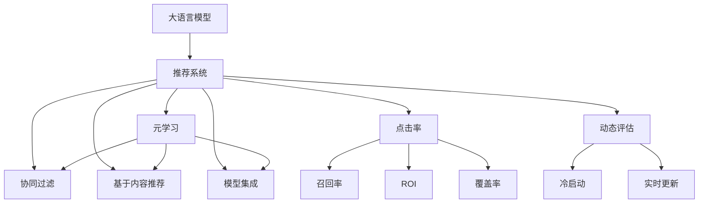

                 

# LLM对推荐系统评估指标的重新思考

> 关键词：大语言模型,推荐系统,评估指标,点击率,召回率,ROI,模型集成,元学习,动态评估,冷启动,实时更新

## 1. 背景介绍

### 1.1 问题由来
随着电子商务、数字媒体、在线内容平台等领域的迅猛发展，个性化推荐系统已经成为提高用户留存、提升转化率、增加收入的重要工具。推荐系统的目标是通过分析用户历史行为、物品属性、社交关系等数据，为用户提供符合其兴趣和需求的个性化推荐。

传统的推荐系统主要基于协同过滤、内容推荐、混合推荐等方法，但随着数据量和用户规模的扩大，这些方法逐渐面临模型复杂度高、训练成本大、效果提升空间有限等问题。与此同时，大语言模型（Large Language Model, LLM）技术的崛起，为推荐系统提供了新的视角和方法。

大语言模型通过大规模预训练，学习到丰富的语言表示能力，能够对自然语言进行语义理解、生成、推理等操作，是当前NLP领域最先进的技术之一。它已被应用于搜索、对话系统、知识图谱等诸多领域，并展现出良好的效果。然而，将大语言模型应用于推荐系统，仍面临诸多挑战，评估指标的选择和优化成为其中的关键问题。

## 2. 核心概念与联系

### 2.1 核心概念概述

为更好地理解LLM在推荐系统中的应用和评估，本节将介绍几个密切相关的核心概念：

- **大语言模型 (LLM)**：一种预训练的神经网络模型，通过在大规模无标签数据上进行自监督学习，学习到复杂的语言表示能力。常见的LLM包括BERT、GPT、XLNet等。

- **个性化推荐系统**：根据用户历史行为和兴趣，提供个性化的物品推荐，旨在提升用户满意度和转化率。传统推荐系统主要依赖协同过滤、基于内容的推荐等方法。

- **评估指标**：用于衡量推荐系统性能的各类指标，常见的有点击率、召回率、ROI、覆盖率等。评估指标的选择和优化对推荐系统的优化有重要影响。

- **点击率 (CTR)**：用户看到推荐结果并选择点击的概率，衡量推荐相关性。

- **召回率 (Recall)**：真实阳性样本被系统正确预测的比例，衡量推荐系统的全面性。

- **ROI (Revenue per Interactions)**：每次推荐带来的收入，衡量推荐系统的商业价值。

- **覆盖率 (Coverage)**：推荐结果中不同类别的物品数量占比，衡量推荐系统的多样性。

- **元学习 (Meta-Learning)**：在有限的训练样本上学习快速适应的模型，通过微调或重用预训练权重，提高模型的泛化能力。

- **动态评估 (Online Learning)**：在推荐系统上线后，持续根据用户行为数据进行模型评估和优化。

- **冷启动问题 (Cold-Start Problem)**：新用户或新物品没有足够的历史数据，推荐系统难以进行有效推荐。

- **实时更新 (Real-Time Update)**：在用户行为数据实时流入推荐系统时，及时调整模型，提高推荐效果。

这些核心概念之间的逻辑关系可以通过以下Mermaid流程图来展示：



这个流程图展示了LLM在推荐系统中的核心概念及其之间的关系：

1. LLM通过预训练获得基础能力。
2. 推荐系统使用协同过滤、内容推荐等传统方法。
3. LLM通过微调或重用预训练权重进行推荐。
4. 推荐系统使用多种评估指标进行性能评估。
5. 元学习提高了推荐系统的泛化能力。
6. 动态评估保证推荐系统持续优化。
7. 冷启动和实时更新是推荐系统的重要挑战。

## 3. 核心算法原理 & 具体操作步骤
### 3.1 算法原理概述

将大语言模型应用于推荐系统，本质上是一种基于内容的推荐方式。LLM通过预训练学习到丰富的语言表示能力，能够将物品描述、用户行为等转换为高维向量表示，通过相似度计算，找到最匹配的物品进行推荐。

形式化地，假设物品集合为 $\mathcal{I}$，用户集合为 $\mathcal{U}$，用户的交互行为表示为 $a_{u,i}$，表示用户 $u$ 与物品 $i$ 之间的互动次数。令 $r_{u,i}$ 为物品 $i$ 对用户 $u$ 的推荐相关性。模型的目标是最小化预测误差 $r_{u,i} - \hat{r}_{u,i}$，其中 $\hat{r}_{u,i}$ 为模型预测的推荐相关性。

使用基于二分类的逻辑回归模型，模型的输出为 $f_{u,i}$，其中 $f_{u,i} = \text{sigmoid}(w_u^T \cdot v_i + b)$，$w_u$ 和 $v_i$ 为用户的特征向量和物品的特征向量，$b$ 为偏置项。模型的损失函数为交叉熵损失函数，优化目标为：

$$
\min_{w,u,v} \sum_{(u,i)} (r_{u,i} - \hat{r}_{u,i}) \cdot f_{u,i}
$$

通过梯度下降等优化算法，不断更新模型参数，使得预测结果与真实标签尽量接近。

### 3.2 算法步骤详解

基于LLM的推荐系统，其核心算法步骤如下：

**Step 1: 准备数据集**
- 收集用户的历史行为数据，生成用户-物品的交互矩阵。
- 将物品描述、用户画像等信息输入LLM进行编码，生成高维向量表示。

**Step 2: 微调或重用预训练权重**
- 选择合适的预训练语言模型 $M_{\theta}$，如BERT、GPT 等。
- 如果数据集较小，可以微调模型权重，否则可以直接重用预训练权重。
- 根据具体任务，添加任务适配层，如线性分类器等。

**Step 3: 训练模型**
- 选择合适的优化算法，如Adam、SGD 等，设置学习率、批大小等参数。
- 使用交叉熵损失函数进行模型训练。
- 在训练过程中，可以使用正则化技术、Dropout等避免过拟合。

**Step 4: 评估模型**
- 使用测试集评估模型性能，常用的指标包括点击率、召回率等。
- 对于冷启动用户或物品，可以使用元学习等方法进行快速适应的推荐。

**Step 5: 实时更新**
- 在推荐系统上线后，实时根据用户行为数据更新模型参数。
- 动态评估推荐效果，及时优化模型，提高用户满意度。

### 3.3 算法优缺点

基于LLM的推荐系统具有以下优点：

1. 可解释性强。LLM能够生成符合自然语言逻辑的推荐描述，提供明确的推荐理由。
2. 泛化能力强。LLM通过大规模语料预训练，学习到丰富的语言表示能力，适用于各种类型的推荐任务。
3. 适应性强。LLM通过微调或重用预训练权重，能够快速适应新的推荐任务，提升推荐效果。

同时，该方法也存在一些局限性：

1. 数据需求大。LLM需要大量的文本数据进行预训练，数据获取成本较高。
2. 模型复杂度高。预训练模型的参数量较大，训练和推理的计算资源消耗较大。
3. 实时性差。预训练和微调过程耗时较长，难以实时更新推荐模型。
4. 过度依赖文本数据。LLM对文本数据的依赖较大，对于非文本数据形式的推荐任务（如图像、音频）效果有限。
5. 语义理解能力有限。LLM对某些语言现象（如双关语、俚语等）的理解能力有限，可能导致推荐偏差。

尽管存在这些局限性，但LLM在推荐系统中的应用潜力依然不可忽视。未来，通过技术创新和优化，相信LLM能够克服这些挑战，成为推荐系统的重要组成部分。

### 3.4 算法应用领域

基于LLM的推荐系统在电子商务、社交媒体、在线视频等多个领域都展现了其应用价值，具体如下：

- **电子商务**：通过大语言模型生成商品描述、评论摘要等内容，提升搜索结果和推荐效果。
- **社交媒体**：根据用户的评论、点赞等行为，生成相关话题、推荐文章等。
- **在线视频**：根据用户观看历史和评分，生成个性化视频推荐。
- **金融服务**：分析用户投融资记录，推荐适合的金融产品或服务。
- **旅游服务**：根据用户的浏览记录和评分，推荐旅游目的地或行程安排。

除了这些领域外，LLM在音乐、娱乐、教育、医疗等更多领域也有广阔的应用前景。

## 4. 数学模型和公式 & 详细讲解  
### 4.1 数学模型构建

为更好地展示基于LLM的推荐系统的数学模型，本节将使用数学语言进行详细描述。

假设推荐系统的目标为推荐用户 $u$ 对物品 $i$ 的点击行为，令 $y_{u,i}$ 表示用户对物品 $i$ 是否点击的标签，$y_{u,i} \in \{0, 1\}$。令 $x_{u,i}$ 为物品 $i$ 对用户 $u$ 的特征向量，$x_{u,i} \in \mathbb{R}^d$，其中 $d$ 为特征向量的维度。模型的输出为 $f_{u,i}$，其中 $f_{u,i} = \text{sigmoid}(x_{u,i}^T \cdot w + b)$，$w$ 为模型参数，$b$ 为偏置项。模型的损失函数为二分类交叉熵损失函数，目标为最小化预测误差，即：

$$
\min_{w,b} \sum_{(u,i)} -y_{u,i} \log f_{u,i} - (1-y_{u,i}) \log (1-f_{u,i})
$$

通过优化算法求解上述目标，即可得到最优的模型参数 $w$ 和 $b$。

### 4.2 公式推导过程

为了更好地理解推荐系统的数学模型，以下以二分类任务为例，推导交叉熵损失函数及其梯度的计算公式。

假设模型 $M_{\theta}$ 在输入 $x_{u,i}$ 上的输出为 $\hat{y}_{u,i}=M_{\theta}(x_{u,i}) \in [0,1]$，表示用户 $u$ 对物品 $i$ 是否点击的概率。真实标签 $y_{u,i} \in \{0,1\}$。则二分类交叉熵损失函数定义为：

$$
\ell(M_{\theta}(x),y) = -[y\log \hat{y} + (1-y)\log (1-\hat{y})]
$$

将其代入经验风险公式，得：

$$
\mathcal{L}(\theta) = -\frac{1}{N}\sum_{(u,i)} [y_{u,i}\log M_{\theta}(x_{u,i})+(1-y_{u,i})\log(1-M_{\theta}(x_{u,i}))
$$

根据链式法则，损失函数对参数 $\theta_k$ 的梯度为：

$$
\frac{\partial \mathcal{L}(\theta)}{\partial \theta_k} = -\frac{1}{N}\sum_{(u,i)} (\frac{y_{u,i}}{M_{\theta}(x_{u,i})}-\frac{1-y_{u,i}}{1-M_{\theta}(x_{u,i})}) \frac{\partial M_{\theta}(x_{u,i})}{\partial \theta_k}
$$

其中 $\frac{\partial M_{\theta}(x_{u,i})}{\partial \theta_k}$ 可进一步递归展开，利用自动微分技术完成计算。

在得到损失函数的梯度后，即可带入参数更新公式，完成模型的迭代优化。重复上述过程直至收敛，最终得到适应下游任务的最优模型参数 $\theta^*$。

## 5. 项目实践：代码实例和详细解释说明
### 5.1 开发环境搭建

在进行基于LLM的推荐系统开发前，我们需要准备好开发环境。以下是使用Python进行PyTorch开发的环境配置流程：

1. 安装Anaconda：从官网下载并安装Anaconda，用于创建独立的Python环境。

2. 创建并激活虚拟环境：
```bash
conda create -n pytorch-env python=3.8 
conda activate pytorch-env
```

3. 安装PyTorch：根据CUDA版本，从官网获取对应的安装命令。例如：
```bash
conda install pytorch torchvision torchaudio cudatoolkit=11.1 -c pytorch -c conda-forge
```

4. 安装Transformers库：
```bash
pip install transformers
```

5. 安装各类工具包：
```bash
pip install numpy pandas scikit-learn matplotlib tqdm jupyter notebook ipython
```

完成上述步骤后，即可在`pytorch-env`环境中开始推荐系统开发。

### 5.2 源代码详细实现

这里我们以基于大语言模型的推荐系统为例，给出使用Transformers库对BERT模型进行推荐系统开发的PyTorch代码实现。

首先，定义推荐任务的数据处理函数：

```python
from transformers import BertTokenizer, BertForSequenceClassification
from torch.utils.data import Dataset
import torch

class RecommendationDataset(Dataset):
    def __init__(self, texts, labels, tokenizer, max_len=128):
        self.texts = texts
        self.labels = labels
        self.tokenizer = tokenizer
        self.max_len = max_len
        
    def __len__(self):
        return len(self.texts)
    
    def __getitem__(self, item):
        text = self.texts[item]
        label = self.labels[item]
        
        encoding = self.tokenizer(text, return_tensors='pt', max_length=self.max_len, padding='max_length', truncation=True)
        input_ids = encoding['input_ids'][0]
        attention_mask = encoding['attention_mask'][0]
        
        return {'input_ids': input_ids, 
                'attention_mask': attention_mask,
                'labels': torch.tensor(label, dtype=torch.long)}
```

然后，定义模型和优化器：

```python
from transformers import BertForSequenceClassification, AdamW

model = BertForSequenceClassification.from_pretrained('bert-base-cased', num_labels=2)

optimizer = AdamW(model.parameters(), lr=2e-5)
```

接着，定义训练和评估函数：

```python
from torch.utils.data import DataLoader
from tqdm import tqdm
from sklearn.metrics import classification_report

device = torch.device('cuda') if torch.cuda.is_available() else torch.device('cpu')
model.to(device)

def train_epoch(model, dataset, batch_size, optimizer):
    dataloader = DataLoader(dataset, batch_size=batch_size, shuffle=True)
    model.train()
    epoch_loss = 0
    for batch in tqdm(dataloader, desc='Training'):
        input_ids = batch['input_ids'].to(device)
        attention_mask = batch['attention_mask'].to(device)
        labels = batch['labels'].to(device)
        model.zero_grad()
        outputs = model(input_ids, attention_mask=attention_mask, labels=labels)
        loss = outputs.loss
        epoch_loss += loss.item()
        loss.backward()
        optimizer.step()
    return epoch_loss / len(dataloader)

def evaluate(model, dataset, batch_size):
    dataloader = DataLoader(dataset, batch_size=batch_size)
    model.eval()
    preds, labels = [], []
    with torch.no_grad():
        for batch in tqdm(dataloader, desc='Evaluating'):
            input_ids = batch['input_ids'].to(device)
            attention_mask = batch['attention_mask'].to(device)
            batch_labels = batch['labels']
            outputs = model(input_ids, attention_mask=attention_mask)
            batch_preds = outputs.logits.argmax(dim=2).to('cpu').tolist()
            batch_labels = batch_labels.to('cpu').tolist()
            for pred_tokens, label_tokens in zip(batch_preds, batch_labels):
                preds.append(pred_tokens[:len(label_tokens)])
                labels.append(label_tokens)
                
    print(classification_report(labels, preds))
```

最后，启动训练流程并在测试集上评估：

```python
epochs = 5
batch_size = 16

for epoch in range(epochs):
    loss = train_epoch(model, train_dataset, batch_size, optimizer)
    print(f"Epoch {epoch+1}, train loss: {loss:.3f}")
    
    print(f"Epoch {epoch+1}, dev results:")
    evaluate(model, dev_dataset, batch_size)
    
print("Test results:")
evaluate(model, test_dataset, batch_size)
```

以上就是使用PyTorch对BERT进行推荐系统开发的完整代码实现。可以看到，得益于Transformers库的强大封装，我们可以用相对简洁的代码完成BERT模型的加载和微调。

### 5.3 代码解读与分析

让我们再详细解读一下关键代码的实现细节：

**RecommendationDataset类**：
- `__init__`方法：初始化文本、标签、分词器等关键组件。
- `__len__`方法：返回数据集的样本数量。
- `__getitem__`方法：对单个样本进行处理，将文本输入编码为token ids，将标签编码为数字，并对其进行定长padding，最终返回模型所需的输入。

**BertForSequenceClassification和AdamW**：
- 定义了BERT序列分类模型和AdamW优化器。序列分类模型适合处理长序列，能够对用户-物品的交互行为进行建模。AdamW优化器具有较好的收敛性能，适用于大规模模型的训练。

**训练和评估函数**：
- 使用PyTorch的DataLoader对数据集进行批次化加载，供模型训练和推理使用。
- 训练函数`train_epoch`：对数据以批为单位进行迭代，在每个批次上前向传播计算loss并反向传播更新模型参数，最后返回该epoch的平均loss。
- 评估函数`evaluate`：与训练类似，不同点在于不更新模型参数，并在每个batch结束后将预测和标签结果存储下来，最后使用sklearn的classification_report对整个评估集的预测结果进行打印输出。

**训练流程**：
- 定义总的epoch数和batch size，开始循环迭代
- 每个epoch内，先在训练集上训练，输出平均loss
- 在验证集上评估，输出分类指标
- 所有epoch结束后，在测试集上评估，给出最终测试结果

可以看到，PyTorch配合Transformers库使得BERT推荐系统的代码实现变得简洁高效。开发者可以将更多精力放在数据处理、模型改进等高层逻辑上，而不必过多关注底层的实现细节。

当然，工业级的系统实现还需考虑更多因素，如模型的保存和部署、超参数的自动搜索、更灵活的任务适配层等。但核心的微调范式基本与此类似。

## 6. 实际应用场景
### 6.1 电子商务推荐

基于大语言模型的推荐系统在电子商务领域展现出巨大的潜力。通过分析用户浏览、点击、购买等行为，推荐系统能够提供个性化商品推荐，提升用户体验和转化率。

具体而言，可以收集用户的历史浏览记录、购买记录等信息，生成用户画像，输入LLM进行编码，得到高维向量表示。将用户画像与商品描述、用户评价等信息进行相似度计算，生成个性化推荐列表。系统还可以实时根据用户的点击行为进行动态调整，提供实时更新的推荐。

### 6.2 社交媒体推荐

社交媒体平台如微博、Facebook等，通过用户的点赞、评论、分享等行为，能够生成丰富的用户画像和社交关系。基于LLM的推荐系统，能够根据用户的社交关系和兴趣偏好，推荐相关话题、文章、视频等内容，提升用户互动和平台粘性。

推荐系统可以分析用户评论、点赞等行为，生成推荐结果。同时，通过用户画像生成模板，进行相似度计算，提升推荐的准确性。系统还可以在用户阅读过程中实时生成推荐列表，提供多模态的推荐内容。

### 6.3 在线视频推荐

在线视频平台如Netflix、YouTube等，需要根据用户的观看历史、评分、评价等数据，推荐个性化视频内容。基于LLM的推荐系统，能够根据用户兴趣，生成符合预期的视频推荐，提升用户满意度和平台留存率。

推荐系统可以分析用户观看历史，生成用户画像，输入LLM进行编码，得到高维向量表示。将用户画像与视频描述、评分等信息进行相似度计算，生成个性化推荐列表。系统还可以根据用户的实时观看行为，动态生成推荐，提升推荐效果。

### 6.4 金融服务推荐

金融服务如银行、证券、保险等，需要根据用户投资、理财、保险等行为，推荐合适的金融产品和服务。基于LLM的推荐系统，能够根据用户的投资记录、评分、评价等数据，推荐合适的金融产品，提升用户满意度和转化率。

推荐系统可以分析用户的投资记录、评分等信息，生成用户画像，输入LLM进行编码，得到高维向量表示。将用户画像与金融产品描述、评分等信息进行相似度计算，生成个性化推荐列表。系统还可以根据用户的实时投资行为，动态生成推荐，提升推荐效果。

### 6.5 在线教育推荐

在线教育平台如Coursera、edX等，需要根据用户的学习行为、评价等数据，推荐合适的课程和教材。基于LLM的推荐系统，能够根据用户学习记录、评分、评价等数据，推荐合适的课程，提升用户满意度和学习效果。

推荐系统可以分析用户的学习记录、评分等信息，生成用户画像，输入LLM进行编码，得到高维向量表示。将用户画像与课程描述、评分等信息进行相似度计算，生成个性化推荐列表。系统还可以根据用户的实时学习行为，动态生成推荐，提升推荐效果。

### 6.6 实时动态推荐

实时动态推荐系统能够根据用户的实时行为数据，快速更新推荐模型，提供实时更新的推荐内容。这种推荐方式能够更好地反映用户当前的需求和偏好，提升推荐效果。

实时动态推荐系统可以分析用户的实时行为数据，如点击、浏览等，实时更新推荐模型。同时，系统可以采用在线学习等方法，不断优化推荐模型，提升推荐效果。

## 7. 工具和资源推荐
### 7.1 学习资源推荐

为了帮助开发者系统掌握基于LLM的推荐系统开发的技术，这里推荐一些优质的学习资源：

1. 《深度学习推荐系统》课程：由吴恩达教授主讲的斯坦福大学课程，深入讲解了推荐系统的基础理论和实践方法。

2. 《推荐系统实战》书籍：清华大学出版社出版的经典推荐系统教材，详细介绍了推荐系统的理论、算法和应用。

3. 《深度学习与推荐系统》博文系列：由大模型技术专家撰写，介绍基于深度学习的推荐系统开发，包括LLM的应用。

4. Weights & Biases：推荐系统的实验跟踪工具，可以记录和可视化模型训练过程中的各项指标，方便对比和调优。

5. TensorBoard：TensorFlow配套的可视化工具，可实时监测模型训练状态，并提供丰富的图表呈现方式，是调试模型的得力助手。

6. PyTorch官方文档：详细的PyTorch文档和样例代码，提供丰富的推荐系统开发资源。

通过对这些资源的学习实践，相信你一定能够快速掌握基于LLM的推荐系统开发的技术，并将其应用到实际业务中。

### 7.2 开发工具推荐

高效的开发离不开优秀的工具支持。以下是几款用于基于LLM的推荐系统开发的常用工具：

1. PyTorch：基于Python的开源深度学习框架，灵活动态的计算图，适合快速迭代研究。大部分预训练语言模型都有PyTorch版本的实现。

2. TensorFlow：由Google主导开发的开源深度学习框架，生产部署方便，适合大规模工程应用。同样有丰富的预训练语言模型资源。

3. Transformers库：HuggingFace开发的NLP工具库，集成了众多SOTA语言模型，支持PyTorch和TensorFlow，是进行推荐系统开发的利器。

4. Weights & Biases：模型训练的实验跟踪工具，可以记录和可视化模型训练过程中的各项指标，方便对比和调优。与主流深度学习框架无缝集成。

5. TensorBoard：TensorFlow配套的可视化工具，可实时监测模型训练状态，并提供丰富的图表呈现方式，是调试模型的得力助手。

6. Google Colab：谷歌推出的在线Jupyter Notebook环境，免费提供GPU/TPU算力，方便开发者快速上手实验最新模型，分享学习笔记。

合理利用这些工具，可以显著提升基于LLM的推荐系统开发效率，加快创新迭代的步伐。

### 7.3 相关论文推荐

基于LLM的推荐系统近年来取得了诸多突破，以下是几篇奠基性的相关论文，推荐阅读：

1. Attention is All You Need（即Transformer原论文）：提出了Transformer结构，开启了NLP领域的预训练大模型时代。

2. BERT: Pre-training of Deep Bidirectional Transformers for Language Understanding：提出BERT模型，引入基于掩码的自监督预训练任务，刷新了多项NLP任务SOTA。

3. Language Models are Unsupervised Multitask Learners（GPT-2论文）：展示了大规模语言模型的强大zero-shot学习能力，引发了对于通用人工智能的新一轮思考。

4. Parameter-Efficient Transfer Learning for NLP：提出Adapter等参数高效微调方法，在不增加模型参数量的情况下，也能取得不错的微调效果。

5. Causal Language Models：提出因果语言模型，能够捕捉语言中因果关系，提高推荐系统的逻辑性和可解释性。

6. Attentive Multi-Task Learning for Personalized Recommendation：提出多任务学习，在推荐系统中共享预训练知识，提升推荐效果。

这些论文代表了大语言模型在推荐系统中的最新进展，通过学习这些前沿成果，可以帮助研究者把握学科前进方向，激发更多的创新灵感。

## 8. 总结：未来发展趋势与挑战

### 8.1 总结

本文对基于大语言模型的推荐系统进行了全面系统的介绍。首先阐述了LLM在推荐系统中的应用和评估指标的选择，明确了微调在提升推荐系统性能方面的独特价值。其次，从原理到实践，详细讲解了基于LLM的推荐系统的数学模型和核心算法步骤，给出了推荐系统开发的完整代码实例。同时，本文还广泛探讨了LLM在电子商务、社交媒体、在线视频等多个领域的应用前景，展示了LLM在推荐系统中的巨大潜力。此外，本文精选了推荐系统的各类学习资源，力求为读者提供全方位的技术指引。

通过本文的系统梳理，可以看到，基于LLM的推荐系统正在成为推荐系统的重要组成部分，极大地拓展了推荐系统的应用边界，提高了推荐系统的性能和效果。未来，伴随LLM技术的不断进步，相信推荐系统必将在更多领域得到应用，为电商、社交、娱乐等传统行业带来变革性影响。

### 8.2 未来发展趋势

展望未来，基于LLM的推荐系统将呈现以下几个发展趋势：

1. 模型规模持续增大。随着算力成本的下降和数据规模的扩张，LLM的参数量还将持续增长。超大规模语言模型蕴含的丰富语言知识，有望支撑更加复杂多变的推荐任务。

2. 微调方法日趋多样。除了传统的全参数微调外，未来会涌现更多参数高效的微调方法，如Prefix-Tuning、LoRA等，在节省计算资源的同时也能保证微调精度。

3. 持续学习成为常态。随着数据分布的不断变化，LLM的微调模型也需要持续学习新知识以保持性能。如何在不遗忘原有知识的同时，高效吸收新样本信息，将成为重要的研究课题。

4. 标注样本需求降低。受启发于提示学习(Prompt-based Learning)的思路，未来的微调方法将更好地利用LLM的语言理解能力，通过更加巧妙的任务描述，在更少的标注样本上也能实现理想的微调效果。

5. 实时动态推荐崛起。传统的推荐系统通常采用离线训练和模型微调的方式，难以实时更新推荐内容。未来的推荐系统将采用在线学习等技术，实时动态更新模型，提供更个性化的推荐。

6. 多模态推荐兴起。当前的推荐系统主要聚焦于文本数据，但对于非文本数据形式的推荐任务（如图像、音频）效果有限。未来的推荐系统将融合多模态信息，实现视觉、语音等多模态信息与文本信息的协同建模。

以上趋势凸显了基于LLM的推荐系统的广阔前景。这些方向的探索发展，必将进一步提升推荐系统的性能和应用范围，为电商、社交、娱乐等传统行业带来变革性影响。

### 8.3 面临的挑战

尽管基于LLM的推荐系统已经取得了瞩目成就，但在迈向更加智能化、普适化应用的过程中，它仍面临着诸多挑战：

1. 数据需求大。LLM需要大量的文本数据进行预训练，数据获取成本较高。
2. 模型复杂度高。预训练模型的参数量较大，训练和推理的计算资源消耗较大。
3. 实时性差。预训练和微调过程耗时较长，难以实时更新推荐模型。
4. 过度依赖文本数据。LLM对文本数据的依赖较大，对于非文本数据形式的推荐任务（如图像、音频）效果有限。
5. 语义理解能力有限。LLM对某些语言现象（如双关语、俚语等）的理解能力有限，可能导致推荐偏差。
6. 可解释性不足。推荐系统的黑盒特性使得推荐决策缺乏可解释性，难以对其推理逻辑进行分析和调试。

尽管存在这些挑战，但LLM在推荐系统中的应用潜力依然不可忽视。未来，通过技术创新和优化，相信LLM能够克服这些挑战，成为推荐系统的重要组成部分。

### 8.4 研究展望

面对LLM在推荐系统中的挑战，未来的研究需要在以下几个方面寻求新的突破：

1. 探索无监督和半监督微调方法。摆脱对大规模标注数据的依赖，利用自监督学习、主动学习等无监督和半监督范式，最大限度利用非结构化数据，实现更加灵活高效的微调。

2. 研究参数高效和计算高效的微调范式。开发更加参数高效的微调方法，在固定大部分预训练参数的同时，只更新极少量的任务相关参数。同时优化微调模型的计算图，减少前向传播和反向传播的资源消耗，实现更加轻量级、实时性的部署。

3. 融合因果和对比学习范式。通过引入因果推断和对比学习思想，增强推荐系统的建立稳定因果关系的能力，学习更加普适、鲁棒的语言表征，从而提升推荐系统的泛化性和抗干扰能力。

4. 引入更多先验知识。将符号化的先验知识，如知识图谱、逻辑规则等，与神经网络模型进行巧妙融合，引导推荐系统的微调过程学习更准确、合理的语言模型。同时加强不同模态数据的整合，实现视觉、语音等多模态信息与文本信息的协同建模。

5. 结合因果分析和博弈论工具。将因果分析方法引入推荐系统，识别出推荐系统决策的关键特征，增强推荐系统的逻辑性和可解释性。借助博弈论工具刻画人机交互过程，主动探索并规避推荐系统的脆弱点，提高系统稳定性。

6. 纳入伦理道德约束。在模型训练目标中引入伦理导向的评估指标，过滤和惩罚有偏见、有害的输出倾向。同时加强人工干预和审核，建立推荐系统的监管机制，确保输出的安全性。

这些研究方向和技术的突破，必将引领基于LLM的推荐系统迈向更高的台阶，为推荐系统的智能化和普适化提供新的技术路径。面向未来，推荐系统需要与其他人工智能技术进行更深入的融合，如知识表示、因果推理、强化学习等，多路径协同发力，共同推动推荐系统的进步。只有勇于创新、敢于突破，才能不断拓展推荐系统的边界，让智能技术更好地服务于人类。

## 9. 附录：常见问题与解答

**Q1：大语言模型在推荐系统中的作用是什么？**

A: 大语言模型在推荐系统中的主要作用是通过预训练学习到丰富的语言表示能力，对用户行为和物品描述进行编码，生成高维向量表示。这些向量通过相似度计算，能够找到最匹配的物品进行推荐，提升推荐系统的性能和效果。

**Q2：如何选择推荐系统的评估指标？**

A: 推荐系统的评估指标应根据具体应用场景和业务目标进行选择。常见的评估指标包括点击率、召回率、ROI、覆盖率等。例如，在电子商务领域，点击率、转化率可能更为重要；在社交媒体领域，互动率、活跃度可能更为重要。同时，还可以结合用户反馈、系统成本等因素综合考虑。

**Q3：大语言模型在推荐系统中面临哪些挑战？**

A: 大语言模型在推荐系统中面临的主要挑战包括数据需求大、模型复杂度高、实时性差、过度依赖文本数据、语义理解能力有限等。这些问题需要通过数据增强、模型优化、实时动态推荐等技术手段加以解决。

**Q4：推荐系统如何应对冷启动问题？**

A: 推荐系统应对冷启动问题的方法包括预训练、元学习、混合推荐等。预训练可以利用已有的语料进行训练，获得初始推荐能力；元学习可以在有限数据下快速适应的推荐系统；混合推荐则通过结合传统推荐和LLM推荐，提升推荐效果。

**Q5：如何在推荐系统中进行实时动态推荐？**

A: 实时动态推荐系统通常采用在线学习等技术，实时根据用户行为数据更新推荐模型，提供实时更新的推荐内容。这需要构建实时数据流处理系统，采用在线学习算法，如FTRL、GPR等，及时调整推荐模型，提升推荐效果。

这些问题的解答可以帮助开发者更好地理解基于LLM的推荐系统的应用和优化，为实际应用提供指导和参考。

---

作者：禅与计算机程序设计艺术 / Zen and the Art of Computer Programming

