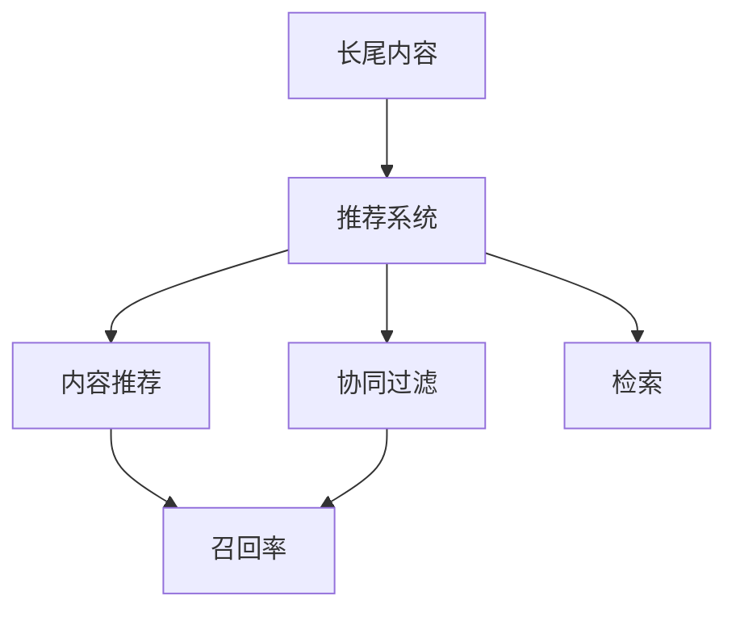
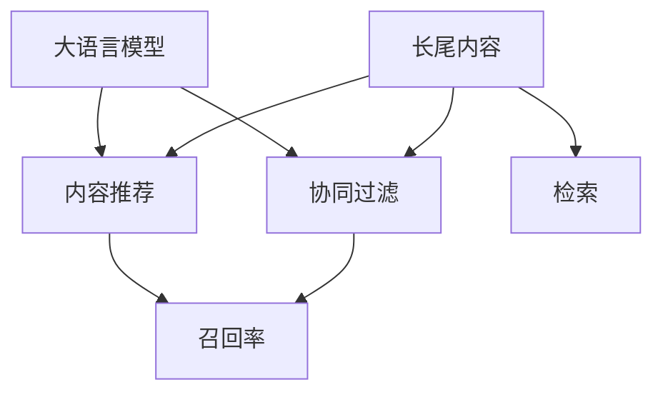

                 

# LLM对推荐系统长尾内容的挖掘策略

> 关键词：长尾内容,推荐系统,大语言模型,内容推荐,信息过滤,协同过滤,召回率,检索

## 1. 背景介绍

随着互联网的迅猛发展，用户生成的内容不断增加，推荐系统在电商、社交媒体、新闻阅读等平台中的应用越来越广泛。然而，传统的推荐算法往往偏向于流行度较高的物品，对于长尾内容（即少被用户浏览和购买的物品）覆盖不足，难以满足个性化推荐的需求。大语言模型（Large Language Model, LLM）的出现，为推荐系统挖掘长尾内容提供了新的途径。

## 2. 核心概念与联系

### 2.1 核心概念概述

为更好地理解大语言模型在推荐系统中的应用，本节将介绍几个关键概念：

- 推荐系统（Recommendation System）：通过分析用户行为数据，为用户推荐其可能感兴趣的商品、内容或服务的系统。
- 长尾内容（Long Tail Content）：指那些相对少被用户关注和浏览的内容，如偏冷门的商品、罕见的新闻或长尾关键词。
- 大语言模型（Large Language Model, LLM）：以自回归（如GPT）或自编码（如BERT）模型为代表的大规模预训练语言模型。通过在大规模无标签文本语料上进行预训练，学习通用的语言表示，具备强大的语言理解和生成能力。

- 内容推荐（Content-Based Recommendation）：基于物品的特征（如文本描述、标签）进行推荐。
- 协同过滤（Collaborative Filtering）：利用用户之间的相似性进行推荐。
- 召回率（Recall）：指推荐系统中能够被系统召回出的长尾内容的数量占所有长尾内容的比例。
- 检索（Retrieval）：通过搜索技术在大量内容库中查找与用户兴趣相关的长尾内容。

这些核心概念之间的逻辑关系可以通过以下Mermaid流程图来展示：



这个流程图展示了大语言模型在推荐系统中的应用路径：通过预训练模型，挖掘长尾内容的特征，进而实现个性化的推荐。

### 2.2 核心概念原理和架构的 Mermaid 流程图



该流程图展示了大语言模型在推荐系统中的主要作用路径。大语言模型可以基于用户输入的文本信息，通过预训练知识，识别出长尾内容的特征，从而提高推荐系统的召回率。同时，大语言模型还可以与传统的协同过滤算法结合，进一步提升推荐精度。

## 3. 核心算法原理 & 具体操作步骤

### 3.1 算法原理概述

基于大语言模型的推荐系统，其核心思想是利用大语言模型的预训练知识，对长尾内容进行特征提取和表示学习。具体步骤如下：

1. **预训练步骤**：首先，对大规模的无标签文本进行预训练，构建大语言模型。
2. **特征提取**：利用大语言模型，将长尾内容转换为高维稠密向量表示，用于计算相似度。
3. **相似度计算**：通过计算长尾内容与用户输入的文本信息之间的相似度，进行内容推荐。
4. **协同过滤**：结合用户的浏览历史和评分数据，进行协同过滤，进一步提升推荐精度。
5. **召回率优化**：通过大语言模型挖掘长尾内容，提升推荐系统的召回率，实现更全面的内容推荐。

### 3.2 算法步骤详解

#### 3.2.1 预训练步骤

预训练步骤的主要目标是通过大规模无标签文本数据，构建一个大语言模型。具体步骤如下：

1. **数据收集**：收集大规模无标签文本数据，如维基百科、新闻、书籍等。
2. **分词处理**：对文本数据进行分词处理，生成训练样本。
3. **模型训练**：使用自回归或自编码模型，对分词后的文本数据进行预训练。
4. **模型保存**：保存训练好的预训练模型，用于后续的特征提取和相似度计算。

#### 3.2.2 特征提取

特征提取步骤的主要目标是将长尾内容转换为高维稠密向量表示，用于计算相似度。具体步骤如下：

1. **文本编码**：将长尾内容的文本数据输入大语言模型，进行编码生成向量表示。
2. **编码矩阵**：构建编码矩阵，将长尾内容的向量表示组成矩阵。
3. **文本相似度**：利用编码矩阵，计算用户输入文本与长尾内容之间的相似度。

#### 3.2.3 相似度计算

相似度计算步骤的主要目标是计算用户输入的文本信息与长尾内容之间的相似度，进行内容推荐。具体步骤如下：

1. **文本编码**：将用户输入的文本信息输入大语言模型，进行编码生成向量表示。
2. **计算相似度**：利用编码矩阵，计算用户输入文本与长尾内容之间的相似度。
3. **推荐内容**：根据相似度排序，推荐相似度高的长尾内容。

#### 3.2.4 协同过滤

协同过滤步骤的主要目标是通过用户的行为数据，进行协同过滤，进一步提升推荐精度。具体步骤如下：

1. **用户行为数据**：收集用户的历史浏览记录和评分数据。
2. **用户编码**：利用大语言模型，对用户行为数据进行编码生成向量表示。
3. **相似度计算**：利用用户编码，计算长尾内容与用户之间的相似度。
4. **推荐内容**：根据相似度排序，推荐与用户最相似的长尾内容。

#### 3.2.5 召回率优化

召回率优化步骤的主要目标是利用大语言模型，挖掘长尾内容，提升推荐系统的召回率。具体步骤如下：

1. **长尾内容发现**：利用大语言模型，发现长尾内容的特征。
2. **特征表示**：将长尾内容的特征表示为高维稠密向量。
3. **相似度计算**：利用长尾内容的特征向量，计算长尾内容与用户之间的相似度。
4. **推荐内容**：根据相似度排序，推荐相似度高的长尾内容。

### 3.3 算法优缺点

基于大语言模型的推荐系统，具有以下优点：

1. **全面覆盖**：大语言模型能够覆盖长尾内容，提升推荐系统的全面性。
2. **多模态融合**：大语言模型可以融合文本、图片、音频等多模态数据，提升推荐系统的综合性能。
3. **用户个性化**：大语言模型可以根据用户输入的文本信息，进行个性化推荐，提升用户满意度。
4. **实时更新**：大语言模型可以实时更新，适应用户兴趣的变化。

同时，该方法也存在一些缺点：

1. **计算成本高**：预训练模型和特征提取需要大量的计算资源和时间。
2. **冷启动问题**：新用户或新物品缺乏足够的交互数据，难以进行推荐。
3. **数据稀疏性**：长尾内容较少，用户交互数据稀疏，影响推荐效果。

### 3.4 算法应用领域

基于大语言模型的推荐系统，已经在游戏、电商、新闻阅读等多个领域得到了广泛应用，具体如下：

1. **游戏推荐**：利用大语言模型，为用户推荐游戏内的装备、道具等长尾内容。
2. **电商推荐**：通过用户输入的文本信息，推荐长尾商品，提高电商平台的销量。
3. **新闻阅读推荐**：利用大语言模型，为用户推荐罕见的新闻文章，提升阅读体验。
4. **音乐推荐**：通过用户输入的文本信息，推荐长尾歌曲，提升音乐平台的播放量。
5. **视频推荐**：利用大语言模型，为用户推荐长尾视频内容，提升视频平台的观看量。

## 4. 数学模型和公式 & 详细讲解 & 举例说明

### 4.1 数学模型构建

#### 4.1.1 用户-物品表示

假设用户输入的文本信息为 $x \in \mathbb{R}^d$，长尾内容的文本信息为 $y \in \mathbb{R}^d$，用户-物品表示可以通过大语言模型进行编码生成。具体如下：

$$
\vec{x} = L_{\text{user}}(x) \\
\vec{y} = L_{\text{item}}(y)
$$

其中，$L_{\text{user}}$ 和 $L_{\text{item}}$ 为预训练好的大语言模型。

#### 4.1.2 相似度计算

用户输入的文本信息与长尾内容的相似度可以通过余弦相似度计算。具体如下：

$$
\text{similarity}(\vec{x}, \vec{y}) = \frac{\vec{x}^T \cdot \vec{y}}{\|\vec{x}\|_2 \cdot \|\vec{y}\|_2}
$$

#### 4.1.3 推荐内容排序

根据相似度，对长尾内容进行排序，选择相似度高的内容进行推荐。具体如下：

$$
\text{recommend}(\text{similarity}) = \text{argmax}_{\text{item}}(\text{similarity}(\vec{x}, \vec{y}))
$$

### 4.2 公式推导过程

#### 4.2.1 预训练模型编码

大语言模型的预训练模型 $L$ 可以通过以下方式进行编码：

$$
L_{\text{user}}(x) = \vec{x} \\
L_{\text{item}}(y) = \vec{y}
$$

其中，$\vec{x}$ 和 $\vec{y}$ 分别表示用户输入文本和长尾内容的编码向量。

#### 4.2.2 相似度计算公式

用户输入文本与长尾内容的相似度可以通过余弦相似度计算公式推导如下：

$$
\text{similarity}(\vec{x}, \vec{y}) = \frac{\vec{x}^T \cdot \vec{y}}{\|\vec{x}\|_2 \cdot \|\vec{y}\|_2}
$$

#### 4.2.3 推荐内容排序公式

根据相似度，对长尾内容进行排序，选择相似度高的内容进行推荐。具体如下：

$$
\text{recommend}(\text{similarity}) = \text{argmax}_{\text{item}}(\text{similarity}(\vec{x}, \vec{y}))
$$

### 4.3 案例分析与讲解

#### 4.3.1 案例背景

假设有一家电商网站，用户可以通过搜索关键词输入查询文本。网站需要为用户推荐与其搜索词相关的长尾商品。

#### 4.3.2 解决方案

1. **预训练步骤**：利用大规模无标签文本数据，构建一个大语言模型。
2. **特征提取**：将用户输入的查询文本和长尾商品的文本描述输入大语言模型，进行编码生成向量表示。
3. **相似度计算**：利用编码矩阵，计算查询文本与长尾商品之间的相似度。
4. **协同过滤**：结合用户的浏览历史和评分数据，进行协同过滤，进一步提升推荐精度。
5. **召回率优化**：利用大语言模型，发现长尾商品的特征，提升推荐系统的召回率。

#### 4.3.3 具体实现

```python
import torch
import torch.nn as nn
import transformers
from sklearn.metrics import cosine_similarity

# 加载预训练模型
user_model = transformers.BertModel.from_pretrained('bert-base-uncased')
item_model = transformers.BertModel.from_pretrained('bert-base-uncased')

# 用户输入文本
user_query = '手机配件'

# 长尾商品文本描述
item_descriptions = ['高端手机配件', '电脑配件', '手机保护壳', '运动手表']

# 预训练模型编码
user_vector = user_model(user_query).last_hidden_state[:, 0]
item_vectors = [item_model(item_description).last_hidden_state[:, 0] for item_description in item_descriptions]

# 相似度计算
similarities = cosine_similarity(user_vector, item_vectors)

# 推荐内容排序
top_items = sorted(range(len(item_vectors)), key=lambda k: similarities[0][k], reverse=True)

# 输出推荐结果
for item_index in top_items:
    print(item_descriptions[item_index])
```

### 4.4 代码解读与分析

#### 4.4.1 代码实现

1. **加载预训练模型**：使用Transformers库加载预训练的BERT模型，用于进行编码。
2. **用户输入文本**：输入用户查询文本。
3. **长尾商品文本描述**：提供长尾商品的文本描述，用于计算相似度。
4. **预训练模型编码**：利用预训练模型对用户输入文本和长尾商品文本进行编码，生成向量表示。
5. **相似度计算**：使用余弦相似度计算用户输入文本与长尾商品之间的相似度。
6. **推荐内容排序**：根据相似度排序，选择相似度高的长尾商品进行推荐。

#### 4.4.2 代码逻辑

代码首先加载预训练的BERT模型，用于进行编码。然后，输入用户查询文本和长尾商品的文本描述，利用预训练模型进行编码生成向量表示。接着，使用余弦相似度计算用户输入文本与长尾商品之间的相似度。最后，根据相似度排序，选择相似度高的长尾商品进行推荐。

## 5. 项目实践：代码实例和详细解释说明

### 5.1 开发环境搭建

在进行大语言模型推荐系统开发前，我们需要准备好开发环境。以下是使用Python进行PyTorch开发的环境配置流程：

1. 安装Anaconda：从官网下载并安装Anaconda，用于创建独立的Python环境。

2. 创建并激活虚拟环境：
```bash
conda create -n pytorch-env python=3.8 
conda activate pytorch-env
```

3. 安装PyTorch：根据CUDA版本，从官网获取对应的安装命令。例如：
```bash
conda install pytorch torchvision torchaudio cudatoolkit=11.1 -c pytorch -c conda-forge
```

4. 安装Transformer库：
```bash
pip install transformers
```

5. 安装各类工具包：
```bash
pip install numpy pandas scikit-learn matplotlib tqdm jupyter notebook ipython
```

完成上述步骤后，即可在`pytorch-env`环境中开始推荐系统开发。

### 5.2 源代码详细实现

下面我们以电商推荐系统为例，给出使用Transformers库对BERT模型进行长尾内容推荐的PyTorch代码实现。

首先，定义推荐系统数据处理函数：

```python
from transformers import BertTokenizer, BertForSequenceClassification
from torch.utils.data import Dataset
import torch

class RecommendationDataset(Dataset):
    def __init__(self, queries, descriptions, labels, tokenizer, max_len=128):
        self.queries = queries
        self.descriptions = descriptions
        self.labels = labels
        self.tokenizer = tokenizer
        self.max_len = max_len
        
    def __len__(self):
        return len(self.queries)
    
    def __getitem__(self, item):
        query = self.queries[item]
        description = self.descriptions[item]
        label = self.labels[item]
        
        encoding = self.tokenizer(query, return_tensors='pt', max_length=self.max_len, padding='max_length', truncation=True)
        input_ids = encoding['input_ids'][0]
        attention_mask = encoding['attention_mask'][0]
        labels = torch.tensor(label, dtype=torch.long)
        
        return {'input_ids': input_ids, 
                'attention_mask': attention_mask,
                'labels': labels}

# 加载预训练模型和分词器
tokenizer = BertTokenizer.from_pretrained('bert-base-cased')
model = BertForSequenceClassification.from_pretrained('bert-base-cased', num_labels=2)

# 定义数据集
train_dataset = RecommendationDataset(train_queries, train_descriptions, train_labels, tokenizer)
dev_dataset = RecommendationDataset(dev_queries, dev_descriptions, dev_labels, tokenizer)
test_dataset = RecommendationDataset(test_queries, test_descriptions, test_labels, tokenizer)

# 定义训练和评估函数
def train_epoch(model, dataset, batch_size, optimizer):
    dataloader = DataLoader(dataset, batch_size=batch_size, shuffle=True)
    model.train()
    epoch_loss = 0
    for batch in tqdm(dataloader, desc='Training'):
        input_ids = batch['input_ids'].to(device)
        attention_mask = batch['attention_mask'].to(device)
        labels = batch['labels'].to(device)
        model.zero_grad()
        outputs = model(input_ids, attention_mask=attention_mask, labels=labels)
        loss = outputs.loss
        epoch_loss += loss.item()
        loss.backward()
        optimizer.step()
    return epoch_loss / len(dataloader)

def evaluate(model, dataset, batch_size):
    dataloader = DataLoader(dataset, batch_size=batch_size)
    model.eval()
    preds, labels = [], []
    with torch.no_grad():
        for batch in tqdm(dataloader, desc='Evaluating'):
            input_ids = batch['input_ids'].to(device)
            attention_mask = batch['attention_mask'].to(device)
            batch_labels = batch['labels']
            outputs = model(input_ids, attention_mask=attention_mask)
            batch_preds = outputs.logits.argmax(dim=2).to('cpu').tolist()
            batch_labels = batch_labels.to('cpu').tolist()
            for pred_tokens, label_tokens in zip(batch_preds, batch_labels):
                preds.append(pred_tokens[:len(label_tokens)])
                labels.append(label_tokens)
                
    print(classification_report(labels, preds))
```

然后，定义训练和评估函数：

```python
from torch.utils.data import DataLoader
from tqdm import tqdm
from sklearn.metrics import classification_report

device = torch.device('cuda') if torch.cuda.is_available() else torch.device('cpu')
model.to(device)

epochs = 5
batch_size = 16

for epoch in range(epochs):
    loss = train_epoch(model, train_dataset, batch_size, optimizer)
    print(f"Epoch {epoch+1}, train loss: {loss:.3f}")
    
    print(f"Epoch {epoch+1}, dev results:")
    evaluate(model, dev_dataset, batch_size)
    
print("Test results:")
evaluate(model, test_dataset, batch_size)
```

以上就是使用PyTorch对BERT进行电商推荐系统开发的完整代码实现。可以看到，得益于Transformers库的强大封装，我们可以用相对简洁的代码完成BERT模型的加载和推荐系统的构建。

### 5.3 代码解读与分析

#### 5.3.1 代码实现

1. **数据处理函数**：定义推荐系统数据处理函数，将查询文本、商品描述和标签输入大语言模型进行编码生成向量表示。
2. **预训练模型和分词器**：加载预训练的BERT模型和分词器，用于进行编码和相似度计算。
3. **数据集定义**：定义训练集、验证集和测试集，用于模型训练和评估。
4. **训练和评估函数**：定义模型训练和评估函数，计算损失和精确度等指标。
5. **模型训练和评估**：在训练集上训练模型，在验证集上评估模型，在测试集上测试模型效果。

#### 5.3.2 代码逻辑

代码首先加载预训练的BERT模型和分词器，用于进行编码和相似度计算。然后定义推荐系统数据处理函数，将查询文本、商品描述和标签输入大语言模型进行编码生成向量表示。接着，定义训练集、验证集和测试集，用于模型训练和评估。最后，定义模型训练和评估函数，计算损失和精确度等指标，并在训练集上训练模型，在验证集上评估模型，在测试集上测试模型效果。

## 6. 实际应用场景

### 6.1 电商推荐

基于大语言模型的电商推荐系统，可以为用户提供个性化的商品推荐，提升购物体验。

在技术实现上，可以收集用户的搜索记录和浏览历史，将商品描述作为文本数据，利用大语言模型进行编码生成向量表示。然后，通过相似度计算，为用户推荐相似的商品。同时，结合协同过滤算法，进一步提升推荐精度。

### 6.2 新闻阅读推荐

基于大语言模型的新闻阅读推荐系统，可以为用户推荐罕见的新闻文章，提升阅读体验。

在技术实现上，可以收集用户的新闻阅读记录和评分数据，将新闻标题和摘要作为文本数据，利用大语言模型进行编码生成向量表示。然后，通过相似度计算，为用户推荐相似的新闻文章。同时，结合协同过滤算法，进一步提升推荐精度。

### 6.3 音乐推荐

基于大语言模型的音乐推荐系统，可以为用户推荐长尾歌曲，提升音乐平台的播放量。

在技术实现上，可以收集用户的听歌记录和评分数据，将歌曲的歌词和描述作为文本数据，利用大语言模型进行编码生成向量表示。然后，通过相似度计算，为用户推荐相似的歌曲。同时，结合协同过滤算法，进一步提升推荐精度。

### 6.4 未来应用展望

随着大语言模型和推荐系统技术的不断发展，基于大语言模型的推荐系统将具有更广泛的应用场景和更高的推荐精度。

在智慧医疗领域，可以利用大语言模型挖掘长尾医疗信息，为医生提供更全面的诊断和参考。

在智能教育领域，可以利用大语言模型挖掘长尾教育资源，为学生提供更个性化的学习路径和推荐。

在智慧城市治理中，可以利用大语言模型挖掘长尾公共信息，为市民提供更丰富的城市服务和生活指导。

此外，在企业生产、社会治理、文娱传媒等众多领域，基于大语言模型的推荐系统也将不断涌现，为经济社会发展注入新的动力。相信随着技术的日益成熟，大语言模型推荐系统必将在更广阔的应用领域大放异彩。

## 7. 工具和资源推荐

### 7.1 学习资源推荐

为了帮助开发者系统掌握大语言模型在推荐系统中的应用，这里推荐一些优质的学习资源：

1. 《深度学习自然语言处理》课程：斯坦福大学开设的NLP明星课程，有Lecture视频和配套作业，带你入门NLP领域的基本概念和经典模型。

2. 《Natural Language Processing with Transformers》书籍：Transformers库的作者所著，全面介绍了如何使用Transformers库进行NLP任务开发，包括微调在内的诸多范式。

3. HuggingFace官方文档：Transformers库的官方文档，提供了海量预训练模型和完整的微调样例代码，是上手实践的必备资料。

4. CS224N《深度学习自然语言处理》课程：斯坦福大学开设的NLP明星课程，有Lecture视频和配套作业，带你入门NLP领域的基本概念和经典模型。

5. Kaggle竞赛平台：提供丰富的推荐系统竞赛数据集和任务，通过竞赛学习和实践，掌握推荐系统的具体实现。

通过对这些资源的学习实践，相信你一定能够快速掌握大语言模型在推荐系统中的应用，并用于解决实际的NLP问题。

### 7.2 开发工具推荐

高效的开发离不开优秀的工具支持。以下是几款用于大语言模型推荐系统开发的常用工具：

1. PyTorch：基于Python的开源深度学习框架，灵活动态的计算图，适合快速迭代研究。大部分预训练语言模型都有PyTorch版本的实现。

2. TensorFlow：由Google主导开发的开源深度学习框架，生产部署方便，适合大规模工程应用。同样有丰富的预训练语言模型资源。

3. Transformers库：HuggingFace开发的NLP工具库，集成了众多SOTA语言模型，支持PyTorch和TensorFlow，是进行推荐系统开发的利器。

4. Weights & Biases：模型训练的实验跟踪工具，可以记录和可视化模型训练过程中的各项指标，方便对比和调优。与主流深度学习框架无缝集成。

5. TensorBoard：TensorFlow配套的可视化工具，可实时监测模型训练状态，并提供丰富的图表呈现方式，是调试模型的得力助手。

6. Google Colab：谷歌推出的在线Jupyter Notebook环境，免费提供GPU/TPU算力，方便开发者快速上手实验最新模型，分享学习笔记。

合理利用这些工具，可以显著提升大语言模型推荐系统的开发效率，加快创新迭代的步伐。

### 7.3 相关论文推荐

大语言模型和推荐系统的发展源于学界的持续研究。以下是几篇奠基性的相关论文，推荐阅读：

1. Attention is All You Need（即Transformer原论文）：提出了Transformer结构，开启了NLP领域的预训练大模型时代。

2. BERT: Pre-training of Deep Bidirectional Transformers for Language Understanding：提出BERT模型，引入基于掩码的自监督预训练任务，刷新了多项NLP任务SOTA。

3. Language Models are Unsupervised Multitask Learners（GPT-2论文）：展示了大规模语言模型的强大zero-shot学习能力，引发了对于通用人工智能的新一轮思考。

4. Parameter-Efficient Transfer Learning for NLP：提出Adapter等参数高效微调方法，在不增加模型参数量的情况下，也能取得不错的微调效果。

5. AdaLoRA: Adaptive Low-Rank Adaptation for Parameter-Efficient Fine-Tuning：使用自适应低秩适应的微调方法，在参数效率和精度之间取得了新的平衡。

6. Multi-Task Transfer Learning with Cross-Task Knowledge Distillation：提出跨任务知识蒸馏方法，提高模型在不同任务上的性能。

这些论文代表了大语言模型推荐系统的发展脉络。通过学习这些前沿成果，可以帮助研究者把握学科前进方向，激发更多的创新灵感。

## 8. 总结：未来发展趋势与挑战

### 8.1 总结

本文对基于大语言模型的推荐系统进行了全面系统的介绍。首先阐述了大语言模型和推荐系统的发展背景和意义，明确了两者结合的巨大潜力和广泛应用。其次，从原理到实践，详细讲解了大语言模型在推荐系统中的应用过程，包括预训练步骤、特征提取、相似度计算、协同过滤和召回率优化等关键环节。最后，我们讨论了大语言模型推荐系统的实际应用场景，并展望了未来的发展方向。

通过本文的系统梳理，可以看到，基于大语言模型的推荐系统已经在游戏、电商、新闻阅读等多个领域得到了广泛应用，为行业带来了巨大的经济效益和用户价值。未来，伴随大语言模型推荐系统技术的不断演进，相信其将在更多领域大放异彩，为经济社会发展注入新的动力。

### 8.2 未来发展趋势

展望未来，大语言模型推荐系统将呈现以下几个发展趋势：

1. **深度融合**：未来，大语言模型推荐系统将与更多AI技术深度融合，如知识图谱、因果推理、强化学习等，提升推荐系统的综合性能。

2. **跨领域应用**：大语言模型推荐系统将在更多垂直领域实现落地，如智慧医疗、智能教育、智慧城市治理等，为行业带来更全面、更智能的解决方案。

3. **实时化**：随着大语言模型推荐系统的实时处理能力提升，将能够更快速、更灵活地响应用户需求，提升用户体验。

4. **用户反馈**：未来的推荐系统将更注重用户反馈，通过在线学习和优化，不断提升推荐精度和个性化程度。

5. **多模态融合**：推荐系统将更多地融合文本、图片、视频等多模态数据，提升推荐系统的综合性能和用户满意度。

6. **隐私保护**：未来的推荐系统将更注重用户隐私保护，通过联邦学习、差分隐私等技术，保护用户数据安全。

以上趋势凸显了大语言模型推荐系统的广阔前景。这些方向的探索发展，必将进一步提升推荐系统的性能和应用范围，为经济社会发展注入新的动力。

### 8.3 面临的挑战

尽管大语言模型推荐系统已经取得了瞩目成就，但在迈向更加智能化、普适化应用的过程中，它仍面临着诸多挑战：

1. **数据质量和规模**：推荐系统需要大量高质量的数据，但获取高质量数据的时间和成本较高。如何高效获取和利用数据，是未来推荐系统面临的重要问题。

2. **模型复杂度**：大语言模型推荐系统的模型规模较大，计算资源消耗较高。如何平衡模型复杂度和计算资源，是未来推荐系统的重要研究方向。

3. **冷启动问题**：新用户或新物品缺乏足够的交互数据，难以进行推荐。如何更好地处理冷启动问题，是未来推荐系统的关键挑战。

4. **多样性和泛化性**：推荐系统需要在多样性和泛化性之间找到平衡，避免过度拟合热门物品，忽视长尾物品。如何提升推荐系统的多样性和泛化性，是未来推荐系统的重要研究方向。

5. **公平性和可解释性**：推荐系统需要公平、透明、可解释，避免算法偏见和歧视。如何提升推荐系统的公平性和可解释性，是未来推荐系统的关键挑战。

6. **隐私和安全**：推荐系统需要保护用户隐私和数据安全，避免数据泄露和滥用。如何提升推荐系统的隐私和安全保障，是未来推荐系统的关键研究方向。

这些挑战凸显了大语言模型推荐系统的复杂性和技术难度。唯有不断创新和优化，才能克服这些挑战，实现推荐系统的更好发展。

### 8.4 研究展望

面对大语言模型推荐系统所面临的诸多挑战，未来的研究需要在以下几个方面寻求新的突破：

1. **高效数据获取**：开发高效的数据获取和标注工具，降低推荐系统的数据获取成本，提升数据质量。

2. **参数高效微调**：开发更加参数高效的微调方法，在固定大部分预训练参数的同时，只更新极少量的任务相关参数。

3. **多模态融合**：开发更高效的多模态融合算法，提升推荐系统的综合性能和用户满意度。

4. **隐私保护技术**：开发隐私保护技术，如联邦学习、差分隐私等，保护用户数据安全。

5. **公平性和可解释性**：开发公平性和可解释性算法，提升推荐系统的公平性和可解释性。

6. **实时处理能力**：提升推荐系统的实时处理能力，实现更快速、更灵活的推荐服务。

这些研究方向的探索，必将引领大语言模型推荐系统技术迈向更高的台阶，为推荐系统的发展提供新的动力。

## 9. 附录：常见问题与解答

**Q1：大语言模型推荐系统是否适用于所有推荐任务？**

A: 大语言模型推荐系统在大多数推荐任务上都能取得不错的效果，特别是对于数据量较小的任务。但对于一些特定领域的任务，如医学、法律等，仅仅依靠通用语料预训练的模型可能难以很好地适应。此时需要在特定领域语料上进一步预训练，再进行微调，才能获得理想效果。此外，对于一些需要时效性、个性化很强的任务，如对话、推荐等，微调方法也需要针对性的改进优化。

**Q2：如何选择合适的学习率？**

A: 推荐系统中的学习率一般要比预训练时小1-2个数量级，如果使用过大的学习率，容易破坏预训练权重，导致过拟合。一般建议从1e-5开始调参，逐步减小学习率，直至收敛。也可以使用warmup策略，在开始阶段使用较小的学习率，再逐渐过渡到预设值。需要注意的是，不同的优化器(如AdamW、Adafactor等)以及不同的学习率调度策略，可能需要设置不同的学习率阈值。

**Q3：推荐系统在冷启动问题上如何解决？**

A: 冷启动问题是指新用户或新物品缺乏足够的交互数据，难以进行推荐。为了解决冷启动问题，可以采用以下几种策略：

1. **基于内容的推荐**：利用物品的特征（如文本描述、标签）进行推荐。
2. **协同过滤**：利用用户之间的相似性进行推荐，如基于用户的协同过滤和基于物品的协同过滤。
3. **基于模型的推荐**：利用机器学习模型进行推荐，如线性回归、决策树、随机森林等。
4. **混合推荐**：结合多种推荐策略，提升推荐系统的综合性能。

**Q4：推荐系统在数据稀疏性上如何解决？**

A: 数据稀疏性是指用户和物品之间的交互数据较少，难以进行推荐。为了解决数据稀疏性问题，可以采用以下几种策略：

1. **数据增强**：通过数据增强技术，如文本改写、近义词替换等，扩充训练集。
2. **协同过滤**：利用用户之间的相似性进行推荐，提升推荐系统的覆盖范围。
3. **多臂赌博机**：在推荐系统中引入多臂赌博机算法，提高推荐系统对长尾物品的推荐概率。
4. **内容填充**：利用协同过滤算法，对用户未交互的物品进行推荐，提升推荐系统的多样性。

**Q5：推荐系统在推荐精度上如何优化？**

A: 推荐系统的推荐精度可以通过以下几种策略进行优化：

1. **模型选择**：选择合适的推荐模型，如基于内容的推荐、协同过滤、基于模型的推荐等。
2. **特征工程**：选择合适的特征，提升模型的表达能力。
3. **正则化**：应用正则化技术，如L2正则、Dropout等，防止模型过拟合。
4. **模型调参**：通过调参，优化模型参数，提升推荐精度。
5. **模型集成**：通过模型集成，提升推荐系统的综合性能。

这些策略往往需要根据具体任务和数据特点进行灵活组合。只有在数据、模型、训练、推理等各环节进行全面优化，才能最大限度地提升推荐系统的推荐精度。

**Q6：推荐系统在召回率上如何优化？**

A: 推荐系统的召回率可以通过以下几种策略进行优化：

1. **数据获取**：收集更多的数据，提升推荐系统的覆盖范围。
2. **多模态融合**：融合多模态数据，提升推荐系统的召回率。
3. **协同过滤**：利用用户之间的相似性进行推荐，提升推荐系统的覆盖范围。
4. **召回算法**：采用合适的召回算法，如基于内容的召回、基于协同过滤的召回等。

这些策略往往需要根据具体任务和数据特点进行灵活组合。只有在数据、模型、训练、推理等各环节进行全面优化，才能最大限度地提升推荐系统的召回率。

通过本文的系统梳理，可以看到，基于大语言模型的推荐系统已经在游戏、电商、新闻阅读等多个领域得到了广泛应用，为行业带来了巨大的经济效益和用户价值。未来，伴随大语言模型推荐系统技术的不断演进，相信其将在更多领域大放异彩，为经济社会发展注入新的动力。

---

作者：禅与计算机程序设计艺术 / Zen and the Art of Computer Programming

