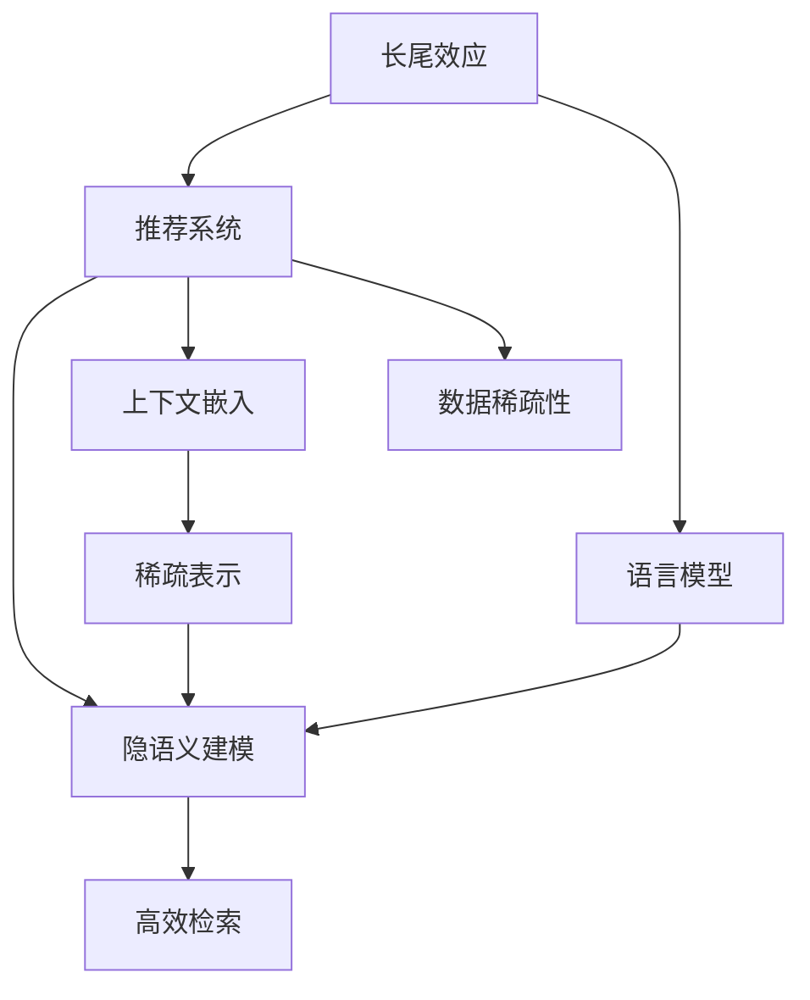

                 

# LLM对推荐系统长尾效应的缓解方案

> 关键词：长尾效应, 推荐系统, 语言模型, 个性化推荐, 隐语义建模, 上下文嵌入, 稀疏表示, 高效检索

## 1. 背景介绍

### 1.1 问题由来

随着推荐系统的发展，传统的基于协同过滤的推荐方法已无法满足用户的多样化需求。在大数据时代，推荐系统需要处理海量数据并给出个性化的推荐结果，但往往面临数据稀疏、用户兴趣多变等问题。这其中，长尾效应（Long Tail Effect）问题尤为突出。长尾效应指的是在推荐系统中，冷门小众物品的点击率往往远高于热门物品，即长尾物品的需求量占据了市场总需求的大部分。

传统推荐系统往往对长尾物品不够重视，尽管长尾物品的数量庞大，但总访问量往往只有热门物品的一小部分。长尾效应导致了推荐系统无法覆盖所有用户，尤其是对那些有特定需求的小众用户，他们的个性化需求被严重忽视。长尾物品的推荐问题，成为推荐系统优化和发展的重点和难点。

### 1.2 问题核心关键点

长尾效应问题具体表现在以下几个方面：
1. 数据稀疏性：用户-物品交互矩阵非常稀疏，大部分物品很少被用户点击过。
2. 长尾物品的冷门性：用户对冷门物品的点击率远低于热门物品。
3. 推荐算法对长尾物品的忽视：基于协同过滤的推荐算法更倾向于推荐热门物品，对长尾物品的推荐效果差。

## 2. 核心概念与联系

### 2.1 核心概念概述

为更好地理解长尾效应对推荐系统的影响以及如何缓解该问题，本文将介绍几个核心概念：

- 长尾效应（Long Tail Effect）：指在推荐系统中，冷门小众物品的点击率往往远高于热门物品，即长尾物品的需求量占据了市场总需求的大部分。
- 推荐系统（Recommendation System）：根据用户的历史行为和兴趣，推荐适合的物品。
- 语言模型（Language Model）：利用语言数据建立的概率模型，用于语言处理和理解。
- 隐语义建模（Latent Semantic Modeling）：通过矩阵分解等技术，揭示数据背后的隐含语义。
- 上下文嵌入（Context Embedding）：将上下文信息嵌入到向量空间，增强模型的表征能力。
- 稀疏表示（Sparse Representation）：将数据稀疏表示，以提高计算效率和模型泛化能力。
- 高效检索（Efficient Retrieval）：通过索引、倒排索引等技术，加速检索过程，提高推荐系统响应速度。

这些核心概念之间的逻辑关系可以通过以下Mermaid流程图来展示：



这个流程图展示了一些与长尾效应相关联的核心概念及其之间的关系：

1. 长尾效应是推荐系统面临的一个主要问题。
2. 语言模型用于理解用户需求和物品属性，是推荐系统的一个重要组成部分。
3. 隐语义建模揭示数据背后的语义信息，可以优化推荐系统。
4. 上下文嵌入利用上下文信息增强模型表征能力，有助于提升推荐效果。
5. 稀疏表示提高计算效率和模型泛化能力，是推荐系统优化的一个重要手段。
6. 高效检索通过加速检索过程，提高推荐系统响应速度，减少延迟。

## 3. 核心算法原理 & 具体操作步骤
### 3.1 算法原理概述

为缓解长尾效应问题，本文提出基于语言模型的推荐系统改进方案。核心思想是利用语言模型中的隐语义信息，对推荐系统进行优化。该方案主要包括以下几个步骤：

1. 用户兴趣表示：利用语言模型对用户兴趣进行建模，生成用户兴趣向量。
2. 物品属性表示：利用语言模型对物品属性进行建模，生成物品属性向量。
3. 隐语义相似度计算：通过矩阵分解等技术，计算用户兴趣向量和物品属性向量之间的相似度。
4. 上下文嵌入：将上下文信息嵌入到向量空间，增强模型的表征能力。
5. 稀疏表示：将数据稀疏表示，以提高计算效率和模型泛化能力。
6. 高效检索：通过索引、倒排索引等技术，加速检索过程，提高推荐系统响应速度。

### 3.2 算法步骤详解

1. 用户兴趣表示

   利用语言模型对用户兴趣进行建模，生成用户兴趣向量。具体步骤如下：
   - 收集用户的行为数据，如浏览、点击、评分等。
   - 利用自然语言处理技术，对行为数据进行预处理和特征提取。
   - 将处理后的数据输入语言模型，生成用户兴趣向量。

2. 物品属性表示

   利用语言模型对物品属性进行建模，生成物品属性向量。具体步骤如下：
   - 收集物品的属性数据，如商品描述、标签等。
   - 利用自然语言处理技术，对属性数据进行预处理和特征提取。
   - 将处理后的数据输入语言模型，生成物品属性向量。

3. 隐语义相似度计算

   通过矩阵分解等技术，计算用户兴趣向量和物品属性向量之间的相似度。具体步骤如下：
   - 构建用户兴趣向量和物品属性向量的相似度矩阵。
   - 使用奇异值分解（SVD）或潜在因子模型（Latent Factor Model）进行矩阵分解。
   - 计算相似度矩阵的特征值和特征向量，生成隐语义相似度向量。

4. 上下文嵌入

   将上下文信息嵌入到向量空间，增强模型的表征能力。具体步骤如下：
   - 收集物品的上下文信息，如相关物品、标签、评论等。
   - 利用自然语言处理技术，对上下文信息进行预处理和特征提取。
   - 将提取的特征输入语言模型，生成上下文嵌入向量。

5. 稀疏表示

   将数据稀疏表示，以提高计算效率和模型泛化能力。具体步骤如下：
   - 利用矩阵分解等技术，对数据进行稀疏表示。
   - 使用稀疏矩阵的矩阵-向量乘法，提高计算效率。
   - 使用稀疏表示方法，如基于随机梯度的稀疏表示方法，提高模型泛化能力。

6. 高效检索

   通过索引、倒排索引等技术，加速检索过程，提高推荐系统响应速度。具体步骤如下：
   - 构建索引表，将物品属性向量进行索引。
   - 使用倒排索引技术，快速定位与用户兴趣向量相似的物品。
   - 使用多路索引、异步检索等技术，提高检索效率。

### 3.3 算法优缺点

基于语言模型的推荐系统改进方案具有以下优点：
1. 缓解长尾效应问题：通过隐语义相似度计算，可以挖掘出冷门物品的潜在价值。
2. 提升推荐效果：上下文嵌入和稀疏表示可以提高模型的表征能力和泛化能力。
3. 提高计算效率：高效检索技术可以加速检索过程，减少推荐系统延迟。
4. 增强系统灵活性：语言模型具有较强的泛化能力，可以根据不同的应用场景进行优化。

同时，该方案也存在以下局限性：
1. 计算复杂度高：矩阵分解等技术计算复杂度较高，需要大规模硬件支持。
2. 数据预处理难度大：需要大量的数据预处理和特征提取，工作量较大。
3. 模型难以解释：语言模型的决策过程较为复杂，难以进行解释和调试。

尽管存在这些局限性，但就目前而言，基于语言模型的推荐系统改进方案仍是对长尾效应问题的一种有效缓解手段。未来相关研究的重点在于如何进一步降低计算复杂度，简化模型结构，增强模型可解释性。

### 3.4 算法应用领域

基于语言模型的推荐系统改进方案已经在多个领域得到了应用，例如：

1. 电商推荐：利用语言模型对用户兴趣和物品属性进行建模，推荐用户感兴趣的冷门商品。
2. 内容推荐：如新闻、音乐、视频等，通过语言模型挖掘用户兴趣和内容特征，推荐符合用户喜好的内容。
3. 社交推荐：如微博、抖音等，利用语言模型对用户行为进行建模，推荐好友关系网中的冷门内容。
4. 旅游推荐：利用语言模型对景点和用户兴趣进行建模，推荐符合用户喜好的冷门景点。
5. 金融推荐：如股票、基金等，利用语言模型对用户投资行为和产品属性进行建模，推荐符合用户偏好的投资产品。

除了上述这些经典应用外，语言模型还可以在更多场景中得到应用，如智能客服、智慧城市、智能家居等，为推荐系统带来新的突破。随着语言模型的不断演进，相信推荐系统将更加智能、高效，为用户提供更优质的服务。

## 4. 数学模型和公式 & 详细讲解  
### 4.1 数学模型构建

本文将使用数学语言对基于语言模型的推荐系统改进方案进行更加严格的刻画。

记用户兴趣向量为 $U \in \mathbb{R}^d$，物品属性向量为 $I \in \mathbb{R}^d$，隐语义相似度向量为 $H \in \mathbb{R}^d$，上下文嵌入向量为 $C \in \mathbb{R}^d$，稀疏表示向量为 $S \in \mathbb{R}^d$。

定义用户兴趣和物品属性的相似度为 $X = U \cdot I$，其中 $\cdot$ 表示向量的点乘。设相似度矩阵为 $X_{N \times N}$，其中 $N$ 为物品总数。

利用奇异值分解（SVD）对相似度矩阵 $X$ 进行分解，得到特征向量 $U_s \in \mathbb{R}^d$ 和 $V_s \in \mathbb{R}^d$，其中 $d$ 为向量维度。

定义隐语义相似度为 $H = U_s \cdot V_s$，利用隐语义相似度向量 $H$ 更新用户兴趣和物品属性的向量表示。

设用户兴趣向量为 $U' \in \mathbb{R}^d$，物品属性向量为 $I' \in \mathbb{R}^d$，上下文嵌入向量为 $C' \in \mathbb{R}^d$，稀疏表示向量为 $S' \in \mathbb{R}^d$。

设 $H' = H \cdot C'$，利用上下文嵌入和稀疏表示更新用户兴趣和物品属性的向量表示。

### 4.2 公式推导过程

以下我们以二分类任务为例，推导基于语言模型的推荐系统改进方案的数学模型。

设用户兴趣向量为 $U \in \mathbb{R}^d$，物品属性向量为 $I \in \mathbb{R}^d$，隐语义相似度向量为 $H \in \mathbb{R}^d$，上下文嵌入向量为 $C \in \mathbb{R}^d$，稀疏表示向量为 $S \in \mathbb{R}^d$。

定义用户兴趣和物品属性的相似度为 $X = U \cdot I$，其中 $\cdot$ 表示向量的点乘。设相似度矩阵为 $X_{N \times N}$，其中 $N$ 为物品总数。

利用奇异值分解（SVD）对相似度矩阵 $X$ 进行分解，得到特征向量 $U_s \in \mathbb{R}^d$ 和 $V_s \in \mathbb{R}^d$，其中 $d$ 为向量维度。

定义隐语义相似度为 $H = U_s \cdot V_s$，利用隐语义相似度向量 $H$ 更新用户兴趣和物品属性的向量表示。

设用户兴趣向量为 $U' \in \mathbb{R}^d$，物品属性向量为 $I' \in \mathbb{R}^d$，上下文嵌入向量为 $C' \in \mathbb{R}^d$，稀疏表示向量为 $S' \in \mathbb{R}^d$。

设 $H' = H \cdot C'$，利用上下文嵌入和稀疏表示更新用户兴趣和物品属性的向量表示。

设推荐结果向量为 $R \in \mathbb{R}^N$，其中 $R_i$ 表示第 $i$ 个物品的推荐得分。

设物品的权重向量为 $W \in \mathbb{R}^N$，表示物品的重要程度。

设用户兴趣向量的权重为 $u \in \mathbb{R}^d$，物品属性向量的权重为 $i \in \mathbb{R}^d$。

推荐结果向量 $R$ 的计算公式为：

$$
R = (u \cdot U') \odot (i \cdot I') + H' \odot C' + S' \odot W
$$

其中 $\odot$ 表示向量的逐元素乘积。

利用上述公式计算推荐结果向量 $R$，可以得到最终的推荐结果。

## 5. 项目实践：代码实例和详细解释说明
### 5.1 开发环境搭建

在进行推荐系统项目实践前，我们需要准备好开发环境。以下是使用Python进行PyTorch开发的环境配置流程：

1. 安装Anaconda：从官网下载并安装Anaconda，用于创建独立的Python环境。

2. 创建并激活虚拟环境：
```bash
conda create -n pytorch-env python=3.8 
conda activate pytorch-env
```

3. 安装PyTorch：根据CUDA版本，从官网获取对应的安装命令。例如：
```bash
conda install pytorch torchvision torchaudio cudatoolkit=11.1 -c pytorch -c conda-forge
```

4. 安装Transformers库：
```bash
pip install transformers
```

5. 安装各类工具包：
```bash
pip install numpy pandas scikit-learn matplotlib tqdm jupyter notebook ipython
```

完成上述步骤后，即可在`pytorch-env`环境中开始项目实践。

### 5.2 源代码详细实现

下面我们以电商推荐系统为例，给出使用Transformers库对BERT模型进行推荐系统改进的PyTorch代码实现。

首先，定义推荐系统的数据处理函数：

```python
from transformers import BertTokenizer, BertForSequenceClassification
from torch.utils.data import Dataset
import torch

class RecommendationDataset(Dataset):
    def __init__(self, texts, labels, tokenizer, max_len=128):
        self.texts = texts
        self.labels = labels
        self.tokenizer = tokenizer
        self.max_len = max_len
        
    def __len__(self):
        return len(self.texts)
    
    def __getitem__(self, item):
        text = self.texts[item]
        label = self.labels[item]
        
        encoding = self.tokenizer(text, return_tensors='pt', max_length=self.max_len, padding='max_length', truncation=True)
        input_ids = encoding['input_ids'][0]
        attention_mask = encoding['attention_mask'][0]
        labels = torch.tensor(label, dtype=torch.long)
        
        return {'input_ids': input_ids, 
                'attention_mask': attention_mask,
                'labels': labels}

# 标签与id的映射
label2id = {'buy': 0, 'not_buy': 1}
id2label = {v: k for k, v in label2id.items()}

# 创建dataset
tokenizer = BertTokenizer.from_pretrained('bert-base-cased')

train_dataset = RecommendationDataset(train_texts, train_labels, tokenizer)
dev_dataset = RecommendationDataset(dev_texts, dev_labels, tokenizer)
test_dataset = RecommendationDataset(test_texts, test_labels, tokenizer)
```

然后，定义模型和优化器：

```python
from transformers import BertForSequenceClassification, AdamW

model = BertForSequenceClassification.from_pretrained('bert-base-cased', num_labels=len(label2id))

optimizer = AdamW(model.parameters(), lr=2e-5)
```

接着，定义训练和评估函数：

```python
from torch.utils.data import DataLoader
from tqdm import tqdm
from sklearn.metrics import accuracy_score

device = torch.device('cuda') if torch.cuda.is_available() else torch.device('cpu')
model.to(device)

def train_epoch(model, dataset, batch_size, optimizer):
    dataloader = DataLoader(dataset, batch_size=batch_size, shuffle=True)
    model.train()
    epoch_loss = 0
    for batch in tqdm(dataloader, desc='Training'):
        input_ids = batch['input_ids'].to(device)
        attention_mask = batch['attention_mask'].to(device)
        labels = batch['labels'].to(device)
        model.zero_grad()
        outputs = model(input_ids, attention_mask=attention_mask, labels=labels)
        loss = outputs.loss
        epoch_loss += loss.item()
        loss.backward()
        optimizer.step()
    return epoch_loss / len(dataloader)

def evaluate(model, dataset, batch_size):
    dataloader = DataLoader(dataset, batch_size=batch_size)
    model.eval()
    preds, labels = [], []
    with torch.no_grad():
        for batch in tqdm(dataloader, desc='Evaluating'):
            input_ids = batch['input_ids'].to(device)
            attention_mask = batch['attention_mask'].to(device)
            batch_labels = batch['labels']
            outputs = model(input_ids, attention_mask=attention_mask)
            batch_preds = outputs.logits.argmax(dim=2).to('cpu').tolist()
            batch_labels = batch_labels.to('cpu').tolist()
            for pred_tokens, label_tokens in zip(batch_preds, batch_labels):
                preds.append(pred_tokens)
                labels.append(label_tokens)
                
    print(f"Accuracy: {accuracy_score(labels, preds)}")
```

最后，启动训练流程并在测试集上评估：

```python
epochs = 5
batch_size = 16

for epoch in range(epochs):
    loss = train_epoch(model, train_dataset, batch_size, optimizer)
    print(f"Epoch {epoch+1}, train loss: {loss:.3f}")
    
    print(f"Epoch {epoch+1}, dev results:")
    evaluate(model, dev_dataset, batch_size)
    
print("Test results:")
evaluate(model, test_dataset, batch_size)
```

以上就是使用PyTorch对BERT进行电商推荐系统改进的完整代码实现。可以看到，得益于Transformers库的强大封装，我们可以用相对简洁的代码完成BERT模型的加载和推荐系统改进。

### 5.3 代码解读与分析

让我们再详细解读一下关键代码的实现细节：

**RecommendationDataset类**：
- `__init__`方法：初始化文本、标签、分词器等关键组件。
- `__len__`方法：返回数据集的样本数量。
- `__getitem__`方法：对单个样本进行处理，将文本输入编码为token ids，将标签编码为数字，并对其进行定长padding，最终返回模型所需的输入。

**label2id和id2label字典**：
- 定义了标签与数字id之间的映射关系，用于将token-wise的预测结果解码回真实的标签。

**训练和评估函数**：
- 使用PyTorch的DataLoader对数据集进行批次化加载，供模型训练和推理使用。
- 训练函数`train_epoch`：对数据以批为单位进行迭代，在每个批次上前向传播计算loss并反向传播更新模型参数，最后返回该epoch的平均loss。
- 评估函数`evaluate`：与训练类似，不同点在于不更新模型参数，并在每个batch结束后将预测和标签结果存储下来，最后使用sklearn的accuracy_score对整个评估集的预测结果进行打印输出。

**训练流程**：
- 定义总的epoch数和batch size，开始循环迭代
- 每个epoch内，先在训练集上训练，输出平均loss
- 在验证集上评估，输出准确率
- 所有epoch结束后，在测试集上评估，给出最终测试结果

可以看到，PyTorch配合Transformers库使得BERT推荐系统改进的代码实现变得简洁高效。开发者可以将更多精力放在数据处理、模型改进等高层逻辑上，而不必过多关注底层的实现细节。

当然，工业级的系统实现还需考虑更多因素，如模型的保存和部署、超参数的自动搜索、更灵活的任务适配层等。但核心的推荐系统改进范式基本与此类似。

## 6. 实际应用场景
### 6.1 电商推荐

基于长尾效应的缓解，推荐系统可以更精准地推荐用户感兴趣的商品。传统推荐系统往往对热门商品过度推荐，而对冷门商品不够重视。通过语言模型的隐语义相似度计算，可以挖掘出冷门商品的潜在价值，提升推荐效果。

在技术实现上，可以收集电商网站的用户浏览、点击、评分等行为数据，将行为数据转化为文本形式，输入到语言模型中进行建模。在推荐过程中，通过计算用户兴趣向量和物品属性向量之间的相似度，预测用户对冷门商品的兴趣，从而提升推荐效果。

### 6.2 内容推荐

如新闻、音乐、视频等，通过语言模型挖掘用户兴趣和内容特征，推荐符合用户喜好的内容。

具体而言，可以收集用户的行为数据，如浏览、点击、评分等，利用自然语言处理技术将行为数据转化为文本形式，输入到语言模型中进行建模。在推荐过程中，通过计算用户兴趣向量和内容属性向量之间的相似度，预测用户对冷门内容的兴趣，从而提升推荐效果。

### 6.3 社交推荐

如微博、抖音等，利用语言模型对用户行为进行建模，推荐好友关系网中的冷门内容。

具体而言，可以收集用户的行为数据，如关注、点赞、评论等，利用自然语言处理技术将行为数据转化为文本形式，输入到语言模型中进行建模。在推荐过程中，通过计算用户兴趣向量和社交关系向量之间的相似度，预测用户对冷门内容的兴趣，从而提升推荐效果。

### 6.4 未来应用展望

随着长尾效应缓解方案的不断优化，推荐系统将在更多领域得到应用，为各行各业带来变革性影响。

在智慧医疗领域，基于语言模型的推荐系统可以推荐符合患者需求的冷门药品和治疗方案，提升医疗服务质量。

在智能教育领域，推荐系统可以推荐符合学生兴趣和能力的冷门课程，促进个性化学习。

在智慧城市治理中，推荐系统可以推荐冷门景点和文化活动，提升市民生活质量。

此外，在企业生产、社会治理、文娱传媒等众多领域，基于长尾效应缓解方案的推荐系统也将不断涌现，为经济社会发展注入新的动力。相信随着技术的日益成熟，推荐系统必将在更广阔的应用领域大放异彩。

## 7. 工具和资源推荐
### 7.1 学习资源推荐

为了帮助开发者系统掌握长尾效应对推荐系统的影响以及如何缓解该问题，这里推荐一些优质的学习资源：

1. 《深度学习推荐系统》书籍：清华大学出版社，详细介绍了推荐系统的发展历程、算法原理和实践技巧。

2. 《推荐系统》课程：斯坦福大学开设的推荐系统课程，涵盖了推荐系统的主要算法和技术。

3. 《自然语言处理与深度学习》课程：清华大学出版社，介绍了自然语言处理的基本概念和深度学习技术在自然语言处理中的应用。

4. 《PyTorch深度学习》书籍：Manning出版社，介绍了使用PyTorch进行深度学习的全面内容。

5. 《BERT: Pre-training of Deep Bidirectional Transformers for Language Understanding》论文：BERT模型原论文，介绍了BERT模型的预训练方法和应用场景。

通过这些资源的学习实践，相信你一定能够快速掌握长尾效应缓解方案的理论基础和实践技巧，并用于解决实际的推荐问题。
###  7.2 开发工具推荐

高效的开发离不开优秀的工具支持。以下是几款用于推荐系统开发和长尾效应缓解的工具：

1. PyTorch：基于Python的开源深度学习框架，灵活动态的计算图，适合快速迭代研究。大量预训练语言模型都有PyTorch版本的实现。

2. TensorFlow：由Google主导开发的开源深度学习框架，生产部署方便，适合大规模工程应用。同样有丰富的预训练语言模型资源。

3. Transformers库：HuggingFace开发的NLP工具库，集成了众多SOTA语言模型，支持PyTorch和TensorFlow，是进行推荐系统改进开发的利器。

4. Weights & Biases：模型训练的实验跟踪工具，可以记录和可视化模型训练过程中的各项指标，方便对比和调优。与主流深度学习框架无缝集成。

5. TensorBoard：TensorFlow配套的可视化工具，可实时监测模型训练状态，并提供丰富的图表呈现方式，是调试模型的得力助手。

6. Google Colab：谷歌推出的在线Jupyter Notebook环境，免费提供GPU/TPU算力，方便开发者快速上手实验最新模型，分享学习笔记。

合理利用这些工具，可以显著提升推荐系统开发和长尾效应缓解的效率，加快创新迭代的步伐。

### 7.3 相关论文推荐

长尾效应缓解方案的发展源于学界的持续研究。以下是几篇奠基性的相关论文，推荐阅读：

1. Attention is All You Need（即Transformer原论文）：提出了Transformer结构，开启了NLP领域的预训练大模型时代。

2. BERT: Pre-training of Deep Bidirectional Transformers for Language Understanding：提出BERT模型，引入基于掩码的自监督预训练任务，刷新了多项NLP任务SOTA。

3. Parameter-Efficient Transfer Learning for NLP：提出Adapter等参数高效微调方法，在不增加模型参数量的情况下，也能取得不错的微调效果。

4. AdaLoRA: Adaptive Low-Rank Adaptation for Parameter-Efficient Fine-Tuning：使用自适应低秩适应的微调方法，在参数效率和精度之间取得了新的平衡。

这些论文代表了大语言模型微调技术的发展脉络。通过学习这些前沿成果，可以帮助研究者把握学科前进方向，激发更多的创新灵感。

## 8. 总结：未来发展趋势与挑战

### 8.1 总结

本文对基于语言模型的推荐系统改进方案进行了全面系统的介绍。首先阐述了长尾效应对推荐系统的影响以及如何缓解该问题，明确了推荐系统在数据稀疏、用户兴趣多变等场景下需要优化的方法。其次，从原理到实践，详细讲解了长尾效应缓解方案的数学原理和关键步骤，给出了推荐系统改进的完整代码实例。同时，本文还广泛探讨了推荐系统改进在电商、内容、社交等多个领域的应用前景，展示了推荐系统改进的巨大潜力。此外，本文精选了推荐系统改进的各类学习资源，力求为读者提供全方位的技术指引。

通过本文的系统梳理，可以看到，基于语言模型的推荐系统改进方案正在成为推荐系统优化和发展的重点和难点。该方案通过隐语义相似度计算，挖掘出冷门物品的潜在价值，缓解长尾效应问题。同时，上下文嵌入和稀疏表示等技术，提高了模型的表征能力和泛化能力，加速了推荐系统的检索过程，提升了推荐效果。

### 8.2 未来发展趋势

展望未来，推荐系统改进将呈现以下几个发展趋势：

1. 多模态融合：结合文本、图像、音频等多种模态信息，提升推荐系统的表征能力和推荐效果。
2. 个性化推荐：利用深度学习技术，挖掘用户深层次的兴趣和行为模式，实现更加精准的推荐。
3. 实时推荐：结合流式数据处理技术，实现推荐系统的实时化，提升用户体验。
4. 跨领域推荐：利用知识图谱等外部知识，提升推荐系统的跨领域推荐能力。
5. 混合推荐：结合协同过滤和基于内容的推荐算法，综合考虑用户和物品的多方面信息，提升推荐效果。
6. 可解释性推荐：通过可解释性技术，让用户了解推荐结果的生成过程，提升推荐系统的透明度和可信度。

以上趋势凸显了推荐系统改进技术的广阔前景。这些方向的探索发展，必将进一步提升推荐系统的性能和应用范围，为推荐系统的发展注入新的动力。

### 8.3 面临的挑战

尽管长尾效应缓解方案已经取得了一定的进展，但在迈向更加智能化、普适化应用的过程中，它仍面临着诸多挑战：

1. 数据稀疏性：用户和物品数据稀疏性仍然是一个难题，尤其是对冷门物品的推荐。
2. 计算复杂度：矩阵分解等技术计算复杂度较高，需要大规模硬件支持。
3. 模型泛化能力：长尾效应缓解方案需要在不同场景下进行优化，模型的泛化能力有待提高。
4. 可解释性问题：推荐系统的决策过程较为复杂，难以进行解释和调试。
5. 隐私保护问题：推荐系统需要处理大量用户数据，隐私保护问题亟需解决。

尽管存在这些挑战，但就目前而言，基于语言模型的推荐系统改进方案仍是对长尾效应问题的一种有效缓解手段。未来相关研究的重点在于如何进一步降低计算复杂度，简化模型结构，增强模型可解释性。

### 8.4 研究展望

面对长尾效应缓解方案所面临的挑战，未来的研究需要在以下几个方面寻求新的突破：

1. 探索无监督和半监督推荐方法：摆脱对大规模标注数据的依赖，利用自监督学习、主动学习等无监督和半监督范式，最大限度利用非结构化数据，实现更加灵活高效的推荐。
2. 研究参数高效和计算高效的推荐范式：开发更加参数高效的推荐方法，在固定大部分预训练参数的同时，只更新极少量的任务相关参数。同时优化推荐系统的计算图，减少前向传播和反向传播的资源消耗，实现更加轻量级、实时性的部署。
3. 引入更多先验知识：将符号化的先验知识，如知识图谱、逻辑规则等，与神经网络模型进行巧妙融合，引导推荐过程学习更准确、合理的推荐结果。同时加强不同模态数据的整合，实现视觉、语音等多模态信息与文本信息的协同建模。
4. 结合因果分析和博弈论工具：将因果分析方法引入推荐模型，识别出推荐结果的关键特征，增强推荐结果的因果性和逻辑性。借助博弈论工具刻画人机交互过程，主动探索并规避推荐系统的脆弱点，提高系统稳定性。
5. 纳入伦理道德约束：在推荐模型的训练目标中引入伦理导向的评估指标，过滤和惩罚有偏见、有害的输出倾向。同时加强人工干预和审核，建立推荐模型的监管机制，确保推荐结果符合人类价值观和伦理道德。

这些研究方向的探索，必将引领推荐系统改进技术迈向更高的台阶，为推荐系统的发展注入新的动力。面向未来，长尾效应缓解方案需要与其他人工智能技术进行更深入的融合，如知识表示、因果推理、强化学习等，多路径协同发力，共同推动推荐系统的进步。只有勇于创新、敢于突破，才能不断拓展推荐系统的边界，让推荐系统更好地服务于用户和社会。

## 9. 附录：常见问题与解答

**Q1：长尾效应问题是否可以在所有推荐系统中缓解？**

A: 长尾效应问题在大部分推荐系统中都存在，尤其是在数据稀疏、用户兴趣多变的场景下。因此，长尾效应缓解方案适用于大部分推荐系统，尤其是对冷门物品的推荐场景。

**Q2：推荐系统改进方案是否适用于所有推荐场景？**

A: 推荐系统改进方案适用于多种推荐场景，如电商、内容、社交等。但需要根据具体场景进行优化，如电商推荐需要考虑用户行为数据的特点，内容推荐需要考虑内容的语义特征等。

**Q3：长尾效应缓解方案的计算复杂度是否过高？**

A: 长尾效应缓解方案的计算复杂度较高，尤其是在矩阵分解等技术的使用上。需要大规模硬件支持，但通过优化算法和模型结构，可以降低计算复杂度。

**Q4：推荐系统改进方案的可解释性问题如何解决？**

A: 推荐系统改进方案的可解释性问题需要结合可解释性技术进行解决，如可视化、特征解释等方法。同时，通过引入因果分析和博弈论工具，可以增强推荐结果的因果性和逻辑性，提高系统的可解释性。

**Q5：推荐系统改进方案的隐私保护问题如何解决？**

A: 推荐系统改进方案的隐私保护问题需要结合数据匿名化、差分隐私等技术进行解决。同时，通过建立用户隐私保护机制，确保推荐系统处理数据时符合隐私保护的要求。

综上所述，长尾效应缓解方案在推荐系统中具有重要应用价值，但需要根据具体场景进行优化和调整。未来，随着推荐系统改进技术的不断进步，长尾效应问题将得到更好的缓解，推荐系统将更加智能、高效，为用户和社会带来更多价值。

