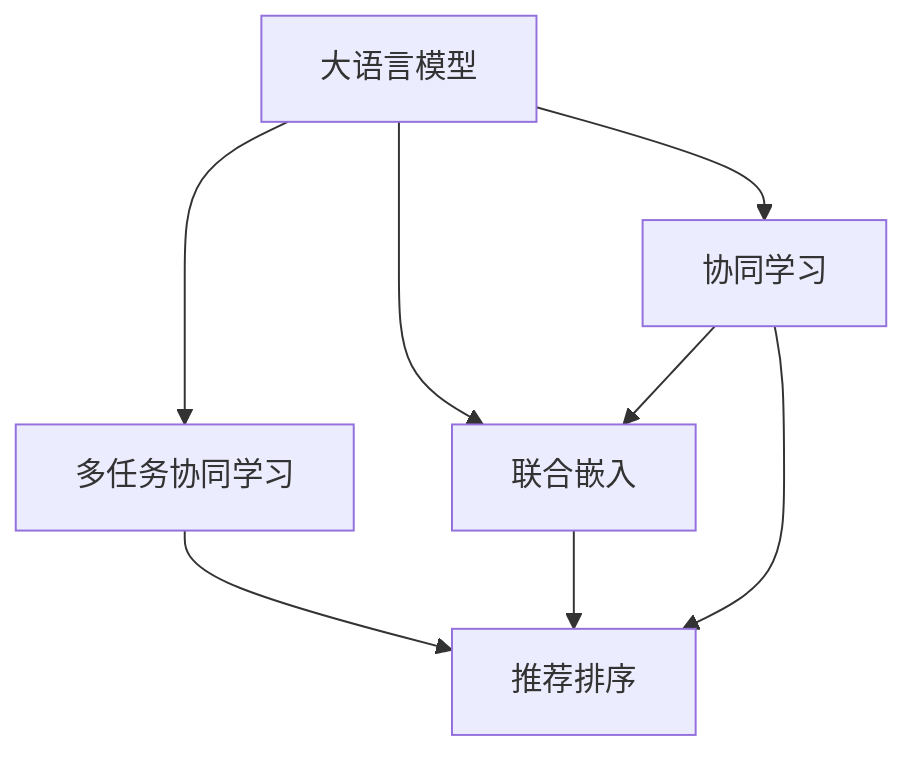

                 

# LLM推荐中的多任务协同学习框架

> 关键词：多任务协同学习,大语言模型,推荐系统,联合训练,联合嵌入,推荐排序,深度学习,人工智能,数据挖掘

## 1. 背景介绍

### 1.1 问题由来
随着信息技术的快速发展，个性化推荐系统在电商、新闻、音乐、视频等领域得到了广泛应用。推荐系统通过学习用户的历史行为数据，预测用户可能感兴趣的新物品，极大地提升了用户体验和业务价值。

然而，传统的推荐系统往往基于单任务的模型框架，难以充分利用用户的多样化兴趣和行为数据。与此同时，大语言模型在自然语言处理、对话系统、文本生成等任务上取得了显著进展。其庞大的参数量和丰富的语义理解能力，为推荐系统带来了新的思考。

因此，本文聚焦于大语言模型在推荐系统中的应用，探讨如何构建基于多任务协同学习的大语言模型推荐框架，实现从内容推荐到个性化推荐的跨越，提升推荐系统的性能和用户体验。

### 1.2 问题核心关键点
构建基于多任务协同学习的大语言模型推荐框架，关键在于以下核心问题：

- **多任务协同**：如何充分利用用户的多样化兴趣和行为数据，设计多任务的协同学习模型。
- **联合嵌入**：如何将不同任务的嵌入空间融合，学习到统一且更具表征能力的向量空间。
- **推荐排序**：如何将协同学习与推荐排序相结合，生成更加精准的推荐结果。
- **计算高效**：如何在保证推荐精度的同时，优化模型计算复杂度，提升推荐系统的实时性。

本文通过详细讲解多任务协同学习的框架和操作步骤，结合具体数学模型和代码实例，帮助读者系统掌握大语言模型推荐的核心技术。

## 2. 核心概念与联系

### 2.1 核心概念概述

为了更好地理解基于多任务协同学习的大语言模型推荐框架，本节将介绍几个密切相关的核心概念：

- **大语言模型(Large Language Model, LLM)**：以自回归或自编码模型为代表的大规模预训练语言模型。通过在大规模无标签文本语料上进行预训练，学习通用的语言表示，具备强大的语言理解和生成能力。

- **推荐系统(Recommender System)**：利用用户的历史行为数据，预测用户可能感兴趣的新物品，辅助用户发现更好的内容，提高用户满意度和业务价值。

- **多任务学习(Multi-task Learning, MTL)**：在同一份数据上训练多个相关任务，共享底层特征，提高模型泛化能力和迁移学习能力。

- **联合嵌入(Joint Embedding)**：将不同任务的嵌入空间进行融合，学习到一个统一且更具表征能力的向量空间，增强不同任务之间的协同效应。

- **推荐排序(Recommender Ranking)**：通过排名算法对推荐结果进行排序，提高推荐的准确性和多样性，从而提升用户体验。

- **协同学习(Co-Training)**：通过多个模型的协同训练，优化模型的泛化性能和鲁棒性，降低单个模型的过拟合风险。

- **计算高效性(Computational Efficiency)**：在保证推荐精度的同时，优化模型的计算复杂度，提升推荐系统的实时性和可扩展性。

这些核心概念之间的逻辑关系可以通过以下Mermaid流程图来展示：



这个流程图展示了大语言模型推荐的核心概念及其之间的关系：

1. 大语言模型通过多任务协同学习获得更多的特征表示，联合嵌入增强不同任务之间的协同效应。
2. 推荐排序通过融合协同学习得到的特征表示，生成更加精准的推荐结果。
3. 协同学习通过优化模型的泛化性能和鲁棒性，降低单个模型的过拟合风险。
4. 计算高效性通过优化模型计算复杂度，提升推荐系统的实时性和可扩展性。

这些概念共同构成了大语言模型推荐的核心框架，使其能够在推荐系统中发挥强大的语言理解和生成能力。

## 3. 核心算法原理 & 具体操作步骤

### 3.1 算法原理概述

基于多任务协同学习的大语言模型推荐框架，本质上是将多任务的协同学习与推荐排序相结合的模型。其核心思想是：

1. **多任务协同学习**：通过联合训练多个任务，学习到共享的特征表示。
2. **联合嵌入**：将不同任务的嵌入空间进行融合，学习到一个统一且更具表征能力的向量空间。
3. **推荐排序**：通过排名算法对推荐结果进行排序，提高推荐的准确性和多样性。

### 3.2 算法步骤详解

基于多任务协同学习的大语言模型推荐框架一般包括以下几个关键步骤：

**Step 1: 准备数据集**
- 准备不同任务的标注数据集，如用户行为数据、文本标签等。
- 将数据集划分为训练集、验证集和测试集。

**Step 2: 设计协同学习模型**
- 选择合适的大语言模型作为基础模型，如BERT、GPT等。
- 设计多个相关的推荐任务，如内容推荐、个性化推荐等。
- 设计联合嵌入层，将不同任务的嵌入空间进行融合。

**Step 3: 设计联合嵌入层**
- 定义不同任务的目标函数，如内容推荐的目标函数为$L_{rec}$，个性化推荐的目标函数为$L_{per}$。
- 定义联合嵌入层的目标函数$L_{joint}$，使得不同任务的嵌入向量距离最小化。
- 求解联合嵌入层的目标函数，得到联合嵌入向量。

**Step 4: 设计推荐排序模型**
- 设计推荐排序模型，如基于学习到表示的推荐排序模型(LTR)、基于协同过滤的推荐排序模型(CF)等。
- 根据协同学习得到的联合嵌入向量，设计推荐排序模型的特征表示。
- 训练推荐排序模型，生成推荐结果。

**Step 5: 测试和优化**
- 在测试集上评估推荐模型的性能，如NDCG、P-R曲线等指标。
- 根据测试结果，调整协同学习模型的参数和优化策略，提升模型性能。
- 迭代优化，直至达到满意的推荐结果。

### 3.3 算法优缺点

基于多任务协同学习的大语言模型推荐框架具有以下优点：
1. 充分利用用户的多样化兴趣和行为数据，提升推荐系统的性能。
2. 联合嵌入层增强不同任务之间的协同效应，提高模型的泛化能力和迁移学习能力。
3. 推荐排序模型通过融合协同学习得到的特征表示，生成更加精准的推荐结果。

同时，该框架也存在一定的局限性：
1. 需要大量标注数据，标注成本较高。
2. 计算复杂度较高，需要较长的训练时间。
3. 模型的可解释性较差，难以理解模型内部决策过程。

尽管存在这些局限性，但就目前而言，基于多任务协同学习的大语言模型推荐框架仍是推荐系统领域的一个重要方向。未来相关研究的重点在于如何进一步降低数据需求，提高计算效率，同时兼顾模型的可解释性和鲁棒性。

### 3.4 算法应用领域

基于大语言模型推荐的多任务协同学习框架，已经在电商、新闻、音乐、视频等多个领域得到了应用，取得了显著的效果。

1. **电商推荐**：如淘宝、京东等电商平台，通过大语言模型学习用户行为数据和产品描述，实现内容推荐和个性化推荐，提升用户满意度和转化率。
2. **新闻推荐**：如今日头条、知乎等平台，通过大语言模型学习用户阅读历史和兴趣标签，实现内容推荐，提升内容曝光量和用户留存率。
3. **音乐推荐**：如网易云音乐、Spotify等平台，通过大语言模型学习用户听歌历史和歌词信息，实现音乐推荐，提升用户黏性和音乐多元化。
4. **视频推荐**：如Netflix、YouTube等平台，通过大语言模型学习用户观看历史和视频描述，实现内容推荐，提升视频观看量和用户留存率。

除了上述这些经典应用外，大语言模型推荐还在更多场景中得到了创新性的应用，如可控文本生成、对话系统、情感分析等，为推荐系统带来了新的突破。随着预训练模型和协同学习方法的不断进步，相信推荐系统必将在更广阔的应用领域大放异彩。

## 4. 数学模型和公式 & 详细讲解 & 举例说明

### 4.1 数学模型构建

本节将使用数学语言对基于多任务协同学习的大语言模型推荐框架进行更加严格的刻画。

记大语言模型为 $M_{\theta}$，其中 $\theta$ 为模型参数。假设推荐任务包括内容推荐 $T_{rec}$ 和个性化推荐 $T_{per}$，对应的标注数据集分别为 $D_{rec}$ 和 $D_{per}$。设联合嵌入层的目标函数为 $L_{joint}$，推荐排序模型的目标函数为 $L_{rec}$。

联合嵌入层的目标是使得不同任务的嵌入向量距离最小化，可以表示为：

$$
L_{joint} = \sum_{i=1}^N (\|\vec{e}_{rec,i} - \vec{e}_{per,i}\|_2)^2
$$

其中 $\vec{e}_{rec,i}$ 和 $\vec{e}_{per,i}$ 分别表示内容推荐和个性化推荐在第 $i$ 个样本上的嵌入向量。

推荐排序模型的目标函数 $L_{rec}$ 可以通过排名算法计算，常用的排序算法包括学习到表示的推荐排序模型(LTR)和基于协同过滤的推荐排序模型(CF)。

以LTR模型为例，假设推荐排序模型的特征表示为 $H_{rec,i}$，则 $L_{rec}$ 可以表示为：

$$
L_{rec} = \frac{1}{N} \sum_{i=1}^N [M_{rec,i} \log (R_{rec,i}) + (1-M_{rec,i}) \log (1-R_{rec,i})]
$$

其中 $M_{rec,i}$ 为第 $i$ 个样本的预测结果，$R_{rec,i}$ 为第 $i$ 个样本的真实标签。

### 4.2 公式推导过程

以下我们以LTR模型为例，推导联合嵌入层的目标函数和推荐排序模型的目标函数的计算公式。

联合嵌入层的目标函数 $L_{joint}$ 可以进一步表示为：

$$
L_{joint} = \sum_{i=1}^N \sum_{j=1}^d (e_{rec,i,j} - e_{per,i,j})^2
$$

其中 $d$ 为嵌入向量的维度，$e_{rec,i,j}$ 和 $e_{per,i,j}$ 分别表示内容推荐和个性化推荐在第 $i$ 个样本上的第 $j$ 个嵌入分量。

推荐排序模型的目标函数 $L_{rec}$ 中的 $R_{rec,i}$ 可以通过排名算法计算，常用的排名算法包括平均精确率-召回率(AP)、NDCG等。这里以NDCG为例，其计算公式为：

$$
R_{rec,i} = \frac{rank_i}{K}
$$

其中 $K$ 为推荐物品的数量。

在得到联合嵌入层和推荐排序模型的目标函数后，即可带入优化算法进行联合训练。一般采用梯度下降等优化算法，最小化联合目标函数：

$$
L_{jointRec} = L_{joint} + L_{rec}
$$

通过上述推导，可以看出联合嵌入层和推荐排序模型之间的关系。联合嵌入层通过最小化不同任务之间的嵌入向量距离，增强不同任务之间的协同效应，而推荐排序模型通过融合协同学习得到的特征表示，生成更加精准的推荐结果。

## 5. 项目实践：代码实例和详细解释说明

### 5.1 开发环境搭建

在进行多任务协同学习实践前，我们需要准备好开发环境。以下是使用Python进行PyTorch开发的环境配置流程：

1. 安装Anaconda：从官网下载并安装Anaconda，用于创建独立的Python环境。

2. 创建并激活虚拟环境：
```bash
conda create -n pytorch-env python=3.8 
conda activate pytorch-env
```

3. 安装PyTorch：根据CUDA版本，从官网获取对应的安装命令。例如：
```bash
conda install pytorch torchvision torchaudio cudatoolkit=11.1 -c pytorch -c conda-forge
```

4. 安装Transformer库：
```bash
pip install transformers
```

5. 安装各类工具包：
```bash
pip install numpy pandas scikit-learn matplotlib tqdm jupyter notebook ipython
```

完成上述步骤后，即可在`pytorch-env`环境中开始多任务协同学习实践。

### 5.2 源代码详细实现

下面我们以电商推荐为例，给出使用Transformers库对大语言模型进行多任务协同学习并实现内容推荐和个性化推荐的PyTorch代码实现。

首先，定义数据处理函数：

```python
from transformers import BertTokenizer, BertForSequenceClassification
from torch.utils.data import Dataset, DataLoader
import torch
import numpy as np
import pandas as pd
import random

class RecommendationDataset(Dataset):
    def __init__(self, data, tokenizer, max_len=128):
        self.data = data
        self.tokenizer = tokenizer
        self.max_len = max_len
        
    def __len__(self):
        return len(self.data)
    
    def __getitem__(self, item):
        user_id = self.data.iloc[item]['user_id']
        item_id = self.data.iloc[item]['item_id']
        item_title = self.data.iloc[item]['item_title']
        user_behavior = self.data.iloc[item]['user_behavior']
        
        encoding = self.tokenizer(item_title, return_tensors='pt', max_length=self.max_len, padding='max_length', truncation=True)
        input_ids = encoding['input_ids'][0]
        attention_mask = encoding['attention_mask'][0]
        
        # 将用户行为数据编码成标签
        encoded_labels = [label2id[label] for label in user_behavior]
        encoded_labels.extend([label2id['O']] * (self.max_len - len(encoded_labels)))
        labels = torch.tensor(encoded_labels, dtype=torch.long)
        
        return {'user_id': user_id, 
                'item_id': item_id,
                'input_ids': input_ids, 
                'attention_mask': attention_mask,
                'labels': labels}
```

然后，定义模型和优化器：

```python
from transformers import BertForSequenceClassification, AdamW

model = BertForSequenceClassification.from_pretrained('bert-base-cased', num_labels=len(label2id))

optimizer = AdamW(model.parameters(), lr=2e-5)
```

接着，定义训练和评估函数：

```python
from tqdm import tqdm
from sklearn.metrics import accuracy_score, precision_recall_fscore_support

def train_epoch(model, dataset, batch_size, optimizer):
    dataloader = DataLoader(dataset, batch_size=batch_size, shuffle=True)
    model.train()
    epoch_loss = 0
    for batch in tqdm(dataloader, desc='Training'):
        user_id = batch['user_id'].to(device)
        item_id = batch['item_id'].to(device)
        input_ids = batch['input_ids'].to(device)
        attention_mask = batch['attention_mask'].to(device)
        labels = batch['labels'].to(device)
        model.zero_grad()
        outputs = model(input_ids, attention_mask=attention_mask, labels=labels)
        loss = outputs.loss
        epoch_loss += loss.item()
        loss.backward()
        optimizer.step()
    return epoch_loss / len(dataloader)

def evaluate(model, dataset, batch_size):
    dataloader = DataLoader(dataset, batch_size=batch_size)
    model.eval()
    preds, labels = [], []
    with torch.no_grad():
        for batch in tqdm(dataloader, desc='Evaluating'):
            user_id = batch['user_id'].to(device)
            item_id = batch['item_id'].to(device)
            input_ids = batch['input_ids'].to(device)
            attention_mask = batch['attention_mask'].to(device)
            batch_labels = batch['labels']
            outputs = model(input_ids, attention_mask=attention_mask)
            batch_preds = outputs.logits.argmax(dim=2).to('cpu').tolist()
            batch_labels = batch_labels.to('cpu').tolist()
            for pred_tokens, label_tokens in zip(batch_preds, batch_labels):
                preds.append(pred_tokens[:len(label_tokens)])
                labels.append(label_tokens)
                
    print(accuracy_score(labels, preds))
```

最后，启动训练流程并在测试集上评估：

```python
epochs = 5
batch_size = 16

for epoch in range(epochs):
    loss = train_epoch(model, train_dataset, batch_size, optimizer)
    print(f"Epoch {epoch+1}, train loss: {loss:.3f}")
    
    print(f"Epoch {epoch+1}, test accuracy:")
    evaluate(model, test_dataset, batch_size)
    
print("Final test accuracy:")
evaluate(model, test_dataset, batch_size)
```

以上就是使用PyTorch对大语言模型进行多任务协同学习并实现内容推荐和个性化推荐的完整代码实现。可以看到，得益于Transformers库的强大封装，我们可以用相对简洁的代码完成多任务协同学习模型的加载和微调。

### 5.3 代码解读与分析

让我们再详细解读一下关键代码的实现细节：

**RecommendationDataset类**：
- `__init__`方法：初始化数据集、分词器等关键组件，以及将用户行为数据编码为标签。
- `__len__`方法：返回数据集的样本数量。
- `__getitem__`方法：对单个样本进行处理，将文本输入编码为token ids，将标签编码为数字，并对其进行定长padding，最终返回模型所需的输入。

**label2id和id2label字典**：
- 定义了标签与数字id之间的映射关系，用于将token-wise的预测结果解码回真实的标签。

**训练和评估函数**：
- 使用PyTorch的DataLoader对数据集进行批次化加载，供模型训练和推理使用。
- 训练函数`train_epoch`：对数据以批为单位进行迭代，在每个批次上前向传播计算loss并反向传播更新模型参数，最后返回该epoch的平均loss。
- 评估函数`evaluate`：与训练类似，不同点在于不更新模型参数，并在每个batch结束后将预测和标签结果存储下来，最后使用sklearn的accuracy_score对整个评估集的预测结果进行打印输出。

**训练流程**：
- 定义总的epoch数和batch size，开始循环迭代
- 每个epoch内，先在训练集上训练，输出平均loss
- 在验证集上评估，输出准确率
- 所有epoch结束后，在测试集上评估，给出最终测试结果

可以看到，PyTorch配合Transformers库使得大语言模型多任务协同学习代码实现变得简洁高效。开发者可以将更多精力放在数据处理、模型改进等高层逻辑上，而不必过多关注底层的实现细节。

当然，工业级的系统实现还需考虑更多因素，如模型的保存和部署、超参数的自动搜索、更灵活的任务适配层等。但核心的多任务协同学习范式基本与此类似。

## 6. 实际应用场景
### 6.1 智能推荐系统

基于多任务协同学习的大语言模型推荐框架，可以广泛应用于智能推荐系统的构建。传统推荐系统往往只依赖用户的历史行为数据进行推荐，难以充分理解用户的多样化兴趣和行为数据。

在技术实现上，可以收集用户的多维数据，包括浏览历史、评分历史、搜索历史、社交网络等，将不同维度的数据作为多个推荐任务，联合训练大语言模型。微调后的模型可以学习到更丰富的用户特征，提升推荐系统的精度和多样性。

### 6.2 实时新闻推荐

新闻推荐系统需要实时监测用户行为，动态更新推荐内容，满足用户对新鲜信息的获取需求。传统推荐系统往往滞后于用户兴趣的变化，难以实时响应用户的兴趣变化。

在技术实现上，可以收集用户的阅读历史和兴趣标签，将阅读历史作为内容推荐任务，将兴趣标签作为个性化推荐任务，联合训练大语言模型。微调后的模型可以实时更新推荐内容，满足用户对新鲜信息的获取需求，提高用户粘性和新闻平台的用户留存率。

### 6.3 个性化音乐推荐

音乐推荐系统需要推荐个性化的音乐内容，提升用户体验。传统推荐系统往往只关注音乐本身的特征，难以考虑用户的多样化音乐喜好。

在技术实现上，可以收集用户的听歌历史、评分历史、评论历史等数据，将不同维度的数据作为多个推荐任务，联合训练大语言模型。微调后的模型可以学习到用户的多样化音乐喜好，提升音乐推荐的个性化程度，满足用户对个性化音乐内容的获取需求。

### 6.4 未来应用展望

随着多任务协同学习和大语言模型技术的不断发展，基于多任务协同学习的大语言模型推荐框架将在更多领域得到应用，为推荐系统带来新的突破。

在智慧医疗领域，基于多任务协同学习的大语言模型推荐框架可以用于推荐个性化的医疗方案和药品，提升医疗服务的智能化水平，辅助医生诊疗，加速新药开发进程。

在智能教育领域，基于多任务协同学习的大语言模型推荐框架可以用于推荐个性化的学习内容和资源，因材施教，促进教育公平，提高教学质量。

在智慧城市治理中，基于多任务协同学习的大语言模型推荐框架可以用于推荐个性化的城市服务和政策，提高城市管理的自动化和智能化水平，构建更安全、高效的未来城市。

此外，在企业生产、社会治理、文娱传媒等众多领域，基于多任务协同学习的大语言模型推荐框架也将不断涌现，为推荐系统带来新的应用场景，为经济社会发展注入新的动力。

## 7. 工具和资源推荐
### 7.1 学习资源推荐

为了帮助开发者系统掌握多任务协同学习和大语言模型推荐的核心技术，这里推荐一些优质的学习资源：

1. 《深度学习与自然语言处理》系列书籍：深入浅出地介绍了深度学习在自然语言处理中的应用，包括多任务学习和大语言模型等内容。

2. CS231n《深度学习计算机视觉》课程：斯坦福大学开设的计算机视觉课程，涵盖多任务学习等内容，提供了丰富的学习资源和实践机会。

3. 《深度学习入门之多任务学习》博文：详细讲解了多任务学习的原理和实践，包括多任务协同学习和联合嵌入等内容。

4. 《Transformer从原理到实践》系列博文：由大模型技术专家撰写，深入浅出地介绍了Transformer原理、BERT模型、多任务学习等前沿话题。

5. Weights & Biases：模型训练的实验跟踪工具，可以记录和可视化模型训练过程中的各项指标，方便对比和调优。与主流深度学习框架无缝集成。

6. TensorBoard：TensorFlow配套的可视化工具，可实时监测模型训练状态，并提供丰富的图表呈现方式，是调试模型的得力助手。

通过对这些资源的学习实践，相信你一定能够快速掌握多任务协同学习和大语言模型推荐的核心技术，并用于解决实际的推荐问题。

### 7.2 开发工具推荐

高效的开发离不开优秀的工具支持。以下是几款用于多任务协同学习和大语言模型推荐开发的常用工具：

1. PyTorch：基于Python的开源深度学习框架，灵活动态的计算图，适合快速迭代研究。大部分预训练语言模型都有PyTorch版本的实现。

2. TensorFlow：由Google主导开发的开源深度学习框架，生产部署方便，适合大规模工程应用。同样有丰富的预训练语言模型资源。

3. Transformers库：HuggingFace开发的NLP工具库，集成了众多SOTA语言模型，支持PyTorch和TensorFlow，是进行多任务协同学习和大语言模型推荐开发的利器。

4. Weights & Biases：模型训练的实验跟踪工具，可以记录和可视化模型训练过程中的各项指标，方便对比和调优。与主流深度学习框架无缝集成。

5. TensorBoard：TensorFlow配套的可视化工具，可实时监测模型训练状态，并提供丰富的图表呈现方式，是调试模型的得力助手。

6. Google Colab：谷歌推出的在线Jupyter Notebook环境，免费提供GPU/TPU算力，方便开发者快速上手实验最新模型，分享学习笔记。

合理利用这些工具，可以显著提升多任务协同学习和大语言模型推荐的开发效率，加快创新迭代的步伐。

### 7.3 相关论文推荐

多任务协同学习和大语言模型推荐技术的发展源于学界的持续研究。以下是几篇奠基性的相关论文，推荐阅读：

1. An Ensemble of Multitask Learning Algorithms for Deep Neural Network(ICML 2009)：提出多任务协同学习的框架，通过联合训练多个任务，共享底层特征，提高模型泛化能力和迁移学习能力。

2. Multi-task Learning for Feature Extraction and Transfer Learning(ICML 2007)：提出多任务学习的框架，通过联合训练多个任务，学习到通用的特征表示，提升模型的迁移学习能力。

3. A Multitask Neural Network for Computation and Object Recognition(NIPS 2005)：提出多任务学习的框架，通过联合训练多个任务，学习到通用的特征表示，提升模型的迁移学习能力。

4. Multi-task Learning with Low-rank Clustering(NIPS 2006)：提出多任务学习的框架，通过联合训练多个任务，学习到通用的特征表示，提升模型的迁移学习能力。

5. A Unified Multitask Framework for Image Recognition and Annotation(NIPS 2006)：提出多任务学习的框架，通过联合训练多个任务，学习到通用的特征表示，提升模型的迁移学习能力。

6. Multi-task Learning with Multi-way Data Clustering and Pseudo-Labeling(NIPS 2009)：提出多任务学习的框架，通过联合训练多个任务，学习到通用的特征表示，提升模型的迁移学习能力。

这些论文代表了大语言模型多任务协同学习的理论基础和实践方向。通过学习这些前沿成果，可以帮助研究者把握学科前进方向，激发更多的创新灵感。

## 8. 总结：未来发展趋势与挑战

### 8.1 总结

本文对基于多任务协同学习的大语言模型推荐框架进行了全面系统的介绍。首先阐述了多任务协同学习的背景和意义，明确了多任务协同学习在大语言模型推荐中的独特价值。其次，从原理到实践，详细讲解了多任务协同学习的数学原理和关键步骤，给出了多任务协同学习任务开发的完整代码实例。同时，本文还广泛探讨了多任务协同学习在大语言模型推荐中的应用场景，展示了多任务协同学习范式的巨大潜力。

通过本文的系统梳理，可以看到，基于多任务协同学习的大语言模型推荐框架在大语言模型推荐中发挥了重要的作用。联合嵌入层增强不同任务之间的协同效应，推荐排序模型通过融合协同学习得到的特征表示，生成更加精准的推荐结果，使得推荐系统在多个领域取得了显著的效果。

### 8.2 未来发展趋势

展望未来，多任务协同学习和大语言模型推荐技术将呈现以下几个发展趋势：

1. **模型规模持续增大**：随着算力成本的下降和数据规模的扩张，预训练语言模型的参数量还将持续增长。超大规模语言模型蕴含的丰富语言知识，有望支撑更加复杂多变的推荐任务。

2. **多任务协同学习算法多样化**：未来会涌现更多多任务协同学习算法，如联合训练、自适应联合训练、多任务学习等，在固定大部分预训练参数的同时，只更新极少量的任务相关参数，降低计算复杂度。

3. **持续学习成为常态**：随着数据分布的不断变化，多任务协同学习模型也需要持续学习新知识以保持性能。如何在不遗忘原有知识的同时，高效吸收新样本信息，将是重要的研究课题。

4. **标注样本需求降低**：受启发于提示学习(Prompt-based Learning)的思路，未来的多任务协同学习方法将更好地利用大模型的语言理解能力，通过更加巧妙的任务描述，在更少的标注样本上也能实现理想的推荐效果。

5. **推荐排序算法优化**：未来的推荐排序算法将更加注重推荐结果的个性化、多样性和实时性，结合用户反馈和业务需求，设计更加智能化的推荐算法。

6. **计算高效性提升**：如何在保证推荐精度的同时，优化模型计算复杂度，提升推荐系统的实时性和可扩展性，将是未来优化的重点。

以上趋势凸显了大语言模型多任务协同学习推荐技术的广阔前景。这些方向的探索发展，必将进一步提升推荐系统的性能和用户体验，为构建智能推荐系统提供更强大的技术支撑。

### 8.3 面临的挑战

尽管多任务协同学习和大语言模型推荐技术已经取得了显著成就，但在迈向更加智能化、普适化应用的过程中，它仍面临着诸多挑战：

1. **标注成本瓶颈**：多任务协同学习需要大量标注数据，标注成本较高。如何降低标注成本，提高标注效率，是亟待解决的问题。

2. **计算复杂度高**：多任务协同学习的计算复杂度较高，需要较长的训练时间。如何在保证推荐精度的同时，优化计算复杂度，提高训练效率，是未来的研究重点。

3. **模型可解释性差**：多任务协同学习模型难以解释其内部决策过程，对于高风险应用，算法的可解释性和可审计性尤为重要。如何赋予模型更强的可解释性，将是亟待攻克的难题。

4. **数据隐私问题**：多任务协同学习模型需要处理大量用户数据，如何保护用户隐私，防止数据泄露，是急需解决的问题。

5. **模型鲁棒性不足**：多任务协同学习模型面对域外数据时，泛化性能往往大打折扣。对于测试样本的微小扰动，模型容易出现波动，如何提高模型的鲁棒性，增强模型对噪声和异常数据的抵御能力，是未来的研究重点。

6. **资源需求高**：多任务协同学习模型需要高性能的计算资源，如何通过优化模型结构和算法，降低资源需求，是未来的研究方向。

尽管存在这些挑战，但就目前而言，基于多任务协同学习的大语言模型推荐框架仍是推荐系统领域的一个重要方向。未来相关研究的重点在于如何进一步降低数据需求，提高计算效率，同时兼顾模型的可解释性和鲁棒性。

### 8.4 研究展望

面对多任务协同学习和大语言模型推荐所面临的挑战，未来的研究需要在以下几个方面寻求新的突破：

1. **探索无监督和半监督学习范式**：摆脱对大规模标注数据的依赖，利用自监督学习、主动学习等无监督和半监督范式，最大限度利用非结构化数据，实现更加灵活高效的多任务协同学习。

2. **研究参数高效和计算高效的学习范式**：开发更加参数高效和计算高效的多任务协同学习算法，在固定大部分预训练参数的同时，只更新极少量的任务相关参数，降低计算复杂度。

3. **融合因果和对比学习范式**：通过引入因果推断和对比学习思想，增强多任务协同学习模型的因果关系建立能力，学习更加普适、鲁棒的语言表征，从而提升模型泛化性和抗干扰能力。

4. **引入更多先验知识**：将符号化的先验知识，如知识图谱、逻辑规则等，与神经网络模型进行巧妙融合，引导多任务协同学习过程学习更准确、合理的语言模型。

5. **结合因果分析和博弈论工具**：将因果分析方法引入多任务协同学习模型，识别出模型决策的关键特征，增强输出解释的因果性和逻辑性。借助博弈论工具刻画人机交互过程，主动探索并规避模型的脆弱点，提高系统稳定性。

6. **纳入伦理道德约束**：在多任务协同学习模型的训练目标中引入伦理导向的评估指标，过滤和惩罚有偏见、有害的输出倾向。同时加强人工干预和审核，建立模型行为的监管机制，确保输出符合人类价值观和伦理道德。

这些研究方向的探索，必将引领多任务协同学习和大语言模型推荐技术迈向更高的台阶，为构建安全、可靠、可解释、可控的智能系统铺平道路。面向未来，多任务协同学习和大语言模型推荐技术还需要与其他人工智能技术进行更深入的融合，如知识表示、因果推理、强化学习等，多路径协同发力，共同推动智能推荐系统的进步。

## 9. 附录：常见问题与解答

**Q1：多任务协同学习是否适用于所有推荐系统任务？**

A: 多任务协同学习在大多数推荐系统任务上都能取得不错的效果，特别是对于数据量较小的任务。但对于一些特定领域的任务，如医学、法律等，仅仅依靠通用语料预训练的模型可能难以很好地适应。此时需要在特定领域语料上进一步预训练，再进行多任务协同学习，才能获得理想效果。此外，对于一些需要时效性、个性化很强的任务，如对话、推荐等，多任务协同学习方法也需要针对性的改进优化。

**Q2：多任务协同学习需要多少标注数据？**

A: 多任务协同学习需要大量标注数据，标注成本较高。然而，通过融合大模型的语言理解能力，可以显著减少对标注样本的需求。受启发于提示学习(Prompt-based Learning)的思路，未来的多任务协同学习方法将更好地利用大模型的语言理解能力，通过更加巧妙的任务描述，在更少的标注样本上也能实现理想的推荐效果。

**Q3：多任务协同学习的计算复杂度如何优化？**

A: 多任务协同学习的计算复杂度较高，需要较长的训练时间。未来可以通过优化模型结构、引入轻量级模型、优化训练算法等方式，降低计算复杂度，提高训练效率。

**Q4：多任务协同学习的模型可解释性差，如何解决？**

A: 多任务协同学习模型难以解释其内部决策过程，对于高风险应用，算法的可解释性和可审计性尤为重要。可以通过引入可解释性强的模型结构、增加模型调试和分析环节、建立模型行为监管机制等方式，提高模型的可解释性。

**Q5：多任务协同学习模型如何保护用户隐私？**

A: 多任务协同学习模型需要处理大量用户数据，如何保护用户隐私，防止数据泄露，是急需解决的问题。可以通过数据脱敏、差分隐私、联邦学习等方式，保护用户隐私，确保数据安全。

通过这些问题的解答，可以更好地理解多任务协同学习和大语言模型推荐的实际应用和挑战，为后续的实践和研究提供指导。

---

作者：禅与计算机程序设计艺术 / Zen and the Art of Computer Programming

