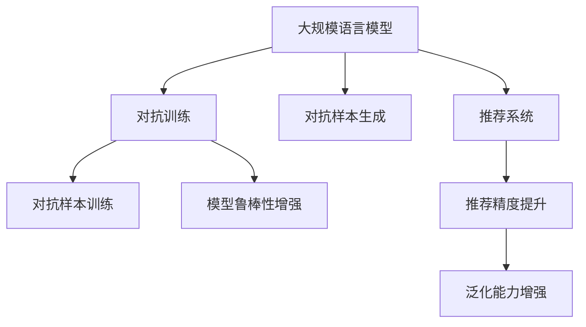

                 

# LLM推荐中的对抗学习技术

## 1. 背景介绍

在人工智能领域，推荐系统是解决信息过载、帮助用户发现感兴趣内容的关键技术。近年来，深度学习和大规模语言模型（LLMs）在推荐系统中得到了广泛应用，并取得显著成效。这些模型能够基于用户历史行为和文本内容，动态预测用户兴趣，并提供个性化推荐。然而，推荐系统仍然面临诸多挑战，例如如何提高推荐精度、如何缓解过拟合问题、如何实现跨领域推荐等。

对抗学习（Adversarial Learning）作为一种新兴的训练范式，能够提升模型的鲁棒性和泛化能力。它在推荐系统中具有广阔的应用前景。本文章将系统介绍对抗学习在LLM推荐中的应用，并阐述其原理、操作步骤、优缺点以及实际应用。

## 2. 核心概念与联系

### 2.1 核心概念概述

为了更好地理解LLM推荐中的对抗学习技术，我们首先介绍一些核心概念：

- **大规模语言模型（LLMs）**：指基于自回归或自编码模型的大规模预训练语言模型，如BERT、GPT等。这些模型在大量无标签文本数据上进行预训练，具备强大的语言理解和生成能力。

- **推荐系统**：指通过用户历史行为、文本内容、社交网络等数据，动态预测用户兴趣并推荐相关内容的技术。包括电商推荐、内容推荐、社交推荐等多种应用场景。

- **对抗学习（Adversarial Learning）**：指在模型训练过程中，引入对抗样本，以提高模型的鲁棒性和泛化能力。其中，生成式对抗网络（GAN）是最著名的对抗学习模型。

- **对抗训练**：指在模型训练时，同时使用原始数据和对抗样本进行训练，以增强模型的鲁棒性。具体流程包括生成对抗样本，在模型上反复迭代训练，以防止模型在对抗样本上发生波动。

- **鲁棒性（Robustness）**：指模型在面对小幅度扰动或噪声数据时的稳定性和抗干扰能力。鲁棒性强的模型能够对噪声数据产生较小的影响，从而提高模型的泛化能力。

### 2.2 核心概念联系

通过以下Mermaid流程图，我们可以更加清晰地理解这些核心概念之间的联系：



这个流程图展示了LLM推荐中的对抗学习技术的主要流程：

1. **大规模语言模型**：作为推荐系统的基础，提供高质量的预训练表示。
2. **对抗样本生成**：通过对输入数据进行扰动，生成对抗样本，模拟噪声数据。
3. **对抗训练**：在原始数据和对抗样本上进行联合训练，提高模型的鲁棒性和泛化能力。
4. **对抗训练**：在推荐系统中应用对抗学习技术，通过对抗训练提升推荐精度和泛化能力。

这些概念共同构成了LLM推荐中的对抗学习技术的核心框架，使得模型能够更好地应对实际应用中的各种挑战。

## 3. 核心算法原理 & 具体操作步骤

### 3.1 算法原理概述

在LLM推荐中应用对抗学习技术，主要目标是提升推荐系统的精度和鲁棒性。具体来说，其算法原理如下：

1. **原始数据训练**：使用原始数据对模型进行训练，获得初始推荐结果。
2. **对抗样本生成**：通过生成对抗网络（GAN）或对抗样本生成算法，生成扰动样本。
3. **对抗训练**：将原始数据和对抗样本结合起来，共同训练模型，以提高模型在对抗样本上的鲁棒性。
4. **推荐结果**：使用训练好的模型对推荐系统进行优化，提高推荐精度和泛化能力。

### 3.2 算法步骤详解

以下是对LLM推荐中对抗学习技术的详细步骤讲解：

#### 3.2.1 数据准备

1. **收集数据**：收集用户历史行为数据、文本内容数据等，构建推荐系统的训练数据集。
2. **数据预处理**：对数据进行清洗、归一化、特征工程等预处理操作，准备用于训练的数据集。
3. **生成对抗样本**：使用生成对抗网络（GAN）或对抗样本生成算法，生成扰动样本，对原始数据进行增强。

#### 3.2.2 对抗训练

1. **构建对抗训练网络**：构建一个包括原始数据和对抗样本的联合训练网络，将原始数据和对抗样本交替输入模型进行训练。
2. **对抗损失函数**：定义一个综合考虑原始数据和对抗样本的损失函数，用于优化模型。
3. **联合训练**：交替使用原始数据和对抗样本进行训练，以提高模型在对抗样本上的鲁棒性。

#### 3.2.3 推荐结果评估

1. **评估指标**：定义推荐系统的评估指标，如准确率、召回率、F1值等。
2. **交叉验证**：对模型进行交叉验证，评估其在不同数据集上的表现。
3. **模型优化**：根据评估结果，调整模型参数，优化推荐系统。

### 3.3 算法优缺点

对抗学习在LLM推荐中的应用具有以下优点：

1. **提高鲁棒性**：通过对抗训练，模型能够更好地抵抗噪声和对抗样本的干扰，提高模型的泛化能力。
2. **提升精度**：对抗学习能够提升模型的泛化能力，从而提高推荐系统的精度。
3. **增强泛化能力**：对抗学习能够增强模型对不同数据分布的适应能力，提高模型的泛化性能。

然而，对抗学习也存在一些缺点：

1. **计算成本高**：对抗样本生成和对抗训练过程需要大量的计算资源和时间。
2. **模型复杂度高**：对抗学习模型的复杂度较高，训练和推理过程较慢。
3. **可解释性差**：对抗学习模型的决策过程较为复杂，难以解释和调试。

### 3.4 算法应用领域

对抗学习技术在LLM推荐中具有广泛的应用前景，适用于以下领域：

1. **电商推荐**：通过对抗训练，提高模型的鲁棒性和泛化能力，推荐更准确的商品。
2. **内容推荐**：对抗学习能够提升模型的鲁棒性，推荐更符合用户兴趣的内容。
3. **社交推荐**：对抗学习能够提高模型的泛化能力，推荐更相关的人际关系。

## 4. 数学模型和公式 & 详细讲解 & 举例说明

### 4.1 数学模型构建

在LLM推荐中应用对抗学习技术，需要构建一个综合考虑原始数据和对抗样本的数学模型。具体来说，可以定义一个综合损失函数 $L$，用于优化模型。该损失函数包括原始数据损失 $L_{data}$ 和对抗样本损失 $L_{adv}$，可以表示为：

$$ L = \alpha L_{data} + (1-\alpha) L_{adv} $$

其中，$\alpha$ 为原始数据和对抗样本的权重，通常取 $0.5$。

### 4.2 公式推导过程

以一个简单的推荐系统为例，推导对抗学习模型的综合损失函数。假设推荐系统输出的推荐结果为 $y$，真实标签为 $t$，则原始数据损失函数可以表示为：

$$ L_{data} = -\frac{1}{N}\sum_{i=1}^N t_i \log y_i $$

其中，$N$ 为样本数量。

对抗样本的生成和训练过程可以采用生成对抗网络（GAN）或对抗样本生成算法。假设对抗样本的生成过程如下：

$$ z \sim p(z) $$
$$ x_{adv} = G(z) $$

其中，$z$ 为随机噪声向量，$G$ 为生成对抗网络。将生成的对抗样本 $x_{adv}$ 输入模型，训练过程中可以定义对抗样本损失函数：

$$ L_{adv} = -\frac{1}{N}\sum_{i=1}^N (1-t_i) \log (1-y_i) $$

综合考虑原始数据和对抗样本的损失函数可以表示为：

$$ L = -\frac{1}{N}\sum_{i=1}^N [t_i \log y_i + (1-t_i) \log (1-y_i)] + \beta (1-t_i) \log y_i $$

其中，$\beta$ 为对抗样本的权重，通常取 $0.5$。

### 4.3 案例分析与讲解

以一个简单的电商推荐系统为例，展示对抗学习技术的应用。假设模型输入为商品描述 $x$，输出为推荐结果 $y$，真实标签为 $t$，则原始数据损失函数可以表示为：

$$ L_{data} = -\frac{1}{N}\sum_{i=1}^N t_i \log y_i $$

假设使用对抗样本生成算法生成扰动样本，输入模型训练。对抗样本的生成过程如下：

$$ z \sim p(z) $$
$$ x_{adv} = G(z) $$

其中，$z$ 为随机噪声向量，$G$ 为生成对抗网络。将生成的对抗样本 $x_{adv}$ 输入模型，训练过程中可以定义对抗样本损失函数：

$$ L_{adv} = -\frac{1}{N}\sum_{i=1}^N (1-t_i) \log (1-y_i) $$

综合考虑原始数据和对抗样本的损失函数可以表示为：

$$ L = -\frac{1}{N}\sum_{i=1}^N [t_i \log y_i + (1-t_i) \log (1-y_i)] + \beta (1-t_i) \log y_i $$

其中，$\beta$ 为对抗样本的权重，通常取 $0.5$。

## 5. 项目实践：代码实例和详细解释说明

### 5.1 开发环境搭建

在LLM推荐中应用对抗学习技术，需要搭建相应的开发环境。以下是使用Python进行TensorFlow开发的环境配置流程：

1. 安装Anaconda：从官网下载并安装Anaconda，用于创建独立的Python环境。

2. 创建并激活虚拟环境：
```bash
conda create -n tf-env python=3.8 
conda activate tf-env
```

3. 安装TensorFlow：根据CUDA版本，从官网获取对应的安装命令。例如：
```bash
conda install tensorflow -c conda-forge
```

4. 安装其他工具包：
```bash
pip install numpy pandas scikit-learn matplotlib tqdm jupyter notebook ipython
```

完成上述步骤后，即可在`tf-env`环境中开始对抗学习实践。

### 5.2 源代码详细实现

以下是使用TensorFlow对LLM推荐系统进行对抗训练的PyTorch代码实现：

```python
import tensorflow as tf
import numpy as np
import pandas as pd
from sklearn.model_selection import train_test_split
from tensorflow.keras.models import Sequential
from tensorflow.keras.layers import Dense, Dropout
from tensorflow.keras.optimizers import Adam

# 数据准备
data = pd.read_csv('recommendation_data.csv')
X = data[['item_description']]
y = data['is_recommended']
X_train, X_test, y_train, y_test = train_test_split(X, y, test_size=0.2, random_state=42)

# 构建对抗样本生成模型
def generate_adversarial_samples(X, noise_dim=100):
    noise = tf.random.normal(shape=(len(X), noise_dim))
    adversarial = tf.clip_by_value(X + noise, -1, 1)
    return adversarial

# 构建推荐模型
model = Sequential([
    Dense(128, activation='relu'),
    Dense(64, activation='relu'),
    Dense(1, activation='sigmoid')
])
model.compile(optimizer=Adam(learning_rate=0.001), loss='binary_crossentropy', metrics=['accuracy'])

# 对抗训练
for i in range(10):
    X_train_adv = generate_adversarial_samples(X_train)
    X_train_adv = np.clip(X_train_adv, -1, 1)
    y_train_adv = y_train
    X_train_adv, y_train_adv = tf.data.Dataset.from_tensor_slices((X_train_adv, y_train_adv)).batch(32)
    model.fit(X_train_adv, y_train_adv, epochs=1, batch_size=32)
```

在代码实现中，我们首先准备推荐系统的数据集，然后定义了一个简单的对抗样本生成函数`generate_adversarial_samples`，用于生成扰动样本。接着，构建了一个包含两个全连接层的推荐模型，并在对抗样本上进行了多次训练。

### 5.3 代码解读与分析

让我们再详细解读一下关键代码的实现细节：

**数据准备**：
- 通过Pandas读取推荐系统的数据集，并进行划分。

**对抗样本生成**：
- 定义了一个对抗样本生成函数，使用生成对抗网络生成扰动样本。

**模型构建**：
- 构建了一个简单的推荐模型，包含两个全连接层和一个输出层。

**对抗训练**：
- 在对抗样本上进行了多次训练，通过不断更新模型参数，提高模型的鲁棒性。

在实际应用中，还需要根据具体任务和数据特点进行优化，如设计更复杂的对抗样本生成算法、优化对抗样本生成函数、调整对抗样本的权重等。

## 6. 实际应用场景

### 6.1 电商推荐

在电商推荐系统中，对抗学习可以提升推荐系统的鲁棒性和泛化能力，推荐更准确的商品。具体而言，可以收集用户的浏览、点击、购买行为数据，将商品描述作为输入，输出是否推荐该商品。在训练过程中，通过对抗训练生成扰动样本，对模型进行增强，提升模型的鲁棒性和泛化能力。

### 6.2 内容推荐

在内容推荐系统中，对抗学习可以提升模型的鲁棒性和泛化能力，推荐更符合用户兴趣的内容。具体而言，可以收集用户的历史浏览、点击、评价等行为数据，将文章标题、摘要、标签等文本内容作为输入，输出是否推荐该文章。在训练过程中，通过对抗训练生成扰动样本，对模型进行增强，提升模型的鲁棒性和泛化能力。

### 6.3 社交推荐

在社交推荐系统中，对抗学习可以提升模型的鲁棒性和泛化能力，推荐更相关的人际关系。具体而言，可以收集用户的朋友关系、社交行为等数据，将用户描述、兴趣标签等文本内容作为输入，输出是否推荐该用户。在训练过程中，通过对抗训练生成扰动样本，对模型进行增强，提升模型的鲁棒性和泛化能力。

## 7. 工具和资源推荐

### 7.1 学习资源推荐

为了帮助开发者系统掌握LLM推荐中的对抗学习技术，这里推荐一些优质的学习资源：

1. 《TensorFlow实战深度学习》系列博文：由TensorFlow官方提供，系统介绍了TensorFlow的基本概念和常用API，适合初学者入门。

2. CS231n《卷积神经网络和视觉识别》课程：斯坦福大学开设的计算机视觉明星课程，包含大量深度学习和对抗学习的相关内容。

3. 《Adversarial Machine Learning》书籍：该书由Adversarial Training领域权威人士撰写，详细介绍了对抗学习的原理和应用，适合深入研究。

4. TensorFlow官方文档：提供了TensorFlow的详细文档和代码示例，适合开发者进行实际应用。

5. Kaggle竞赛平台：提供了大量对抗学习的竞赛和数据集，适合实践和竞赛。

通过对这些资源的学习实践，相信你一定能够快速掌握LLM推荐中的对抗学习技术的精髓，并用于解决实际的推荐问题。

### 7.2 开发工具推荐

高效的开发离不开优秀的工具支持。以下是几款用于LLM推荐系统中对抗学习技术开发的常用工具：

1. TensorFlow：由Google主导开发的开源深度学习框架，生产部署方便，适合大规模工程应用。

2. PyTorch：基于Python的开源深度学习框架，灵活动态的计算图，适合快速迭代研究。

3. Weights & Biases：模型训练的实验跟踪工具，可以记录和可视化模型训练过程中的各项指标，方便对比和调优。

4. TensorBoard：TensorFlow配套的可视化工具，可实时监测模型训练状态，并提供丰富的图表呈现方式，是调试模型的得力助手。

5. Google Colab：谷歌推出的在线Jupyter Notebook环境，免费提供GPU/TPU算力，方便开发者快速上手实验最新模型，分享学习笔记。

合理利用这些工具，可以显著提升LLM推荐系统中的对抗学习技术开发效率，加快创新迭代的步伐。

### 7.3 相关论文推荐

LLM推荐系统中的对抗学习技术的发展源于学界的持续研究。以下是几篇奠基性的相关论文，推荐阅读：

1. Adversarial Training Methods for Semi-Supervised Text Classification（2016）：提出了一种基于对抗训练的半监督文本分类方法，该方法在对抗训练的基础上进一步提升了模型的泛化能力。

2. Generative Adversarial Text Style Transfer（2017）：提出了基于生成对抗网络（GAN）的文本风格转换方法，通过对抗训练提高了模型的生成能力和鲁棒性。

3. Adversarial Training for Sentiment and Subjectivity Classification（2017）：提出了基于对抗训练的情感分类和主观性分类方法，该方法在对抗训练的基础上进一步提升了模型的分类精度。

4. Adversarial Training Methods for Natural Language Processing（2017）：综述了自然语言处理领域中的对抗训练方法，介绍了不同领域的对抗训练技术和应用。

这些论文代表了大语言模型推荐系统中的对抗学习技术的发展脉络。通过学习这些前沿成果，可以帮助研究者把握学科前进方向，激发更多的创新灵感。

## 8. 总结：未来发展趋势与挑战

### 8.1 总结

本文对LLM推荐中的对抗学习技术进行了全面系统的介绍。首先阐述了对抗学习在LLM推荐中的应用背景和意义，明确了对抗学习在提高推荐精度、缓解过拟合问题、实现跨领域推荐等方面的独特价值。其次，从原理到实践，详细讲解了对抗学习的数学模型、操作步骤、优缺点以及实际应用。同时，本文还广泛探讨了对抗学习技术在电商推荐、内容推荐、社交推荐等多个行业领域的应用前景，展示了对抗学习技术的广阔前景。

通过本文的系统梳理，可以看到，对抗学习在LLM推荐中的重要地位，及其在提升推荐系统性能方面的显著效果。对抗学习技术的应用，为推荐系统带来了全新的视角和方法，推动了推荐系统的发展和进步。

### 8.2 未来发展趋势

展望未来，LLM推荐中的对抗学习技术将呈现以下几个发展趋势：

1. **对抗样本生成算法**：对抗样本生成算法的研究将进一步深入，如何生成更复杂、更鲁棒的对抗样本，将是一个重要的研究方向。

2. **联合训练算法**：联合训练算法的优化将进一步提升，如何更好地将原始数据和对抗样本结合起来，提高模型的鲁棒性和泛化能力，是未来的研究重点。

3. **对抗训练扩展**：对抗训练将进一步扩展到更多的推荐系统任务，如推荐路径生成、推荐序列生成等，推动对抗训练技术在更广泛的应用场景中得到应用。

4. **多模态对抗学习**：多模态数据的对抗学习研究将进一步发展，如何更好地融合视觉、语音、文本等多模态数据，提升推荐系统的性能，是未来的重要研究方向。

5. **对抗训练模型压缩**：对抗训练模型的压缩研究将进一步深入，如何通过压缩算法减小模型的参数量，提高模型的推理效率，是未来的研究方向。

6. **对抗训练自动化**：对抗训练的自动化研究将进一步发展，如何自动化生成对抗样本，自动化调整对抗样本的权重，是未来的研究重点。

以上趋势凸显了LLM推荐系统中对抗学习技术的发展方向，推动了推荐系统的发展和进步。未来的研究需要在对抗学习算法、联合训练算法、模型压缩、自动化等方面进行更深入的研究和探索。

### 8.3 面临的挑战

尽管LLM推荐系统中的对抗学习技术已经取得了显著成效，但在应用过程中，仍面临诸多挑战：

1. **计算资源瓶颈**：对抗样本生成和对抗训练过程需要大量的计算资源和时间，如何降低计算成本，是未来的研究方向。

2. **模型复杂度高**：对抗学习模型的复杂度较高，训练和推理过程较慢，如何优化模型结构，提高模型推理效率，是未来的研究重点。

3. **可解释性差**：对抗学习模型的决策过程较为复杂，难以解释和调试，如何提高模型的可解释性，是未来的研究方向。

4. **模型鲁棒性不足**：对抗训练模型在对抗样本上表现较好，但在实际数据上鲁棒性仍有待提升，如何提高模型的泛化能力，是未来的研究重点。

5. **数据分布变化**：实际数据分布可能与训练数据分布存在差异，如何应对数据分布变化，是未来的研究方向。

6. **对抗样本检测**：对抗样本检测方法的研究将进一步深入，如何检测和过滤对抗样本，是未来的研究重点。

以上挑战凸显了LLM推荐系统中对抗学习技术的应用难点，需要在对抗学习算法、模型结构、可解释性、鲁棒性等方面进行更深入的研究和探索。只有解决这些挑战，才能充分发挥对抗学习技术在LLM推荐系统中的作用，推动推荐系统的发展和进步。

### 8.4 研究展望

面对LLM推荐系统中对抗学习技术面临的挑战，未来的研究需要在以下几个方面寻求新的突破：

1. **优化对抗样本生成算法**：研究更高效、更鲁棒的对抗样本生成算法，降低计算成本，提高生成速度。

2. **改进联合训练算法**：改进联合训练算法，更好地将原始数据和对抗样本结合起来，提高模型的鲁棒性和泛化能力。

3. **优化对抗训练模型**：优化对抗训练模型，减小模型参数量，提高模型推理效率，降低计算成本。

4. **提高模型可解释性**：研究模型的可解释性，提高对抗训练模型的可解释性，方便调试和优化。

5. **应对数据分布变化**：研究如何应对实际数据分布变化，提高对抗训练模型的泛化能力。

6. **改进对抗样本检测方法**：研究改进对抗样本检测方法，检测和过滤对抗样本，提高模型的鲁棒性。

这些研究方向的探索，将推动LLM推荐系统中对抗学习技术的发展和进步，进一步提升推荐系统的性能和应用范围，为推荐系统带来新的突破。

## 9. 附录：常见问题与解答

**Q1：LLM推荐中的对抗学习与传统推荐系统的区别是什么？**

A: LLM推荐中的对抗学习与传统推荐系统的主要区别在于，对抗学习能够提升模型的鲁棒性和泛化能力，应对噪声和对抗样本的干扰，从而提高推荐系统的精度和性能。具体来说，对抗学习通过生成对抗样本对模型进行训练，增强模型的鲁棒性，提升模型在对抗样本上的表现，从而提高推荐系统的泛化能力。

**Q2：对抗训练中的对抗样本生成方法有哪些？**

A: 对抗训练中的对抗样本生成方法主要有以下几种：

1. 基于梯度的生成方法：通过计算梯度，生成扰动样本，对原始数据进行扰动。

2. 基于生成对抗网络的生成方法：通过生成对抗网络（GAN）生成扰动样本，对原始数据进行增强。

3. 基于对抗样本生成算法的方法：通过特定算法生成扰动样本，对原始数据进行增强。

这些方法各有优缺点，需要根据具体任务和数据特点进行选择和优化。

**Q3：对抗训练中的对抗样本权重如何设定？**

A: 对抗训练中的对抗样本权重通常取 $0.5$，即原始数据和对抗样本的权重相等。这样可以平衡模型的原始数据表示和对抗样本表示，提升模型的鲁棒性和泛化能力。但是，对抗样本权重的设定需要根据具体任务和数据特点进行调整，通过实验优化，寻找最优的对抗样本权重。

**Q4：对抗训练中的对抗样本扰动程度如何设定？**

A: 对抗训练中的对抗样本扰动程度需要根据具体任务和数据特点进行调整。通常，对抗样本的扰动程度应该适中，过高或过低的扰动程度都可能导致模型性能下降。需要通过实验优化，找到合适的对抗样本扰动程度。

**Q5：对抗训练中的对抗样本如何生成？**

A: 对抗样本的生成方法主要有以下几种：

1. 基于梯度的生成方法：通过计算梯度，生成扰动样本，对原始数据进行扰动。

2. 基于生成对抗网络的生成方法：通过生成对抗网络（GAN）生成扰动样本，对原始数据进行增强。

3. 基于对抗样本生成算法的方法：通过特定算法生成扰动样本，对原始数据进行增强。

这些方法各有优缺点，需要根据具体任务和数据特点进行选择和优化。

这些问答有助于进一步理解LLM推荐系统中的对抗学习技术，并指导开发者进行实际应用。

---

作者：禅与计算机程序设计艺术 / Zen and the Art of Computer Programming

