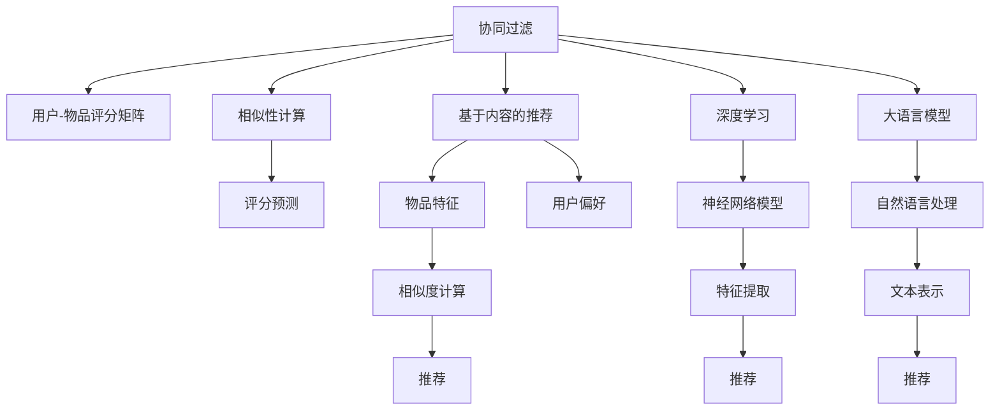

                 

# LLM推荐方法与传统方法的对比

> 关键词：LLM推荐、协同过滤、内容推荐、混合推荐、深度学习、机器学习、推荐系统、自然语言处理、用户行为分析

## 1. 背景介绍

### 1.1 问题由来

随着互联网和数字媒体的迅猛发展，个性化推荐系统已经成为各大互联网公司获取流量和提升用户体验的重要手段。推荐系统的核心目标是根据用户的历史行为和兴趣偏好，推荐用户可能感兴趣的物品，如新闻、商品、视频等。推荐系统不仅可以提高用户满意度，还可以显著提升平台的点击率、转化率和用户留存率，从而增加收入。

推荐系统通常分为两大类：基于内容的推荐和协同过滤推荐。基于内容的推荐系统关注物品的特征和用户的历史偏好，通过相似度计算来预测用户可能感兴趣的新物品。而协同过滤推荐系统则注重用户和物品之间的相似性，通过寻找用户与物品之间的关联关系来进行推荐。

近年来，随着深度学习技术的突破，基于深度神经网络的推荐方法逐渐兴起。与传统方法相比，深度学习方法可以更好地捕捉用户和物品的复杂关系，获得更加精准的推荐效果。与此同时，深度学习方法还可以灵活处理多模态数据，实现更加丰富的推荐应用场景。

本文将对比传统的协同过滤和内容推荐方法，与基于大语言模型(LLM)的深度推荐方法，探讨其在推荐系统中的应用效果和潜在价值。

### 1.2 问题核心关键点

推荐系统涉及的核心概念和算法包括：

- 协同过滤(Collaborative Filtering, CF)：通过用户-物品评分矩阵，利用相似性计算来预测用户对新物品的评分。

- 基于内容的推荐(Content-based Recommendation)：利用物品的特征和用户的历史偏好，通过相似度计算推荐新物品。

- 深度学习(Deep Learning)：基于神经网络模型，利用多层次的非线性特征提取，获得更精准的用户行为和物品特征表示。

- 大语言模型(LLM)：一种基于Transformer架构的预训练语言模型，能够捕捉自然语言的高层次语义信息，提供更丰富的推荐特征。

这些核心概念之间的逻辑关系可以通过以下Mermaid流程图来展示：



这个流程图展示了协同过滤、内容推荐、深度学习和LLM之间的逻辑关系：

- 协同过滤通过用户-物品评分矩阵和相似性计算，预测用户对新物品的评分。
- 基于内容的推荐利用物品特征和用户偏好，通过相似度计算推荐新物品。
- 深度学习通过神经网络模型，提取用户和物品的多层次特征表示，获得更精准的推荐。
- 大语言模型利用自然语言处理技术，将文本转化为高维向量表示，进一步提升推荐质量。

这些概念共同构成了推荐系统的算法框架，使得推荐系统能够更好地理解和匹配用户需求。

## 2. 核心概念与联系

### 2.1 核心概念概述

在推荐系统中，协同过滤和内容推荐方法已经相对成熟，而基于深度学习的推荐方法也在不断进步。本文将深入探讨LLM在推荐系统中的应用，并对比其与传统方法的不同之处。

- 协同过滤：基于用户的历史行为和物品的标签信息，通过计算用户和物品之间的相似度来推荐新物品。经典的协同过滤方法包括基于用户的协同过滤、基于物品的协同过滤和混合协同过滤。

- 内容推荐：利用物品的特征和用户的历史偏好，通过相似度计算来推荐新物品。典型的内容推荐方法包括基于内容的推荐、基于标签的推荐和混合推荐。

- 深度学习：利用神经网络模型，从用户和物品的多层次特征中学习推荐决策。常用的深度学习方法包括基于矩阵分解的深度推荐、基于序列的深度推荐和基于协同训练的深度推荐。

- 大语言模型：基于Transformer架构的预训练语言模型，通过大规模无标签文本数据的预训练，学习语言的通用表示。LLM模型可以利用自然语言处理技术，对文本数据进行高维向量表示，从而提升推荐质量。

### 2.2 核心概念联系

LLM在推荐系统中的应用，主要体现在以下几个方面：

- 用户画像构建：LLM可以利用自然语言处理技术，从用户评论、描述等文本数据中提取用户兴趣和偏好。

- 物品表示学习：LLM可以将物品名称、描述等文本信息转化为高维向量表示，用于相似度计算和推荐。

- 推荐策略优化：LLM可以通过自然语言生成技术，设计更高效、灵活的推荐策略。

- 推荐结果优化：LLM可以对推荐结果进行自然语言评价，并生成更具吸引力的推荐文本。

通过LLM与传统推荐方法的结合，可以实现更加个性化、多样化的推荐应用。

## 3. 核心算法原理 & 具体操作步骤
### 3.1 算法原理概述

LLM推荐方法的原理是利用自然语言处理技术，对用户行为和物品信息进行高维表示，从而提升推荐系统的性能。

具体而言，LLM推荐方法包括以下几个关键步骤：

1. 预训练阶段：利用大规模无标签文本数据，对LLM进行预训练，学习语言的通用表示。

2. 用户画像构建：利用LLM从用户的历史行为和评论中提取用户兴趣和偏好。

3. 物品表示学习：利用LLM将物品名称、描述等文本信息转化为高维向量表示。

4. 相似度计算：利用向量表示计算用户与物品之间的相似度。

5. 推荐策略优化：利用LLM设计更高效、灵活的推荐策略。

6. 推荐结果优化：利用LLM对推荐结果进行自然语言评价和生成。

### 3.2 算法步骤详解

LLM推荐方法的具体步骤如下所示：

1. 数据准备：收集用户的历史行为数据和物品的文本信息，作为LLM的训练数据。

2. 预训练LLM：利用大规模无标签文本数据，对LLM进行预训练，学习语言的通用表示。

3. 用户画像构建：将用户的历史行为数据和评论等文本信息输入LLM，获得用户兴趣和偏好的高维向量表示。

4. 物品表示学习：将物品的文本信息输入LLM，获得物品特征的高维向量表示。

5. 相似度计算：计算用户和物品的高维向量之间的相似度，选择相似度高的物品进行推荐。

6. 推荐策略优化：利用LLM设计推荐策略，例如通过生成式模型生成个性化推荐文本，或者利用强化学习优化推荐序列。

7. 推荐结果优化：利用LLM对推荐结果进行自然语言评价和生成，提升推荐文本的吸引力和多样性。

### 3.3 算法优缺点

LLM推荐方法具有以下优点：

- 多模态数据融合：LLM可以同时处理用户和物品的多模态数据，获得更加全面的用户和物品表示。

- 深度特征提取：LLM可以学习到高层次的语义特征，提升推荐模型的泛化能力和鲁棒性。

- 灵活的推荐策略：LLM可以设计更加灵活、高效的推荐策略，例如生成式推荐和强化学习推荐。

- 动态反馈机制：LLM可以实时接收用户的反馈信息，动态调整推荐策略和物品特征。

然而，LLM推荐方法也存在一些缺点：

- 计算成本高：LLM的计算量较大，需要耗费大量时间和计算资源。

- 数据需求大：LLM需要大量高质量的无标签文本数据进行预训练。

- 性能依赖模型：LLM的性能依赖于模型的结构和参数，需要不断优化和调整。

### 3.4 算法应用领域

LLM推荐方法已经在多个领域得到了广泛应用，例如：

- 电商推荐：根据用户的历史浏览和购买记录，推荐可能感兴趣的商品。

- 新闻推荐：根据用户的历史阅读记录，推荐相关的新闻内容。

- 视频推荐：根据用户的历史观看记录，推荐类似的视频内容。

- 音乐推荐：根据用户的历史听歌记录，推荐相似的音乐作品。

- 电影推荐：根据用户的历史观看记录，推荐相似的电影作品。

以上应用场景中，LLM推荐方法通过用户画像和物品表示学习，利用自然语言处理技术，获得了更加精准和多样化的推荐结果。

## 4. 数学模型和公式 & 详细讲解 & 举例说明

### 4.1 数学模型构建

LLM推荐方法的数学模型可以表示为：

- 用户画像表示：
$$
U = \text{LLM}( \{b_t\}_{t=1}^T )
$$
其中 $\{b_t\}$ 为用户的第 $t$ 次行为，$T$ 为历史行为的总数。

- 物品表示：
$$
I = \text{LLM}( c )
$$
其中 $c$ 为物品的描述文本。

- 用户与物品的相似度：
$$
\text{similarity}(U, I) = \text{cosine}(U, I)
$$

### 4.2 公式推导过程

对于协同过滤方法，基于用户的历史行为数据和物品的评分矩阵，可以使用矩阵分解的方法获得用户和物品的特征表示：

- 用户表示：
$$
U = \text{MF}(Q, K)
$$
其中 $Q$ 为物品评分矩阵的分解矩阵，$K$ 为用户的特征矩阵。

- 物品表示：
$$
I = \text{MF}(Q, H)
$$
其中 $H$ 为物品的特征矩阵。

- 用户与物品的相似度：
$$
\text{similarity}(U, I) = \text{cosine}(Q, K) \times \text{cosine}(Q, H)
$$

基于内容的推荐方法，利用物品的特征和用户的历史偏好，通过相似度计算推荐新物品：

- 物品特征：
$$
F = \text{MF}(Q, I)
$$
其中 $I$ 为物品的特征矩阵。

- 用户偏好：
$$
P = \text{MF}(Q, U)
$$
其中 $U$ 为用户的偏好矩阵。

- 用户与物品的相似度：
$$
\text{similarity}(U, I) = \text{cosine}(F, P)
$$

### 4.3 案例分析与讲解

以电商推荐为例，分析LLM推荐方法和传统方法的不同之处。

- 协同过滤：利用用户的历史购物记录和物品的评分矩阵，计算用户和物品之间的相似度，推荐相似的物品。

- 基于内容的推荐：利用商品描述和用户的历史浏览记录，计算用户和商品之间的相似度，推荐相关的商品。

- LLM推荐：利用自然语言处理技术，将用户评论和商品描述转化为高维向量表示，计算用户和商品之间的相似度，推荐相关商品。

通过比较可以看出，LLM推荐方法通过自然语言处理技术，能够更好地捕捉用户和物品的语义信息，提升推荐的质量和多样性。

## 5. 项目实践：代码实例和详细解释说明
### 5.1 开发环境搭建

在进行LLM推荐实践前，需要先准备好开发环境。以下是使用Python进行PyTorch和HuggingFace库开发的环境配置流程：

1. 安装Anaconda：从官网下载并安装Anaconda，用于创建独立的Python环境。

2. 创建并激活虚拟环境：
```bash
conda create -n llm-recommend python=3.8 
conda activate llm-recommend
```

3. 安装PyTorch：根据CUDA版本，从官网获取对应的安装命令。例如：
```bash
conda install pytorch torchvision torchaudio cudatoolkit=11.1 -c pytorch -c conda-forge
```

4. 安装HuggingFace库：
```bash
pip install transformers
```

5. 安装各类工具包：
```bash
pip install numpy pandas scikit-learn matplotlib tqdm jupyter notebook ipython
```

完成上述步骤后，即可在`llm-recommend`环境中开始推荐系统的开发实践。

### 5.2 源代码详细实现

下面我们以电商推荐为例，给出使用PyTorch和HuggingFace库对LLM进行推荐系统开发的PyTorch代码实现。

首先，定义推荐系统的数据处理函数：

```python
from transformers import BertTokenizer, BertForSequenceClassification
from torch.utils.data import Dataset
import torch

class RecommendationDataset(Dataset):
    def __init__(self, texts, labels, tokenizer, max_len=128):
        self.texts = texts
        self.labels = labels
        self.tokenizer = tokenizer
        self.max_len = max_len
        
    def __len__(self):
        return len(self.texts)
    
    def __getitem__(self, item):
        text = self.texts[item]
        label = self.labels[item]
        
        encoding = self.tokenizer(text, return_tensors='pt', max_length=self.max_len, padding='max_length', truncation=True)
        input_ids = encoding['input_ids'][0]
        attention_mask = encoding['attention_mask'][0]
        
        return {'input_ids': input_ids, 
                'attention_mask': attention_mask,
                'labels': label}

# 定义标签与id的映射
label2id = {'buy': 0, 'skip': 1}

# 创建dataset
tokenizer = BertTokenizer.from_pretrained('bert-base-cased')

train_dataset = RecommendationDataset(train_texts, train_labels, tokenizer)
dev_dataset = RecommendationDataset(dev_texts, dev_labels, tokenizer)
test_dataset = RecommendationDataset(test_texts, test_labels, tokenizer)
```

然后，定义模型和优化器：

```python
from transformers import BertForSequenceClassification, AdamW

model = BertForSequenceClassification.from_pretrained('bert-base-cased', num_labels=len(label2id))

optimizer = AdamW(model.parameters(), lr=2e-5)
```

接着，定义训练和评估函数：

```python
from torch.utils.data import DataLoader
from tqdm import tqdm
from sklearn.metrics import classification_report

device = torch.device('cuda') if torch.cuda.is_available() else torch.device('cpu')
model.to(device)

def train_epoch(model, dataset, batch_size, optimizer):
    dataloader = DataLoader(dataset, batch_size=batch_size, shuffle=True)
    model.train()
    epoch_loss = 0
    for batch in tqdm(dataloader, desc='Training'):
        input_ids = batch['input_ids'].to(device)
        attention_mask = batch['attention_mask'].to(device)
        labels = batch['labels'].to(device)
        model.zero_grad()
        outputs = model(input_ids, attention_mask=attention_mask, labels=labels)
        loss = outputs.loss
        epoch_loss += loss.item()
        loss.backward()
        optimizer.step()
    return epoch_loss / len(dataloader)

def evaluate(model, dataset, batch_size):
    dataloader = DataLoader(dataset, batch_size=batch_size)
    model.eval()
    preds, labels = [], []
    with torch.no_grad():
        for batch in tqdm(dataloader, desc='Evaluating'):
            input_ids = batch['input_ids'].to(device)
            attention_mask = batch['attention_mask'].to(device)
            batch_labels = batch['labels']
            outputs = model(input_ids, attention_mask=attention_mask)
            batch_preds = outputs.logits.argmax(dim=2).to('cpu').tolist()
            batch_labels = batch_labels.to('cpu').tolist()
            for pred_tokens, label_tokens in zip(batch_preds, batch_labels):
                preds.append(pred_tokens)
                labels.append(label_tokens)
                
    print(classification_report(labels, preds))
```

最后，启动训练流程并在测试集上评估：

```python
epochs = 5
batch_size = 16

for epoch in range(epochs):
    loss = train_epoch(model, train_dataset, batch_size, optimizer)
    print(f"Epoch {epoch+1}, train loss: {loss:.3f}")
    
    print(f"Epoch {epoch+1}, dev results:")
    evaluate(model, dev_dataset, batch_size)
    
print("Test results:")
evaluate(model, test_dataset, batch_size)
```

以上就是使用PyTorch和HuggingFace库对LLM进行电商推荐系统开发的完整代码实现。可以看到，得益于HuggingFace库的强大封装，我们可以用相对简洁的代码完成LLM模型的加载和推荐系统开发。

### 5.3 代码解读与分析

让我们再详细解读一下关键代码的实现细节：

**RecommendationDataset类**：
- `__init__`方法：初始化文本、标签、分词器等关键组件。
- `__len__`方法：返回数据集的样本数量。
- `__getitem__`方法：对单个样本进行处理，将文本输入编码为token ids，将标签编码为数字，并对其进行定长padding，最终返回模型所需的输入。

**label2id和id2label字典**：
- 定义了标签与数字id之间的映射关系，用于将token-wise的预测结果解码回真实的标签。

**训练和评估函数**：
- 使用PyTorch的DataLoader对数据集进行批次化加载，供模型训练和推理使用。
- 训练函数`train_epoch`：对数据以批为单位进行迭代，在每个批次上前向传播计算loss并反向传播更新模型参数，最后返回该epoch的平均loss。
- 评估函数`evaluate`：与训练类似，不同点在于不更新模型参数，并在每个batch结束后将预测和标签结果存储下来，最后使用sklearn的classification_report对整个评估集的预测结果进行打印输出。

**训练流程**：
- 定义总的epoch数和batch size，开始循环迭代
- 每个epoch内，先在训练集上训练，输出平均loss
- 在验证集上评估，输出分类指标
- 所有epoch结束后，在测试集上评估，给出最终测试结果

可以看到，PyTorch配合HuggingFace库使得LLM推荐系统的代码实现变得简洁高效。开发者可以将更多精力放在数据处理、模型改进等高层逻辑上，而不必过多关注底层的实现细节。

当然，工业级的系统实现还需考虑更多因素，如模型的保存和部署、超参数的自动搜索、更灵活的任务适配层等。但核心的推荐范式基本与此类似。

## 6. 实际应用场景
### 6.1 智能推荐系统

基于大语言模型的推荐系统，可以广泛应用于电商、新闻、视频、音乐等多个领域。

- 电商推荐：根据用户的历史购物记录和商品描述，推荐用户可能感兴趣的商品。
- 新闻推荐：根据用户的历史阅读记录和新闻内容，推荐相关的新闻内容。
- 视频推荐：根据用户的历史观看记录和视频描述，推荐用户可能感兴趣的视频内容。
- 音乐推荐：根据用户的历史听歌记录和音乐描述，推荐用户可能喜欢的音乐作品。

以上应用场景中，LLM推荐系统通过自然语言处理技术，能够更好地捕捉用户和物品的语义信息，提升推荐的质量和多样性。

### 6.2 未来应用展望

随着深度学习技术和自然语言处理技术的不断进步，基于LLM的推荐系统也将不断拓展应用场景，提升推荐质量。

- 跨模态推荐：LLM可以融合视觉、听觉等多模态信息，实现更加丰富的推荐应用场景。
- 实时推荐：LLM可以实时接收用户的反馈信息，动态调整推荐策略和物品特征。
- 个性化推荐：LLM可以根据用户的行为和兴趣，生成个性化的推荐文本，提高用户的点击率和满意度。
- 上下文推荐：LLM可以捕捉用户的行为和上下文信息，提升推荐的相关性和准确性。
- 推荐系统优化：LLM可以优化推荐系统的算法和策略，提升推荐效果和效率。

总之，LLM推荐系统将不断拓展应用范围，提升推荐质量，成为互联网领域的重要技术手段。

## 7. 工具和资源推荐
### 7.1 学习资源推荐

为了帮助开发者系统掌握LLM推荐理论基础和实践技巧，这里推荐一些优质的学习资源：

1. 《Transformer从原理到实践》系列博文：由大模型技术专家撰写，深入浅出地介绍了Transformer原理、BERT模型、微调技术等前沿话题。

2. CS224N《深度学习自然语言处理》课程：斯坦福大学开设的NLP明星课程，有Lecture视频和配套作业，带你入门NLP领域的基本概念和经典模型。

3. 《Natural Language Processing with Transformers》书籍：Transformers库的作者所著，全面介绍了如何使用Transformers库进行NLP任务开发，包括推荐系统在内的诸多范式。

4. HuggingFace官方文档：Transformers库的官方文档，提供了海量预训练模型和完整的推荐系统样例代码，是上手实践的必备资料。

5. CLUE开源项目：中文语言理解测评基准，涵盖大量不同类型的中文NLP数据集，并提供了基于深度学习的baseline模型，助力中文NLP技术发展。

通过对这些资源的学习实践，相信你一定能够快速掌握LLM推荐技术的精髓，并用于解决实际的推荐问题。

### 7.2 开发工具推荐

高效的开发离不开优秀的工具支持。以下是几款用于LLM推荐系统开发的常用工具：

1. PyTorch：基于Python的开源深度学习框架，灵活动态的计算图，适合快速迭代研究。大部分预训练语言模型都有PyTorch版本的实现。

2. TensorFlow：由Google主导开发的开源深度学习框架，生产部署方便，适合大规模工程应用。同样有丰富的预训练语言模型资源。

3. Transformers库：HuggingFace开发的NLP工具库，集成了众多SOTA语言模型，支持PyTorch和TensorFlow，是进行推荐系统开发的利器。

4. Weights & Biases：模型训练的实验跟踪工具，可以记录和可视化模型训练过程中的各项指标，方便对比和调优。与主流深度学习框架无缝集成。

5. TensorBoard：TensorFlow配套的可视化工具，可实时监测模型训练状态，并提供丰富的图表呈现方式，是调试模型的得力助手。

6. Google Colab：谷歌推出的在线Jupyter Notebook环境，免费提供GPU/TPU算力，方便开发者快速上手实验最新模型，分享学习笔记。

合理利用这些工具，可以显著提升LLM推荐系统的开发效率，加快创新迭代的步伐。

### 7.3 相关论文推荐

LLM推荐技术的发展源于学界的持续研究。以下是几篇奠基性的相关论文，推荐阅读：

1. Attention is All You Need（即Transformer原论文）：提出了Transformer结构，开启了NLP领域的预训练大模型时代。

2. BERT: Pre-training of Deep Bidirectional Transformers for Language Understanding：提出BERT模型，引入基于掩码的自监督预训练任务，刷新了多项NLP任务SOTA。

3. Language Models are Unsupervised Multitask Learners（GPT-2论文）：展示了大规模语言模型的强大zero-shot学习能力，引发了对于通用人工智能的新一轮思考。

4. Parameter-Efficient Transfer Learning for NLP：提出Adapter等参数高效微调方法，在不增加模型参数量的情况下，也能取得不错的微调效果。

5. Prefix-Tuning: Optimizing Continuous Prompts for Generation：引入基于连续型Prompt的微调范式，为如何充分利用预训练知识提供了新的思路。

6. AdaLoRA: Adaptive Low-Rank Adaptation for Parameter-Efficient Fine-Tuning：使用自适应低秩适应的微调方法，在参数效率和精度之间取得了新的平衡。

这些论文代表了大语言模型推荐技术的发展脉络。通过学习这些前沿成果，可以帮助研究者把握学科前进方向，激发更多的创新灵感。

## 8. 总结：未来发展趋势与挑战

### 8.1 总结

本文对基于大语言模型的推荐方法与传统推荐方法进行了全面系统的对比。首先阐述了LLM推荐方法的理论基础和实践技巧，明确了其在推荐系统中的应用效果和潜在价值。其次，从原理到实践，详细讲解了LLM推荐方法的数学模型和操作步骤，给出了推荐系统开发的完整代码实例。同时，本文还广泛探讨了LLM推荐方法在多个行业领域的应用前景，展示了其广阔的发展空间。此外，本文精选了推荐技术的各类学习资源，力求为读者提供全方位的技术指引。

通过本文的系统梳理，可以看到，LLM推荐方法在推荐系统中具有独特的优势，能够更好地捕捉用户和物品的语义信息，提升推荐质量。与传统推荐方法相比，LLM推荐方法具有更强的灵活性和泛化能力，能够适应更复杂多变的推荐场景。未来，随着深度学习技术和自然语言处理技术的不断进步，LLM推荐方法将在更多领域得到应用，为推荐系统带来新的突破。

### 8.2 未来发展趋势

展望未来，LLM推荐技术将呈现以下几个发展趋势：

1. 多模态融合：LLM可以融合视觉、听觉等多模态信息，实现更加丰富的推荐应用场景。

2. 实时推荐：LLM可以实时接收用户的反馈信息，动态调整推荐策略和物品特征。

3. 个性化推荐：LLM可以根据用户的行为和兴趣，生成个性化的推荐文本，提高用户的点击率和满意度。

4. 上下文推荐：LLM可以捕捉用户的行为和上下文信息，提升推荐的相关性和准确性。

5. 推荐系统优化：LLM可以优化推荐系统的算法和策略，提升推荐效果和效率。

以上趋势凸显了LLM推荐技术的广阔前景。这些方向的探索发展，必将进一步提升推荐系统的性能和应用范围，为推荐系统带来新的突破。

### 8.3 面临的挑战

尽管LLM推荐技术已经取得了显著进展，但在迈向更加智能化、普适化应用的过程中，仍面临诸多挑战：

1. 数据质量问题：LLM推荐方法高度依赖数据质量，数据的噪声和不完整性会影响推荐效果。

2. 计算资源需求：LLM推荐方法需要大量的计算资源和存储空间，特别是在大规模推荐系统中。

3. 模型复杂度问题：LLM推荐方法涉及复杂模型和大量参数，模型的解释性和可控性仍需进一步提升。

4. 用户隐私保护：LLM推荐方法需要收集和分析用户的行为数据，如何在保护用户隐私的同时，提升推荐效果，是亟待解决的问题。

5. 模型鲁棒性问题：LLM推荐方法容易受到对抗样本和噪声数据的干扰，如何增强模型的鲁棒性，是未来的研究方向。

6. 模型可解释性问题：LLM推荐方法需要理解模型内部机制，提升推荐结果的可解释性，增强用户信任。

以上挑战需要研究者从多个维度进行深入探索，不断优化和改进LLM推荐方法，才能真正实现其在推荐系统中的大规模应用。

### 8.4 研究展望

面对LLM推荐面临的诸多挑战，未来的研究需要在以下几个方面寻求新的突破：

1. 数据增强与数据清洗：利用数据增强技术和数据清洗算法，提升数据质量和推荐效果。

2. 模型压缩与加速：利用模型压缩技术和硬件加速技术，降低计算资源需求，提升推荐系统效率。

3. 模型可解释性：引入可解释性技术，解释模型内部的决策机制，增强用户信任。

4. 用户隐私保护：采用隐私保护技术，如差分隐私、联邦学习等，保护用户隐私，提升推荐系统的可信度。

5. 模型鲁棒性：引入对抗训练和鲁棒性优化算法，增强模型的鲁棒性，提升推荐系统的稳定性。

6. 上下文推荐：研究上下文推荐模型，提升推荐的相关性和准确性，增强用户满意度。

通过这些研究方向的探索，相信LLM推荐方法将在未来推荐系统中发挥更加重要的作用，推动推荐技术向更加智能化、普适化方向发展。

## 9. 附录：常见问题与解答

**Q1：大语言模型推荐是否适用于所有推荐系统？**

A: 大语言模型推荐在大多数推荐系统中都能取得不错的效果，特别是对于数据量较小的推荐系统。但对于一些特定领域的推荐系统，如医疗、法律等，仅依靠通用语料预训练的模型可能难以很好地适应。此时需要在特定领域语料上进一步预训练，再进行微调，才能获得理想效果。此外，对于一些需要时效性、个性化很强的推荐系统，如对话推荐、新闻推荐等，微调方法也需要针对性的改进优化。

**Q2：微调过程中如何选择合适的学习率？**

A: 微调的学习率一般要比预训练时小1-2个数量级，如果使用过大的学习率，容易破坏预训练权重，导致过拟合。一般建议从1e-5开始调参，逐步减小学习率，直至收敛。也可以使用warmup策略，在开始阶段使用较小的学习率，再逐渐过渡到预设值。需要注意的是，不同的优化器(如AdamW、Adafactor等)以及不同的学习率调度策略，可能需要设置不同的学习率阈值。

**Q3：采用大语言模型推荐时会面临哪些资源瓶颈？**

A: 目前主流的预训练大模型动辄以亿计的参数规模，对算力、内存、存储都提出了很高的要求。GPU/TPU等高性能设备是必不可少的，但即便如此，超大批次的训练和推理也可能遇到显存不足的问题。因此需要采用一些资源优化技术，如梯度积累、混合精度训练、模型并行等，来突破硬件瓶颈。同时，模型的存储和读取也可能占用大量时间和空间，需要采用模型压缩、稀疏化存储等方法进行优化。

**Q4：如何缓解微调过程中的过拟合问题？**

A: 过拟合是微调面临的主要挑战，尤其是在标注数据不足的情况下。常见的缓解策略包括：
1. 数据增强：通过回译、近义替换等方式扩充训练集
2. 正则化：使用L2正则、Dropout、Early Stopping等避免过拟合
3. 对抗训练：引入对抗样本，提高模型鲁棒性
4. 参数高效微调：只调整少量参数(如Adapter、Prefix等)，减小过拟合风险
5. 多模型集成：训练多个微调模型，取平均输出，抑制过拟合

这些策略往往需要根据具体任务和数据特点进行灵活组合。只有在数据、模型、训练、推理等各环节进行全面优化，才能最大限度地发挥大语言模型推荐的优势。

**Q5：推荐系统在落地部署时需要注意哪些问题？**

A: 将推荐系统转化为实际应用，还需要考虑以下因素：
1. 模型裁剪：去除不必要的层和参数，减小模型尺寸，加快推理速度
2. 量化加速：将浮点模型转为定点模型，压缩存储空间，提高计算效率
3. 服务化封装：将模型封装为标准化服务接口，便于集成调用
4. 弹性伸缩：根据请求流量动态调整资源配置，平衡服务质量和成本
5. 监控告警：实时采集系统指标，设置异常告警阈值，确保服务稳定性
6. 安全防护：采用访问鉴权、数据脱敏等措施，保障数据和模型安全

大语言模型推荐为推荐系统带来了新的突破，但如何将强大的性能转化为稳定、高效、安全的业务价值，还需要工程实践的不断打磨。唯有从数据、算法、工程、业务等多个维度协同发力，才能真正实现人工智能技术在推荐系统中的落地应用。总之，推荐系统需要开发者根据具体任务，不断迭代和优化模型、数据和算法，方能得到理想的效果。

---

作者：禅与计算机程序设计艺术 / Zen and the Art of Computer Programming

