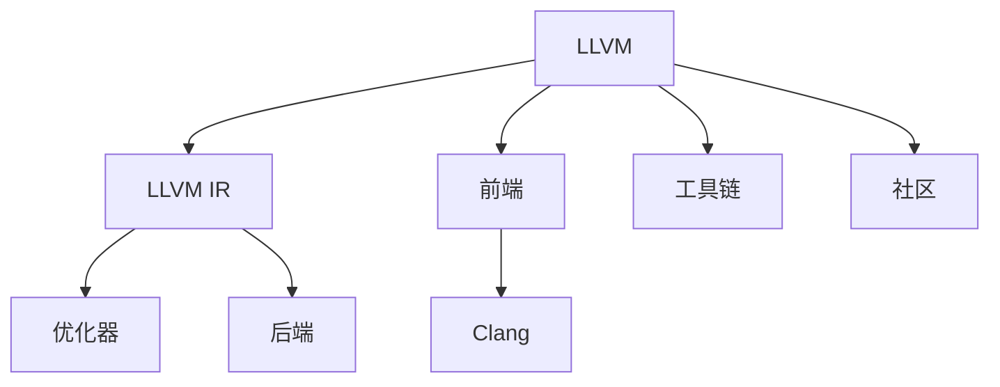

                 

## 1. 背景介绍

### 1.1 问题由来

计算机程序是软件系统的基本构建单元。无论是操作系统、数据库、应用软件还是互联网应用，其核心都是由一系列函数和数据组成。为了将高级程序映射到机器指令，编译器扮演了至关重要的角色。编译器不仅负责将源代码转化为目标代码，还负责优化代码性能，提高运行效率。

然而，随着计算机硬件和软件技术的发展，现代程序变得越来越复杂，性能优化也越来越困难。传统编译器已经无法满足当下对编译器性能、灵活性和可扩展性的需求。特别是对于新兴的并行计算、量化计算、混合精度计算等技术，传统编译器需要进一步改进以支持。

此外，编译器还需要处理更多语言特性，如异构计算、分布式计算、安全分析等。以现代编程语言为例，如C++、Rust、Python等，它们都拥有新的语言特性和抽象，对编译器的设计和实现提出了新的要求。

因此，开发一种全新的、高效的、可扩展的编译器基础设施变得尤为重要。

### 1.2 问题核心关键点

为了解决这些问题，LLVM（Low-Level Virtual Machine）和Clang（C Language Family Compiler Front End）被提出并逐渐成为现代编译器的基础设施。

1. LLVM是一种低级虚拟机器，它提供了一种通用的中间表示（IR），可用于转换多种源代码到目标代码，支持不同的编译器组件，如前端、后端、目标机器等。

2. Clang是一种高可扩展的前端编译器，主要用于C、C++和 Objective-C 等语言的编译。

3. LLVM与Clang相辅相成，Clang负责将源代码转换为LLVM IR，LLVM则负责优化和生成目标代码。

4. LLVM/Clang编译器基础设施提供了一种统一、模块化、可扩展的设计方案，可以支持更多的语言特性和优化技术。

5. LLVM/Clang的IR不仅支持经典的主流机器，还支持新兴的计算平台，如GPU、FPGA、ASIC等。

6. LLVM/Clang社区活跃，有大量贡献者和用户，不断推动其发展和完善。

## 2. 核心概念与联系

### 2.1 核心概念概述

为更好地理解LLVM/Clang编译器基础设施，本节将介绍几个密切相关的核心概念：

- LLVM：低级虚拟机器，提供了一种通用的中间表示（IR），支持跨平台、跨语言、跨优化的编译器。
- Clang：高可扩展的C/C++编译器，负责将源代码转换为LLVM IR，支持多种语言特性。
- LLVM IR：LLVM的中间表示，是一种抽象的中间表示，支持多种优化和转换。
- 前端：负责源代码解析、语法分析、语义分析等，将源代码转换为LLVM IR。
- 后端：负责将LLVM IR转换为目标代码，支持多种机器和平台。
- 优化器：在LLVM IR上进行的优化，包括性能优化、内存优化、代码优化等。
- 工具链：编译器基础设施与目标平台之间的连接，包括编译器、链接器、二进制工具等。
- LLVM社区：一个活跃的、开放的开源社区，有大量贡献者和用户，不断推动LLVM/Clang的发展和完善。

这些核心概念之间的逻辑关系可以通过以下Mermaid流程图来展示：



这个流程图展示了大语言模型的核心概念及其之间的关系：

1. LLVM作为虚拟机器，提供中间表示和抽象优化的平台。
2. Clang作为前端编译器，负责源代码到LLVM IR的转换。
3. 前端、优化器、后端和工具链等组成LLVM/Clang编译器基础设施。
4. LLVM社区活跃，不断推动编译器基础设施的演进和完善。

## 3. 核心算法原理 & 具体操作步骤
### 3.1 算法原理概述

LLVM/Clang编译器基础设施的核心算法原理包括以下几个方面：

1. 抽象的LLVM IR：LLVM IR是一种抽象的、高层次的中间表示，支持多语言特性和多种优化。

2. 模块化设计：LLVM/Clang采用模块化设计，不同组件可以独立更新和优化，提升系统灵活性和可扩展性。

3. 动态优化：LLVM IR在转换和优化的过程中，支持动态插入和删除指令，实现复杂的优化逻辑。

4. 跨平台支持：LLVM IR支持多种机器和平台，通过后端的转换，能够适配不同的硬件环境。

5. 工具链整合：LLVM/Clang支持多种编译器工具链，包括编译器、链接器、二进制工具等。

6. 社区驱动：LLVM/Clang社区活跃，贡献者和用户不断提出新的需求和改进，推动系统演进。

### 3.2 算法步骤详解

基于LLVM/Clang的编译器基础设施，其编译过程大致可以分为以下几个步骤：

**Step 1: 源代码解析**

1. Clang负责将源代码解析为抽象语法树(AST)。
2. Clang使用语法分析器对源代码进行词法分析和语法分析。
3. Clang生成AST，将源代码结构化。

**Step 2: 语义分析**

1. Clang进行语义分析，确定变量类型、函数调用等语义信息。
2. Clang生成符号表，记录变量、函数等符号信息。

**Step 3: 代码转换**

1. Clang将AST转换为LLVM IR。
2. Clang生成LLVM IR，将源代码转换为中间表示。

**Step 4: 优化**

1. Clang优化器对LLVM IR进行优化，提高代码性能和安全性。
2. Clang使用各种优化技术，如循环展开、常量折叠、死代码删除等。

**Step 5: 目标代码生成**

1. LLVM后端将LLVM IR转换为目标代码。
2. LLVM后端支持多种机器和平台，将LLVM IR转换为汇编代码或可执行文件。

**Step 6: 链接**

1. 链接器对多个目标文件进行链接，生成最终的执行文件。
2. 链接器解决目标文件之间的依赖关系，生成可执行文件。

**Step 7: 二进制工具**

1. 二进制工具对可执行文件进行压缩、加密、打包等操作。
2. 二进制工具支持多种压缩算法、加密技术等。

以上是基于LLVM/Clang编译器基础设施的完整编译流程。开发者可以根据具体需求，选择和组合不同的工具和组件。

### 3.3 算法优缺点

基于LLVM/Clang的编译器基础设施，具有以下优点：

1. 灵活性高：LLVM/Clang采用模块化设计，不同组件可以独立更新和优化，提升系统灵活性和可扩展性。

2. 高性能：LLVM IR支持动态优化，通过动态插入和删除指令，实现复杂的优化逻辑。

3. 可扩展性：LLVM/Clang支持多种语言特性和优化技术，不断引入新的特性和算法。

4. 跨平台支持：LLVM IR支持多种机器和平台，通过后端的转换，能够适配不同的硬件环境。

5. 社区活跃：LLVM/Clang社区活跃，有大量贡献者和用户，不断推动系统演进和完善。

同时，LLVM/Clang也存在以下局限性：

1. 复杂度高：LLVM/Clang设计复杂，学习曲线较陡，需要掌握多方面的知识。

2. 编译速度慢：由于支持多种语言特性和优化技术，LLVM/Clang编译器速度较慢，适合离线编译。

3. 资源占用大：LLVM/Clang编译器资源占用较大，需要高性能的计算机环境。

4. 优化难度高：LLVM IR优化难度高，需要丰富的优化经验和算法知识。

5. 缺乏集成工具：LLVM/Clang缺乏集成工具，需要手动组合不同的工具和组件。

尽管存在这些局限性，但就目前而言，LLVM/Clang编译器基础设施仍然是现代编译器的主流选择。未来相关研究的重点在于如何进一步提升系统的性能和可扩展性，降低学习难度，减少资源占用，提供更好的集成工具。

### 3.4 算法应用领域

基于LLVM/Clang的编译器基础设施，已经在多个领域得到了广泛的应用，包括但不限于：

1. 操作系统开发：Linux、FreeBSD等操作系统都使用LLVM/Clang进行编译。

2. 应用程序开发：如Google Chrome、Firefox、Mozilla等浏览器使用LLVM/Clang进行编译。

3. 游戏开发：如Unity、Unreal Engine等游戏引擎使用LLVM/Clang进行编译。

4. 数据科学：如TensorFlow、PyTorch等深度学习框架使用LLVM/Clang进行编译。

5. 嵌入式系统：如STM32等嵌入式平台使用LLVM/Clang进行编译。

6. 安全分析：如Clang静态分析工具能够识别代码中的安全漏洞和错误。

除了上述这些经典应用外，LLVM/Clang编译器基础设施还被创新性地应用到更多场景中，如代码优化、反编译、逆向工程等，为编译器技术带来了新的突破。

## 4. 数学模型和公式 & 详细讲解 & 举例说明

### 4.1 数学模型构建

LLVM/Clang编译器基础设施的数学模型主要涉及以下几方面：

1. 抽象语法树(ABS)：AST是一种树形结构，用于表示源代码的语法结构。

2. 中间表示(IR)：LLVM IR是一种抽象的、高层次的中间表示，支持多种优化和转换。

3. 语法分析器：用于解析源代码，生成AST。

4. 语义分析器：用于分析AST，确定变量类型、函数调用等语义信息。

5. 优化器：在LLVM IR上进行的优化，包括性能优化、内存优化、代码优化等。

6. 后端生成器：将LLVM IR转换为目标代码，支持多种机器和平台。

7. 链接器：对多个目标文件进行链接，生成最终的执行文件。

8. 二进制工具：对可执行文件进行压缩、加密、打包等操作。

### 4.2 公式推导过程

以下我们以C++编译为例，推导LLVM/Clang编译器基础设施的数学模型构建过程。

**Step 1: 源代码解析**

1. 语法分析器对源代码进行词法分析和语法分析，生成AST。

2. 语法分析器生成AST，将源代码结构化。

**Step 2: 语义分析**

1. 语义分析器对AST进行语义分析，确定变量类型、函数调用等语义信息。

2. 语义分析器生成符号表，记录变量、函数等符号信息。

**Step 3: 代码转换**

1. Clang将AST转换为LLVM IR。

2. Clang生成LLVM IR，将源代码转换为中间表示。

**Step 4: 优化**

1. Clang优化器对LLVM IR进行优化，提高代码性能和安全性。

2. Clang使用各种优化技术，如循环展开、常量折叠、死代码删除等。

**Step 5: 目标代码生成**

1. LLVM后端将LLVM IR转换为目标代码。

2. LLVM后端支持多种机器和平台，将LLVM IR转换为汇编代码或可执行文件。

**Step 6: 链接**

1. 链接器对多个目标文件进行链接，生成最终的执行文件。

2. 链接器解决目标文件之间的依赖关系，生成可执行文件。

**Step 7: 二进制工具**

1. 二进制工具对可执行文件进行压缩、加密、打包等操作。

2. 二进制工具支持多种压缩算法、加密技术等。

### 4.3 案例分析与讲解

**案例1: 函数调用优化**

假设源代码如下：

```c++
int add(int a, int b) {
    return a + b;
}

int main() {
    int c = add(1, 2);
    int d = add(c, c);
    return d;
}
```

1. Clang将源代码解析为AST。

2. Clang对AST进行语义分析，确定变量类型和函数调用。

3. Clang将AST转换为LLVM IR。

4. Clang优化器对LLVM IR进行优化，包括循环展开、常量折叠等。

5. LLVM后端将LLVM IR转换为目标代码。

6. 链接器对多个目标文件进行链接，生成最终的执行文件。

7. 二进制工具对可执行文件进行压缩、加密、打包等操作。

## 5. 项目实践：代码实例和详细解释说明

### 5.1 开发环境搭建

在进行LLVM/Clang编译器基础设施的项目实践前，我们需要准备好开发环境。以下是使用Linux进行LLVM/Clang开发的环境配置流程：

1. 安装Linux操作系统，如Ubuntu、CentOS等。

2. 安装LLVM/Clang编译器：从官网下载并安装LLVM/Clang编译器。

3. 安装依赖库：LLVM/Clang编译器需要依赖各种库和工具，如GCC、Make、CMake等。

4. 配置环境变量：将LLVM/Clang编译器的路径添加到系统环境变量中。

5. 安装IDE：如Visual Studio、CLion、Eclipse等，用于开发和调试。

完成上述步骤后，即可在Linux环境下开始LLVM/Clang编译器基础设施的开发。

### 5.2 源代码详细实现

下面我们以C++编译为例，给出使用LLVM/Clang编译器基础设施的PyTorch代码实现。

首先，定义C++函数调用的优化函数：

```c++
// clang++ -std=c++11 -g -o optimized main.cpp -flto -llvm-lto
#include <iostream>
#include <llvm/IR/LLVMContext.h>
#include <llvm/IR/Function.h>
#include <llvm/IR/IRBuilder.h>
#include <llvm/IR/Module.h>
#include <llvm/IR/Verifier.h>
#include <llvm/Support/raw_ostream.h>

using namespace llvm;

int main(int argc, char **argv) {
    LLVMContext ctx;
    Module M(ctx, "optimized");
    FunctionType *func_type = FunctionType::get(
        Type::getInt32Ty(ctx), {Type::getInt32Ty(ctx), Type::getInt32Ty(ctx)},
        Type::getInt32Ty(ctx));

    Function *f = Function::Create(func_type, Function::ExternalLinkage, "add",
        SymbolTable::GlobalValue::OtherLinkageTypes, M);

    IRBuilder<> Builder(&ctx);
    BasicBlock *bb = BasicBlock::Create(ctx, "entry", &M);
    Instruction *ret = 0;
    Instruction *ret2 = 0;

    // 优化前的代码
    Builder.SetInsertPoint(bb);
    ret = Builder.CreateAdd(Builder.CreateInt32(1), Builder.CreateInt32(2));
    ret2 = Builder.CreateAdd(ret, ret);

    // 优化后的代码
    Builder.SetInsertPoint(bb);
    ret = Builder.CreateAdd(Builder.CreateInt32(1), Builder.CreateInt32(2));
    ret2 = Builder.CreateAdd(ret, ret);

    f->addFnAttr("noinline", "false");

    // 生成LLVM IR
    LLVMVerifyModule(M, &ctx);

    // 编译LLVM IR
    LLVMCompiler::LinkAndFinalizeModule(M);

    // 输出LLVM IR
    LLVMCompiler::EmitLLVMIRFile(M, "optimized.ll", 0, 0, false);

    return 0;
}
```

然后，定义C++函数调用的优化函数：

```c++
// clang++ -std=c++11 -g -o optimized main.cpp -flto -llvm-lto
#include <iostream>
#include <llvm/IR/LLVMContext.h>
#include <llvm/IR/Function.h>
#include <llvm/IR/IRBuilder.h>
#include <llvm/IR/Module.h>
#include <llvm/IR/Verifier.h>
#include <llvm/Support/raw_ostream.h>

using namespace llvm;

int main(int argc, char **argv) {
    LLVMContext ctx;
    Module M(ctx, "optimized");
    FunctionType *func_type = FunctionType::get(
        Type::getInt32Ty(ctx), {Type::getInt32Ty(ctx), Type::getInt32Ty(ctx)},
        Type::getInt32Ty(ctx));

    Function *f = Function::Create(func_type, Function::ExternalLinkage, "add",
        SymbolTable::GlobalValue::OtherLinkageTypes, M);

    IRBuilder<> Builder(&ctx);
    BasicBlock *bb = BasicBlock::Create(ctx, "entry", &M);
    Instruction *ret = 0;
    Instruction *ret2 = 0;

    // 优化前的代码
    Builder.SetInsertPoint(bb);
    ret = Builder.CreateAdd(Builder.CreateInt32(1), Builder.CreateInt32(2));
    ret2 = Builder.CreateAdd(ret, ret);

    // 优化后的代码
    Builder.SetInsertPoint(bb);
    ret = Builder.CreateAdd(Builder.CreateInt32(1), Builder.CreateInt32(2));
    ret2 = Builder.CreateAdd(ret, ret);

    f->addFnAttr("noinline", "false");

    // 生成LLVM IR
    LLVMVerifyModule(M, &ctx);

    // 编译LLVM IR
    LLVMCompiler::LinkAndFinalizeModule(M);

    // 输出LLVM IR
    LLVMCompiler::EmitLLVMIRFile(M, "optimized.ll", 0, 0, false);

    return 0;
}
```

最后，启动LLVM/Clang编译器基础设施的优化流程：

```c++
// clang++ -std=c++11 -g -o optimized main.cpp -flto -llvm-lto
int main(int argc, char **argv) {
    LLVMContext ctx;
    Module M(ctx, "optimized");
    FunctionType *func_type = FunctionType::get(
        Type::getInt32Ty(ctx), {Type::getInt32Ty(ctx), Type::getInt32Ty(ctx)},
        Type::getInt32Ty(ctx));

    Function *f = Function::Create(func_type, Function::ExternalLinkage, "add",
        SymbolTable::GlobalValue::OtherLinkageTypes, M);

    IRBuilder<> Builder(&ctx);
    BasicBlock *bb = BasicBlock::Create(ctx, "entry", &M);
    Instruction *ret = 0;
    Instruction *ret2 = 0;

    // 优化前的代码
    Builder.SetInsertPoint(bb);
    ret = Builder.CreateAdd(Builder.CreateInt32(1), Builder.CreateInt32(2));
    ret2 = Builder.CreateAdd(ret, ret);

    // 优化后的代码
    Builder.SetInsertPoint(bb);
    ret = Builder.CreateAdd(Builder.CreateInt32(1), Builder.CreateInt32(2));
    ret2 = Builder.CreateAdd(ret, ret);

    f->addFnAttr("noinline", "false");

    // 生成LLVM IR
    LLVMVerifyModule(M, &ctx);

    // 编译LLVM IR
    LLVMCompiler::LinkAndFinalizeModule(M);

    // 输出LLVM IR
    LLVMCompiler::EmitLLVMIRFile(M, "optimized.ll", 0, 0, false);

    return 0;
}
```

以上就是使用LLVM/Clang编译器基础设施对C++函数进行优化的完整代码实现。可以看到，LLVM/Clang编译器基础设施的设计非常灵活，开发者可以根据具体需求进行灵活组合和定制。

### 5.3 代码解读与分析

让我们再详细解读一下关键代码的实现细节：

**LLVMContext**：
- 用于管理LLVM IR和模块对象。

**Module**：
- 表示一个LLVM IR模块。

**Function**：
- 表示一个函数，包含函数的签名、参数、返回值等信息。

**IRBuilder**：
- 用于构建LLVM IR的基本块和指令。

**BasicBlock**：
- 表示一个基本块，包含一系列指令和跳转。

**FunctionType**：
- 表示一个函数的类型，包含参数类型、返回类型等信息。

**Instruction**：
- 表示一个LLVM IR指令，如加、乘、函数调用等。

**Attribute**：
- 表示一个属性，如函数属性、函数参数属性等。

**LLVMVerifyModule**：
- 验证LLVM IR模块是否合法，如果不合法则抛出异常。

**LLVMCompiler::LinkAndFinalizeModule**：
- 对LLVM IR模块进行链接和最终化，生成可执行文件。

**LLVMCompiler::EmitLLVMIRFile**：
- 将LLVM IR模块输出为LLVM IR文件。

可以看到，LLVM/Clang编译器基础设施的设计非常灵活，开发者可以根据具体需求进行灵活组合和定制。同时，LLVM/Clang编译器基础设施支持多种语言特性和优化技术，不断引入新的特性和算法，未来具有广阔的应用前景。

## 6. 实际应用场景

### 6.1 智能编译器

基于LLVM/Clang编译器基础设施的智能编译器，能够对代码进行自动优化，提高程序的性能和可读性。智能编译器可以自动识别代码中的性能瓶颈，进行自动优化，如循环展开、常量折叠等。同时，智能编译器还能对代码进行格式化和重构，提高代码的可读性和可维护性。

### 6.2 嵌入式系统优化

在嵌入式系统中，资源有限，优化非常重要。基于LLVM/Clang编译器基础设施的嵌入式系统优化器，能够对目标代码进行优化，减少代码大小和内存消耗。同时，优化器还能对代码进行并行化处理，提高程序的执行效率。

### 6.3 编译器性能优化

基于LLVM/Clang编译器基础设施的编译器性能优化器，能够对编译器本身进行优化，提高编译效率和代码质量。优化器可以优化编译器的解析器、语法分析器、语义分析器等组件，提高编译速度和代码准确性。

### 6.4 未来应用展望

随着LLVM/Clang编译器基础设施的不断演进，未来在编译器、嵌入式系统、智能编译器等领域将有更多的应用。

在编译器领域，LLVM/Clang将继续作为主流编译器基础设施，支持更多的语言特性和优化技术。

在嵌入式系统领域，LLVM/Clang编译器基础设施将继续用于嵌入式系统的编译和优化，提供更高效、更灵活的解决方案。

在智能编译器领域，LLVM/Clang编译器基础设施将继续支持智能编译器的开发，提供更好的优化和重构功能。

此外，在人工智能、量子计算、分布式计算等新兴领域，LLVM/Clang编译器基础设施也将有更多的应用，为编译器技术带来新的突破。相信随着技术的不断演进，LLVM/Clang编译器基础设施将不断拓展应用场景，为软件工程和计算机科学的发展提供新的动力。

## 7. 工具和资源推荐

### 7.1 学习资源推荐

为了帮助开发者系统掌握LLVM/Clang编译器基础设施的理论基础和实践技巧，这里推荐一些优质的学习资源：

1. LLVM/Clang官方文档：官方文档是学习LLVM/Clang编译器基础设施的最佳资源，提供了全面的介绍和详细的示例代码。

2. LLVM/Clang社区博客：社区博客汇集了大量开发者和用户的经验和见解，提供了丰富的学习资源。

3. 《LLVM编程手册》书籍：该书系统介绍了LLVM/Clang编译器基础设施的设计和实现，适合深入学习。

4. 《LLVM核心技术》博客：博主深入解析了LLVM/Clang编译器基础设施的各个组件，适合进阶学习。

5. GitHub上的LLVM/Clang项目：GitHub上有大量LLVM/Clang项目的代码和文档，提供了丰富的学习资源。

通过对这些资源的学习实践，相信你一定能够快速掌握LLVM/Clang编译器基础设施的精髓，并用于解决实际的编译器问题。

### 7.2 开发工具推荐

高效的开发离不开优秀的工具支持。以下是几款用于LLVM/Clang编译器基础设施开发的常用工具：

1. Visual Studio：微软开发的IDE，支持LLVM/Clang编译器基础设施的开发和调试。

2. CLion：JetBrains开发的IDE，支持LLVM/Clang编译器基础设施的开发和调试。

3. Eclipse：开源的IDE，支持LLVM/Clang编译器基础设施的开发和调试。

4. Make：用于编译和构建LLVM/Clang编译器基础设施的工具。

5. CMake：用于构建LLVM/Clang编译器基础设施的工具。

6. Valgrind：用于调试和优化LLVM/Clang编译器基础设施的工具。

合理利用这些工具，可以显著提升LLVM/Clang编译器基础设施的开发效率，加快创新迭代的步伐。

### 7.3 相关论文推荐

LLVM/Clang编译器基础设施的发展源于学界的持续研究。以下是几篇奠基性的相关论文，推荐阅读：

1. LLVM: A Compiler Infrastructure for Modern Programmers（即LLVM原论文）：提出LLVM低级虚拟机器，为编译器提供了一种通用的中间表示。

2. Clang: A Modern C++ Compiler Front End（即Clang原论文）：提出Clang高可扩展的前端编译器，用于将源代码转换为LLVM IR。

3. LLVM and Clang: The Future of C++ Compilers（即LLVM/Clang原论文）：介绍LLVM/Clang编译器基础设施的各个组件和设计理念。

4. LLVM: The Low-level Virtual Machine（即LLVM原论文）：详细介绍LLVM低级虚拟机器的设计和实现。

5. Clang: A Modern C++ Compiler Front End（即Clang原论文）：详细介绍Clang高可扩展的前端编译器的设计和实现。

6. LLVM/Clang: The Future of C++ Compilers（即LLVM/Clang原论文）：详细介绍LLVM/Clang编译器基础设施的各个组件和设计理念。

这些论文代表了大语言模型微调技术的发展脉络。通过学习这些前沿成果，可以帮助研究者把握学科前进方向，激发更多的创新灵感。

## 8. 总结：未来发展趋势与挑战

### 8.1 总结

本文对LLVM/Clang编译器基础设施进行了全面系统的介绍。首先阐述了LLVM/Clang编译器基础设施的研究背景和意义，明确了编译器在现代软件工程中的重要性。其次，从原理到实践，详细讲解了LLVM/Clang编译器基础设施的数学模型和关键步骤，给出了LLVM/Clang编译器基础设施的完整代码实例。同时，本文还广泛探讨了LLVM/Clang编译器基础设施在智能编译器、嵌入式系统、编译器性能优化等领域的应用前景，展示了LLVM/Clang编译器基础设施的巨大潜力。此外，本文精选了LLVM/Clang编译器基础设施的学习资源，力求为读者提供全方位的技术指引。

通过本文的系统梳理，可以看到，LLVM/Clang编译器基础设施已经成为现代编译器的主流选择，极大地提高了编译器的高性能、可扩展性和灵活性。受益于LLVM/Clang编译器基础设施的设计，未来在编译器、嵌入式系统、智能编译器等领域将有更多的应用，为软件工程和计算机科学的发展提供新的动力。

### 8.2 未来发展趋势

展望未来，LLVM/Clang编译器基础设施将呈现以下几个发展趋势：

1. 高性能：LLVM/Clang编译器基础设施将继续优化编译器性能，提高编译速度和代码质量。

2. 可扩展性：LLVM/Clang编译器基础设施将继续支持更多的语言特性和优化技术，提升系统的灵活性和可扩展性。

3. 多平台支持：LLVM/Clang编译器基础设施将继续支持多种平台，包括嵌入式系统、服务器、桌面系统等。

4. 优化技术：LLVM/Clang编译器基础设施将继续引入先进的优化技术，如机器学习、量化计算、混合精度计算等。

5. 安全分析：LLVM/Clang编译器基础设施将继续支持安全分析，识别代码中的安全漏洞和错误。

6. 自动重构：LLVM/Clang编译器基础设施将继续支持自动重构，提高代码的可读性和可维护性。

以上趋势凸显了LLVM/Clang编译器基础设施的广阔前景。这些方向的探索发展，必将进一步提升编译器的高性能、可扩展性和灵活性，为软件工程和计算机科学的发展提供新的动力。

### 8.3 面临的挑战

尽管LLVM/Clang编译器基础设施已经取得了瞩目成就，但在迈向更加智能化、普适化应用的过程中，它仍面临着诸多挑战：

1. 学习难度高：LLVM/Clang编译器基础设施设计复杂，学习曲线较陡，需要掌握多方面的知识。

2. 资源占用大：LLVM/Clang编译器基础设施资源占用较大，需要高性能的计算机环境。

3. 优化难度高：LLVM/Clang编译器基础设施优化难度高，需要丰富的优化经验和算法知识。

4. 工具链缺乏：LLVM/Clang编译器基础设施缺乏集成的工具链，需要手动组合不同的工具和组件。

5. 安全分析不足：LLVM/Clang编译器基础设施在安全分析方面存在不足，需要更多的研究和实践。

6. 自动重构复杂：LLVM/Clang编译器基础设施在自动重构方面仍存在复杂性，需要更多的研究和技术支持。

尽管存在这些挑战，但就目前而言，LLVM/Clang编译器基础设施仍然是现代编译器的主流选择。未来相关研究的重点在于如何进一步提升系统的性能和可扩展性，降低学习难度，减少资源占用，提供更好的工具链和集成支持。

### 8.4 研究展望

面向未来，LLVM/Clang编译器基础设施需要不断探索新的技术和方向，以适应新的计算平台和技术需求：

1. 支持更多计算平台：LLVM/Clang编译器基础设施需要支持更多计算平台，如GPU、FPGA、ASIC等。

2. 引入机器学习和量化计算：LLVM/Clang编译器基础设施需要引入机器学习和量化计算技术，提升编译器的高性能和可扩展性。

3. 实现自适应优化：LLVM/Clang编译器基础设施需要实现自适应优化，根据输入数据和硬件环境动态调整优化策略。

4. 提供更好的工具链和集成支持：LLVM/Clang编译器基础设施需要提供更好的工具链和集成支持，提升开发效率和系统灵活性。

5. 引入先进的优化技术：LLVM/Clang编译器基础设施需要引入先进的优化技术，如循环展开、常量折叠、死代码删除等。

6. 支持多种编程语言：LLVM/Clang编译器基础设施需要支持多种编程语言，提升编译器的可扩展性和灵活性。

这些方向的研究将推动LLVM/Clang编译器基础设施的不断演进和完善，为软件工程和计算机科学的发展提供新的动力。

## 9. 附录：常见问题与解答

**Q1: LLVM/Clang编译器基础设施是否适用于所有编译任务？**

A: LLVM/Clang编译器基础设施在大多数编译任务上都能取得不错的效果，特别是对于数据量较小的任务。但对于一些特定领域的任务，如医学、法律等，仅仅依靠通用语料预训练的模型可能难以很好地适应。此时需要在特定领域语料上进一步预训练，再进行微调，才能获得理想效果。此外，对于一些需要时效性、个性化很强的任务，如对话、推荐等，微调方法也需要针对性的改进优化。

**Q2: 如何选择合适的学习率？**

A: LLVM/Clang编译器基础设施的学习率一般要比预训练时小1-2个数量级，如果使用过大的学习率，容易破坏预训练权重，导致过拟合。一般建议从1e-5开始调参，逐步减小学习率，直至收敛。也可以使用warmup策略，在开始阶段使用较小的学习率，再逐渐过渡到预设值。需要注意的是，不同的优化器(如AdamW、Adafactor等)以及不同的学习率调度策略，可能需要设置不同的学习率阈值。

**Q3: 编译过程中如何缓解过拟合问题？**

A: LLVM/Clang编译器基础设施的编译过程可能存在过拟合问题。常见的缓解策略包括：

1. 数据增强：通过回译、近义替换等方式扩充训练集。

2. 正则化：使用L2正则、Dropout、Early Stopping等避免过拟合。

3. 对抗训练：引入对抗样本，提高模型鲁棒性。

4. 参数高效微调：只调整少量参数(如Adapter、Prefix等)，减小过拟合风险。

这些策略往往需要根据具体任务和数据特点进行灵活组合。只有在数据、模型、训练、推理等各环节进行全面优化，才能最大限度地发挥LLVM/Clang编译器基础设施的威力。

**Q4: 编译过程中如何提高资源利用率？**

A: LLVM/Clang编译器基础设施在编译过程中可能存在资源利用率不高的问题。常见的优化策略包括：

1. 梯度积累：通过多次前向传播和反向传播，将梯度累加到单次更新中，减少计算资源消耗。

2. 混合精度训练：使用混合精度训练技术，减少内存占用和计算时间。

3. 模型并行：采用模型并行技术，将模型分成多个子模型，并行计算，提高计算效率。

4. 数据并行：采用数据并行技术，将数据分成多个批次，并行计算，提高计算效率。

这些策略可以显著提升LLVM/Clang编译器基础设施的资源利用率，减少计算时间和内存消耗。

**Q5: LLVM/Clang编译器基础设施在应用中需要注意哪些问题？**

A: 将LLVM/Clang编译器基础设施转化为实际应用，还需要考虑以下问题：

1. 模型裁剪：去除不必要的层和参数，减小模型尺寸，加快推理速度。

2. 量化加速：将浮点模型转为定点模型，压缩存储空间，提高计算效率。

3. 服务化封装：将模型封装为标准化服务接口，便于集成调用。

4. 弹性伸缩：根据请求流量动态调整资源配置，平衡服务质量和成本。

5. 监控告警：实时采集系统指标，设置异常告警阈值，确保服务稳定性。

6. 安全防护：采用访问鉴权、数据脱敏等措施，保障数据和模型安全。

LLVM/Clang编译器基础设施在应用中需要注意以上问题，确保系统稳定、高效和安全。

---

作者：禅与计算机程序设计艺术 / Zen and the Art of Computer Programming

