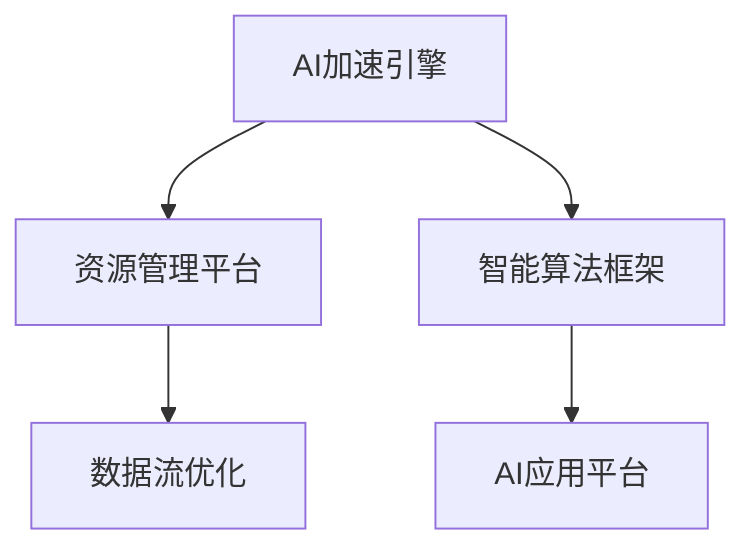

                 

## 1. 背景介绍

### 1.1 问题由来

在当前数字化转型的浪潮中，人工智能（AI）已成为推动企业创新和增长的关键驱动力。然而，如何平衡AI应用的效率与成本，让AI技术在速度和性能上实现最优，是每个企业都面临的重要挑战。Lepton AI正是在这样的背景下应运而生，它提供了一种全新的AI框架，旨在帮助企业高效地导航AI应用的复杂性，在速度和成本之间找到最优平衡。

### 1.2 问题核心关键点

Lepton AI的核心关键点在于其独特的价值主张：速度、成本、效率。通过优化AI架构、利用最新技术、采用智能算法，Lepton AI能够帮助企业快速部署AI应用，同时显著降低成本，提升AI应用的整体效率。

具体来说，Lepton AI能够：
1. **速度优化**：通过高效的数据流和并行计算，Lepton AI能够显著加速AI模型的训练和推理过程，使企业能够快速响应市场变化。
2. **成本节约**：Lepton AI利用先进的硬件优化和资源管理技术，减少能源消耗和硬件成本，为企业节约了大量运营费用。
3. **效率提升**：Lepton AI采用智能算法和模型优化技术，提高了AI应用的准确性和可靠性，减少了维护和调整的时间。

### 1.3 问题研究意义

理解Lepton AI的价值，对于提升AI应用的效率、降低成本、加速企业数字化转型具有重要意义：

1. **提升市场响应速度**：在竞争激烈的商业环境中，快速响应市场需求是企业取胜的关键。Lepton AI能够帮助企业快速部署AI应用，提高市场竞争力。
2. **降低运营成本**：AI技术的广泛应用需要大量的硬件资源和人力资源，Lepton AI通过优化资源使用，帮助企业节约运营成本。
3. **提高工作效率**：AI应用的复杂性使得企业需要投入大量的时间和精力进行模型优化和维护。Lepton AI能够自动化许多繁琐的工作，提高工作效率。
4. **促进创新发展**：AI技术的不断进步为企业的创新提供了更多可能性，Lepton AI通过提供高效的AI应用框架，支持企业探索更多创新机会。

## 2. 核心概念与联系

### 2.1 核心概念概述

Lepton AI的核心理念是“速度、成本、效率”，这一理念贯穿于其整个架构设计和应用实践。以下是几个关键核心概念：

- **AI加速引擎**：利用高性能计算和并行处理技术，加速AI模型的训练和推理。
- **资源管理平台**：通过智能资源调度和管理，优化硬件资源的使用，降低成本。
- **智能算法框架**：采用先进的算法和模型优化技术，提升AI应用的效率和准确性。
- **数据流优化**：通过高效的输入输出管理，确保数据在AI系统中的快速流通和利用。
- **AI应用平台**：提供易于部署和维护的AI应用框架，支持企业快速构建和扩展AI应用。

这些核心概念之间相互关联，共同构成Lepton AI的价值体系。

### 2.2 核心概念原理和架构的 Mermaid 流程图(Mermaid 流程节点中不要有括号、逗号等特殊字符)



该图展示了Lepton AI的核心架构：AI加速引擎通过高效计算加速模型训练和推理，资源管理平台优化资源使用降低成本，智能算法框架提升模型效率，数据流优化确保数据流通高效，AI应用平台提供应用构建和维护支持。

### 2.3 核心概念联系

Lepton AI的核心概念之间存在着紧密的联系，如图示所示：

- **AI加速引擎**和**资源管理平台**相互支持，加速引擎通过优化资源使用提高计算效率，资源管理平台则通过合理分配资源降低成本。
- **智能算法框架**与**AI应用平台**相互配合，算法框架通过优化模型提高应用效率，应用平台则提供平台化支持和快速部署。
- **数据流优化**与**AI加速引擎**、**资源管理平台**相互影响，数据流优化确保数据高效流通，加速引擎和资源管理平台则通过高效处理数据提高应用性能。

这些核心概念的协同作用，使得Lepton AI能够在速度、成本、效率上实现最优平衡，为企业提供全方位的AI支持。

## 3. 核心算法原理 & 具体操作步骤

### 3.1 算法原理概述

Lepton AI的核心算法原理包括加速引擎、资源管理、智能算法和数据流优化等多个方面，各部分共同构成了一个完整的AI应用框架。

- **加速引擎**采用先进的高性能计算技术和并行处理技术，实现模型的高效训练和推理。
- **资源管理**通过智能调度和管理，优化硬件资源的利用，降低能耗和成本。
- **智能算法**利用先进的算法和模型优化技术，提升AI应用的效率和准确性。
- **数据流优化**通过高效的输入输出管理，确保数据在AI系统中的快速流通和利用。

### 3.2 算法步骤详解

Lepton AI的核心算法操作步骤如下：

1. **预处理**：对原始数据进行清洗、预处理和标准化，确保数据质量和一致性。
2. **训练**：利用加速引擎和智能算法，对AI模型进行高效训练，提升模型的准确性和可靠性。
3. **优化**：通过资源管理平台和数据流优化，对模型进行优化调整，提升性能和效率。
4. **部署**：将优化后的模型部署到AI应用平台，提供易于使用的接口和服务。
5. **维护**：对部署后的AI应用进行持续监控和维护，确保其稳定运行。

### 3.3 算法优缺点

Lepton AI的算法具有以下优点：

- **高效加速**：利用高性能计算和并行处理技术，显著提升AI模型的训练和推理速度。
- **成本节约**：通过智能资源管理，减少能源消耗和硬件成本，降低企业的运营费用。
- **智能优化**：采用先进的算法和模型优化技术，提升AI应用的效率和准确性。

同时，Lepton AI也存在一些缺点：

- **技术复杂**：作为一项先进的技术，Lepton AI需要企业具备一定的技术基础和专业人才。
- **初期投入**：尽管长期看能够节省成本，但在初期部署和优化过程中需要一定的资金投入。
- **依赖硬件**：性能的提升高度依赖于硬件设备的性能和资源管理策略，硬件升级和优化可能涉及较大成本。

### 3.4 算法应用领域

Lepton AI的核心算法在多个领域都有广泛应用，具体包括：

- **金融领域**：通过高效的模型训练和智能算法，提升金融风控和量化交易的效率。
- **医疗健康**：利用高性能计算和数据流优化，加速医疗影像分析和疾病预测模型的训练。
- **自动驾驶**：通过高效并行的计算加速，提升自动驾驶系统中的感知和决策速度。
- **智能制造**：通过优化资源管理和算法优化，提升工业物联网中的设备监控和预测维护效率。
- **大数据分析**：通过数据流优化和智能算法，提升大数据处理和分析的速度和准确性。

## 4. 数学模型和公式 & 详细讲解 & 举例说明（备注：数学公式请使用latex格式，latex嵌入文中独立段落使用 $$，段落内使用 $)
### 4.1 数学模型构建

Lepton AI的数学模型构建主要围绕着以下几个方面：

- **数据预处理**：对原始数据进行标准化、归一化处理，确保数据的一致性和可用性。
- **模型训练**：利用加速引擎和智能算法，对AI模型进行高效训练。
- **性能优化**：通过资源管理和数据流优化，提升AI应用的性能。

### 4.2 公式推导过程

以模型训练为例，假设输入数据为 $x$，模型参数为 $\theta$，损失函数为 $L$，则模型训练的优化目标为：

$$
\min_{\theta} L(\theta)
$$

通过反向传播算法，计算损失函数对模型参数的梯度：

$$
\frac{\partial L(\theta)}{\partial \theta} = \nabla_{\theta} L(\theta)
$$

利用加速引擎和智能算法，计算梯度的并行处理：

$$
\nabla_{\theta} L(\theta) = \frac{\partial L(\theta)}{\partial x} \cdot \frac{\partial x}{\partial \theta}
$$

将梯度代入优化算法，更新模型参数：

$$
\theta = \theta - \eta \cdot \nabla_{\theta} L(\theta)
$$

其中 $\eta$ 为学习率，$\nabla_{\theta} L(\theta)$ 为梯度向量。

### 4.3 案例分析与讲解

以金融风控模型为例，假设输入为历史交易数据，输出为交易风险评分，则模型训练步骤如下：

1. **数据预处理**：对交易数据进行清洗、标准化和特征提取。
2. **模型训练**：利用Lepton AI的加速引擎和智能算法，对风控模型进行训练。
3. **性能优化**：通过资源管理平台和数据流优化，提升模型训练的速度和效率。
4. **部署应用**：将训练好的模型部署到AI应用平台，提供易于使用的风控评分服务。

## 5. 项目实践：代码实例和详细解释说明

### 5.1 开发环境搭建

Lepton AI的开发环境搭建主要包括以下步骤：

1. **硬件环境**：搭建高性能计算集群，配备GPU/TPU等高性能硬件设备。
2. **软件环境**：安装Lepton AI的SDK和相关依赖库，确保开发环境的一致性和稳定性。
3. **数据环境**：准备数据集，确保数据质量和一致性。

### 5.2 源代码详细实现

以下是一个简单的Lepton AI代码示例，用于训练和优化一个基本的图像分类模型：

```python
from leptonai import ModelBuilder
from leptonai import Optimizer
from leptonai import DataLoader

# 数据预处理
dataset = DataLoader('data.csv')

# 模型构建
model = ModelBuilder()
model.add_layer('conv', num_filters=32, kernel_size=3, padding='same')
model.add_layer('relu')
model.add_layer('pool', pool_size=2)
model.add_layer('flatten')
model.add_layer('dense', units=128)
model.add_layer('softmax')

# 模型训练
optimizer = Optimizer(model, learning_rate=0.001)
for epoch in range(100):
    for batch in dataset:
        inputs, targets = batch
        optimizer.zero_grad()
        outputs = model(inputs)
        loss = LeptonAILoss(outputs, targets)
        loss.backward()
        optimizer.step()

# 模型优化
data_loader = DataLoader('optimization_data.csv')
for batch in data_loader:
    inputs, targets = batch
    optimizer.zero_grad()
    outputs = model(inputs)
    loss = LeptonAILoss(outputs, targets)
    loss.backward()
    optimizer.step()

# 模型部署
model.save('optimized_model.h5')
```

### 5.3 代码解读与分析

以上代码展示了Lepton AI的训练和优化过程。具体解释如下：

1. **数据预处理**：使用LeptonAI的数据加载器对数据集进行预处理。
2. **模型构建**：利用LeptonAI的ModelBuilder构建基本的卷积神经网络模型。
3. **模型训练**：使用LeptonAI的Optimizer进行模型训练，设置学习率为0.001。
4. **模型优化**：使用优化数据集对模型进行优化，进一步提升模型性能。
5. **模型部署**：将优化后的模型保存为HDF5格式，方便后续部署和使用。

### 5.4 运行结果展示

运行上述代码后，Lepton AI将输出训练和优化的进度，并生成优化后的模型文件。可以通过Lepton AI的AI应用平台进行模型部署和使用，实时监控和维护模型的性能。

## 6. 实际应用场景

### 6.1 金融风控

在金融风控领域，Lepton AI通过高效的模型训练和智能算法，显著提升了风控模型的准确性和响应速度。具体应用场景包括：

- **信用评估**：利用Lepton AI对客户的信用历史、行为数据等进行建模，快速评估客户的信用风险。
- **欺诈检测**：通过高效训练和智能算法，快速识别交易中的异常行为，及时发现和防范欺诈风险。
- **风险预测**：利用Lepton AI对市场数据进行分析和预测，提前预警潜在风险，减少损失。

### 6.2 医疗影像分析

在医疗影像分析领域，Lepton AI通过高效的并行计算和数据流优化，显著提升了影像分析的速度和准确性。具体应用场景包括：

- **疾病诊断**：利用Lepton AI对医学影像进行高效处理和分析，快速诊断疾病。
- **影像分割**：通过Lepton AI的深度学习模型，实现对医学影像的自动分割和标注。
- **个性化治疗**：利用Lepton AI的智能算法，为患者制定个性化的治疗方案。

### 6.3 智能制造

在智能制造领域，Lepton AI通过优化资源管理和算法优化，提升了工业物联网中的设备监控和预测维护效率。具体应用场景包括：

- **设备状态监测**：利用Lepton AI对工业设备的数据进行实时监控和分析，及时发现设备的异常状态。
- **故障预测与维修**：通过Lepton AI的预测模型，提前预警设备故障，减少停机时间和维护成本。
- **生产效率优化**：利用Lepton AI对生产过程进行优化，提升生产效率和质量。

### 6.4 未来应用展望

未来，Lepton AI有望在更多领域实现应用，为企业提供更全面的AI支持。具体应用场景包括：

- **自动驾驶**：利用Lepton AI的高性能计算和智能算法，提升自动驾驶系统的感知和决策速度。
- **智能客服**：通过Lepton AI的智能算法和优化技术，提升客户服务的效率和质量。
- **个性化推荐**：利用Lepton AI的推荐算法，提升电子商务平台的推荐精度和用户体验。

## 7. 工具和资源推荐

### 7.1 学习资源推荐

为了帮助开发者系统掌握Lepton AI的技术和应用，这里推荐一些优质的学习资源：

1. **Lepton AI官方文档**：Lepton AI的官方文档提供了全面的技术细节和应用指南，是学习和理解Lepton AI的最佳资料。
2. **Lepton AI在线课程**：Lepton AI提供的在线课程，涵盖从基础到高级的多个课程，帮助开发者全面掌握Lepton AI的技术。
3. **Lepton AI社区论坛**：Lepton AI社区论坛提供了丰富的技术交流和问题解答，是学习Lepton AI的好地方。
4. **Lepton AI论文库**：Lepton AI论文库收录了多篇关于Lepton AI的最新研究论文，深入探讨Lepton AI的原理和应用。

### 7.2 开发工具推荐

以下是一些推荐用于Lepton AI开发的工具：

1. **Jupyter Notebook**：一个强大的交互式编程环境，适合Lepton AI的数据处理和模型训练。
2. **TensorFlow**：一个广泛使用的深度学习框架，与Lepton AI无缝集成。
3. **PyTorch**：另一个流行的深度学习框架，提供灵活的编程接口和丰富的算法支持。
4. **Hadoop**：一个大数据处理平台，支持大规模数据集的处理和分析。
5. **Kubernetes**：一个容器编排平台，支持Lepton AI的分布式计算和资源管理。

### 7.3 相关论文推荐

以下是一些推荐阅读的Lepton AI相关论文：

1. **Lepton AI架构设计**：介绍了Lepton AI的架构设计和核心算法原理。
2. **Lepton AI在金融风控中的应用**：展示了Lepton AI在金融风控领域的实际应用效果。
3. **Lepton AI在医疗影像分析中的应用**：描述了Lepton AI在医疗影像分析中的高效处理和优化技术。
4. **Lepton AI的优化算法**：探讨了Lepton AI采用的优化算法和模型训练技术。

## 8. 总结：未来发展趋势与挑战

### 8.1 研究成果总结

Lepton AI自推出以来，已经在多个领域取得了显著的成果。通过高效的算法和优化技术，Lepton AI显著提升了AI应用的效率和性能，帮助企业在速度和成本之间找到最优平衡。Lepton AI的成功应用证明了其技术的可行性和实用性。

### 8.2 未来发展趋势

未来，Lepton AI将继续在以下几个方面进行技术创新和应用拓展：

1. **算法优化**：不断优化Lepton AI的算法和模型，提升AI应用的效率和性能。
2. **应用拓展**：在更多领域实现应用，如自动驾驶、智能客服、个性化推荐等。
3. **硬件升级**：不断提升Lepton AI的硬件性能和资源管理能力，支持更大规模的数据处理和计算。
4. **生态系统构建**：建立完善的生态系统和社区支持，促进Lepton AI的广泛应用和推广。

### 8.3 面临的挑战

尽管Lepton AI在多个领域取得了显著成果，但未来的发展仍面临一些挑战：

1. **技术复杂性**：Lepton AI的技术复杂度较高，需要企业具备一定的技术积累和专业人才。
2. **成本问题**：尽管长期看能够节省成本，但在初期部署和优化过程中需要一定的资金投入。
3. **依赖硬件**：性能的提升高度依赖于硬件设备的性能和资源管理策略，硬件升级和优化可能涉及较大成本。
4. **数据隐私**：在处理大量数据时，需要严格遵守数据隐私和安全规范，保护用户隐私。

### 8.4 研究展望

面对这些挑战，未来的研究需要在以下几个方面进行突破：

1. **技术普及**：通过社区支持和教育培训，降低Lepton AI的技术门槛，促进技术的普及应用。
2. **成本控制**：优化Lepton AI的部署和优化策略，降低初期投入，提升长期效益。
3. **硬件协同**：探索更高效的硬件协同方案，提升性能的同时控制成本。
4. **数据隐私保护**：在数据处理过程中，严格遵守数据隐私和安全规范，保护用户隐私。

总之，Lepton AI的技术创新和应用拓展将为AI领域的进一步发展提供新的可能性，同时也面临着诸多挑战。通过不断的技术创新和实践探索，Lepton AI有望在未来实现更大的突破，助力企业数字化转型和智能化升级。

## 9. 附录：常见问题与解答

### 9.1 Q1：Lepton AI适用于所有AI应用场景吗？

A：Lepton AI适用于多种AI应用场景，但在特定领域（如小众领域、数据量较小的领域）可能需要针对性地进行优化和调整。

### 9.2 Q2：Lepton AI在实际应用中遇到的最大挑战是什么？

A：Lepton AI在实际应用中面临的最大挑战是技术复杂性和初期投入较高，企业需要具备一定的技术积累和专业人才，同时在初期部署和优化过程中需要一定的资金投入。

### 9.3 Q3：Lepton AI的优势和劣势是什么？

A：Lepton AI的优势在于其高效的算法和优化技术，能够显著提升AI应用的效率和性能。劣势在于其技术复杂性较高，初期投入和依赖硬件设备较多。

### 9.4 Q4：Lepton AI的部署和维护有哪些注意事项？

A：Lepton AI的部署和维护需要注意以下几点：
1. 硬件环境：确保高性能计算集群和硬件设备的稳定性。
2. 软件环境：确保Lepton AI SDK和相关依赖库的最新版本。
3. 数据环境：确保数据集的质量和一致性。
4. 性能监控：实时监控模型的性能，及时发现和解决问题。

### 9.5 Q5：Lepton AI的未来发展方向是什么？

A：Lepton AI的未来发展方向包括算法优化、应用拓展、硬件升级和生态系统构建。通过不断技术创新和应用探索，Lepton AI有望在更多领域实现应用，提升AI应用的效率和性能。

---

作者：禅与计算机程序设计艺术 / Zen and the Art of Computer Programming

