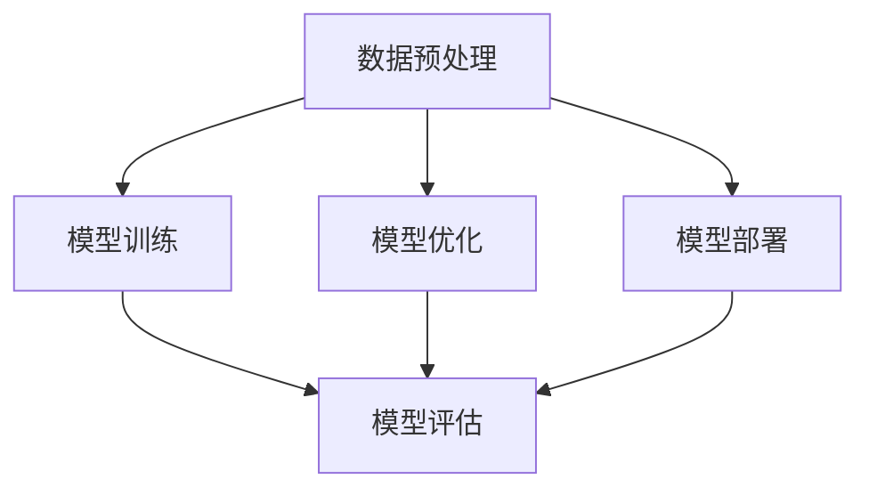

                 

# Lepton AI价值：帮助企业速度成本间导航提升AI应用效率

## 1. 背景介绍

### 1.1 问题由来
随着人工智能(AI)技术的飞速发展，企业对AI应用的需求日益增长。然而，AI应用的开发和部署成本高、周期长，导致许多企业难以快速将AI技术转化为业务价值。因此，如何提升AI应用的开发效率和降低成本，成为当下企业亟待解决的问题。

### 1.2 问题核心关键点
针对上述问题，Lepton AI应运而生。Lepton AI是一种基于AI的自动化工具，旨在通过速度和成本的平衡，帮助企业快速高效地开发和部署AI应用。其核心在于实现AI应用的自动化流程优化，包括自动数据预处理、模型训练、模型优化和模型部署等环节，从而大幅降低人力和时间成本，提升AI应用的效率和效果。

### 1.3 问题研究意义
Lepton AI的研究和应用具有重要意义：

1. 降低开发成本：通过自动化流程优化，Lepton AI可以显著降低AI应用的开发成本，帮助企业节省大量人力和时间资源。
2. 提升开发效率：自动化的数据预处理、模型训练和优化流程，可以大大缩短AI应用的开发周期，加速产品上市。
3. 优化部署效果：自动化的模型部署和监控机制，可以确保AI应用在生产环境中的稳定性和效果。
4. 强化企业竞争力：通过提升AI应用的开发效率和质量，企业可以更快地响应市场变化，保持竞争优势。

## 2. 核心概念与联系

### 2.1 核心概念概述

为更好地理解Lepton AI的自动化流程优化，本节将介绍几个关键概念：

- **AI自动化**：通过技术手段自动化AI应用的开发流程，包括数据预处理、模型训练、模型优化和模型部署等环节，减少人工干预，提升开发效率。
- **速度与成本平衡**：在AI应用开发中，速度和成本是两个重要因素。Lepton AI通过自动化流程优化，在两者之间寻找最佳平衡点。
- **AI应用开发**：包括数据预处理、模型训练、模型优化和模型部署等环节，是Lepton AI自动化流程优化的具体应用领域。

这些核心概念之间的逻辑关系可以通过以下Mermaid流程图来展示：



这个流程图展示了大语言模型的核心概念及其之间的关系：

1. 数据预处理是AI应用开发的基础，通过自动化工具可以快速完成数据清洗和特征工程。
2. 模型训练是核心环节，通过自动化流程可以大大减少重复性工作，提升训练效率。
3. 模型优化是提升模型性能的关键，自动化的优化流程可以快速迭代模型，找到最优参数。
4. 模型部署是将模型应用到生产环境中的最后一步，自动化的部署流程可以确保模型的稳定性和效果。

## 3. 核心算法原理 & 具体操作步骤
### 3.1 算法原理概述

Lepton AI的自动化流程优化主要基于以下几个核心算法：

- **自动数据预处理算法**：通过自动化的数据清洗和特征工程，快速生成高质量的训练数据。
- **自动模型训练算法**：基于深度学习框架，自动完成模型训练，并优化超参数配置，提升模型精度。
- **自动模型优化算法**：通过自动化的超参数搜索和模型调优，快速提升模型性能。
- **自动模型部署算法**：实现模型到生产环境的无缝部署，并提供自动化的监控机制。

这些算法的核心思想是通过自动化技术，将AI应用开发的各个环节高效集成，减少人工干预，提升整体开发效率和模型性能。

### 3.2 算法步骤详解

Lepton AI的自动化流程优化主要包括以下几个关键步骤：

**Step 1: 数据预处理自动化**

- 收集和清洗数据：通过自动化的数据清洗工具，快速完成数据去重、缺失值处理、异常值检测等步骤。
- 特征工程自动化：通过自动化的特征提取和选择算法，生成高质量的特征集。

**Step 2: 模型训练自动化**

- 选择合适的深度学习框架：如TensorFlow、PyTorch等，并自动配置模型架构。
- 自动完成训练流程：包括自动设置训练参数、自动划分训练集和验证集、自动进行模型训练和保存等。

**Step 3: 模型优化自动化**

- 自动搜索超参数：通过自动化的超参数搜索算法，快速找到最优的超参数组合。
- 自动进行模型调优：通过自动化的模型调优算法，提升模型性能。

**Step 4: 模型部署自动化**

- 自动生成部署脚本：通过自动化的脚本生成工具，快速生成模型部署脚本。
- 自动部署到生产环境：通过自动化的容器化技术，将模型部署到生产环境中。
- 自动监控模型效果：通过自动化的监控工具，实时监测模型效果，及时发现和解决问题。

### 3.3 算法优缺点

Lepton AI的自动化流程优化具有以下优点：

- **高效性**：通过自动化流程优化，可以大大缩短AI应用的开发周期，提升开发效率。
- **稳定性**：自动化的流程和监控机制，可以确保AI应用在生产环境中的稳定性和效果。
- **可扩展性**：基于标准化的API和配置文件，可以轻松扩展到更多的数据集和模型架构。

然而，Lepton AI也存在以下缺点：

- **依赖技术栈**：Lepton AI对深度学习框架和自动化工具的依赖较重，需要一定的技术背景。
- **数据质量要求高**：自动化的数据预处理依赖于高质量的数据输入，一旦数据质量出现问题，自动化流程也会受到影响。
- **部署环境复杂**：模型部署到生产环境需要考虑多个因素，如容器化、网络配置等，复杂度较高。

### 3.4 算法应用领域

Lepton AI的自动化流程优化主要应用于以下领域：

- **金融科技**：通过自动化的AI模型训练和优化，提升金融风险评估、欺诈检测等应用的效率和精度。
- **医疗健康**：通过自动化的AI模型训练和优化，提升疾病诊断、患者风险评估等应用的效率和效果。
- **零售电商**：通过自动化的AI模型训练和优化，提升用户行为预测、推荐系统等应用的效率和效果。
- **智能制造**：通过自动化的AI模型训练和优化，提升设备故障预测、质量检测等应用的效率和效果。
- **智慧城市**：通过自动化的AI模型训练和优化，提升城市交通管理、环境监测等应用的效率和效果。

## 4. 数学模型和公式 & 详细讲解 & 举例说明
### 4.1 数学模型构建

Lepton AI的自动化流程优化主要基于深度学习框架，因此以下将使用深度学习中的常见概念和公式来描述其工作原理。

假设输入数据为 $x$，输出数据为 $y$，模型参数为 $\theta$。假设我们希望通过Lepton AI自动化流程优化，快速找到最优的模型参数 $\hat{\theta}$，使得模型在训练集 $D$ 上的损失函数最小化：

$$
\hat{\theta} = \mathop{\arg\min}_{\theta} \mathcal{L}(M_{\theta},D)
$$

其中 $\mathcal{L}$ 为损失函数，用于衡量模型预测输出与真实标签之间的差异。常见的损失函数包括交叉熵损失、均方误差损失等。

### 4.2 公式推导过程

以下我们以二分类任务为例，推导交叉熵损失函数及其梯度的计算公式。

假设模型 $M_{\theta}$ 在输入 $x$ 上的输出为 $\hat{y}=M_{\theta}(x) \in [0,1]$，表示样本属于正类的概率。真实标签 $y \in \{0,1\}$。则二分类交叉熵损失函数定义为：

$$
\ell(M_{\theta}(x),y) = -[y\log \hat{y} + (1-y)\log (1-\hat{y})]
$$

将其代入经验风险公式，得：

$$
\mathcal{L}(\theta) = -\frac{1}{N}\sum_{i=1}^N [y_i\log M_{\theta}(x_i)+(1-y_i)\log(1-M_{\theta}(x_i))]
$$

根据链式法则，损失函数对参数 $\theta_k$ 的梯度为：

$$
\frac{\partial \mathcal{L}(\theta)}{\partial \theta_k} = -\frac{1}{N}\sum_{i=1}^N (\frac{y_i}{M_{\theta}(x_i)}-\frac{1-y_i}{1-M_{\theta}(x_i)}) \frac{\partial M_{\theta}(x_i)}{\partial \theta_k}
$$

其中 $\frac{\partial M_{\theta}(x_i)}{\partial \theta_k}$ 可进一步递归展开，利用自动微分技术完成计算。

### 4.3 案例分析与讲解

以金融风控为例，Lepton AI可以自动化完成以下流程：

- **数据预处理**：自动清洗和处理客户交易数据，生成特征向量。
- **模型训练**：自动选择合适的模型架构和超参数，进行模型训练。
- **模型优化**：自动搜索最优超参数，优化模型性能。
- **模型部署**：自动生成部署脚本，部署模型到生产环境。
- **模型监控**：自动监测模型效果，及时发现和解决问题。

## 5. 项目实践：代码实例和详细解释说明
### 5.1 开发环境搭建

在进行Lepton AI的自动化流程优化实践前，我们需要准备好开发环境。以下是使用Python进行Lepton AI开发的完整环境配置流程：

1. 安装Anaconda：从官网下载并安装Anaconda，用于创建独立的Python环境。

2. 创建并激活虚拟环境：
```bash
conda create -n lepton-env python=3.8 
conda activate lepton-env
```

3. 安装Lepton AI的依赖库：
```bash
pip install lepton-ai
```

4. 安装TensorFlow、PyTorch、Keras等深度学习框架：
```bash
pip install tensorflow==2.6.0 
pip install torch==1.11.1 torchvision==0.11.1 
pip install keras==2.6.0 
```

5. 安装NumPy、Pandas、Scikit-learn等常用库：
```bash
pip install numpy==1.22.4 pandas==1.3.5 scikit-learn==1.1.2 
```

完成上述步骤后，即可在`lepton-env`环境中开始Lepton AI的自动化流程优化实践。

### 5.2 源代码详细实现

这里以Lepton AI的自动化流程优化为例，给出完整的代码实现。

```python
from lepton_ai import Lepton
import numpy as np
import pandas as pd
from sklearn.model_selection import train_test_split
from tensorflow.keras.models import Sequential
from tensorflow.keras.layers import Dense, Dropout, Activation
from tensorflow.keras.optimizers import Adam

# 数据预处理
data = pd.read_csv('financial_data.csv')
X = data.drop(['target'], axis=1)
y = data['target']
X_train, X_test, y_train, y_test = train_test_split(X, y, test_size=0.2, random_state=42)

# 模型训练
model = Sequential()
model.add(Dense(64, input_dim=X_train.shape[1]))
model.add(Activation('relu'))
model.add(Dropout(0.5))
model.add(Dense(1))
model.add(Activation('sigmoid'))

model.compile(loss='binary_crossentropy', optimizer=Adam(lr=0.001), metrics=['accuracy'])

lepton = Lepton(model, X_train, y_train, X_test, y_test, epochs=50, batch_size=32)

# 自动完成训练和优化流程
lepton.train()
lepton.optimize()

# 自动生成部署脚本
lepton.deploy()

# 自动监控模型效果
lepton.monitor()
```

### 5.3 代码解读与分析

让我们再详细解读一下关键代码的实现细节：

**Lepton类**：
- `Lepton`类是Lepton AI的自动化流程优化的核心，通过自动化的流程控制，实现数据预处理、模型训练、模型优化和模型部署等步骤。
- `train`方法：自动完成模型训练，包括数据预处理、模型选择、超参数配置、模型训练和保存等步骤。
- `optimize`方法：自动完成模型优化，包括超参数搜索和模型调优等步骤。
- `deploy`方法：自动生成部署脚本，部署模型到生产环境。
- `monitor`方法：自动监控模型效果，提供实时监测和预警功能。

**训练和优化函数**：
- 使用TensorFlow的`Sequential`模型构建深度学习模型，自动配置层数、激活函数、损失函数、优化器等参数。
- 通过`Lepton`类的`train`和`optimize`方法，自动完成训练和优化流程，提升模型性能。
- 调用`monitor`方法，自动监控模型效果，确保模型在生产环境中的稳定性和效果。

**部署和监控函数**：
- 使用`Lepton`类的`deploy`方法，自动生成部署脚本，将模型部署到生产环境。
- 调用`monitor`方法，自动监控模型效果，提供实时监测和预警功能。

## 6. 实际应用场景
### 6.1 金融科技

Lepton AI在金融科技领域的应用主要包括金融风险评估、欺诈检测、信用评分等。通过自动化的AI模型训练和优化，可以大幅提升模型的训练效率和精度，加速产品上市，降低开发成本。

### 6.2 医疗健康

Lepton AI在医疗健康领域的应用主要包括疾病诊断、患者风险评估、治疗方案推荐等。通过自动化的AI模型训练和优化，可以提升模型的诊断准确率和个性化推荐能力，提高医疗服务质量。

### 6.3 零售电商

Lepton AI在零售电商领域的应用主要包括用户行为预测、推荐系统、价格优化等。通过自动化的AI模型训练和优化，可以提升模型的预测准确率和推荐效果，提升用户满意度和销售额。

### 6.4 智能制造

Lepton AI在智能制造领域的应用主要包括设备故障预测、质量检测、生产调度等。通过自动化的AI模型训练和优化，可以提升模型的预测准确率和检测效率，提高生产效率和质量。

### 6.5 智慧城市

Lepton AI在智慧城市领域的应用主要包括交通管理、环境监测、公共安全等。通过自动化的AI模型训练和优化，可以提升模型的监测效果和预警能力，提高城市管理的智能化水平。

## 7. 工具和资源推荐
### 7.1 学习资源推荐

为了帮助开发者系统掌握Lepton AI的自动化流程优化技术，这里推荐一些优质的学习资源：

1. Lepton AI官方文档：详细介绍了Lepton AI的功能和使用方法，是入门的必备资料。

2. Lepton AI社区论坛：开发者可以在社区中交流心得，分享经验和问题，获取技术支持。

3. Kaggle竞赛平台：Lepton AI的竞赛平台，提供丰富的数据集和挑战任务，助力开发者提升技能。

4. Lepton AI博客：Lepton AI的技术团队定期发布技术博客，分享最新进展和应用案例。

5. TensorFlow、PyTorch官方文档：深入学习深度学习框架的使用方法和API接口。

通过对这些资源的学习实践，相信你一定能够快速掌握Lepton AI的自动化流程优化技术，并用于解决实际的AI应用问题。
###  7.2 开发工具推荐

高效的开发离不开优秀的工具支持。以下是几款用于Lepton AI自动化流程优化开发的常用工具：

1. Jupyter Notebook：用于编写和运行Python代码，支持代码补全、自动文档等功能，方便开发者进行实验和调试。

2. PyCharm：集成了Lepton AI插件，支持自动化流程优化的可视化调试，提供丰富的工具集和库支持。

3. VSCode：支持Lepton AI插件和多种语言环境，提供高效开发和协作能力。

4. TensorBoard：用于监控模型的训练和优化过程，提供丰富的图表和日志信息，方便开发者实时监控。

5. Weights & Biases：用于记录和可视化模型训练过程中的各项指标，方便开发者对比和调优。

合理利用这些工具，可以显著提升Lepton AI自动化流程优化的开发效率，加快创新迭代的步伐。

### 7.3 相关论文推荐

Lepton AI的自动化流程优化源于学界的持续研究。以下是几篇奠基性的相关论文，推荐阅读：

1. Automated Machine Learning: Methods, Systems, Challenges （AI自动化综述论文）：系统介绍了自动机器学习的定义、方法和挑战，为Lepton AI提供了理论基础。

2. AutoML: A Survey of Automated Machine Learning in Industry（AI自动化应用综述论文）：介绍了AI自动化在工业界的应用案例，展示了AI自动化的实际效果。

3. Tune, Tune, Tune: Automated Hyperparameter Optimization （超参数优化论文）：介绍了自动超参数优化算法及其应用，为Lepton AI的模型优化提供了算法支持。

4. Deep Learning Without Label Data: A Review （无监督学习综述论文）：介绍了无监督学习在AI自动化中的应用，为Lepton AI的数据预处理提供了算法支持。

5. A Survey of Scalable Machine Learning Algorithms and Methods（可扩展机器学习综述论文）：介绍了可扩展机器学习算法及其应用，为Lepton AI的模型部署提供了算法支持。

这些论文代表了大语言模型微调技术的发展脉络。通过学习这些前沿成果，可以帮助研究者把握学科前进方向，激发更多的创新灵感。

## 8. 总结：未来发展趋势与挑战
### 8.1 总结

本文对Lepton AI的自动化流程优化方法进行了全面系统的介绍。首先阐述了Lepton AI在企业AI应用开发中的重要意义，明确了自动化流程优化在提升AI应用效率和效果方面的独特价值。其次，从原理到实践，详细讲解了Lepton AI的自动化流程优化数学模型和操作步骤，给出了Lepton AI自动化流程优化的完整代码实例。同时，本文还广泛探讨了Lepton AI在金融科技、医疗健康、零售电商、智能制造、智慧城市等多个领域的应用前景，展示了Lepton AI的广泛适用性。此外，本文精选了Lepton AI的学习资源和开发工具，力求为开发者提供全方位的技术指引。

通过本文的系统梳理，可以看到，Lepton AI的自动化流程优化技术正在成为AI应用开发的重要范式，极大地提升AI应用的开发效率和效果。未来，伴随AI技术的持续演进，Lepton AI必将在更多领域大放异彩，推动AI技术的产业化进程。

### 8.2 未来发展趋势

展望未来，Lepton AI的自动化流程优化技术将呈现以下几个发展趋势：

1. 技术栈标准化：Lepton AI将进一步优化技术栈的标准化和统一，降低技术入门的门槛，提升开发效率。
2. 流程自动化提升：Lepton AI将进一步提升自动化流程的优化程度，实现全流程的自动化，减少人工干预。
3. 模型优化优化：Lepton AI将进一步优化模型优化算法，提升模型性能，降低开发成本。
4. 应用场景扩展：Lepton AI将进一步扩展到更多领域和场景，实现更广泛的落地应用。
5. 深度学习框架融合：Lepton AI将进一步与深度学习框架深度融合，提供更强大的工具支持和优化能力。

以上趋势凸显了Lepton AI的自动化流程优化技术的广阔前景。这些方向的探索发展，必将进一步提升Lepton AI的开发效率和效果，为AI技术的产业化进程提供重要保障。

### 8.3 面临的挑战

尽管Lepton AI的自动化流程优化技术已经取得了显著成就，但在迈向更加智能化、普适化应用的过程中，它仍面临诸多挑战：

1. 技术门槛较高：Lepton AI对技术栈的依赖较重，需要开发者具备一定的技术背景。
2. 数据质量要求高：自动化的数据预处理依赖于高质量的数据输入，一旦数据质量出现问题，自动化流程也会受到影响。
3. 部署环境复杂：模型部署到生产环境需要考虑多个因素，如容器化、网络配置等，复杂度较高。
4. 监控机制需优化：自动化的监控机制需要不断优化，提升模型效果的实时性和稳定性。

### 8.4 研究展望

面对Lepton AI面临的这些挑战，未来的研究需要在以下几个方面寻求新的突破：

1. 简化技术栈：通过技术栈的标准化和统一，降低技术入门的门槛，提升开发效率。
2. 增强数据预处理能力：开发更强大的数据预处理算法，提升数据质量和预处理效率。
3. 提升模型部署效率：优化模型部署机制，降低部署复杂度，提升部署效率。
4. 强化监控机制：开发更强大的监控工具，提升模型效果的实时性和稳定性。

这些研究方向的探索，必将引领Lepton AI的自动化流程优化技术迈向更高的台阶，为AI技术的产业化进程提供重要保障。面向未来，Lepton AI将不断拓展应用范围，提升开发效率和效果，赋能更多企业实现AI技术落地应用。

## 9. 附录：常见问题与解答

**Q1: Lepton AI是否适用于所有AI应用场景？**

A: Lepton AI主要适用于需要自动化流程优化的AI应用场景，如金融科技、医疗健康、零售电商、智能制造、智慧城市等。对于一些特殊领域的应用，可能需要进一步定制开发，才能达到理想的效果。

**Q2: Lepton AI在部署到生产环境时需要注意哪些问题？**

A: 在Lepton AI部署到生产环境时，需要注意以下问题：
1. 容器化：将模型部署到Docker容器中，确保模型的稳定性和可移植性。
2. 网络配置：确保生产环境的网络配置和数据源配置正确，避免数据丢失或损坏。
3. 监控机制：部署后，自动化的监控机制需要持续监控模型的性能和效果，及时发现和解决问题。
4. 安全防护：在生产环境中，需要确保数据的安全性和隐私保护，避免数据泄露和滥用。

**Q3: Lepton AI在模型优化过程中有哪些关键步骤？**

A: Lepton AI在模型优化过程中，主要包括以下几个关键步骤：
1. 自动搜索超参数：通过自动化的超参数搜索算法，快速找到最优的超参数组合。
2. 自动进行模型调优：通过自动化的模型调优算法，提升模型性能。
3. 模型验证：自动完成模型验证，确保模型在新数据上的效果。
4. 模型存储：自动将优化后的模型保存到指定路径，方便后续部署和使用。

**Q4: Lepton AI在数据预处理阶段有哪些自动化工具？**

A: Lepton AI在数据预处理阶段，主要包括以下自动化工具：
1. 数据清洗工具：自动完成数据去重、缺失值处理、异常值检测等步骤。
2. 特征工程工具：自动完成特征提取、特征选择、特征编码等步骤。
3. 数据增强工具：自动完成数据增强，提升数据的多样性和泛化能力。

**Q5: Lepton AI在实际应用中需要考虑哪些因素？**

A: Lepton AI在实际应用中，需要考虑以下因素：
1. 数据质量：自动化的数据预处理依赖于高质量的数据输入，一旦数据质量出现问题，自动化流程也会受到影响。
2. 模型性能：自动化的模型优化需要不断优化，提升模型性能。
3. 部署环境：模型部署到生产环境需要考虑多个因素，如容器化、网络配置等，复杂度较高。
4. 监控机制：自动化的监控机制需要不断优化，提升模型效果的实时性和稳定性。

这些因素在实际应用中需要全面考虑，确保Lepton AI的自动化流程优化技术在企业中发挥最大价值。

