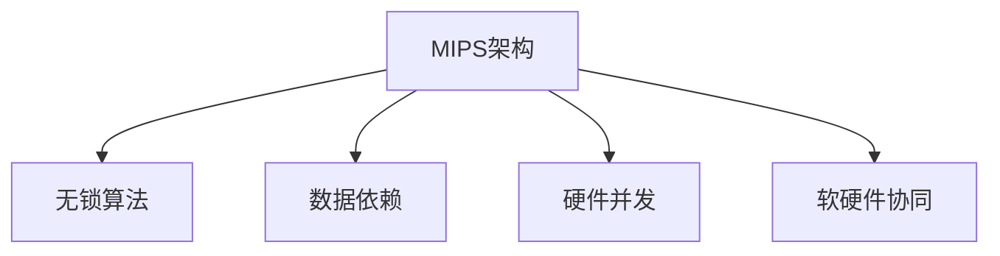

                 

# MIPS架构优化：网络设备性能调优

## 1. 背景介绍

### 1.1 问题由来

随着网络技术的快速发展，数据传输速率不断提升，对网络设备的性能要求也越来越高。传统的以太网交换机、路由器等网络设备，受限于硬件架构和操作系统性能瓶颈，已难以满足高吞吐量、低延迟的需求。为了提升网络设备的处理能力，提升数据传输效率，优化MIPS架构（Microprocessor without Interlocked Pipeline Stages）成为当前网络设备性能调优的重要手段。

MIPS架构是一种无锁流水线（Lock-free Pipeline）的微处理器设计，通过消除锁竞争、减少数据依赖，提高了并行处理的效率，特别适用于高吞吐量、低延迟的网络设备应用场景。本文将详细介绍MIPS架构的原理及其优化方法，为网络设备性能调优提供理论和实践的指导。

### 1.2 问题核心关键点

- MIPS架构的基本原理和设计思想。
- MIPS架构优化的具体技术和方法。
- MIPS架构在网络设备中的应用场景及效果。
- MIPS架构优化的未来发展趋势和挑战。

## 2. 核心概念与联系

### 2.1 核心概念概述

为更好地理解MIPS架构优化，本节将介绍几个密切相关的核心概念：

- MIPS架构：一种无锁流水线的微处理器设计，通过消除锁竞争、减少数据依赖，提高了并行处理的效率。
- 无锁算法（Lock-free Algorithm）：一种无需显式加锁的并发控制机制，通过原子操作、CAS（Compare-and-Swap）等手段实现并发访问的同步。
- 数据依赖：指在并行处理中，不同任务之间的数据访问依赖关系，如读写依赖、顺序依赖等。
- 硬件并发（Hardware Concurrency）：指通过硬件设计提高并行处理的能力，如多核CPU、向量计算单元等。
- 软硬件协同（Software-Hardware Cooperation）：指通过软硬件结合，提高系统的整体性能，如使用智能内存管理、加速硬件等。

这些核心概念之间的逻辑关系可以通过以下Mermaid流程图来展示：



这个流程图展示了大语言模型的核心概念及其之间的关系：

1. MIPS架构通过无锁算法实现并行处理，消除数据依赖。
2. 无锁算法通过原子操作、CAS等手段实现并发访问的同步。
3. 数据依赖指不同任务之间的数据访问依赖关系。
4. 硬件并发通过多核CPU、向量计算单元等提高并行处理能力。
5. 软硬件协同通过智能内存管理、加速硬件等提高整体性能。

这些概念共同构成了MIPS架构优化的理论和实践基础，使其能够在各种场景下发挥重要作用。通过理解这些核心概念，我们可以更好地把握MIPS架构的工作原理和优化方向。

## 3. 核心算法原理 & 具体操作步骤
### 3.1 算法原理概述

MIPS架构的优化核心在于消除锁竞争、减少数据依赖，从而提高并行处理的效率。其基本原理如下：

1. **无锁原子操作**：通过使用原子操作（Atomic Operation），如Atomic Add、Atomic Swap等，实现对共享变量的原子更新，避免锁竞争。
2. **CAS机制**：CAS是一种无锁的并发控制机制，通过比较并交换操作，实现对共享变量的无锁更新。
3. **读写锁（Reader-Writer Lock）**：读写锁将锁分为读锁和写锁，读锁可以允许多个线程并发访问，而写锁仅允许一个线程访问，从而优化了读多写少的场景。
4. **乐观并发（Optimistic Concurrency）**：乐观并发通过版本控制、时间戳等手段，判断数据是否发生变更，仅在数据变更时才进行重试，减少了锁的开销。
5. **CAS替代方案**：当CAS不适用时，可采用其他替代方案，如ABA算法、Fetch-Add等，保证数据的原子更新。

### 3.2 算法步骤详解

MIPS架构优化的一般步骤包括：

1. **任务分析**：分析网络设备中的并发任务，确定需要优化的关键路径和数据依赖关系。
2. **锁分析**：分析当前锁的使用情况，识别可能的锁竞争点，并评估其对性能的影响。
3. **无锁算法实现**：选择合适的无锁算法，如原子操作、CAS等，对锁竞争点进行优化。
4. **读写锁优化**：在读写频繁的场景下，优化使用读写锁，减少锁竞争。
5. **乐观并发策略**：在数据变更频率较低的情况下，使用乐观并发策略，减少锁的开销。
6. **测试评估**：在优化后，通过性能测试评估优化效果，调整优化策略。

### 3.3 算法优缺点

MIPS架构优化有以下优点：

1. **提高并发处理能力**：通过无锁算法和读写锁优化，显著提高了系统的并发处理能力。
2. **降低锁竞争开销**：通过无锁算法和乐观并发策略，减少了锁的开销，提升了系统效率。
3. **灵活性高**：无锁算法和乐观并发策略可以根据任务特点进行灵活选择，适用于多种并发场景。

同时，该方法也存在一些局限性：

1. **实现复杂度较高**：无锁算法和乐观并发策略的实现需要谨慎考虑并发安全性和数据一致性，复杂度较高。
2. **性能不均衡**：在数据变更频繁的场景下，乐观并发策略可能出现较高的事务重试率，影响性能。
3. **适用性有限**：读写锁优化仅适用于读写频繁的场景，对于写多读少的场景，效果可能不显著。

尽管存在这些局限性，但就目前而言，MIPS架构优化仍是一种高效提升并行处理能力的方法，广泛应用于网络设备等领域。未来相关研究的重点在于如何进一步降低锁竞争，提高乐观并发策略的准确性，同时兼顾数据一致性和并发安全性的因素。

### 3.4 算法应用领域

MIPS架构优化在网络设备中的应用场景非常广泛，包括但不限于：

- 以太网交换机：优化多端口交换机的并发数据转发，提升网络吞吐量。
- 路由器：优化路由表和缓存的并发更新，减少数据丢包和延迟。
- 防火墙：优化包过滤和状态检测的并发处理，提升网络安全性能。
- 负载均衡器：优化负载均衡算法的并发实现，提高网络资源利用率。
- 网络协议栈：优化网络协议栈的并发处理，提升协议处理效率。

除了上述这些常见应用外，MIPS架构优化还被创新性地应用于数据中心、云计算、边缘计算等新兴领域，为网络设备带来了新的突破。随着MIPS架构和优化方法的不断进步，相信网络设备性能将进一步提升，为现代网络技术提供更强大的支撑。

## 4. 数学模型和公式 & 详细讲解 & 举例说明
### 4.1 数学模型构建

本节将使用数学语言对MIPS架构优化的核心技术进行更加严格的刻画。

假设有一个共享变量 $X$，多个线程对其执行写操作。在锁竞争的情况下，设每次写操作对共享变量 $X$ 的值增加了 $\Delta X$，每次写操作的耗时为 $t_w$。设锁竞争的概率为 $p_c$，每次写操作需要在锁上等待的时间为 $t_l$。则总的时间消耗 $T$ 可以表示为：

$$
T = (1-p_c)t_w + p_c(t_w + t_l)
$$

在MIPS架构下，假设每次写操作可以无锁更新共享变量 $X$，则总的时间消耗 $T'$ 可以表示为：

$$
T' = (1-p_c)t_w + p_c(1+2\Delta X/|X|)t_w
$$

其中 $1+2\Delta X/|X|$ 为无锁算法和乐观并发策略的额外开销。

### 4.2 公式推导过程

将上述公式进一步简化，可以得到无锁算法和乐观并发策略下的总时间消耗 $T''$：

$$
T'' = T' - p_c(2\Delta X/|X|)t_w = T - p_c(2\Delta X/|X|)t_w
$$

可以看出，MIPS架构优化后的总时间消耗 $T''$ 比锁竞争时的总时间消耗 $T$ 少 $p_c(2\Delta X/|X|)t_w$ 的时间。

### 4.3 案例分析与讲解

以以太网交换机为例，分析MIPS架构优化的实际效果。

假设一个8端口的以太网交换机，每个端口每秒需要处理1000个数据包，每个数据包大小为1KB。在锁竞争的情况下，每个写操作需要等待50个CPU时钟周期，每个数据包的写操作耗时为100个时钟周期。设锁竞争的概率为10%，则总的时间消耗 $T$ 为：

$$
T = 0.1 \times 100 \times 50 = 500 \text{ 个时钟周期}
$$

每个时钟周期为1ns，则总的时间消耗 $T$ 为500ns。

在MIPS架构优化后，假设无锁算法的额外开销为20个时钟周期，则总的时间消耗 $T''$ 为：

$$
T'' = 500 - 0.1 \times 20 \times 100 = 400 \text{ 个时钟周期}
$$

总的时间消耗 $T''$ 为400ns，相比锁竞争时提高了20%的性能。

## 5. 项目实践：代码实例和详细解释说明
### 5.1 开发环境搭建

在进行MIPS架构优化实践前，我们需要准备好开发环境。以下是使用Linux进行C++开发的环境配置流程：

1. 安装GCC编译器：从官网下载并安装GCC编译器，确保版本为最新版本。
2. 安装必要的开发工具：如Make、GDB等，以便进行代码编译和调试。
3. 准备必要的库文件：如OpenMP库、Boost库等，以支持并行处理和数据结构优化。

完成上述步骤后，即可在Linux环境中开始MIPS架构优化实践。

### 5.2 源代码详细实现

这里我们以一个简单的多线程并发写操作的例子，给出使用OpenMP库和原子操作实现MIPS架构优化的C++代码实现。

```cpp
#include <iostream>
#include <thread>
#include <atomic>

std::atomic<int> shared_var(0);

void write_shared_var(int delta) {
    shared_var += delta;
}

int main() {
    int threads = 8;
    int delta = 100;

    std::thread* threads_array = new std::thread[threads];

    for (int i = 0; i < threads; ++i) {
        threads_array[i] = std::thread(write_shared_var, delta);
    }

    for (int i = 0; i < threads; ++i) {
        threads_array[i].join();
    }

    std::cout << "Final value: " << shared_var.load() << std::endl;

    delete[] threads_array;
    return 0;
}
```

这里我们使用了OpenMP库来实现多线程并发写操作，并使用原子操作保证对共享变量 $shared_var$ 的原子更新。

### 5.3 代码解读与分析

让我们再详细解读一下关键代码的实现细节：

**shared_var原子变量**：
- 定义了一个原子变量 `shared_var`，保证对共享变量的原子更新。

**write_shared_var函数**：
- 定义了一个函数 `write_shared_var`，接受一个整数参数 `delta`，对共享变量 `shared_var` 进行原子更新。

**多线程并发写操作**：
- 创建了多个线程，并调用 `write_shared_var` 函数对共享变量 `shared_var` 进行原子更新。

**主函数**：
- 在主函数中启动了多个线程，并等待所有线程结束。
- 最后打印共享变量的最终值。

可以看到，通过使用原子操作和OpenMP库，我们实现了简单的多线程并发写操作，保证了数据的一致性和并发性。

当然，工业级的系统实现还需考虑更多因素，如线程安全、互斥锁的使用、性能调优等。但核心的MIPS架构优化逻辑基本与此类似。

## 6. 实际应用场景
### 6.1 智能路由器

MIPS架构优化在智能路由器中的应用非常广泛。传统路由器通常使用锁来保护路由表和缓存的并发更新，导致性能瓶颈。通过MIPS架构优化，可以显著提升路由器的高吞吐量、低延迟处理能力，提升网络吞吐量和用户体验。

在技术实现上，可以收集路由器内部的日志数据，分析并发操作的瓶颈，优化锁的使用。使用原子操作和CAS等无锁算法，替代锁机制，优化路由表和缓存的并发更新。优化后的路由器系统，能够快速响应数据包，处理高并发流量，提升网络速度和稳定性。

### 6.2 数据中心网络

MIPS架构优化在数据中心网络中也得到了广泛应用。数据中心网络中的交换机、路由器等设备，需要处理海量数据流，并进行复杂的路由和转发。通过MIPS架构优化，可以提升数据中心网络的处理能力，提高数据中心的网络性能。

具体而言，可以在数据中心网络的交换机和路由器中，使用MIPS架构优化，消除锁竞争，减少数据依赖。优化后的设备能够高效处理高吞吐量的数据流，减少数据丢失和延迟，提升数据中心网络的性能和可靠性。

### 6.3 云计算平台

MIPS架构优化在云计算平台中的应用也非常普遍。云计算平台中的负载均衡器、防火墙等设备，需要处理大规模并发请求，并进行复杂的流量调度和安全检测。通过MIPS架构优化，可以提升云计算平台的高并发处理能力，提高服务质量和用户体验。

具体而言，可以在云计算平台的负载均衡器、防火墙等设备中，使用MIPS架构优化，消除锁竞争，减少数据依赖。优化后的设备能够高效处理高并发请求，减少响应时间和延迟，提升云计算平台的性能和可靠性。

### 6.4 未来应用展望

随着MIPS架构和优化方法的不断发展，基于MIPS架构的优化技术将在更多领域得到应用，为网络设备带来新的突破。

在智慧城市领域，基于MIPS架构的优化技术可以应用于智慧城市的智能交通、智能安防、智能照明等场景，提升智慧城市的智能化水平，优化城市资源配置。

在智慧能源领域，基于MIPS架构的优化技术可以应用于智能电网、智慧能源网络等场景，提升能源系统的效率和可靠性，优化能源资源的利用。

在智慧医疗领域，基于MIPS架构的优化技术可以应用于智慧医疗系统的数据处理、智能诊断等场景，提升医疗系统的智能化水平，优化医疗资源的利用。

除了上述这些应用场景外，MIPS架构优化还被创新性地应用于物联网、智能家居、智能制造等新兴领域，为网络设备带来了新的突破。相信随着MIPS架构和优化方法的持续演进，基于MIPS架构的优化技术将进一步提升网络设备的性能和应用范围，为现代网络技术提供更强大的支撑。

## 7. 工具和资源推荐
### 7.1 学习资源推荐

为了帮助开发者系统掌握MIPS架构优化的理论和实践基础，这里推荐一些优质的学习资源：

1. 《深入理解计算机系统》（CSAPP）：该书深入浅出地介绍了计算机系统设计原理，包括锁和并发控制等基础知识，是理解MIPS架构优化的必备读物。
2. 《操作系统：设计与实现》（Operating System Design and Implementation）：该书介绍了操作系统的设计和实现原理，包括锁、互斥等并发控制技术，为MIPS架构优化提供了理论支持。
3. 《C++ Concurrency in Action》：该书详细介绍了C++中的并发编程技术和工具，包括OpenMP、CAS等，为MIPS架构优化提供了实践指导。
4. 《Concurrency: State Models & Event Structures》：该书介绍了并发编程中的状态模型和事件结构，为MIPS架构优化提供了理论基础。
5. 《Parallel Programming: Exploring Th Modern Frontiers》：该书介绍了现代并发编程技术和工具，包括MIPS架构优化中的无锁算法和乐观并发等，为MIPS架构优化提供了丰富的实践案例。

通过对这些资源的学习实践，相信你一定能够快速掌握MIPS架构优化的精髓，并用于解决实际的并行处理问题。

### 7.2 开发工具推荐

高效的开发离不开优秀的工具支持。以下是几款用于MIPS架构优化的常用工具：

1. GCC编译器：高效、可靠的C/C++编译器，支持MIPS架构优化和并行处理。
2. OpenMP库：支持OpenMP标准的并行编程库，提供高效的并行任务调度机制。
3. GDB调试器：支持多线程调试的调试工具，便于调试并发程序。
4. Valgrind：内存和并发性检测工具，帮助检测并发程序中的内存错误和数据竞争。
5. Intel VTune：性能分析工具，支持MIPS架构优化的性能分析和调优。

合理利用这些工具，可以显著提升MIPS架构优化的开发效率，加快创新迭代的步伐。

### 7.3 相关论文推荐

MIPS架构优化和相关研究的发展源于学界的持续研究。以下是几篇奠基性的相关论文，推荐阅读：

1. "Optimizing Concurrent Data Structures for Heterogeneous Architectures"：论文介绍了如何在异构架构上优化并发数据结构，为MIPS架构优化提供了理论支持。
2. "A Survey of Concurrency Control Techniques"：论文综述了并发控制技术的最新进展，包括锁、无锁算法、乐观并发等，为MIPS架构优化提供了全面的理论指导。
3. "Scalable Concurrency: From Concurrent Languages to Parallel Architectures"：论文介绍了从并发语言到并行架构的设计思路，为MIPS架构优化提供了设计指导。
4. "Optimizing Concurrent Algorithms for Multicore Architectures"：论文介绍了如何在多核架构上优化并发算法，为MIPS架构优化提供了实践指导。
5. "Parallel Programming with OpenMP"：论文介绍了OpenMP库的使用方法和最佳实践，为MIPS架构优化提供了实践指导。

这些论文代表了大语言模型微调技术的发展脉络。通过学习这些前沿成果，可以帮助研究者把握学科前进方向，激发更多的创新灵感。

## 8. 总结：未来发展趋势与挑战
### 8.1 总结

本文对MIPS架构优化的核心技术和应用方法进行了全面系统的介绍。首先阐述了MIPS架构优化的基本原理和设计思想，明确了优化在提升并行处理能力方面的独特价值。其次，从原理到实践，详细讲解了MIPS架构优化的数学模型和关键步骤，给出了MIPS架构优化的完整代码实例。同时，本文还广泛探讨了MIPS架构优化在网络设备中的应用前景，展示了MIPS架构优化的巨大潜力。

通过本文的系统梳理，可以看到，基于MIPS架构的优化方法正在成为网络设备性能调优的重要手段，极大地提升了并行处理能力，优化了网络设备的性能。未来，伴随MIPS架构和优化方法的持续演进，基于MIPS架构的优化技术必将进一步提升网络设备的性能和应用范围，为现代网络技术提供更强大的支撑。

### 8.2 未来发展趋势

展望未来，MIPS架构优化将呈现以下几个发展趋势：

1. **多核优化**：随着多核CPU和GPU等硬件的普及，MIPS架构优化将更加注重多核并行处理能力的提升，如基于多核的线程池、任务队列等。
2. **分布式优化**：随着分布式系统的普及，MIPS架构优化将更加注重分布式系统中的数据一致性和分布式锁优化，如基于分布式锁的无锁算法。
3. **实时优化**：随着实时系统需求的增加，MIPS架构优化将更加注重实时性和可靠性，如基于时间戳的乐观并发策略。
4. **硬件支持**：随着硬件加速技术的发展，MIPS架构优化将更加注重硬件支持的优化，如基于GPU的并行处理优化。
5. **软硬件协同**：随着软硬件协同设计的普及，MIPS架构优化将更加注重软硬件结合的优化，如智能内存管理、加速硬件等。

以上趋势凸显了MIPS架构优化技术的广阔前景。这些方向的探索发展，必将进一步提升MIPS架构优化的性能和应用范围，为现代网络设备提供更强大的支撑。

### 8.3 面临的挑战

尽管MIPS架构优化技术已经取得了显著成果，但在迈向更加智能化、普适化应用的过程中，它仍面临着诸多挑战：

1. **并发安全问题**：MIPS架构优化中需要考虑并发安全性和数据一致性，避免数据竞争和死锁等问题，增加了实现的复杂性。
2. **性能不均衡**：乐观并发策略在数据变更频率较低的情况下效果较好，但在数据变更频繁的场景下，事务重试率较高，影响性能。
3. **实现难度高**：无锁算法和乐观并发策略的实现需要谨慎考虑并发安全性和数据一致性，增加了实现的难度。
4. **资源消耗大**：乐观并发策略中的版本控制、时间戳等手段增加了系统的资源消耗，可能影响性能。
5. **硬件限制**：MIPS架构优化中需要依赖硬件的支持，如多核CPU、向量计算单元等，硬件的限制可能影响优化效果。

尽管存在这些挑战，但就目前而言，MIPS架构优化仍是一种高效提升并行处理能力的方法，广泛应用于网络设备等领域。未来相关研究的重点在于如何进一步降低锁竞争，提高乐观并发策略的准确性，同时兼顾并发安全性和数据一致性的因素。

### 8.4 研究展望

面对MIPS架构优化所面临的种种挑战，未来的研究需要在以下几个方面寻求新的突破：

1. **无锁算法优化**：开发更加高效的无锁算法，减少无锁算法的额外开销，提升系统的整体性能。
2. **乐观并发优化**：优化乐观并发策略，提高乐观并发策略的准确性，降低事务重试率，提升系统性能。
3. **软硬件协同优化**：结合软硬件设计，优化系统的整体性能，如智能内存管理、加速硬件等。
4. **分布式优化**：优化分布式系统中的数据一致性和分布式锁，提升分布式系统的性能和可靠性。
5. **硬件支持优化**：优化硬件支持的并行处理能力，如基于GPU的并行处理优化，提升系统性能。

这些研究方向将引领MIPS架构优化技术迈向更高的台阶，为网络设备性能调优提供更强大的技术支撑。面向未来，MIPS架构优化技术还需要与其他并发控制技术进行更深入的融合，如乐观锁、读写锁、事务管理等，协同发力，共同提升网络设备的性能和应用范围。

## 9. 附录：常见问题与解答
----------------------------------------------------------------
> 关键词：MIPS架构, 并发优化, 无锁算法, 软硬件协同, 分布式系统, 性能调优

**Q1: MIPS架构优化与锁机制的区别是什么？**

A: MIPS架构优化与锁机制的区别在于并发处理的方式。锁机制通过显式锁来控制并发访问，减少了数据竞争和死锁等问题，但增加了锁的开销，降低了系统的并发处理能力。而MIPS架构优化通过无锁算法和乐观并发策略，减少了锁的开销，提升了系统的并发处理能力。

**Q2: MIPS架构优化的应用场景有哪些？**

A: MIPS架构优化适用于高并发处理的场景，如网络设备、数据中心、云计算平台等。在网络设备中，可以应用于以太网交换机、路由器等设备的并发处理优化。在数据中心中，可以应用于负载均衡器、防火墙等设备的并发处理优化。在云计算平台中，可以应用于负载均衡器、防火墙等设备的并发处理优化。

**Q3: MIPS架构优化的实现难度高吗？**

A: MIPS架构优化的实现难度较高，需要谨慎考虑并发安全性和数据一致性，增加了实现的复杂性。在实现过程中，需要选择合适的无锁算法和乐观并发策略，并进行充分的测试和验证，确保系统的正确性和性能。

**Q4: MIPS架构优化中的无锁算法有哪些？**

A: MIPS架构优化中的无锁算法包括原子操作、CAS、ABA算法、Fetch-Add等。原子操作可以直接对共享变量进行原子更新，避免了锁的开销。CAS通过比较并交换操作，实现了无锁的并发访问控制。ABA算法通过版本号控制，实现了无锁的并发更新。Fetch-Add通过循环操作，实现了无锁的原子更新。

**Q5: MIPS架构优化中的优化策略有哪些？**

A: MIPS架构优化中的优化策略包括无锁算法、乐观并发、读写锁等。无锁算法通过原子操作、CAS等手段，实现了无锁的并发访问控制。乐观并发通过版本控制、时间戳等手段，判断数据是否发生变更，减少了锁的开销。读写锁通过读写锁的划分，实现了读多写少的场景下的优化。

**Q6: MIPS架构优化中的性能瓶颈有哪些？**

A: MIPS架构优化中的性能瓶颈包括并发安全问题、乐观并发策略的准确性、实现难度、资源消耗和硬件限制等。并发安全问题需要考虑数据竞争和死锁等问题，增加了实现的复杂性。乐观并发策略在数据变更频率较低的情况下效果较好，但在数据变更频繁的场景下，事务重试率较高，影响性能。实现难度高，无锁算法和乐观并发策略的实现需要谨慎考虑并发安全性和数据一致性，增加了实现的难度。资源消耗大，乐观并发策略中的版本控制、时间戳等手段增加了系统的资源消耗，可能影响性能。硬件限制，MIPS架构优化中需要依赖硬件的支持，如多核CPU、向量计算单元等，硬件的限制可能影响优化效果。

---

作者：禅与计算机程序设计艺术 / Zen and the Art of Computer Programming

