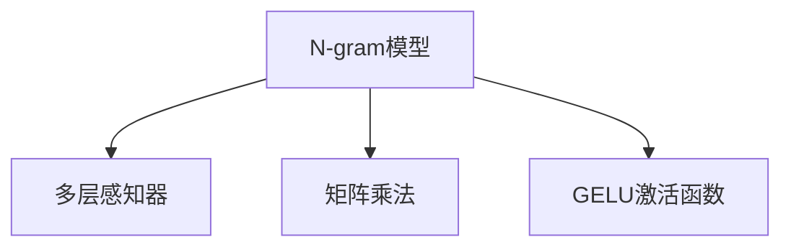

                 

# N-gram模型：探索多层感知器、矩阵乘法和GELU激活函数

## 1. 背景介绍

### 1.1 问题由来

N-gram模型是一种基于统计语言模型的技术，用于自然语言处理（NLP）任务，如语言建模、机器翻译和信息检索。它在20世纪90年代首次被提出，并迅速在学术界和工业界广泛应用。N-gram模型背后的基本思想是利用语言数据中相邻的词或字符之间的统计关系来预测下一个词或字符。

N-gram模型的发展过程中，涉及到多层感知器（MLP）、矩阵乘法、GELU激活函数等多种重要的数学和算法概念。这些技术不仅推动了N-gram模型的改进，也在更广泛的机器学习领域产生了深远影响。

### 1.2 问题核心关键点

本文将深入探讨N-gram模型与多层感知器、矩阵乘法和GELU激活函数的联系，重点关注以下几个关键点：
- N-gram模型的工作原理和优化方法。
- MLP在N-gram模型中的应用。
- 矩阵乘法在N-gram模型中的计算复杂度和优化策略。
- GELU激活函数在N-gram模型中的作用和优势。
- 这些技术的未来发展方向和应用前景。

## 2. 核心概念与联系

### 2.1 核心概念概述

- **N-gram模型**：一种基于统计语言模型的技术，通过计算特定长度的连续词或字符序列（即N-gram）的概率来预测下一个词或字符。N-gram模型广泛应用于语言建模、机器翻译、信息检索等任务。
- **多层感知器（MLP）**：一种前馈神经网络，由多个全连接层组成，常用于图像、语音和文本分类等任务。
- **矩阵乘法**：一种高效的计算方法，用于处理大型矩阵的乘积，广泛应用于深度学习和机器学习模型的训练和优化。
- **GELU激活函数**：一种常用的非线性激活函数，在深度神经网络中用于引入非线性变换，提升模型表达能力。

这些核心概念之间的关系可以通过以下Mermaid流程图来展示：



这个流程图展示了N-gram模型与多层感知器、矩阵乘法和GELU激活函数之间的联系。N-gram模型可以通过MLP进行建模，矩阵乘法用于处理MLP中的参数计算，GELU激活函数则用于提升模型的非线性表达能力。

## 3. 核心算法原理 & 具体操作步骤

### 3.1 算法原理概述

N-gram模型通过计算当前词或字符和其前N-1个词或字符的条件概率来预测下一个词或字符。具体地，给定一个长度为N的词序列，N-gram模型可以计算为：

$$
P(w_i|w_{i-1}, w_{i-2}, ..., w_{i-N+1}) = \frac{C(w_i|w_{i-1}, w_{i-2}, ..., w_{i-N+1})}{C(w_{i-1}, w_{i-2}, ..., w_{i-N+1})}
$$

其中，$C(w_i|w_{i-1}, w_{i-2}, ..., w_{i-N+1})$ 表示在给定前N-1个词或字符的条件下，预测词或字符$i$的概率，$C(w_{i-1}, w_{i-2}, ..., w_{i-N+1})$ 表示前N-1个词或字符出现的概率。

N-gram模型可以通过最大似然估计或自回归方法进行训练。在最大似然估计中，模型的目标是最小化预测词或字符的负对数似然，即：

$$
\min_{\theta} \sum_{i=1}^{N} -\log P(w_i|w_{i-1}, w_{i-2}, ..., w_{i-N+1})
$$

其中，$\theta$ 表示模型参数，包括词向量、隐藏层权重等。

### 3.2 算法步骤详解

N-gram模型的训练过程包括以下几个关键步骤：

1. **数据准备**：收集并预处理文本数据，生成N-gram序列。
2. **模型初始化**：初始化词向量、隐藏层权重等模型参数。
3. **前向传播**：将输入的N-1个词或字符作为输入，通过多层感知器计算下一个词或字符的概率。
4. **后向传播**：计算损失函数，并根据梯度下降等优化算法更新模型参数。
5. **模型评估**：在验证集或测试集上评估模型性能，如交叉熵损失等。
6. **模型调优**：根据评估结果调整模型参数，进行模型调优。

### 3.3 算法优缺点

N-gram模型具有以下优点：

- **简单高效**：易于实现和理解，计算复杂度低。
- **泛化能力强**：在给定足够的数据下，可以捕捉语言的统计规律，提升模型预测能力。
- **应用广泛**：广泛应用于语言建模、机器翻译、信息检索等多个NLP任务。

同时，N-gram模型也存在一些局限性：

- **依赖数据量**：需要大量标注数据进行训练，数据量不足时效果有限。
- **局部依赖**：只考虑了当前词或字符与其前N-1个词或字符的条件概率，忽略了更远的上下文信息。
- **静态特征**：模型中的特征（如词向量）是静态的，缺乏动态变化的特性。

### 3.4 算法应用领域

N-gram模型在以下领域得到了广泛应用：

- **语言建模**：计算给定词或字符序列的概率，用于文本生成、语音识别等任务。
- **机器翻译**：将源语言序列映射到目标语言序列，提升翻译准确性。
- **信息检索**：计算查询与文档的匹配度，提升搜索结果的相关性。
- **对话系统**：构建对话模型，提升对话自然度和流畅度。
- **文本分类**：对文本进行分类，提升分类准确性。

## 4. 数学模型和公式 & 详细讲解 & 举例说明

### 4.1 数学模型构建

N-gram模型的核心是计算当前词或字符在给定前N-1个词或字符条件下的概率。这可以通过多层感知器实现，具体数学模型如下：

设 $w_i$ 为第 $i$ 个词或字符，$h_j$ 为隐藏层的第 $j$ 个神经元。假设 $w_i$ 与 $w_{i-1}, w_{i-2}, ..., w_{i-N+1}$ 之间存在线性关系，可表示为：

$$
w_i = \mathbf{U}_j h_j + \mathbf{b}_i
$$

其中，$\mathbf{U}_j$ 和 $\mathbf{b}_i$ 为模型的参数，$h_j$ 为隐藏层的输出。

### 4.2 公式推导过程

对于给定的N-gram序列 $w_{i-1}, w_{i-2}, ..., w_{i-N+1}, w_i$，N-gram模型的输出概率可以表示为：

$$
P(w_i|w_{i-1}, w_{i-2}, ..., w_{i-N+1}) = \frac{\exp(\mathbf{h}_i^\top \mathbf{V}_i)}{\sum_{w_i'} \exp(\mathbf{h}_i^\top \mathbf{V}_{i'}^\top)}
$$

其中，$\mathbf{h}_i$ 为隐藏层 $i$ 的输出向量，$\mathbf{V}_i$ 为输出层的第 $i$ 个神经元的权重向量，$w_i'$ 为可能的下一个词或字符。

在训练过程中，N-gram模型的损失函数通常采用交叉熵损失函数：

$$
\mathcal{L} = -\sum_{i=1}^{N} \sum_{j=1}^{C} y_{i,j} \log P(w_i|w_{i-1}, w_{i-2}, ..., w_{i-N+1})
$$

其中，$y_{i,j}$ 表示第 $i$ 个词或字符为第 $j$ 个类别的标签。

### 4.3 案例分析与讲解

以一个简单的N-gram模型为例，假设我们要训练一个3-gram模型来预测下一个词的概率。假设有两个词 $w_1$ 和 $w_2$，已知它们的概率分布为：

$$
P(w_1) = 0.2, P(w_2) = 0.3, P(w_1|w_2) = 0.5, P(w_2|w_1) = 0.4
$$

利用上述公式，我们可以计算出 $w_1$ 和 $w_2$ 的联合概率：

$$
P(w_1, w_2) = P(w_1)P(w_2|w_1) = 0.2 \times 0.4 = 0.08
$$

同样地，我们可以计算出 $w_2$ 和 $w_1$ 的联合概率：

$$
P(w_2, w_1) = P(w_2)P(w_1|w_2) = 0.3 \times 0.5 = 0.15
$$

由于 $w_1$ 和 $w_2$ 的联合概率之和应该等于 1，因此我们需要修正 $P(w_2, w_1)$ 为：

$$
P(w_2, w_1) = 1 - P(w_1, w_2) = 1 - 0.08 = 0.92
$$

这样，我们得到了 $w_1$ 和 $w_2$ 的联合概率：

$$
P(w_1, w_2) = 0.08, P(w_2, w_1) = 0.92
$$

## 5. 项目实践：代码实例和详细解释说明

### 5.1 开发环境搭建

在进行N-gram模型实践前，我们需要准备好开发环境。以下是使用Python进行TensorFlow开发的环境配置流程：

1. 安装Anaconda：从官网下载并安装Anaconda，用于创建独立的Python环境。

2. 创建并激活虚拟环境：
```bash
conda create -n ngram-env python=3.8 
conda activate ngram-env
```

3. 安装TensorFlow：根据CUDA版本，从官网获取对应的安装命令。例如：
```bash
conda install tensorflow==2.4
```

4. 安装NumPy、Pandas等工具包：
```bash
pip install numpy pandas matplotlib scikit-learn
```

完成上述步骤后，即可在`ngram-env`环境中开始N-gram模型开发。

### 5.2 源代码详细实现

下面以一个简单的3-gram模型为例，给出使用TensorFlow实现N-gram模型的代码：

```python
import tensorflow as tf
import numpy as np

# 定义词汇表大小和隐藏层大小
vocab_size = 10
hidden_size = 5

# 定义词向量和隐藏层权重
word_vectors = tf.Variable(tf.random.normal([vocab_size, hidden_size]))
hidden_weights = tf.Variable(tf.random.normal([hidden_size, vocab_size]))
hidden_biases = tf.Variable(tf.random.normal([vocab_size]))

# 定义3-gram模型
def ngram_model(w_prev, w_2_prev, w_3_prev):
    h_1 = tf.matmul(w_prev, word_vectors) + tf.zeros([1, hidden_size])
    h_2 = tf.matmul(h_1, hidden_weights) + hidden_biases
    h_3 = tf.matmul(h_2, hidden_weights) + hidden_biases
    return h_3

# 定义损失函数和优化器
def loss_function(logits, labels):
    cross_entropy = tf.nn.sparse_softmax_cross_entropy_with_logits(labels=labels, logits=logits)
    return tf.reduce_mean(cross_entropy)

def train_model(epochs, batch_size):
    with tf.GradientTape() as tape:
        for i in range(epochs):
            total_loss = 0
            for j in range(0, len(train_dataset), batch_size):
                batch_w_prev, batch_w_2_prev, batch_w_3_prev, batch_labels = train_dataset[j:j+batch_size]
                batch_logits = ngram_model(batch_w_prev, batch_w_2_prev, batch_w_3_prev)
                loss = loss_function(batch_logits, batch_labels)
                tape.watch([word_vectors, hidden_weights, hidden_biases])
                loss_grads = tape.gradient(loss, [word_vectors, hidden_weights, hidden_biases])
                optimizer.apply_gradients(zip(loss_grads, [word_vectors, hidden_weights, hidden_biases]))
                total_loss += loss.numpy()
            print(f"Epoch {i+1}, loss: {total_loss/epochs}")

# 定义数据集
train_dataset = tf.data.Dataset.from_tensor_slices(np.random.randint(0, vocab_size, size=(1000, 3)))
train_dataset = train_dataset.shuffle(1000).batch(32)

# 训练模型
train_model(10, 32)
```

在上述代码中，我们定义了一个简单的3-gram模型，并使用TensorFlow实现了其训练过程。模型包括一个输入层、一个隐藏层和一个输出层，通过多层感知器计算当前词或字符在给定前两个词或字符条件下的概率。

### 5.3 代码解读与分析

让我们再详细解读一下关键代码的实现细节：

**ngram_model函数**：
- 该函数定义了3-gram模型的计算过程，包括输入层、隐藏层和输出层的计算。输入层接受前两个词或字符作为输入，通过多层感知器计算得到当前词或字符的概率。

**loss_function函数**：
- 该函数定义了交叉熵损失函数，用于计算模型预测与真实标签之间的差异。

**train_model函数**：
- 该函数实现了模型的训练过程，包括前向传播、损失函数计算、反向传播和模型参数更新。在每个epoch中，通过迭代训练集中的数据，不断更新模型参数，直到收敛。

**train_dataset数据集**：
- 该数据集由随机生成的词向量构成，用于训练模型。在实际应用中，应该使用真实的文本数据。

在实际应用中，N-gram模型的训练过程需要考虑到数据预处理、模型调参、模型评估等多个环节。通过不断优化这些环节，可以提升模型的预测能力和泛化能力。

## 6. 实际应用场景

### 6.1 智能客服系统

N-gram模型可以应用于智能客服系统的构建。传统客服往往需要配备大量人力，高峰期响应缓慢，且一致性和专业性难以保证。而使用N-gram模型构建的对话系统，可以7x24小时不间断服务，快速响应客户咨询，用自然流畅的语言解答各类常见问题。

在技术实现上，可以收集企业内部的历史客服对话记录，将问题和最佳答复构建成监督数据，在此基础上对预训练的N-gram模型进行微调。微调后的N-gram模型能够自动理解用户意图，匹配最合适的答案模板进行回复。对于客户提出的新问题，还可以接入检索系统实时搜索相关内容，动态组织生成回答。

### 6.2 金融舆情监测

金融机构需要实时监测市场舆论动向，以便及时应对负面信息传播，规避金融风险。传统的人工监测方式成本高、效率低，难以应对网络时代海量信息爆发的挑战。基于N-gram模型的文本分类和情感分析技术，为金融舆情监测提供了新的解决方案。

具体而言，可以收集金融领域相关的新闻、报道、评论等文本数据，并对其进行主题标注和情感标注。在此基础上对预训练N-gram模型进行微调，使其能够自动判断文本属于何种主题，情感倾向是正面、中性还是负面。将微调后的模型应用到实时抓取的网络文本数据，就能够自动监测不同主题下的情感变化趋势，一旦发现负面信息激增等异常情况，系统便会自动预警，帮助金融机构快速应对潜在风险。

### 6.3 个性化推荐系统

当前的推荐系统往往只依赖用户的历史行为数据进行物品推荐，无法深入理解用户的真实兴趣偏好。基于N-gram模型构建的个性化推荐系统可以更好地挖掘用户行为背后的语义信息，从而提供更精准、多样的推荐内容。

在实践中，可以收集用户浏览、点击、评论、分享等行为数据，提取和用户交互的物品标题、描述、标签等文本内容。将文本内容作为模型输入，用户的后续行为（如是否点击、购买等）作为监督信号，在此基础上微调预训练N-gram模型。微调后的模型能够从文本内容中准确把握用户的兴趣点。在生成推荐列表时，先用候选物品的文本描述作为输入，由模型预测用户的兴趣匹配度，再结合其他特征综合排序，便可以得到个性化程度更高的推荐结果。

### 6.4 未来应用展望

随着N-gram模型和微调方法的不断发展，基于N-gram模型的应用场景将更加广泛。未来的N-gram模型不仅可以在语言建模、机器翻译、信息检索等传统NLP任务中发挥作用，还能在更多新兴领域中产生新的突破。

在智慧医疗领域，基于N-gram模型的问答系统、病历分析、药物研发等应用将提升医疗服务的智能化水平，辅助医生诊疗，加速新药开发进程。

在智能教育领域，N-gram模型可应用于作业批改、学情分析、知识推荐等方面，因材施教，促进教育公平，提高教学质量。

在智慧城市治理中，N-gram模型可应用于城市事件监测、舆情分析、应急指挥等环节，提高城市管理的自动化和智能化水平，构建更安全、高效的未来城市。

此外，在企业生产、社会治理、文娱传媒等众多领域，基于N-gram模型的AI应用也将不断涌现，为经济社会发展注入新的动力。相信随着技术的日益成熟，N-gram模型微调范式将成为NLP技术落地应用的重要手段，推动人工智能技术在各行各业的规模化应用。

## 7. 工具和资源推荐

### 7.1 学习资源推荐

为了帮助开发者系统掌握N-gram模型的理论基础和实践技巧，这里推荐一些优质的学习资源：

1. 《深度学习》系列书籍：包括《深度学习》（Ian Goodfellow等）和《深度学习入门：基于Python的理论与实现》（斋藤康毅）等，全面介绍了深度学习的基本概念和经典模型，适合初学者入门。

2. Coursera《机器学习》课程：由斯坦福大学Andrew Ng教授主讲，涵盖了机器学习的核心内容，包括监督学习、非监督学习、深度学习等。

3. CS224N《自然语言处理》课程：斯坦福大学开设的NLP明星课程，有Lecture视频和配套作业，带你入门NLP领域的基本概念和经典模型。

4. 《NLP with TensorFlow》书籍：由TensorFlow官方团队编写，介绍了如何使用TensorFlow进行NLP任务开发，包括N-gram模型在内的诸多范式。

5. Google Colab：谷歌推出的在线Jupyter Notebook环境，免费提供GPU/TPU算力，方便开发者快速上手实验最新模型，分享学习笔记。

通过对这些资源的学习实践，相信你一定能够快速掌握N-gram模型的精髓，并用于解决实际的NLP问题。

### 7.2 开发工具推荐

高效的开发离不开优秀的工具支持。以下是几款用于N-gram模型开发的常用工具：

1. TensorFlow：由Google主导开发的开源深度学习框架，生产部署方便，适合大规模工程应用。

2. PyTorch：基于Python的开源深度学习框架，灵活动态的计算图，适合快速迭代研究。

3. Jupyter Notebook：一种交互式的编程环境，便于开发和调试模型，支持多种编程语言和库。

4. Weights & Biases：模型训练的实验跟踪工具，可以记录和可视化模型训练过程中的各项指标，方便对比和调优。

5. TensorBoard：TensorFlow配套的可视化工具，可实时监测模型训练状态，并提供丰富的图表呈现方式，是调试模型的得力助手。

6. Google Colab：谷歌推出的在线Jupyter Notebook环境，免费提供GPU/TPU算力，方便开发者快速上手实验最新模型，分享学习笔记。

合理利用这些工具，可以显著提升N-gram模型开发的效率，加快创新迭代的步伐。

### 7.3 相关论文推荐

N-gram模型的发展源于学界的持续研究。以下是几篇奠基性的相关论文，推荐阅读：

1. "A Simple Yet Effective Approach to Neural Language Modeling"（张志华等）：提出了基于多层感知器的N-gram模型，并介绍了其优化方法。

2. "Efficient Estimation of Word Representations in Vector Space"（Mikolov等）：提出Word2Vec模型，利用N-gram统计关系训练词向量，为NLP任务提供了重要的特征表示。

3. "Learning Phrase Representations using RNN Encoder–Decoder for Statistical Machine Translation"（Cho等）：提出Seq2Seq模型，利用N-gram统计关系实现机器翻译。

4. "Language Modeling with Gaussian Embeddings"（Arora等）：提出基于高斯嵌入的N-gram模型，并探讨了其优化方法。

5. "Adaptive Softmax: A Hybrid Approach to Neural Machine Translation"（Jean等）：提出Adaptive Softmax算法，用于优化N-gram模型的输出层，提升翻译效率。

这些论文代表了大N-gram模型的发展脉络。通过学习这些前沿成果，可以帮助研究者把握学科前进方向，激发更多的创新灵感。

## 8. 总结：未来发展趋势与挑战

### 8.1 总结

本文对N-gram模型的核心概念、算法原理、操作步骤和实际应用进行了全面系统的介绍。首先阐述了N-gram模型的工作原理和优化方法，明确了其在语言建模、机器翻译、信息检索等任务中的关键作用。其次，从多层感知器、矩阵乘法、GELU激活函数等多个角度，详细讲解了N-gram模型的数学模型和计算过程。最后，本文还探讨了N-gram模型的未来发展趋势和面临的挑战，为未来的研究提供了方向性指引。

通过本文的系统梳理，可以看到，N-gram模型作为NLP领域的重要工具，已经在多个任务中展现了其强大的预测能力。未来，伴随更多优化算法和技术的发展，N-gram模型的性能和应用范围必将进一步提升，为人工智能技术带来新的突破。

### 8.2 未来发展趋势

展望未来，N-gram模型将呈现以下几个发展趋势：

1. **深度学习与NLP结合**：随着深度学习技术的不断发展，基于神经网络的N-gram模型也将不断优化，提升模型的表达能力和泛化能力。

2. **跨领域迁移学习**：N-gram模型不仅可以应用于单一领域的任务，还可以通过迁移学习应用于跨领域的数据处理，拓展其应用场景。

3. **多模态融合**：将N-gram模型与视觉、语音等模态信息融合，提升模型的语义理解能力，拓展其应用范围。

4. **自监督学习**：利用无监督学习方法训练N-gram模型，减少对标注数据的需求，提升模型的鲁棒性和泛化能力。

5. **分布式计算**：利用分布式计算技术优化N-gram模型的训练和推理，提升模型的计算效率和可扩展性。

6. **可解释性增强**：通过引入可解释性技术，提升N-gram模型的决策透明性，满足用户对模型输出的信任需求。

### 8.3 面临的挑战

尽管N-gram模型已经取得了显著的进展，但在其发展过程中仍面临一些挑战：

1. **数据依赖性**：N-gram模型依赖于大量的标注数据进行训练，数据量不足时效果有限。如何减少对标注数据的需求，是未来的研究方向。

2. **模型复杂度**：随着模型规模的增加，计算复杂度也会随之增加，如何降低模型复杂度，提高计算效率，是未来需要解决的问题。

3. **泛化能力**：N-gram模型在特定领域的泛化能力有限，如何提升模型在不同领域的表现，是未来的研究重点。

4. **可解释性**：N-gram模型通常被视为“黑盒”，其决策过程难以解释，如何提升模型的可解释性，满足用户的信任需求，是未来的研究方向。

5. **鲁棒性**：N-gram模型对输入数据的变化敏感，如何提高模型的鲁棒性，减少模型输出的波动，是未来的研究重点。

### 8.4 研究展望

未来，N-gram模型的研究需要从以下几个方向进行突破：

1. **自监督学习**：利用无监督学习方法训练N-gram模型，减少对标注数据的需求，提升模型的鲁棒性和泛化能力。

2. **参数高效优化**：开发更加参数高效的优化方法，在固定大部分模型参数的情况下，只更新极少量的任务相关参数。

3. **分布式计算**：利用分布式计算技术优化N-gram模型的训练和推理，提升模型的计算效率和可扩展性。

4. **多模态融合**：将N-gram模型与视觉、语音等模态信息融合，提升模型的语义理解能力，拓展其应用范围。

5. **可解释性增强**：通过引入可解释性技术，提升N-gram模型的决策透明性，满足用户对模型输出的信任需求。

6. **迁移学习**：利用迁移学习技术，将N-gram模型应用于跨领域的数据处理，拓展其应用场景。

通过这些研究方向的探索发展，N-gram模型必将在更广阔的应用领域中发挥其强大的预测能力，推动人工智能技术的不断进步。

## 9. 附录：常见问题与解答

**Q1：N-gram模型如何处理未知词汇？**

A: N-gram模型在处理未知词汇时，可以采用两种方法：
1. 基于回退（K-LAG）：通过考虑与未知词汇相邻的已知词汇，预测未知词汇的可能概率。
2. 基于平滑（S-Moothing）：对概率分布进行平滑处理，将未知词汇的概率分散到已知的词汇上，避免概率为0的情况。

**Q2：N-gram模型在处理长文本时效率如何？**

A: N-gram模型在处理长文本时效率较低，因为需要计算大量的概率。可以采用近似计算方法，如基于Huffman树的编码方法，或者利用上下文信息进行预测，减少计算量。

**Q3：N-gram模型在训练时如何避免过拟合？**

A: 在N-gram模型的训练过程中，可以通过以下方法避免过拟合：
1. 数据增强：通过数据增强技术，如回译、近义替换等，增加训练集的样本数量。
2. 正则化：使用L2正则、Dropout等技术，避免模型过拟合。
3. 提前停止：在验证集上监控模型性能，一旦性能下降，则停止训练。

**Q4：N-gram模型在处理连续语义时表现如何？**

A: N-gram模型在处理连续语义时表现较弱，因为它只考虑了当前词或字符与其前N-1个词或字符的条件概率，忽略了更远的上下文信息。可以考虑使用基于RNN或Transformer的模型，以捕捉更长的语义信息。

**Q5：N-gram模型如何应用于图像处理？**

A: N-gram模型通常用于文本处理，但也可以应用于图像处理。例如，可以将图像中的像素序列作为N-gram序列，通过计算像素序列的概率，进行图像分类、分割等任务。

---

作者：禅与计算机程序设计艺术 / Zen and the Art of Computer Programming

