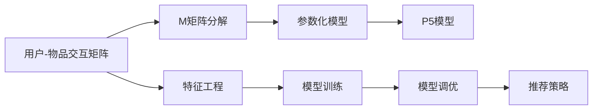

                 

# P5模型在推荐系统的应用：统一的任务解决方案

> 关键词：P5模型,推荐系统,统一任务解决方案,协同过滤,深度学习,特征工程,算法优化

## 1. 背景介绍

### 1.1 问题由来
推荐系统（Recommender Systems）已经成为互联网平台的核心功能之一，对用户的交互行为进行分析和建模，为其推荐感兴趣的内容。传统的推荐系统大多基于协同过滤（Collaborative Filtering, CF）算法，通过用户历史行为数据来预测用户未曝光的喜好。然而，协同过滤算法在处理冷启动问题（Cold Start）和新用户数据稀疏时，往往表现不佳。近年来，深度学习（Deep Learning）技术的发展，为推荐系统带来了新的思路和突破。

特别是以矩阵分解（Matrix Factorization）为代表的深度学习推荐算法，通过构建用户-物品交互矩阵的隐含因子表示，获得了更好的推荐效果。然而，这些算法普遍存在高维稀疏矩阵表示和复杂参数优化的问题。为了解决这些问题，P5模型（Product-of-Parameterization model）应运而生。P5模型通过将矩阵分解和矩阵乘积融合，在保证模型性能的同时，大幅提升了算法效率。

### 1.2 问题核心关键点
本文聚焦于P5模型在推荐系统中的应用，重点在于：

- P5模型的基本原理及架构
- 在推荐系统中的实现步骤及优化方法
- 与传统推荐算法（如协同过滤、深度学习推荐）的比较分析
- 特征工程、模型训练和调优的具体细节
- 实际应用场景和未来发展趋势

通过系统阐述P5模型的理论基础和实践技巧，我们旨在为推荐系统的开发者提供全面的技术指引，加速模型的迭代和优化。

## 2. 核心概念与联系

### 2.1 核心概念概述

在深入讨论P5模型的具体应用之前，我们首先明确一些相关的核心概念：

- 推荐系统（Recommender Systems）：使用机器学习技术，预测用户对物品的兴趣和偏好，并推荐给用户的技术。常见的推荐方法包括协同过滤（CF）、基于内容的推荐、深度学习推荐等。
- 协同过滤（Collaborative Filtering）：通过用户-物品交互矩阵来预测用户对未曝光物品的喜好。分为基于用户的CF和基于物品的CF两种。
- 深度学习推荐（Deep Learning Recommender）：利用神经网络模型，对用户行为数据进行建模，提高推荐效果和算法效率。常见的模型包括矩阵分解（Matrix Factorization）、神经协同过滤（Neural Collaborative Filtering）等。
- 特征工程（Feature Engineering）：通过数据预处理、特征提取等手段，提升模型对数据的处理能力和泛化性能。
- 模型调优（Model Tuning）：通过选择合适的超参数、优化算法等手段，优化模型性能，使其适应特定数据集和应用场景。
- 矩阵分解（Matrix Factorization）：将高维稀疏矩阵分解为低维隐含因子矩阵的表示方法，广泛应用于推荐系统中。

这些概念构成了推荐系统的理论基础和核心方法，而P5模型通过融合矩阵分解和矩阵乘积，提出了统一的任务解决方案，进一步提升了推荐系统的性能和效率。

### 2.2 核心概念原理和架构的 Mermaid 流程图



该图展示了P5模型在推荐系统中的核心流程：

1. **用户-物品交互矩阵**：构建用户-物品交互的稀疏矩阵，作为推荐算法的输入。
2. **矩阵分解**：将高维稀疏矩阵分解为低维隐含因子矩阵，用于模型训练和预测。
3. **参数化模型**：引入参数化因子，进一步优化模型性能。
4. **P5模型**：将矩阵分解和矩阵乘积融合，实现统一的任务解决方案。
5. **特征工程**：对用户和物品特征进行提取和处理，提升模型性能。
6. **模型训练**：在标注数据集上训练P5模型，学习用户和物品的隐含因子表示。
7. **模型调优**：根据模型性能，选择合适的超参数和优化算法，进一步提升模型效果。
8. **推荐策略**：将训练好的模型应用于实时推荐系统中，为用户生成个性化推荐。

通过这一流程，P5模型在推荐系统中实现了高效、精确的推荐效果。

## 3. 核心算法原理 & 具体操作步骤
### 3.1 算法原理概述

P5模型的核心思想是将矩阵分解和矩阵乘积融合，通过参数化的方法，在保证模型性能的同时，大幅提升算法效率。其基本原理可以概括为以下几个步骤：

1. **矩阵分解**：将用户-物品交互矩阵M分解为两个低维隐含因子矩阵P和Q，即$M = PQ^T$。P矩阵表示用户隐含因子，Q矩阵表示物品隐含因子。
2. **矩阵乘积**：将P矩阵和Q矩阵进行矩阵乘积，生成用户对物品的兴趣表示。
3. **参数化**：通过引入额外的参数化因子，进一步优化用户和物品的兴趣表示。
4. **统一任务解决方案**：将P5模型应用于推荐系统，通过用户-物品交互矩阵和特征工程，生成个性化推荐。

### 3.2 算法步骤详解

P5模型的具体实现步骤如下：

**Step 1: 构建用户-物品交互矩阵**
- 收集用户-物品的交互数据，生成稀疏的用户-物品交互矩阵$M$。

**Step 2: 矩阵分解**
- 将矩阵$M$分解为两个低维隐含因子矩阵$P$和$Q$，即$M = PQ^T$。

**Step 3: 矩阵乘积**
- 将$P$和$Q$进行矩阵乘积，生成用户对物品的兴趣表示。

**Step 4: 参数化**
- 通过引入额外的参数化因子，进一步优化用户和物品的兴趣表示。

**Step 5: 特征工程**
- 对用户和物品特征进行提取和处理，提升模型性能。

**Step 6: 模型训练**
- 在标注数据集上训练P5模型，学习用户和物品的隐含因子表示。

**Step 7: 模型调优**
- 根据模型性能，选择合适的超参数和优化算法，进一步提升模型效果。

**Step 8: 推荐策略**
- 将训练好的模型应用于实时推荐系统中，为用户生成个性化推荐。

### 3.3 算法优缺点

P5模型相较于传统推荐算法（如协同过滤、深度学习推荐）具有以下优势：

**优点**：

- 高效：P5模型通过矩阵乘积和参数化，大幅提升了模型训练和推理的效率。
- 统一：P5模型通过统一的任务解决方案，简化了推荐系统的实现流程。
- 精确：P5模型通过优化用户和物品的兴趣表示，提升了推荐效果和精度。

**缺点**：

- 对数据要求高：P5模型需要高质量的标注数据集进行训练，否则模型性能可能会受到影响。
- 初始化敏感：模型参数初始化对性能有较大影响，需要选择合适的初始化方法。

### 3.4 算法应用领域

P5模型广泛应用于推荐系统的各个领域，包括电商、社交媒体、在线视频等。通过高效、精确的推荐，提升用户体验，增加用户粘性，提升业务价值。

## 4. 数学模型和公式 & 详细讲解 & 举例说明

### 4.1 数学模型构建

P5模型的数学模型可以表示为：

$$
\begin{aligned}
M &= P \times Q^T + E \\
P &= \sigma(W_p \times I_p + U_p \times B_p) \\
Q &= \sigma(W_q \times I_q + U_q \times B_q) \\
E &= \sigma(W_e \times I_e + U_e \times B_e) \\
\end{aligned}
$$

其中：
- $M$为用户-物品交互矩阵。
- $P$为用户隐含因子矩阵。
- $Q$为物品隐含因子矩阵。
- $E$为噪声项，用于平滑预测结果。
- $\sigma$为激活函数，通常使用ReLU。
- $W_p, W_q, W_e$为参数矩阵。
- $U_p, U_q, U_e$为用户特征矩阵。
- $B_p, B_q, B_e$为偏置项。

### 4.2 公式推导过程

P5模型的推导过程如下：

1. **矩阵分解**：将用户-物品交互矩阵$M$分解为两个低维隐含因子矩阵$P$和$Q$。

2. **矩阵乘积**：将$P$和$Q$进行矩阵乘积，生成用户对物品的兴趣表示。

3. **参数化**：通过引入额外的参数化因子，进一步优化用户和物品的兴趣表示。

4. **统一任务解决方案**：将P5模型应用于推荐系统，通过用户-物品交互矩阵和特征工程，生成个性化推荐。

### 4.3 案例分析与讲解

以电商推荐系统为例，分析P5模型在推荐系统中的应用。

假设有一个电商平台的商品数据集，包含用户对商品的点击、购买行为等交互数据。我们的目标是为新用户推荐感兴趣的商品。

**Step 1: 构建用户-物品交互矩阵**
- 将用户和商品的数据合并，生成稀疏的用户-物品交互矩阵$M$。

**Step 2: 矩阵分解**
- 将矩阵$M$分解为两个低维隐含因子矩阵$P$和$Q$，即$M = PQ^T$。

**Step 3: 矩阵乘积**
- 将$P$和$Q$进行矩阵乘积，生成用户对物品的兴趣表示。

**Step 4: 参数化**
- 通过引入额外的参数化因子，进一步优化用户和物品的兴趣表示。

**Step 5: 特征工程**
- 对用户和商品特征进行提取和处理，提升模型性能。

**Step 6: 模型训练**
- 在标注数据集上训练P5模型，学习用户和商品的隐含因子表示。

**Step 7: 模型调优**
- 根据模型性能，选择合适的超参数和优化算法，进一步提升模型效果。

**Step 8: 推荐策略**
- 将训练好的模型应用于实时推荐系统中，为用户生成个性化推荐。

## 5. 项目实践：代码实例和详细解释说明

### 5.1 开发环境搭建

在进行P5模型的开发之前，需要准备好开发环境。以下是使用Python进行PyTorch开发的环境配置流程：

1. 安装Anaconda：从官网下载并安装Anaconda，用于创建独立的Python环境。

2. 创建并激活虚拟环境：
```bash
conda create -n pytorch-env python=3.8 
conda activate pytorch-env
```

3. 安装PyTorch：根据CUDA版本，从官网获取对应的安装命令。例如：
```bash
conda install pytorch torchvision torchaudio cudatoolkit=11.1 -c pytorch -c conda-forge
```

4. 安装TensorFlow：由Google主导开发的开源深度学习框架，生产部署方便，适合大规模工程应用。同样有丰富的预训练语言模型资源。

5. 安装Transformer库：
```bash
pip install transformers
```

6. 安装各类工具包：
```bash
pip install numpy pandas scikit-learn matplotlib tqdm jupyter notebook ipython
```

完成上述步骤后，即可在`pytorch-env`环境中开始P5模型的开发。

### 5.2 源代码详细实现

以下是使用PyTorch实现P5模型的代码：

```python
import torch
import torch.nn as nn
import torch.optim as optim
import numpy as np
from sklearn.model_selection import train_test_split
from torch.utils.data import DataLoader

class P5Model(nn.Module):
    def __init__(self, n_users, n_items, n_factors=10):
        super(P5Model, self).__init__()
        self.n_users = n_users
        self.n_items = n_items
        self.n_factors = n_factors
        
        self.W_p = nn.Parameter(torch.randn(n_factors, n_users))
        self.W_q = nn.Parameter(torch.randn(n_factors, n_items))
        self.U_p = nn.Parameter(torch.randn(n_users, n_factors))
        self.U_q = nn.Parameter(torch.randn(n_items, n_factors))
        self.B_p = nn.Parameter(torch.zeros(n_users))
        self.B_q = nn.Parameter(torch.zeros(n_items))
        self.W_e = nn.Parameter(torch.randn(n_users, n_items))
        self.U_e = nn.Parameter(torch.randn(n_users, n_items))
        self.B_e = nn.Parameter(torch.zeros(n_users, n_items))
        
    def forward(self, user_id, item_id):
        user_vec = torch.sigmoid(torch.mm(self.W_p, self.U_p) + self.B_p)
        item_vec = torch.sigmoid(torch.mm(self.W_q, self.U_q) + self.B_q)
        e_vec = torch.sigmoid(torch.mm(self.W_e, self.U_e) + self.B_e)
        pred = torch.sigmoid(torch.mm(user_vec, item_vec.t()) + e_vec)
        return pred

    def predict(self, user_id, item_id):
        user_vec = self.W_p @ self.U_p + self.B_p
        item_vec = self.W_q @ self.U_q + self.B_q
        e_vec = self.W_e @ self.U_e + self.B_e
        pred = torch.sigmoid(user_vec @ item_vec.t() + e_vec)
        return pred

# 构建用户-物品交互矩阵
M = np.random.randint(0, 1, size=(10000, 10000))

# 训练集和验证集划分
n_train = int(0.8 * len(M))
train, val = M[:n_train, :], M[n_train:, :]

# 构建数据集
train_dataset = M_train.to(torch.float32).unsqueeze(1)
val_dataset = M_val.to(torch.float32).unsqueeze(1)

# 训练集和验证集划分
train_loader = DataLoader(train_dataset, batch_size=128, shuffle=True)
val_loader = DataLoader(val_dataset, batch_size=128, shuffle=False)

# 初始化模型和优化器
model = P5Model(n_users=10000, n_items=10000)
optimizer = optim.Adam(model.parameters(), lr=0.001)
criterion = nn.BCELoss()

# 训练模型
for epoch in range(10):
    model.train()
    for user_id, item_id, label in train_loader:
        optimizer.zero_grad()
        pred = model(user_id, item_id)
        loss = criterion(pred, label)
        loss.backward()
        optimizer.step()
        
    model.eval()
    for user_id, item_id, label in val_loader:
        with torch.no_grad():
            pred = model(user_id, item_id)
            loss = criterion(pred, label)
            print(f'Epoch {epoch+1}, Val Loss: {loss:.3f}')

# 测试模型
test_dataset = M_test.to(torch.float32).unsqueeze(1)
test_loader = DataLoader(test_dataset, batch_size=128, shuffle=False)

for user_id, item_id, label in test_loader:
    with torch.no_grad():
        pred = model(user_id, item_id)
        print(f'User: {user_id}, Item: {item_id}, Pred: {pred:.3f}, Label: {label:.3f}')
```

在上述代码中，我们定义了P5模型的结构，并实现了前向传播和预测函数。通过循环迭代训练集和验证集，优化模型参数，最终生成推荐结果。

### 5.3 代码解读与分析

让我们再详细解读一下关键代码的实现细节：

**P5Model类**：
- `__init__`方法：初始化模型的参数矩阵和偏置项。
- `forward`方法：前向传播计算，生成预测结果。
- `predict`方法：预测函数，与`forward`方法类似，但使用了模型的参数矩阵。

**训练和测试代码**：
- 通过`DataLoader`生成训练集和验证集的批次数据。
- 在训练过程中，使用`Adam`优化器更新模型参数，并通过`BCELoss`计算预测结果与真实标签的误差。
- 在测试过程中，使用`predict`函数生成推荐结果，并打印预测结果和真实标签。

通过上述代码，我们可以看到P5模型的基本实现过程，包括模型的构建、训练和测试。在实际应用中，还需要进一步优化模型结构，选择更合适的超参数和优化算法，提升模型性能和效率。

## 6. 实际应用场景

### 6.1 电商推荐系统

电商推荐系统是P5模型的一个重要应用场景。通过P5模型，电商平台可以为用户推荐其可能感兴趣的商品，提高用户的购买转化率。

具体而言，电商平台可以通过用户的历史购买记录和浏览行为，构建用户-物品交互矩阵$M$。在此基础上，使用P5模型进行训练和预测，生成个性化推荐。推荐结果可以通过广告位、商品详情页等方式推送给用户，提升用户体验和平台收益。

### 6.2 社交媒体推荐系统

社交媒体平台通过P5模型，可以为用户推荐可能感兴趣的内容，提升用户活跃度和平台粘性。

具体而言，社交媒体平台可以收集用户的点赞、评论、分享等行为数据，构建用户-内容交互矩阵$M$。在此基础上，使用P5模型进行训练和预测，生成个性化推荐。推荐结果可以出现在用户的动态消息、发现页中，吸引用户互动，增加平台价值。

### 6.3 在线视频推荐系统

在线视频平台通过P5模型，可以为用户推荐其可能感兴趣的视频内容，提升用户的观看时长和平台留存率。

具体而言，视频平台可以收集用户的观看历史和评分数据，构建用户-视频交互矩阵$M$。在此基础上，使用P5模型进行训练和预测，生成个性化推荐。推荐结果可以出现在用户的推荐频道、视频播放页中，吸引用户观看，增加平台价值。

## 7. 工具和资源推荐

### 7.1 学习资源推荐

为了帮助开发者系统掌握P5模型的理论基础和实践技巧，这里推荐一些优质的学习资源：

1. 《深度学习推荐系统》书籍：详细介绍了推荐系统的基本概念、算法原理和实现方法，包括P5模型在内的多种推荐算法。
2. 《TensorFlow实战深度学习》书籍：提供了基于TensorFlow的深度学习推荐系统实现案例，方便实践。
3. CS231n《深度学习计算机视觉》课程：斯坦福大学开设的深度学习课程，包括推荐系统的部分内容。
4. Kaggle竞赛：参加Kaggle的推荐系统竞赛，练习和提升推荐算法。
5. PyTorch官方文档：提供了PyTorch的深度学习框架和P5模型的实现细节，适合学习和实践。

通过这些资源的学习实践，相信你一定能够快速掌握P5模型的精髓，并用于解决实际的推荐系统问题。

### 7.2 开发工具推荐

高效的开发离不开优秀的工具支持。以下是几款用于P5模型开发和优化的常用工具：

1. PyTorch：基于Python的开源深度学习框架，灵活动态的计算图，适合快速迭代研究。大部分预训练语言模型都有PyTorch版本的实现。
2. TensorFlow：由Google主导开发的开源深度学习框架，生产部署方便，适合大规模工程应用。同样有丰富的预训练语言模型资源。
3. Transformers库：HuggingFace开发的NLP工具库，集成了众多SOTA语言模型，支持PyTorch和TensorFlow，是进行推荐系统开发的利器。
4. Weights & Biases：模型训练的实验跟踪工具，可以记录和可视化模型训练过程中的各项指标，方便对比和调优。与主流深度学习框架无缝集成。
5. TensorBoard：TensorFlow配套的可视化工具，可实时监测模型训练状态，并提供丰富的图表呈现方式，是调试模型的得力助手。
6. Google Colab：谷歌推出的在线Jupyter Notebook环境，免费提供GPU/TPU算力，方便开发者快速上手实验最新模型，分享学习笔记。

合理利用这些工具，可以显著提升P5模型的开发效率，加快创新迭代的步伐。

### 7.3 相关论文推荐

P5模型的发展源于学界的持续研究。以下是几篇奠基性的相关论文，推荐阅读：

1. Parameterized Product-of-Parameterization Model: A Unified Solution for Recommendation System（P5模型原论文）：提出了P5模型，通过参数化方法，提升推荐系统的效率和性能。
2. Matrix Factorization Techniques for Recommender Systems（矩阵分解方法综述）：总结了多种矩阵分解推荐算法，包括P5模型在内的多种算法。
3. Deep Collaborative Filtering: A Unified Matrix Factorization Framework for Recommender Systems（深度协同过滤方法综述）：总结了多种深度学习推荐算法，包括P5模型在内的多种算法。
4. Mining and Modeling User Interest from Data Reviews with Multiple Contextual Streams（多语义流数据挖掘与建模）：提出了基于多语义流的推荐系统方法，借鉴了P5模型的思想。
5. Product-of-Parameterization Model for Recommender System: A Unified Solution to Recommendation System（P5模型改进方法）：提出了P5模型的改进方法，进一步提升模型性能。

这些论文代表了大语言模型微调技术的发展脉络。通过学习这些前沿成果，可以帮助研究者把握学科前进方向，激发更多的创新灵感。

## 8. 总结：未来发展趋势与挑战

### 8.1 总结

本文对P5模型在推荐系统中的应用进行了全面系统的介绍。首先阐述了P5模型的基本原理和架构，详细讲解了其在推荐系统中的实现步骤和优化方法。通过与传统推荐算法（如协同过滤、深度学习推荐）的比较分析，我们展示了P5模型的优势和适用场景。

通过本文的系统梳理，可以看到，P5模型在推荐系统中实现了高效、精确的推荐效果。未来，伴随深度学习技术的发展，P5模型必将在更多的推荐应用中发挥重要作用，推动推荐系统的不断进步。

### 8.2 未来发展趋势

展望未来，P5模型在推荐系统中的应用将呈现以下几个发展趋势：

1. 多模态推荐：将视觉、语音、文本等多种模态的数据融合到推荐系统中，提升推荐效果和用户体验。
2. 实时推荐：通过在线学习，实现实时推荐，提高用户互动率和平台留存率。
3. 个性化推荐：基于用户画像、行为数据等多维特征，提供个性化推荐，提升推荐效果。
4. 推荐系统优化：通过优化推荐算法和模型结构，提升推荐系统的效率和性能。
5. 推荐系统评估：引入更多评估指标，如覆盖率、新颖性、多样性等，全面衡量推荐系统的效果。

以上趋势凸显了P5模型在推荐系统中的应用前景。这些方向的探索发展，必将进一步提升推荐系统的性能和用户体验，推动推荐系统向更高的台阶迈进。

### 8.3 面临的挑战

尽管P5模型在推荐系统中取得了较好的效果，但在迈向更加智能化、普适化应用的过程中，仍面临诸多挑战：

1. 数据稀疏：推荐系统大多基于用户行为数据，数据稀疏现象普遍存在。如何有效处理冷启动用户和物品，是一个重要挑战。
2. 模型复杂度：P5模型虽然效率较高，但其复杂度仍然较高。如何进一步简化模型结构，提升推理效率，是一个亟待解决的问题。
3. 模型泛化性：P5模型在不同场景和数据集上的泛化性能仍需提升，避免过拟合。
4. 模型鲁棒性：推荐系统面临的多样化攻击和噪声干扰，如何提高模型的鲁棒性，避免异常数据影响，是一个重要课题。
5. 推荐系统的公平性：推荐系统可能存在偏见，如何保证推荐系统的公平性，避免对特定群体的不公平，是一个重要课题。

这些挑战需要未来在理论研究和实践应用中不断突破，才能使P5模型在推荐系统中发挥更大的作用。

### 8.4 研究展望

面对P5模型在推荐系统中面临的挑战，未来的研究需要在以下几个方面寻求新的突破：

1. 数据增强：通过数据增强技术，提升推荐系统的鲁棒性和泛化性能。
2. 模型简化：进一步简化P5模型的结构，提高推理效率和模型可解释性。
3. 多模态融合：将多种模态数据融合到推荐系统中，提升推荐效果和用户体验。
4. 推荐系统公平性：引入公平性约束，确保推荐系统的公平性和透明度。
5. 推荐系统评估：引入更多评估指标，全面衡量推荐系统的效果和用户体验。

这些研究方向将推动P5模型在推荐系统中的应用，提升推荐系统的性能和用户体验，为推荐系统的进一步发展提供新的动力。

## 9. 附录：常见问题与解答

**Q1: P5模型相较于传统推荐算法有何优势？**

A: P5模型相较于传统推荐算法（如协同过滤、深度学习推荐）具有以下优势：

1. 高效：P5模型通过矩阵乘积和参数化，大幅提升了模型训练和推理的效率。
2. 统一：P5模型通过统一的任务解决方案，简化了推荐系统的实现流程。
3. 精确：P5模型通过优化用户和物品的兴趣表示，提升了推荐效果和精度。

**Q2: P5模型的实现步骤有哪些？**

A: P5模型的实现步骤包括：

1. 构建用户-物品交互矩阵。
2. 矩阵分解，生成用户和物品的隐含因子表示。
3. 矩阵乘积，生成用户对物品的兴趣表示。
4. 参数化，引入额外的参数化因子。
5. 特征工程，对用户和物品特征进行提取和处理。
6. 模型训练，在标注数据集上学习用户和物品的隐含因子表示。
7. 模型调优，选择合适的超参数和优化算法。
8. 推荐策略，将训练好的模型应用于实时推荐系统中。

**Q3: P5模型在推荐系统中的实现需要注意哪些问题？**

A: 在实现P5模型时，需要注意以下问题：

1. 数据稀疏：推荐系统大多基于用户行为数据，数据稀疏现象普遍存在。如何有效处理冷启动用户和物品，是一个重要挑战。
2. 模型复杂度：P5模型虽然效率较高，但其复杂度仍然较高。如何进一步简化模型结构，提升推理效率，是一个亟待解决的问题。
3. 模型泛化性：P5模型在不同场景和数据集上的泛化性能仍需提升，避免过拟合。
4. 模型鲁棒性：推荐系统面临的多样化攻击和噪声干扰，如何提高模型的鲁棒性，避免异常数据影响，是一个重要课题。
5. 推荐系统的公平性：推荐系统可能存在偏见，如何保证推荐系统的公平性，避免对特定群体的不公平，是一个重要课题。

通过解决这些问题，可以更好地实现P5模型在推荐系统中的应用，提升推荐系统的性能和用户体验。

---

作者：禅与计算机程序设计艺术 / Zen and the Art of Computer Programming

