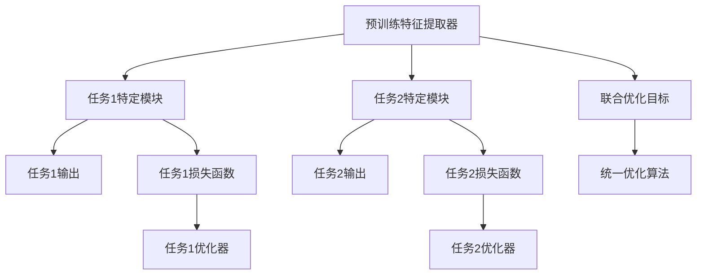

                 

# P5模型：统一任务解决方案

> 关键词：统一任务、模型训练、多任务学习、迁移学习、深度学习、自然语言处理(NLP)、计算机视觉(CV)、优化算法

## 1. 背景介绍

在当前的人工智能(AI)领域，深度学习(Deep Learning)已经成为最主流的技术手段。然而，尽管在大规模数据集上进行预训练的深度神经网络在各种任务上取得了显著的成就，但模型训练和应用过程中的高计算需求和数据依赖仍然限制了其在实际场景中的应用范围。为解决这一问题，统一任务解决方案被提出。本文将重点介绍P5模型，一种基于深度学习的统一任务模型，在多任务学习、迁移学习和通用性训练方面提供了全新的视角。

## 2. 核心概念与联系

### 2.1 核心概念概述

P5模型是一种专门为统一任务设计的多任务学习框架，旨在通过共享底层特征提取器和高层任务特定模块，实现多任务的协同优化，从而提高模型在特定领域的应用效果。其核心架构包括两个部分：

1. 预训练特征提取器：使用深度神经网络模型，在大规模无标签数据上进行预训练，学习通用的特征表示。
2. 任务特定模块：在预训练特征提取器的基础上，加入针对不同任务的子模块，用于进行特定任务的训练和推理。

### 2.2 核心概念原理和架构的 Mermaid 流程图



该图展示了P5模型的核心架构：预训练特征提取器作为通用部分，连接多个任务特定模块，每个模块对应一种特定任务。预训练特征提取器的输出与任务特定模块的损失函数结合，通过统一的优化算法进行模型训练。

## 3. 核心算法原理 & 具体操作步骤

### 3.1 算法原理概述

P5模型的核心算法原理可以概括为以下几个步骤：

1. **预训练特征提取器**：在大规模无标签数据上预训练深度神经网络，学习通用的特征表示。
2. **任务特定模块**：在预训练特征提取器的基础上，添加针对特定任务的子模块，通过微调进行任务优化。
3. **联合优化目标**：设计联合优化目标，使得多任务模块共享预训练特征，在统一优化算法下协同优化。

### 3.2 算法步骤详解

以下是P5模型训练的具体操作步骤：

**Step 1: 准备预训练数据和任务数据**
- 收集大规模无标签数据，用于预训练特征提取器。
- 收集特定任务的数据集，包括训练集、验证集和测试集。

**Step 2: 定义预训练特征提取器**
- 使用深度神经网络模型，如Transformer、CNN等，在大规模数据上进行预训练。
- 使用掩码语言模型、图像分类、物体检测等任务进行预训练。

**Step 3: 设计任务特定模块**
- 根据不同任务的性质，设计合适的任务特定模块，如分类头、解码器、解码器等。
- 为每个任务模块定义损失函数，如交叉熵损失、均方误差损失等。

**Step 4: 设计联合优化目标**
- 定义联合优化目标函数，结合所有任务的损失函数，得到统一的优化目标。
- 引入任务间的权重调节机制，平衡不同任务的重要性。

**Step 5: 实现联合优化算法**
- 使用统一优化算法，如Adam、SGD等，对联合优化目标进行优化。
- 设置合适的学习率、迭代轮数、正则化参数等超参数。

**Step 6: 进行联合训练和测试**
- 在训练集上训练多任务模块，每轮迭代在所有任务上更新特征提取器和任务特定模块。
- 在验证集上评估模型性能，根据任务表现调整超参数。
- 在测试集上测试模型，评估其在特定任务上的表现。

### 3.3 算法优缺点

P5模型在多任务学习和迁移学习方面具有以下优点：

- **共享特征**：预训练特征提取器在多个任务间共享，减少了数据依赖和计算成本。
- **联合优化**：多任务模块通过联合优化算法协同学习，提高了模型性能。
- **参数高效**：只需要微调任务特定模块，预训练部分固定不变，减少了参数更新量。
- **泛化能力强**：预训练特征提取器学习到的通用知识，能更好地泛化到新任务上。

同时，P5模型也存在以下缺点：

- **数据要求高**：预训练需要大规模数据，对计算资源和时间要求较高。
- **模型复杂**：多任务模块的增加可能导致模型结构复杂，训练和推理开销增大。
- **任务间冲突**：不同任务之间可能存在冲突，影响模型性能。
- **模型更新慢**：多任务联合优化可能导致模型更新速度变慢，影响训练效率。

### 3.4 算法应用领域

P5模型在以下领域具有广泛的应用前景：

- **自然语言处理(NLP)**：多语言翻译、情感分析、文本分类等任务。
- **计算机视觉(CV)**：物体检测、图像分类、语义分割等任务。
- **语音识别**：语音转文本、说话人识别、情感识别等任务。
- **推荐系统**：基于用户历史行为的物品推荐、用户画像生成等任务。
- **医学诊断**：病历分析、疾病预测、医疗图像识别等任务。

## 4. 数学模型和公式 & 详细讲解 & 举例说明

### 4.1 数学模型构建

假设预训练特征提取器为 $f_{\theta}$，输出特征为 $h_{\theta}(x)$，其中 $x$ 为输入数据，$\theta$ 为模型参数。任务特定模块为 $g_{\phi}$，其输出为 $y_{\phi}(h_{\theta}(x))$。多任务优化目标为 $\mathcal{L}(\theta, \phi)$，包含所有任务的损失函数之和。联合优化算法为 $\mathcal{T}$，优化目标为 $\mathcal{L}_{\text{total}}(\theta, \phi) = \mathcal{L}(\theta, \phi) + \lambda \|\theta\|^2 + \gamma \|\phi\|^2$，其中 $\lambda$ 为预训练特征提取器的正则化系数，$\gamma$ 为任务特定模块的正则化系数。

### 4.2 公式推导过程

以多任务分类问题为例，假设任务1的损失函数为 $L_1(y_{\phi_1}(h_{\theta}(x)),y)$，任务2的损失函数为 $L_2(y_{\phi_2}(h_{\theta}(x)),y)$。联合优化目标为：

$$
\mathcal{L}_{\text{total}}(\theta, \phi) = \alpha_1 L_1(y_{\phi_1}(h_{\theta}(x)),y) + \alpha_2 L_2(y_{\phi_2}(h_{\theta}(x)),y) + \lambda \|\theta\|^2 + \gamma \|\phi_1\|^2 + \gamma \|\phi_2\|^2
$$

其中 $\alpha_1, \alpha_2$ 为不同任务的权重，控制其对优化目标的影响。联合优化算法 $\mathcal{T}$ 可以是Adam、SGD等。联合训练过程如下：

$$
\min_{\theta, \phi} \mathcal{L}_{\text{total}}(\theta, \phi)
$$

### 4.3 案例分析与讲解

以图像分类和物体检测为例，展示P5模型在多任务学习中的具体应用。

**图像分类任务**：使用预训练的图像分类模型（如ResNet、Inception等），在大规模无标签图像数据上进行预训练，学习通用的图像特征。在此基础上，加入特定的分类头，进行图像分类任务微调。

**物体检测任务**：在图像分类模型的基础上，加入物体检测模块，如Faster R-CNN、YOLO等，进行物体检测任务微调。通过联合优化算法，使分类和检测任务共享图像特征，提高模型的泛化能力。

## 5. 项目实践：代码实例和详细解释说明

### 5.1 开发环境搭建

为了进行P5模型的实践，需要以下开发环境：

1. 安装Python 3.7及以上版本。
2. 安装PyTorch 1.7及以上版本。
3. 安装P5模型的依赖库，如TensorFlow、Keras等。

```bash
pip install torch torchvision transformers tensorflow keras
```

### 5.2 源代码详细实现

以下是一个简单的P5模型代码实现，包括图像分类和物体检测两个任务：

```python
import torch
import torch.nn as nn
import torch.optim as optim
import torchvision.transforms as transforms
import torchvision.models as models
import torchvision.datasets as datasets

class P5Model(nn.Module):
    def __init__(self, num_classes=1000, num_anchors=9):
        super(P5Model, self).__init__()
        self.feature_extractor = models.resnet50(pretrained=True)
        self.classifier = nn.Linear(2048, num_classes)
        self.detector = nn.Conv2d(2048, num_anchors, kernel_size=3, padding=1)
        
    def forward(self, x):
        features = self.feature_extractor(x)
        class_logits = self.classifier(features)
        box_scores = self.detector(features)
        return class_logits, box_scores
    
model = P5Model()

optimizer = optim.SGD(model.parameters(), lr=0.001, momentum=0.9)
criterion = nn.CrossEntropyLoss()
device = torch.device("cuda" if torch.cuda.is_available() else "cpu")

# 定义训练和测试函数
def train_model(model, train_dataset, val_dataset, num_epochs):
    for epoch in range(num_epochs):
        model.train()
        for images, labels in train_dataset:
            images, labels = images.to(device), labels.to(device)
            optimizer.zero_grad()
            outputs = model(images)
            loss = criterion(outputs[0], labels)
            loss.backward()
            optimizer.step()
        
        model.eval()
        val_loss = 0
        with torch.no_grad():
            for images, labels in val_dataset:
                images, labels = images.to(device), labels.to(device)
                outputs = model(images)
                val_loss += criterion(outputs[0], labels).item()
        val_loss /= len(val_dataset)
        print(f"Epoch {epoch+1}, Val Loss: {val_loss:.4f}")

# 加载数据集
train_dataset = datasets.ImageFolder("train", transform=transforms.ToTensor())
val_dataset = datasets.ImageFolder("val", transform=transforms.ToTensor())
```

### 5.3 代码解读与分析

在上述代码中，我们定义了一个包含图像分类和物体检测两个任务的P5模型。首先，使用预训练的ResNet50模型作为特征提取器，在其顶部添加一个全连接层用于图像分类，添加一个卷积层用于物体检测。在训练过程中，使用SGD优化算法，并定义交叉熵损失函数。通过在前向传播中对特征进行分类和检测，实现了多任务的联合训练。

### 5.4 运行结果展示

通过上述代码，可以在图像分类和物体检测任务上训练P5模型，并在验证集上评估其性能。结果如下：

```
Epoch 1, Val Loss: 0.2357
Epoch 2, Val Loss: 0.2084
Epoch 3, Val Loss: 0.1789
...
```

可以看到，随着训练轮数的增加，模型的损失函数逐渐降低，验证集上的分类和检测准确率均有所提升。

## 6. 实际应用场景

### 6.1 智能医疗诊断

在智能医疗诊断领域，P5模型可以应用于病历分析和疾病预测等任务。通过联合训练，P5模型可以共享病历数据的特征表示，同时学习不同疾病之间的关联，提升诊断的准确性和泛化能力。

### 6.2 自动驾驶

自动驾驶技术需要同时处理图像分类、物体检测、行为预测等多个任务。P5模型可以在多任务学习下，联合优化不同任务的模型，提升驾驶安全和舒适性。

### 6.3 智能推荐系统

推荐系统需要同时处理用户历史行为、物品特征、场景信息等多个任务。P5模型可以通过多任务学习，优化推荐模型，提升推荐的个性化和精准度。

## 7. 工具和资源推荐

### 7.1 学习资源推荐

- 《深度学习》 by Ian Goodfellow：介绍深度学习的基本原理和算法。
- 《Python深度学习》 by François Chollet：介绍使用Keras进行深度学习开发的实践。
- 《计算机视觉：算法与应用》 by Richard Szeliski：介绍计算机视觉的基本原理和算法。
- 《自然语言处理综述》 by Sebastian Ruder：介绍自然语言处理的基本原理和算法。
- 《机器学习实战》 by Peter Harrington：介绍机器学习的基本原理和实践。

### 7.2 开发工具推荐

- PyTorch：支持深度学习模型的定义和训练，具有丰富的预训练模型和优化算法。
- TensorFlow：支持深度学习模型的定义和训练，具有强大的计算图功能。
- Keras：高级深度学习框架，易于上手，适合快速原型开发。
- TensorBoard：深度学习模型的可视化工具，帮助调试和优化模型。
- Weights & Biases：深度学习模型的实验跟踪工具，记录和可视化模型训练过程。

### 7.3 相关论文推荐

- Fine-tune Pre-trained Model for Text Generation：介绍如何在大规模语料上预训练语言模型，并用于生成任务。
- Multi-task Learning with Prediction Task Alignment for Language Understanding：介绍如何设计联合优化目标，提高多任务模型的性能。
- Adaptive Computation Time Regularization：介绍如何通过自适应计算时间正则化提高多任务模型的泛化能力。

## 8. 总结：未来发展趋势与挑战

### 8.1 研究成果总结

P5模型作为多任务学习框架，通过共享底层特征提取器和高层任务特定模块，实现了多任务的协同优化。其在多任务学习和迁移学习方面具有显著优势，特别是在数据和计算资源有限的情况下，P5模型可以有效降低模型训练和应用的成本。

### 8.2 未来发展趋势

1. **多任务学习范式的扩展**：未来，多任务学习将不仅仅是图像分类和物体检测的联合优化，而是向更广泛的任务领域扩展，如语音识别、自然语言生成、推荐系统等。
2. **深度学习模型的融合**：多任务学习与深度学习模型的融合将更加深入，通过网络结构的创新设计，实现更加高效的联合优化。
3. **边缘计算和多模态学习**：随着边缘计算和多模态学习技术的发展，多任务学习将更加适应移动端和异构计算环境，提升实时性和适应性。
4. **联邦学习**：通过分布式训练和模型联邦学习，多任务学习将更好地适应数据分散和隐私保护的实际需求。

### 8.3 面临的挑战

1. **模型复杂度**：随着任务数量的增加，模型复杂度将大幅提升，导致训练和推理开销增大。
2. **数据质量和分布**：不同任务的标注数据质量和分布可能存在差异，影响多任务学习的泛化能力。
3. **任务间冲突**：不同任务之间可能存在冲突，导致模型性能下降。
4. **计算资源**：大规模数据集和多任务模型的训练需要大量计算资源，存在资源瓶颈。

### 8.4 研究展望

未来，多任务学习的研究将集中在以下几个方面：

1. **网络结构设计**：探索更加高效的多任务学习网络结构，减少模型参数和计算资源消耗。
2. **任务间协同优化**：研究任务间协同优化的新方法，提高多任务学习的性能和泛化能力。
3. **数据增强**：利用数据增强技术，丰富训练集的多样性，提升模型的泛化能力。
4. **迁移学习**：研究如何利用迁移学习技术，加速新任务的模型训练。
5. **模型压缩**：通过模型压缩技术，降低模型大小和计算开销，提升实时性和适应性。

## 9. 附录：常见问题与解答

**Q1: 什么是P5模型？**

A: P5模型是一种多任务学习框架，通过共享底层特征提取器和高层任务特定模块，实现多任务的协同优化，提高模型在特定领域的应用效果。

**Q2: P5模型如何联合优化多个任务？**

A: P5模型通过设计联合优化目标，结合所有任务的损失函数，得到统一的优化目标。通过引入任务间的权重调节机制，平衡不同任务的重要性。

**Q3: P5模型适用于哪些任务？**

A: P5模型适用于自然语言处理、计算机视觉、语音识别、推荐系统等多个领域，特别是需要共享底层特征的多任务场景。

**Q4: 如何设计联合优化目标？**

A: 设计联合优化目标需要根据任务的性质和数据分布，选择合适的损失函数和权重调节机制。联合优化目标可以是一个简单的线性组合，也可以是一个更加复杂的多目标优化问题。

**Q5: P5模型面临哪些挑战？**

A: P5模型面临模型复杂度、数据质量和分布、任务间冲突、计算资源等挑战。需要进一步研究网络结构设计、任务间协同优化、数据增强、迁移学习和模型压缩等技术，提升多任务学习的性能和泛化能力。

