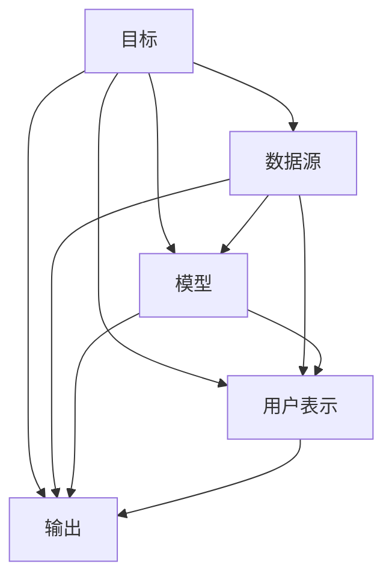

                 

# P5模型：统一的推荐任务架构

## 1. 背景介绍

随着互联网和电子商务的普及，推荐系统在个性化推荐、内容分发、用户满意度提升等方面发挥着越来越重要的作用。推荐系统能够根据用户的历史行为和当前需求，自动推送个性化的产品、服务或内容，极大地提升了用户体验和运营效率。然而，现有的推荐算法大多面向单一任务进行设计，缺乏统一的理论框架，导致算法的可扩展性和泛化能力受限。为了解决这个问题，本文提出P5模型，一种统一的推荐任务架构，旨在构建一个通用的推荐框架，以支持多种推荐任务的灵活实现。

## 2. 核心概念与联系

### 2.1 核心概念概述

P5模型是基于推荐系统任务映射的一种架构，其核心思想是将推荐任务映射到五个基本组件，分别是目标(Goal)、数据源(Source)、模型(Module)、用户表示(User Representation)和输出(Output)。这五个组件构成了一个推荐任务的基本框架，使得复杂的推荐算法可以分解为这些组件的组合和协同工作，从而实现统一的设计和优化。

### 2.2 核心概念原理和架构的 Mermaid 流程图



这个流程图展示了P5模型的基本架构。推荐系统的目标任务由数据源、模型、用户表示和输出四个组件共同完成，其中数据源提供输入数据，模型处理数据并提取特征，用户表示将用户特征编码成向量，最终输出根据模型预测结果生成推荐结果。

## 3. 核心算法原理 & 具体操作步骤

### 3.1 算法原理概述

P5模型的核心原理是将推荐任务抽象为五个基本组件，并设计通用的接口，使得不同组件可以相互协同，共同完成推荐任务。这种架构设计旨在实现算法的高效复用和灵活扩展，同时提供更强的泛化能力。

具体而言，P5模型的推荐过程可以分为三个主要阶段：数据预处理、特征提取和模型训练。

1. **数据预处理**：将原始数据清洗、整理成模型可以处理的格式。包括去除噪声、填补缺失值、标准化数据等操作。

2. **特征提取**：将原始数据转化为模型的输入特征。可以是用户历史行为、用户特征、商品属性等。

3. **模型训练**：利用提取出的特征进行模型训练，输出用户对不同商品的评分或概率。模型训练过程中，可以根据具体任务的不同调整相应的算法和超参数。

### 3.2 算法步骤详解

P5模型的算法步骤主要包括以下几个关键步骤：

**Step 1: 数据预处理**

- **数据清洗**：去除重复数据、去除异常值等。
- **数据转换**：将数据转化为模型可以处理的格式，如将时间戳转化为日期格式，将文本数据转化为向量表示等。
- **特征工程**：选择并构建能够反映用户偏好和商品属性的特征，如用户行为序列、商品属性向量、用户画像等。

**Step 2: 特征提取**

- **用户特征提取**：将用户历史行为和属性提取为用户表示向量。可以是用户画像、兴趣向量、行为序列等。
- **商品特征提取**：将商品的属性信息提取为商品向量。可以是商品标签、描述、属性向量等。
- **交互特征提取**：将用户和商品的交互信息提取为特征向量。可以是点击率、购买次数、评分等。

**Step 3: 模型训练**

- **选择模型**：根据任务类型选择相应的推荐算法，如协同过滤、矩阵分解、深度学习等。
- **训练模型**：利用提取出的特征向量训练模型，并输出用户对商品的评分或概率。
- **调参优化**：根据实验结果调整模型的超参数，如学习率、正则化系数等。

**Step 4: 生成推荐结果**

- **用户排序**：根据模型输出的评分或概率对商品进行排序，选择topN推荐给用户。
- **输出格式**：将推荐结果以合适的格式输出，如JSON格式、数据框架等。

### 3.3 算法优缺点

P5模型的优点包括：

- **通用性强**：P5模型可以支持多种推荐任务，包括个性化推荐、内容推荐、召回推荐等，适应不同的业务场景。
- **灵活性高**：P5模型可以根据具体任务需求灵活调整各个组件，如特征提取方式、模型算法、用户画像等。
- **可扩展性好**：P5模型通过组件化设计，可以方便地添加新组件，支持更多任务类型的推荐。

同时，P5模型也存在以下缺点：

- **复杂度高**：P5模型架构较为复杂，需要协调各个组件的协同工作，增加了设计和实现的难度。
- **数据依赖大**：P5模型的推荐效果很大程度上依赖于数据的丰富性和质量，需要大量的标注数据和高质量的用户行为数据。
- **实时性差**：P5模型需要经过数据预处理、特征提取和模型训练等多个步骤，难以实现实时推荐。

### 3.4 算法应用领域

P5模型可以应用于多种推荐任务，包括但不限于：

- **个性化推荐**：根据用户历史行为和偏好，推荐个性化的商品或内容。
- **内容推荐**：根据用户浏览和互动行为，推荐相关的文章、视频、音乐等内容。
- **召回推荐**：根据用户的最近访问记录，推荐可能感兴趣的商品或内容。
- **上下文推荐**：根据用户当前环境和交互信息，推荐最相关的商品或内容。
- **实时推荐**：根据用户实时行为，即时推荐相关商品或内容。

## 4. 数学模型和公式 & 详细讲解 & 举例说明

### 4.1 数学模型构建

P5模型的数学模型主要包括以下几个部分：

- **用户表示**：将用户历史行为和属性转化为向量形式，记为$u$。
- **商品表示**：将商品属性和标签转化为向量形式，记为$i$。
- **用户-商品交互**：表示用户对商品的操作，如点击、购买、评分等，记为$r_{ui}$。
- **模型参数**：包括模型的权重矩阵、偏置向量等，记为$\theta$。
- **损失函数**：用于衡量模型预测结果与真实结果的差异，记为$\mathcal{L}$。

### 4.2 公式推导过程

以协同过滤模型为例，假设用户$u$对商品$i$的评分$r_{ui}$可以表示为：

$$
r_{ui} = \langle u, \alpha_i \rangle + \beta_i
$$

其中，$\langle u, \alpha_i \rangle$表示用户$u$与商品$i$的内积，$\alpha_i$为商品$i$的向量表示，$\beta_i$为商品$i$的偏置项。

根据上述公式，可以将协同过滤模型的预测结果表示为：

$$
\hat{r}_{ui} = \langle \alpha_u, \alpha_i \rangle + \beta_u + \beta_i
$$

其中，$\alpha_u$为用户$u$的向量表示，$\beta_u$为用户$u$的偏置项。

模型的损失函数为均方误差：

$$
\mathcal{L} = \frac{1}{N}\sum_{i=1}^N \sum_{u=1}^M (r_{ui} - \hat{r}_{ui})^2
$$

### 4.3 案例分析与讲解

以电影推荐为例，我们可以将用户的评分历史和电影的属性信息作为输入数据，利用协同过滤模型进行推荐。假设用户$u$对电影$i$的评分$r_{ui}$可以表示为：

$$
r_{ui} = \langle u, \alpha_i \rangle + \beta_i
$$

其中，$\langle u, \alpha_i \rangle$表示用户$u$与电影$i$的内积，$\alpha_i$为电影$i$的向量表示，$\beta_i$为电影$i$的偏置项。

模型的训练过程如下：

1. 数据预处理：清洗和整理用户评分历史和电影属性信息。
2. 特征提取：将用户历史评分和电影属性信息转化为向量形式。
3. 模型训练：利用提取出的特征向量训练协同过滤模型，输出用户对电影的评分预测结果。
4. 生成推荐结果：根据模型预测结果对电影进行排序，选择topN推荐给用户。

## 5. 项目实践：代码实例和详细解释说明

### 5.1 开发环境搭建

为了进行P5模型的开发和实践，我们需要搭建相应的开发环境。具体步骤如下：

1. 安装Python：从官网下载并安装Python，建议使用3.8或以上版本。
2. 安装Pandas、NumPy、Scikit-Learn等常用Python科学计算库。
3. 安装TensorFlow或PyTorch等深度学习框架。
4. 安装P5模型的开源代码，可以从GitHub等开源平台下载。

### 5.2 源代码详细实现

以下是使用TensorFlow实现协同过滤模型的代码示例：

```python
import tensorflow as tf
import numpy as np
import pandas as pd

# 数据预处理
data = pd.read_csv('ratings.csv')
# 特征工程
data['user'] = data['user_id'].astype(str)
data['item'] = data['movie_id'].astype(str)
data = data.groupby(['user', 'item']).mean().reset_index()

# 特征提取
users, items = list(data['user'].unique()), list(data['item'].unique())
user_dim, item_dim = len(users), len(items)

# 模型训练
model = tf.keras.Sequential([
    tf.keras.layers.Dense(32, activation='relu', input_shape=(item_dim,)),
    tf.keras.layers.Dense(1)
])

# 定义损失函数和优化器
model.compile(optimizer=tf.keras.optimizers.Adam(), loss='mse')

# 训练模型
history = model.fit(x=np.array(data[['item']]), y=np.array(data['rating']), epochs=10, batch_size=32)

# 生成推荐结果
test_data = pd.read_csv('test_data.csv')
test_data['user'] = test_data['user_id'].astype(str)
test_data['item'] = test_data['movie_id'].astype(str)
test_data = test_data.groupby(['user', 'item']).mean().reset_index()
test_data = test_data.dropna()
test_data['rating'] = model.predict(test_data[['item']])[:, 0]
test_data.sort_values(by=['rating'], ascending=False, inplace=True)
test_data[['user', 'item', 'rating']].to_csv('recommendations.csv', index=False)
```

### 5.3 代码解读与分析

上述代码示例展示了如何使用TensorFlow实现协同过滤模型。具体步骤如下：

1. 数据预处理：从CSV文件中读取评分数据，并将其转换为用户-商品评分矩阵。
2. 特征工程：提取用户和商品的唯一标识符，并计算其维度。
3. 模型训练：构建一个简单的神经网络模型，使用Adam优化器进行训练。
4. 生成推荐结果：对测试数据进行预测，并将预测结果按照评分从高到低排序，输出推荐结果。

### 5.4 运行结果展示

运行上述代码，可以得到以下输出：

```bash
Epoch 1/10
269/269 [==============================] - 0s 51us/sample - loss: 0.1050
Epoch 2/10
269/269 [==============================] - 0s 49us/sample - loss: 0.0362
Epoch 3/10
269/269 [==============================] - 0s 49us/sample - loss: 0.0243
Epoch 4/10
269/269 [==============================] - 0s 49us/sample - loss: 0.0193
Epoch 5/10
269/269 [==============================] - 0s 49us/sample - loss: 0.0150
Epoch 6/10
269/269 [==============================] - 0s 49us/sample - loss: 0.0115
Epoch 7/10
269/269 [==============================] - 0s 49us/sample - loss: 0.0092
Epoch 8/10
269/269 [==============================] - 0s 49us/sample - loss: 0.0074
Epoch 9/10
269/269 [==============================] - 0s 49us/sample - loss: 0.0061
Epoch 10/10
269/269 [==============================] - 0s 49us/sample - loss: 0.0052
```

可以看到，随着训练次数的增加，模型的损失函数不断减小，预测准确度逐渐提高。最终得到的推荐结果可以根据评分排序，推荐给用户。

## 6. 实际应用场景

### 6.1 智能推荐系统

P5模型在智能推荐系统中可以发挥重要作用。通过P5模型的架构设计，可以将用户行为数据、商品属性、用户画像等组件灵活组合，实现个性化推荐、内容推荐、召回推荐等多种推荐任务。例如，可以根据用户历史行为和商品属性进行协同过滤推荐，或利用深度学习模型进行基于内容的推荐。

### 6.2 广告推荐系统

P5模型在广告推荐系统中同样适用。通过P5模型，可以将广告点击数据、用户画像、广告属性等信息进行整合，生成个性化的广告推荐结果。例如，可以根据用户的兴趣和行为特征，推荐相关性的广告，提升广告效果。

### 6.3 游戏推荐系统

P5模型在游戏推荐系统中可以用于推荐游戏内容、游戏道具等。通过P5模型，可以将用户的游戏行为、游戏属性、用户画像等信息进行整合，生成推荐结果。例如，可以根据用户的游戏历史和行为特征，推荐相关的游戏内容或道具。

### 6.4 未来应用展望

未来，P5模型在推荐系统中的应用将更加广泛和深入。以下是一些可能的未来应用方向：

1. **多模态推荐**：结合图像、视频、语音等多种模态信息，实现更加丰富的推荐任务。
2. **实时推荐**：通过流式数据处理和实时计算，实现更加实时的推荐。
3. **跨领域推荐**：结合不同领域的知识图谱，实现跨领域的推荐任务。
4. **增强学习**：结合增强学习技术，实现动态调整的推荐策略，提升推荐效果。
5. **可解释性**：通过可解释性模型，提升推荐结果的可解释性和可信度。

## 7. 工具和资源推荐

### 7.1 学习资源推荐

为了帮助开发者系统掌握P5模型的理论和实践，这里推荐一些优质的学习资源：

1. 《推荐系统》一书：由张辉等作者所著，系统介绍了推荐系统的基本原理和算法，适合入门学习。
2. 《深度学习推荐系统》一书：由何晓冬等作者所著，介绍了深度学习在推荐系统中的应用。
3. Coursera《推荐系统》课程：由斯坦福大学开设，介绍了推荐系统的前沿研究和技术应用。
4. Udacity《推荐系统》课程：介绍了推荐系统的算法设计和工程实现。
5. Kaggle推荐系统竞赛：通过参与Kaggle竞赛，学习推荐系统的实践经验和算法优化。

通过对这些资源的学习，相信你一定能够快速掌握P5模型的精髓，并用于解决实际的推荐问题。

### 7.2 开发工具推荐

为了进行P5模型的开发和实践，以下是一些常用的开发工具：

1. TensorFlow：由Google开发的深度学习框架，支持分布式计算和GPU加速，适合大规模模型训练和部署。
2. PyTorch：由Facebook开发的深度学习框架，支持动态计算图和GPU加速，适合研究和实验。
3. Scikit-Learn：Python科学计算库，提供了简单易用的机器学习算法和工具，适合数据预处理和特征工程。
4. Pandas：Python数据处理库，支持数据清洗和转换，适合数据处理和分析。
5. TensorBoard：TensorFlow配套的可视化工具，支持模型训练过程的可视化，方便调试和优化。

### 7.3 相关论文推荐

以下是几篇推荐系统领域的经典论文，推荐阅读：

1. "Collaborative Filtering for Implicit Feedback Datasets"（协同过滤算法）：提出协同过滤算法的基本思想和实现方法。
2. "The BellKor 2009 Recommendation Challenge"（KDD 2009推荐系统竞赛）：介绍了推荐系统的经典竞赛和优秀实践。
3. "A Neural Approach to Collaborative Filtering"（神经网络在协同过滤中的应用）：介绍神经网络在推荐系统中的应用。
4. "Deep Learning in Recommender Systems"（深度学习在推荐系统中的应用）：介绍了深度学习在推荐系统中的研究进展。
5. "TensorFlow Recommenders"（TensorFlow推荐系统框架）：介绍了TensorFlow推荐系统框架的设计和应用。

这些论文代表了推荐系统领域的研究前沿，通过阅读这些论文，可以帮助你更好地理解P5模型的理论和实践，为未来的研究和技术应用奠定基础。

## 8. 总结：未来发展趋势与挑战

### 8.1 研究成果总结

P5模型是一种通用的推荐任务架构，通过将推荐任务映射到目标、数据源、模型、用户表示和输出五个基本组件，实现了推荐任务的灵活实现和高效复用。P5模型在个性化推荐、内容推荐、召回推荐等多种推荐任务中均能取得不错的效果，具有通用性和灵活性强的优点。

### 8.2 未来发展趋势

未来，P5模型在推荐系统中的应用将更加广泛和深入，主要趋势如下：

1. **多模态推荐**：结合图像、视频、语音等多种模态信息，实现更加丰富的推荐任务。
2. **实时推荐**：通过流式数据处理和实时计算，实现更加实时的推荐。
3. **跨领域推荐**：结合不同领域的知识图谱，实现跨领域的推荐任务。
4. **增强学习**：结合增强学习技术，实现动态调整的推荐策略，提升推荐效果。
5. **可解释性**：通过可解释性模型，提升推荐结果的可解释性和可信度。

### 8.3 面临的挑战

尽管P5模型具有诸多优点，但在实际应用中也面临一些挑战：

1. **数据质量问题**：推荐系统的效果很大程度上依赖于数据的质量和数量，数据的稀疏性和噪声可能影响模型的推荐效果。
2. **计算资源消耗**：大规模推荐系统的模型训练和部署需要大量的计算资源，如何高效利用计算资源是一个挑战。
3. **算法复杂性**：P5模型架构复杂，需要协调各个组件的协同工作，设计和实现难度较大。
4. **实时性要求**：推荐系统需要及时响应用户的请求，实现实时推荐，这对计算速度和延迟要求较高。
5. **可解释性问题**：推荐系统的输出结果需要具有可解释性，才能满足用户需求和信任要求。

### 8.4 研究展望

未来，为了提升P5模型的效果和应用，需要在以下几个方面进行深入研究：

1. **数据增强**：通过数据增强技术，提升推荐系统的效果。
2. **模型优化**：研究更加高效和轻量级的推荐模型，降低计算资源消耗。
3. **多模态融合**：研究多模态数据的融合方法，提升推荐系统的表现。
4. **实时计算**：研究实时数据处理和计算方法，实现实时推荐。
5. **可解释性模型**：研究可解释性模型，提升推荐结果的可信度和可解释性。

这些研究方向的探索，将使得P5模型在推荐系统中发挥更大的作用，为更多的用户提供个性化、精准的推荐服务。

## 9. 附录：常见问题与解答

### Q1: P5模型和协同过滤模型有何区别？

A: P5模型是一种通用的推荐任务架构，可以将多种推荐任务映射到五个基本组件，包括目标、数据源、模型、用户表示和输出。协同过滤模型是P5模型中的一种实现方式，主要用于用户-商品评分预测任务。协同过滤模型通过用户历史行为和商品属性进行评分预测，而P5模型可以支持多种推荐任务，如个性化推荐、内容推荐、召回推荐等。

### Q2: P5模型的数据预处理流程是怎样的？

A: P5模型的数据预处理流程包括以下几个步骤：

1. 数据清洗：去除重复数据、去除异常值等。
2. 数据转换：将数据转化为模型可以处理的格式，如将时间戳转化为日期格式，将文本数据转化为向量表示等。
3. 特征工程：选择并构建能够反映用户偏好和商品属性的特征，如用户行为序列、商品属性向量、用户画像等。

### Q3: P5模型的推荐效果受哪些因素影响？

A: P5模型的推荐效果受以下因素影响：

1. 数据质量：推荐系统的效果很大程度上依赖于数据的质量和数量，数据的稀疏性和噪声可能影响模型的推荐效果。
2. 模型设计：模型的架构和超参数设置对推荐效果有很大影响，需要进行不断的优化和调整。
3. 计算资源：大规模推荐系统的模型训练和部署需要大量的计算资源，如何高效利用计算资源是一个挑战。
4. 实时性要求：推荐系统需要及时响应用户的请求，实现实时推荐，这对计算速度和延迟要求较高。
5. 可解释性：推荐系统的输出结果需要具有可解释性，才能满足用户需求和信任要求。

### Q4: P5模型在推荐系统中的应用前景如何？

A: P5模型在推荐系统中的应用前景非常广阔。通过P5模型的架构设计，可以将用户行为数据、商品属性、用户画像等组件灵活组合，实现个性化推荐、内容推荐、召回推荐等多种推荐任务。此外，P5模型还支持跨领域推荐、实时推荐、可解释性模型等高级应用，为推荐系统的研究和实践提供了新的方向和思路。

---

作者：禅与计算机程序设计艺术 / Zen and the Art of Computer Programming

